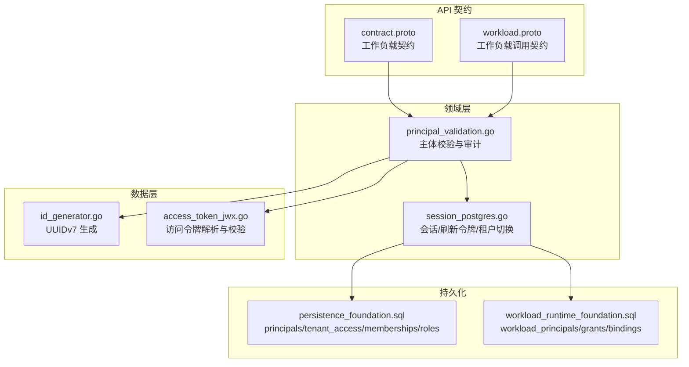
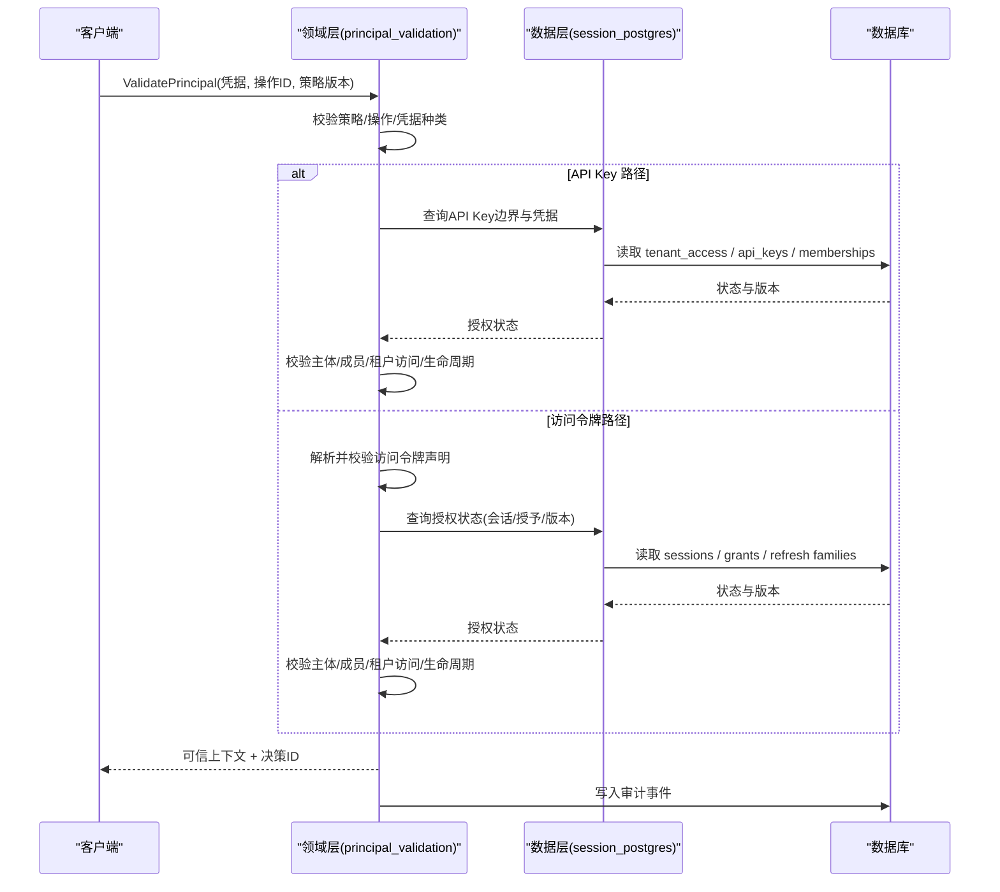
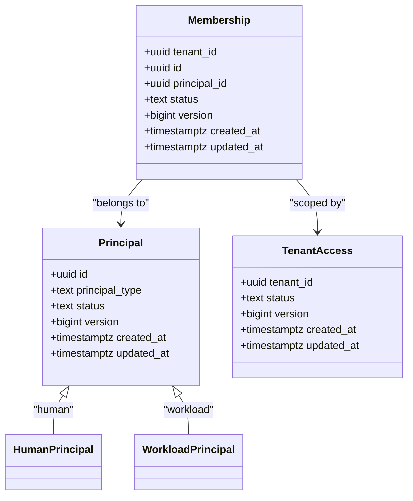
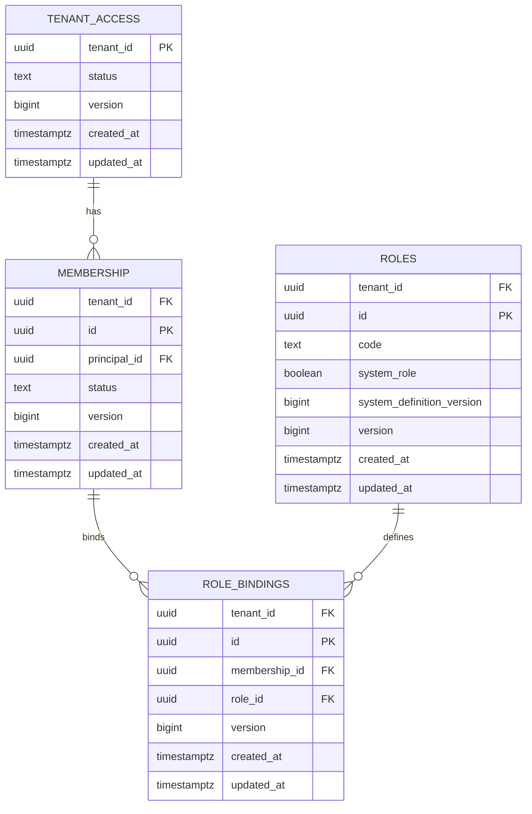
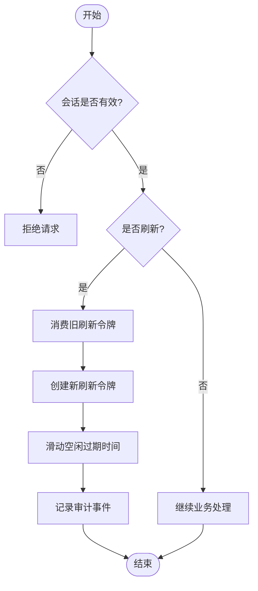
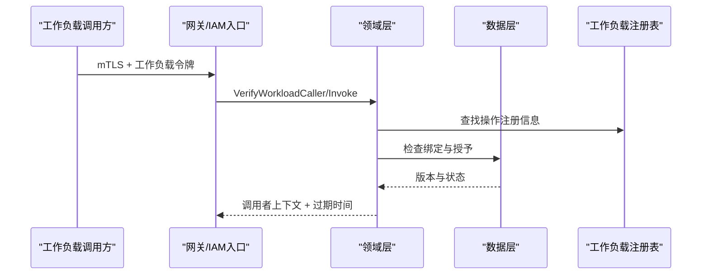
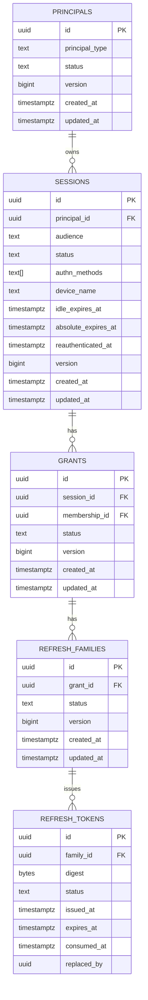
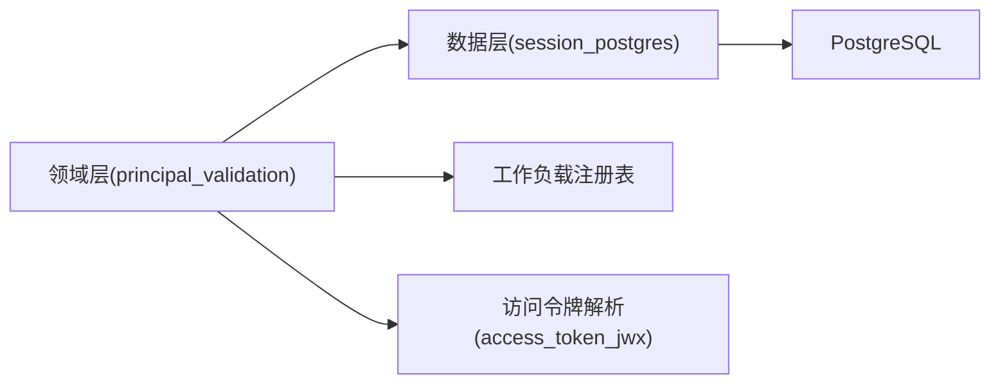

# 核心实体

<cite>
**本文引用的文件**
- [contract.proto](file://api/iam/v1/contract.proto)
- [workload.proto](file://api/iam/v1/workload.proto)
- [principal_validation.go](file://internal/biz/principal_validation.go)
- [session_postgres.go](file://internal/data/session_postgres.go)
- [id_generator.go](file://internal/data/id_generator.go)
- [202609040001_persistence_foundation.sql](file://migrations/202609040001_persistence_foundation.sql)
- [202609100001_workload_runtime_foundation.sql](file://migrations/202609100001_workload_runtime_foundation.sql)
- [access_token_jwx.go](file://internal/data/access_token_jwx.go)
</cite>

## 目录
1. [引言](#引言)
2. [项目结构](#项目结构)
3. [核心组件](#核心组件)
4. [架构总览](#架构总览)
5. [详细组件分析](#详细组件分析)
6. [依赖关系分析](#依赖关系分析)
7. [性能考虑](#性能考虑)
8. [故障排查指南](#故障排查指南)
9. [结论](#结论)
10. [附录](#附录)

## 引言
本文件聚焦 ANI IAM 的核心实体与数据模型，围绕 Principal、Tenant、Session 等关键概念，系统阐述其字段定义、数据类型、约束条件与业务规则；解释生命周期状态管理（如 principal_type 的 human/workload 区分、status 的状态转换规则）；说明 UUID v7 的使用规范与数据验证机制；并提供实体关系图、样本数据与最佳实践示例。文档同时覆盖实体间的继承关系与多态性设计，帮助读者从高层到代码层全面理解 ANI IAM 的核心建模思想。

## 项目结构
ANI IAM 将对外契约、领域逻辑与持久化实现分层组织：
- API 契约层：使用 Protobuf 定义跨语言稳定接口与枚举类型，包括 PrincipalType、PrincipalStatus、SessionStatus、GrantStatus、TenantAccessStatus 等。
- 领域层：封装认证、授权、会话、租户等用例与校验规则，不绑定具体框架。
- 数据层：通过 SQL 迁移与 sqlc 生成代码访问 PostgreSQL，实现会话、刷新令牌族、审计事件等持久化。
- 迁移层：以 SQL 脚本定义表结构、约束、索引与触发器，确保运行时安全与一致性。

图表来源
- [contract.proto:21-78](file://api/iam/v1/contract.proto#L21-L78)
- [workload.proto:10-121](file://api/iam/v1/workload.proto#L10-L121)
- [principal_validation.go:80-358](file://internal/biz/principal_validation.go#L80-L358)
- [session_postgres.go:75-520](file://internal/data/session_postgres.go#L75-L520)
- [id_generator.go:5-13](file://internal/data/id_generator.go#L5-L13)
- [access_token_jwx.go:394-423](file://internal/data/access_token_jwx.go#L394-L423)
- [202609040001_persistence_foundation.sql:17-148](file://migrations/202609040001_persistence_foundation.sql#L17-L148)
- [202609100001_workload_runtime_foundation.sql:1-89](file://migrations/202609100001_workload_runtime_foundation.sql#L1-L89)

章节来源
- [contract.proto:21-78](file://api/iam/v1/contract.proto#L21-L78)
- [workload.proto:10-121](file://api/iam/v1/workload.proto#L10-L121)
- [principal_validation.go:80-358](file://internal/biz/principal_validation.go#L80-L358)
- [session_postgres.go:75-520](file://internal/data/session_postgres.go#L75-L520)
- [id_generator.go:5-13](file://internal/data/id_generator.go#L5-L13)
- [access_token_jwx.go:394-423](file://internal/data/access_token_jwx.go#L394-L423)
- [202609040001_persistence_foundation.sql:17-148](file://migrations/202609040001_persistence_foundation.sql#L17-L148)
- [202609100001_workload_runtime_foundation.sql:1-89](file://migrations/202609100001_workload_runtime_foundation.sql#L1-L89)

## 核心组件
本节概述核心实体的职责与边界：
- Principal（主体）：区分 human 与 workload，承载身份与状态，是所有权限与会话的拥有者。
- Tenant（租户）：隔离的业务边界，包含访问状态、成员关系、角色与绑定。
- Session（会话）：人类主体的登录会话，关联授权授予（grant）、刷新令牌族与审计事件。
- Workload（工作负载）：稳定的软件行为体，通过 mTLS 与工作负载注册表进行身份与授权校验。

章节来源
- [contract.proto:21-78](file://api/iam/v1/contract.proto#L21-L78)
- [workload.proto:27-121](file://api/iam/v1/workload.proto#L27-L121)
- [202609040001_persistence_foundation.sql:17-148](file://migrations/202609040001_persistence_foundation.sql#L17-L148)
- [202609100001_workload_runtime_foundation.sql:1-89](file://migrations/202609100001_workload_runtime_foundation.sql#L1-L89)

## 架构总览
下图展示核心实体在认证与授权流程中的交互：客户端凭据进入后，领域层根据策略选择 API Key 或访问令牌路径，分别校验主体、成员、租户访问与生命周期状态，最终产出可信上下文并记录审计事件。

图表来源
- [principal_validation.go:80-358](file://internal/biz/principal_validation.go#L80-L358)
- [session_postgres.go:75-520](file://internal/data/session_postgres.go#L75-L520)
- [202609040001_persistence_foundation.sql:100-148](file://migrations/202609040001_persistence_foundation.sql#L100-L148)

## 详细组件分析

### Principal（主体）
- 类型与状态
  - principal_type：human 或 workload，用于区分人与稳定软件行为体。
  - status：active 或 disabled，表示主体是否可用。
- 标识与约束
  - id：UUID v7，数据库层通过 CHECK 约束强制版本为 7。
  - version：乐观锁版本号，必须大于 0。
  - created_at/updated_at：时间戳，保证可审计与排序。
- 业务规则
  - 人类主体与工作负载主体在系统中严格分离，禁止混用。
  - 所有涉及主体的变更需记录审计事件，且受版本控制。
- 生命周期
  - active → disabled：禁用主体，影响后续认证与授权。
  - 被禁用的主体无法创建会话、刷新令牌或执行敏感操作。

图表来源
- [202609040001_persistence_foundation.sql:17-51](file://migrations/202609040001_persistence_foundation.sql#L17-L51)

章节来源
- [202609040001_persistence_foundation.sql:17-51](file://migrations/202609040001_persistence_foundation.sql#L17-L51)
- [principal_validation.go:222-239](file://internal/biz/principal_validation.go#L222-L239)

### Tenant（租户）
- 访问状态
  - bootstrap_pending：初始化中，尚未可用。
  - active：正常可用。
  - suspended：暂停，拒绝新访问。
- 成员与角色
  - tenant_memberships：主体在租户内的成员关系，支持 active/suspended/removed。
  - tenant_roles 与 tenant_role_bindings：角色定义与绑定，支持系统角色与版本控制。
- 约束
  - tenant_id 非零 UUID，且所有相关 ID 均为 UUID v7。
  - 唯一索引限制每个租户内同一主体仅有一个活跃成员关系。

图表来源
- [202609040001_persistence_foundation.sql:27-95](file://migrations/202609040001_persistence_foundation.sql#L27-L95)

章节来源
- [202609040001_persistence_foundation.sql:27-95](file://migrations/202609040001_persistence_foundation.sql#L27-L95)

### Session（会话）
- 状态
  - active：有效会话。
  - revoked：已撤销。
  - expired：已过期。
- 组成
  - 会话本身：包含设备名、空闲过期时间、绝对过期时间、重认证时间等。
  - 授予（grant）：按边界（租户/平台）授予的访问能力，带版本。
  - 刷新令牌族（family）与令牌（token）：用于续期与会话延续。
- 生命周期
  - 刷新：消费旧刷新令牌，生成新刷新令牌，滑动空闲过期时间。
  - 登出：撤销当前会话的所有刷新令牌、家族与授予。
  - 租户切换：在同一会话下切换到目标租户，必要时创建新的授予与刷新令牌族。

图表来源
- [session_postgres.go:75-165](file://internal/data/session_postgres.go#L75-L165)
- [session_postgres.go:268-350](file://internal/data/session_postgres.go#L268-L350)
- [session_postgres.go:352-498](file://internal/data/session_postgres.go#L352-L498)

章节来源
- [session_postgres.go:75-165](file://internal/data/session_postgres.go#L75-L165)
- [session_postgres.go:268-350](file://internal/data/session_postgres.go#L268-L350)
- [session_postgres.go:352-498](file://internal/data/session_postgres.go#L352-L498)

### Workload（工作负载）
- 身份绑定
  - workload_identity_bindings：环境、信任域、身份类型与值，唯一约束防止重复。
- 授权授予
  - workload_grants：限定 audience、operation、scope，确保最小权限。
- 在线校验
  - VerifyWorkloadCaller/VerifyWorkloadInvocation：结合 mTLS 与注册表，返回直接调用者与主题上下文。

图表来源
- [workload.proto:27-121](file://api/iam/v1/workload.proto#L27-L121)
- [202609100001_workload_runtime_foundation.sql:1-36](file://migrations/202609100001_workload_runtime_foundation.sql#L1-L36)

章节来源
- [workload.proto:27-121](file://api/iam/v1/workload.proto#L27-L121)
- [202609100001_workload_runtime_foundation.sql:1-36](file://migrations/202609100001_workload_runtime_foundation.sql#L1-L36)

### 实体关系图
下图汇总 Principal、Tenant、Session 及其相关实体的关系，体现继承与多态设计：
- Principal 通过 principal_type 多态区分为 human 与 workload。
- Session 属于 human 主体，并通过 grant/family/token 组合实现细粒度授权与续期。
- Tenant 通过 memberships 与 roles 管理主体权限。

图表来源
- [202609040001_persistence_foundation.sql:17-148](file://migrations/202609040001_persistence_foundation.sql#L17-L148)
- [202609100001_workload_runtime_foundation.sql:1-89](file://migrations/202609100001_workload_runtime_foundation.sql#L1-L89)

章节来源
- [202609040001_persistence_foundation.sql:17-148](file://migrations/202609040001_persistence_foundation.sql#L17-L148)
- [202609100001_workload_runtime_foundation.sql:1-89](file://migrations/202609100001_workload_runtime_foundation.sql#L1-L89)

## 依赖关系分析
- 领域层对数据层的依赖
  - principal_validation 依赖 session_postgres 提供的会话与授权查询。
  - 所有认证失败与成功均记录审计事件，依赖 iam_audit_events 表。
- 数据层对数据库的依赖
  - 通过 sqlc 生成的查询访问 principals、sessions、grants、refresh families/tokens、tenant_access、memberships、roles 等表。
  - 使用事务与行级锁保证并发安全（如刷新旋转、登出、租户切换）。
- 外部依赖
  - 工作负载调用依赖 workloadregistry 与 mTLS 身份。
  - 访问令牌解析依赖 JWK/JWT 库与声明校验。

图表来源
- [principal_validation.go:80-358](file://internal/biz/principal_validation.go#L80-L358)
- [session_postgres.go:75-520](file://internal/data/session_postgres.go#L75-L520)
- [access_token_jwx.go:394-423](file://internal/data/access_token_jwx.go#L394-L423)

章节来源
- [principal_validation.go:80-358](file://internal/biz/principal_validation.go#L80-L358)
- [session_postgres.go:75-520](file://internal/data/session_postgres.go#L75-L520)
- [access_token_jwx.go:394-423](file://internal/data/access_token_jwx.go#L394-L423)

## 性能考虑
- 会话刷新与登出使用行级锁与事务，避免竞态条件，提高一致性。
- 刷新令牌族与授予的版本控制减少全量扫描，提升并发安全性。
- 审计事件追加采用只写模式，便于高吞吐记录。
- 建议：
  - 合理设置空闲与绝对过期时间，平衡用户体验与安全。
  - 使用分页与游标查询成员与角色列表，避免大结果集。
  - 监控数据库锁等待与慢查询，优化热点路径。

[本节提供通用指导，无需特定文件引用]

## 故障排查指南
- 常见错误与原因
  - 凭据无效：API Key 不存在或已过期；访问令牌声明缺失或版本不合法。
  - 主体禁用：principal_status 非 active。
  - 成员关系无效：membership_status 非 active。
  - 租户访问受限：tenant_access_status 非 active 或生命周期阻塞/陈旧。
  - 会话状态异常：session/grant 非 active 或版本不匹配。
- 定位步骤
  - 检查审计事件 iam_audit_events，确认 action、target_type、reason。
  - 核对 principals、tenant_access、tenant_memberships、sessions、grants 的状态与版本。
  - 验证刷新令牌族与令牌的 digest、issued_at、expires_at 与替换关系。
- 恢复建议
  - 重新激活主体或成员关系。
  - 刷新会话或重新登录。
  - 更新策略版本并确保操作已注册。

章节来源
- [principal_validation.go:222-329](file://internal/biz/principal_validation.go#L222-L329)
- [session_postgres.go:540-576](file://internal/data/session_postgres.go#L540-L576)
- [202609040001_persistence_foundation.sql:100-148](file://migrations/202609040001_persistence_foundation.sql#L100-L148)

## 结论
ANI IAM 的核心实体以 Principal 为中心，通过 Tenant 与 Session 构建清晰的隔离与生命周期管理。principal_type 的 human/workload 区分确保了人类与工作负载的安全边界；严格的 UUID v7 约束与版本控制保障了标识的可预测性与一致性；会话刷新、登出与租户切换通过事务与行级锁实现强一致。整体设计兼顾可扩展性、可审计性与高性能，适合大规模多租户场景。

[本节总结性内容，无需特定文件引用]

## 附录

### UUID v7 使用规范与验证
- 生成
  - 使用 UUIDv7Generator 生成全局唯一且时间有序的 ID。
- 存储与校验
  - 数据库层通过 CHECK 约束确保 id 文本形式的第 15 位为 '7'，强制版本为 7。
  - 领域层在生成 ID 后校验版本，拒绝非法 ID。
- 典型位置
  - principals.id、tenant_memberships.id、tenant_roles.id、tenant_role_bindings.id、iam_audit_events.event_id、workload_identity_bindings.id、workload_grants.id。

章节来源
- [id_generator.go:5-13](file://internal/data/id_generator.go#L5-L13)
- [202609040001_persistence_foundation.sql:17-148](file://migrations/202609040001_persistence_foundation.sql#L17-L148)
- [202609100001_workload_runtime_foundation.sql:1-36](file://migrations/202609100001_workload_runtime_foundation.sql#L1-L36)
- [principal_validation.go:529-538](file://internal/biz/tenant_authorization.go#L529-L538)

### 样本数据与最佳实践
- 样本数据
  - principals：插入 human 与 workload 主体，status=active，version=1。
  - tenant_access：创建租户，status=active。
  - tenant_memberships：将 human 主体加入租户，status=active。
  - sessions：为 human 主体创建会话，设置空闲与绝对过期时间。
  - grants/families/tokens：为会话创建授予与刷新令牌族，维护版本。
- 最佳实践
  - 始终使用 UUID v7 作为主键与关联键。
  - 在认证失败时记录审计事件，包含 reason 与 target_version。
  - 使用最小权限原则配置 workload_grants 的 operation 与 scope。
  - 定期轮换刷新令牌族，降低泄露风险。

[本节提供示例与实践建议，无需特定文件引用]