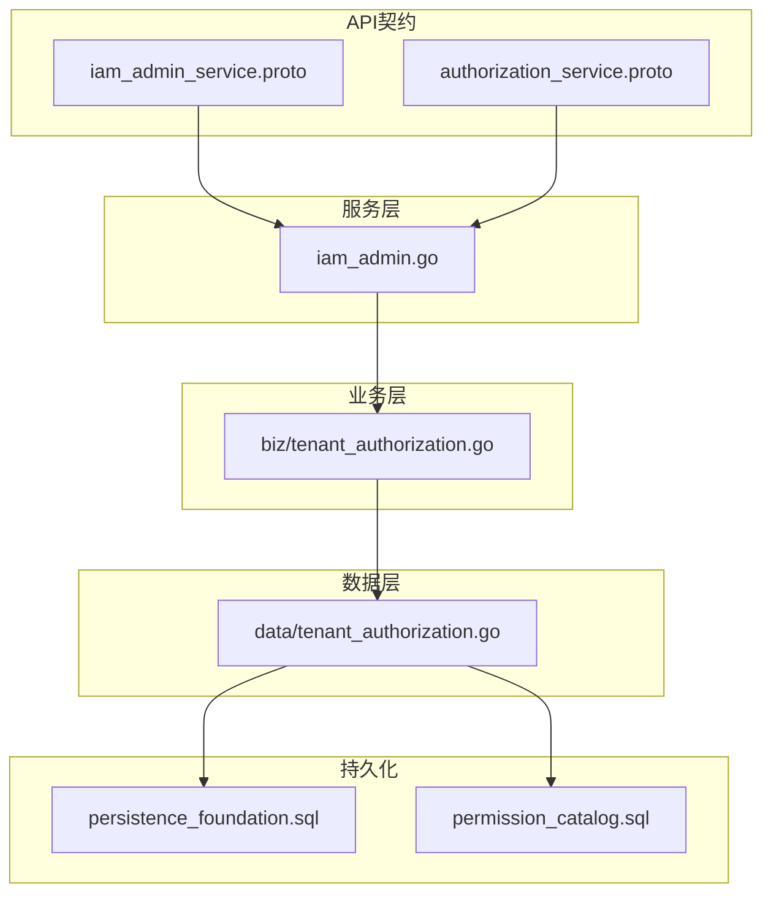
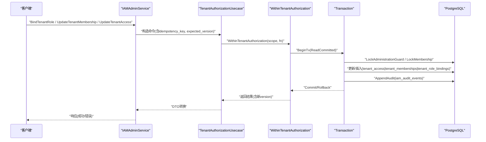
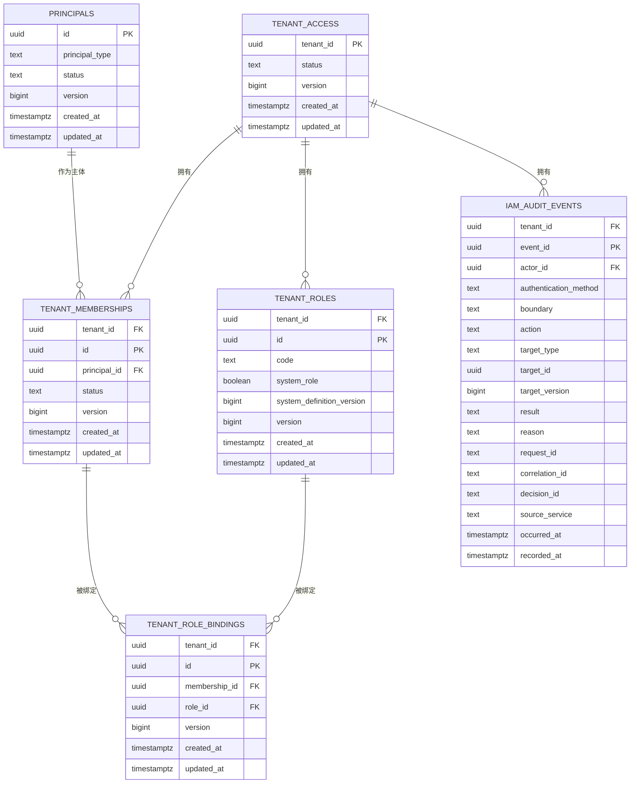
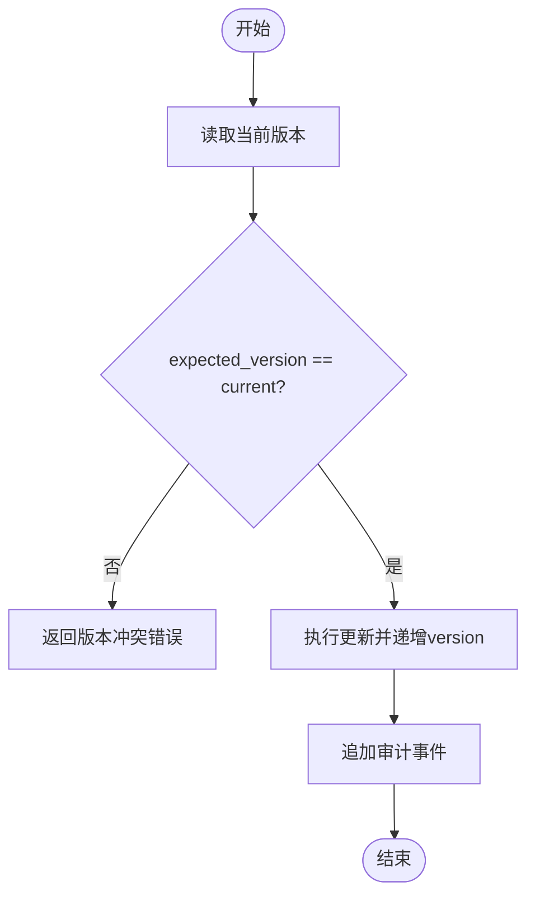
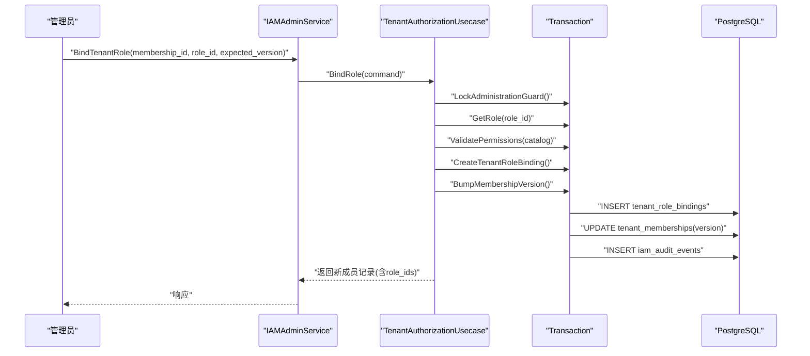
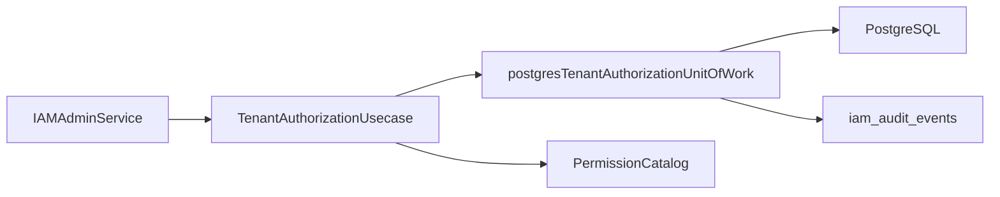

# 租户模型

<cite>
**本文引用的文件**
- [202609040001_persistence_foundation.sql](file://migrations/202609040001_persistence_foundation.sql)
- [202609080002_permission_catalog.sql](file://migrations/202609080002_permission_catalog.sql)
- [tenant_authorization.go（数据层）](file://internal/data/tenant_authorization.go)
- [tenant_authorization.go（业务层）](file://internal/biz/tenant_authorization.go)
- [iam_admin_service.proto](file://api/iam/v1/iam_admin_service.proto)
- [authorization_service.proto](file://api/iam/v1/authorization_service.proto)
- [iam_admin.go（服务实现）](file://internal/service/iam_admin.go)
- [tenant_authorization_test.go（集成测试）](file://tests/integration/tenant_authorization_test.go)
</cite>

## 目录
1. [简介](#简介)
2. [项目结构](#项目结构)
3. [核心组件](#核心组件)
4. [架构总览](#架构总览)
5. [详细组件分析](#详细组件分析)
6. [依赖关系分析](#依赖关系分析)
7. [性能考量](#性能考量)
8. [故障排查指南](#故障排查指南)
9. [结论](#结论)
10. [附录：SQL与API示例](#附录sql与api示例)

## 简介
本文件系统化阐述 ANI IAM 的租户模型，覆盖租户访问控制、成员管理与角色绑定的数据模型设计；解释 tenant_access、tenant_memberships、tenant_roles、tenant_role_bindings 四张表的结构与关系；说明多租户隔离机制、软删除策略与版本控制实现；阐述成员状态管理（active/suspended/removed）与角色权限分配逻辑；并给出租户生命周期管理、权限继承规则与性能优化策略，以及常用 SQL 查询与 API 调用模式。

## 项目结构
围绕租户授权的核心代码分布在以下层次：
- 迁移脚本：定义数据库表结构与约束（租户访问、成员、角色、绑定、审计等）。
- 数据层：基于 sqlc 生成的查询封装，提供事务化读写能力。
- 业务层：领域用例与命令对象，封装状态机、权限校验、并发保护与审计。
- 服务层：gRPC 接口实现，负责鉴权、参数校验、DTO 转换与错误映射。
- API 契约：proto 定义对外暴露的租户管理、授权检查等接口。

图表来源
- [iam_admin_service.proto:10-73](file://api/iam/v1/iam_admin_service.proto#L10-L73)
- [authorization_service.proto:10-16](file://api/iam/v1/authorization_service.proto#L10-L16)
- [iam_admin.go:36-52](file://internal/service/iam_admin.go#L36-L52)
- [tenant_authorization.go（业务层）:194-215](file://internal/biz/tenant_authorization.go#L194-L215)
- [tenant_authorization.go（数据层）:15-25](file://internal/data/tenant_authorization.go#L15-L25)
- [202609040001_persistence_foundation.sql:17-99](file://migrations/202609040001_persistence_foundation.sql#L17-L99)
- [202609080002_permission_catalog.sql:5-10](file://migrations/202609080002_permission_catalog.sql#L5-L10)

章节来源
- [202609040001_persistence_foundation.sql:17-99](file://migrations/202609040001_persistence_foundation.sql#L17-L99)
- [202609080002_permission_catalog.sql:5-10](file://migrations/202609080002_permission_catalog.sql#L5-L10)
- [tenant_authorization.go（数据层）:15-25](file://internal/data/tenant_authorization.go#L15-L25)
- [tenant_authorization.go（业务层）:194-215](file://internal/biz/tenant_authorization.go#L194-L215)
- [iam_admin_service.proto:10-73](file://api/iam/v1/iam_admin_service.proto#L10-L73)
- [authorization_service.proto:10-16](file://api/iam/v1/authorization_service.proto#L10-L16)
- [iam_admin.go:36-52](file://internal/service/iam_admin.go#L36-L52)

## 核心组件
- 租户访问（TenantAccess）：表示租户在 IAM 中的可用状态（bootstrap_pending/active/suspended），用于控制租户级能力的开关。
- 成员（Membership）：主体（human/workload）与租户的关系，包含状态（active/suspended/removed）、版本、创建/更新时间。
- 角色（Role）：一组权限的集合，支持系统角色与自定义角色，权限受权限目录约束。
- 角色绑定（RoleBinding）：将角色授予成员，形成“成员-角色”的多对多关系。
- 审计事件（AuditEvents）：记录所有关键变更，支持可追溯性。

章节来源
- [202609040001_persistence_foundation.sql:27-99](file://migrations/202609040001_persistence_foundation.sql#L27-L99)
- [tenant_authorization.go（业务层）:42-91](file://internal/biz/tenant_authorization.go#L42-L91)

## 架构总览
下图展示从 gRPC 请求到数据库写操作的完整链路，突出租户边界、事务与版本控制。

图表来源
- [iam_admin.go:496-564](file://internal/service/iam_admin.go#L496-L564)
- [tenant_authorization.go（业务层）:383-439](file://internal/biz/tenant_authorization.go#L383-L439)
- [tenant_authorization.go（数据层）:141-172](file://internal/data/tenant_authorization.go#L141-L172)
- [202609040001_persistence_foundation.sql:100-137](file://migrations/202609040001_persistence_foundation.sql#L100-L137)

## 详细组件分析

### 数据模型与关系
- tenant_access：租户访问控制主键表，status 控制租户是否可用。
- tenant_memberships：成员表，唯一索引保证同一租户内同一主体仅有一个活跃成员（非 removed）。
- tenant_roles：角色表，code 唯一，system_role 区分系统内置角色。
- tenant_role_bindings：成员与角色的绑定表，唯一约束避免重复绑定。
- iam_audit_events：审计事件表，记录所有关键操作。

图表来源
- [202609040001_persistence_foundation.sql:17-137](file://migrations/202609040001_persistence_foundation.sql#L17-L137)

章节来源
- [202609040001_persistence_foundation.sql:27-99](file://migrations/202609040001_persistence_foundation.sql#L27-L99)
- [202609040001_persistence_foundation.sql:100-137](file://migrations/202609040001_persistence_foundation.sql#L100-L137)

### 多租户隔离机制
- 所有租户相关表均以 tenant_id 作为分区键之一，并通过外键强制归属到 tenant_access。
- 查询与写入均通过 TenantScope 注入 tenant_id，确保跨租户访问失败。
- 唯一索引与约束防止跨租户误用 ID（如 members 的 one-live 约束）。

章节来源
- [202609040001_persistence_foundation.sql:36-58](file://migrations/202609040001_persistence_foundation.sql#L36-L58)
- [tenant_authorization.go（数据层）:27-40](file://internal/data/tenant_authorization.go#L27-L40)
- [tenant_authorization.go（数据层）:190-203](file://internal/data/tenant_authorization.go#L190-L203)

### 软删除策略与版本控制
- 成员软删除：membership.status=removed 表示移除，而非物理删除；通过唯一索引限制仅一个活跃成员。
- 版本控制：所有实体包含 version 字段，使用乐观锁（expected_version）防止并发冲突；更新时若版本不匹配返回冲突错误。
- 审计追踪：每次变更写入 iam_audit_events，记录目标类型、目标ID与目标版本，便于回溯。

图表来源
- [tenant_authorization.go（业务层）:250-299](file://internal/biz/tenant_authorization.go#L250-L299)
- [tenant_authorization.go（数据层）:205-220](file://internal/data/tenant_authorization.go#L205-L220)
- [202609040001_persistence_foundation.sql:100-137](file://migrations/202609040001_persistence_foundation.sql#L100-L137)

章节来源
- [tenant_authorization.go（业务层）:250-299](file://internal/biz/tenant_authorization.go#L250-L299)
- [tenant_authorization.go（数据层）:205-220](file://internal/data/tenant_authorization.go#L205-L220)
- [202609040001_persistence_foundation.sql:100-137](file://migrations/202609040001_persistence_foundation.sql#L100-L137)

### 成员状态管理（active/suspended/removed）
- active：正常可用。
- suspended：暂时禁用，保留历史与绑定。
- removed：软删除，不再参与权限计算；工作负载成员被移除时会触发关联资源禁用。

章节来源
- [202609040001_persistence_foundation.sql:36-58](file://migrations/202609040001_persistence_foundation.sql#L36-L58)
- [tenant_authorization.go（业务层）:301-381](file://internal/biz/tenant_authorization.go#L301-L381)

### 角色权限分配逻辑与权限继承
- 角色由权限目录（permission_catalog）约束，仅允许已登记的权限。
- 绑定流程：管理员锁定 -> 校验角色权限 -> 创建绑定 -> 提升成员版本 -> 记录审计。
- 权限继承：成员通过绑定获得角色所定义的权限集合；系统内置角色（如 tenant-admin）具有特殊保护，防止最后一位管理员被移除。

图表来源
- [iam_admin.go:496-564](file://internal/service/iam_admin.go#L496-L564)
- [tenant_authorization.go（业务层）:383-439](file://internal/biz/tenant_authorization.go#L383-L439)
- [tenant_authorization.go（数据层）:338-360](file://internal/data/tenant_authorization.go#L338-L360)
- [202609080002_permission_catalog.sql:12-149](file://migrations/202609080002_permission_catalog.sql#L12-L149)

章节来源
- [tenant_authorization.go（业务层）:383-439](file://internal/biz/tenant_authorization.go#L383-L439)
- [tenant_authorization.go（数据层）:338-360](file://internal/data/tenant_authorization.go#L338-L360)
- [202609080002_permission_catalog.sql:12-149](file://migrations/202609080002_permission_catalog.sql#L12-L149)

### 租户生命周期管理
- 租户访问状态：bootstrap_pending -> active/suspended。
- 更新租户访问需携带 expected_version，成功后写入审计事件。
- 平台侧可通过 IAMAdminService 获取或更新租户访问状态。

章节来源
- [202609040001_persistence_foundation.sql:27-34](file://migrations/202609040001_persistence_foundation.sql#L27-L34)
- [tenant_authorization.go（业务层）:250-299](file://internal/biz/tenant_authorization.go#L250-L299)
- [iam_admin_service.proto:103-108](file://api/iam/v1/iam_admin_service.proto#L103-L108)

### 权限继承规则
- 角色权限必须来自权限目录，且 scope 限定为 tenant。
- 系统角色（如 tenant-admin）有特殊保护，不允许移除最后一个活跃管理员。
- 工作负载成员被移除时，会禁用其关联的工作负载与凭据。

章节来源
- [tenant_authorization.go（业务层）:517-527](file://internal/biz/tenant_authorization.go#L517-L527)
- [tenant_authorization.go（业务层）:501-515](file://internal/biz/tenant_authorization.go#L501-L515)
- [tenant_authorization.go（业务层）:355-371](file://internal/biz/tenant_authorization.go#L355-L371)

## 依赖关系分析
- 服务层依赖业务层用例，业务层依赖数据层事务单元，数据层依赖 sqlc 生成查询与 PostgreSQL。
- 权限目录与角色绑定共同决定最终权限集合。
- 审计事件贯穿所有关键变更，形成不可变日志。

图表来源
- [iam_admin.go:36-52](file://internal/service/iam_admin.go#L36-L52)
- [tenant_authorization.go（业务层）:194-215](file://internal/biz/tenant_authorization.go#L194-L215)
- [tenant_authorization.go（数据层）:141-172](file://internal/data/tenant_authorization.go#L141-L172)
- [202609040001_persistence_foundation.sql:100-137](file://migrations/202609040001_persistence_foundation.sql#L100-L137)

章节来源
- [iam_admin.go:36-52](file://internal/service/iam_admin.go#L36-L52)
- [tenant_authorization.go（业务层）:194-215](file://internal/biz/tenant_authorization.go#L194-L215)
- [tenant_authorization.go（数据层）:141-172](file://internal/data/tenant_authorization.go#L141-L172)
- [202609040001_persistence_foundation.sql:100-137](file://migrations/202609040001_persistence_foundation.sql#L100-L137)

## 性能考量
- 分页与游标：列表接口使用 cursor + page_size，限制最大页大小，避免全表扫描。
- 索引优化：memberships 与 role_bindings 建立高效索引以加速按租户与状态的查询。
- 事务粒度：使用 ReadCommitted 隔离级别，结合行级锁（administration guard 与 membership lock）减少竞争。
- 幂等性：所有写操作要求 idempotency_key，避免重试导致重复写入。
- 权限目录缓存：角色权限校验依赖目录，建议在服务启动时加载并缓存。

章节来源
- [iam_admin.go:593-613](file://internal/service/iam_admin.go#L593-L613)
- [202609040001_persistence_foundation.sql:53-58](file://migrations/202609040001_persistence_foundation.sql#L53-L58)
- [202609040001_persistence_foundation.sql:97-99](file://migrations/202609040001_persistence_foundation.sql#L97-L99)
- [tenant_authorization.go（数据层）:150-172](file://internal/data/tenant_authorization.go#L150-L172)

## 故障排查指南
- 版本冲突：当 expected_version 与当前版本不一致时，返回冲突错误；请重新读取最新记录后重试。
- 权限未登记：尝试绑定未登记权限的角色会失败；请确认权限已在 permission_catalog 中。
- 最后管理员保护：禁止移除最后一个活跃管理员；请先添加新的管理员。
- 跨租户访问：任何跨租户的读/写都会失败；请确认 TenantScope 正确设置。
- 审计缺失：若未看到审计事件，检查 AppendAudit 是否成功提交。

章节来源
- [tenant_authorization.go（业务层）:250-299](file://internal/biz/tenant_authorization.go#L250-L299)
- [tenant_authorization.go（业务层）:517-527](file://internal/biz/tenant_authorization.go#L517-L527)
- [tenant_authorization.go（业务层）:501-515](file://internal/biz/tenant_authorization.go#L501-L515)
- [tenant_authorization.go（数据层）:190-203](file://internal/data/tenant_authorization.go#L190-L203)

## 结论
ANI IAM 的租户模型通过清晰的表结构与严格的约束实现了多租户隔离、细粒度权限控制与完整的审计追踪。借助版本控制与行级锁，系统在并发场景下保持强一致性与安全性。配合幂等 API 与分页查询，既满足高可用需求，又便于运维与排障。

## 附录：SQL与API示例

### 常用 SQL 查询
- 查询租户访问状态
  - 参考路径：[202609040001_persistence_foundation.sql:27-34](file://migrations/202609040001_persistence_foundation.sql#L27-L34)
- 列出某租户的所有成员（按状态过滤）
  - 参考路径：[202609040001_persistence_foundation.sql:36-58](file://migrations/202609040001_persistence_foundation.sql#L36-L58)
- 列出某成员的所有角色绑定
  - 参考路径：[202609040001_persistence_foundation.sql:77-99](file://migrations/202609040001_persistence_foundation.sql#L77-L99)
- 查询最近审计事件
  - 参考路径：[202609040001_persistence_foundation.sql:100-137](file://migrations/202609040001_persistence_foundation.sql#L100-L137)

### API 调用模式
- 获取租户访问
  - 接口：GetTenantAccess
  - 参考路径：[iam_admin_service.proto:518-525](file://api/iam/v1/iam_admin_service.proto#L518-L525)
- 更新租户访问状态
  - 接口：UpdateTenantAccess
  - 参考路径：[iam_admin_service.proto:70-71](file://api/iam/v1/iam_admin_service.proto#L70-L71)
- 绑定/解绑角色
  - 接口：BindTenantRole / UnbindTenantRole
  - 参考路径：[iam_admin_service.proto:23-24](file://api/iam/v1/iam_admin_service.proto#L23-L24), [iam_admin_service.proto:65-66](file://api/iam/v1/iam_admin_service.proto#L65-L66)
- 更新成员状态
  - 接口：UpdateTenantMembership / RemoveTenantMembership
  - 参考路径：[iam_admin_service.proto:71-72](file://api/iam/v1/iam_admin_service.proto#L71-L72), [iam_admin_service.proto:59-60](file://api/iam/v1/iam_admin_service.proto#L59-L60)
- 权限检查（运行时）
  - 接口：CheckPermission
  - 参考路径：[authorization_service.proto:10-16](file://api/iam/v1/authorization_service.proto#L10-L16), [authorization_service.proto:18-39](file://api/iam/v1/authorization_service.proto#L18-L39)

章节来源
- [iam_admin_service.proto:59-72](file://api/iam/v1/iam_admin_service.proto#L59-L72)
- [authorization_service.proto:10-39](file://api/iam/v1/authorization_service.proto#L10-L39)
- [202609040001_persistence_foundation.sql:27-137](file://migrations/202609040001_persistence_foundation.sql#L27-L137)