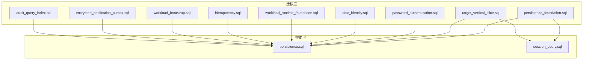
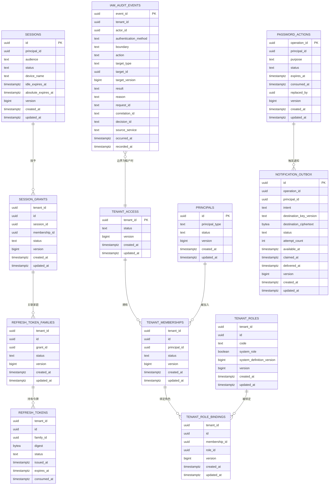
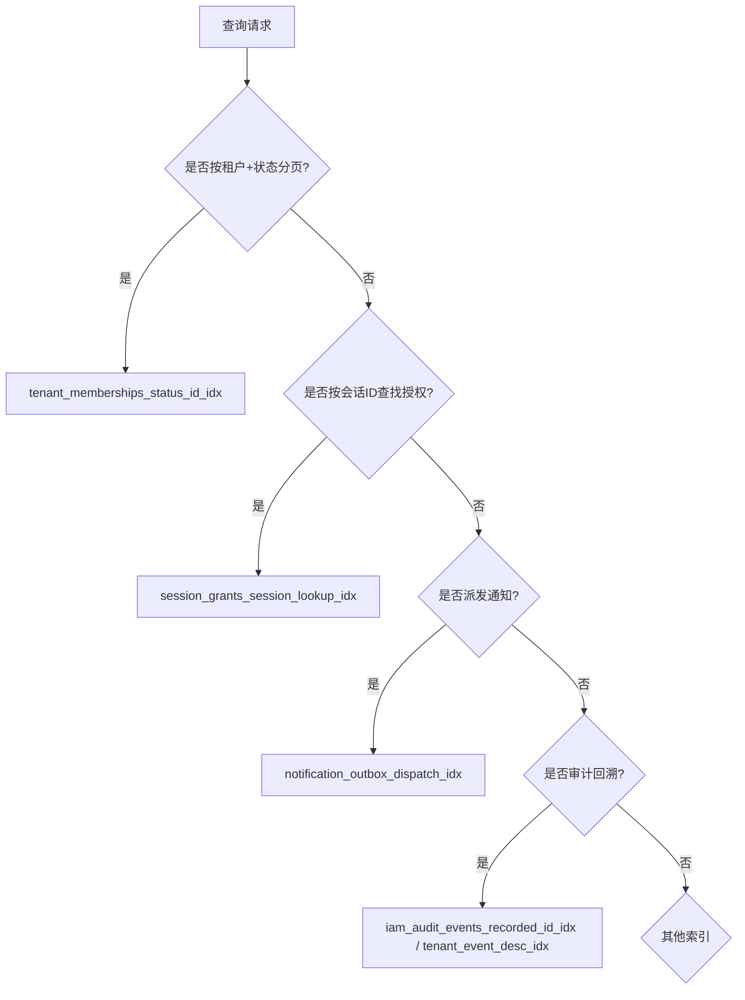

# 索引策略

<cite>
**本文引用的文件**
- [202609040001_persistence_foundation.sql](file://migrations/202609040001_persistence_foundation.sql)
- [202609040002_target_vertical_slice.sql](file://migrations/202609040002_target_vertical_slice.sql)
- [202609060001_password_authentication.sql](file://migrations/202609060001_password_authentication.sql)
- [202609070001_oidc_identity.sql](file://migrations/202609070001_oidc_identity.sql)
- [202609100001_workload_runtime_foundation.sql](file://migrations/202609100001_workload_runtime_foundation.sql)
- [202609100002_idempotency.sql](file://migrations/202609100002_idempotency.sql)
- [202609100003_workload_bootstrap.sql](file://migrations/202609100003_workload_bootstrap.sql)
- [202609100005_encrypted_notification_outbox.sql](file://migrations/202609100005_encrypted_notification_outbox.sql)
- [202609120002_audit_query_index.sql](file://migrations/202609120002_audit_query_index.sql)
- [persistence.sql](file://internal/data/queries/persistence.sql)
- [session_query.sql](file://internal/data/queries/session_query.sql)
</cite>

## 目录
1. [简介](#简介)
2. [项目结构](#项目结构)
3. [核心组件](#核心组件)
4. [架构总览](#架构总览)
5. [详细组件分析](#详细组件分析)
6. [依赖关系分析](#依赖关系分析)
7. [性能考量](#性能考量)
8. [故障排查指南](#故障排查指南)
9. [结论](#结论)
10. [附录](#附录)

## 简介
本文件系统性梳理 ANI IAM 数据库的索引策略，覆盖所有表的索引设计原则、复合索引策略与分区方案（如有），重点解释部分索引的使用场景（如 tenant_memberships_one_live_principal_idx 的条件索引设计），并阐述索引对查询性能的影响、维护成本与监控指标。同时给出索引重建策略、统计信息更新与性能调优方法，包含查询计划分析、慢查询优化与容量规划建议，以及索引设计的最佳实践与常见问题解决方案。

## 项目结构
本项目通过迁移脚本定义数据模型与索引，业务查询以 SQL 形式集中管理，由 sqlc 生成类型安全的 Go 代码。索引相关定义主要位于 migrations 目录；查询与索引使用关系可结合 internal/data/queries 中的 SQL 进行验证。

图表来源
- [202609040001_persistence_foundation.sql:17-148](file://migrations/202609040001_persistence_foundation.sql#L17-L148)
- [202609040002_target_vertical_slice.sql:6-175](file://migrations/202609040002_target_vertical_slice.sql#L6-L175)
- [202609060001_password_authentication.sql:29-135](file://migrations/202609060001_password_authentication.sql#L29-L135)
- [202609070001_oidc_identity.sql:4-30](file://migrations/202609070001_oidc_identity.sql#L4-L30)
- [202609100001_workload_runtime_foundation.sql:1-89](file://migrations/202609100001_workload_runtime_foundation.sql#L1-L89)
- [202609100002_idempotency.sql:1-21](file://migrations/202609100002_idempotency.sql#L1-L21)
- [202609100003_workload_bootstrap.sql:1-91](file://migrations/202609100003_workload_bootstrap.sql#L1-L91)
- [202609100005_encrypted_notification_outbox.sql:1-19](file://migrations/202609100005_encrypted_notification_outbox.sql#L1-L19)
- [202609120002_audit_query_index.sql:1-4](file://migrations/202609120002_audit_query_index.sql#L1-L4)
- [persistence.sql:1-800](file://internal/data/queries/persistence.sql#L1-L800)
- [session_query.sql:1-14](file://internal/data/queries/session_query.sql#L1-L14)

章节来源
- [202609040001_persistence_foundation.sql:17-148](file://migrations/202609040001_persistence_foundation.sql#L17-L148)
- [202609040002_target_vertical_slice.sql:6-175](file://migrations/202609040002_target_vertical_slice.sql#L6-L175)
- [202609060001_password_authentication.sql:29-135](file://migrations/202609060001_password_authentication.sql#L29-L135)
- [202609120002_audit_query_index.sql:1-4](file://migrations/202609120002_audit_query_index.sql#L1-L4)
- [persistence.sql:1-800](file://internal/data/queries/persistence.sql#L1-L800)
- [session_query.sql:1-14](file://internal/data/queries/session_query.sql#L1-L14)

## 核心组件
- 租户与成员关系：tenant_access、principals、tenant_memberships、tenant_roles、tenant_role_bindings
- 会话与令牌：sessions、session_grants、refresh_token_families、refresh_tokens
- 认证与凭据：verified_emails、identities、password_credentials
- 通知外箱：notification_outbox、password_action_requests、password_actions、password_action_completions
- 审计事件：iam_audit_events
- 工作负载与平台能力：workload_principals、workload_identity_bindings、workload_grants、workload_bootstrap_receipts、first_administrator_intents、platform_* 表（在后续迁移中引入）

这些表上的索引围绕“按租户隔离”“状态过滤”“唯一性约束”“分页扫描”“审计回溯”等关键访问模式设计。

章节来源
- [202609040001_persistence_foundation.sql:17-148](file://migrations/202609040001_persistence_foundation.sql#L17-L148)
- [202609040002_target_vertical_slice.sql:6-175](file://migrations/202609040002_target_vertical_slice.sql#L6-L175)
- [202609060001_password_authentication.sql:29-135](file://migrations/202609060001_password_authentication.sql#L29-L135)
- [202609100001_workload_runtime_foundation.sql:1-89](file://migrations/202609100001_workload_runtime_foundation.sql#L1-L89)
- [202609100003_workload_bootstrap.sql:1-91](file://migrations/202609100003_workload_bootstrap.sql#L1-L91)

## 架构总览
下图展示了核心实体与索引之间的关系，突出条件唯一索引与复合索引如何支撑典型查询路径。

图表来源
- [202609040001_persistence_foundation.sql:17-148](file://migrations/202609040001_persistence_foundation.sql#L17-L148)
- [202609040002_target_vertical_slice.sql:6-175](file://migrations/202609040002_target_vertical_slice.sql#L6-L175)
- [202609060001_password_authentication.sql:29-135](file://migrations/202609060001_password_authentication.sql#L29-L135)
- [202609100001_workload_runtime_foundation.sql:1-89](file://migrations/202609100001_workload_runtime_foundation.sql#L1-L89)

## 详细组件分析

### 成员关系与权限：tenant_memberships / tenant_role_bindings
- 设计要点
  - 主键 (tenant_id, id) 提供租户内唯一标识与高效定位。
  - 条件唯一索引 tenant_memberships_one_live_principal_idx 限制每个租户内同一主体仅能有一个“非移除”的成员关系，避免重复授权。
  - 复合索引 tenant_memberships_status_id_idx 支持按租户+状态分页与列表扫描。
  - tenant_role_bindings 通过 (tenant_id, membership_id, role_id) 唯一约束保证角色绑定不重复；索引 tenant_role_bindings_membership_id_idx 加速按成员查找角色。
- 查询匹配
  - 列出成员、按状态过滤、获取成员详情等操作均受益于上述索引。
- 性能与维护
  - 条件唯一索引减少无效写入冲突检测成本，但需关注删除/软删除路径的状态变更频率。
  - 复合索引顺序与查询谓词一致，利于范围扫描与排序。

章节来源
- [202609040001_persistence_foundation.sql:36-99](file://migrations/202609040001_persistence_foundation.sql#L36-L99)
- [persistence.sql:203-370](file://internal/data/queries/persistence.sql#L203-L370)

### 会话与令牌：sessions / session_grants / refresh_token_families / refresh_tokens
- 设计要点
  - sessions 主键 id；索引 sessions_principal_status_idx 支持按主体与状态分页。
  - session_grants 主键 (tenant_id, id)；条件唯一索引 session_grants_one_active_boundary_idx 确保同一会话在同一边界下仅一个活跃授权；索引 session_grants_session_lookup_idx 支持按会话快速检索。
  - refresh_token_families 主键 (tenant_id, id)；条件唯一索引 refresh_token_families_one_active_grant_idx 确保同一授权仅一个活跃家庭；索引 refresh_tokens_family_status_idx 支持按家庭与状态扫描。
- 查询匹配
  - 列出用户会话、撤销会话及刷新令牌族、按会话拉取授权等。
- 性能与维护
  - 条件唯一索引保障并发安全，降低锁竞争；高频状态变更需关注索引膨胀与统计信息准确性。

章节来源
- [202609040002_target_vertical_slice.sql:75-160](file://migrations/202609040002_target_vertical_slice.sql#L75-L160)
- [session_query.sql:1-14](file://internal/data/queries/session_query.sql#L1-L14)
- [persistence.sql:726-778](file://internal/data/queries/persistence.sql#L726-L778)

### 密码与通知外箱：password_actions / notification_outbox / password_action_requests
- 设计要点
  - password_actions 条件唯一索引 password_actions_one_active_principal_idx 保证同一主体仅一个活跃动作；索引 password_actions_principal_status_idx 支持按主体与状态分页。
  - notification_outbox 索引 notification_outbox_dispatch_idx 用于任务派发（按状态与可用时间排序）。
  - password_action_requests 主键 operation_id，唯一 idempotency_key 防重。
- 查询匹配
  - 派发通知、抢占式领取（SKIP LOCKED）、重试与完成流程。
- 性能与维护
  - 派发索引需保持较小前缀选择性，避免过大 B-tree；注意清理已投递记录以降低维护成本。

章节来源
- [202609060001_password_authentication.sql:29-135](file://migrations/202609060001_password_authentication.sql#L29-L135)
- [persistence.sql:519-649](file://internal/data/queries/persistence.sql#L519-L649)

### 审计事件：iam_audit_events
- 设计要点
  - 主键 event_id；索引 iam_audit_events_recorded_id_idx 支持按租户与记录时间倒序分页。
  - 新增索引 iam_audit_events_tenant_event_desc_idx WHERE boundary='tenant'，针对租户边界审计的高效回溯查询。
- 查询匹配
  - 审计日志按租户与事件 ID 倒序浏览；无 UPDATE/DELETE 权限，只读高吞吐。
- 性能与维护
  - 条件索引显著缩小索引体积，提升查询效率；需定期统计信息更新以保证计划稳定。

章节来源
- [202609040001_persistence_foundation.sql:100-148](file://migrations/202609040001_persistence_foundation.sql#L100-L148)
- [202609120002_audit_query_index.sql:1-4](file://migrations/202609120002_audit_query_index.sql#L1-L4)
- [persistence.sql:372-409](file://internal/data/queries/persistence.sql#L372-L409)

### 工作负载与平台能力：workload_principals / workload_identity_bindings / workload_grants / workload_bootstrap_receipts
- 设计要点
  - workload_identity_bindings 与 workload_grants 通过唯一约束限定身份绑定与授权粒度。
  - workload_bootstrap_receipts 将审计事件与引导回执关联，确保可追溯。
- 查询匹配
  - 运行时读取身份绑定与授权；引导过程写入回执并关联审计。
- 性能与维护
  - 唯一约束与索引共同保障一致性；引导阶段写入量相对较小，维护成本低。

章节来源
- [202609100001_workload_runtime_foundation.sql:1-89](file://migrations/202609100001_workload_runtime_foundation.sql#L1-L89)
- [202609100003_workload_bootstrap.sql:1-91](file://migrations/202609100003_workload_bootstrap.sql#L1-L91)

### 条件唯一索引的典型用法：tenant_memberships_one_live_principal_idx
- 使用场景
  - 防止同一租户内同一主体存在多个“有效”成员关系，保障业务语义正确性。
- 影响
  - 插入/更新时需检查条件唯一性，带来轻微写放大；换取强一致性与简单查询逻辑。
- 替代方案对比
  - 若改为应用层校验，可能引入竞态；当前方案利用数据库层面保证原子性。

章节来源
- [202609040001_persistence_foundation.sql:36-59](file://migrations/202609040001_persistence_foundation.sql#L36-L59)

### 条件唯一索引的典型用法：session_grants_one_active_boundary_idx / refresh_token_families_one_active_grant_idx
- 使用场景
  - 会话授权与刷新令牌家族在特定边界/授权上仅允许一个活跃项，简化状态机与并发控制。
- 影响
  - 写路径需处理冲突；读路径可直接断言“至多一个活跃”，减少聚合计算。

章节来源
- [202609040002_target_vertical_slice.sql:95-140](file://migrations/202609040002_target_vertical_slice.sql#L95-L140)

### 条件唯一索引的典型用法：password_actions_one_active_principal_idx
- 使用场景
  - 同一主体仅允许一个活跃的密码操作（设置/重置），避免并行操作导致状态混乱。
- 影响
  - 替换活跃动作时需先标记旧动作，再创建新动作；索引保证互斥。

章节来源
- [202609060001_password_authentication.sql:48-80](file://migrations/202609060001_password_authentication.sql#L48-L80)

### 条件唯一索引的典型用法：平台侧类似索引（platform_*）
- 使用场景
  - 平台成员、会话授权、刷新令牌家族等同样采用条件唯一索引，确保单活跃语义。
- 影响
  - 与租户侧一致的设计模式，便于统一运维与监控。

章节来源
- [202609130002_platform_identity.sql:11-90](file://migrations/202609130002_platform_identity.sql#L11-L90)

### 条件唯一索引的典型用法：租户邀请（tenant_invitations）
- 使用场景
  - pending 状态的邀请在租户内对邮箱唯一，避免重复邀请。
- 影响
  - 邀请发放路径需检查唯一性；取消或转换状态后释放约束空间。

章节来源
- [202609130004_tenant_invitations.sql:30-41](file://migrations/202609130004_tenant_invitations.sql#L30-L41)

## 依赖关系分析
- 查询与索引的对应关系
  - 成员列表/状态过滤 → tenant_memberships_status_id_idx
  - 按成员查角色 → tenant_role_bindings_membership_id_idx
  - 会话列表/撤销 → sessions_principal_status_idx
  - 会话授权查找 → session_grants_session_lookup_idx
  - 刷新令牌族/令牌 → refresh_token_families_one_active_grant_idx、refresh_tokens_family_status_idx
  - 通知派发 → notification_outbox_dispatch_idx
  - 审计回溯 → iam_audit_events_recorded_id_idx、iam_audit_events_tenant_event_desc_idx
- 外部依赖
  - 通过 sqlc 生成的查询调用这些索引；业务逻辑通过事务与行级锁（FOR UPDATE/SKIP LOCKED）配合索引实现并发安全。

图表来源
- [202609040001_persistence_foundation.sql:53-99](file://migrations/202609040001_persistence_foundation.sql#L53-L99)
- [202609040002_target_vertical_slice.sql:92-160](file://migrations/202609040002_target_vertical_slice.sql#L92-L160)
- [202609060001_password_authentication.sql:74-113](file://migrations/202609060001_password_authentication.sql#L74-L113)
- [202609120002_audit_query_index.sql:1-4](file://migrations/202609120002_audit_query_index.sql#L1-L4)

章节来源
- [persistence.sql:203-370](file://internal/data/queries/persistence.sql#L203-L370)
- [persistence.sql:519-649](file://internal/data/queries/persistence.sql#L519-L649)
- [persistence.sql:726-778](file://internal/data/queries/persistence.sql#L726-L778)

## 性能考量
- 索引选择原则
  - 优先满足高频查询的谓词顺序；复合索引列序与查询过滤/排序一致。
  - 使用条件索引裁剪数据子集，减小索引体积并提升命中率。
  - 唯一约束与条件唯一索引用于表达业务不变量，减少应用层校验复杂度。
- 维护成本
  - 条件唯一索引在写路径有额外检查成本；高频状态变更表需评估写放大。
  - 审计表只读高吞吐，索引维护成本低，但需关注统计信息准确性。
- 监控指标
  - 索引大小与增长速率、命中/未命中比率、扫描行数、锁等待与死锁次数、条件索引选择性。
- 容量规划
  - 预估各表增长率（尤其是审计与通知外箱），预留索引空间；对大表考虑分区或归档策略。

[本节为通用指导，不直接分析具体文件]

## 故障排查指南
- 常见症状与定位
  - 慢查询：检查 EXPLAIN ANALYZE 是否使用了预期索引；确认统计信息是否过期。
  - 唯一约束冲突：核对条件唯一索引的谓词是否与业务状态一致（如 active/removed）。
  - 派发饥饿：检查 notification_outbox_dispatch_idx 的选择性与 available_at 分布。
- 诊断步骤
  - 使用 EXPLAIN/EXPLAIN ANALYZE 查看执行计划；必要时收集 pg_stat_statements。
  - 检查 pg_stat_user_indexes 与 pg_stat_user_tables 的命中情况。
  - 对热点表执行 VACUUM/ANALYZE 更新统计信息。
- 修复建议
  - 调整索引列序或增加复合索引；必要时拆分或归档历史数据。
  - 修正应用层状态机，避免违反条件唯一索引的业务假设。

章节来源
- [202609040001_persistence_foundation.sql:53-99](file://migrations/202609040001_persistence_foundation.sql#L53-L99)
- [202609040002_target_vertical_slice.sql:92-160](file://migrations/202609040002_target_vertical_slice.sql#L92-L160)
- [202609060001_password_authentication.sql:74-113](file://migrations/202609060001_password_authentication.sql#L74-L113)
- [202609120002_audit_query_index.sql:1-4](file://migrations/202609120002_audit_query_index.sql#L1-L4)

## 结论
ANI IAM 的索引策略围绕“租户隔离、状态过滤、唯一性约束、分页扫描、审计回溯”五大访问模式展开，广泛采用条件唯一索引表达业务不变量，并通过复合索引优化常见查询路径。该设计在并发安全与查询性能之间取得平衡，同时兼顾了维护成本与可扩展性。生产环境中应持续监控索引命中与增长，结合统计信息更新与必要的重构，确保长期稳定运行。

[本节为总结性内容，不直接分析具体文件]

## 附录

### 索引清单与用途速查
- tenant_memberships_one_live_principal_idx：条件唯一，限制每租户每主体仅一个“非移除”成员关系
- tenant_memberships_status_id_idx：复合，按租户+状态分页
- tenant_role_bindings_membership_id_idx：复合，按成员查角色
- iam_audit_events_recorded_id_idx：复合，按租户+记录时间倒序分页
- iam_audit_events_tenant_event_desc_idx：条件索引，仅租户边界审计回溯
- sessions_principal_status_idx：复合，按主体+状态分页
- session_grants_one_active_boundary_idx：条件唯一，会话授权单活跃
- session_grants_session_lookup_idx：复合，按会话查授权
- refresh_token_families_one_active_grant_idx：条件唯一，刷新家族单活跃
- refresh_tokens_family_status_idx：复合，按家庭+状态扫描
- password_actions_one_active_principal_idx：条件唯一，主体单活跃动作
- password_actions_principal_status_idx：复合，按主体+状态分页
- notification_outbox_dispatch_idx：复合，通知派发队列

章节来源
- [202609040001_persistence_foundation.sql:53-99](file://migrations/202609040001_persistence_foundation.sql#L53-L99)
- [202609040002_target_vertical_slice.sql:92-160](file://migrations/202609040002_target_vertical_slice.sql#L92-L160)
- [202609060001_password_authentication.sql:74-113](file://migrations/202609060001_password_authentication.sql#L74-L113)
- [202609120002_audit_query_index.sql:1-4](file://migrations/202609120002_audit_query_index.sql#L1-L4)

### 查询计划分析与慢查询优化
- 使用 EXPLAIN ANALYZE 验证是否命中目标索引；关注实际返回行数与扫描行数差异。
- 对条件索引，确认查询谓词是否包含条件列且值分布合理。
- 对分页查询，确保 ORDER BY 与 LIMIT 与索引列序一致，避免额外排序。
- 对高写放大表（如通知外箱、审计），评估批量写入与归档策略。

章节来源
- [persistence.sql:519-649](file://internal/data/queries/persistence.sql#L519-L649)
- [persistence.sql:726-778](file://internal/data/queries/persistence.sql#L726-L778)

### 索引重建策略、统计信息更新与性能调优
- 重建策略
  - 对频繁更新的表，采用在线重建（CONCURRENTLY）避免阻塞写；分批次重建大索引。
- 统计信息
  - 定期 ANALYZE；在高写入后或数据分布变化后及时更新。
- 调优方法
  - 根据 EXPLAIN 结果调整索引列序；必要时拆分复合索引。
  - 对只读高吞吐表（如审计）启用更激进的统计采样。

章节来源
- [202609120002_audit_query_index.sql:1-4](file://migrations/202609120002_audit_query_index.sql#L1-L4)

### 最佳实践与常见问题
- 最佳实践
  - 用条件唯一索引表达“单活跃”语义；用复合索引匹配查询谓词顺序。
  - 对只读高吞吐表建立专用条件索引，缩小索引体积。
  - 保持索引与查询一致，避免冗余索引。
- 常见问题
  - 条件索引未命中：检查谓词是否包含条件列且值匹配。
  - 写放大过高：评估条件唯一索引的必要性，必要时在应用层加锁。
  - 统计信息过期：导致计划劣化，及时 ANALYZE。

章节来源
- [202609040001_persistence_foundation.sql:53-99](file://migrations/202609040001_persistence_foundation.sql#L53-L99)
- [202609040002_target_vertical_slice.sql:92-160](file://migrations/202609040002_target_vertical_slice.sql#L92-L160)
- [202609060001_password_authentication.sql:74-113](file://migrations/202609060001_password_authentication.sql#L74-L113)
- [202609120002_audit_query_index.sql:1-4](file://migrations/202609120002_audit_query_index.sql#L1-L4)