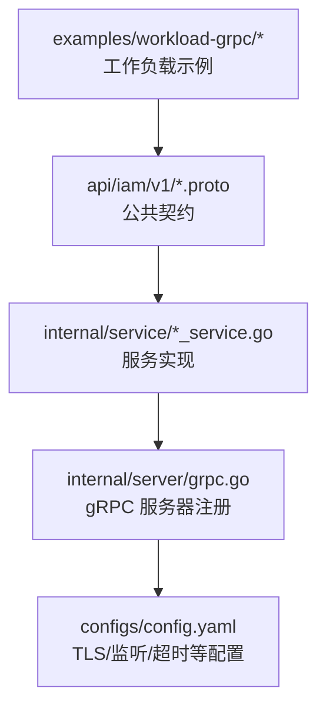
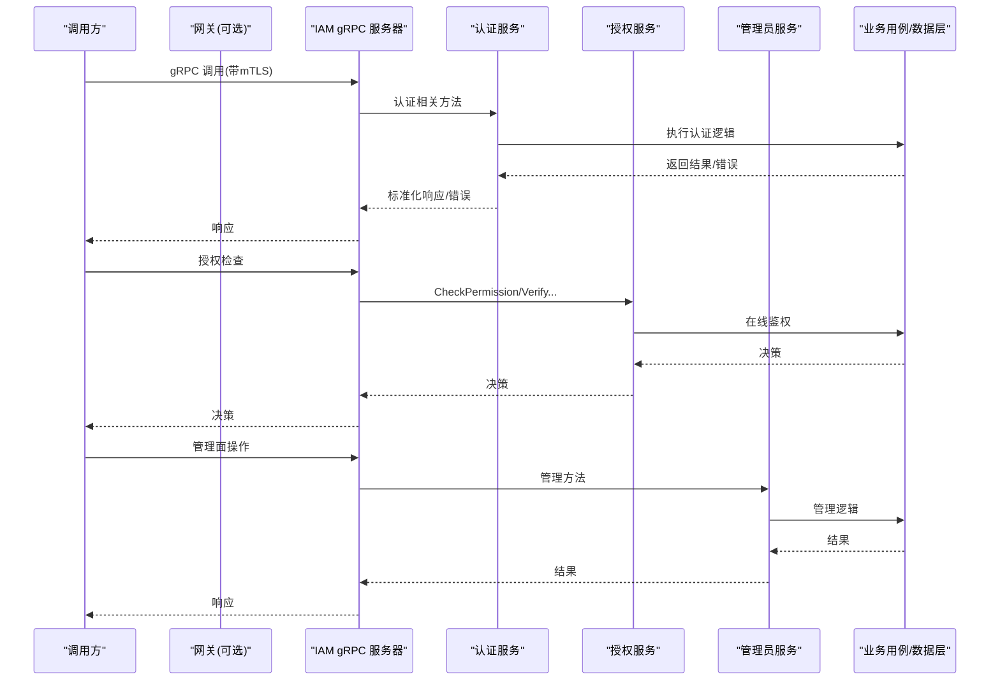
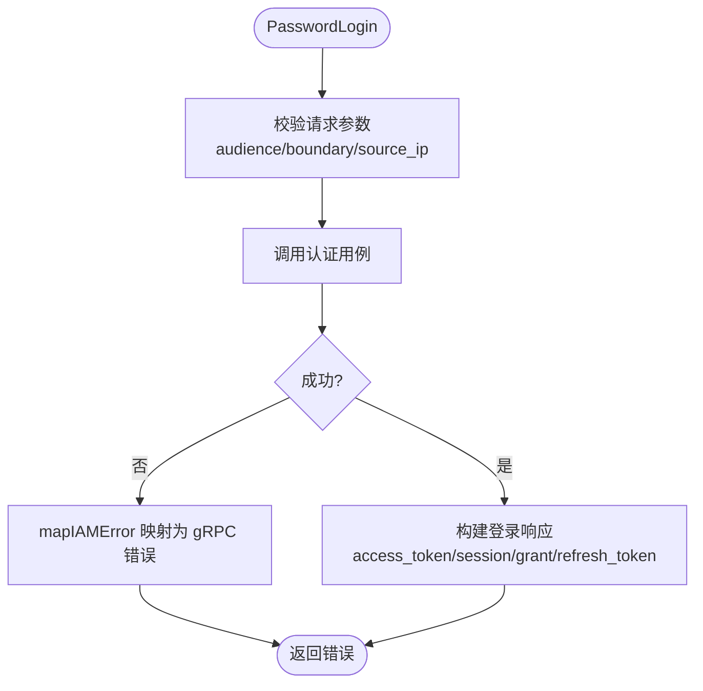
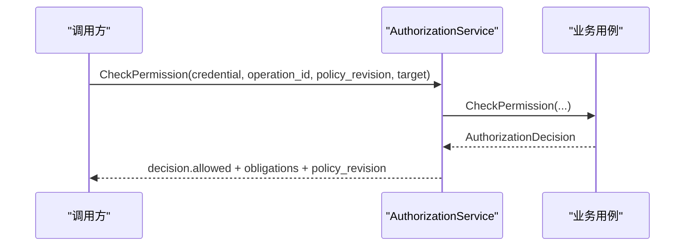
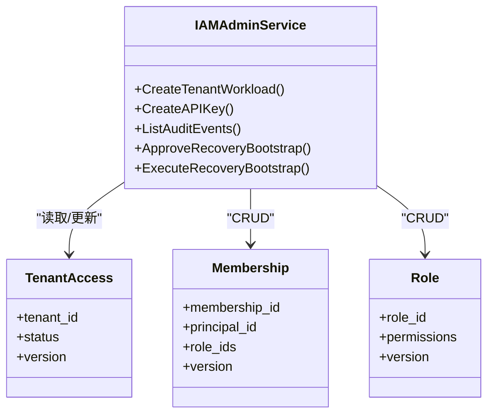
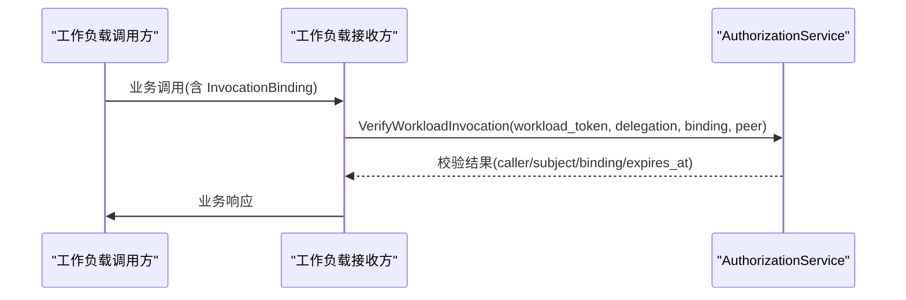
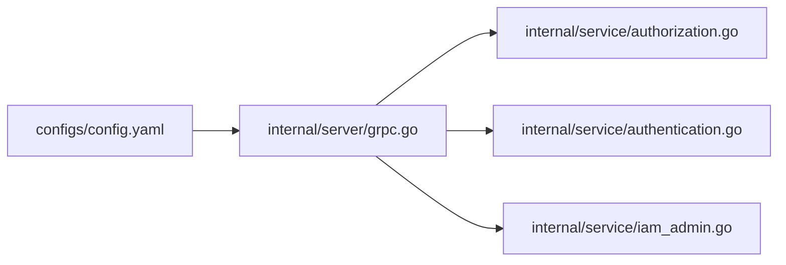

# API设计

<cite>
**本文引用的文件**
- [api/README.md](file://api/README.md)
- [api/iam/v1/authentication_service.proto](file://api/iam/v1/authentication_service.proto)
- [api/iam/v1/authorization_service.proto](file://api/iam/v1/authorization_service.proto)
- [api/iam/v1/iam_admin_service.proto](file://api/iam/v1/iam_admin_service.proto)
- [api/iam/v1/workload.proto](file://api/iam/v1/workload.proto)
- [api/iam/v1/contract.proto](file://api/iam/v1/contract.proto)
- [api/iam/v1/buf.yaml](file://api/iam/v1/buf.yaml)
- [internal/server/grpc.go](file://internal/server/grpc.go)
- [internal/service/authentication.go](file://internal/service/authentication.go)
- [internal/service/authorization.go](file://internal/service/authorization.go)
- [internal/service/iam_admin.go](file://internal/service/iam_admin.go)
- [configs/config.yaml](file://configs/config.yaml)
- [examples/workload-grpc/README.md](file://examples/workload-grpc/README.md)
</cite>

## 目录
1. [简介](#简介)
2. [项目结构](#项目结构)
3. [核心组件](#核心组件)
4. [架构总览](#架构总览)
5. [详细组件分析](#详细组件分析)
6. [依赖关系分析](#依赖关系分析)
7. [性能与可用性考虑](#性能与可用性考虑)
8. [故障排查指南](#故障排查指南)
9. [结论](#结论)
10. [附录：API契约与版本管理](#附录api契约与版本管理)

## 简介
本文件为 ANI IAM 的 gRPC API 设计文档，覆盖消息定义、错误处理、版本管理策略、分层职责边界（认证服务、授权服务、管理员服务、负载服务）、安全机制（身份验证、权限控制、请求签名）、契约管理与代码生成流程、调用流程图与错误处理最佳实践，以及网关集成、负载均衡与服务发现配置建议。

## 项目结构
ANI IAM 将对外暴露的 gRPC 契约集中在 api/iam/v1 下，采用 Protobuf 描述并配合 Buf 进行 lint 与破坏性变更检查；服务实现位于 internal/service，gRPC 服务器注册在 internal/server，运行时配置在 configs/config.yaml。示例客户端与接收端在 examples/workload-grpc 中提供可独立运行的参考实现。

图表来源
- [api/iam/v1/authentication_service.proto:1-33](file://api/iam/v1/authentication_service.proto#L1-L33)
- [api/iam/v1/authorization_service.proto:1-16](file://api/iam/v1/authorization_service.proto#L1-L16)
- [api/iam/v1/iam_admin_service.proto:1-73](file://api/iam/v1/iam_admin_service.proto#L1-L73)
- [internal/server/grpc.go:14-50](file://internal/server/grpc.go#L14-L50)
- [configs/config.yaml:1-16](file://configs/config.yaml#L1-L16)

章节来源
- [api/README.md:1-8](file://api/README.md#L1-L8)
- [api/iam/v1/buf.yaml:1-17](file://api/iam/v1/buf.yaml#L1-L17)
- [internal/server/grpc.go:14-50](file://internal/server/grpc.go#L14-L50)
- [configs/config.yaml:1-16](file://configs/config.yaml#L1-L16)

## 核心组件
- 认证服务 AuthenticationService：负责人类与工作负载的身份认证与会话生命周期（密码登录、OIDC、会话刷新/登出、租户切换、会话列表与撤销、主体校验、工作负载令牌签发、委托令牌签发）。
- 授权服务 AuthorizationService：提供统一的“失败关闭”式授权决策点，支持按操作ID与策略版本进行在线鉴权，以及工作负载调用链路的持续校验。
- 管理员服务 IAMAdminService：面向平台与租户的管理面能力，包括成员、角色、邀请、API Key、审计事件、恢复操作、租户访问状态等。
- 负载服务（工作负载）：通过 workload.proto 定义的 InvocationBinding、WorkloadPeer、DirectWorkloadCaller 等模型，结合 VerifyWorkloadInvocation/VerifySessionContinuation/VerifyWorkloadCaller 完成工作负载间调用的可信绑定与在线校验。

章节来源
- [api/iam/v1/authentication_service.proto:11-33](file://api/iam/v1/authentication_service.proto#L11-L33)
- [api/iam/v1/authorization_service.proto:10-16](file://api/iam/v1/authorization_service.proto#L10-L16)
- [api/iam/v1/iam_admin_service.proto:10-73](file://api/iam/v1/iam_admin_service.proto#L10-L73)
- [api/iam/v1/workload.proto:10-121](file://api/iam/v1/workload.proto#L10-L121)

## 架构总览
ANI IAM 采用三层分离：
- 接入层：gRPC 服务器强制 mTLS，仅允许受信任网关或工作负载连接。
- 服务层：认证、授权、管理员三类服务各自专注单一职责，并通过业务用例接口与数据层交互。
- 数据与外部依赖：PostgreSQL、Redis、OIDC、通知服务等由业务层抽象，服务层不直接耦合。

图表来源
- [internal/server/grpc.go:29-50](file://internal/server/grpc.go#L29-L50)
- [internal/service/authentication.go:108-138](file://internal/service/authentication.go#L108-L138)
- [internal/service/authorization.go:27-67](file://internal/service/authorization.go#L27-L67)
- [internal/service/iam_admin.go:66-106](file://internal/service/iam_admin.go#L66-L106)

## 详细组件分析

### 认证服务（AuthenticationService）
- 职责边界
  - 人类与会话：密码登录、OIDC 登录/身份关联、会话刷新/登出、租户切换、会话查询与撤销。
  - 主体校验：ValidatePrincipal 用于快速校验凭据与策略版本，返回最小可信上下文。
  - 工作负载令牌：IssueWorkloadToken 签发短时效、不可刷新的工作负载令牌；IssueDelegation 针对单次请求签发委托令牌。
- 关键消息
  - PasswordLoginRequest/Response、BeginOIDCLoginRequest/Response、CompleteOIDCLoginRequest/Response、RefreshSessionRequest/Response、LogoutSessionRequest/Response、SwitchTenantRequest/Response、ListSessionsRequest/Response、RevokeSessionRequest/Response、RevokeAllSessionsRequest/Response、ValidatePrincipalRequest/Response、IssueWorkloadTokenRequest/Response、IssueDelegationRequest/Response。
- 错误处理
  - 统一映射到 gRPC status，携带 IAMErrorReason 与结构化元数据（如 operation_id、credential_kind、dependency、policy_revision 等），便于网关与客户端重试/降级。
- 安全要点
  - source_ip 必须由可信网关注入，服务端仅接受经校验的 IP 字面量并哈希后用于限流键。
  - OIDC 流程使用一次性 state/PKCE，浏览器回调使用 browser_proof 防重放。
  - 所有敏感字段（如凭据）禁止日志与持久化明文。

图表来源
- [internal/service/authentication.go:150-194](file://internal/service/authentication.go#L150-L194)
- [internal/service/authentication.go:476-683](file://internal/service/authentication.go#L476-L683)

章节来源
- [api/iam/v1/authentication_service.proto:11-33](file://api/iam/v1/authentication_service.proto#L11-L33)
- [internal/service/authentication.go:108-138](file://internal/service/authentication.go#L108-L138)
- [internal/service/authentication.go:476-683](file://internal/service/authentication.go#L476-L683)

### 授权服务（AuthorizationService）
- 职责边界
  - 单一失败关闭的授权决策点：CheckPermission 基于凭据、operation_id、policy_revision 与目标属性给出明确决策。
  - 工作负载调用链路：VerifyWorkloadInvocation/VerifySessionContinuation/VerifyWorkloadCaller 确保每次调用都经过在线校验，且绑定精确的业务请求摘要。
- 关键消息
  - CheckPermissionRequest/Response、VerifyWorkloadCallerRequest/Response、VerifySessionContinuationRequest/Response、VerifyWorkloadInvocationRequest/Response。
- 错误处理
  - 策略版本不匹配、未注册操作、依赖不可用等均有稳定错误码与元数据，便于客户端区分重试策略。
- 安全要点
  - 决策输出不包含可复用的凭证，仅包含本次调用的上下文与约束（obligations）。

图表来源
- [internal/service/authorization.go:27-67](file://internal/service/authorization.go#L27-L67)
- [api/iam/v1/authorization_service.proto:18-39](file://api/iam/v1/authorization_service.proto#L18-L39)

章节来源
- [api/iam/v1/authorization_service.proto:10-39](file://api/iam/v1/authorization_service.proto#L10-L39)
- [internal/service/authorization.go:27-67](file://internal/service/authorization.go#L27-L67)

### 管理员服务（IAMAdminService）
- 职责边界
  - 平台与租户管理：成员、角色、邀请、API Key、审计事件、恢复操作、租户访问状态等。
  - 严格的双控恢复流程：RecoveryOperation 记录双控审批状态与指纹，防止单点误操作。
- 关键消息
  - 大量 CRUD 与列表分页消息（如 CreateTenantWorkload、CreateAPIKey、ListAuditEvents、ApproveRecoveryBootstrap、ExecuteRecoveryBootstrap 等）。
- 错误处理
  - 资源不存在、版本冲突、权限不足、重复邀请、恢复冲突等均有稳定错误码与元数据。
- 安全要点
  - 所有写操作要求 idempotency_key 与 expected_version，避免并发冲突。
  - 管理面操作需通过认证与授权双重校验，并在上下文中携带决策ID。

图表来源
- [api/iam/v1/iam_admin_service.proto:10-73](file://api/iam/v1/iam_admin_service.proto#L10-L73)
- [internal/service/iam_admin.go:66-106](file://internal/service/iam_admin.go#L66-L106)

章节来源
- [api/iam/v1/iam_admin_service.proto:10-73](file://api/iam/v1/iam_admin_service.proto#L10-L73)
- [internal/service/iam_admin.go:66-106](file://internal/service/iam_admin.go#L66-L106)

### 负载服务（工作负载）
- 职责边界
  - 工作负载间调用必须携带 InvocationBinding（包含 audience、operation_id、rpc_method/http_method+path、request_sha256、target_revision 等），确保请求被精确绑定与防篡改。
  - WorkloadPeer 由接收端在 mTLS 验证后上报，调用方无法伪造。
  - 在线校验：VerifyWorkloadInvocation 与 VerifySessionContinuation 保证每次调用均在线验证，避免离线缓存带来的越权风险。
- 关键消息
  - InvocationBinding、WorkloadPeer、DirectWorkloadCaller、VerifyWorkloadInvocationRequest/Response、VerifySessionContinuationRequest/Response、VerifyWorkloadCallerRequest/Response、IssueDelegationRequest/Response。
- 安全要点
  - 委托令牌（delegation）最长60秒且不可刷新，仅对当前请求有效。
  - 工作负载令牌最多5分钟，不可刷新，限制受众与操作范围。

图表来源
- [api/iam/v1/workload.proto:10-121](file://api/iam/v1/workload.proto#L10-L121)

章节来源
- [api/iam/v1/workload.proto:10-121](file://api/iam/v1/workload.proto#L10-L121)

## 依赖关系分析
- 服务注册与传输层
  - gRPC 服务器强制 mTLS（TLS1.3+、双向证书校验），禁用反射，设置超时与中间件。
  - 三个服务（认证、授权、管理员）统一注册到同一 gRPC 服务器实例。
- 配置
  - 监听地址、网络、超时、TLS 证书路径、OIDC 提供商、策略版本等均在配置文件中声明。
- 外部依赖
  - OIDC、Redis、PostgreSQL、通知服务通过业务用例抽象，服务层不直接耦合。

图表来源
- [internal/server/grpc.go:14-50](file://internal/server/grpc.go#L14-L50)
- [configs/config.yaml:1-16](file://configs/config.yaml#L1-L16)

章节来源
- [internal/server/grpc.go:14-50](file://internal/server/grpc.go#L14-L50)
- [configs/config.yaml:1-16](file://configs/config.yaml#L1-L16)

## 性能与可用性考虑
- 超时与重试
  - gRPC 服务器配置了超时；客户端应依据错误码决定重试（如 IAM_TIMEOUT、AUTH_RATE_LIMITED 可退避重试；NOT_FOUND、INVALID_ARGUMENT 不应重试）。
- 幂等性
  - 所有写操作要求 idempotency_key，服务端对冲突与过期有明确错误码，客户端应利用幂等键保障重试安全。
- 限流
  - 认证入口（如密码登录）具备速率限制，错误码包含 limit_scope 与 retry_after_seconds，客户端据此实施指数退避。
- 在线校验
  - 工作负载调用采用在线校验，避免缓存导致的越权；建议在网关侧做连接复用与熔断保护。

[本节为通用指导，无需特定文件引用]

## 故障排查指南
- 常见错误分类
  - 参数错误：INVALID_ARGUMENT，附带 field 信息，修正请求字段。
  - 凭据无效：CREDENTIAL_INVALID，检查凭据类型与有效期。
  - 权限不足：PERMISSION_DENIED，检查策略版本与主体权限。
  - 依赖不可用：IAM_UNAVAILABLE，检查 OIDC/数据库/缓存等依赖健康。
  - 策略不匹配：AUTHZ_POLICY_MISMATCH，同步策略版本。
  - 租户未就绪：TENANT_IAM_NOT_READY/TENANT_LIFECYCLE_STALE，等待租户初始化完成。
  - 幂等冲突：IDEMPOTENCY_CONFLICT/IDEMPOTENCY_KEY_EXPIRED，更换或重新生成幂等键。
- 定位手段
  - 使用 x-request-id 与 x-correlation-id 追踪请求链路。
  - 关注返回的 decision_id、operation_id、resource_id 等元数据。
  - 管理员审计事件可用于回溯操作影响。

章节来源
- [internal/service/authentication.go:476-683](file://internal/service/authentication.go#L476-L683)
- [internal/service/authorization.go:27-67](file://internal/service/authorization.go#L27-L67)
- [internal/service/iam_admin.go:66-106](file://internal/service/iam_admin.go#L66-L106)

## 结论
ANI IAM 的 gRPC API 以清晰的职责分层、严格的在线校验与稳定的错误模型为核心，确保跨租户、跨工作负载的安全与一致性。通过 Buf 契约治理与明确的版本策略，API 可在演进过程中保持向后兼容与可观测性。

[本节为总结，无需特定文件引用]

## 附录：API契约与版本管理
- Proto 规范
  - 包名 iam.v1，所有枚举与消息遵循命名与注释约定；错误详情使用 google.rpc.ErrorInfo。
  - 公共契约位于 api/iam/v1，禁止在服务实现中修改已发布消息。
- 代码生成
  - 使用 Buf 1.72.0 与 protoc-gen-go 1.36.12、protoc-gen-go-grpc 1.6.2 生成 Go 客户端与服务桩；禁止直接编辑生成文件。
  - 破坏性变更通过 Buf breaking 规则检测，lint 使用 STANDARD 规则集。
- 向后兼容性
  - 保留已删除枚举值编号；新增字段时避免破坏现有客户端解析。
  - 策略版本（policy_revision）用于授权决策一致性，客户端需携带并处理版本不匹配错误。
- 网关集成、负载均衡与服务发现
  - 网关需启用 mTLS 双向认证，仅允许受信任客户端 CA 与 DNS 名称（如 ani-gateway）连接。
  - 建议网关层实现：
    - 连接池与超时控制（与 gRPC 超时一致）。
    - 请求签名与来源 IP 注入（source_ip 由网关注入，服务端仅接受可信值）。
    - 限流与熔断（基于错误码与元数据）。
    - 服务发现：通过配置或动态发现指向 IAM gRPC 监听地址（tcp 与端口来自配置文件）。
  - 负载均衡：多实例部署时，网关应基于健康检查与权重分配流量；IAM 无状态，可水平扩展。

章节来源
- [api/iam/v1/buf.yaml:1-17](file://api/iam/v1/buf.yaml#L1-L17)
- [api/README.md:1-8](file://api/README.md#L1-L8)
- [internal/server/grpc.go:14-26](file://internal/server/grpc.go#L14-L26)
- [configs/config.yaml:1-16](file://configs/config.yaml#L1-L16)
- [examples/workload-grpc/README.md:1-14](file://examples/workload-grpc/README.md#L1-L14)