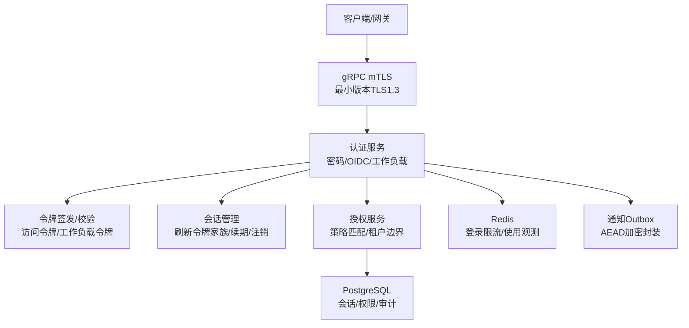
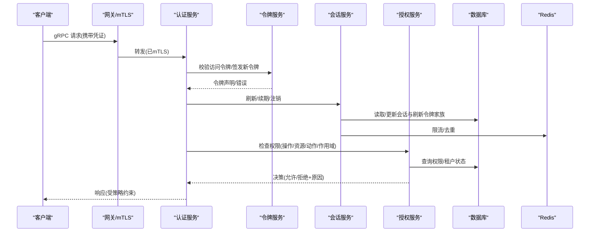
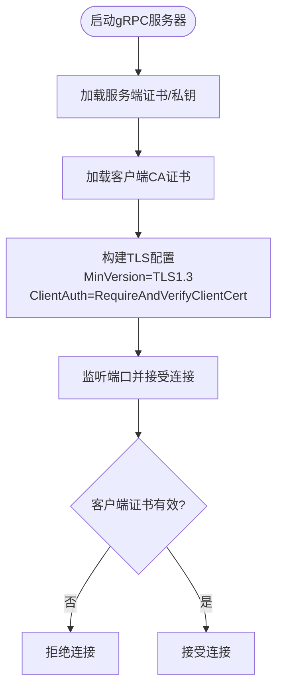
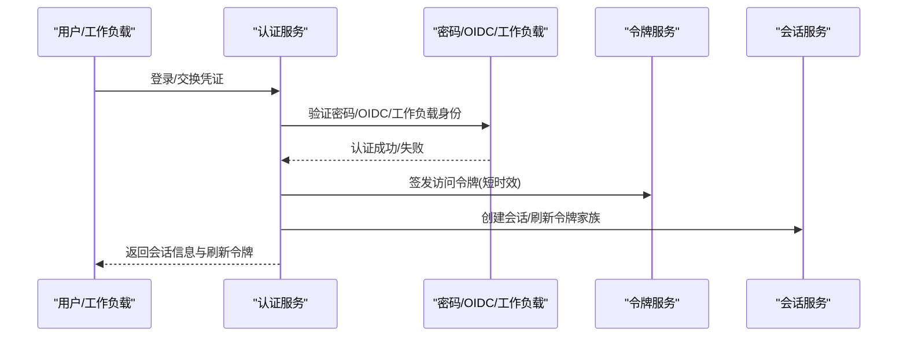
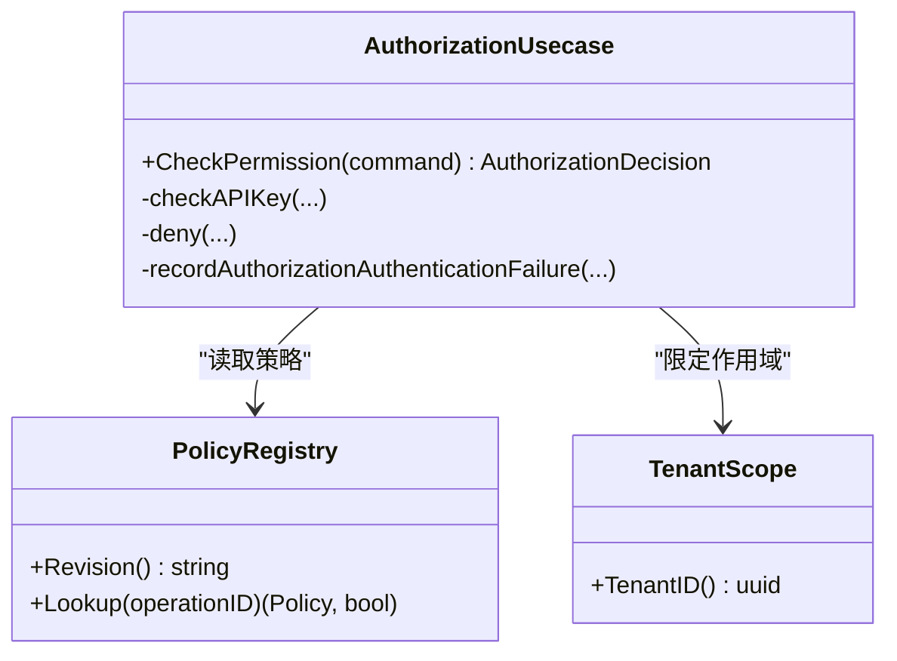
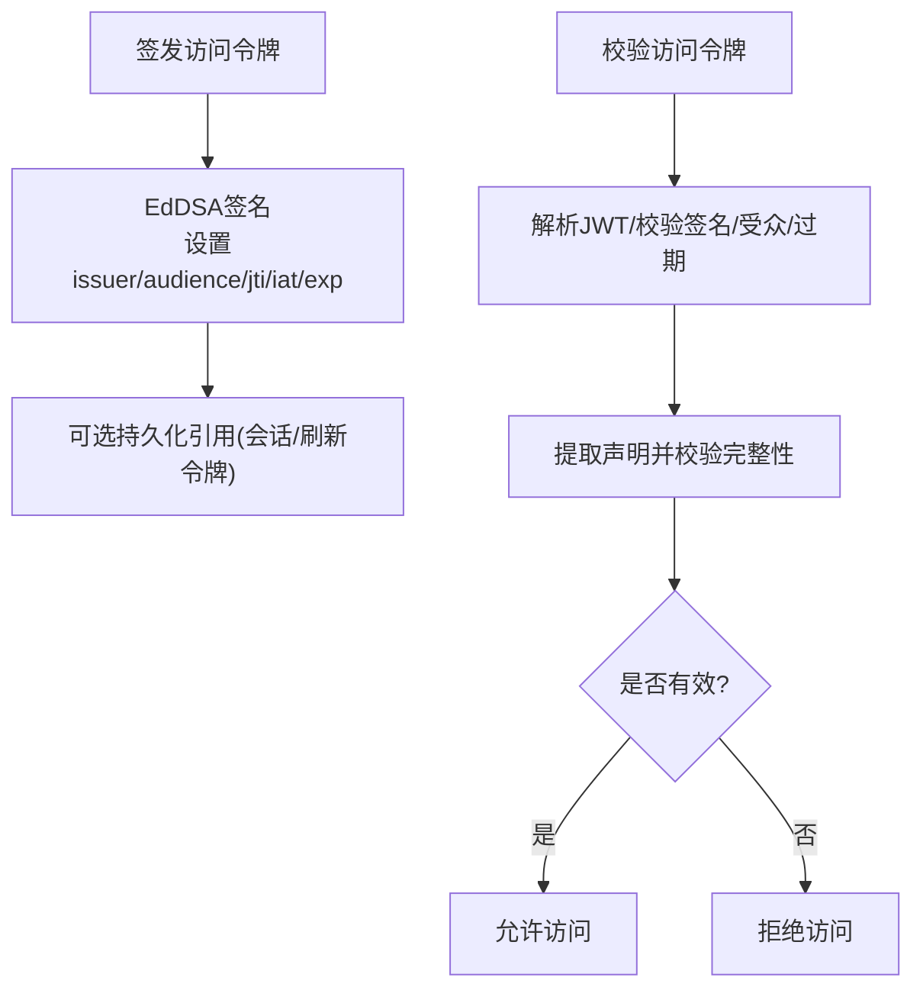
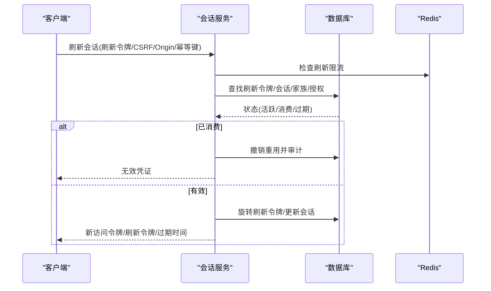
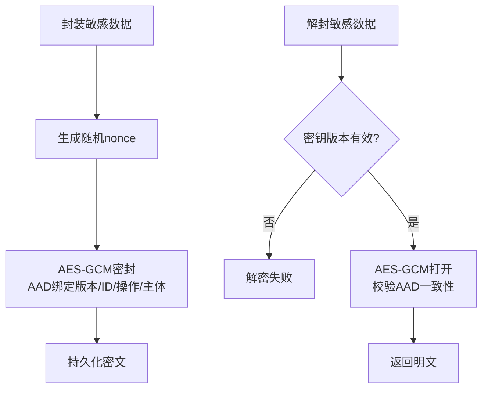
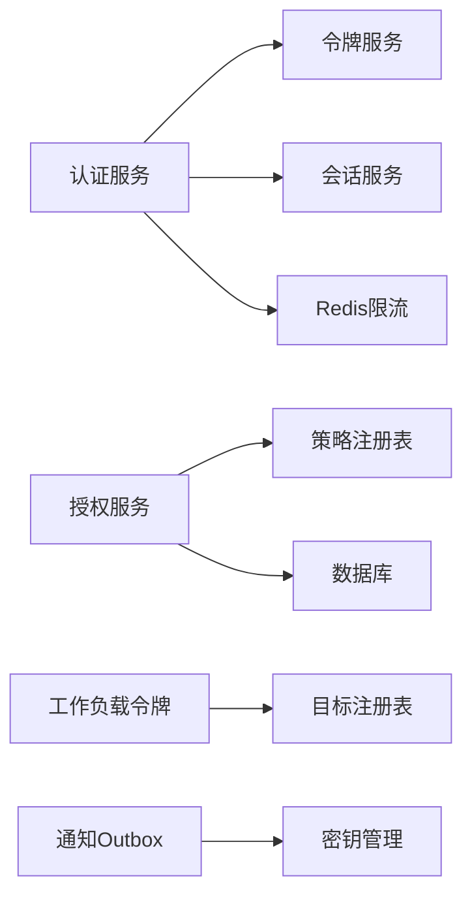

# 安全架构

<cite>
**本文引用的文件**
- [config.yaml](file://configs/config.yaml)
- [tls.go](file://internal/server/tls.go)
- [access_token_jwx.go](file://internal/data/access_token_jwx.go)
- [workload_token_jwx.go](file://internal/data/workload_token_jwx.go)
- [session.go](file://internal/biz/session.go)
- [authorization.go](file://internal/biz/authorization.go)
- [tenant_authorization.go](file://internal/data/tenant_authorization.go)
- [password_argon2id.go](file://internal/data/password_argon2id.go)
- [outbox_protector.go](file://internal/data/outbox_protector.go)
- [oidc_postgres.go](file://internal/data/oidc_postgres.go)
- [login_throttle_redis.go](file://internal/data/login_throttle_redis.go)
- [api_key_usage_redis.go](file://internal/data/api_key_usage_redis.go)
- [authentication_service.proto](file://api/iam/v1/authentication_service.proto)
- [authorization_service.proto](file://api/iam/v1/authorization_service.proto)
</cite>

## 目录
1. [简介](#简介)
2. [项目结构](#项目结构)
3. [核心组件](#核心组件)
4. [架构总览](#架构总览)
5. [详细组件分析](#详细组件分析)
6. [依赖关系分析](#依赖关系分析)
7. [性能与可扩展性](#性能与可扩展性)
8. [故障排查指南](#故障排查指南)
9. [结论](#结论)
10. [附录](#附录)

## 简介
本安全架构文档面向 ANI IAM，系统性阐述多层安全防护体系：传输层安全（mTLS）、应用层认证、细粒度授权控制与安全令牌管理。重点覆盖 JWT 访问令牌与工作负载令牌的签发、校验与轮换；短期令牌与刷新令牌的安全策略；多租户权限隔离与数据访问控制；会话创建、维护与销毁的安全考虑；威胁模型与防护措施；密码加密存储、敏感信息保护与审计日志记录。

## 项目结构
ANI IAM 将安全能力分层组织：
- 传输层：gRPC mTLS 配置与证书加载
- 认证层：密码、OIDC、工作负载身份等认证路径
- 授权层：基于策略的细粒度权限检查，支持租户边界与平台边界
- 令牌层：JWT 访问令牌与工作负载调用令牌（含轮换）
- 会话层：刷新令牌家族、会话生命周期与续期
- 数据层：密码哈希、敏感数据加密封装、审计事件持久化
- 配置层：密钥、证书、OIDC、Redis 限流等运行时参数

**图表来源**
- [tls.go:15-37](file://internal/server/tls.go#L15-L37)
- [access_token_jwx.go:21-48](file://internal/data/access_token_jwx.go#L21-L48)
- [workload_token_jwx.go:23-50](file://internal/data/workload_token_jwx.go#L23-L50)
- [session.go:154-286](file://internal/biz/session.go#L154-L286)
- [authorization.go:225-329](file://internal/biz/authorization.go#L225-L329)

**章节来源**
- [config.yaml:1-61](file://configs/config.yaml#L1-L61)
- [tls.go:15-37](file://internal/server/tls.go#L15-L37)

## 核心组件
- 传输层安全：强制 mTLS，最小 TLS 版本 1.3，要求客户端证书并验证 DNS 身份
- 认证：支持密码、OIDC、工作负载身份；统一鉴权入口
- 授权：策略注册表驱动，按操作、资源、动作、作用域（租户/平台/自有）判定
- 令牌：EdDSA 签名的 JWT 访问令牌与工作负载调用令牌；支持密钥轮换
- 会话：刷新令牌家族、滚动续期、防重用、注销与租户切换
- 数据保护：Argon2id 密码哈希；通知 Outbox AEAD 加密封装；审计事件不可变追加
- 速率限制：Redis 登录限流与 API Key 使用观测

**章节来源**
- [access_token_jwx.go:21-48](file://internal/data/access_token_jwx.go#L21-L48)
- [workload_token_jwx.go:18-50](file://internal/data/workload_token_jwx.go#L18-L50)
- [session.go:154-286](file://internal/biz/session.go#L154-L286)
- [authorization.go:225-329](file://internal/biz/authorization.go#L225-L329)
- [password_argon2id.go:14-63](file://internal/data/password_argon2id.go#L14-L63)
- [outbox_protector.go:17-98](file://internal/data/outbox_protector.go#L17-L98)

## 架构总览
ANI IAM 采用“认证-授权-令牌-会话”四层协同，配合传输层 mTLS 与数据层安全加固，形成纵深防御。

**图表来源**
- [authentication_service.proto](file://api/iam/v1/authentication_service.proto)
- [authorization_service.proto](file://api/iam/v1/authorization_service.proto)
- [session.go:154-286](file://internal/biz/session.go#L154-L286)
- [authorization.go:225-329](file://internal/biz/authorization.go#L225-L329)

## 详细组件分析

### 传输层安全（mTLS）
- 强制启用 mTLS，最小 TLS 版本为 1.3
- 服务端证书与私钥从配置加载，客户端 CA 用于验证客户端证书
- 通过 DNS 名称校验确保仅受信网关可连接

**图表来源**
- [tls.go:15-37](file://internal/server/tls.go#L15-L37)

**章节来源**
- [tls.go:15-37](file://internal/server/tls.go#L15-L37)
- [config.yaml:7-11](file://configs/config.yaml#L7-L11)

### 应用层认证
- 密码认证：使用 Argon2id 进行密码哈希与验证，未知账户走恒定时间比较防止枚举
- OIDC 集成：通过 Dex 提供外部身份源，支持最近重认证窗口
- 工作负载身份：基于 mTLS/SPIFFE 的工作负载身份绑定，结合目标注册表校验调用方

**图表来源**
- [password_argon2id.go:30-63](file://internal/data/password_argon2id.go#L30-L63)
- [workload_token_jwx.go:36-50](file://internal/data/workload_token_jwx.go#L36-L50)
- [session.go:154-286](file://internal/biz/session.go#L154-L286)

**章节来源**
- [password_argon2id.go:14-63](file://internal/data/password_argon2id.go#L14-L63)
- [workload_token_jwx.go:18-50](file://internal/data/workload_token_jwx.go#L18-L50)
- [config.yaml:51-59](file://configs/config.yaml#L51-L59)

### 授权控制与多租户隔离
- 策略注册表：每个操作定义资源、动作、作用域、允许的凭据类型与主体类型
- 租户边界：所有权限判断以租户作用域为基本单位，禁止跨租户越权
- 平台边界：平台级操作由平台授权器处理，与租户授权解耦
- 权限目录：权限目录与租户角色权限表通过外键约束，防止未登记权限

**图表来源**
- [authorization.go:225-329](file://internal/biz/authorization.go#L225-L329)
- [tenant_authorization.go:1-40](file://internal/data/tenant_authorization.go#L1-L40)

**章节来源**
- [authorization.go:225-329](file://internal/biz/authorization.go#L225-L329)
- [tenant_authorization.go:174-203](file://internal/data/tenant_authorization.go#L174-L203)

### 安全令牌管理（JWT）
- 访问令牌：EdDSA 签名，包含主体、会话、授权、租户、认证方法等声明；严格受众与有效期校验
- 工作负载令牌：独立类型与工作负载上下文，绑定目标受众与操作，支持委托与延续
- 密钥轮换：支持活动密钥与历史公钥并存，旧令牌在有效期内仍可验证，移除密钥后立即失效

**图表来源**
- [access_token_jwx.go:202-224](file://internal/data/access_token_jwx.go#L202-L224)
- [access_token_jwx.go:360-378](file://internal/data/access_token_jwx.go#L360-L378)
- [workload_token_jwx.go:104-180](file://internal/data/workload_token_jwx.go#L104-L180)

**章节来源**
- [access_token_jwx.go:21-48](file://internal/data/access_token_jwx.go#L21-L48)
- [access_token_jwx.go:202-224](file://internal/data/access_token_jwx.go#L202-L224)
- [access_token_jwx.go:360-378](file://internal/data/access_token_jwx.go#L360-L378)
- [workload_token_jwx.go:104-180](file://internal/data/workload_token_jwx.go#L104-L180)

### 会话管理与刷新令牌策略
- 刷新令牌家族：同一会话共享家族，支持滚动续期与并发重用检测
- 续期流程：校验刷新令牌有效性、会话空闲绝对过期、租户生命周期与成员状态，生成新的访问令牌与刷新令牌
- 注销流程：查找当前会话并标记注销，审计记录
- 租户切换：在同一会话内切换到目标租户，重新颁发访问令牌与刷新令牌家族

**图表来源**
- [session.go:154-286](file://internal/biz/session.go#L154-L286)
- [session.go:288-348](file://internal/biz/session.go#L288-L348)
- [session.go:350-478](file://internal/biz/session.go#L350-L478)

**章节来源**
- [session.go:154-286](file://internal/biz/session.go#L154-L286)
- [session.go:288-348](file://internal/biz/session.go#L288-L348)
- [session.go:350-478](file://internal/biz/session.go#L350-L478)

### 密码加密存储与敏感信息保护
- 密码哈希：固定 Argon2id 参数，未知账户走恒定时间比较避免时序攻击
- 通知 Outbox：使用 AES-GCM 对敏感字段（如邮箱）加密封装，绑定记录 ID、操作 ID、主体 ID 与密钥版本，防止篡改与替换
- OIDC 身份：持久化到数据库，支持链接与最近重认证窗口

**图表来源**
- [password_argon2id.go:30-63](file://internal/data/password_argon2id.go#L30-L63)
- [outbox_protector.go:73-98](file://internal/data/outbox_protector.go#L73-L98)
- [oidc_postgres.go](file://internal/data/oidc_postgres.go)

**章节来源**
- [password_argon2id.go:14-63](file://internal/data/password_argon2id.go#L14-L63)
- [outbox_protector.go:17-98](file://internal/data/outbox_protector.go#L17-L98)

### 审计日志记录
- 所有关键安全事件（认证失败、授权拒绝、会话刷新/注销、租户切换、OIDC 链接）均生成不可变审计事件
- 审计事件包含主体、作用域、目标、版本、结果、原因、请求/关联 ID、发生/记录时间
- 审计写入数据库，支持按边界（主体/租户/平台）检索与分析

**章节来源**
- [authorization.go:516-576](file://internal/biz/authorization.go#L516-L576)
- [session.go:557-569](file://internal/biz/session.go#L557-L569)
- [principal_validation.go:407-460](file://internal/biz/principal_validation.go#L407-L460)

## 依赖关系分析
- 认证依赖令牌服务与数据库会话存储，以及 Redis 限流
- 授权依赖策略注册表、租户权限目录与数据库状态
- 工作负载令牌依赖目标注册表与 mTLS 身份绑定
- 通知 Outbox 依赖密钥管理与 AEAD 加密封装

**图表来源**
- [authorization.go:225-329](file://internal/biz/authorization.go#L225-L329)
- [workload_token_jwx.go:182-196](file://internal/data/workload_token_jwx.go#L182-L196)
- [outbox_protector.go:23-69](file://internal/data/outbox_protector.go#L23-L69)

**章节来源**
- [authorization.go:225-329](file://internal/biz/authorization.go#L225-L329)
- [workload_token_jwx.go:182-196](file://internal/data/workload_token_jwx.go#L182-L196)
- [outbox_protector.go:23-69](file://internal/data/outbox_protector.go#L23-L69)

## 性能与可扩展性
- 令牌校验无黑名单：通过会话与刷新令牌家族版本控制实现即时失效，减少分布式状态
- 刷新令牌家族滚动续期：降低频繁登录成本，提升用户体验
- Redis 限流：保护登录与刷新接口免受暴力破解
- 策略注册表：集中式策略管理，支持灰度与回滚

[本节为通用指导，无需特定文件来源]

## 故障排查指南
- mTLS 连接失败：检查服务端证书、私钥与客户端 CA 配置，确认最小 TLS 版本与 DNS 校验
- 令牌校验失败：核对 issuer、audience、jti、iat、exp 与签名算法；检查密钥轮换后公钥是否仍可用
- 刷新令牌被拒：检查会话状态、家族状态、租户生命周期与成员状态；查看是否已被消费或过期
- 授权拒绝：核对操作 ID、策略修订、资源与动作是否在目录中；检查租户边界与作用域
- 密码登录失败：确认 Argon2id 参数一致；注意未知账户恒定时间比较避免泄露
- 通知 Outbox 解密失败：检查密钥版本、AAB 绑定与密文完整性

**章节来源**
- [tls.go:15-37](file://internal/server/tls.go#L15-L37)
- [access_token_jwx.go:202-224](file://internal/data/access_token_jwx.go#L202-L224)
- [session.go:154-286](file://internal/biz/session.go#L154-L286)
- [authorization.go:225-329](file://internal/biz/authorization.go#L225-L329)
- [password_argon2id.go:30-63](file://internal/data/password_argon2id.go#L30-L63)
- [outbox_protector.go:73-98](file://internal/data/outbox_protector.go#L73-L98)

## 结论
ANI IAM 通过 mTLS、强密码哈希、JWT 令牌与工作负载令牌、刷新令牌家族、策略驱动的授权与不可变审计，构建了多层次、可演进的安全架构。其设计强调零信任、最小权限、可审计与可恢复，适用于多租户与高安全要求的场景。

[本节为总结性内容，无需特定文件来源]

## 附录
- 配置要点：mTLS 证书路径、OIDC 提供商、Redis 命名空间与限流窗口、访问令牌签发者与会话策略
- 安全最佳实践：定期轮换签名密钥、限制刷新令牌重用、强制 CSRF 与 Origin 校验、最小化敏感信息入审

**章节来源**
- [config.yaml:1-61](file://configs/config.yaml#L1-L61)