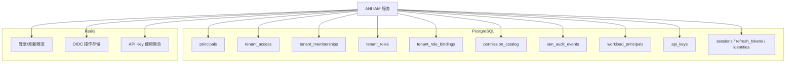
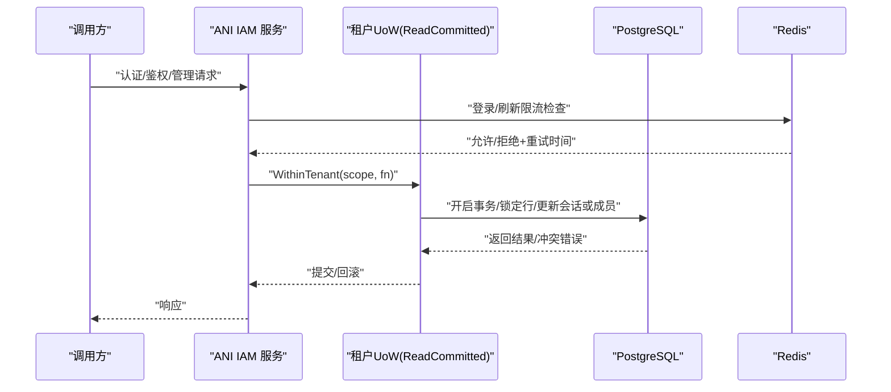
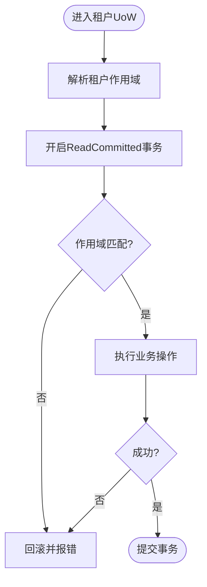
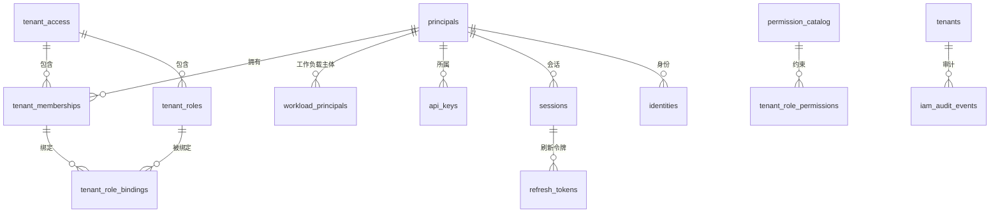
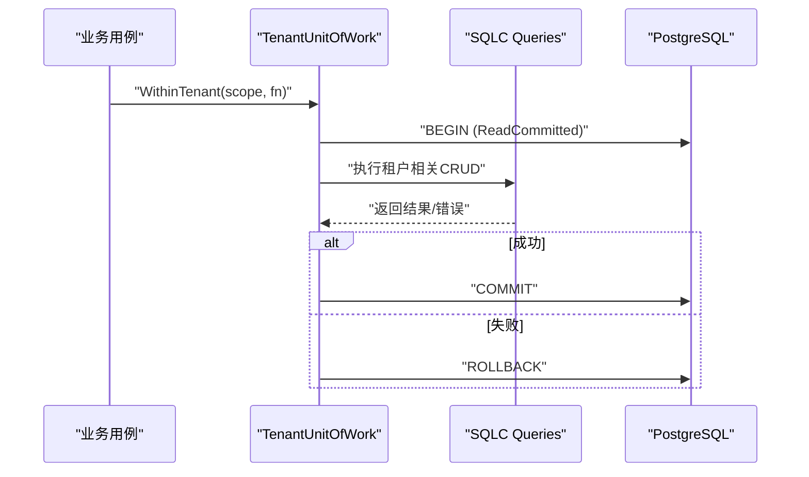
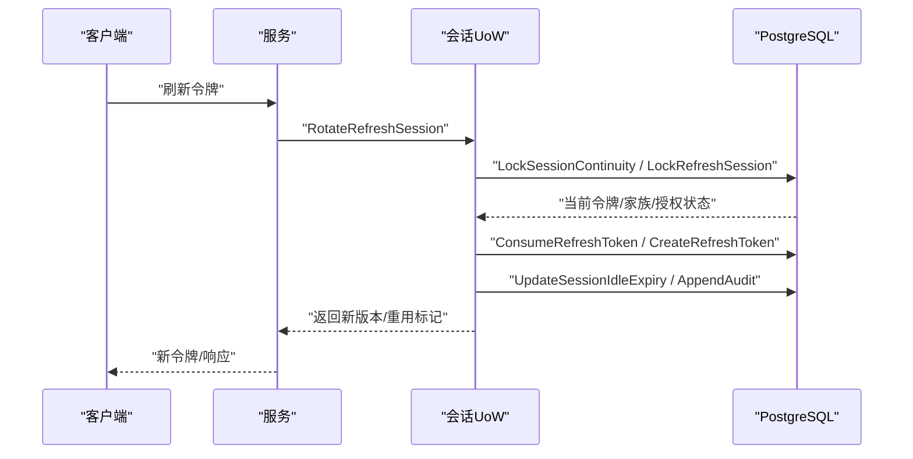
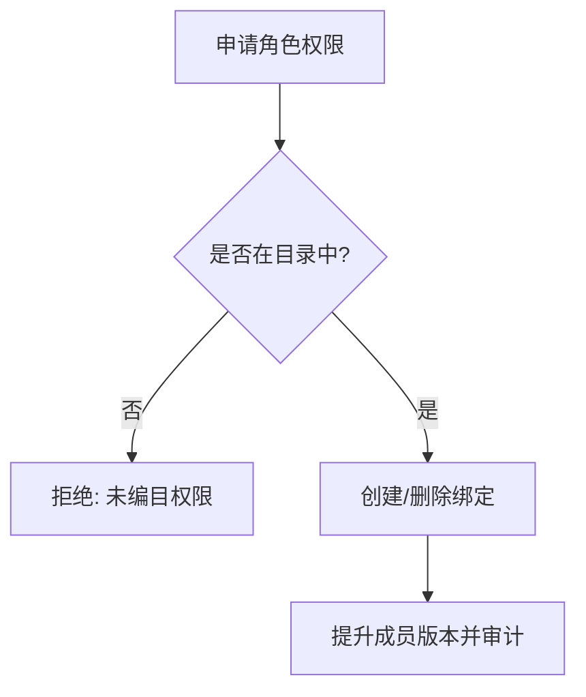
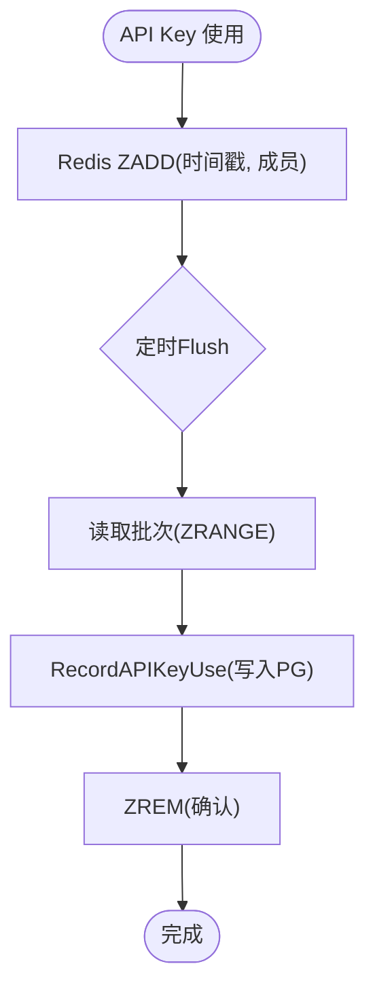
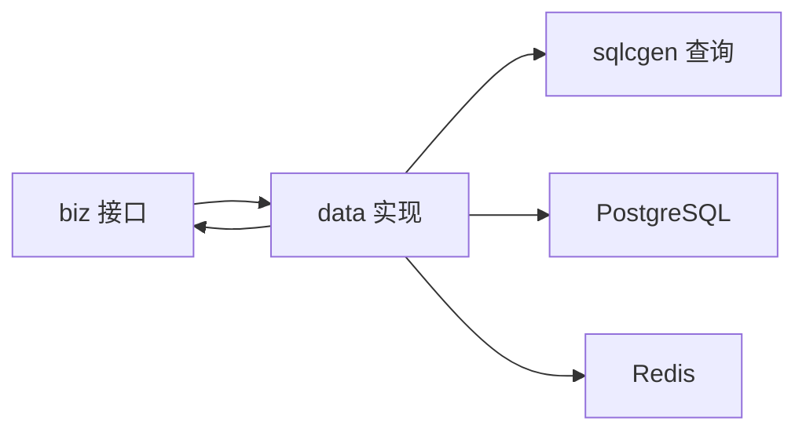

# 数据架构

<cite>
**本文引用的文件**
- [202609040001_persistence_foundation.sql](file://migrations/202609040001_persistence_foundation.sql)
- [202609070001_oidc_identity.sql](file://migrations/202609070001_oidc_identity.sql)
- [202609070002_session_continuity.sql](file://migrations/202609070002_session_continuity.sql)
- [202609080001_tenant_authorization.sql](file://migrations/202609080001_tenant_authorization.sql)
- [202609080002_permission_catalog.sql](file://migrations/202609080002_permission_catalog.sql)
- [202609080003_tenant_workload_api_key.sql](file://migrations/202609080003_tenant_workload_api_key.sql)
- [202609100001_workload_runtime_foundation.sql](file://migrations/202609100001_workload_runtime_foundation.sql)
- [atlas.sum](file://migrations/atlas.sum)
- [postgres.go](file://internal/data/postgres.go)
- [session_postgres.go](file://internal/data/session_postgres.go)
- [tenant_authorization.go](file://internal/data/tenant_authorization.go)
- [api_key_usage_redis.go](file://internal/data/api_key_usage_redis.go)
- [login_throttle_redis.go](file://internal/data/login_throttle_redis.go)
- [oidc_redis.go](file://internal/data/oidc_redis.go)
</cite>

## 目录
1. [简介](#简介)
2. [项目结构](#项目结构)
3. [核心组件](#核心组件)
4. [架构总览](#架构总览)
5. [详细组件分析](#详细组件分析)
6. [依赖关系分析](#依赖关系分析)
7. [性能考虑](#性能考虑)
8. [故障排查指南](#故障排查指南)
9. [结论](#结论)
10. [附录](#附录)

## 简介
本数据架构文档面向 ANI IAM，聚焦多租户数据隔离策略、数据库 Schema 设计、表结构与索引优化、核心数据模型（主体 Principal、会话 Session、租户 Tenant、角色 Role、权限 Permission）的关系映射、数据访问模式（SQLC 直写 + 事务管理）、缓存策略（Redis 在会话续期、OIDC 操作存储、API 密钥使用聚合与限流中的应用）、迁移管理与一致性保证，以及关键查询的性能优化方案。

## 项目结构
- 数据持久化：PostgreSQL 通过 SQLC 生成类型安全的查询代码；业务层以 Unit of Work 封装事务边界，按租户作用域组织读写。
- 缓存与速率限制：Redis 用于登录/刷新令牌限流、OIDC 临时状态存储、API 密钥使用量聚合与异步落库。
- 迁移管理：Atlas 驱动的版本化迁移，运行时只读校验 schema 版本，不执行写入型迁移。
- 权限与审计：集中式权限目录表约束可授予的权限组合；审计事件追加为不可变记录。



**图示来源**
- [202609040001_persistence_foundation.sql:17-148](file://migrations/202609040001_persistence_foundation.sql#L17-L148)
- [202609080002_permission_catalog.sql:5-159](file://migrations/202609080002_permission_catalog.sql#L5-L159)
- [202609080003_tenant_workload_api_key.sql:149-183](file://migrations/202609080003_tenant_workload_api_key.sql#L149-L183)
- [202609100001_workload_runtime_foundation.sql:1-89](file://migrations/202609100001_workload_runtime_foundation.sql#L1-L89)
- [login_throttle_redis.go:19-120](file://internal/data/login_throttle_redis.go#L19-L120)
- [oidc_redis.go:20-62](file://internal/data/oidc_redis.go#L20-L62)
- [api_key_usage_redis.go:21-61](file://internal/data/api_key_usage_redis.go#L21-L61)

**章节来源**
- [202609040001_persistence_foundation.sql:17-148](file://migrations/202609040001_persistence_foundation.sql#L17-L148)
- [202609080002_permission_catalog.sql:5-159](file://migrations/202609080002_permission_catalog.sql#L5-L159)
- [202609080003_tenant_workload_api_key.sql:149-183](file://migrations/202609080003_tenant_workload_api_key.sql#L149-L183)
- [202609100001_workload_runtime_foundation.sql:1-89](file://migrations/202609100001_workload_runtime_foundation.sql#L1-L89)
- [login_throttle_redis.go:19-120](file://internal/data/login_throttle_redis.go#L19-L120)
- [oidc_redis.go:20-62](file://internal/data/oidc_redis.go#L20-L62)
- [api_key_usage_redis.go:21-61](file://internal/data/api_key_usage_redis.go#L21-L61)

## 核心组件
- 多租户隔离：所有租户相关表以 tenant_id 作为分区键或过滤条件；通过外键和约束强制跨租户访问失败；运行时角色 ani_iam_runtime 仅具备最小必要权限。
- 核心实体：
  - 主体 Principal：统一标识人类与工作负载主体。
  - 租户访问 Tenant Access：租户生命周期与状态。
  - 成员关系 Membership：主体在租户中的成员身份。
  - 角色 Role 与绑定 Role Binding：基于目录的权限授权。
  - 权限目录 Permission Catalog：平台/租户/自有三类资源动作白名单。
  - 工作负载主体 Workload Principal：绑定到租户或平台的可信身份。
  - API 密钥 API Key：工作负载凭据，受严格状态与边界约束。
  - 会话 Session、刷新令牌 Refresh Token、OIDC 身份 Identities：认证与会话连续性。
  - 审计事件 Audit Events：不可变追加记录。

**章节来源**
- [202609040001_persistence_foundation.sql:17-148](file://migrations/202609040001_persistence_foundation.sql#L17-L148)
- [202609080002_permission_catalog.sql:5-159](file://migrations/202609080002_permission_catalog.sql#L5-L159)
- [202609080003_tenant_workload_api_key.sql:5-33](file://migrations/202609080003_tenant_workload_api_key.sql#L5-L33)
- [202609100001_workload_runtime_foundation.sql:1-89](file://migrations/202609100001_workload_runtime_foundation.sql#L1-L89)
- [202609070001_oidc_identity.sql:1-30](file://migrations/202609070001_oidc_identity.sql#L1-L30)
- [202609070002_session_continuity.sql:1-19](file://migrations/202609070002_session_continuity.sql#L1-L19)

## 架构总览
下图展示从请求进入服务到数据层与缓存层的交互路径，包括租户作用域事务、会话续期、OIDC 操作与限流。



**图示来源**
- [postgres.go:27-59](file://internal/data/postgres.go#L27-L59)
- [session_postgres.go:75-165](file://internal/data/session_postgres.go#L75-L165)
- [login_throttle_redis.go:122-147](file://internal/data/login_throttle_redis.go#L122-L147)

## 详细组件分析

### 多租户数据隔离策略
- 表级隔离：所有租户相关表均以 tenant_id 参与主键或唯一约束，并通过 CHECK 禁止零值租户。
- 关系隔离：外键指向 tenant_access(tenant_id)，跨租户引用将被拒绝。
- 权限隔离：运行时角色 ani_iam_runtime 仅被授予最小必要权限；管理员操作由迁移脚本控制。
- 作用域校验：事务内通过 tenantIDForScope 校验当前作用域与事务上下文一致，防止越界。



**图示来源**
- [postgres.go:27-59](file://internal/data/postgres.go#L27-L59)
- [postgres.go:184-193](file://internal/data/postgres.go#L184-L193)

**章节来源**
- [202609040001_persistence_foundation.sql:17-148](file://migrations/202609040001_persistence_foundation.sql#L17-L148)
- [postgres.go:184-193](file://internal/data/postgres.go#L184-L193)

### 核心数据模型与关系映射
- Principal：统一主体，区分 human/workload。
- Tenant Access：租户访问状态与版本。
- Membership：主体在租户中的成员关系，支持软删除（removed）。
- Role & Role Binding：角色定义与成员绑定，权限来自目录。
- Permission Catalog：平台/租户/自有三类资源动作白名单，角色权限必须命中目录。
- Workload Principal：工作负载主体，绑定到租户或平台，具有强不变性约束。
- API Key：工作负载凭据，状态机 active/revoked，受边界约束。
- Session / Refresh Token / Identity：认证与会话连续性，支持 OIDC。
- Audit Events：不可变审计追加。



**图示来源**
- [202609040001_persistence_foundation.sql:17-148](file://migrations/202609040001_persistence_foundation.sql#L17-L148)
- [202609080002_permission_catalog.sql:5-159](file://migrations/202609080002_permission_catalog.sql#L5-L159)
- [202609080003_tenant_workload_api_key.sql:5-33](file://migrations/202609080003_tenant_workload_api_key.sql#L5-L33)
- [202609100001_workload_runtime_foundation.sql:1-89](file://migrations/202609100001_workload_runtime_foundation.sql#L1-L89)
- [202609070001_oidc_identity.sql:1-30](file://migrations/202609070001_oidc_identity.sql#L1-L30)
- [202609070002_session_continuity.sql:1-19](file://migrations/202609070002_session_continuity.sql#L1-L19)

**章节来源**
- [202609040001_persistence_foundation.sql:17-148](file://migrations/202609040001_persistence_foundation.sql#L17-L148)
- [202609080002_permission_catalog.sql:5-159](file://migrations/202609080002_permission_catalog.sql#L5-L159)
- [202609080003_tenant_workload_api_key.sql:5-33](file://migrations/202609080003_tenant_workload_api_key.sql#L5-L33)
- [202609100001_workload_runtime_foundation.sql:1-89](file://migrations/202609100001_workload_runtime_foundation.sql#L1-L89)
- [202609070001_oidc_identity.sql:1-30](file://migrations/202609070001_oidc_identity.sql#L1-L30)
- [202609070002_session_continuity.sql:1-19](file://migrations/202609070002_session_continuity.sql#L1-L19)

### 数据访问模式与事务管理
- 访问方式：直接使用 SQLC 生成的查询函数，避免 ORM 抽象带来的不确定性。
- 事务隔离：统一 ReadCommitted，结合行锁与版本字段实现乐观并发控制。
- 作用域安全：每个 UoW 绑定租户作用域，所有查询携带 tenant_id 并校验一致性。
- 错误映射：将 PostgreSQL 错误码映射为领域错误（如版本冲突、权限不足、关系冲突）。



**图示来源**
- [postgres.go:27-59](file://internal/data/postgres.go#L27-L59)
- [postgres.go:195-232](file://internal/data/postgres.go#L195-L232)

**章节来源**
- [postgres.go:27-59](file://internal/data/postgres.go#L27-L59)
- [postgres.go:195-232](file://internal/data/postgres.go#L195-L232)

### 会话与刷新令牌连续性
- 刷新流程：锁定会话连续性，定位刷新令牌，消费旧令牌并创建新令牌，滑动会话空闲过期时间，追加审计。
- 复用与撤销：支持已消费令牌的复用场景，撤销整个家族并提升授权版本。
- 登出流程：撤销当前会话的刷新令牌、家族与授权，追加审计。
- 切换租户：在目标租户创建或复用授权与家族，滑动会话过期，追加审计。



**图示来源**
- [session_postgres.go:75-165](file://internal/data/session_postgres.go#L75-L165)
- [session_postgres.go:217-266](file://internal/data/session_postgres.go#L217-L266)
- [session_postgres.go:268-350](file://internal/data/session_postgres.go#L268-L350)
- [session_postgres.go:352-498](file://internal/data/session_postgres.go#L352-L498)

**章节来源**
- [session_postgres.go:75-165](file://internal/data/session_postgres.go#L75-L165)
- [session_postgres.go:217-266](file://internal/data/session_postgres.go#L217-L266)
- [session_postgres.go:268-350](file://internal/data/session_postgres.go#L268-L350)
- [session_postgres.go:352-498](file://internal/data/session_postgres.go#L352-L498)

### 角色与权限模型
- 权限目录：集中维护 scope/resource/action 三元组，角色权限必须命中目录。
- 角色绑定：成员与角色的绑定变更需提升成员版本，确保可见性与一致性。
- 管理保护：运行时仅能执行必要的删除（解绑），不能创造目录外的权限。



**图示来源**
- [202609080002_permission_catalog.sql:5-159](file://migrations/202609080002_permission_catalog.sql#L5-L159)
- [tenant_authorization.go:338-389](file://internal/data/tenant_authorization.go#L338-L389)
- [202609080001_tenant_authorization.sql:1-7](file://migrations/202609080001_tenant_authorization.sql#L1-L7)

**章节来源**
- [202609080002_permission_catalog.sql:5-159](file://migrations/202609080002_permission_catalog.sql#L5-L159)
- [tenant_authorization.go:338-389](file://internal/data/tenant_authorization.go#L338-L389)
- [202609080001_tenant_authorization.sql:1-7](file://migrations/202609080001_tenant_authorization.sql#L1-L7)

### 工作负载主体与API密钥
- 工作负载主体：绑定到租户或平台，具有严格的不变性与边界约束。
- API 密钥：受状态机与边界约束，活跃密钥要求工作负载边界有效；提供索引加速查询。
- 审计增强：审计事件增加调用者工作负载绑定信息，便于追踪。

```mermaid
classDiagram
class WorkloadPrincipal {
+principal_id
+owner_type
+tenant_id
+membership_id
+environment
+trust_domain
+name
+normalized_name
+version
+created_at
+updated_at
}
class APIKey {
+tenant_id
+key_id
+principal_id
+status
+display_prefix
+secret_digest
+never_expires
+expires_at
+last_used_at
+revoked_at
+version
+created_at
}
WorkloadPrincipal ||--o{ APIKey : "拥有"
```

**图示来源**
- [202609080003_tenant_workload_api_key.sql:5-33](file://migrations/202609080003_tenant_workload_api_key.sql#L5-L33)
- [202609080003_tenant_workload_api_key.sql:149-183](file://migrations/202609080003_tenant_workload_api_key.sql#L149-L183)
- [202609100001_workload_runtime_foundation.sql:1-89](file://migrations/202609100001_workload_runtime_foundation.sql#L1-L89)

**章节来源**
- [202609080003_tenant_workload_api_key.sql:5-33](file://migrations/202609080003_tenant_workload_api_key.sql#L5-L33)
- [202609080003_tenant_workload_api_key.sql:149-183](file://migrations/202609080003_tenant_workload_api_key.sql#L149-L183)
- [202609100001_workload_runtime_foundation.sql:1-89](file://migrations/202609100001_workload_runtime_foundation.sql#L1-L89)

### 缓存策略（Redis）
- 登录与刷新限流：基于 Lua 脚本的多键限流，支持指数退避与窗口重置。
- OIDC 操作存储：原子创建/获取与消费，支持幂等键与过期清理。
- API 密钥使用聚合：ZSET 按时间排序观察，批量刷入 Postgres，ACK 机制保证至少一次。



**图示来源**
- [api_key_usage_redis.go:33-47](file://internal/data/api_key_usage_redis.go#L33-L47)
- [api_key_usage_redis.go:63-123](file://internal/data/api_key_usage_redis.go#L63-L123)

**章节来源**
- [login_throttle_redis.go:34-104](file://internal/data/login_throttle_redis.go#L34-L104)
- [oidc_redis.go:25-54](file://internal/data/oidc_redis.go#L25-L54)
- [api_key_usage_redis.go:33-47](file://internal/data/api_key_usage_redis.go#L33-L47)
- [api_key_usage_redis.go:63-123](file://internal/data/api_key_usage_redis.go#L63-L123)

### 数据迁移管理、备份恢复与一致性
- 迁移管理：Atlas 管理迁移清单与校验和；运行时只读校验 schema 版本，不执行写入。
- 一致性保证：
  - 行级锁与版本字段：会话刷新/登出/切换使用行锁与期望版本，避免竞态。
  - 外键与约束：跨租户访问、权限目录约束、工作负载边界约束保障数据完整性。
  - 审计追加：所有关键变更均追加不可变审计事件。
- 备份恢复：建议对 PostgreSQL 进行定期逻辑/物理备份；Redis 作为易失/半持久缓存，重要状态应尽快落库。

**章节来源**
- [atlas.sum:1-46](file://migrations/atlas.sum#L1-L46)
- [202609100001_workload_runtime_foundation.sql:82-89](file://migrations/202609100001_workload_runtime_foundation.sql#L82-L89)
- [session_postgres.go:75-165](file://internal/data/session_postgres.go#L75-L165)
- [202609080002_permission_catalog.sql:151-159](file://migrations/202609080002_permission_catalog.sql#L151-L159)

## 依赖关系分析
- 数据层依赖：
  - biz 接口定义业务语义，data 实现具体持久化。
  - sqlcgen 提供类型安全查询，减少手写 SQL 风险。
  - Redis 模块实现限流、OIDC 状态与使用聚合。
- 耦合与内聚：
  - 高内聚：各 UoW 围绕特定领域（租户、会话、授权）组织。
  - 低耦合：通过接口与错误映射解耦外部依赖。
- 循环依赖：未发现直接循环导入；通过接口与包边界隔离。



**图示来源**
- [postgres.go:1-16](file://internal/data/postgres.go#L1-L16)
- [tenant_authorization.go:1-13](file://internal/data/tenant_authorization.go#L1-L13)
- [session_postgres.go:1-15](file://internal/data/session_postgres.go#L1-L15)

**章节来源**
- [postgres.go:1-16](file://internal/data/postgres.go#L1-L16)
- [tenant_authorization.go:1-13](file://internal/data/tenant_authorization.go#L1-L13)
- [session_postgres.go:1-15](file://internal/data/session_postgres.go#L1-L15)

## 性能考虑
- 索引优化：
  - 成员关系：tenant_memberships 上针对 tenant_id/status/id 的复合索引，支持分页与状态过滤。
  - 角色绑定：tenant_role_bindings 上针对 membership_id 的索引，加速角色列表与解绑。
  - API 密钥：principal/key_id 与 principal/created_at 索引，支持快速查找与历史浏览。
  - 审计事件：recorded_at DESC 索引，支持按租户与时间倒序查询。
  - 刷新令牌：active family 的唯一部分索引，保证每家族仅一个活跃令牌。
- 查询优化：
  - 使用 SQLC 生成精确查询，避免 N+1。
  - 分页采用游标（cursor）+ 限制条数，减少扫描范围。
  - 行锁序列化关键路径（会话连续性、租户切换边界），降低并发冲突。
- 缓存与限流：
  - Redis 限流减少数据库压力，Lua 脚本保证原子性。
  - OIDC 状态短期驻留 Redis，降低数据库热点。
  - API Key 使用聚合异步落库，削峰填谷。

**章节来源**
- [202609040001_persistence_foundation.sql:53-99](file://migrations/202609040001_persistence_foundation.sql#L53-L99)
- [202609040001_persistence_foundation.sql:136-137](file://migrations/202609040001_persistence_foundation.sql#L136-L137)
- [202609070002_session_continuity.sql:16-18](file://migrations/202609070002_session_continuity.sql#L16-L18)
- [202609080003_tenant_workload_api_key.sql:178-183](file://migrations/202609080003_tenant_workload_api_key.sql#L178-L183)
- [login_throttle_redis.go:34-104](file://internal/data/login_throttle_redis.go#L34-L104)
- [oidc_redis.go:25-54](file://internal/data/oidc_redis.go#L25-L54)
- [api_key_usage_redis.go:63-123](file://internal/data/api_key_usage_redis.go#L63-L123)

## 故障排查指南
- 常见错误映射：
  - 唯一冲突（23505）：映射为领域冲突错误（如成员重复、密钥重复）。
  - 版本冲突（40001/40P01）：并发更新导致版本不一致，需重试或提示用户刷新。
  - 权限不足（42501）：运行时尝试修改平台主体或受限表，检查角色与触发器。
  - 关系冲突（23503）：外键约束失败，检查租户/成员/角色是否存在且状态正确。
- 诊断步骤：
  - 检查事务是否提交/回滚，关注 UoW 的 defer 逻辑。
  - 查看 Redis 限流键 TTL 与计数，确认是否达到阈值。
  - 核对 OIDC 操作状态是否过期或被消费。
  - 审计事件是否追加成功，定位决策原因。

**章节来源**
- [postgres.go:195-232](file://internal/data/postgres.go#L195-L232)
- [login_throttle_redis.go:122-147](file://internal/data/login_throttle_redis.go#L122-L147)
- [oidc_redis.go:111-136](file://internal/data/oidc_redis.go#L111-L136)
- [202609080003_tenant_workload_api_key.sql:184-200](file://migrations/202609080003_tenant_workload_api_key.sql#L184-L200)

## 结论
ANI IAM 的数据架构以 PostgreSQL 为核心，结合 SQLC 的类型安全查询与细粒度事务管理，实现了强一致的多租户隔离与权限控制。Redis 承担高吞吐的限流、临时状态与使用聚合，显著降低数据库压力。通过权限目录、约束与审计事件，系统在保证灵活性的同时维持了严格的安全边界与可追溯性。未来可继续优化索引与查询计划，完善监控与告警，提升整体稳定性与可观测性。

## 附录
- 迁移清单与校验：参见 atlas.sum，确保部署环境迁移一致。
- 运行时只读校验：iam_schema_revision 表用于运行时验证最终修订。
- 最佳实践：
  - 所有写操作置于 UoW 中，明确事务边界。
  - 使用游标分页与限制条数，避免全表扫描。
  - 谨慎扩展权限目录，保持最小权限原则。
  - 定期备份 PostgreSQL，评估 Redis 持久化策略。

**章节来源**
- [atlas.sum:1-46](file://migrations/atlas.sum#L1-L46)
- [202609100001_workload_runtime_foundation.sql:82-89](file://migrations/202609100001_workload_runtime_foundation.sql#L82-L89)