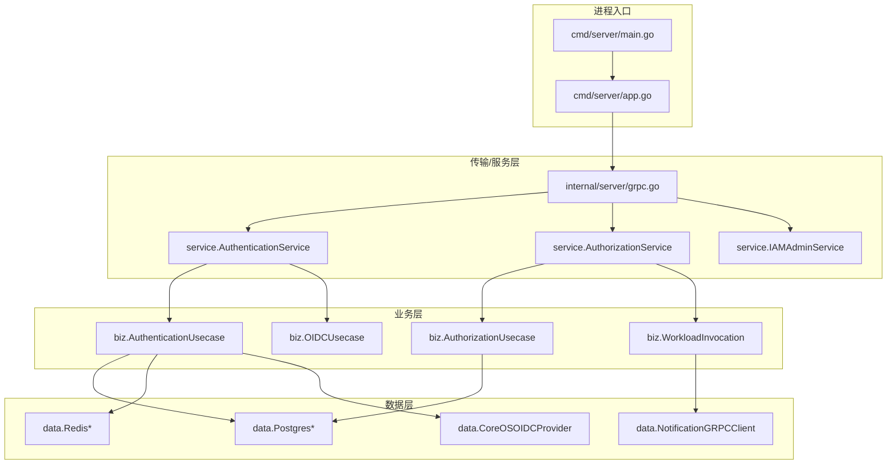
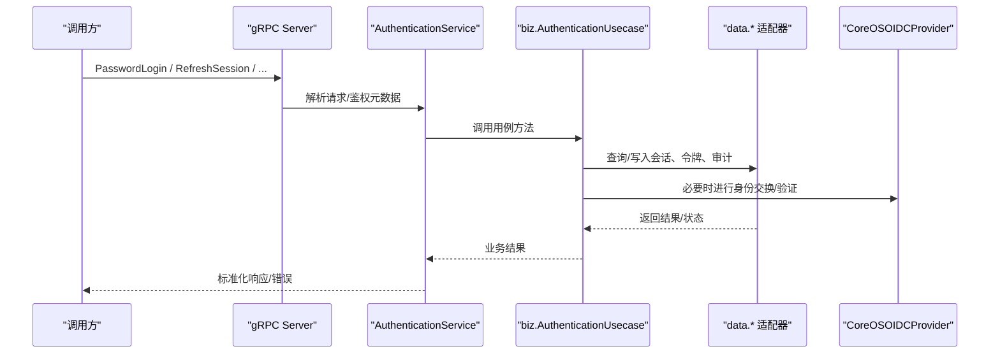
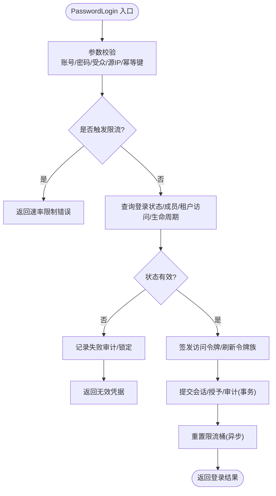
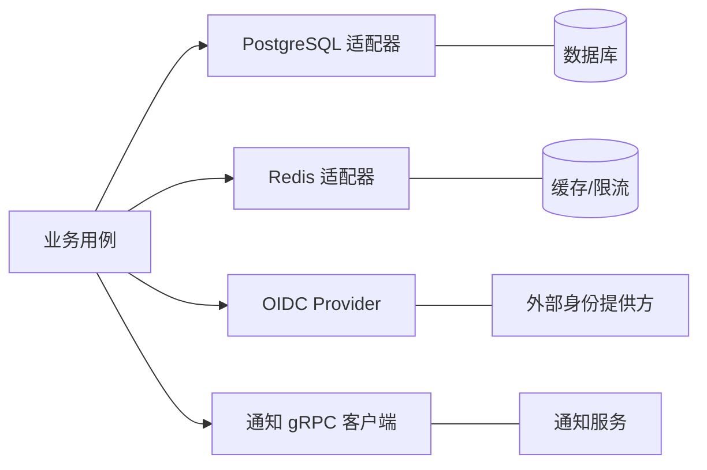
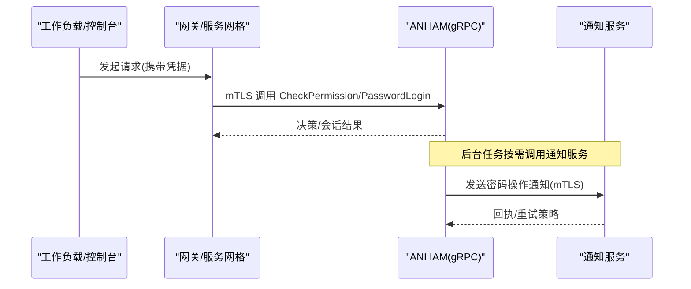
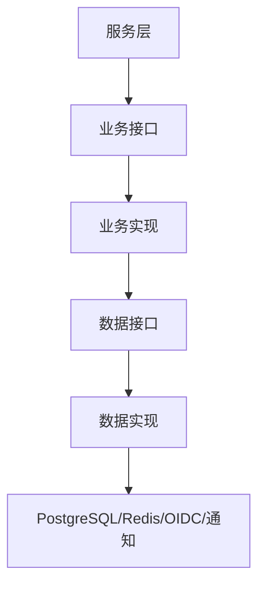

# 整体架构

<cite>
**本文引用的文件**
- [main.go](file://cmd/server/main.go)
- [app.go](file://cmd/server/app.go)
- [conf.proto](file://internal/conf/conf.proto)
- [config.yaml](file://configs/config.yaml)
- [authentication_service.proto](file://api/iam/v1/authentication_service.proto)
- [authorization_service.proto](file://api/iam/v1/authorization_service.proto)
- [grpc.go](file://internal/server/grpc.go)
- [service.go](file://internal/service/service.go)
- [data.go](file://internal/data/data.go)
- [biz.go](file://internal/biz/biz.go)
- [authentication.go](file://internal/service/authentication.go)
- [authentication_biz.go](file://internal/biz/authentication.go)
</cite>

## 目录
1. [简介](#简介)
2. [项目结构](#项目结构)
3. [核心组件](#核心组件)
4. [架构总览](#架构总览)
5. [详细组件分析](#详细组件分析)
6. [依赖关系分析](#依赖关系分析)
7. [性能考量](#性能考量)
8. [故障排查指南](#故障排查指南)
9. [结论](#结论)
10. [附录](#附录)

## 简介
本文件为 ANI IAM 的整体架构文档，聚焦分层架构模式（服务层 Service、业务层 Biz、数据层 Data）的职责划分与交互；阐述依赖注入与接口抽象如何解耦组件；说明 gRPC 微服务架构下的服务发现、负载均衡与服务间通信机制；并给出系统架构图、配置管理策略与环境隔离机制。

## 项目结构
ANI IAM 采用清晰的三层架构：
- 传输/服务层（Service）：将 gRPC 请求映射到业务用例，负责参数校验、错误映射与协议转换。
- 业务层（Biz）：实现领域用例与规则，不依赖框架或传输细节，仅依赖接口端口。
- 数据层（Data）：封装持久化与外部基础设施适配器（PostgreSQL、Redis、OIDC、gRPC 客户端等）。
- 启动与装配（cmd/server）：读取配置、组装依赖、注册 gRPC 服务、启动后台任务与可观测性。



图表来源
- [main.go:34-101](file://cmd/server/main.go#L34-L101)
- [app.go:369-744](file://cmd/server/app.go#L369-L744)
- [grpc.go:14-51](file://internal/server/grpc.go#L14-L51)
- [authentication_service.proto:11-33](file://api/iam/v1/authentication_service.proto#L11-L33)
- [authorization_service.proto:10-16](file://api/iam/v1/authorization_service.proto#L10-L16)

章节来源
- [main.go:34-101](file://cmd/server/main.go#L34-L101)
- [app.go:369-744](file://cmd/server/app.go#L369-L744)
- [conf.proto:9-58](file://internal/conf/conf.proto#L9-L58)
- [config.yaml:1-61](file://configs/config.yaml#L1-L61)

## 核心组件
- 配置与引导
  - 使用 Kratos 配置中心从配置文件与环境变量加载 Bootstrap 配置，扫描到 conf.Bootstrap 结构体，用于初始化运行时资源（数据库连接池、Redis、OIDC、TLS、通知通道等）。
- gRPC 服务注册
  - 通过 NewTargetGRPCServer 统一注册 AuthenticationService、AuthorizationService、IAMAdminService，并强制启用双向 TLS 与中间件链。
- 依赖注入与装配
  - 在 buildApp 中按顺序创建数据层实例、业务用例与服务实现，并通过构造函数注入接口，避免硬耦合。
- 后台任务
  - API Key 用量聚合与快照发布、密码操作通知分发等作为独立 Worker 运行，具备超时与取消语义。
- 可观测性与就绪检查
  - 提供 Readiness 探针与 Observability 中间件，启动后标记就绪，停止时优雅关闭。

章节来源
- [main.go:82-101](file://cmd/server/main.go#L82-L101)
- [app.go:369-744](file://cmd/server/app.go#L369-L744)
- [grpc.go:14-51](file://internal/server/grpc.go#L14-L51)
- [conf.proto:9-58](file://internal/conf/conf.proto#L9-L58)

## 架构总览
ANI IAM 以 gRPC 为对外契约，服务层仅做协议适配与错误映射；业务层专注领域流程与规则；数据层屏蔽存储与第三方依赖差异。启动阶段完成所有依赖的构建与校验，确保“失败即停”的强一致启动。



图表来源
- [authentication_service.proto:11-33](file://api/iam/v1/authentication_service.proto#L11-L33)
- [authentication.go:150-194](file://internal/service/authentication.go#L150-L194)
- [authentication_biz.go:341-530](file://internal/biz/authentication.go#L341-L530)
- [app.go:492-524](file://cmd/server/app.go#L492-L524)

## 详细组件分析

### 服务层（Service）职责与实现
- 协议适配：将 proto 请求转换为业务命令对象，提取边界、受众、源 IP、幂等键等上下文。
- 错误映射：将业务异常映射为带 ErrorInfo 的 gRPC 状态码，便于网关与上游统一处理。
- 可选能力扩展：通过 WithXxx 注入平台密码、平台会话、平台授权等能力，保持向后兼容。

```mermaid
classDiagram
class AuthenticationService {
+PasswordLogin(ctx, req)
+RefreshSession(ctx, req)
+LogoutSession(ctx, req)
+BeginOIDCLogin(ctx, req)
+CompleteOIDCLogin(ctx, req)
+ValidatePrincipal(ctx, req)
+IssueWorkloadToken(ctx, req)
+IssueDelegation(ctx, req)
}
class AuthorizationService {
+CheckPermission(ctx, req)
+VerifyWorkloadCaller(ctx, req)
+VerifySessionContinuation(ctx, req)
+VerifyWorkloadInvocation(ctx, req)
}
class IAMAdminService {
+租户/角色/成员/工作负载管理等
}
AuthenticationService --> "调用" biz.AuthenticationUsecase
AuthorizationService --> "调用" biz.AuthorizationUsecase
IAMAdminService --> "调用" biz.* Usecases
```

图表来源
- [authentication_service.proto:11-33](file://api/iam/v1/authentication_service.proto#L11-L33)
- [authorization_service.proto:10-16](file://api/iam/v1/authorization_service.proto#L10-L16)
- [authentication.go:91-106](file://internal/service/authentication.go#L91-L106)

章节来源
- [authentication.go:91-106](file://internal/service/authentication.go#L91-L106)
- [authentication.go:108-138](file://internal/service/authentication.go#L108-L138)
- [authentication.go:150-194](file://internal/service/authentication.go#L150-L194)
- [authentication.go:256-316](file://internal/service/authentication.go#L256-L316)
- [authentication.go:476-683](file://internal/service/authentication.go#L476-L683)

### 业务层（Biz）用例与领域规则
- 认证用例：校验输入、限流、查库、签发访问令牌与刷新令牌族、记录审计事件、计算会话生命周期。
- 授权用例：基于策略注册表与权限目录进行决策，支持平台授权与工作负载调用链验证。
- OIDC 用例：发起/完成登录与身份绑定，维护一次性状态与重放保护。
- 工作负载调用：验证 mTLS/SPIFFE 身份、颁发短期工作负载凭证、验证会话延续与委托。



图表来源
- [authentication_biz.go:341-530](file://internal/biz/authentication.go#L341-L530)

章节来源
- [authentication_biz.go:341-530](file://internal/biz/authentication.go#L341-L530)
- [authentication_biz.go:532-645](file://internal/biz/authentication.go#L532-L645)

### 数据层（Data）适配器与基础设施
- PostgreSQL：会话、授予、审计、租户授权、工作负载、OIDC 状态等持久化。
- Redis：登录限流、API Key 用量聚合与创建限速、OIDC 操作存储、邀请账户限速等。
- OIDC：对接 CoreOS Dex，完成授权码流程与身份验证。
- gRPC 客户端：向通知服务发送密码操作通知，使用工作负载身份源与目标注册表进行安全通信。



图表来源
- [app.go:414-443](file://cmd/server/app.go#L414-L443)
- [app.go:450-524](file://cmd/server/app.go#L450-L524)
- [data.go:6-20](file://internal/data/data.go#L6-L20)

章节来源
- [data.go:6-20](file://internal/data/data.go#L6-L20)
- [app.go:414-443](file://cmd/server/app.go#L414-L443)
- [app.go:450-524](file://cmd/server/app.go#L450-L524)

### gRPC 微服务架构：服务发现、负载均衡与通信
- 服务暴露：NewTargetGRPCServer 强制双向 TLS，禁用反射，注册三个核心服务。
- 服务发现与负载均衡：由部署侧（如 Kubernetes Service/DNS、Ingress/Gateway）承担；IAM 自身不内嵌服务发现逻辑，通过配置中的地址与证书建立 mTLS 通道。
- 服务间通信：工作负载调用与通知通道通过 SDK 与 data.NotificationGRPCClient 实现，结合 WorkloadRegistry 与目标策略注册表进行白名单与版本控制。



图表来源
- [grpc.go:14-51](file://internal/server/grpc.go#L14-L51)
- [app.go:628-644](file://cmd/server/app.go#L628-L644)

章节来源
- [grpc.go:14-51](file://internal/server/grpc.go#L14-L51)
- [app.go:628-644](file://cmd/server/app.go#L628-L644)

### 配置管理与环境隔离
- 配置来源：配置文件（config.yaml）与环境变量（KRATOS_*），合并后扫描到 Bootstrap。
- 关键配置项：
  - server.grpc：网络、地址、超时、mTLS 证书与客户端 CA。
  - runtime.postgresql/redis：连接串、命名空间、限流窗口与超时。
  - runtime.access_token：签发者、活跃密钥、私钥文件。
  - runtime.notification：通知服务地址、证书、出站密钥、URL 基址、调度间隔与超时。
  - runtime.oidc：提供商、发行者 URL、回调 URI、HTTP 超时。
  - policy_revision：策略版本，用于权限目录一致性校验。
- 环境隔离：通过 profile、environment、trust_domain、workload_registry_file/sha256 等字段区分环境与信任域，配合只读策略与工件校验保证一致性。

章节来源
- [conf.proto:9-58](file://internal/conf/conf.proto#L9-L58)
- [config.yaml:1-61](file://configs/config.yaml#L1-L61)
- [main.go:82-101](file://cmd/server/main.go#L82-L101)

## 依赖关系分析
- 低耦合：服务层仅依赖业务接口；业务层仅依赖数据层接口；数据层直接依赖基础设施。
- 装配点：buildApp 集中创建并注入依赖，避免循环依赖与隐式全局状态。
- 外部依赖：PostgreSQL、Redis、OIDC、通知服务、工作负载注册表。



图表来源
- [app.go:369-744](file://cmd/server/app.go#L369-L744)
- [service.go:1-4](file://internal/service/service.go#L1-L4)
- [biz.go:1-4](file://internal/biz/biz.go#L1-L4)
- [data.go:6-20](file://internal/data/data.go#L6-L20)

章节来源
- [app.go:369-744](file://cmd/server/app.go#L369-L744)
- [service.go:1-4](file://internal/service/service.go#L1-L4)
- [biz.go:1-4](file://internal/biz/biz.go#L1-L4)
- [data.go:6-20](file://internal/data/data.go#L6-L20)

## 性能考量
- 连接复用：PostgreSQL 连接池与 Redis 客户端复用，减少握手开销。
- 限流与背压：登录限流、API Key 创建限速与用量聚合，防止雪崩。
- 批量与定时：API Key 用量批量刷新与快照发布，降低写放大。
- 短生命周期令牌：访问令牌与短期工作负载凭证减少长期风险与存储压力。
- 超时与取消：所有 I/O 均设置超时与上下文取消，避免长尾阻塞。

## 故障排查指南
- 启动失败
  - 检查 PostgreSQL/Redis 连通性、OIDC 配置与证书路径、策略修订版本。
- 认证失败
  - 关注速率限制、凭据无效、租户生命周期不可用、策略版本不匹配等错误码与元数据。
- 授权拒绝
  - 核对 operation_id、policy_revision、目标资源与权限目录版本一致性。
- 通知失败
  - 检查通知服务可达性、证书与 DNS 名称、出站密钥有效性。

章节来源
- [authentication.go:476-683](file://internal/service/authentication.go#L476-L683)
- [app.go:414-443](file://cmd/server/app.go#L414-L443)
- [app.go:628-644](file://cmd/server/app.go#L628-L644)

## 结论
ANI IAM 通过清晰的分层架构与严格的依赖注入，实现了高内聚、低耦合的可演进系统。gRPC 契约稳定、策略驱动、可观测性强，配合配置与环境隔离，满足多环境部署与灰度切换需求。未来可在服务发现与负载均衡层面进一步集成服务网格，增强弹性与可观测性。

## 附录
- 对外 gRPC 服务清单
  - AuthenticationService：密码登录、OIDC 登录/身份绑定、会话管理、工作负载令牌签发与委托。
  - AuthorizationService：权限检查、工作负载调用验证、会话延续验证。
  - IAMAdminService：租户/角色/成员/工作负载等管理能力。

章节来源
- [authentication_service.proto:11-33](file://api/iam/v1/authentication_service.proto#L11-L33)
- [authorization_service.proto:10-16](file://api/iam/v1/authorization_service.proto#L10-L16)