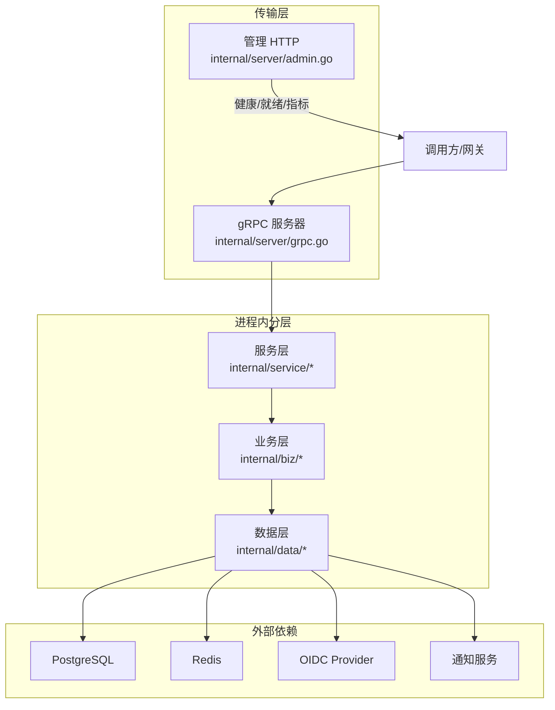
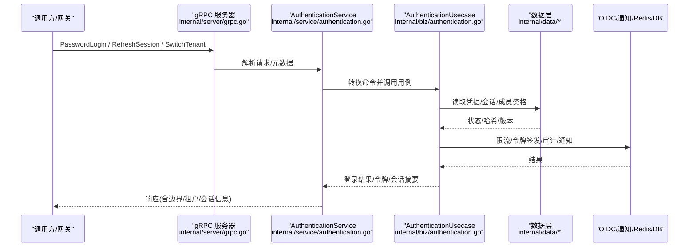
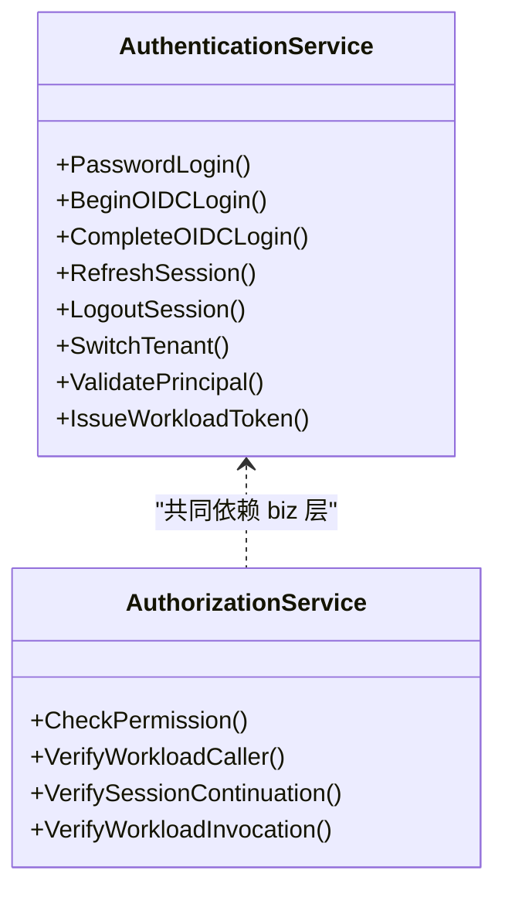
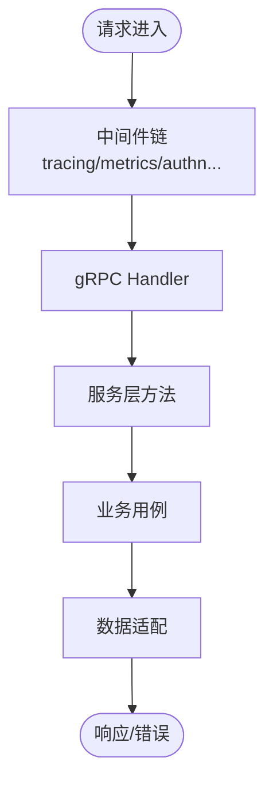
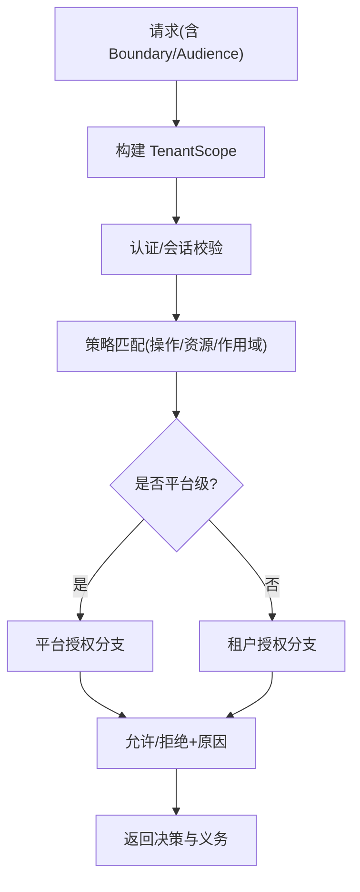
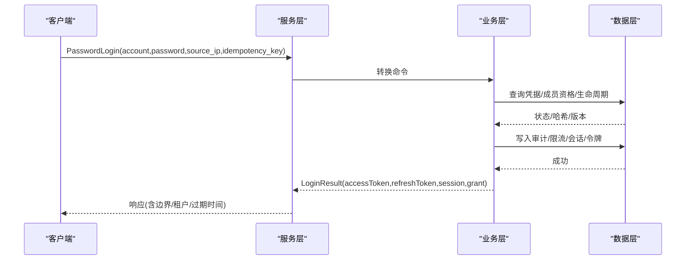
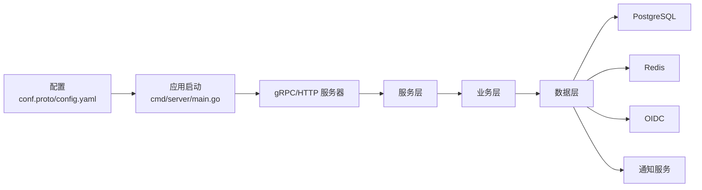

# 架构设计

<cite>
**本文引用的文件**
- [cmd/server/main.go](file://cmd/server/main.go)
- [internal/server/grpc.go](file://internal/server/grpc.go)
- [internal/server/admin.go](file://internal/server/admin.go)
- [api/iam/v1/authentication_service.proto](file://api/iam/v1/authentication_service.proto)
- [api/iam/v1/authorization_service.proto](file://api/iam/v1/authorization_service.proto)
- [configs/config.yaml](file://configs/config.yaml)
- [internal/conf/conf.proto](file://internal/conf/conf.proto)
- [internal/service/authentication.go](file://internal/service/authentication.go)
- [internal/service/authorization.go](file://internal/service/authorization.go)
- [internal/biz/authentication.go](file://internal/biz/authentication.go)
- [internal/biz/authorization.go](file://internal/biz/authorization.go)
- [internal/data/data.go](file://internal/data/data.go)
</cite>

## 目录
1. [简介](#简介)
2. [项目结构](#项目结构)
3. [核心组件](#核心组件)
4. [架构总览](#架构总览)
5. [详细组件分析](#详细组件分析)
6. [依赖关系分析](#依赖关系分析)
7. [性能考量](#性能考量)
8. [故障排查指南](#故障排查指南)
9. [结论](#结论)
10. [附录](#附录)

## 简介
本架构设计文档面向 ANI IAM，系统性阐述分层架构（服务层、业务层、数据层）的职责与交互，gRPC API 设计、中间件机制、依赖注入与工厂模式的应用，多租户隔离策略与权限边界，以及安全架构（认证、授权、令牌与会话）。文档包含系统架构图、数据流图与组件交互图，帮助读者从宏观到微观理解系统的运行方式。

## 项目结构
ANI IAM 采用 Kratos 框架驱动的微服务工程结构：
- api/iam/v1：定义 gRPC 服务契约（AuthenticationService、AuthorizationService、IAMAdminService），以及消息类型与枚举。
- internal/server：gRPC/HTTP 服务器装配、TLS、中间件、健康检查与指标暴露。
- internal/service：传输到用例的映射层，负责参数校验、错误映射、审计上下文提取等。
- internal/biz：领域无关的业务用例与实体，封装认证、授权、会话、工作负载等核心流程。
- internal/data：基础设施适配器（PostgreSQL、Redis、OIDC、通知、令牌编解码、操作注册表等）。
- cmd/server：应用启动入口，配置加载、日志、运行时参数与子命令。
- configs：运行时配置（gRPC/TLS、PostgreSQL、Redis、OIDC、通知、访问令牌签发等）。



图表来源
- [internal/server/grpc.go:14-51](file://internal/server/grpc.go#L14-L51)
- [internal/server/admin.go:16-55](file://internal/server/admin.go#L16-L55)
- [internal/service/authentication.go:91-106](file://internal/service/authentication.go#L91-L106)
- [internal/biz/authentication.go:286-339](file://internal/biz/authentication.go#L286-L339)
- [internal/data/data.go:6-20](file://internal/data/data.go#L6-L20)

章节来源
- [cmd/server/main.go:34-101](file://cmd/server/main.go#L34-L101)
- [internal/server/grpc.go:14-51](file://internal/server/grpc.go#L14-L51)
- [internal/server/admin.go:16-55](file://internal/server/admin.go#L16-L55)
- [configs/config.yaml:1-61](file://configs/config.yaml#L1-L61)

## 核心组件
- gRPC 服务装配与 TLS：在 NewTargetGRPCServer 中注册 AuthenticationService、AuthorizationService、IAMAdminService，并强制 mTLS 客户端证书校验。
- 服务层映射：service.AuthenticationService 将 gRPC 请求转换为 biz 命令，统一错误映射与审计上下文；service.AuthorizationService 执行权限检查。
- 业务用例：biz.AuthenticationUsecase 实现密码/OIDC 登录、会话刷新、登出、租户切换与工作负载令牌发放；biz.AuthorizationUsecase 基于策略注册表与凭据验证器进行决策。
- 数据适配：data.Data 持有数据库连接池与出站保护器等共享资源，具体仓储由内部包提供（如 session_postgres.go、oidc_*、workload_* 等）。

章节来源
- [internal/server/grpc.go:14-51](file://internal/server/grpc.go#L14-L51)
- [internal/service/authentication.go:91-106](file://internal/service/authentication.go#L91-L106)
- [internal/service/authorization.go:17-25](file://internal/service/authorization.go#L17-L25)
- [internal/biz/authentication.go:286-339](file://internal/biz/authentication.go#L286-L339)
- [internal/biz/authorization.go:199-223](file://internal/biz/authorization.go#L199-L223)
- [internal/data/data.go:6-20](file://internal/data/data.go#L6-L20)

## 架构总览
下图展示端到端请求路径：调用方通过受 mTLS 保护的 gRPC 进入 IAM，服务层做参数校验与错误映射，业务层执行业务规则与策略匹配，数据层持久化会话、令牌、审计事件并访问外部依赖。



图表来源
- [internal/server/grpc.go:14-51](file://internal/server/grpc.go#L14-L51)
- [internal/service/authentication.go:150-194](file://internal/service/authentication.go#L150-L194)
- [internal/biz/authentication.go:341-530](file://internal/biz/authentication.go#L341-L530)
- [internal/data/data.go:6-20](file://internal/data/data.go#L6-L20)

## 详细组件分析

### gRPC API 设计与协议
- AuthenticationService：提供密码登录、OIDC 登录/身份绑定、邀请账户处理、会话刷新/登出/列表/撤销、租户切换、主体校验、工作负载令牌发放与委托。
- AuthorizationService：提供单一“失败关闭”的权限判定接口，支持按操作 ID 与策略版本进行鉴权，返回明确允许/拒绝原因与义务约束。
- 消息与边界：请求携带 Audience（console/boss）、Boundary（tenant/platform）、SourceIP（仅可信网关传入）、IdempotencyKey 等，确保幂等与安全。



图表来源
- [api/iam/v1/authentication_service.proto:11-33](file://api/iam/v1/authentication_service.proto#L11-L33)
- [api/iam/v1/authorization_service.proto:10-16](file://api/iam/v1/authorization_service.proto#L10-L16)

章节来源
- [api/iam/v1/authentication_service.proto:11-33](file://api/iam/v1/authentication_service.proto#L11-L33)
- [api/iam/v1/authorization_service.proto:10-16](file://api/iam/v1/authorization_service.proto#L10-L16)

### 中间件机制与可观测性
- gRPC 中间件链：NewGRPCServer 接受可变中间件，用于跨切面能力（如追踪、限流、审计）。
- 管理端口：admin HTTP 暴露 healthz、readyz、metrics，结合 readiness 组件实现就绪探测。
- 日志与过滤：启动时设置结构化 JSON 日志，并对敏感字段进行过滤（如 token、password、DSN 等）。



图表来源
- [internal/server/grpc.go:14-27](file://internal/server/grpc.go#L14-L27)
- [internal/server/admin.go:16-55](file://internal/server/admin.go#L16-L55)
- [cmd/server/main.go:104-131](file://cmd/server/main.go#L104-L131)

章节来源
- [internal/server/grpc.go:14-27](file://internal/server/grpc.go#L14-L27)
- [internal/server/admin.go:16-55](file://internal/server/admin.go#L16-L55)
- [cmd/server/main.go:104-131](file://cmd/server/main.go#L104-L131)

### 依赖注入与工厂模式
- 显式构造：服务层与服务实现通过构造函数注入用例接口（如 NewAuthenticationService、NewAuthorizationService），避免全局单例耦合。
- 工厂式装配：NewTargetGRPCServer 作为工厂，组装 gRPC 服务器并注册全部服务；NewData 创建共享的数据访问容器。
- 可选依赖：OIDC 能力以可选参数注入，未提供时返回不可用状态，保持最小可用部署。

```mermaid
classDiagram
class ServerFactory {
+NewTargetGRPCServer(...)
}
class AuthenticationServiceImpl {
-authenticationUsecase
-oidcUsecase
}
class AuthorizationServiceImpl {
-authorizationUsecase
}
class DataFactory {
+NewData(pool, protectors...)
}
ServerFactory --> AuthenticationServiceImpl : "注入用例"
ServerFactory --> AuthorizationServiceImpl : "注入用例"
DataFactory --> "PostgreSQL/Redis/Outbox" : "持有连接"
```

图表来源
- [internal/server/grpc.go:29-51](file://internal/server/grpc.go#L29-L51)
- [internal/service/authentication.go:91-106](file://internal/service/authentication.go#L91-L106)
- [internal/service/authorization.go:17-25](file://internal/service/authorization.go#L17-L25)
- [internal/data/data.go:6-20](file://internal/data/data.go#L6-L20)

章节来源
- [internal/server/grpc.go:29-51](file://internal/server/grpc.go#L29-L51)
- [internal/service/authentication.go:91-106](file://internal/service/authentication.go#L91-L106)
- [internal/service/authorization.go:17-25](file://internal/service/authorization.go#L17-L25)
- [internal/data/data.go:6-20](file://internal/data/data.go#L6-L20)

### 多租户架构与权限边界
- 租户边界：Boundary 支持 tenant 与 platform 两种范围；BOSS 受众必须使用 platform 边界，Console 受众绑定 tenant。
- 数据访问隔离：所有读/写均通过 TenantScope 限定作用域，确保跨租户数据不可见。
- 权限模型：AuthorizationPolicy 声明操作、资源、作用域、凭据类型与主体类型；CheckPermission 根据策略版本与目标资源进行严格判定。
- 租户生命周期：对生命周期投影新鲜性与状态的检查贯穿认证与授权路径，防止不合规租户访问。



图表来源
- [internal/biz/authentication.go:168-188](file://internal/biz/authentication.go#L168-L188)
- [internal/biz/authorization.go:60-111](file://internal/biz/authorization.go#L60-L111)
- [internal/biz/authorization.go:225-329](file://internal/biz/authorization.go#L225-L329)

章节来源
- [internal/biz/authentication.go:168-188](file://internal/biz/authentication.go#L168-L188)
- [internal/biz/authorization.go:60-111](file://internal/biz/authorization.go#L60-L111)
- [internal/biz/authorization.go:225-329](file://internal/biz/authorization.go#L225-L329)

### 安全架构：认证、授权、令牌与会话
- 认证流程：
  - 密码登录：校验账号/密码/源 IP/幂等键，记录失败尝试与锁定，成功后创建 Session、Grant、Refresh Token 家族并签发 Access Token。
  - OIDC 登录/身份绑定：两阶段 Begin/Complete，支持浏览器回调证明与重认证窗口。
  - 会话管理：刷新、登出、列出与撤销，支持跨设备与跨租户切换。
- 授权模型：
  - 策略注册表：按 operation_id 与 policy_revision 精确匹配，支持平台/租户/自有作用域。
  - 凭据类型控制：Access Token、API Key、Workload Token 分别受策略白名单限制。
  - 义务约束：如资源租户一致性校验，交由调用方或网关强制执行。
- 令牌与会话安全：
  - Access Token 短时效，Refresh Token 家族轮换，审计事件持久化。
  - 登录限流与重试后等待时间提示，防暴力破解。
  - 工作负载令牌为短时、不可刷新、受众受限。



图表来源
- [internal/service/authentication.go:150-194](file://internal/service/authentication.go#L150-L194)
- [internal/biz/authentication.go:341-530](file://internal/biz/authentication.go#L341-L530)

章节来源
- [internal/service/authentication.go:150-194](file://internal/service/authentication.go#L150-L194)
- [internal/biz/authentication.go:341-530](file://internal/biz/authentication.go#L341-L530)
- [internal/biz/authorization.go:225-329](file://internal/biz/authorization.go#L225-L329)

## 依赖关系分析
- 服务层依赖业务用例接口，业务层依赖数据适配接口，形成清晰的单向依赖。
- 外部依赖（PostgreSQL、Redis、OIDC、通知）通过 data 包抽象，便于替换与测试。
- 配置集中化管理：conf.proto 定义 Bootstrap/Server/Runtime 结构，config.yaml 提供运行时值。



图表来源
- [internal/conf/conf.proto:9-58](file://internal/conf/conf.proto#L9-L58)
- [configs/config.yaml:1-61](file://configs/config.yaml#L1-L61)
- [cmd/server/main.go:82-101](file://cmd/server/main.go#L82-L101)

章节来源
- [internal/conf/conf.proto:9-58](file://internal/conf/conf.proto#L9-L58)
- [configs/config.yaml:1-61](file://configs/config.yaml#L1-L61)
- [cmd/server/main.go:82-101](file://cmd/server/main.go#L82-L101)

## 性能考量
- 连接池与超时：PostgreSQL 连接池与 Redis 读写超时在配置中显式声明，避免长事务与慢查询放大。
- 限流与退避：登录失败计数与冷却期降低暴力攻击风险；速率限制错误携带 retry_after。
- 策略缓存与版本：策略版本匹配减少误判，避免频繁回源；必要时可在上层缓存策略。
- 审计与出站：审计事件与通知异步化，避免阻塞主路径。

[本节为通用指导，不直接分析具体文件]

## 故障排查指南
- 常见错误映射：服务层将业务错误映射为带 ErrorInfo 的 gRPC 状态码，包含 reason、domain、metadata（如 operation_id、credential_kind、dependency）。
- 依赖不可用：当 OIDC/认证/授权/持久化不可用时，返回 Unavailable 并标注 dependency。
- 策略版本不匹配：返回 AUTHZ_POLICY_MISMATCH，需同步策略版本。
- 幂等冲突：重复 idempotency_key 导致 AlreadyExists；过期则 FailedPrecondition。
- 租户状态异常：生命周期 stale/blocked 或成员资格/主体非活跃导致拒绝。

章节来源
- [internal/service/authentication.go:476-683](file://internal/service/authentication.go#L476-L683)
- [internal/biz/authorization.go:225-329](file://internal/biz/authorization.go#L225-L329)

## 结论
ANI IAM 采用清晰的分层架构与强约束的安全模型：服务层专注协议与错误映射，业务层承载领域规则与策略执行，数据层屏蔽基础设施差异。通过 mTLS、策略注册表、租户边界与审计事件，系统在可扩展的同时保证了安全性与可观测性。依赖注入与工厂模式使组件解耦且易于组合与测试。

## 附录
- 配置要点：gRPC 监听地址、mTLS 证书、PostgreSQL DSN、Redis 命名空间与限流窗口、OIDC 提供商与回调地址、通知服务与出站密钥、访问令牌签发者与会话策略版本。
- 建议实践：
  - 网关侧仅信任 source_ip，禁止从公网请求体接收。
  - 所有写操作携带幂等键，客户端遵循重试语义。
  - 策略变更需滚动更新并校验版本匹配。
  - 监控 readyz 与 metrics，结合告警快速定位依赖问题。