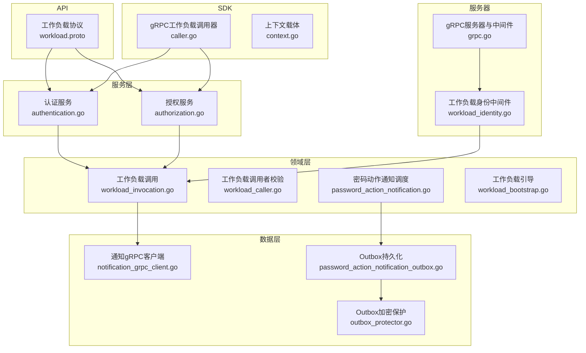
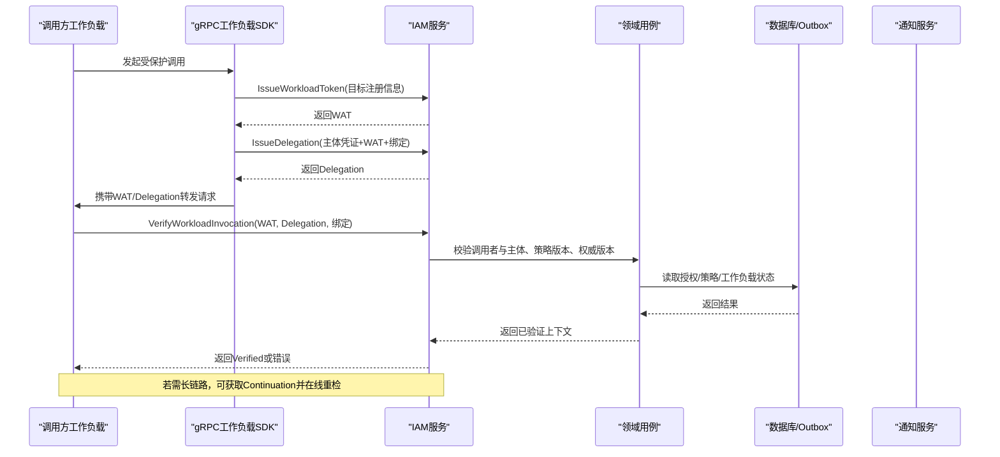
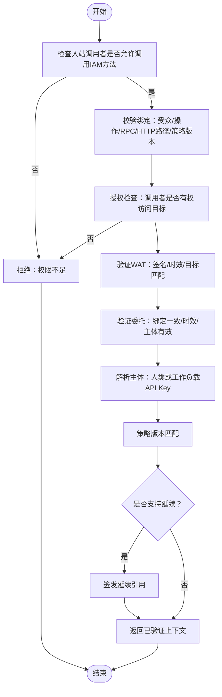
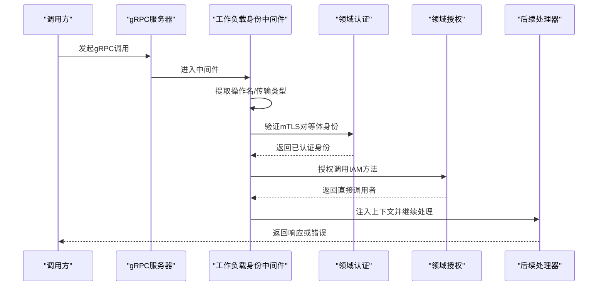
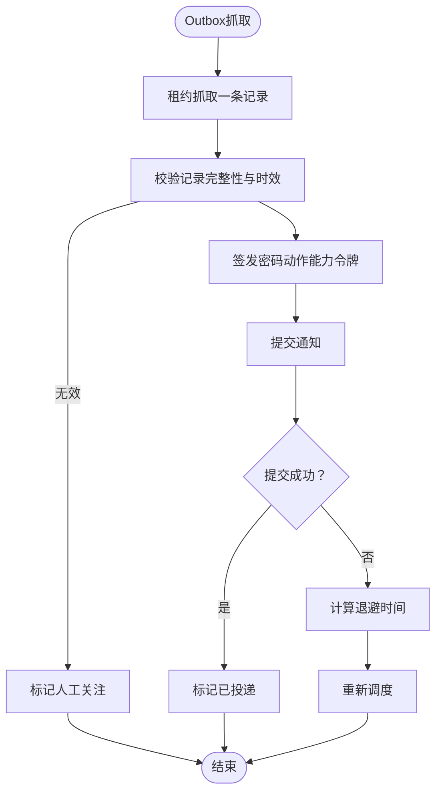
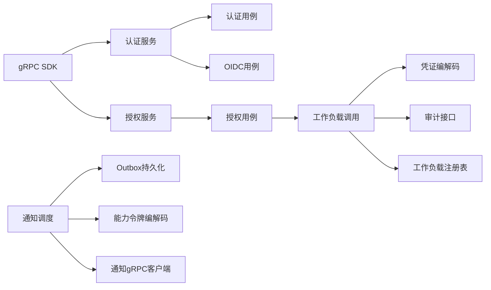

# 组件交互

<cite>
**本文引用的文件**
- [workload.proto](file://api/iam/v1/workload.proto)
- [grpc.go](file://internal/server/grpc.go)
- [workload_identity.go](file://internal/server/workload_identity.go)
- [caller.go](file://sdk/grpcworkload/caller.go)
- [context.go](file://sdk/grpcworkload/context.go)
- [workload_invocation.go](file://internal/biz/workload_invocation.go)
- [workload_caller.go](file://internal/biz/workload_caller.go)
- [notification_grpc_client.go](file://internal/data/notification_grpc_client.go)
- [password_action_notification.go](file://internal/biz/password_action_notification.go)
- [password_action_notification_outbox.go](file://internal/data/password_action_notification_outbox.go)
- [outbox_protector.go](file://internal/data/outbox_protector.go)
- [authentication.go](file://internal/service/authentication.go)
- [authorization.go](file://internal/service/authorization.go)
- [workload_bootstrap.go](file://internal/biz/workload_bootstrap.go)
</cite>

## 目录
1. [简介](#简介)
2. [项目结构](#项目结构)
3. [核心组件](#核心组件)
4. [架构总览](#架构总览)
5. [详细组件分析](#详细组件分析)
6. [依赖关系分析](#依赖关系分析)
7. [性能考虑](#性能考虑)
8. [故障排查指南](#故障排查指南)
9. [结论](#结论)
10. [附录](#附录)

## 简介
本文件面向ANI IAM的组件交互，聚焦以下目标：
- 描述工作负载调用机制：身份传递、权限委托与调用链追踪。
- 说明同步调用与异步消息处理：gRPC在线验证与Outbox重试。
- 阐述通知系统：事件发布订阅模式、消息队列集成与故障重试。
- 解释中间件链：请求拦截、响应转换与异常处理。
- 提供时序图与数据流向图，帮助理解端到端流程。
- 说明分布式事务与最终一致性保障策略。

## 项目结构
ANI IAM采用分层与职责分离设计：
- API层：定义gRPC契约（认证、授权、管理、工作负载）。
- 服务层：将API请求映射到领域用例，统一错误映射与审计上下文。
- 领域层：实现工作负载调用、授权、身份、会话、租户与工作负载生命周期等核心逻辑。
- 数据层：数据库访问、缓存、Outbox保护、外部gRPC客户端（如通知服务）。
- SDK层：为业务工作负载提供带鉴权的gRPC调用封装（自动签发WAT与Delegation）。
- 服务器层：gRPC服务器启动、mTLS配置、中间件链装配。

**图表来源**
- [workload.proto:1-121](file://api/iam/v1/workload.proto#L1-L121)
- [grpc.go:14-51](file://internal/server/grpc.go#L14-L51)
- [workload_identity.go:22-49](file://internal/server/workload_identity.go#L22-L49)
- [caller.go:25-109](file://sdk/grpcworkload/caller.go#L25-L109)
- [workload_invocation.go:131-144](file://internal/biz/workload_invocation.go#L131-L144)
- [password_action_notification.go:70-153](file://internal/biz/password_action_notification.go#L70-L153)
- [password_action_notification_outbox.go:25-82](file://internal/data/password_action_notification_outbox.go#L25-L82)
- [outbox_protector.go:23-98](file://internal/data/outbox_protector.go#L23-L98)

**章节来源**
- [grpc.go:14-51](file://internal/server/grpc.go#L14-L51)
- [workload_identity.go:22-49](file://internal/server/workload_identity.go#L22-L49)
- [caller.go:25-109](file://sdk/grpcworkload/caller.go#L25-L109)
- [workload_invocation.go:131-144](file://internal/biz/workload_invocation.go#L131-L144)

## 核心组件
- 工作负载调用与凭证：
  - 工作负载令牌（WAT）与委托（Delegation）用于跨服务短时效调用，绑定具体操作与资源。
  - 会话延续（Continuation）用于接收方在线重检已准入请求，避免重复授权。
- 工作负载调用者校验：
  - 基于注册表、当前权威版本与mTLS对等体信息进行严格匹配。
- 通知系统与Outbox：
  - 通过Outbox持久化待发送通知，按租约抓取、指数退避重试，失败进入人工关注。
  - Outbox使用AEAD加密敏感字段，支持密钥轮换。
- 中间件链：
  - gRPC服务器启用mTLS与中间件；工作负载身份中间件完成证书校验、身份认证与入站授权。
- 服务层：
  - 认证与授权服务负责参数校验、领域调用、错误映射与审计上下文注入。

**章节来源**
- [workload_invocation.go:146-292](file://internal/biz/workload_invocation.go#L146-L292)
- [workload_caller.go:44-113](file://internal/biz/workload_caller.go#L44-L113)
- [password_action_notification.go:96-180](file://internal/biz/password_action_notification.go#L96-L180)
- [password_action_notification_outbox.go:25-158](file://internal/data/password_action_notification_outbox.go#L25-L158)
- [outbox_protector.go:23-98](file://internal/data/outbox_protector.go#L23-L98)
- [workload_identity.go:22-49](file://internal/server/workload_identity.go#L22-L49)
- [authentication.go:108-138](file://internal/service/authentication.go#L108-L138)
- [authorization.go:27-67](file://internal/service/authorization.go#L27-L67)

## 架构总览
ANI IAM以“在线验证+短时效凭证”为核心，结合Outbox实现可靠异步通知。工作负载间通信通过SDK自动附加WAT与Delegation，IAM在服务端进行强绑定校验与授权决策。

**图表来源**
- [caller.go:47-109](file://sdk/grpcworkload/caller.go#L47-L109)
- [workload_invocation.go:175-292](file://internal/biz/workload_invocation.go#L175-L292)
- [workload_caller.go:60-113](file://internal/biz/workload_caller.go#L60-L113)

## 详细组件分析

### 工作负载调用与委托机制
- 工作负载令牌（WAT）：
  - 由IAM签发，绑定调用者目标与短期有效期，用于跨服务证明当前权威。
- 委托（Delegation）：
  - 针对具体业务请求，结合原始主体凭证与WAT，生成短时效委托，限制于该次调用。
- 会话延续（Continuation）：
  - 对于需要多步处理的请求，IAM返回不可续期的延续引用，接收方可在线重检。
- 调用者校验：
  - 服务端校验mTLS对等体、注册表、策略版本、权威版本与绑定一致性。

**图表来源**
- [workload_invocation.go:146-292](file://internal/biz/workload_invocation.go#L146-L292)
- [workload_caller.go:60-113](file://internal/biz/workload_caller.go#L60-L113)

**章节来源**
- [workload_invocation.go:146-292](file://internal/biz/workload_invocation.go#L146-L292)
- [workload_caller.go:44-113](file://internal/biz/workload_caller.go#L44-L113)
- [workload.proto:10-121](file://api/iam/v1/workload.proto#L10-L121)

### 工作负载身份中间件链
- mTLS强制：要求TLS1.3、双向证书校验与最小证书集。
- 工作负载身份中间件：
  - 从gRPC上下文中提取操作名与传输类型。
  - 校验对等体证书DNS身份、用途与有效期。
  - 调用领域认证与授权，将直接调用者注入上下文。
- 错误映射：
  - 将领域错误转换为gRPC状态码与详细信息，便于网关与观测。

**图表来源**
- [grpc.go:14-51](file://internal/server/grpc.go#L14-L51)
- [workload_identity.go:22-49](file://internal/server/workload_identity.go#L22-L49)
- [workload_identity.go:93-145](file://internal/server/workload_identity.go#L93-L145)

**章节来源**
- [grpc.go:14-51](file://internal/server/grpc.go#L14-L51)
- [workload_identity.go:22-49](file://internal/server/workload_identity.go#L22-L49)
- [workload_identity.go:93-145](file://internal/server/workload_identity.go#L93-L145)

### 通知系统与Outbox重试
- Outbox模型：
  - 持久化待发送通知元数据，包含受众、操作、主体、目的邮箱、意图、时效与尝试次数。
  - 使用AEAD加密目的地敏感字段，支持密钥版本与轮换。
- 调度器：
  - 按租约抓取条目，生成能力令牌，提交给通知适配器。
  - 成功则标记已投递；失败按指数退避重新调度；超过最大尝试或过期进入人工关注。
- 通知客户端：
  - 使用mTLS连接通知服务，禁用重试，确保幂等与可观测。

**图表来源**
- [password_action_notification.go:96-180](file://internal/biz/password_action_notification.go#L96-L180)
- [password_action_notification_outbox.go:25-158](file://internal/data/password_action_notification_outbox.go#L25-L158)
- [outbox_protector.go:73-98](file://internal/data/outbox_protector.go#L73-L98)
- [notification_grpc_client.go:46-103](file://internal/data/notification_grpc_client.go#L46-L103)

**章节来源**
- [password_action_notification.go:96-180](file://internal/biz/password_action_notification.go#L96-L180)
- [password_action_notification_outbox.go:25-158](file://internal/data/password_action_notification_outbox.go#L25-L158)
- [outbox_protector.go:23-98](file://internal/data/outbox_protector.go#L23-L98)
- [notification_grpc_client.go:46-103](file://internal/data/notification_grpc_client.go#L46-L103)

### 服务层错误映射与审计上下文
- 认证与授权服务：
  - 参数校验、边界与受众解析、依赖可用性检查。
  - 将领域错误映射为gRPC状态码与详细信息，包含操作ID、凭据类型、依赖、策略版本等。
  - 注入审计上下文（请求ID、关联ID），便于追踪。
- 典型错误：
  - 凭据无效、速率限制、幂等冲突、策略不匹配、依赖不可用等。

**章节来源**
- [authentication.go:108-138](file://internal/service/authentication.go#L108-L138)
- [authorization.go:27-67](file://internal/service/authorization.go#L27-L67)
- [authentication.go:476-683](file://internal/service/authentication.go#L476-L683)

### 工作负载引导与注册
- 引导清单：
  - 包含环境、信任域、CA指纹、有效期与工作负载列表。
  - 每个工作负载包含主体ID、名称、绑定ID、DNS身份与授予目标。
- 验证与注册：
  - 校验清单格式、唯一性、DNS命名规范、授予目标是否在注册表中。
  - 生成意图摘要并交由仓库执行供应，返回收据。

**章节来源**
- [workload_bootstrap.go:25-74](file://internal/biz/workload_bootstrap.go#L25-L74)
- [workload_bootstrap.go:93-173](file://internal/biz/workload_bootstrap.go#L93-L173)

## 依赖关系分析
- 服务层依赖领域用例：
  - 认证服务依赖认证与OIDC用例；授权服务依赖授权用例。
- 领域层依赖数据与注册表：
  - 工作负载调用依赖身份、授权、凭证编解码、审计、ID生成与时钟。
  - 通知调度依赖Outbox、令牌编解码与通知提交适配器。
- SDK与服务端协作：
  - SDK在调用前自动签发WAT与Delegation，并在元数据中携带；服务端中间件与领域层进行强校验。

**图表来源**
- [authentication.go:91-106](file://internal/service/authentication.go#L91-L106)
- [authorization.go:17-25](file://internal/service/authorization.go#L17-L25)
- [workload_invocation.go:131-144](file://internal/biz/workload_invocation.go#L131-L144)
- [password_action_notification.go:70-94](file://internal/biz/password_action_notification.go#L70-L94)
- [notification_grpc_client.go:46-103](file://internal/data/notification_grpc_client.go#L46-L103)
- [caller.go:25-109](file://sdk/grpcworkload/caller.go#L25-L109)

**章节来源**
- [authentication.go:91-106](file://internal/service/authentication.go#L91-L106)
- [authorization.go:17-25](file://internal/service/authorization.go#L17-L25)
- [workload_invocation.go:131-144](file://internal/biz/workload_invocation.go#L131-L144)
- [password_action_notification.go:70-94](file://internal/biz/password_action_notification.go#L70-L94)
- [notification_grpc_client.go:46-103](file://internal/data/notification_grpc_client.go#L46-L103)
- [caller.go:25-109](file://sdk/grpcworkload/caller.go#L25-L109)

## 性能考虑
- 短时效凭证：
  - WAT与Delegation具有严格TTL，减少长期凭证泄露风险与存储压力。
- 在线重检：
  - 使用Continuation进行接收方在线重检，避免重复授权开销。
- 禁用重试：
  - gRPC客户端与通知客户端禁用重试，保证幂等与可观测，业务侧自行控制重试策略。
- 索引与查询：
  - Outbox抓取使用租约与时间窗口，降低锁竞争；SQL查询应利用索引优化。
- 策略版本与权威版本：
  - 通过版本匹配避免陈旧策略导致的误判，提升一致性。

[本节为通用指导，不直接分析具体文件]

## 故障排查指南
- 常见错误与定位：
  - 凭据无效：检查WAT/Delegation/Continuation的签名、时效与绑定一致性。
  - 权限不足：确认调用者是否具备目标操作的授权，策略版本是否匹配。
  - 依赖不可用：OIDC、数据库、Redis等依赖不可用时，服务返回Unavailable。
  - 速率限制：认证速率限制触发时，注意Retry-After与限流范围。
  - 幂等冲突：幂等键冲突或过期，检查上游重试与去重策略。
- 通知失败：
  - Outbox抓取失败或提交失败，查看退避与人工关注状态；检查证书与网络连通性。
- 中间件错误：
  - 工作负载身份中间件返回Unauthenticated/PermissionDenied时，核对mTLS证书与DNS身份。

**章节来源**
- [authentication.go:476-683](file://internal/service/authentication.go#L476-L683)
- [workload_identity.go:93-145](file://internal/server/workload_identity.go#L93-L145)
- [password_action_notification.go:155-180](file://internal/biz/password_action_notification.go#L155-L180)

## 结论
ANI IAM通过“在线验证+短时效凭证+Outbox”的组合，实现了高安全、可追踪且可靠的工作负载调用与通知体系。中间件链确保入口安全与一致的错误语义，服务层提供清晰的错误映射与审计上下文。建议在生产环境中严格管理策略版本与权威版本，配合幂等与重试策略，保障最终一致性。

[本节为总结，不直接分析具体文件]

## 附录
- 关键概念对照：
  - Workload Token（WAT）：工作负载令牌，短期调用凭证。
  - Delegation：委托，针对单次请求的授权凭证。
  - Continuation：会话延续，用于接收方在线重检。
  - Invocation Binding：调用绑定，包含受众、操作、RPC/HTTP路径、策略版本等。
- 推荐实践：
  - 始终使用SDK进行受保护调用，避免手动构造凭证。
  - 合理设置TTL与超时，避免长链路阻塞。
  - 监控Outbox积压与人工关注项，及时处理失败通知。
  - 定期轮换Outbox加密密钥，确保数据安全。

[本节为补充说明，不直接分析具体文件]