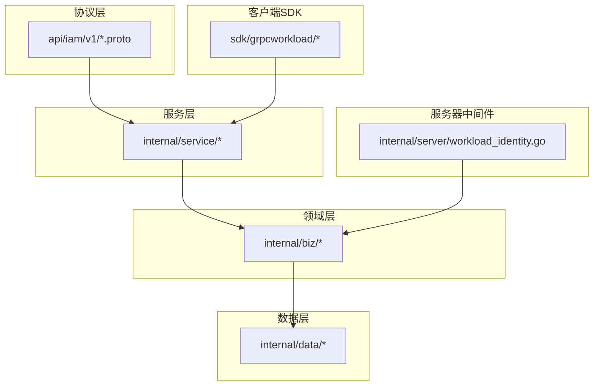
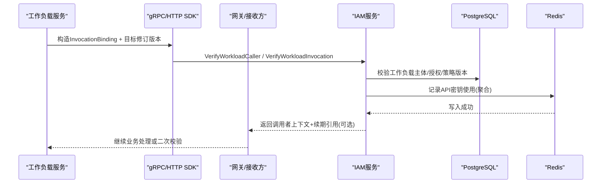
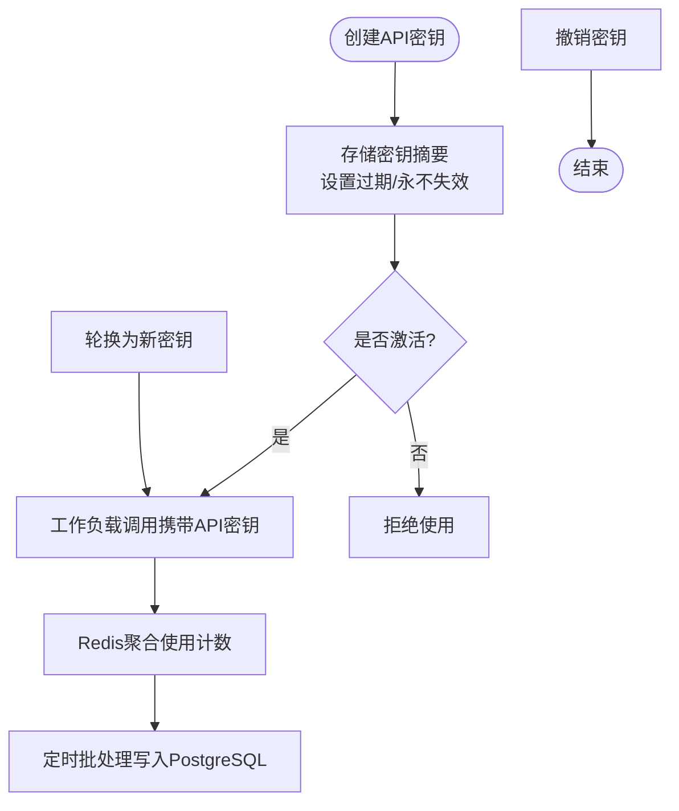
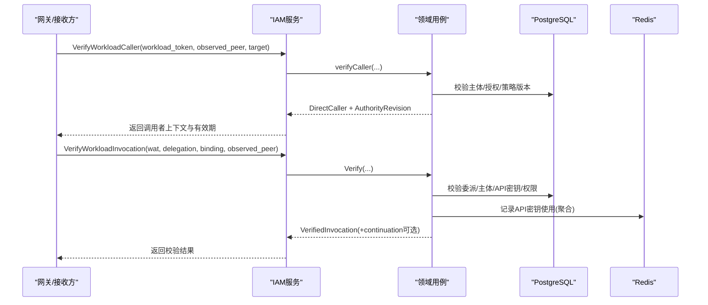
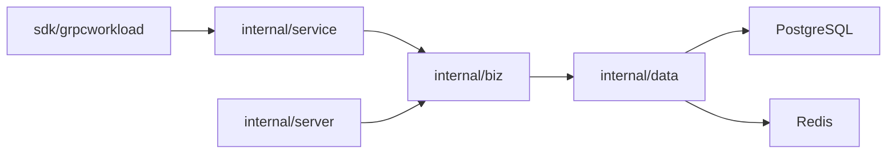

# API密钥认证

<cite>
**本文引用的文件**
- [authentication_service.proto](file://api/iam/v1/authentication_service.proto)
- [workload.proto](file://api/iam/v1/workload.proto)
- [authentication.go](file://internal/biz/authentication.go)
- [workload_caller.go](file://internal/biz/workload_caller.go)
- [workload.go](file://internal/biz/workload.go)
- [workload_invocation.go](file://internal/biz/workload_invocation.go)
- [api_key_usage_redis.go](file://internal/data/api_key_usage_redis.go)
- [api_key_creation_limiter_redis.go](file://internal/data/api_key_creation_limiter_redis.go)
- [workload.go](file://internal/data/workload.go)
- [202609080003_tenant_workload_api_key.sql](file://migrations/202609080003_tenant_workload_api_key.sql)
- [authentication.go](file://internal/service/authentication.go)
- [workload_identity.go](file://internal/server/workload_identity.go)
- [receiver.go](file://sdk/grpcworkload/receiver.go)
- [http.go](file://sdk/grpcworkload/http.go)
- [access_token_key_file.go](file://internal/data/access_token_key_file.go)
- [secret_generator.go](file://internal/data/secret_generator.go)
</cite>

## 目录
1. [简介](#简介)
2. [项目结构](#项目结构)
3. [核心组件](#核心组件)
4. [架构总览](#架构总览)
5. [详细组件分析](#详细组件分析)
6. [依赖关系分析](#依赖关系分析)
7. [性能考虑](#性能考虑)
8. [故障排查指南](#故障排查指南)
9. [结论](#结论)
10. [附录](#附录)

## 简介
本文件面向ANI IAM的API密钥认证体系，围绕工作负载（Workload）调用者的身份认证、API密钥生命周期管理、使用监控与限流、异常检测与滥用防护、以及跨服务场景下的正确用法与排错进行系统化说明。内容覆盖：
- API密钥的生成、存储、验证与使用观测
- 工作负载调用者身份认证流程（含令牌签发、委派、在线校验）
- 密钥轮换、权限范围与访问控制策略
- 频率限制、异常检测与滥用防护机制
- 最佳实践：密钥存储安全、传输加密、定期轮换策略
- 不同场景下的正确使用方式、错误处理与调试技巧

## 项目结构
本项目采用分层与领域驱动相结合的组织方式：
- api/iam/v1：对外gRPC契约定义，包含认证、授权与工作负载调用相关接口
- internal/biz：领域用例与业务规则（认证、授权、工作负载调用、会话等）
- internal/data：数据访问实现（PostgreSQL、Redis、JWX编解码、密钥材料加载等）
- internal/server：gRPC中间件与服务装配（TLS工作负载身份校验、鉴权中间件）
- internal/service：服务层适配（将proto请求映射到biz用例）
- sdk/grpcworkload：客户端SDK，封装工作负载令牌获取、委派、在线校验与HTTP/GPRC调用
- migrations：数据库迁移脚本，包含工作负载主体与API密钥表结构及约束

**图表来源**
- [authentication_service.proto:11-33](file://api/iam/v1/authentication_service.proto#L11-L33)
- [workload.proto:10-121](file://api/iam/v1/workload.proto#L10-L121)
- [workload_identity.go:22-49](file://internal/server/workload_identity.go#L22-L49)

**章节来源**
- [authentication_service.proto:11-33](file://api/iam/v1/authentication_service.proto#L11-L33)
- [workload.proto:10-121](file://api/iam/v1/workload.proto#L10-L121)

## 核心组件
- 认证与会话：密码登录、OIDC、会话刷新/注销、租户切换、主体校验
- 工作负载调用：工作负载令牌签发与校验、委派令牌、会话延续、调用者验证
- API密钥：创建限速、使用聚合上报、持久化审计、状态与过期约束
- 数据与密钥：Ed25519私钥加载、随机秘密生成、Redis聚合器、PostgreSQL持久化

关键职责边界：
- 服务层负责协议适配与错误映射
- 领域层负责业务规则、权限评估与令牌生命周期
- 数据层负责持久化、缓存聚合与加解密材料
- 中间件负责传输层身份校验（mTLS证书DNS白名单）

**章节来源**
- [authentication.go:317-339](file://internal/biz/authentication.go#L317-L339)
- [workload_invocation.go:131-144](file://internal/biz/workload_invocation.go#L131-L144)
- [api_key_usage_redis.go:49-61](file://internal/data/api_key_usage_redis.go#L49-L61)
- [access_token_key_file.go:12-30](file://internal/data/access_token_key_file.go#L12-L30)
- [secret_generator.go:15-25](file://internal/data/secret_generator.go#L15-L25)

## 架构总览
下图展示从工作负载发起调用到IAM在线校验的端到端流程，包括API密钥作为主体凭证时的鉴权路径。

**图表来源**
- [workload.proto:60-94](file://api/iam/v1/workload.proto#L60-L94)
- [workload_invocation.go:238-292](file://internal/biz/workload_invocation.go#L238-L292)
- [api_key_usage_redis.go:63-84](file://internal/data/api_key_usage_redis.go#L63-L84)

## 详细组件分析

### API密钥生命周期管理
- 创建与存储
  - 通过管理员或受控流程为工作负载主体创建API密钥；密钥摘要以固定长度哈希存储，禁止重复；支持永不失效或设置过期时间；状态仅限active/revoked，且撤销后不可恢复。
  - 数据库约束保证密钥与租户工作负载边界一致，且活跃密钥要求主体与成员关系均处于活跃状态。
- 激活与使用
  - 工作负载在委派令牌中将API密钥ID与版本作为主体信息的一部分；IAM在服务端对API密钥进行在线校验（状态、过期、版本、权限范围）。
- 撤销与轮换
  - 撤销后立即失效；轮换时创建新密钥并更新调用方配置，旧密钥可保留一段时间用于平滑过渡。
- 使用观测
  - 每次使用通过Redis有序集合按租户+密钥维度追加时间戳，后台批量刷入PostgreSQL形成审计轨迹。

**图表来源**
- [202609080003_tenant_workload_api_key.sql:149-232](file://migrations/202609080003_tenant_workload_api_key.sql#L149-L232)
- [api_key_usage_redis.go:63-123](file://internal/data/api_key_usage_redis.go#L63-L123)

**章节来源**
- [202609080003_tenant_workload_api_key.sql:149-232](file://migrations/202609080003_tenant_workload_api_key.sql#L149-L232)
- [api_key_usage_redis.go:63-123](file://internal/data/api_key_usage_redis.go#L63-L123)

### 工作负载调用者身份认证流程
- mTLS身份提取：服务端中间件校验TLS证书链，仅接受单一DNS名称且具备客户端认证用途的证书，提取环境、信任域与标识值。
- 主体解析与授权：根据证书标识解析工作负载主体，检查其针对IAM内部操作的授权（如签发工作负载令牌）。
- 令牌签发与委派：
  - IssueWorkloadToken：基于当前直接调用者上下文签发短期工作负载令牌（最多5分钟），绑定目标受众与操作。
  - IssueDelegation：结合原始凭据（人类会话令牌或工作负载API密钥）与绑定信息，签发短生命周期委派令牌（最多60秒），用于跨服务传递最小权限。
- 在线校验：
  - VerifyWorkloadCaller：接收方提供实际观察到的peer信息，IAM校验工作负载令牌、目标注册、策略版本与权限范围，返回调用者上下文与权威修订。
  - VerifyWorkloadInvocation：接收方提交工作负载令牌与委派令牌，IAM校验绑定一致性、主体有效性、API密钥状态与权限，必要时返回会话延续引用供后续步骤复用。

**图表来源**
- [workload_identity.go:22-49](file://internal/server/workload_identity.go#L22-L49)
- [workload_invocation.go:146-236](file://internal/biz/workload_invocation.go#L146-L236)
- [workload_invocation.go:238-292](file://internal/biz/workload_invocation.go#L238-L292)
- [api_key_usage_redis.go:63-84](file://internal/data/api_key_usage_redis.go#L63-L84)

**章节来源**
- [workload_identity.go:22-49](file://internal/server/workload_identity.go#L22-L49)
- [workload_invocation.go:146-236](file://internal/biz/workload_invocation.go#L146-L236)
- [workload_invocation.go:238-292](file://internal/biz/workload_invocation.go#L238-L292)

### 权限范围与访问控制
- 目标注册与机制：每个目标由受众与操作唯一标识，注册中声明机制（工作负载专用或委派）、RPC/HTTP方法、接收方操作、是否需要权威证明等。
- 权威修订：对于分组权威操作，IAM返回authority_revision，客户端需校验该修订与注册一致，防止越权。
- 策略版本：调用绑定中包含policy_revision，IAM校验策略版本匹配，避免陈旧策略导致的误判。
- 主体类型区分：人类主体使用会话令牌，工作负载主体使用API密钥；两者在委派与校验路径中有严格区分与约束。

**章节来源**
- [workload_caller.go:44-113](file://internal/biz/workload_caller.go#L44-L113)
- [workload_invocation.go:348-394](file://internal/biz/workload_invocation.go#L348-L394)
- [workload.go:87-106](file://internal/biz/workload.go#L87-L106)

### 使用频率限制、异常检测与滥用防护
- 创建限速：基于Redis原子脚本，按租户+主体维度限制单位窗口内的API密钥创建次数，超限返回重试间隔。
- 登录速率限制：密码登录路径同样具备速率限制与失败锁定机制，防止暴力破解。
- 使用观测与审计：API密钥每次使用被记录到Redis并按批次落库，便于异常检测（突增、异常时段、异常租户分布）。
- 错误分类与降级：服务层将领域错误映射为带原因的gRPC状态码，便于上游网关与客户端识别限流、未认证、权限不足、依赖不可用等。

**章节来源**
- [api_key_creation_limiter_redis.go:59-90](file://internal/data/api_key_creation_limiter_redis.go#L59-L90)
- [authentication.go:341-420](file://internal/biz/authentication.go#L341-L420)
- [authentication.go:517-533](file://internal/service/authentication.go#L517-L533)

### 密钥存储安全与传输加密
- 密钥存储：API密钥不存明文，仅存固定长度摘要；数据库约束确保唯一性与合法性；撤销后不可恢复。
- 传输加密：工作负载间通信强制mTLS，服务端中间件校验证书链与DNS标识，杜绝伪造身份。
- 签名材料：访问令牌使用Ed25519私钥签名，私钥从受保护的文件加载，限制格式与用途。

**章节来源**
- [202609080003_tenant_workload_api_key.sql:149-200](file://migrations/202609080003_tenant_workload_api_key.sql#L149-L200)
- [workload_identity.go:52-91](file://internal/server/workload_identity.go#L52-L91)
- [access_token_key_file.go:12-30](file://internal/data/access_token_key_file.go#L12-L30)

### 最佳实践指南
- 密钥存储安全
  - 仅在可信环境中持有API密钥；避免日志与错误消息泄露；使用密钥管理服务或受控注入。
- 传输加密
  - 所有工作负载间调用必须启用mTLS；客户端SDK自动附加工作负载凭据与委派令牌。
- 定期轮换策略
  - 建议设置合理过期时间；轮换时新旧并行，逐步淘汰旧密钥；监控使用量与错误率变化。
- 权限最小化
  - 精确声明目标受众与操作；对分组权威操作使用authority_revision校验；避免宽泛授权。
- 监控与告警
  - 关注API密钥使用峰值、失败率、限流触发；结合审计事件定位异常调用源。

[本节为通用指导，不直接分析具体文件]

### 不同场景下的正确使用与调试
- gRPC服务间调用
  - 使用SDK构造InvocationBinding，调用VerifyWorkloadCaller或VerifyWorkloadInvocation完成在线校验；注意observed_peer必须与实际TLS连接一致。
- HTTP服务间调用
  - SDK会清理敏感头，校验返回的authority_revision与方法/路径匹配；确保只使用工作负载专属凭据。
- 错误处理与调试
  - 关注gRPC状态码与原因（如AUTH_RATE_LIMITED、CREDENTIAL_INVALID、PERMISSION_DENIED、IAM_UNAVAILABLE）；利用operation_id与decision_id追踪决策链路。
  - 若出现“验证不匹配”，检查binding、target_revision、observed_peer与策略版本是否一致。

**章节来源**
- [receiver.go:57-71](file://sdk/grpcworkload/receiver.go#L57-L71)
- [http.go:118-144](file://sdk/grpcworkload/http.go#L118-L144)
- [authentication.go:476-683](file://internal/service/authentication.go#L476-L683)

## 依赖关系分析
- 服务层依赖领域用例，领域用例依赖数据访问与外部系统（PostgreSQL、Redis、OIDC等）
- 中间件依赖领域鉴权能力，确保进入服务层的调用已具备可信的直接调用者上下文
- SDK依赖IAM服务契约，封装复杂校验逻辑，降低调用方复杂度

**图表来源**
- [workload_identity.go:22-49](file://internal/server/workload_identity.go#L22-L49)
- [workload_invocation.go:131-144](file://internal/biz/workload_invocation.go#L131-L144)
- [api_key_usage_redis.go:49-61](file://internal/data/api_key_usage_redis.go#L49-L61)

**章节来源**
- [workload_identity.go:22-49](file://internal/server/workload_identity.go#L22-L49)
- [workload_invocation.go:131-144](file://internal/biz/workload_invocation.go#L131-L144)

## 性能考虑
- Redis聚合使用记录减少数据库写放大，批量flush提高吞吐
- 工作负载令牌与委派令牌TTL较短，降低长期凭证风险与存储压力
- 策略版本与目标修订校验在内存中进行，避免额外IO
- 限流使用原子脚本，避免竞争条件与重复计数

[本节为通用指导，不直接分析具体文件]

## 故障排查指南
- 常见错误与含义
  - AUTH_RATE_LIMITED：触发创建或登录限流，查看limit_scope与retry_after_seconds
  - CREDENTIAL_INVALID：凭据无效（工作负载令牌、委派令牌、API密钥或人类会话）
  - PERMISSION_DENIED：权限不足或目标未注册/策略不匹配
  - IAM_UNAVAILABLE：依赖不可用（OIDC、PostgreSQL、Redis等）
- 排查步骤
  - 核对observed_peer是否与TLS连接一致
  - 检查binding中的audience、operation、rpc_method/http_method/http_path是否完全匹配
  - 确认target_revision与authority_revision与注册一致
  - 查看API密钥状态、过期时间与版本是否匹配
  - 结合operation_id与decision_id在审计日志中定位决策点

**章节来源**
- [authentication.go:476-683](file://internal/service/authentication.go#L476-L683)
- [workload_invocation.go:238-292](file://internal/biz/workload_invocation.go#L238-L292)

## 结论
ANI IAM的API密钥认证体系以“最小权限、在线校验、短期凭证、强约束”为核心原则，通过mTLS、工作负载令牌与委派令牌的组合，实现了跨服务的安全认证与细粒度访问控制。配合Redis聚合的使用观测与PostgreSQL持久化审计，系统具备完善的滥用防护与可观测性。遵循本文的最佳实践与故障排查建议，可在生产环境中稳定、安全地运行工作负载间的API密钥认证。

[本节为总结性内容，不直接分析具体文件]

## 附录
- 术语
  - 工作负载（Workload）：非人类实体，通过证书与注册表获得身份与授权
  - 委派（Delegation）：将当前调用上下文与权限以短期令牌形式传递给下游
  - 会话延续（Continuation）：在一次校验通过后，为后续步骤提供的有限复用引用
- 参考契约
  - 认证服务接口：IssueWorkloadToken、ValidatePrincipal等
  - 工作负载调用接口：VerifyWorkloadCaller、VerifyWorkloadInvocation、VerifySessionContinuation

[本节为补充信息，不直接分析具体文件]