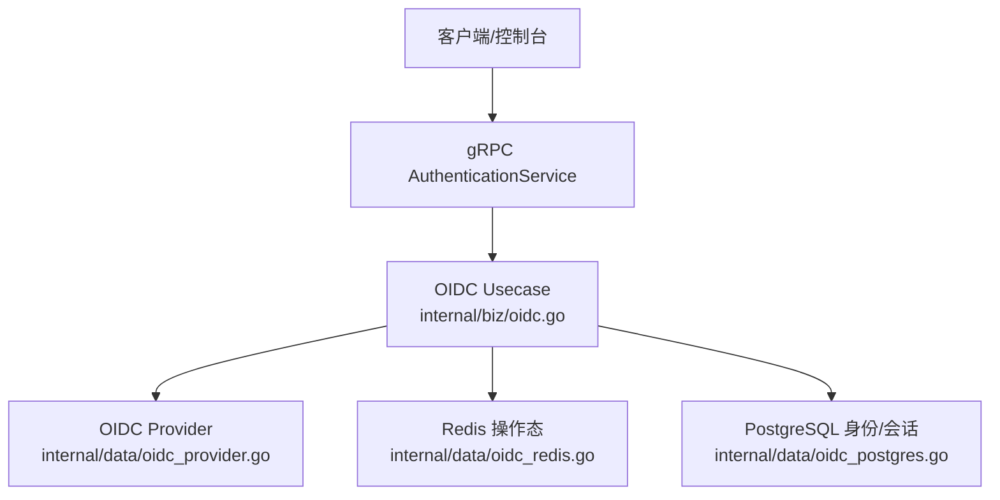
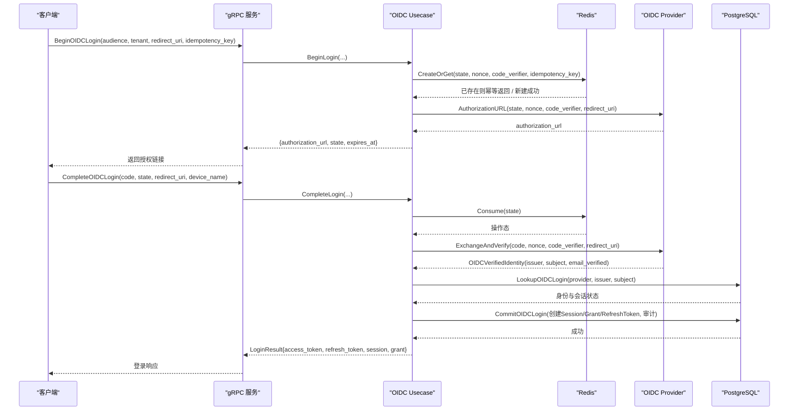
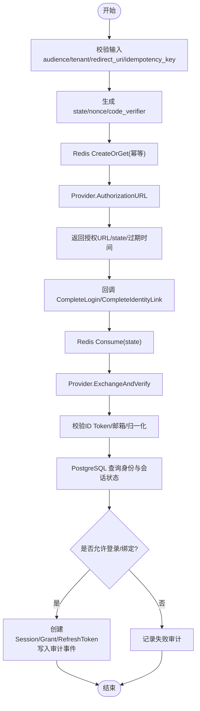
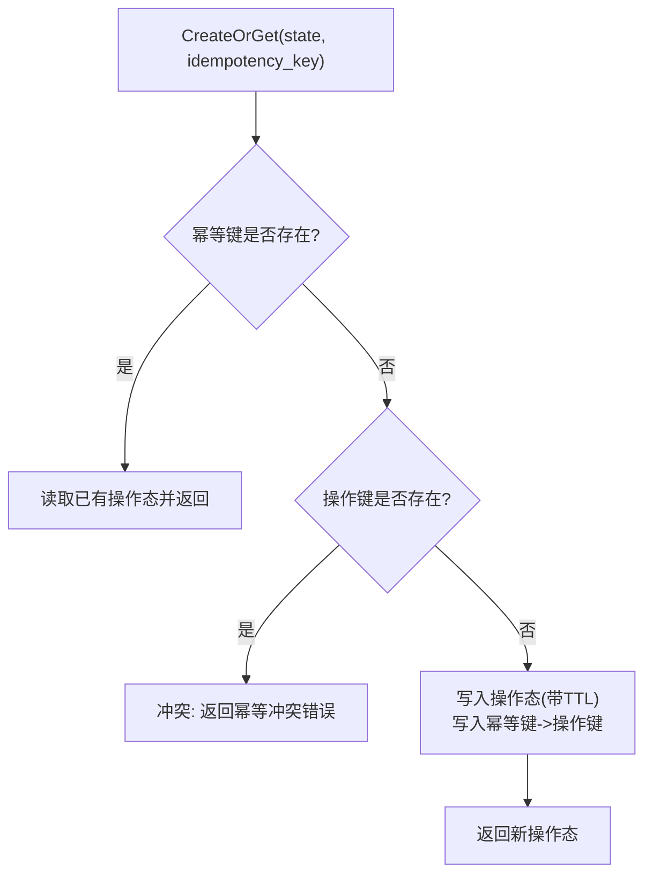
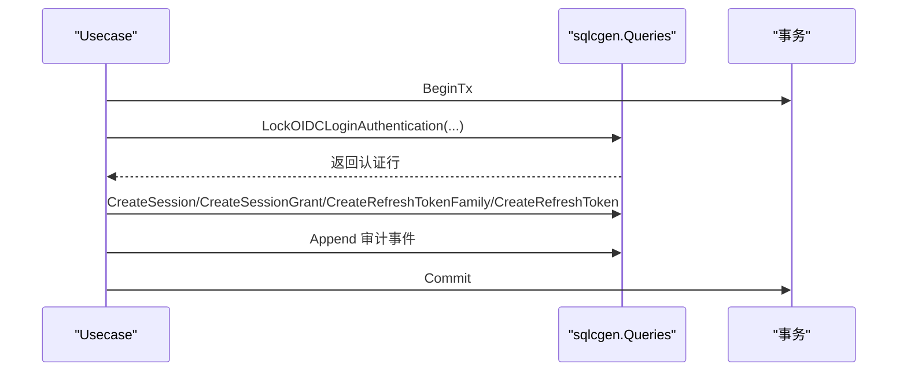
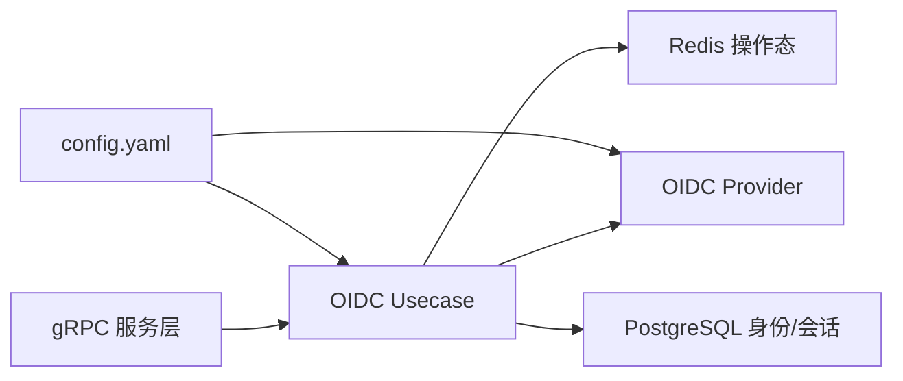

# OIDC认证

<cite>
**本文引用的文件**
- [internal/biz/oidc.go](file://internal/biz/oidc.go)
- [internal/data/oidc_provider.go](file://internal/data/oidc_provider.go)
- [internal/data/oidc_redis.go](file://internal/data/oidc_redis.go)
- [internal/data/oidc_postgres.go](file://internal/data/oidc_postgres.go)
- [configs/config.yaml](file://configs/config.yaml)
- [internal/service/authentication.go](file://internal/service/authentication.go)
- [api/iam/v1/authentication_service.proto](file://api/iam/v1/authentication_service.proto)
- [migrations/202609070001_oidc_identity.sql](file://migrations/202609070001_oidc_identity.sql)
</cite>

## 目录
1. [简介](#简介)
2. [项目结构](#项目结构)
3. [核心组件](#核心组件)
4. [架构总览](#架构总览)
5. [详细组件分析](#详细组件分析)
6. [依赖关系分析](#依赖关系分析)
7. [性能与可靠性](#性能与可靠性)
8. [故障排查指南](#故障排查指南)
9. [结论](#结论)
10. [附录：配置与集成示例](#附录配置与集成示例)

## 简介
本文件系统性说明 ANI IAM 的 OIDC 认证实现，覆盖 OpenID Connect（OIDC）授权码流程、PKCE、JWT/ID Token 校验、状态持久化、错误恢复、以及多身份提供商（IdP）接入。系统通过 gRPC 暴露认证接口，业务层编排登录与身份绑定流程，数据层提供 Redis 操作态存储、PostgreSQL 身份与会话持久化，并通过可插拔的 OIDC Provider 适配 Dex、Auth0、Google 等第三方 IdP。

## 项目结构
- 协议与接口定义位于 api/iam/v1，定义了 BeginOIDCLogin、CompleteOIDCLogin、BeginOIDCIdentityLink、CompleteOIDCIdentityLink 等 RPC。
- 服务层 internal/service/authentication.go 将请求映射到领域用例。
- 领域用例 internal/biz/oidc.go 编排 OIDC 登录与身份绑定流程，负责状态生成、校验、审计与结果组装。
- 数据层 internal/data 提供：
  - oidc_provider.go：基于 coreos/go-oidc 的 OIDC Provider 实现（支持任意符合 OIDC 规范的 IdP）。
  - oidc_redis.go：使用 Redis 原子脚本持久化 OIDC 操作态（state/nonce/code_verifier/idempotency_key），保证幂等与一次性消费。
  - oidc_postgres.go：PostgreSQL 读取身份与会话信息、完成登录事务与审计落库。
- 配置在 configs/config.yaml 中声明 provider、issuer_url、client_id、secret_file、redirect_uri、recent_reauthentication、http_timeout 等。



图表来源
- [internal/service/authentication.go:256-316](file://internal/service/authentication.go#L256-L316)
- [internal/biz/oidc.go:547-742](file://internal/biz/oidc.go#L547-L742)
- [internal/data/oidc_provider.go:62-154](file://internal/data/oidc_provider.go#L62-L154)
- [internal/data/oidc_redis.go:25-146](file://internal/data/oidc_redis.go#L25-L146)
- [internal/data/oidc_postgres.go:27-145](file://internal/data/oidc_postgres.go#L27-L145)

章节来源
- [api/iam/v1/authentication_service.proto:12-33](file://api/iam/v1/authentication_service.proto#L12-L33)
- [configs/config.yaml:51-60](file://configs/config.yaml#L51-L60)

## 核心组件
- OIDC Usecase：封装登录与身份绑定的完整业务流程，包括参数校验、状态生成、Provider 调用、数据库事务与审计记录。
- OIDC Provider：抽象接口与 CoreOS 实现，负责构建授权 URL、交换授权码并验证 ID Token。
- 操作态存储（Redis）：以原子 Lua 脚本实现 CreateOrGet/Consume，确保 state 唯一、幂等与过期清理。
- 身份与会话存储（PostgreSQL）：查询 OIDC 身份、会话与租户生命周期；登录时创建 Session/Grant/RefreshToken 并写入审计事件。
- gRPC 服务层：对外暴露 OIDC 相关 RPC，统一错误映射与上下文注入。

章节来源
- [internal/biz/oidc.go:31-98](file://internal/biz/oidc.go#L31-L98)
- [internal/data/oidc_provider.go:44-95](file://internal/data/oidc_provider.go#L44-L95)
- [internal/data/oidc_redis.go:20-62](file://internal/data/oidc_redis.go#L20-L62)
- [internal/data/oidc_postgres.go:15-25](file://internal/data/oidc_postgres.go#L15-L25)
- [internal/service/authentication.go:91-106](file://internal/service/authentication.go#L91-L106)

## 架构总览
下图展示一次完整的 OIDC 登录流程：客户端先发起 BeginOIDCLogin，服务端返回授权 URL 与 state；用户经 IdP 授权后回调 CompleteOIDCLogin，服务端用 state 从 Redis 取出操作态，向 IdP 换取 ID Token 并校验，再查库确认身份有效且处于活跃状态，最后创建会话、颁发访问令牌与刷新令牌，并记录审计事件。



图表来源
- [internal/service/authentication.go:256-316](file://internal/service/authentication.go#L256-L316)
- [internal/biz/oidc.go:547-742](file://internal/biz/oidc.go#L547-L742)
- [internal/data/oidc_provider.go:101-154](file://internal/data/oidc_provider.go#L101-L154)
- [internal/data/oidc_redis.go:64-136](file://internal/data/oidc_redis.go#L64-L136)
- [internal/data/oidc_postgres.go:27-145](file://internal/data/oidc_postgres.go#L27-L145)

## 详细组件分析

### OIDC 领域用例（Usecase）
- 登录流程
  - BeginLogin：校验 audience、tenant、redirect_uri、idempotency_key；生成 state/nonce/code_verifier；持久化至 Redis；调用 Provider 生成授权 URL。
  - CompleteLogin：消费 Redis 中的 state；调用 Provider 交换并验证 ID Token；查库确认 identity 有效且处于活跃；创建 Session/Grant/RefreshToken；签发 Access Token；记录审计事件。
- 身份绑定流程
  - BeginIdentityLink：校验当前凭据与重认证窗口；生成 state/nonce/code_verifier；可选浏览器 proof digest；持久化操作态；返回授权 URL。
  - CompleteIdentityLink：校验 credential 或 browser_proof；消费 state；交换并验证 ID Token；检查邮箱验证与归一化；创建 OIDC Identity 并记录审计。
- 安全与一致性
  - 使用 PKCE（code_verifier/challenge）增强授权码安全性。
  - 使用 state/nonce/redirect_uri 绑定单次请求。
  - 使用 idempotency_key 防止重复发起。
  - 对失败路径记录审计事件，便于追踪。



图表来源
- [internal/biz/oidc.go:547-742](file://internal/biz/oidc.go#L547-L742)
- [internal/biz/oidc.go:268-451](file://internal/biz/oidc.go#L268-L451)

章节来源
- [internal/biz/oidc.go:31-98](file://internal/biz/oidc.go#L31-L98)
- [internal/biz/oidc.go:547-742](file://internal/biz/oidc.go#L547-L742)
- [internal/biz/oidc.go:268-451](file://internal/biz/oidc.go#L268-L451)

### OIDC Provider（CoreOS 实现）
- 初始化：加载 Issuer URL、Client ID、Secret、Redirect URIs；发现远端元数据；构造 oauth2.Config 与 ID Token Verifier。
- 授权 URL：根据请求拼装 state/nonce/PKCE challenge/redirect URI。
- 交换与验证：使用授权码换取 token，提取 id_token，校验 issuer/nonce，解析 claims（email/email_verified）。
- 错误分类：区分依赖不可用（网络/超时/5xx/限流）与业务拒绝（无效授权码/签名不匹配等），以便上层做重试或降级。

```mermaid
classDiagram
class OIDCProvider {
+Name() string
+AuthorizationURL(request) (string, error)
+ExchangeAndVerify(ctx, request) (OIDCVerifiedIdentity, error)
}
class coreOSOIDCProvider {
-name string
-issuerURL string
-httpClient *http.Client
-oauth oauth2.Config
-verifier *oidc.IDTokenVerifier
-redirectURIs map[string]struct{}
}
OIDCProvider <|.. coreOSOIDCProvider
```

图表来源
- [internal/biz/oidc.go:89-93](file://internal/biz/oidc.go#L89-L93)
- [internal/data/oidc_provider.go:44-95](file://internal/data/oidc_provider.go#L44-L95)
- [internal/data/oidc_provider.go:101-154](file://internal/data/oidc_provider.go#L101-L154)

章节来源
- [internal/data/oidc_provider.go:23-95](file://internal/data/oidc_provider.go#L23-L95)
- [internal/data/oidc_provider.go:101-154](file://internal/data/oidc_provider.go#L101-L154)
- [internal/data/oidc_provider.go:156-190](file://internal/data/oidc_provider.go#L156-L190)

### 操作态存储（Redis）
- 设计要点
  - 使用两个键：操作键（按 state 哈希）与幂等键（按 idempotency_key 哈希）。
  - CreateOrGet：若幂等键存在则直接返回已有操作态；否则原子写入操作态并设置过期时间，同时建立幂等键指向操作键。
  - Consume：原子读取并删除操作态及幂等键，保证一次性消费。
  - 严格校验操作态字段（kind/provider/audience/tenant/boundary/state/nonce/code_verifier/redirect_uri/idempotency_key/fingerprint/expiry）。
- 优势
  - 高吞吐、低延迟；天然支持分布式幂等与一次性 state。
  - 通过 Lua 脚本保证原子性，避免竞态。



图表来源
- [internal/data/oidc_redis.go:25-54](file://internal/data/oidc_redis.go#L25-L54)
- [internal/data/oidc_redis.go:64-109](file://internal/data/oidc_redis.go#L64-L109)
- [internal/data/oidc_redis.go:111-136](file://internal/data/oidc_redis.go#L111-L136)
- [internal/data/oidc_redis.go:148-169](file://internal/data/oidc_redis.go#L148-L169)

章节来源
- [internal/data/oidc_redis.go:20-62](file://internal/data/oidc_redis.go#L20-L62)
- [internal/data/oidc_redis.go:64-136](file://internal/data/oidc_redis.go#L64-L136)
- [internal/data/oidc_redis.go:148-169](file://internal/data/oidc_redis.go#L148-L169)

### 身份与会话存储（PostgreSQL）
- 查询
  - LookupOIDCLogin：按 provider/issuer/subject 查询 identity 及其关联 principal/membership/tenant 状态。
  - LookupOIDCReauthentication：校验最近重认证窗口，用于敏感操作（如身份绑定）的安全策略。
- 写入
  - CommitOIDCLogin：锁定认证记录，校验身份/成员/租户状态，创建 Session/Grant/RefreshToken 族，写入审计事件，提交事务。
  - LinkOIDCIdentity：在可串行化隔离级别下，校验重认证、邮箱冲突、identity 冲突，创建 OIDC Identity 并写入审计。
- 迁移
  - 扩展 identities.provider 约束为 password/dex；为 sessions 增加 reauthenticated_at/authn_methods 字段与约束。



图表来源
- [internal/data/oidc_postgres.go:27-145](file://internal/data/oidc_postgres.go#L27-L145)
- [internal/data/oidc_postgres.go:175-244](file://internal/data/oidc_postgres.go#L175-L244)
- [migrations/202609070001_oidc_identity.sql:4-30](file://migrations/202609070001_oidc_identity.sql#L4-L30)

章节来源
- [internal/data/oidc_postgres.go:27-145](file://internal/data/oidc_postgres.go#L27-L145)
- [internal/data/oidc_postgres.go:175-244](file://internal/data/oidc_postgres.go#L175-L244)
- [migrations/202609070001_oidc_identity.sql:4-30](file://migrations/202609070001_oidc_identity.sql#L4-L30)

### gRPC 服务层
- 暴露 BeginOIDCLogin/CompleteOIDCLogin/BeginOIDCIdentityLink/CompleteOIDCIdentityLink 等 RPC。
- 将请求参数转换为领域命令，调用 Usecase，并将领域错误映射为统一的 gRPC 状态码与详情（包含 operation_id、dependency、credential_kind 等）。
- 对依赖不可用（OIDC/认证/鉴权/持久化）进行 Unavailable 处理，便于网关重试或降级。

章节来源
- [internal/service/authentication.go:256-316](file://internal/service/authentication.go#L256-L316)
- [internal/service/authentication.go:39-89](file://internal/service/authentication.go#L39-L89)
- [internal/service/authentication.go:476-683](file://internal/service/authentication.go#L476-L683)
- [api/iam/v1/authentication_service.proto:12-33](file://api/iam/v1/authentication_service.proto#L12-L33)

## 依赖关系分析
- 服务层依赖领域用例；领域用例依赖 Provider、操作态存储、身份与会话存储、令牌编解码器、随机数/ID 生成器与时钟。
- Provider 依赖 HTTP 客户端与 OIDC 发现；操作态存储依赖 Redis；身份与会话存储依赖 PostgreSQL。
- 配置项集中在 config.yaml 的 runtime.oidc 段，控制 provider、issuer_url、client_id、secret_file、redirect_uri、recent_reauthentication、http_timeout。



图表来源
- [configs/config.yaml:51-60](file://configs/config.yaml#L51-L60)
- [internal/service/authentication.go:91-106](file://internal/service/authentication.go#L91-L106)
- [internal/biz/oidc.go:216-251](file://internal/biz/oidc.go#L216-L251)

章节来源
- [configs/config.yaml:51-60](file://configs/config.yaml#L51-L60)
- [internal/biz/oidc.go:216-251](file://internal/biz/oidc.go#L216-L251)

## 性能与可靠性
- 幂等与一次性
  - Redis 原子脚本保证 state 的唯一性与一次性消费，idempotency_key 防止重复发起。
- 容错与重试
  - Provider 层对网络/超时/5xx/限流进行分类，上层可按需重试；对签名/issuer/nonce 不匹配等错误直接拒绝。
- 事务与一致性
  - 登录与身份绑定使用 PostgreSQL 事务，必要时加锁（如 LockOIDCLoginAuthentication/LockOIDCLinkAuthentication）避免并发冲突。
- 缓存与过期
  - Redis 操作态设置短 TTL（默认 10 分钟），降低热点键压力与内存占用。
- 可扩展性
  - 通过 OIDCProvider 接口解耦具体 IdP，新增提供商只需实现 Name/AuthorizationURL/ExchangeAndVerify。

[本节为通用指导，无需特定文件引用]

## 故障排查指南
- 常见错误与定位
  - 授权码无效/过期：检查 Redis 中 state 是否已被消费或过期；核对 redirect_uri 是否与配置一致。
  - ID Token 校验失败：检查 issuer、nonce、client_id 与 IdP 配置是否匹配；关注 Provider 层的依赖错误分类。
  - 邮箱未验证：确保 IdP 返回 email_verified=true；检查邮箱归一化逻辑。
  - 身份冲突/邮箱冲突：检查 identities 表是否已存在相同 issuer/subject 或 verified email 归属其他 principal。
  - 需要重新认证：当执行敏感操作（如身份绑定）时，需满足 recent_reauthentication 窗口要求。
- 日志与审计
  - 登录成功/失败、身份绑定成功/失败均会记录审计事件，可通过审计表检索决策 ID 与原因。
- 依赖不可用
  - 当 OIDC/认证/鉴权/持久化依赖不可用时，服务层返回 Unavailable，建议网关侧退避重试或切换备用链路。

章节来源
- [internal/biz/oidc.go:19-29](file://internal/biz/oidc.go#L19-L29)
- [internal/data/oidc_provider.go:156-190](file://internal/data/oidc_provider.go#L156-L190)
- [internal/data/oidc_postgres.go:82-145](file://internal/data/oidc_postgres.go#L82-L145)
- [internal/service/authentication.go:476-683](file://internal/service/authentication.go#L476-L683)

## 结论
ANI IAM 的 OIDC 认证实现了标准授权码+PKCE 流程，结合 Redis 的高并发幂等操作态与 PostgreSQL 的事务一致性，提供了安全、可靠、可扩展的身份认证能力。通过 Provider 抽象，可快速接入 Dex、Auth0、Google 等第三方 IdP；通过严格的 state/nonce/redirect_uri 绑定与审计记录，保障端到端可追溯与合规。

[本节为总结，无需特定文件引用]

## 附录：配置与集成示例

### 配置文件（runtime.oidc）
- provider：标识提供商名称（例如 dex）。
- issuer_url：IdP 的发现地址（HTTPS）。
- client_id/client_secret_file：客户端标识与密钥文件路径。
- login_redirect_uri/identity_link_redirect_uri：登录与身份绑定的回调地址（必须 HTTPS）。
- recent_reauthentication：敏感操作的重认证窗口（如 600s）。
- http_timeout：与 IdP 通信的超时时间。

章节来源
- [configs/config.yaml:51-60](file://configs/config.yaml#L51-L60)

### 接入 Dex（示例）
- 在 IdP 中注册客户端，设置回调地址与允许的 scope（openid/profile/email）。
- 在 IAM 配置中设置 provider=dex、issuer_url=https://dex.example.test/dex、client_id=ani-console、client_secret_file=/run/secrets/ani-iam-dex-client-secret、login_redirect_uri=https://console.example.test/auth/oidc/callback、identity_link_redirect_uri=https://console.example.test/auth/oidc/link/callback。
- 启动后，调用 BeginOIDCLogin 获取授权 URL，用户授权后回调 CompleteOIDCLogin 完成登录。

章节来源
- [configs/config.yaml:51-60](file://configs/config.yaml#L51-L60)
- [internal/data/oidc_provider.go:62-95](file://internal/data/oidc_provider.go#L62-L95)
- [internal/service/authentication.go:256-316](file://internal/service/authentication.go#L256-L316)

### 接入 Google/Auth0（示例）
- 在对应 IdP 控制台创建 OIDC 应用，记录 client_id、client_secret、issuer_url。
- 配置回调地址为 IAM 的 login_redirect_uri 与 identity_link_redirect_uri。
- 在 IAM 配置中替换 provider/issuer_url/client_id/client_secret_file/redirect_uri 等值。
- 其余流程与 Dex 一致。

章节来源
- [internal/data/oidc_provider.go:62-95](file://internal/data/oidc_provider.go#L62-L95)
- [configs/config.yaml:51-60](file://configs/config.yaml#L51-L60)

### 自定义提供商实现方法
- 实现 biz.OIDCProvider 接口：
  - Name：返回提供商名称。
  - AuthorizationURL：根据 state/nonce/code_verifier/redirect_uri 生成授权 URL。
  - ExchangeAndVerify：使用授权码换取 ID Token，校验 issuer/nonce，解析 email/email_verified 并返回。
- 在应用启动时注入该实现，并在配置中指定 provider 名称与之匹配。

章节来源
- [internal/biz/oidc.go:89-93](file://internal/biz/oidc.go#L89-L93)
- [internal/data/oidc_provider.go:44-95](file://internal/data/oidc_provider.go#L44-L95)