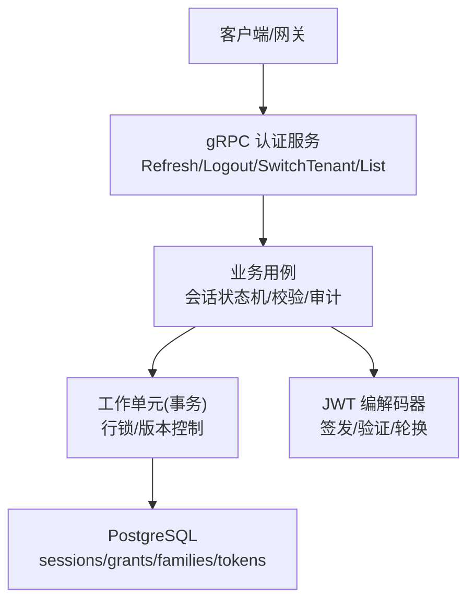
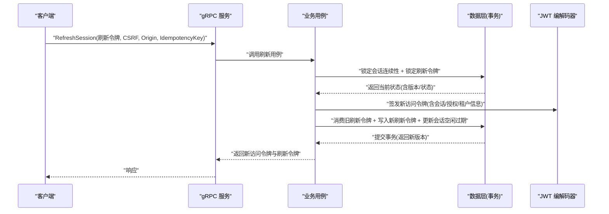
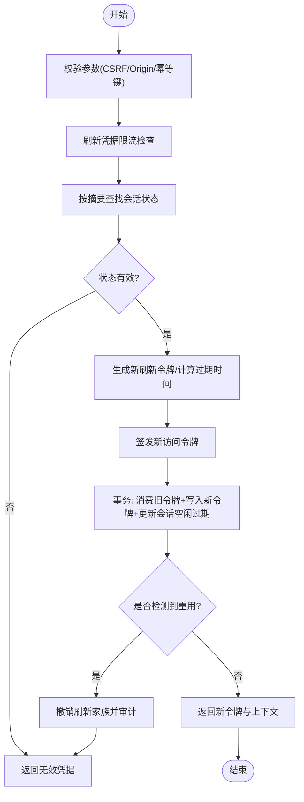
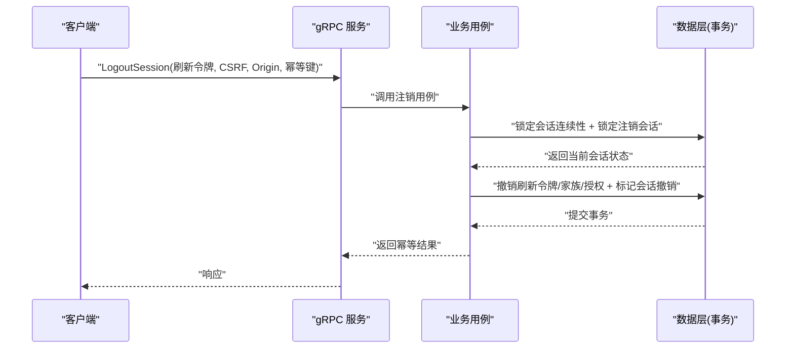
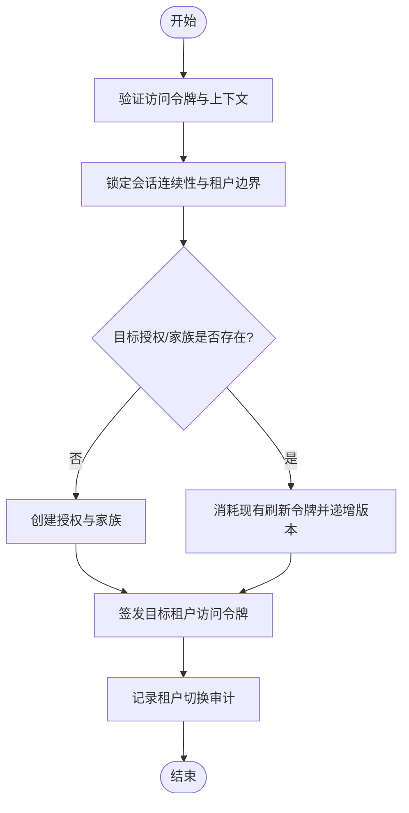
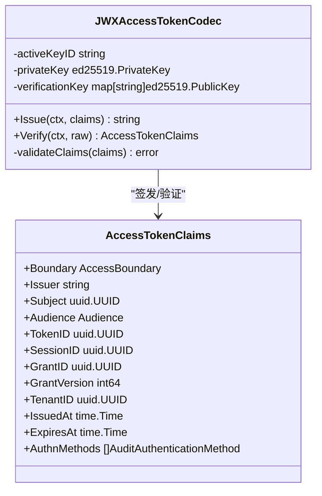
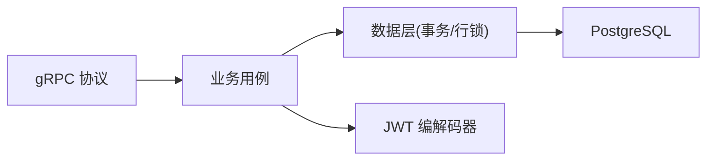

# 会话管理

<cite>
**本文引用的文件**
- [internal/biz/session.go](file://internal/biz/session.go)
- [internal/biz/authentication.go](file://internal/biz/authentication.go)
- [internal/data/session_postgres.go](file://internal/data/session_postgres.go)
- [internal/data/access_token_jwx.go](file://internal/data/access_token_jwx.go)
- [api/iam/v1/authentication_service.proto](file://api/iam/v1/authentication_service.proto)
- [migrations/202609070002_session_continuity.sql](file://migrations/202609070002_session_continuity.sql)
</cite>

## 目录
1. [简介](#简介)
2. [项目结构](#项目结构)
3. [核心组件](#核心组件)
4. [架构总览](#架构总览)
5. [详细组件分析](#详细组件分析)
6. [依赖关系分析](#依赖关系分析)
7. [性能与并发特性](#性能与并发特性)
8. [安全机制](#安全机制)
9. [故障排查指南](#故障排查指南)
10. [结论](#结论)
11. [附录：最佳实践与场景模式](#附录最佳实践与场景模式)

## 简介
本文件系统性阐述 ANI IAM 的会话管理机制，覆盖会话生命周期（创建、刷新、续期、撤销）、访问令牌与刷新令牌的签发与验证策略、分布式一致性保障、并发控制与安全防护（CSRF、XSS、会话劫持防护），并提供在不同应用场景（Web 应用、API 服务、微服务）中的使用建议。

## 项目结构
ANI IAM 将“业务用例”“数据持久化”“协议定义”分层组织：
- 协议层：gRPC 接口定义会话相关操作（登录、刷新、登出、切换租户、列举会话等）。
- 业务层：封装会话状态机、校验规则、审计事件与事务边界。
- 数据层：PostgreSQL 持久化、SQL 查询生成、行级锁与版本控制，确保并发一致性与可审计性。
- 令牌编解码：基于 EdDSA 的 JWT 访问令牌签发与验证，支持密钥轮换。

图表来源
- [api/iam/v1/authentication_service.proto:12-33](file://api/iam/v1/authentication_service.proto#L12-L33)
- [internal/biz/session.go:147-152](file://internal/biz/session.go#L147-L152)
- [internal/data/session_postgres.go:75-165](file://internal/data/session_postgres.go#L75-L165)
- [internal/data/access_token_jwx.go:83-134](file://internal/data/access_token_jwx.go#L83-L134)

章节来源
- [api/iam/v1/authentication_service.proto:12-33](file://api/iam/v1/authentication_service.proto#L12-L33)
- [internal/biz/session.go:147-152](file://internal/biz/session.go#L147-L152)
- [internal/data/session_postgres.go:75-165](file://internal/data/session_postgres.go#L75-L165)
- [internal/data/access_token_jwx.go:83-134](file://internal/data/access_token_jwx.go#L83-L134)

## 核心组件
- 会话与会话授权
  - Session：表示一次用户会话，包含受众、状态、空闲过期时间、绝对过期时间、认证方法等。
  - SessionGrant：会话在特定租户下的授权边界与版本。
  - RefreshTokenFamily：刷新令牌族，限制每个族仅有一个活跃刷新令牌。
  - RefreshToken：刷新令牌摘要、状态、有效期、被替换记录等。
- 业务用例
  - RefreshSession：刷新会话，轮转刷新令牌并签发新访问令牌。
  - LogoutSession：注销当前会话，撤销所有相关令牌与授权。
  - SwitchTenant：在同一会话内切换到目标租户，建立新的租户边界授权。
  - ListSessions：列举当前主体拥有的会话及授予情况。
- 数据持久化
  - PostgreSQL 通过行锁与乐观版本控制保证并发安全；唯一索引约束刷新令牌族的活跃令牌数。
- 令牌编解码
  - JWXAccessTokenCodec：EdDSA 签名的 JWT 访问令牌，支持多密钥验证与轮换。

章节来源
- [internal/biz/authentication.go:114-188](file://internal/biz/authentication.go#L114-L188)
- [internal/biz/session.go:147-152](file://internal/biz/session.go#L147-L152)
- [internal/data/session_postgres.go:75-165](file://internal/data/session_postgres.go#L75-L165)
- [internal/data/access_token_jwx.go:42-81](file://internal/data/access_token_jwx.go#L42-L81)

## 架构总览
会话管理的核心流程围绕“刷新-轮转-审计”和“注销-撤销-审计”展开，并通过数据库行锁与版本号保证跨实例的一致性。

图表来源
- [internal/biz/session.go:154-286](file://internal/biz/session.go#L154-L286)
- [internal/data/session_postgres.go:75-165](file://internal/data/session_postgres.go#L75-L165)
- [internal/data/access_token_jwx.go:83-134](file://internal/data/access_token_jwx.go#L83-L134)

## 详细组件分析

### 会话刷新（RefreshSession）
- 输入校验：要求刷新令牌、CSRF Token、Origin、幂等键。
- 限流与查找：对刷新凭据进行速率限制检查，按摘要查找会话状态。
- 有效性校验：校验刷新令牌状态、会话/授权/家族状态、租户生命周期、受众与认证方法。
- 令牌轮转：生成新刷新令牌摘要，计算新的空闲与访问过期时间，签发新访问令牌。
- 事务与并发：通过行锁与版本控制确保并发安全；若检测到重复使用，则撤销整个刷新家族并记录审计。
- 结果：返回新访问令牌、新刷新令牌、过期时间与上下文。

图表来源
- [internal/biz/session.go:154-286](file://internal/biz/session.go#L154-L286)
- [internal/data/session_postgres.go:75-165](file://internal/data/session_postgres.go#L75-L165)

章节来源
- [internal/biz/session.go:154-286](file://internal/biz/session.go#L154-L286)
- [internal/data/session_postgres.go:75-165](file://internal/data/session_postgres.go#L75-L165)

### 会话注销（LogoutSession）
- 输入校验：要求刷新令牌、CSRF Token、Origin、幂等键。
- 查找与幂等：根据刷新令牌摘要查找会话；若已注销或不存在，直接返回成功（不泄露存在性）。
- 撤销范围：撤销当前会话的所有刷新令牌、刷新家族、授权，并更新会话状态为撤销。
- 审计：记录注销审计事件，附加到主体会话审计中。

图表来源
- [internal/biz/session.go:288-348](file://internal/biz/session.go#L288-L348)
- [internal/data/session_postgres.go:268-350](file://internal/data/session_postgres.go#L268-L350)

章节来源
- [internal/biz/session.go:288-348](file://internal/biz/session.go#L288-L348)
- [internal/data/session_postgres.go:268-350](file://internal/data/session_postgres.go#L268-L350)

### 租户切换（SwitchTenant）
- 鉴权：验证当前访问令牌，确认主体、会话、授权与租户上下文。
- 边界锁定：锁定会话连续性与租户切换边界，确保跨租户操作的原子性。
- 授权与家族：为目标租户创建或升级授权与刷新家族，必要时消耗现有刷新令牌并递增版本。
- 令牌与审计：签发新的访问令牌（目标租户），记录租户切换审计事件。

图表来源
- [internal/biz/session.go:350-478](file://internal/biz/session.go#L350-L478)
- [internal/data/session_postgres.go:352-498](file://internal/data/session_postgres.go#L352-L498)

章节来源
- [internal/biz/session.go:350-478](file://internal/biz/session.go#L350-L478)
- [internal/data/session_postgres.go:352-498](file://internal/data/session_postgres.go#L352-L498)

### 访问令牌（JWT）签发与验证
- 签发：使用 EdDSA 私钥签发 JWT，包含主体、受众、会话ID、授权ID、授权版本、租户ID、认证方法等声明。
- 验证：解析并校验签名、算法、类型、必需声明、受众、颁发者、有效期与最大时长限制。
- 轮换：支持多公钥验证集，活动密钥变更时仍可对有效期内令牌进行验证。

图表来源
- [internal/data/access_token_jwx.go:42-81](file://internal/data/access_token_jwx.go#L42-L81)
- [internal/data/access_token_jwx.go:83-134](file://internal/data/access_token_jwx.go#L83-L134)
- [internal/data/access_token_jwx.go:169-225](file://internal/data/access_token_jwx.go#L169-L225)
- [internal/biz/authentication.go:175-188](file://internal/biz/authentication.go#L175-L188)

章节来源
- [internal/data/access_token_jwx.go:83-134](file://internal/data/access_token_jwx.go#L83-L134)
- [internal/data/access_token_jwx.go:169-225](file://internal/data/access_token_jwx.go#L169-L225)
- [internal/biz/authentication.go:175-188](file://internal/biz/authentication.go#L175-L188)

## 依赖关系分析
- 协议到业务：gRPC 接口暴露会话操作，业务用例实现具体逻辑。
- 业务到数据：业务用例通过工作单元接口调用数据层的行锁与版本控制。
- 数据到协议：数据层通过 SQL 查询与约束保证刷新令牌族唯一活跃令牌与会话一致性。
- 令牌到业务：业务用例依赖 JWT 编解码器签发与验证访问令牌。

图表来源
- [api/iam/v1/authentication_service.proto:12-33](file://api/iam/v1/authentication_service.proto#L12-L33)
- [internal/biz/session.go:147-152](file://internal/biz/session.go#L147-L152)
- [internal/data/session_postgres.go:75-165](file://internal/data/session_postgres.go#L75-L165)
- [internal/data/access_token_jwx.go:83-134](file://internal/data/access_token_jwx.go#L83-L134)

章节来源
- [api/iam/v1/authentication_service.proto:12-33](file://api/iam/v1/authentication_service.proto#L12-L33)
- [internal/biz/session.go:147-152](file://internal/biz/session.go#L147-L152)
- [internal/data/session_postgres.go:75-165](file://internal/data/session_postgres.go#L75-L165)
- [internal/data/access_token_jwx.go:83-134](file://internal/data/access_token_jwx.go#L83-L134)

## 性能与并发特性
- 刷新令牌族唯一活跃令牌：通过唯一索引与约束确保同一族仅一个活跃刷新令牌，避免并发冲突。
- 行级锁与事务隔离：刷新/注销/切换租户均使用行锁序列化关键路径，防止竞态条件。
- 乐观版本控制：会话、授权、家族均维护版本号，更新时校验期望版本，失败即冲突。
- 审计追加：所有关键操作追加审计事件，便于追踪与回溯。

章节来源
- [migrations/202609070002_session_continuity.sql:1-19](file://migrations/202609070002_session_continuity.sql#L1-L19)
- [internal/data/session_postgres.go:75-165](file://internal/data/session_postgres.go#L75-L165)
- [internal/data/session_postgres.go:268-350](file://internal/data/session_postgres.go#L268-L350)
- [internal/data/session_postgres.go:352-498](file://internal/data/session_postgres.go#L352-L498)

## 安全机制
- CSRF 防护：刷新与注销接口强制要求 CSRF Token，防止跨站请求伪造。
- XSS 防护：刷新令牌以内部秘密形式由网关以 HttpOnly Cookie 下发，避免脚本读取。
- 会话劫持防护：刷新令牌摘要存储于服务端，客户端仅持有不可逆摘要；令牌轮换与家族撤销降低重放风险。
- 访问令牌最小权限：JWT 包含受众、边界、会话与授权版本，限制作用域与时效。
- 速率限制：刷新凭据进行速率限制，防止暴力尝试。

章节来源
- [internal/biz/session.go:154-171](file://internal/biz/session.go#L154-L171)
- [internal/biz/session.go:288-305](file://internal/biz/session.go#L288-L305)
- [internal/data/access_token_jwx.go:332-378](file://internal/data/access_token_jwx.go#L332-L378)

## 故障排查指南
- 刷新失败（无效凭据）：检查刷新令牌摘要是否匹配、令牌状态是否为活跃、会话/授权/家族状态是否有效、租户生命周期是否阻塞。
- 并发冲突：关注版本冲突错误，可能由于并发刷新或切换导致；重试时需携带最新上下文。
- 注销幂等：多次注销应返回相同结果且不泄露存在性；如未生效，检查事务提交与审计追加。
- JWT 验证失败：核对算法、类型、必需声明、受众、颁发者与有效期；确认密钥轮换配置正确。

章节来源
- [internal/biz/session.go:522-555](file://internal/biz/session.go#L522-L555)
- [internal/data/session_postgres.go:540-576](file://internal/data/session_postgres.go#L540-L576)
- [internal/data/access_token_jwx.go:169-225](file://internal/data/access_token_jwx.go#L169-L225)

## 结论
ANI IAM 的会话管理通过严格的业务状态机、数据库行锁与版本控制、以及 JWT 令牌的最小权限模型，实现了高安全、高一致的会话生命周期管理。刷新令牌族与唯一活跃令牌约束、CSRF 防护与 HttpOnly Cookie 下发、以及完善的审计与速率限制，共同构成了抵御重放、劫持与滥用攻击的纵深防御体系。

## 附录：最佳实践与场景模式

### Web 应用
- 使用刷新令牌进行后台静默续期，配合 CSRF Token 与 Origin 校验。
- 刷新令牌通过网关以 HttpOnly Cookie 下发，避免前端脚本读取。
- 页面刷新前检查访问令牌有效期，必要时发起刷新请求。

### API 服务
- 使用访问令牌作为无状态鉴权凭证，服务端仅验证 JWT 签名与声明。
- 短生命周期访问令牌（最多 15 分钟，BOSS 更短）减少泄露影响面。
- 遇到 401/403 时引导客户端刷新或重新认证。

### 微服务架构
- 服务间调用使用工作负载令牌或委托令牌，遵循最小权限原则。
- 网关统一执行授权门控，服务内部不再重复鉴权。
- 跨租户调用需显式切换租户上下文，确保授权边界清晰。

章节来源
- [api/iam/v1/authentication_service.proto:150-186](file://api/iam/v1/authentication_service.proto#L150-L186)
- [internal/data/access_token_jwx.go:332-378](file://internal/data/access_token_jwx.go#L332-L378)