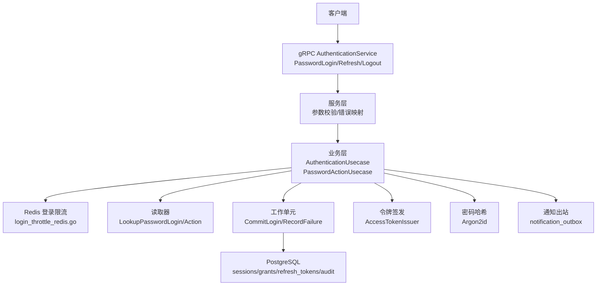
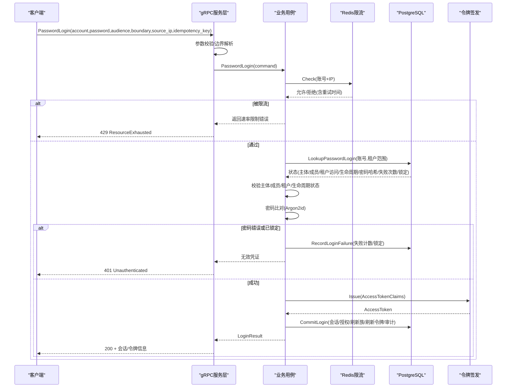
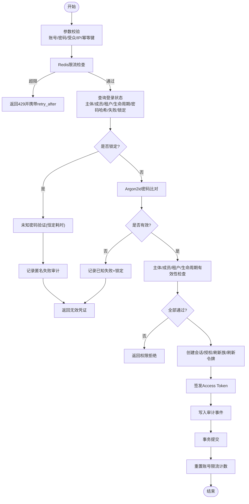
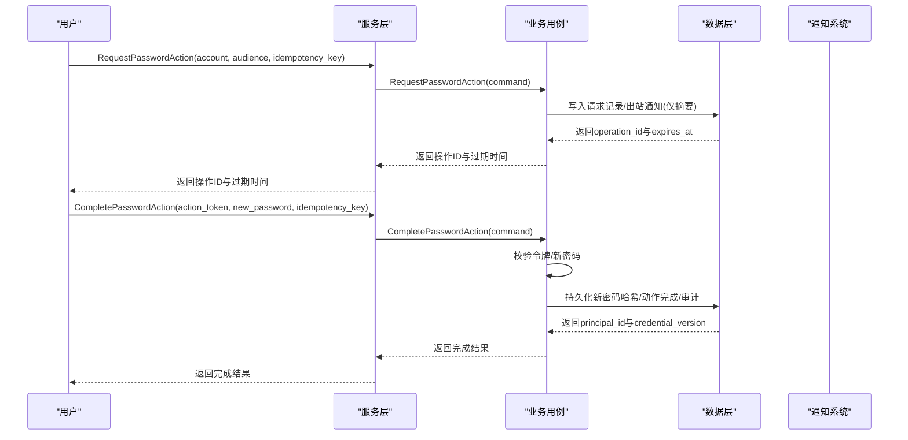
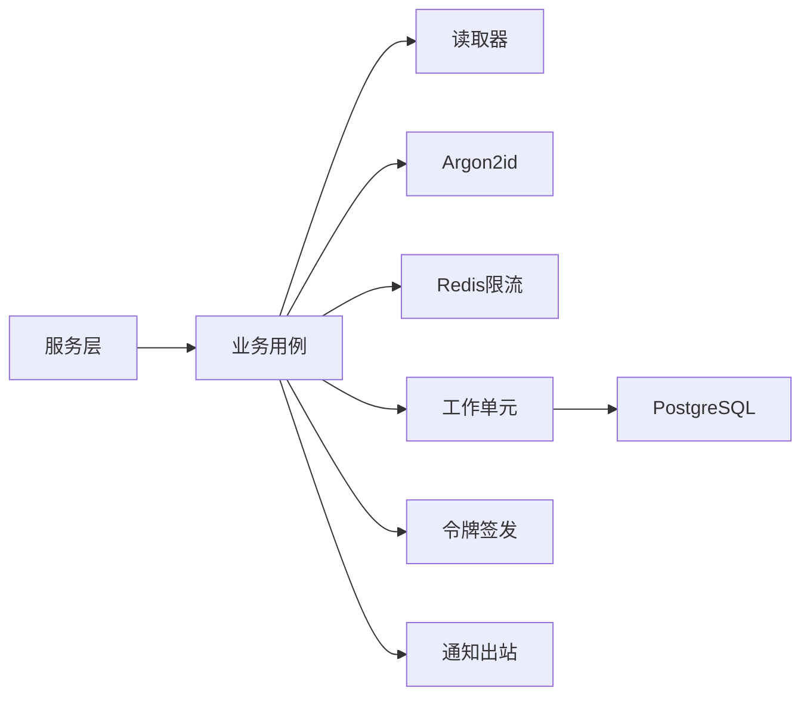

# 密码认证

<cite>
**本文引用的文件**
- [authentication_service.proto](file://api/iam/v1/authentication_service.proto)
- [authentication.go](file://internal/service/authentication.go)
- [authentication.go](file://internal/biz/authentication.go)
- [password_argon2id.go](file://internal/data/password_argon2id.go)
- [login_throttle_redis.go](file://internal/data/login_throttle_redis.go)
- [session_postgres.go](file://internal/data/session_postgres.go)
- [password_action.go](file://internal/biz/password_action.go)
- [202609060001_password_authentication.sql](file://migrations/202609060001_password_authentication.sql)
- [config.yaml](file://configs/config.yaml)
</cite>

## 目录
1. [简介](#简介)
2. [项目结构](#项目结构)
3. [核心组件](#核心组件)
4. [架构总览](#架构总览)
5. [详细组件分析](#详细组件分析)
6. [依赖关系分析](#依赖关系分析)
7. [性能考量](#性能考量)
8. [故障排查指南](#故障排查指南)
9. [结论](#结论)
10. [附录](#附录)

## 简介
本文件面向ANI IAM的“密码认证”子系统，系统性说明从用户登录到会话创建、从失败计数与账户锁定到密码重置流程的完整实现。重点覆盖：
- 登录验证流程（参数校验、频率限制、账户锁定）
- 密码哈希存储（Argon2id）
- PasswordLoginCommand处理逻辑（从参数到会话、令牌、审计）
- 安全审计日志与幂等性
- 密码重置流程（临时令牌生成、通知机制）
- 错误处理、性能优化与安全最佳实践

## 项目结构
密码认证涉及四层：
- API层：gRPC接口定义与请求/响应映射
- 服务层：参数校验、边界检查、错误映射
- 业务层：登录用例、密码动作、会话与权限状态判断
- 数据层：Redis限流、PostgreSQL持久化、Argon2id哈希、通知出站

**图表来源**
- [authentication_service.proto:11-33](file://api/iam/v1/authentication_service.proto#L11-L33)
- [authentication.go:150-194](file://internal/service/authentication.go#L150-L194)
- [authentication.go:341-530](file://internal/biz/authentication.go#L341-L530)
- [login_throttle_redis.go:122-180](file://internal/data/login_throttle_redis.go#L122-L180)
- [session_postgres.go:75-165](file://internal/data/session_postgres.go#L75-L165)
- [password_argon2id.go:30-60](file://internal/data/password_argon2id.go#L30-L60)
- [202609060001_password_authentication.sql:29-135](file://migrations/202609060001_password_authentication.sql#L29-L135)

**章节来源**
- [authentication_service.proto:11-33](file://api/iam/v1/authentication_service.proto#L11-L33)
- [authentication.go:150-194](file://internal/service/authentication.go#L150-L194)

## 核心组件
- gRPC接口：PasswordLogin、RequestPasswordAction、CompletePasswordAction、RefreshSession、LogoutSession
- 业务用例：AuthenticationUsecase.PasswordLogin、RequestPasswordAction、CompletePasswordAction
- 密码哈希：Argon2idPasswordHasher（固定参数，未知账号恒验）
- 登录限流：Redis脚本原子计数与阻塞窗口，支持按账号/IP双维度
- 持久化：PostgreSQL事务内完成会话、授权、刷新令牌族、审计事件写入
- 通知：密码动作出站表驱动异步邮件/消息发送

**章节来源**
- [authentication_service.proto:35-186](file://api/iam/v1/authentication_service.proto#L35-L186)
- [authentication.go:341-530](file://internal/biz/authentication.go#L341-L530)
- [password_argon2id.go:14-60](file://internal/data/password_argon2id.go#L14-L60)
- [login_throttle_redis.go:19-120](file://internal/data/login_throttle_redis.go#L19-L120)
- [202609060001_password_authentication.sql:29-135](file://migrations/202609060001_password_authentication.sql#L29-L135)

## 架构总览
下图展示一次成功的密码登录调用链：从gRPC入口到业务决策、限流、数据库提交与令牌签发。

**图表来源**
- [authentication.go:150-194](file://internal/service/authentication.go#L150-L194)
- [authentication.go:341-530](file://internal/biz/authentication.go#L341-L530)
- [login_throttle_redis.go:122-180](file://internal/data/login_throttle_redis.go#L122-L180)
- [session_postgres.go:75-165](file://internal/data/session_postgres.go#L75-L165)

## 详细组件分析

### 1) PasswordLoginCommand 处理逻辑（从参数到会话）
- 参数校验：账号、密码、受众、源IP、幂等键；BOSS受众需平台边界，Console受众需租户边界
- 限流检查：基于账号归一化与源IP的Redis计数，超限返回带RetryAfter的错误
- 状态查询：读取主体状态、成员状态、租户访问状态、生命周期新鲜度、密码哈希、失败次数与锁定截止时间
- 密码验证：使用Argon2id进行比对；对未知账号或锁定中的账号执行“未知密码验证”以恒定耗时
- 会话创建：生成会话、授权、刷新令牌族与刷新令牌，签发短期Access Token
- 审计记录：成功登录记录审计事件（包含目标类型、版本、原因、关联ID）
- 幂等与一致性：所有写操作在事务中完成；成功后重置账号维度的限流计数

**图表来源**
- [authentication.go:341-530](file://internal/biz/authentication.go#L341-L530)
- [login_throttle_redis.go:122-180](file://internal/data/login_throttle_redis.go#L122-L180)
- [session_postgres.go:75-165](file://internal/data/session_postgres.go#L75-L165)

**章节来源**
- [authentication.go:341-530](file://internal/biz/authentication.go#L341-L530)
- [authentication.go:150-194](file://internal/service/authentication.go#L150-L194)

### 2) 密码哈希存储（Argon2id）
- 采用固定参数的Argon2id配置，确保跨实例一致性与可迁移性
- 提供“未知账号密码验证”常量哈希，用于防止时序攻击与枚举
- 校验时严格匹配参数，不匹配则视为失败

**章节来源**
- [password_argon2id.go:14-60](file://internal/data/password_argon2id.go#L14-L60)

### 3) 登录频率限制与账户锁定
- 限流维度：账号与IP双键，Redis Lua脚本原子更新计数与阻塞时间
- 指数退避：失败次数越多，阻塞时间越长，上限为窗口时长
- 锁定策略：每次失败记录失败时间与锁定截止时间（例如15分钟），期间直接拒绝
- 成功登录后重置账号维度计数，避免误伤后续正常登录

**章节来源**
- [login_throttle_redis.go:34-120](file://internal/data/login_throttle_redis.go#L34-L120)
- [login_throttle_redis.go:149-180](file://internal/data/login_throttle_redis.go#L149-L180)
- [authentication.go:539-617](file://internal/biz/authentication.go#L539-L617)

### 4) 安全审计日志
- 成功登录：记录审计事件（目标类型为会话，原因为密码登录）
- 失败登录：记录匿名或已知目标的失败审计（目标类型为密码凭证）
- 审计字段包含：动作、目标、版本、结果、原因、请求/关联ID、决策ID、发生/记录时间

**章节来源**
- [authentication.go:485-514](file://internal/biz/authentication.go#L485-L514)
- [authentication.go:539-617](file://internal/biz/authentication.go#L539-L617)

### 5) 密码重置流程（临时令牌与通知）
- 请求阶段：根据账号与受众查找目标（若存在），生成一次性操作ID与过期时间，写入出站表（通知意图）
- 完成阶段：校验动作令牌（签名、主体、操作ID、目的、过期），对新密码进行哈希，持久化变更并标记动作完成
- 通知机制：出站表驱动异步通知（邮件/消息），包含操作链接与过期时间

**图表来源**
- [password_action.go:141-222](file://internal/biz/password_action.go#L141-L222)
- [password_action.go:224-299](file://internal/biz/password_action.go#L224-L299)
- [202609060001_password_authentication.sql:29-135](file://migrations/202609060001_password_authentication.sql#L29-L135)

**章节来源**
- [password_action.go:141-299](file://internal/biz/password_action.go#L141-L299)
- [202609060001_password_authentication.sql:29-135](file://migrations/202609060001_password_authentication.sql#L29-L135)

### 6) 会话与令牌生命周期
- 会话：包含主体、受众、设备名、空闲过期、绝对过期、重认证时间
- 授权：会话级授权（Grant）绑定成员与边界
- 刷新令牌族：家族化管理刷新令牌，支持轮换与复用保护
- Access Token：短期有效，携带主体、会话、授权版本、租户等信息

**章节来源**
- [authentication.go:114-188](file://internal/biz/authentication.go#L114-L188)
- [session_postgres.go:75-165](file://internal/data/session_postgres.go#L75-L165)

### 7) 错误处理与映射
- 业务错误：无效凭证、主体/成员/租户状态无效、生命周期陈旧或受限、依赖不可用、幂等冲突等
- 服务层映射：将业务错误映射为gRPC状态码与详细信息（如429速率限制、401无效凭证、403权限拒绝、503依赖不可用）
- 限流错误：携带limit_scope与retry_after_seconds，便于客户端退避

**章节来源**
- [authentication.go:476-683](file://internal/service/authentication.go#L476-L683)
- [authentication.go:31-42](file://internal/biz/authentication.go#L31-L42)

## 依赖关系分析
- 服务层依赖业务用例接口，屏蔽传输细节
- 业务用例依赖：
  - 读取器：查询登录状态、动作目标、会话连续性
  - 密码验证器：Argon2id哈希与未知账号验证
  - 限流器：Redis登录与刷新令牌限流
  - 工作单元：事务化提交登录、失败记录、会话续期、登出、租户切换
  - 令牌签发：签发Access Token
  - 通知：出站表驱动异步通知
- 数据层依赖：
  - Redis：Lua脚本原子限流与计数
  - PostgreSQL：会话、授权、刷新令牌、审计、动作与通知出站

**图表来源**
- [authentication.go:150-194](file://internal/service/authentication.go#L150-L194)
- [authentication.go:286-339](file://internal/biz/authentication.go#L286-L339)
- [login_throttle_redis.go:106-120](file://internal/data/login_throttle_redis.go#L106-L120)
- [session_postgres.go:75-165](file://internal/data/session_postgres.go#L75-L165)

**章节来源**
- [authentication.go:286-339](file://internal/biz/authentication.go#L286-L339)
- [login_throttle_redis.go:106-120](file://internal/data/login_throttle_redis.go#L106-L120)

## 性能考量
- Redis Lua脚本：原子化计数与阻塞时间计算，减少网络往返与竞争条件
- 未知账号验证：恒定耗时，降低侧信道风险
- 事务最小化：仅在必要时开启事务，且尽早失败快速返回
- 会话与刷新令牌族：集中管理，减少并发冲突
- 审计写入：追加式写入，避免热点更新

[本节为通用指导，无需特定文件引用]

## 故障排查指南
- 429 速率限制：检查Redis限流配置（窗口、基数、基础延迟）、账号/IP是否命中限制；关注retry_after_seconds
- 401 无效凭证：核对账号是否存在、密码是否正确、是否处于锁定；查看失败审计事件
- 403 权限拒绝：检查主体/成员/租户访问状态、生命周期是否活跃；确认受众与边界
- 503 依赖不可用：检查PostgreSQL/Redis/通知服务可用性；关注错误详情中的dependency字段
- 幂等冲突：检查idempotency_key是否重复；确认请求窗口是否过期

**章节来源**
- [authentication.go:476-683](file://internal/service/authentication.go#L476-L683)
- [login_throttle_redis.go:122-180](file://internal/data/login_throttle_redis.go#L122-L180)

## 结论
ANI IAM的密码认证系统通过严格的参数校验、Redis原子限流、Argon2id密码哈希、事务化会话与令牌管理、以及完善的审计与通知机制，提供了高安全、高可用、可扩展的登录能力。其设计强调：
- 安全性：恒定耗时验证、未知账号保护、细粒度审计
- 可靠性：事务一致性、幂等键、失败重试与退避
- 可观测性：丰富的审计事件与错误元数据
- 可维护性：分层清晰、接口抽象、配置化限流

[本节为总结，无需特定文件引用]

## 附录

### A. 关键配置项（示例）
- Redis登录限流：namespace、limit、window、base_delay
- 通知出站：地址、证书、URL基址、本地化、调度间隔
- 访问令牌：issuer、active_key_id、私钥文件路径

**章节来源**
- [config.yaml:22-61](file://configs/config.yaml#L22-L61)

### B. 数据库迁移要点
- 新增密码动作相关表：请求、动作、出站通知、完成记录
- 审计表约束扩展：支持更多认证方法与边界/角色约束
- 权限授予：运行时用户对新增表的读写权限

**章节来源**
- [202609060001_password_authentication.sql:5-135](file://migrations/202609060001_password_authentication.sql#L5-L135)

### C. 代码片段路径参考
- 登录入口与响应映射：[authentication.go:150-194](file://internal/service/authentication.go#L150-L194)
- 登录用例主流程：[authentication.go:341-530](file://internal/biz/authentication.go#L341-L530)
- Argon2id哈希实现：[password_argon2id.go:30-60](file://internal/data/password_argon2id.go#L30-L60)
- Redis限流脚本与实现：[login_throttle_redis.go:34-120](file://internal/data/login_throttle_redis.go#L34-L120)
- 会话续期与登出：[session_postgres.go:75-165](file://internal/data/session_postgres.go#L75-L165)
- 密码动作请求与完成：[password_action.go:141-299](file://internal/biz/password_action.go#L141-L299)