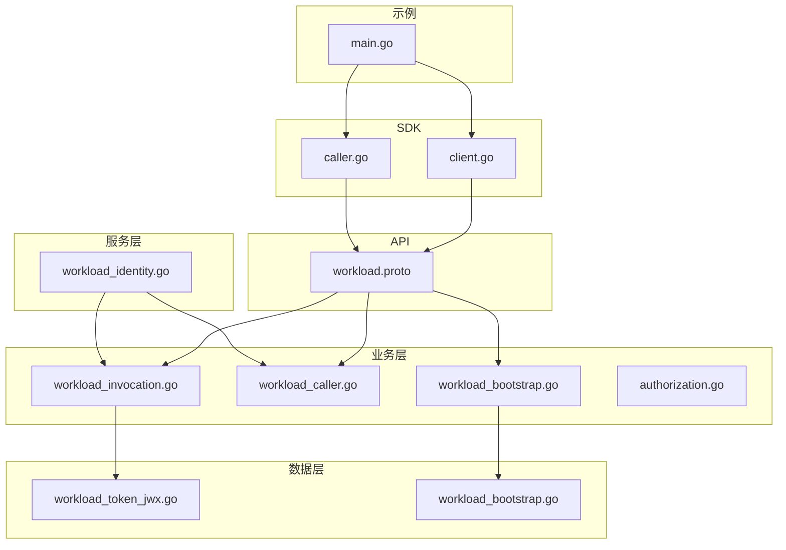
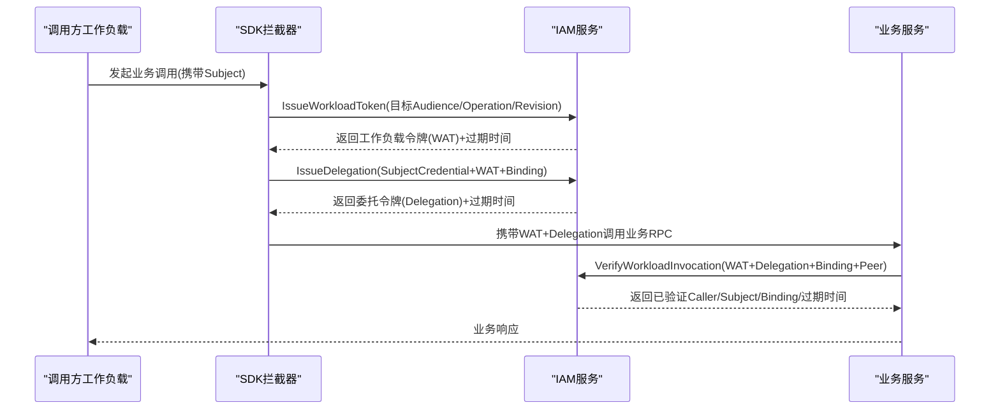
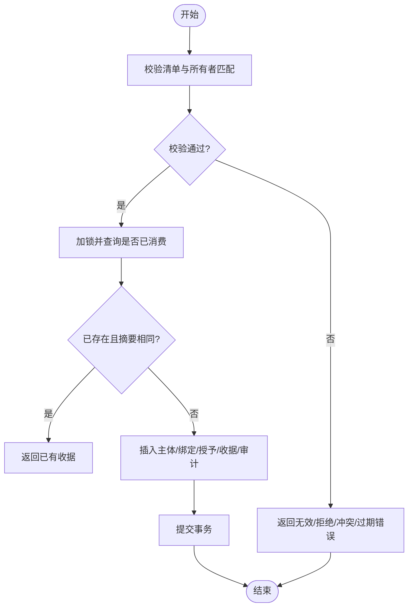
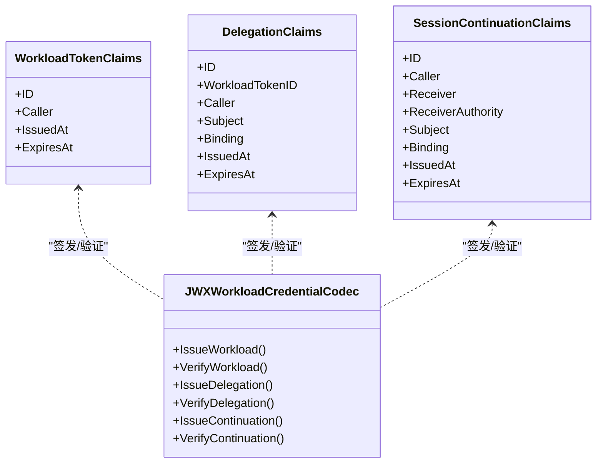
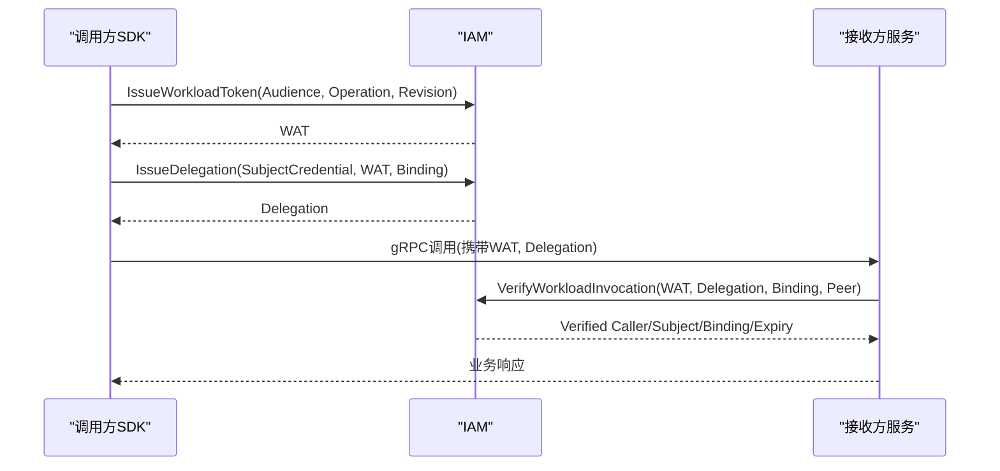
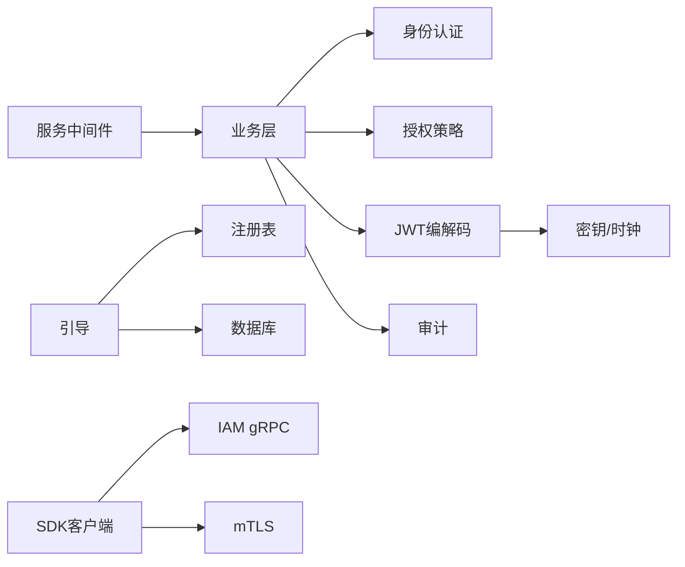

# 工作负载认证

<cite>
**本文引用的文件**
- [workload.proto](file://api/iam/v1/workload.proto)
- [workload_bootstrap.go](file://internal/biz/workload_bootstrap.go)
- [workload_caller.go](file://internal/biz/workload_caller.go)
- [workload_invocation.go](file://internal/biz/workload_invocation.go)
- [authorization.go](file://internal/biz/authorization.go)
- [workload_token_jwx.go](file://internal/data/workload_token_jwx.go)
- [workload_identity.go](file://internal/server/workload_identity.go)
- [client.go](file://sdk/grpcworkload/client.go)
- [caller.go](file://sdk/grpcworkload/caller.go)
- [main.go](file://examples/workload-grpc/main.go)
</cite>

## 目录
1. [简介](#简介)
2. [项目结构](#项目结构)
3. [核心组件](#核心组件)
4. [架构总览](#架构总览)
5. [详细组件分析](#详细组件分析)
6. [依赖关系分析](#依赖关系分析)
7. [性能与可用性](#性能与可用性)
8. [故障排查指南](#故障排查指南)
9. [结论](#结论)
10. [附录：SDK使用指南](#附录sdk使用指南)

## 简介
本文件面向ANI IAM的工作负载认证子系统，系统性阐述工作负载身份的启动引导、短期令牌（工作负载令牌、委托令牌、会话延续令牌）的生成、验证与轮换机制；工作负载间通信的基于JWT的身份与权限委托；调用链审计追踪（调用链跟踪、权限验证、合规报告）；以及工作负载生命周期管理、动态权限调整与故障恢复。文末提供Go SDK集成指南，涵盖客户端配置、错误处理与性能优化建议。

## 项目结构
- API契约定义在protobuf中，明确工作负载身份、绑定、委托与校验请求/响应结构。
- 业务层实现工作负载身份认证、授权、令牌签发与校验、调用链审计。
- 数据层实现JWT编解码、密钥管理、工作负载引导持久化。
- 服务层通过gRPC中间件完成mTLS身份校验与IAM访问控制。
- SDK提供工作负载客户端与服务端拦截器，封装mTLS、鉴权、令牌注入与接收方校验。
- 示例演示了调用方与接收方的端到端流程。

图表来源
- [workload.proto:1-121](file://api/iam/v1/workload.proto#L1-L121)
- [workload_bootstrap.go:1-173](file://internal/biz/workload_bootstrap.go#L1-L173)
- [workload_caller.go:1-114](file://internal/biz/workload_caller.go#L1-L114)
- [workload_invocation.go:1-452](file://internal/biz/workload_invocation.go#L1-L452)
- [authorization.go:1-647](file://internal/biz/authorization.go#L1-L647)
- [workload_token_jwx.go:1-250](file://internal/data/workload_token_jwx.go#L1-L250)
- [workload_identity.go:1-146](file://internal/server/workload_identity.go#L1-L146)
- [client.go:1-233](file://sdk/grpcworkload/client.go#L1-L233)
- [caller.go:1-110](file://sdk/grpcworkload/caller.go#L1-L110)
- [main.go:1-222](file://examples/workload-grpc/main.go#L1-L222)

章节来源
- [workload.proto:1-121](file://api/iam/v1/workload.proto#L1-L121)
- [workload_bootstrap.go:1-173](file://internal/biz/workload_bootstrap.go#L1-L173)
- [workload_caller.go:1-114](file://internal/biz/workload_caller.go#L1-L114)
- [workload_invocation.go:1-452](file://internal/biz/workload_invocation.go#L1-L452)
- [authorization.go:1-647](file://internal/biz/authorization.go#L1-L647)
- [workload_token_jwx.go:1-250](file://internal/data/workload_token_jwx.go#L1-L250)
- [workload_identity.go:1-146](file://internal/server/workload_identity.go#L1-L146)
- [client.go:1-233](file://sdk/grpcworkload/client.go#L1-L233)
- [caller.go:1-110](file://sdk/grpcworkload/caller.go#L1-L110)
- [main.go:1-222](file://examples/workload-grpc/main.go#L1-L222)

## 核心组件
- 工作负载引导：用于离线批量注册工作负载主体、绑定与授予目标操作权限，确保环境、信任域、CA指纹一致性与唯一性。
- 工作负载调用：签发工作负载令牌、委托令牌与会话延续令牌；在线校验调用者身份与权限；支持接收方延续检查。
- 授权策略：统一的人类与工作负载授权决策、拒绝原因、审计记录与策略版本一致性校验。
- JWT编解码：工作负载令牌、委托令牌、延续令牌的签发与校验，包含严格的字段校验、TTL限制与受众绑定。
- 服务中间件：对进入IAM的gRPC调用进行mTLS身份校验与IAM RPC授权，将已认证的直接调用者注入上下文。
- SDK客户端/拦截器：封装mTLS、工作负载令牌与委托令牌自动签发与注入、请求绑定与接收方校验。

章节来源
- [workload_bootstrap.go:1-173](file://internal/biz/workload_bootstrap.go#L1-L173)
- [workload_invocation.go:1-452](file://internal/biz/workload_invocation.go#L1-L452)
- [authorization.go:1-647](file://internal/biz/authorization.go#L1-L647)
- [workload_token_jwx.go:1-250](file://internal/data/workload_token_jwx.go#L1-L250)
- [workload_identity.go:1-146](file://internal/server/workload_identity.go#L1-L146)
- [client.go:1-233](file://sdk/grpcworkload/client.go#L1-L233)
- [caller.go:1-110](file://sdk/grpcworkload/caller.go#L1-L110)

## 架构总览
工作负载认证采用“mTLS + 短期JWT + 在线授权”的分层模型：
- 传输层：所有工作负载间通信强制mTLS，服务端严格校验证书链、用途与DNS身份。
- 身份层：工作负载令牌（WAT）由IAM签发，绑定当前直接调用者与目标操作，短TTL。
- 委托层：针对具体业务请求，IAM签发委托令牌，绑定被代表主体、租户、资源与策略版本。
- 延续层：对于长时会话或跨跳调用，IAM签发延续令牌，限定接收方与原始绑定，不可续期。
- 授权层：每次调用均在线校验策略版本、目标注册、权限与主体状态，拒绝不一致或过期凭证。

图表来源
- [caller.go:25-110](file://sdk/grpcworkload/caller.go#L25-L110)
- [workload_invocation.go:146-292](file://internal/biz/workload_invocation.go#L146-L292)
- [workload_token_jwx.go:36-66](file://internal/data/workload_token_jwx.go#L36-L66)

## 详细组件分析

### 工作负载身份启动引导
- 输入为无凭据的引导清单，包含环境、信任域、CA指纹、到期时间与若干工作负载条目（主体ID、名称、绑定ID、DNS身份、授予的目标Audience/Operation）。
- 校验包括：清单版本、UUID格式、环境名与信任域名合法性、CA指纹长度与大小写、所有者匹配、过期时间约束、重复ID与重复目标等。
- 持久化过程使用事务与行级锁，防止并发冲突；仅允许受限数据库角色执行；写入主体、绑定、授予并记录收据与审计事件。
- 输出收据包含清单ID、意图摘要、生成的主体ID列表与完成时间，仅证明消费，不表示当前仍启用。

图表来源
- [workload_bootstrap.go:93-167](file://internal/biz/workload_bootstrap.go#L93-L167)
- [workload_bootstrap.go:33-126](file://internal/data/workload_bootstrap.go#L33-L126)

章节来源
- [workload_bootstrap.go:1-173](file://internal/biz/workload_bootstrap.go#L1-L173)
- [workload_bootstrap.go:1-165](file://internal/data/workload_bootstrap.go#L1-L165)

### 短期令牌：生成、验证与轮换
- 工作负载令牌（WAT）：
  - 签发：校验IAM入口授权、目标注册与机制、当前策略版本，生成短TTL令牌，记录审计。
  - 验证：解析JWT类型、算法、受众、签名、时间窗口、ID格式、调用者身份与目标绑定一致性。
- 委托令牌（Delegation）：
  - 签发：校验WAT有效性、当前调用者、业务请求绑定、被代表主体（人类或工作负载API Key）、策略版本与主体许可；签发短TTL委托令牌，记录审计。
  - 验证：校验委托与WAT关联、调用者一致性、绑定与主体范围、策略版本与主体许可。
- 会话延续令牌（Continuation）：
  - 签发：当目标支持延续时，基于已验证的调用与委托，签发仅对特定接收方有效的延续令牌，不可续期。
  - 验证：校验接收方身份、原始调用者、绑定、策略版本与有效期。

图表来源
- [workload_token_jwx.go:23-66](file://internal/data/workload_token_jwx.go#L23-L66)
- [workload_token_jwx.go:215-250](file://internal/data/workload_token_jwx.go#L215-L250)
- [workload_invocation.go:146-292](file://internal/biz/workload_invocation.go#L146-L292)

章节来源
- [workload_invocation.go:1-452](file://internal/biz/workload_invocation.go#L1-L452)
- [workload_token_jwx.go:1-250](file://internal/data/workload_token_jwx.go#L1-L250)

### 工作负载间通信认证与权限委托
- 调用方SDK：
  - 建立mTLS连接，禁用重试，设置超时。
  - 对每个业务RPC，先向IAM申请工作负载令牌，再申请委托令牌，并将两者以元数据注入请求。
  - 禁止传播用户凭据头，避免越权。
- 接收方服务：
  - 通过IAM中间件校验mTLS身份与IAM RPC授权，将已认证的直接调用者注入上下文。
  - 调用IAM的Verify接口，传入WAT、委托、绑定与观测到的对端身份，获取已验证的调用者与主体信息。
  - 若目标支持延续，可进一步使用延续令牌进行在线重检。

图表来源
- [caller.go:25-110](file://sdk/grpcworkload/caller.go#L25-L110)
- [workload_identity.go:22-49](file://internal/server/workload_identity.go#L22-L49)
- [workload_invocation.go:238-292](file://internal/biz/workload_invocation.go#L238-L292)

章节来源
- [caller.go:1-110](file://sdk/grpcworkload/caller.go#L1-L110)
- [workload_identity.go:1-146](file://internal/server/workload_identity.go#L1-L146)
- [workload_invocation.go:146-292](file://internal/biz/workload_invocation.go#L146-L292)

### 调用链审计追踪
- 审计点覆盖：
  - 工作负载令牌签发：记录动作、边界、目标类型与版本、结果与时间。
  - 委托令牌签发：记录被代表主体类型（人类或工作负载API Key）、目标与版本、结果与时间。
  - 授权决策：人类与工作负载API Key路径均记录拒绝原因、策略版本、决策ID与审计事件。
- 审计字段：
  - 行为ID、直接调用者、认证方法、边界、动作、目标类型/ID/版本、结果、原因、请求ID、关联ID、来源服务、发生时间、记录时间。
- 合规报告：
  - 通过统一的审计事件表与决策ID串联，支持按租户、主体、操作维度检索与聚合。

章节来源
- [workload_invocation.go:396-409](file://internal/biz/workload_invocation.go#L396-L409)
- [authorization.go:225-329](file://internal/biz/authorization.go#L225-L329)
- [authorization.go:516-576](file://internal/biz/authorization.go#L516-L576)

### 工作负载生命周期管理与动态权限调整
- 生命周期：
  - 引导阶段：离线清单注册主体、绑定与授予，受限于环境与信任域，防止重复与冲突。
  - 运行阶段：每次调用在线校验策略版本与目标注册，确保权限变更即时生效。
- 动态权限调整：
  - 策略版本与目标注册修订后，旧令牌因TTL限制快速失效；新调用需重新申请WAT/Delegation，从而获得最新权限视图。
  - 延续令牌对接收方与原始调用者强绑定，避免权限漂移。

章节来源
- [workload_bootstrap.go:93-167](file://internal/biz/workload_bootstrap.go#L93-L167)
- [workload_invocation.go:146-173](file://internal/biz/workload_invocation.go#L146-L173)
- [workload_invocation.go:238-292](file://internal/biz/workload_invocation.go#L238-L292)

### 故障恢复机制
- 幂等与重试：
  - 引导过程使用事务与行锁，重复ManifestID与相同意图摘要返回已有收据，避免重复注册。
  - SDK禁用gRPC重试，避免重复签发与重复业务请求。
- 超时与降级：
  - 中间件将超时映射为明确的IAM超时错误；未就绪或依赖不可用返回不可用错误。
  - 授权失败记录审计事件，便于定位与告警。
- 证书与身份：
  - mTLS校验失败返回未认证错误；证书链或用途不合法拒绝接入。

章节来源
- [workload_bootstrap.go:33-126](file://internal/data/workload_bootstrap.go#L33-L126)
- [caller.go:25-45](file://sdk/grpcworkload/caller.go#L25-L45)
- [workload_identity.go:93-146](file://internal/server/workload_identity.go#L93-L146)

## 依赖关系分析
- 业务层依赖：
  - 工作负载调用依赖身份认证、授权策略、JWT编解码、审计与ID生成。
  - 工作负载引导依赖注册表与数据库事务。
- 数据层依赖：
  - JWT编解码依赖密钥管理、时钟与注册表。
  - 引导持久化依赖PostgreSQL与sqlcgen。
- 服务层依赖：
  - 中间件依赖gRPC传输、TLS信息与业务层认证授权。
- SDK依赖：
  - 客户端依赖注册表、IAM gRPC服务与mTLS配置。
  - 拦截器依赖目标注册与请求绑定。

图表来源
- [workload_invocation.go:131-144](file://internal/biz/workload_invocation.go#L131-L144)
- [workload_bootstrap.go:76-88](file://internal/biz/workload_bootstrap.go#L76-L88)
- [workload_token_jwx.go:23-34](file://internal/data/workload_token_jwx.go#L23-L34)
- [workload_identity.go:22-49](file://internal/server/workload_identity.go#L22-L49)
- [client.go:78-114](file://sdk/grpcworkload/client.go#L78-L114)

章节来源
- [workload_invocation.go:1-452](file://internal/biz/workload_invocation.go#L1-L452)
- [workload_bootstrap.go:1-173](file://internal/biz/workload_bootstrap.go#L1-L173)
- [workload_token_jwx.go:1-250](file://internal/data/workload_token_jwx.go#L1-L250)
- [workload_identity.go:1-146](file://internal/server/workload_identity.go#L1-L146)
- [client.go:1-233](file://sdk/grpcworkload/client.go#L1-L233)

## 性能与可用性
- 短TTL与在线校验：
  - 工作负载令牌最大TTL为分钟级，委托令牌更短，减少长期凭证泄露风险。
  - 每次调用在线校验策略版本与目标注册，保证权限变更即时生效。
- 连接与重试：
  - SDK禁用gRPC重试，避免重复签发与重复业务请求，降低IAM压力。
  - 默认超时较短，避免阻塞。
- 缓存与批处理：
  - 可通过连接复用与批量请求减少IAM往返。
  - 接收方可缓存延续令牌的校验结果至其过期时间，但不得重用为创建新凭证。
- 审计开销：
  - 审计事件异步落库或批处理可降低主路径延迟。

[本节为通用指导，不直接分析具体文件]

## 故障排查指南
- 常见错误与定位：
  - 未认证：mTLS校验失败或证书链不合法，检查证书用途、DNS名称与链有效性。
  - 权限拒绝：策略版本不匹配、目标未注册、主体状态异常或API Key过期，核对策略版本与主体状态。
  - 凭证无效：JWT类型、算法、受众、时间戳或ID格式不符，检查签发与校验逻辑。
  - 依赖不可用：数据库或注册表不可达，检查基础设施健康与重试策略。
- 日志与审计：
  - 通过决策ID与审计事件定位拒绝原因与调用链。
  - 关注IAM超时与不可用错误，评估网络与依赖稳定性。

章节来源
- [workload_identity.go:93-146](file://internal/server/workload_identity.go#L93-L146)
- [authorization.go:225-329](file://internal/biz/authorization.go#L225-L329)
- [workload_token_jwx.go:104-180](file://internal/data/workload_token_jwx.go#L104-L180)

## 结论
ANI IAM工作负载认证系统通过mTLS与短期JWT的组合，实现了高安全性的工作负载身份与权限管理。引导流程确保初始注册的安全与一致性；在线校验与策略版本控制保障权限的动态调整与即时生效；完善的审计与错误处理支撑合规与可运维性。SDK简化了调用方与接收方的集成复杂度，提供了可靠的错误处理与性能优化基础。

[本节为总结，不直接分析具体文件]

## 附录：SDK使用指南
- 客户端配置：
  - 配置IAM地址、服务器名称、环境、信任域、策略版本与TLS文件。
  - 设置合理的超时与禁用重试。
- 调用流程：
  - 使用Authorize进行源操作授权，获取Subject。
  - 使用DialCaller为目标注册的目标建立连接，自动签发WAT与Delegation并注入元数据。
  - 调用业务RPC，接收方通过ReceiverInterceptor进行校验。
- 错误处理：
  - 区分未认证、权限拒绝、配置错误与超时错误。
  - 根据错误码与详情进行重试或降级。
- 性能优化：
  - 复用gRPC连接与TLS配置。
  - 合理设置超时与并发度。
  - 避免传播用户凭据头，减少不必要的数据传输。

章节来源
- [client.go:78-114](file://sdk/grpcworkload/client.go#L78-L114)
- [caller.go:25-110](file://sdk/grpcworkload/caller.go#L25-L110)
- [main.go:120-211](file://examples/workload-grpc/main.go#L120-L211)