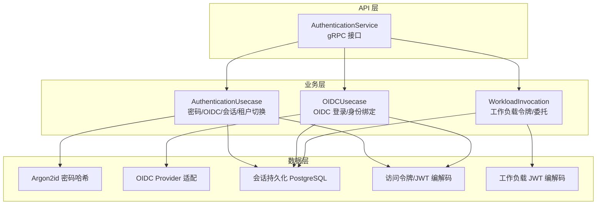
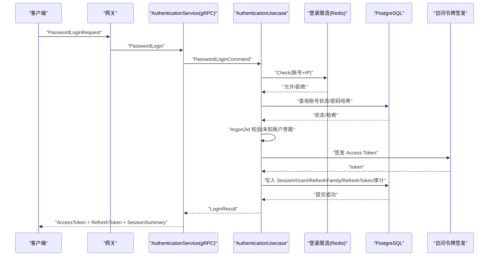
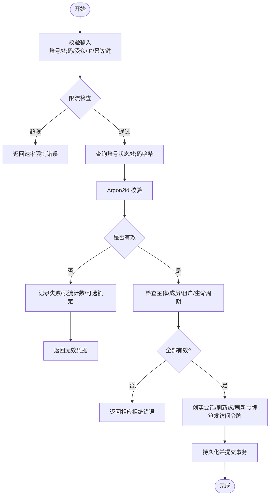
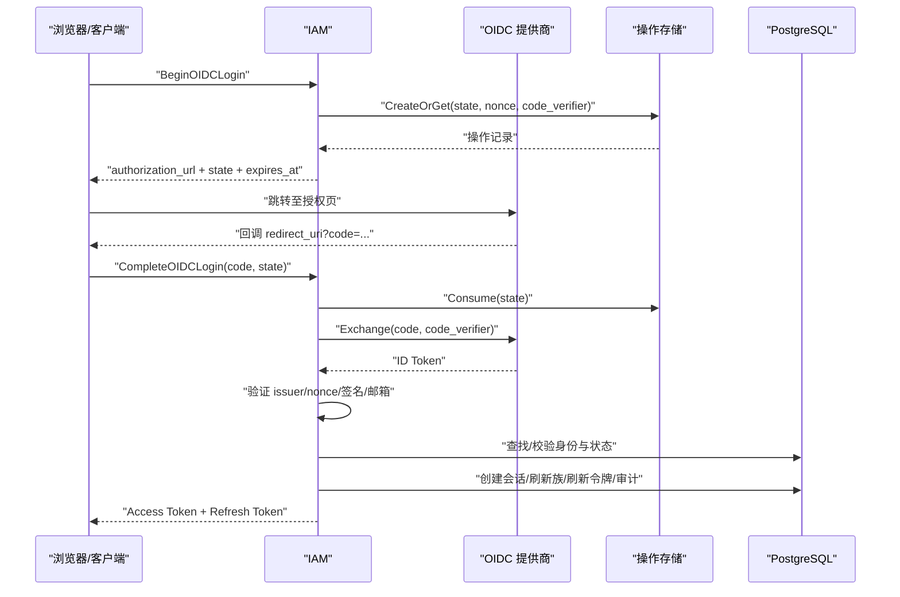
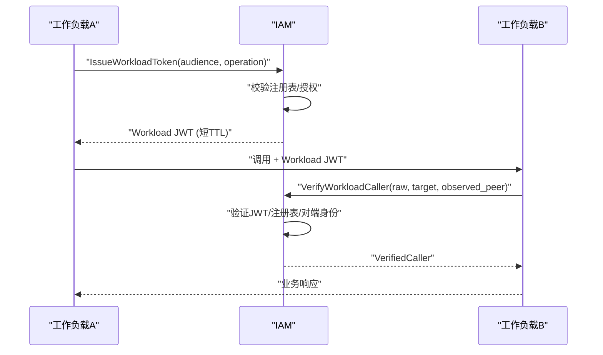
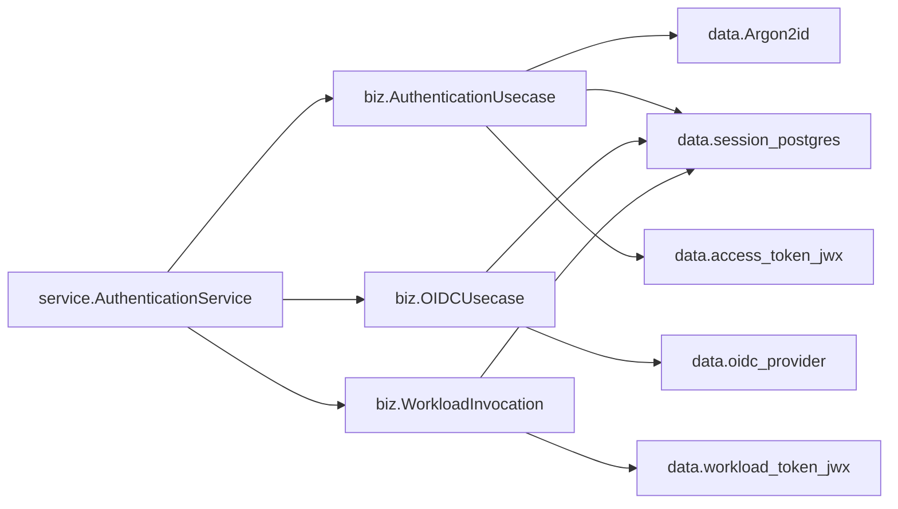

# 认证系统

<cite>
**本文引用的文件**
- [authentication_service.proto](file://api/iam/v1/authentication_service.proto)
- [authentication.go](file://internal/biz/authentication.go)
- [oidc.go](file://internal/biz/oidc.go)
- [principal_validation.go](file://internal/biz/principal_validation.go)
- [workload_caller.go](file://internal/biz/workload_caller.go)
- [workload.go](file://internal/biz/workload.go)
- [authentication.go](file://internal/service/authentication.go)
- [password_argon2id.go](file://internal/data/password_argon2id.go)
- [oidc_provider.go](file://internal/data/oidc_provider.go)
- [access_token_key_file.go](file://internal/data/access_token_key_file.go)
- [session_postgres.go](file://internal/data/session_postgres.go)
- [workload_token_jwx.go](file://internal/data/workload_token_jwx.go)
- [config.yaml](file://configs/config.yaml)
</cite>

## 目录
1. [简介](#简介)
2. [项目结构](#项目结构)
3. [核心组件](#核心组件)
4. [架构总览](#架构总览)
5. [详细组件分析](#详细组件分析)
6. [依赖关系分析](#依赖关系分析)
7. [性能与安全建议](#性能与安全建议)
8. [故障排查指南](#故障排查指南)
9. [结论](#结论)
10. [附录：配置与示例](#附录配置与示例)

## 简介
本文件系统性地说明 ANI IAM 的认证能力，覆盖密码认证、OIDC 集成、API 密钥认证与工作负载认证。文档从请求进入网关到令牌签发、会话管理、刷新轮换、以及安全最佳实践进行分层讲解，并给出关键流程的时序图与流程图，帮助读者在不同场景下正确选用认证方式。

## 项目结构
ANI IAM 采用清晰的三层结构：
- API 层（gRPC）：定义认证相关 RPC 契约，如登录、OIDC 流程、会话管理、主体校验、工作负载令牌签发等。
- 业务层（biz）：实现认证用例、OIDC 流程、会话与权限边界、工作负载调用验证等核心逻辑。
- 数据层（data）：提供密码哈希（Argon2id）、OIDC 提供商适配、访问令牌编解码、会话持久化（PostgreSQL）、工作负载 JWT 编解码等。

图表来源
- [authentication_service.proto:11-33](file://api/iam/v1/authentication_service.proto#L11-L33)
- [authentication.go:286-339](file://internal/biz/authentication.go#L286-L339)
- [oidc.go:216-250](file://internal/biz/oidc.go#L216-L250)
- [workload_caller.go:24-41](file://internal/biz/workload_caller.go#L24-L41)
- [password_argon2id.go:24-63](file://internal/data/password_argon2id.go#L24-L63)
- [oidc_provider.go:62-95](file://internal/data/oidc_provider.go#L62-L95)
- [session_postgres.go:75-165](file://internal/data/session_postgres.go#L75-L165)
- [workload_token_jwx.go:23-50](file://internal/data/workload_token_jwx.go#L23-L50)

章节来源
- [authentication_service.proto:11-33](file://api/iam/v1/authentication_service.proto#L11-L33)
- [authentication.go:286-339](file://internal/biz/authentication.go#L286-L339)
- [oidc.go:216-250](file://internal/biz/oidc.go#L216-L250)
- [workload_caller.go:24-41](file://internal/biz/workload_caller.go#L24-L41)

## 核心组件
- 认证服务（gRPC）：暴露 PasswordLogin、Begin/CompleteOIDCLogin、RefreshSession、LogoutSession、SwitchTenant、ValidatePrincipal、IssueWorkloadToken 等接口。
- 密码认证用例：负责账号校验、速率限制、失败锁定、审计记录、会话与刷新令牌创建、访问令牌签发。
- OIDC 用例：处理授权码流、PKCE、状态/nonce 存储与消费、身份绑定、最近重认证窗口检查。
- 主体校验：统一入口识别凭据类型（Bearer/API Key），执行策略与租户上下文校验，输出可信主体上下文。
- 工作负载认证：基于 mTLS 证书身份解析与授权注册表，签发/验证工作负载 JWT 与委托令牌。
- 会话与刷新：使用数据库行锁保证并发安全，支持刷新轮换、复用、撤销与会话续期。
- 密码哈希：采用 Argon2id 固定参数，提供未知账户防侧信道验证。

章节来源
- [authentication_service.proto:11-33](file://api/iam/v1/authentication_service.proto#L11-L33)
- [authentication.go:341-530](file://internal/biz/authentication.go#L341-L530)
- [oidc.go:547-742](file://internal/biz/oidc.go#L547-L742)
- [principal_validation.go:120-239](file://internal/biz/principal_validation.go#L120-L239)
- [workload_caller.go:43-113](file://internal/biz/workload_caller.go#L43-L113)
- [session_postgres.go:75-165](file://internal/data/session_postgres.go#L75-L165)
- [password_argon2id.go:14-63](file://internal/data/password_argon2id.go#L14-L63)

## 架构总览
下图展示一次密码登录的端到端流程，包括速率限制、密码校验、会话与刷新令牌创建、访问令牌签发与审计落库。

图表来源
- [authentication_service.proto:35-59](file://api/iam/v1/authentication_service.proto#L35-L59)
- [authentication.go:341-530](file://internal/biz/authentication.go#L341-L530)
- [session_postgres.go:75-165](file://internal/data/session_postgres.go#L75-L165)

章节来源
- [authentication_service.proto:35-59](file://api/iam/v1/authentication_service.proto#L35-L59)
- [authentication.go:341-530](file://internal/biz/authentication.go#L341-L530)
- [session_postgres.go:75-165](file://internal/data/session_postgres.go#L75-L165)

## 详细组件分析

### 密码认证
- 输入校验：账号、密码、受众（Console/Boss）、来源 IP、幂等键。
- 速率限制：按“归一化账号+源IP”维度限流；失败时记录并可能锁定一段时间。
- 密码校验：使用 Argon2id 固定参数；对未知账号也进行恒定时间比较，防止枚举。
- 状态检查：主体/成员/租户访问/生命周期状态必须有效且新鲜。
- 会话与令牌：创建 Session、Grant、RefreshTokenFamily、RefreshToken，签发 Access Token，记录审计事件。
- 刷新与登出：通过数据库行锁串行化刷新轮换，支持一次性消费与替换；登出会撤销当前会话的刷新族与会话。

图表来源
- [authentication.go:341-530](file://internal/biz/authentication.go#L341-L530)
- [password_argon2id.go:14-63](file://internal/data/password_argon2id.go#L14-L63)
- [session_postgres.go:75-165](file://internal/data/session_postgres.go#L75-L165)

章节来源
- [authentication.go:341-530](file://internal/biz/authentication.go#L341-L530)
- [password_argon2id.go:14-63](file://internal/data/password_argon2id.go#L14-L63)
- [session_postgres.go:75-165](file://internal/data/session_postgres.go#L75-L165)

### OIDC 集成
- 授权阶段：生成 state/nonce/PKCE code_verifier，持久化操作记录，返回授权 URL。
- 回调阶段：消费 state，交换授权码，校验 ID Token（issuer/nonce/签名），提取邮箱与验证标记。
- 身份匹配：查找已绑定的 OIDC 身份，校验邮箱一致性，检查主体/成员/租户/生命周期状态。
- 会话与令牌：与密码登录一致，创建会话、刷新族与刷新令牌，签发访问令牌。
- 身份绑定：在已认证会话内，支持将外部 OIDC 身份绑定到现有主体，要求最近重认证窗口内。

图表来源
- [oidc.go:547-742](file://internal/biz/oidc.go#L547-L742)
- [oidc_provider.go:101-154](file://internal/data/oidc_provider.go#L101-L154)
- [authentication_service.proto:61-87](file://api/iam/v1/authentication_service.proto#L61-L87)

章节来源
- [oidc.go:547-742](file://internal/biz/oidc.go#L547-L742)
- [oidc_provider.go:101-154](file://internal/data/oidc_provider.go#L101-L154)
- [authentication_service.proto:61-87](file://api/iam/v1/authentication_service.proto#L61-L87)

### API 密钥认证
- 凭据识别：以特定前缀识别为 API Key。
- 鉴权路径：解析 key_id，获取租户边界，查询凭据有效性（状态/过期），校验主体/成员/租户/生命周期状态。
- 使用观测：记录 API Key 使用情况，便于审计与风控。
- 结果：返回可信主体上下文，供下游服务做细粒度授权。

章节来源
- [principal_validation.go:120-239](file://internal/biz/principal_validation.go#L120-L239)
- [authentication_service.proto:223-235](file://api/iam/v1/authentication_service.proto#L223-L235)

### 工作负载认证
- 身份来源：mTLS 证书链校验，仅接受单一 DNS SAN 且具备客户端用途的有效证书。
- 授权依据：工作负载注册表（audience/operation）与授予版本控制，确保最小权限与可追溯。
- 令牌模型：工作负载 JWT（短 TTL）与委托 JWT（用于跨域调用），支持密钥轮换与严格声明校验。
- 调用验证：接收方通过 IAM 验证工作负载凭据与委托，结合观察到的 TLS 对端信息，确认调用者身份与目标。

图表来源
- [workload_caller.go:24-41](file://internal/biz/workload_caller.go#L24-L41)
- [workload_token_jwx.go:23-50](file://internal/data/workload_token_jwx.go#L23-L50)
- [workload.go:17-46](file://internal/biz/workload.go#L17-L46)

章节来源
- [workload_caller.go:24-41](file://internal/biz/workload_caller.go#L24-L41)
- [workload_token_jwx.go:23-50](file://internal/data/workload_token_jwx.go#L23-L50)
- [workload.go:17-46](file://internal/biz/workload.go#L17-L46)

## 依赖关系分析
- 服务层依赖业务用例：AuthenticationService 将 gRPC 请求映射到 AuthenticationUsecase/OIDCUsecase/WorkloadInvocation。
- 业务层依赖数据抽象：密码哈希、OIDC 提供商、会话持久化、令牌编解码、ID 生成器、时钟等。
- 数据层依赖基础设施：PostgreSQL（会话/刷新/审计）、Redis（限流/使用观测）、文件系统（密钥/秘密）。
- 外部依赖：OIDC 提供商（如 Dex），通过 HTTP 客户端与发现端点交互。

图表来源
- [authentication.go:91-106](file://internal/service/authentication.go#L91-L106)
- [authentication.go:286-339](file://internal/biz/authentication.go#L286-L339)
- [oidc.go:216-250](file://internal/biz/oidc.go#L216-L250)
- [workload_caller.go:24-41](file://internal/biz/workload_caller.go#L24-L41)
- [password_argon2id.go:24-63](file://internal/data/password_argon2id.go#L24-L63)
- [session_postgres.go:75-165](file://internal/data/session_postgres.go#L75-L165)
- [workload_token_jwx.go:23-50](file://internal/data/workload_token_jwx.go#L23-L50)
- [oidc_provider.go:62-95](file://internal/data/oidc_provider.go#L62-L95)

章节来源
- [authentication.go:91-106](file://internal/service/authentication.go#L91-L106)
- [authentication.go:286-339](file://internal/biz/authentication.go#L286-L339)
- [oidc.go:216-250](file://internal/biz/oidc.go#L216-L250)
- [workload_caller.go:24-41](file://internal/biz/workload_caller.go#L24-L41)

## 性能与安全建议
- 会话刷新与并发：使用数据库行锁串行化刷新轮换，避免重复消费与竞态；刷新失败时保持幂等。
- 速率限制：按账号+IP维度限流，失败后短暂锁定，降低暴力破解风险。
- 密码哈希：固定 Argon2id 参数，未知账户旁路验证，避免时序攻击。
- OIDC 安全：强制 HTTPS 回调、严格 state/nonce/code_verifier 校验、最近重认证窗口限制。
- 令牌轮换：访问令牌短 TTL，刷新令牌家族化管理，支持一键撤销与轮换。
- 工作负载最小权限：基于注册表的 audience/operation 精确授权，结合 mTLS 证书身份与观察到的对端信息。
- 审计与追踪：所有关键动作均记录审计事件，包含决策 ID、请求 ID、关联 ID，便于排障与合规。

[本节为通用指导，不直接分析具体文件]

## 故障排查指南
- 常见错误映射：服务层将业务错误映射为带 Reason/Metadata 的 gRPC 状态，例如 CREDENTIAL_INVALID、AUTH_RATE_LIMITED、TENANT_LIFECYCLE_STALE、IAM_UNAVAILABLE 等。
- 依赖不可用：OIDC 提供商或数据库不可用时，返回 Unavailable，附带依赖标识，便于快速定位。
- 幂等与冲突：幂等键冲突或版本冲突会返回 AlreadyExists/Aborted，需重试或修正请求。
- 租户生命周期：若租户生命周期投影陈旧或被阻止，将返回 Unavailable/PermissionDenied，需等待同步或联系管理员。
- 调试要点：关注审计事件中的 decision_id、request_id、correlation_id；核对 rate limit 的 limit_scope 与 retry_after_seconds。

章节来源
- [authentication.go:476-683](file://internal/service/authentication.go#L476-L683)
- [authentication.go:517-533](file://internal/service/authentication.go#L517-L533)

## 结论
ANI IAM 提供了多模式认证能力，涵盖人类用户与工作负载，强调安全性（Argon2id、PKCE、mTLS、短 TTL 令牌）、可靠性（事务与行锁、幂等、审计）与可运维性（清晰错误映射、限流与锁定、密钥轮换）。通过统一的 ValidatePrincipal 与规范化的会话/刷新模型，系统能够在复杂的多租户环境中提供稳定一致的认证体验。

[本节为总结，不直接分析具体文件]

## 附录：配置与示例
- 配置文件位置与关键字段：
  - 服务器与 TLS：gRPC 监听地址、超时、证书与 CA。
  - 运行时：工作负载注册表文件与校验和、环境、信任域、PostgreSQL DSN、Redis 连接与命名空间、登录限流窗口。
  - 访问令牌：发行者、活动密钥 ID、私钥文件路径。
  - 通知：地址、证书、出站外发密钥、控制台/平台邀请链接基址、本地化、分发间隔与提交超时。
  - OIDC：提供商名称、发行者 URL、客户端 ID、客户端密钥文件、登录与身份绑定回调地址、最近重认证窗口、HTTP 超时。
  - 策略修订：策略哈希值。

- 典型使用步骤（概念性）：
  - 密码登录：调用 PasswordLogin，传入账号、密码、受众、边界、设备名、幂等键与来源 IP；成功后获得 Access Token、Refresh Token 与会话摘要。
  - OIDC 登录：先 BeginOIDCLogin 获取授权 URL，再 CompleteOIDCLogin 携带 code/state/redirect_uri 完成登录。
  - 刷新会话：使用 RefreshSession 携带 refresh_token、csrf_token、origin、幂等键，获得新的 Access Token。
  - 登出：调用 LogoutSession 撤销当前会话的刷新族与会话。
  - 切换租户：SwitchTenant 基于当前凭据切换到目标租户边界，返回新边界下的令牌与会话。
  - 主体校验：ValidatePrincipal 传入 Bearer 或 API Key，返回可信主体上下文与策略修订。
  - 工作负载令牌：IssueWorkloadToken 由受信任的工作负载调用，返回短 TTL 的工作负载 JWT。

章节来源
- [config.yaml:1-61](file://configs/config.yaml#L1-L61)
- [authentication_service.proto:35-251](file://api/iam/v1/authentication_service.proto#L35-L251)