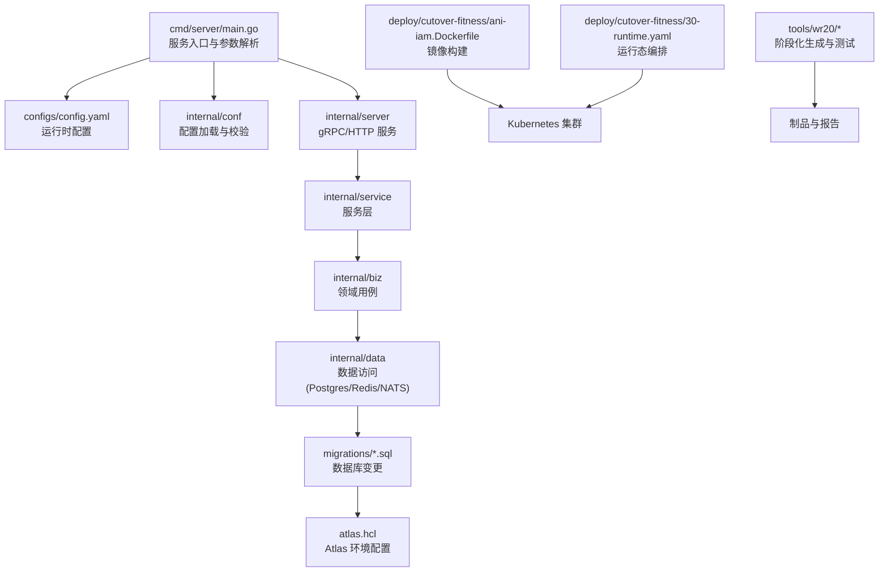
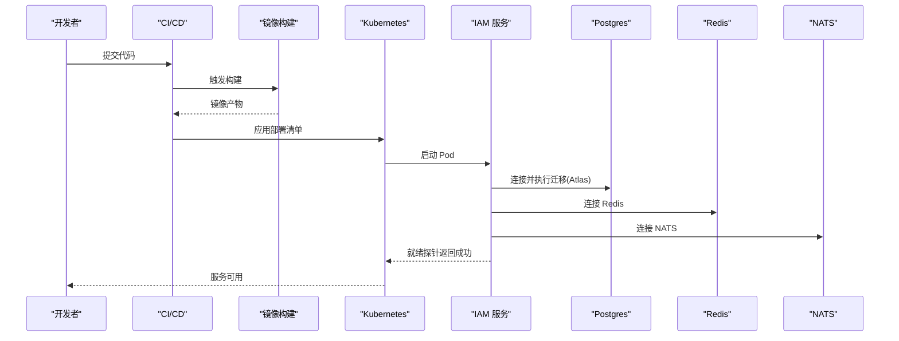
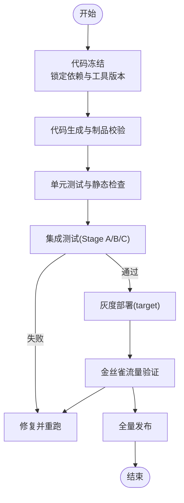
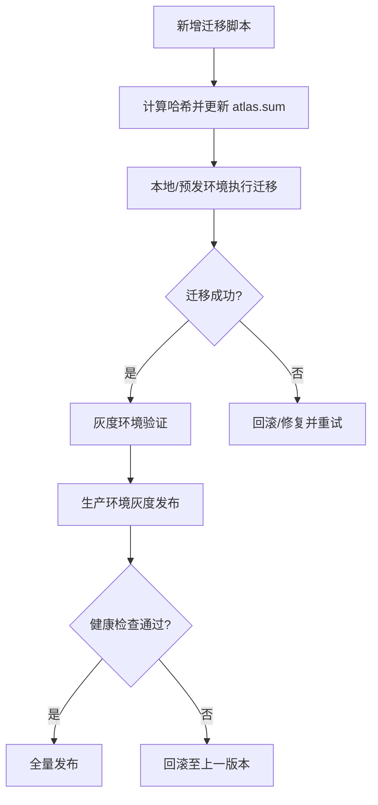
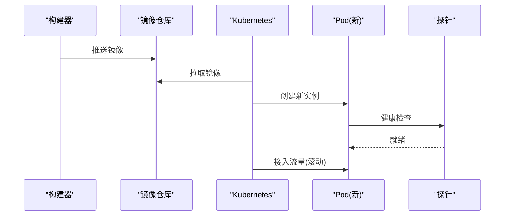
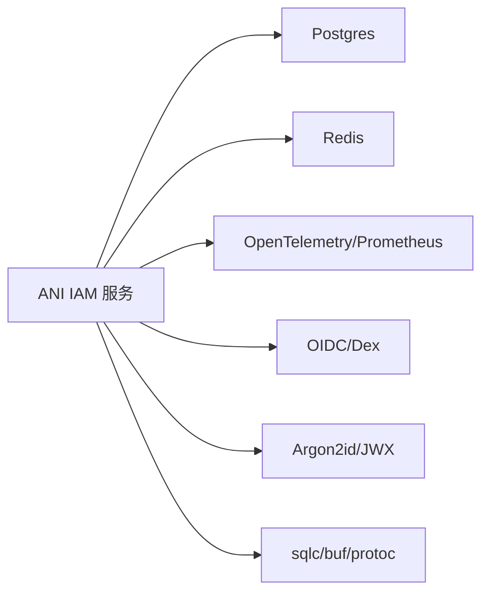

# 升级维护

<cite>
**本文引用的文件**
- [go.mod](file://go.mod)
- [atlas.hcl](file://atlas.hcl)
- [main.go](file://cmd/server/main.go)
- [config.yaml](file://configs/config.yaml)
- [ani-iam.Dockerfile](file://deploy/cutover-fitness/ani-iam.Dockerfile)
- [30-runtime.yaml](file://deploy/cutover-fitness/30-runtime.yaml)
- [atlas.sum](file://migrations/atlas.sum)
- [generate.sh](file://tools/wr20/generate.sh)
- [stage-a.sh](file://tools/wr20/stage-a.sh)
- [stage-b.sh](file://tools/wr20/stage-b.sh)
- [stage-c.sh](file://tools/wr20/stage-c.sh)
</cite>

## 目录
1. [简介](#简介)
2. [项目结构](#项目结构)
3. [核心组件](#核心组件)
4. [架构总览](#架构总览)
5. [详细组件分析](#详细组件分析)
6. [依赖分析](#依赖分析)
7. [性能考虑](#性能考虑)
8. [故障排查指南](#故障排查指南)
9. [结论](#结论)
10. [附录](#附录)

## 简介
本文件面向 ANI IAM 系统的升级与维护，覆盖版本发布流程（代码冻结、测试验证、灰度发布）、数据库迁移管理（Atlas 使用、版本兼容与回滚策略）、Docker 镜像构建与部署（多环境、滚动更新）、依赖库与安全补丁更新流程，以及停机维护窗口规划与影响最小化策略。文档以仓库现有实现为依据，提供可操作的步骤与可视化流程图，帮助团队在保障稳定性的前提下高效完成迭代与发布。

## 项目结构
ANI IAM 采用分层模块化组织：API 契约定义位于 api；业务逻辑位于 internal/biz、internal/service；数据访问与持久化在 internal/data；服务启动入口在 cmd/server；配置在 configs；数据库迁移脚本在 migrations；容器化与部署清单在 deploy；CI/CD 与阶段化验证脚本在 tools/wr20。

**图示来源**
- [main.go:34-101](file://cmd/server/main.go#L34-L101)
- [config.yaml:1-61](file://configs/config.yaml#L1-L61)
- [atlas.hcl:1-8](file://atlas.hcl#L1-L8)
- [ani-iam.Dockerfile:1-15](file://deploy/cutover-fitness/ani-iam.Dockerfile#L1-L15)
- [30-runtime.yaml:1-332](file://deploy/cutover-fitness/30-runtime.yaml#L1-L332)
- [generate.sh:1-45](file://tools/wr20/generate.sh#L1-L45)

**章节来源**
- [main.go:34-101](file://cmd/server/main.go#L34-L101)
- [config.yaml:1-61](file://configs/config.yaml#L1-L61)
- [atlas.hcl:1-8](file://atlas.hcl#L1-L8)
- [ani-iam.Dockerfile:1-15](file://deploy/cutover-fitness/ani-iam.Dockerfile#L1-L15)
- [30-runtime.yaml:1-332](file://deploy/cutover-fitness/30-runtime.yaml#L1-L332)
- [generate.sh:1-45](file://tools/wr20/generate.sh#L1-L45)

## 核心组件
- 服务入口与启动流程：负责参数解析、配置加载、日志初始化与应用运行。
- 配置系统：通过配置文件与环境变量注入运行时参数，包括 gRPC/TLS、Postgres、Redis、OIDC、通知服务等。
- 数据库迁移：基于 Atlas 的 SQL 迁移，配合哈希校验与版本控制。
- 容器化与部署：多阶段 Docker 构建，Kubernetes Deployment 编排，包含健康检查与探针。
- 阶段化验证：工具脚本驱动代码生成、格式化、单元测试与集成测试，产出可审计结果。

**章节来源**
- [main.go:34-101](file://cmd/server/main.go#L34-L101)
- [config.yaml:1-61](file://configs/config.yaml#L1-L61)
- [atlas.hcl:1-8](file://atlas.hcl#L1-L8)
- [ani-iam.Dockerfile:1-15](file://deploy/cutover-fitness/ani-iam.Dockerfile#L1-L15)
- [30-runtime.yaml:1-332](file://deploy/cutover-fitness/30-runtime.yaml#L1-L332)
- [generate.sh:1-45](file://tools/wr20/generate.sh#L1-L45)

## 架构总览
下图展示从代码到生产的关键路径：源码经工具链生成制品，构建为镜像后由 Kubernetes 部署，服务启动时加载配置并连接 Postgres/Redis/NATS，同时执行或等待数据库迁移。

**图示来源**
- [generate.sh:1-45](file://tools/wr20/generate.sh#L1-L45)
- [ani-iam.Dockerfile:1-15](file://deploy/cutover-fitness/ani-iam.Dockerfile#L1-L15)
- [30-runtime.yaml:1-332](file://deploy/cutover-fitness/30-runtime.yaml#L1-L332)
- [main.go:34-101](file://cmd/server/main.go#L34-L101)
- [atlas.hcl:1-8](file://atlas.hcl#L1-L8)

## 详细组件分析

### 版本发布流程（代码冻结、测试验证、灰度发布）
- 代码冻结：锁定依赖与生成物，确保可重复构建。通过固定 Go 版本、工具版本（sqlc、buf），并对生成产物进行哈希比对，保证一致性。
- 测试验证：分阶段执行单元与集成测试，输出结构化结果用于审计与回溯。
- 灰度发布：通过目标运行态（target runtime）与当前运行态（current runtime）并行部署，逐步切流与验证，必要时回滚。

**图示来源**
- [generate.sh:1-45](file://tools/wr20/generate.sh#L1-L45)
- [stage-a.sh:1-34](file://tools/wr20/stage-a.sh#L1-L34)
- [stage-b.sh:1-34](file://tools/wr20/stage-b.sh#L1-L34)
- [stage-c.sh:1-68](file://tools/wr20/stage-c.sh#L1-L68)
- [30-runtime.yaml:1-332](file://deploy/cutover-fitness/30-runtime.yaml#L1-L332)

**章节来源**
- [generate.sh:1-45](file://tools/wr20/generate.sh#L1-L45)
- [stage-a.sh:1-34](file://tools/wr20/stage-a.sh#L1-L34)
- [stage-b.sh:1-34](file://tools/wr20/stage-b.sh#L1-L34)
- [stage-c.sh:1-68](file://tools/wr20/stage-c.sh#L1-L68)
- [30-runtime.yaml:1-332](file://deploy/cutover-fitness/30-runtime.yaml#L1-L332)

### 数据库迁移管理（Atlas 使用、版本兼容与回滚策略）
- 迁移脚本：按时间戳命名，置于 migrations 目录，由 Atlas 管理。
- 环境配置：通过 atlas.hcl 指定环境与迁移目录，支持环境变量注入数据库连接。
- 版本与完整性：atlas.sum 记录每个迁移文件的哈希，确保迁移一致性与可审计性。
- 兼容性：迁移需满足向前兼容，避免破坏性变更；必要时通过双写/过渡表与旧版本共存。
- 回滚策略：优先设计幂等与可逆迁移；若不可逆，准备反向迁移脚本与数据恢复预案，并在灰度阶段先行演练。

**图示来源**
- [atlas.hcl:1-8](file://atlas.hcl#L1-L8)
- [atlas.sum:1-46](file://migrations/atlas.sum#L1-L46)
- [30-runtime.yaml:1-332](file://deploy/cutover-fitness/30-runtime.yaml#L1-L332)

**章节来源**
- [atlas.hcl:1-8](file://atlas.hcl#L1-L8)
- [atlas.sum:1-46](file://migrations/atlas.sum#L1-L46)

### Docker 镜像构建与部署（多环境部署与滚动更新）
- 构建：多阶段构建，第一阶段编译二进制，第二阶段使用精简基础镜像打包，暴露必要端口并以非 root 用户运行。
- 部署：Kubernetes Deployment 定义资源、探针与卷挂载，区分 current/target 两套运行态，便于灰度切换。
- 滚动更新：通过调整副本数与探针状态实现滚动发布；结合 readiness/liveness 探针确保流量安全。
- 多环境：通过 ConfigMap/Secret 注入不同环境的配置与密钥，隔离数据库、缓存与消息队列地址。

**图示来源**
- [ani-iam.Dockerfile:1-15](file://deploy/cutover-fitness/ani-iam.Dockerfile#L1-L15)
- [30-runtime.yaml:1-332](file://deploy/cutover-fitness/30-runtime.yaml#L1-L332)

**章节来源**
- [ani-iam.Dockerfile:1-15](file://deploy/cutover-fitness/ani-iam.Dockerfile#L1-L15)
- [30-runtime.yaml:1-332](file://deploy/cutover-fitness/30-runtime.yaml#L1-L332)

### 依赖库升级指南与安全补丁更新流程
- 依赖锁定：go.mod/go.sum 明确依赖版本，确保可重复构建。
- 升级流程：
  - 评估影响范围与兼容性，优先升级非关键依赖。
  - 在预发环境执行完整测试套件，关注安全相关依赖。
  - 对生成产物进行哈希比对，确保无意外变更。
  - 灰度发布，观察监控指标与错误率。
- 安全补丁：高优先级补丁应快速通道处理，必要时热修复；回滚预案必须完备。

**章节来源**
- [go.mod:1-119](file://go.mod#L1-L119)
- [generate.sh:1-45](file://tools/wr20/generate.sh#L1-L45)

### 停机维护窗口规划与影响最小化策略
- 窗口选择：低峰时段，提前公告，预留回滚时间。
- 前置准备：备份数据库、确认迁移脚本可逆、准备降级方案。
- 灰度优先：先 target 环境验证，再逐步放量；监控告警阈值收紧。
- 快速回滚：一旦异常，立即回滚至上一稳定版本，并保留证据以便复盘。

[本节为通用实践说明，不直接分析具体文件]

## 依赖分析
- 语言与框架：Go 1.26.7，Kratos v3，gRPC，OpenTelemetry，Prometheus。
- 存储与中间件：Postgres (pgx)，Redis (go-redis)，NATS（间接依赖）。
- 安全与认证：Argon2id、JWX、OIDC/Dex。
- 构建与生成：sqlc、buf、protoc-gen-go。

**图示来源**
- [go.mod:1-119](file://go.mod#L1-L119)
- [config.yaml:1-61](file://configs/config.yaml#L1-L61)

**章节来源**
- [go.mod:1-119](file://go.mod#L1-L119)
- [config.yaml:1-61](file://configs/config.yaml#L1-L61)

## 性能考虑
- 连接池与超时：合理设置数据库与 Redis 的连接池大小与读写超时，避免阻塞。
- 探针与优雅关闭：配置合适的 readiness/liveness 探针与 shutdown timeout，确保滚动更新期间零中断。
- 日志与追踪：启用结构化日志与链路追踪，过滤敏感字段，降低 IO 压力。
- 资源限制：为 Pod 设置 CPU/Memory 限制与请求值，防止资源争用。

[本节为通用指导，不直接分析具体文件]

## 故障排查指南
- 启动失败：检查配置文件路径、TLS 证书与密钥、环境变量注入是否正确。
- 数据库连接：确认 DSN、网络可达性与权限；查看迁移是否成功执行。
- 健康检查：验证 readiness 探针端点与命令；检查依赖服务（Redis/NATS/OIDC）连通性。
- 迁移问题：核对 atlas.sum 哈希一致性；在预发环境复现并回滚。
- 灰度异常：对比 current/target 运行态差异；快速回滚并收集诊断信息。

**章节来源**
- [main.go:34-101](file://cmd/server/main.go#L34-L101)
- [config.yaml:1-61](file://configs/config.yaml#L1-L61)
- [30-runtime.yaml:1-332](file://deploy/cutover-fitness/30-runtime.yaml#L1-L332)
- [atlas.hcl:1-8](file://atlas.hcl#L1-L8)

## 结论
ANI IAM 的升级维护体系围绕“可重复构建、分阶段验证、灰度发布、可回滚”的核心原则展开。通过 Atlas 管理数据库迁移、Docker/Kubernetes 实现多环境部署与滚动更新、工具链保障生成产物一致性，团队能够在保障稳定性的前提下高效推进迭代。建议持续完善监控告警、自动化回归与回滚演练，进一步提升发布质量与效率。

[本节为总结性内容，不直接分析具体文件]

## 附录
- 常用命令参考：
  - 构建镜像：依据 Dockerfile 执行多阶段构建。
  - 运行迁移：使用 Atlas 读取 atlas.hcl 并执行迁移。
  - 阶段化测试：运行 tools/wr20 下各 stage 脚本，获取测试结果与制品。
- 配置要点：
  - 服务端口：gRPC/admin 端口在配置中声明。
  - TLS：证书与私钥路径需在 Secret 中挂载。
  - 外部依赖：Postgres/Redis/NATS/OIDC 地址与凭据通过环境变量或 Secret 注入。

[本节为补充说明，不直接分析具体文件]