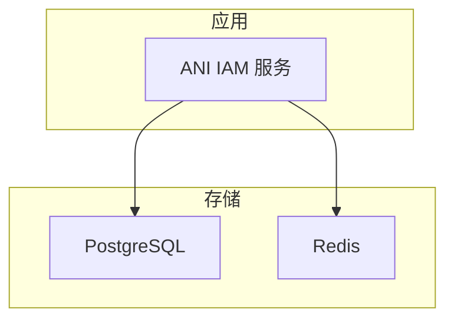
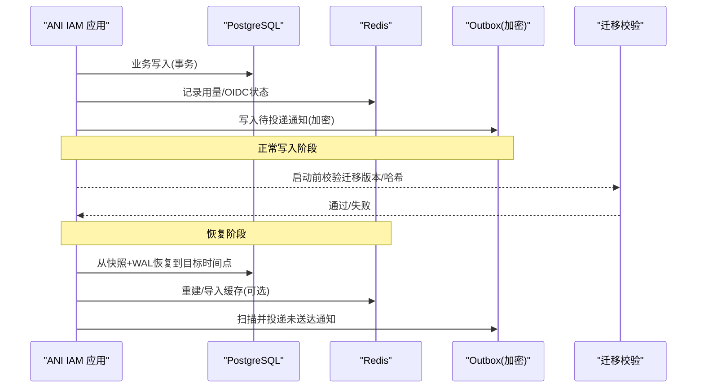
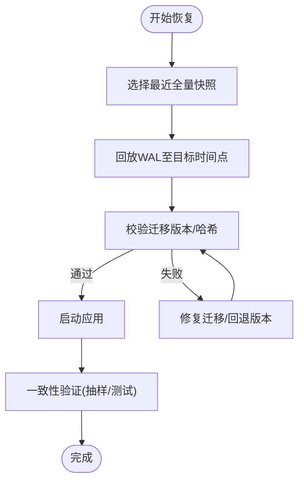
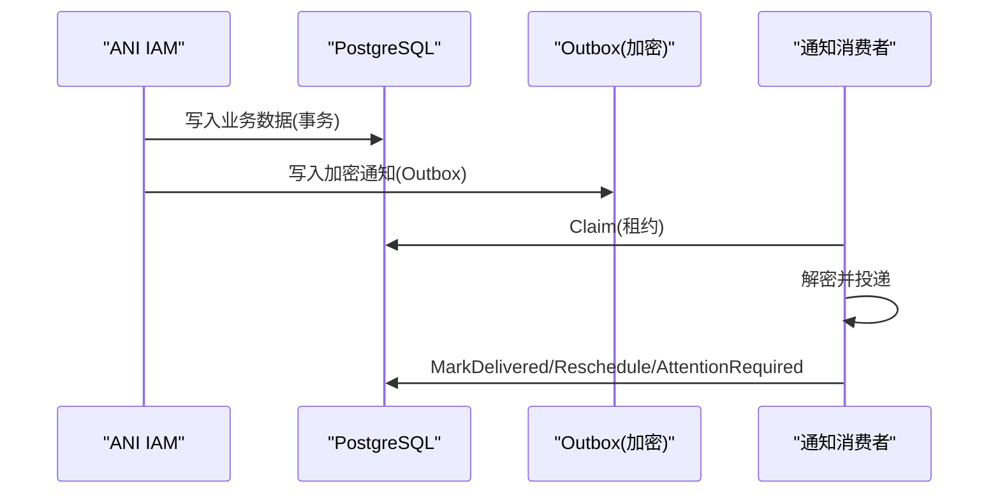
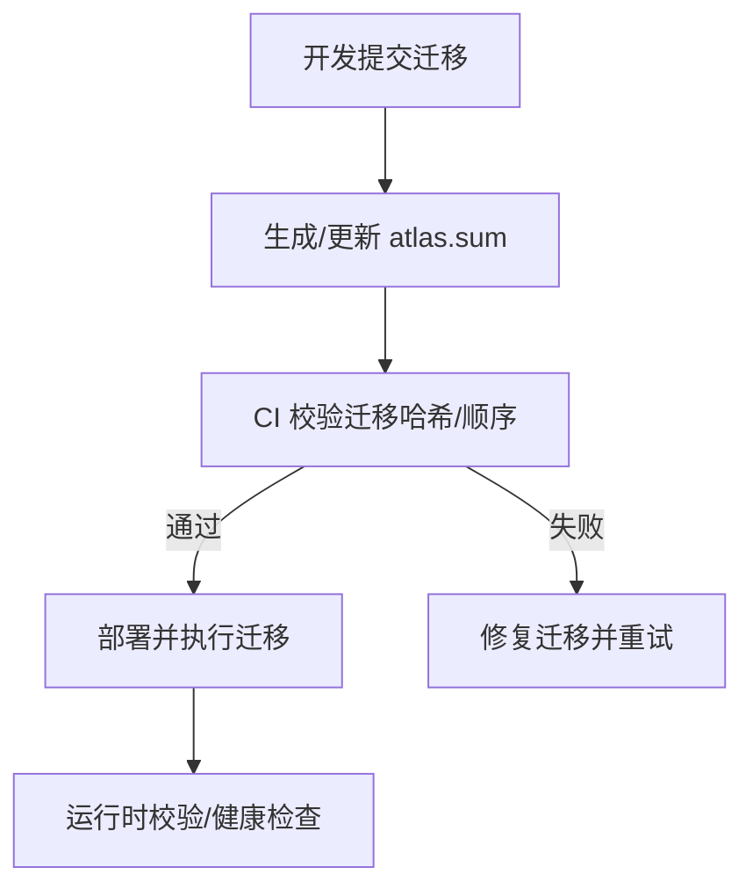
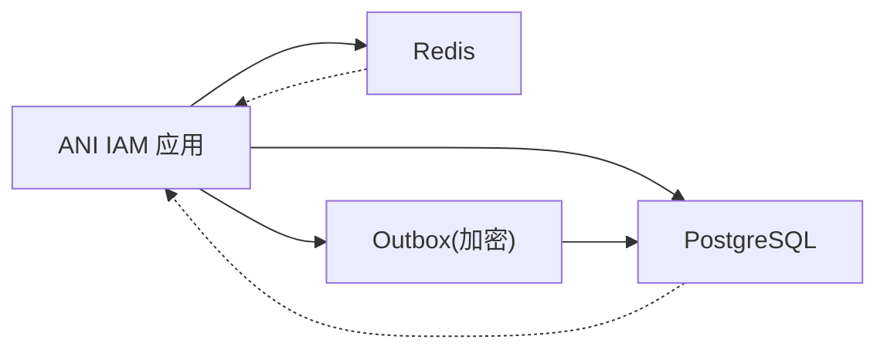

# 备份恢复

<cite>
**本文引用的文件**
- [postgres.go](file://internal/data/postgres.go)
- [data.go](file://internal/data/data.go)
- [api_key_usage_redis.go](file://internal/data/api_key_usage_redis.go)
- [oidc_redis.go](file://internal/data/oidc_redis.go)
- [password_action_notification_outbox.go](file://internal/data/password_action_notification_outbox.go)
- [outbox_protector.go](file://internal/data/outbox_protector.go)
- [config.yaml](file://configs/config.yaml)
- [atlas.hcl](file://atlas.hcl)
- [atlas.sum](file://migrations/atlas.sum)
</cite>

## 目录
1. [简介](#简介)
2. [项目结构](#项目结构)
3. [核心组件](#核心组件)
4. [架构总览](#架构总览)
5. [详细组件分析](#详细组件分析)
6. [依赖关系分析](#依赖关系分析)
7. [性能考虑](#性能考虑)
8. [故障排查指南](#故障排查指南)
9. [结论](#结论)
10. [附录](#附录)

## 简介
本文件为 ANI IAM 系统的“备份与恢复”策略文档，面向运维与平台工程团队。内容覆盖：
- PostgreSQL 全量、增量与事务日志（WAL）备份策略建议
- 数据恢复流程：灾难恢复、数据回滚、一致性验证
- Redis 缓存数据的备份与恢复方法
- Outbox 模式的数据一致性与消息重放策略
- 迁移脚本的版本管理与执行顺序控制

说明：本仓库未内置数据库或缓存的自动备份工具；本文基于代码中使用的持久化组件（PostgreSQL、Redis、Outbox、迁移系统）给出可落地的策略与操作指引，并结合现有实现确保恢复后的一致性。

## 项目结构
ANI IAM 使用以下关键基础设施：
- PostgreSQL：作为主数据存储，承载租户授权、会话、审计、通知 Outbox 等
- Redis：用于限流、OIDC 临时状态、API Key 用量聚合等
- Outbox：通过加密的 Outbox 表保障通知投递的最终一致性
- 迁移系统：Atlas 管理数据库 schema 演进，配合 atlas.sum 校验

图表来源
- [postgres.go:18-59](file://internal/data/postgres.go#L18-L59)
- [api_key_usage_redis.go:26-61](file://internal/data/api_key_usage_redis.go#L26-L61)
- [oidc_redis.go:20-62](file://internal/data/oidc_redis.go#L20-L62)
- [password_action_notification_outbox.go:17-23](file://internal/data/password_action_notification_outbox.go#L17-L23)

章节来源
- [postgres.go:18-59](file://internal/data/postgres.go#L18-L59)
- [data.go:6-20](file://internal/data/data.go#L6-L20)
- [api_key_usage_redis.go:26-61](file://internal/data/api_key_usage_redis.go#L26-L61)
- [oidc_redis.go:20-62](file://internal/data/oidc_redis.go#L20-L62)
- [password_action_notification_outbox.go:17-23](file://internal/data/password_action_notification_outbox.go#L17-L23)

## 核心组件
- PostgreSQL 连接与事务封装：提供租户级工作单元、错误映射与版本冲突处理
- Redis 聚合器：以有序集合暂存 API Key 使用计数，批量刷写至 PG
- OIDC 操作存储：Redis 中的幂等键与过期策略
- Outbox 保护器：对通知负载进行 AEAD 加密，支持密钥轮换
- 配置：PostgreSQL DSN、Redis 地址/命名空间/超时等
- 迁移：Atlas 配置文件与迁移哈希清单

章节来源
- [postgres.go:18-59](file://internal/data/postgres.go#L18-L59)
- [api_key_usage_redis.go:26-61](file://internal/data/api_key_usage_redis.go#L26-L61)
- [oidc_redis.go:20-62](file://internal/data/oidc_redis.go#L20-L62)
- [outbox_protector.go:17-69](file://internal/data/outbox_protector.go#L17-L69)
- [config.yaml:22-32](file://configs/config.yaml#L22-L32)
- [atlas.hcl:1-8](file://atlas.hcl#L1-L8)
- [atlas.sum:1-46](file://migrations/atlas.sum#L1-L46)

## 架构总览
下图展示备份与恢复过程中涉及的组件交互：应用写入 PG 与 Redis，Outbox 保证跨系统事件最终一致；恢复时按“PG 快照 + WAL + Redis 重建”的顺序执行，并通过迁移校验一致性。

图表来源
- [postgres.go:27-59](file://internal/data/postgres.go#L27-L59)
- [api_key_usage_redis.go:63-123](file://internal/data/api_key_usage_redis.go#L63-L123)
- [password_action_notification_outbox.go:25-82](file://internal/data/password_action_notification_outbox.go#L25-L82)
- [outbox_protector.go:73-97](file://internal/data/outbox_protector.go#L73-L97)
- [atlas.hcl:1-8](file://atlas.hcl#L1-L8)
- [atlas.sum:1-46](file://migrations/atlas.sum#L1-L46)

## 详细组件分析

### PostgreSQL 备份方案
- 全量备份
  - 建议使用物理备份（如 pg_basebackup）或云厂商托管快照，确保包含所有表、索引、序列及 WAL 归档目录
  - 建议在低峰期执行，并在备份期间保持只读或最小写入，避免不一致
- 增量备份
  - 启用 WAL 归档（archive_mode=on），将 WAL 片段持续归档到对象存储
  - 结合定期增量快照（如 LVM snapshot 或云盘快照）降低恢复时间
- 事务日志备份（WAL）
  - 配置 wal_level=replica 或 higher，archive_command 指向可靠存储
  - 保留足够历史 WAL 以满足最大 RPO（恢复点目标）

恢复要点
- 使用最新全量快照 + 回放 WAL 至目标时间点（PITR）
- 恢复后运行迁移校验，确保 schema 与应用一致
- 若存在只读副本，可在副本上执行查询验证数据一致性

章节来源
- [postgres.go:27-59](file://internal/data/postgres.go#L27-L59)
- [config.yaml:22-24](file://configs/config.yaml#L22-L24)

### 数据恢复流程
- 灾难恢复
  - 选择最近的全量快照
  - 回放 WAL 至期望时间点
  - 启动应用前执行迁移校验
- 数据回滚
  - 针对误操作，使用 PITR 回退到误操作前的时间点
  - 若仅影响少量数据，可通过事务性脚本在维护窗口内修正
- 一致性验证
  - 校验迁移哈希与当前数据库 schema 一致
  - 抽样核对关键表（如租户授权、会话、审计、Outbox）
  - 运行集成测试或健康检查端点

图表来源
- [atlas.hcl:1-8](file://atlas.hcl#L1-L8)
- [atlas.sum:1-46](file://migrations/atlas.sum#L1-L46)
- [postgres.go:27-59](file://internal/data/postgres.go#L27-L59)

### Redis 缓存备份与恢复
- 需要备份的数据
  - API Key 用量聚合（ZSET）：用于限流与统计
  - OIDC 临时状态（Hash/Key）：带过期时间的幂等操作
- 备份方法
  - 使用 redis-cli 的 BGSAVE/RDB 快照或 AOF 追加日志
  - 或使用云托管 Redis 的快照/导出功能
- 恢复方法
  - 停止写入后加载 RDB/AOF
  - 对于 TTL 数据，注意恢复后过期时间可能已过期，需容忍短暂缺失
- 注意事项
  - 命名空间隔离：确保恢复到正确的 database/namespace
  - 容量与内存：避免恢复时 OOM

章节来源
- [api_key_usage_redis.go:26-61](file://internal/data/api_key_usage_redis.go#L26-L61)
- [api_key_usage_redis.go:63-123](file://internal/data/api_key_usage_redis.go#L63-L123)
- [oidc_redis.go:20-62](file://internal/data/oidc_redis.go#L20-L62)
- [config.yaml:24-32](file://configs/config.yaml#L24-L32)

### Outbox 模式与消息重放
- 设计要点
  - 通知先写入 Outbox（加密），再由消费者拉取并投递
  - 使用 Claim/Reschedule/MarkDelivered 状态机保证至少一次投递
  - 支持重试与关注标记（Attention Required）
- 恢复与重放
  - 恢复 PG 后，Outbox 中未投递的消息可由消费者重新 Claim
  - 若投递失败，进入 Reschedule 或 Attention Required，人工介入后重试
- 安全性
  - Outbox 负载使用 AEAD 加密，支持密钥轮换（active key + 历史 keys）

图表来源
- [password_action_notification_outbox.go:25-155](file://internal/data/password_action_notification_outbox.go#L25-L155)
- [outbox_protector.go:73-97](file://internal/data/outbox_protector.go#L73-L97)

章节来源
- [password_action_notification_outbox.go:25-155](file://internal/data/password_action_notification_outbox.go#L25-L155)
- [outbox_protector.go:17-97](file://internal/data/outbox_protector.go#L17-L97)

### 迁移脚本的版本管理与执行顺序
- 版本管理
  - 迁移文件位于 migrations/，文件名含时间戳与描述
  - atlas.sum 保存每个迁移文件的哈希，用于校验完整性与一致性
- 执行顺序
  - Atlas 按文件名排序执行，确保顺序可控
  - 部署前执行迁移校验，失败则阻止上线
- 回滚策略
  - 如需回滚，应准备反向迁移或在沙箱环境验证后再执行
  - 结合 PITR 快速回退到迁移前状态

图表来源
- [atlas.hcl:1-8](file://atlas.hcl#L1-L8)
- [atlas.sum:1-46](file://migrations/atlas.sum#L1-L46)

章节来源
- [atlas.hcl:1-8](file://atlas.hcl#L1-L8)
- [atlas.sum:1-46](file://migrations/atlas.sum#L1-L46)

## 依赖关系分析
- 应用对 PG 的依赖：事务边界、错误映射、版本冲突处理
- 应用对 Redis 的依赖：限流、OIDC 状态、用量聚合
- Outbox 对 PG 的依赖：加密通知的持久化与状态机
- 迁移对 Atlas 的依赖：schema 版本与哈希校验

图表来源
- [postgres.go:18-59](file://internal/data/postgres.go#L18-L59)
- [api_key_usage_redis.go:26-61](file://internal/data/api_key_usage_redis.go#L26-L61)
- [password_action_notification_outbox.go:17-23](file://internal/data/password_action_notification_outbox.go#L17-L23)
- [outbox_protector.go:17-69](file://internal/data/outbox_protector.go#L17-L69)

章节来源
- [postgres.go:18-59](file://internal/data/postgres.go#L18-L59)
- [api_key_usage_redis.go:26-61](file://internal/data/api_key_usage_redis.go#L26-L61)
- [password_action_notification_outbox.go:17-23](file://internal/data/password_action_notification_outbox.go#L17-L23)
- [outbox_protector.go:17-69](file://internal/data/outbox_protector.go#L17-L69)

## 性能考虑
- 备份窗口
  - 全量备份尽量在低峰期执行，减少锁竞争与 IO 压力
  - WAL 归档应异步且具备高吞吐能力
- 恢复性能
  - 使用高性能磁盘与网络提升 WAL 回放速度
  - 恢复后预热热点数据，避免冷启动抖动
- 缓存恢复
  - Redis 恢复后可选择性忽略过期数据，由应用按需重建
- Outbox 消费
  - 合理设置 Claim 租约与批处理大小，避免重复处理与资源争用

[本节为通用指导，不直接分析具体文件]

## 故障排查指南
- 迁移失败
  - 检查 atlas.sum 与迁移文件是否匹配
  - 确认数据库权限与连接字符串
- 数据不一致
  - 核对迁移版本与预期一致
  - 抽样检查关键表与索引
- Redis 异常
  - 检查命名空间与数据库编号
  - 查看限流与 OIDC 状态是否可用
- Outbox 堆积
  - 检查 Claim/MarkDelivered 逻辑
  - 关注 Attention Required 条目并人工介入

章节来源
- [atlas.hcl:1-8](file://atlas.hcl#L1-L8)
- [atlas.sum:1-46](file://migrations/atlas.sum#L1-L46)
- [api_key_usage_redis.go:63-123](file://internal/data/api_key_usage_redis.go#L63-L123)
- [password_action_notification_outbox.go:84-155](file://internal/data/password_action_notification_outbox.go#L84-L155)

## 结论
- 采用“全量快照 + WAL 归档 + 迁移校验”的组合策略，可实现可靠的 PG 备份与 PITR 恢复
- Redis 缓存可作为辅助恢复手段，但不应替代持久化数据
- Outbox 机制保障通知的最终一致性与可重放，适合在恢复后继续投递
- 迁移系统通过哈希与顺序控制，确保 schema 的一致性与可追溯性

[本节为总结性内容，不直接分析具体文件]

## 附录
- 配置项参考
  - PostgreSQL DSN、Redis 地址/命名空间/超时等见配置文件
- 关键路径
  - 迁移目录：migrations/
  - 迁移配置：atlas.hcl
  - 迁移哈希：atlas.sum

章节来源
- [config.yaml:22-32](file://configs/config.yaml#L22-L32)
- [atlas.hcl:1-8](file://atlas.hcl#L1-L8)
- [atlas.sum:1-46](file://migrations/atlas.sum#L1-L46)