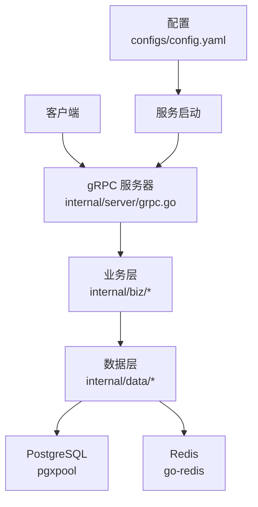
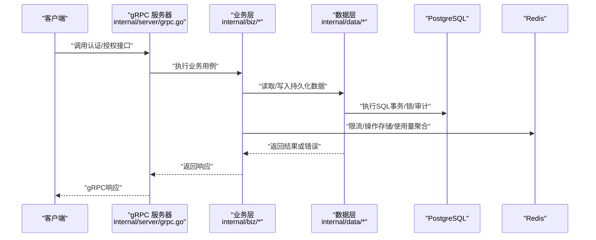
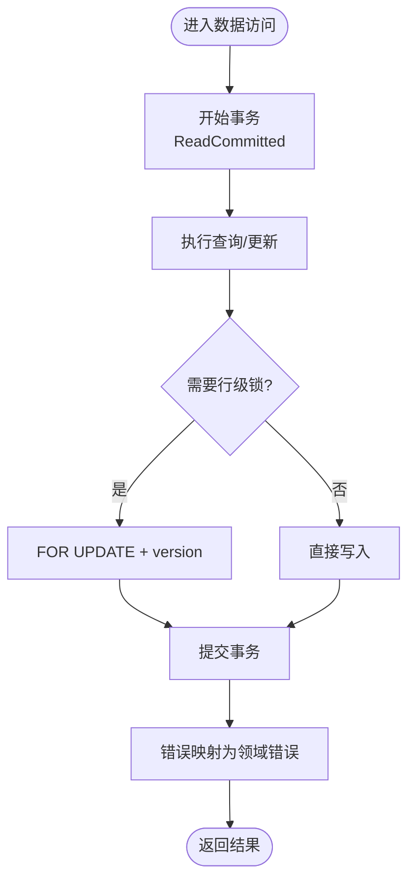
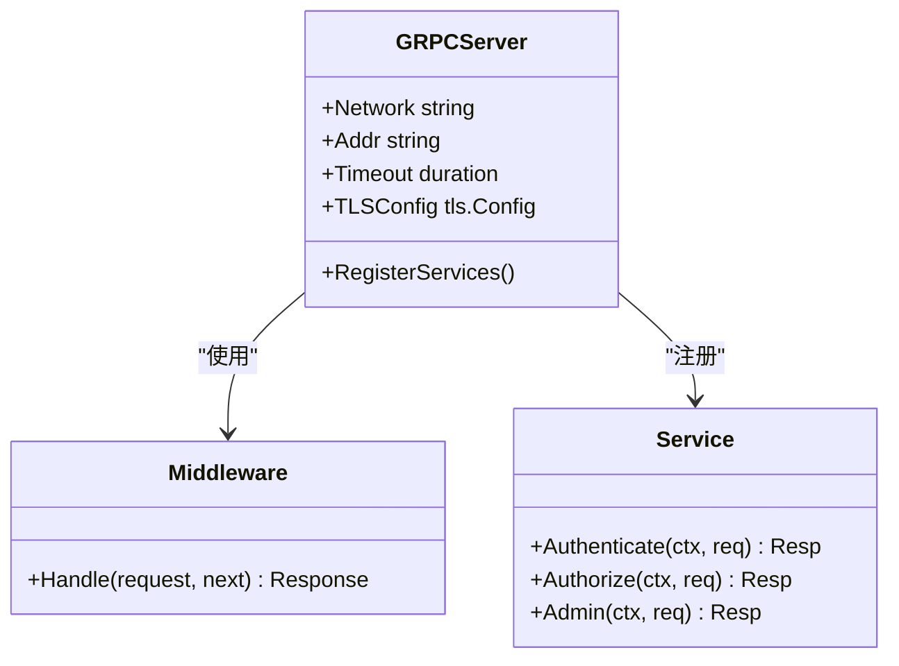
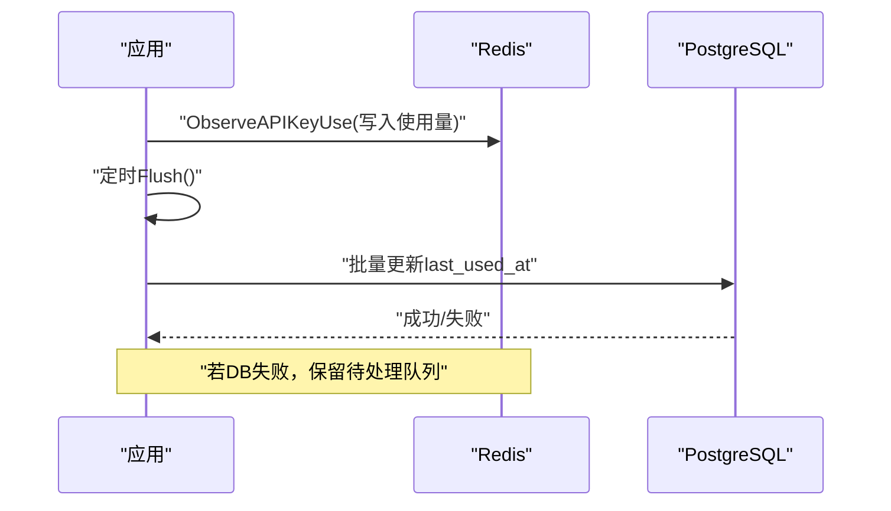
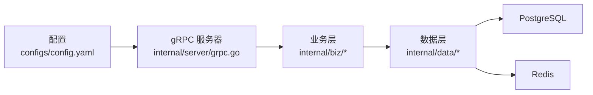

# 性能调优

<cite>
**本文引用的文件**
- [configs/config.yaml](file://configs/config.yaml)
- [internal/conf/conf.pb.go](file://internal/conf/conf.pb.go)
- [internal/conf/validate.go](file://internal/conf/validate.go)
- [internal/server/grpc.go](file://internal/server/grpc.go)
- [internal/data/postgres.go](file://internal/data/postgres.go)
- [internal/data/data.go](file://internal/data/data.go)
- [internal/data/queries/persistence.sql](file://internal/data/queries/persistence.sql)
- [internal/data/oidc_redis.go](file://internal/data/oidc_redis.go)
- [tests/integration/api_key_redis_control_test.go](file://tests/integration/api_key_redis_control_test.go)
</cite>

## 目录
1. [简介](#简介)
2. [项目结构](#项目结构)
3. [核心组件](#核心组件)
4. [架构总览](#架构总览)
5. [详细组件分析](#详细组件分析)
6. [依赖关系分析](#依赖关系分析)
7. [性能考虑](#性能考虑)
8. [故障排查指南](#故障排查指南)
9. [结论](#结论)
10. [附录](#附录)

## 简介
本指南面向ANI IAM系统的生产性能调优，覆盖数据库（PostgreSQL）索引与查询优化、连接池配置；Go应用层Goroutine管理、内存分配与GC调优；gRPC服务并发控制、负载均衡与超时配置；Redis缓存策略与监控指标；以及容量规划与扩展策略。文档基于仓库中的配置、数据访问层、gRPC服务实现与集成测试进行说明，并提供可操作的调优建议与可视化图示。

## 项目结构
本项目采用分层架构：
- API定义位于api/iam/v1，生成gRPC服务端点与服务契约。
- 服务启动与gRPC服务器在internal/server中构建，并加载TLS与中间件。
- 业务逻辑在internal/biz，数据访问在internal/data，SQL通过sqlc生成类型安全的查询代码。
- Redis用于限流、操作存储、使用量聚合等能力。
- 配置集中在configs/config.yaml，并通过internal/conf的结构体解析与校验。

**图表来源**
- [internal/server/grpc.go:14-27](file://internal/server/grpc.go#L14-L27)
- [internal/data/data.go:6-20](file://internal/data/data.go#L6-L20)
- [configs/config.yaml:1-61](file://configs/config.yaml#L1-L61)

**章节来源**
- [internal/server/grpc.go:14-52](file://internal/server/grpc.go#L14-L52)
- [internal/data/data.go:6-29](file://internal/data/data.go#L6-L29)
- [configs/config.yaml:1-61](file://configs/config.yaml#L1-L61)

## 核心组件
- gRPC服务器：提供认证、授权与管理服务，强制mTLS与最小TLS版本，支持超时与反射禁用。
- PostgreSQL数据访问：使用pgxpool连接池，事务内读已提交隔离级别，错误映射为领域错误。
- Redis缓存与限流：登录限制、OIDC操作存储、API Key使用量异步聚合。
- 配置与校验：gRPC网络、地址、超时、TLS证书路径与DNS身份校验；运行时PostgreSQL DSN与Redis参数。

**章节来源**
- [internal/server/grpc.go:14-52](file://internal/server/grpc.go#L14-L52)
- [internal/conf/validate.go:47-90](file://internal/conf/validate.go#L47-L90)
- [internal/data/postgres.go:27-59](file://internal/data/postgres.go#L27-L59)
- [internal/data/oidc_redis.go:20-62](file://internal/data/oidc_redis.go#L20-L62)
- [configs/config.yaml:1-61](file://configs/config.yaml#L1-L61)

## 架构总览
下图展示请求从gRPC入口到数据层的调用链，包括鉴权、权限检查、会话刷新与审计写入的关键路径。

**图表来源**
- [internal/server/grpc.go:14-52](file://internal/server/grpc.go#L14-L52)
- [internal/data/postgres.go:27-59](file://internal/data/postgres.go#L27-L59)
- [internal/data/oidc_redis.go:20-62](file://internal/data/oidc_redis.go#L20-L62)
- [tests/integration/api_key_redis_control_test.go:116-187](file://tests/integration/api_key_redis_control_test.go#L116-L187)

## 详细组件分析

### 数据库性能优化（PostgreSQL）
- 连接池与事务
  - 使用pgxpool作为连接池，Data对象持有长生命周期连接池实例，避免频繁创建销毁。
  - 租户工作单元以ReadCommitted隔离级别开启事务，确保一致性同时减少锁竞争。
  - 错误映射将PostgreSQL特定错误转换为领域错误，便于上层统一处理与重试策略。
- 查询优化
  - 分页与游标：列表查询使用cursor_id与LIMIT，避免全表扫描与大结果集传输。
  - 条件过滤与JOIN：多表关联时优先选择选择性高的列作为过滤条件，必要时建立复合索引。
  - 行级锁与顺序更新：FOR UPDATE配合版本号（version）防止并发写冲突，减少重试开销。
  - 审计事件追加：批量插入场景建议使用批处理或异步聚合，降低主路径延迟。
- 索引策略建议
  - 针对tenant_id、principal_id、key_id等高频过滤列建立单列或复合索引。
  - 对状态列（status）与时间范围（expires_at、last_used_at）组合查询建立复合索引。
  - 审计事件表按tenant_id与occurred_at建立复合索引，提升历史查询性能。
  - 注意索引维护成本与写入放大，定期评估统计信息与VACUUM/ANALYZE。

**图表来源**
- [internal/data/postgres.go:27-59](file://internal/data/postgres.go#L27-L59)
- [internal/data/postgres.go:195-232](file://internal/data/postgres.go#L195-L232)
- [internal/data/queries/persistence.sql:372-409](file://internal/data/queries/persistence.sql#L372-L409)

**章节来源**
- [internal/data/postgres.go:27-59](file://internal/data/postgres.go#L27-L59)
- [internal/data/postgres.go:195-232](file://internal/data/postgres.go#L195-L232)
- [internal/data/queries/persistence.sql:38-72](file://internal/data/queries/persistence.sql#L38-L72)
- [internal/data/queries/persistence.sql:142-161](file://internal/data/queries/persistence.sql#L142-L161)
- [internal/data/queries/persistence.sql:372-409](file://internal/data/queries/persistence.sql#L372-L409)

### Go应用性能调优（Goroutine、内存、GC）
- Goroutine管理
  - 使用context控制取消与超时，避免goroutine泄漏。
  - 对高并发任务使用worker pool或semaphore限制并发度，防止资源耗尽。
  - 结合gRPC超时与中间件，确保请求生命周期可控。
- 内存分配
  - 复用对象（如字节缓冲、查询参数结构），减少堆分配。
  - 避免大对象在热点路径频繁创建，必要时使用sync.Pool。
  - 合理设置日志级别与采样，减少序列化与I/O压力。
- GC调优
  - 观察PProf的heap与gc图，定位分配热点与逃逸分析。
  - 调整GOGC与GOMEMLIMIT，平衡延迟与吞吐。
  - 关注长时间运行的后台任务（如通知出队、审计聚合）的内存占用。

[本节为通用指导，不直接分析具体文件]

### gRPC服务性能优化（并发、负载均衡、超时）
- 并发控制
  - 通过中间件实现请求限流、熔断与重试退避。
  - 使用gRPC的Timeout配置限制单请求最大耗时，避免堆积。
- 负载均衡
  - 前端网关或服务发现进行多实例均衡，避免单点过载。
  - 根据后端能力动态调整权重与健康检查阈值。
- 超时配置
  - gRPC server.timeout需小于下游依赖（DB/Redis）超时，形成快速失败。
  - TLS握手与证书加载预热，减少首包延迟。

**图表来源**
- [internal/server/grpc.go:14-52](file://internal/server/grpc.go#L14-L52)
- [internal/conf/conf.pb.go:986-1012](file://internal/conf/conf.pb.go#L986-L1012)

**章节来源**
- [internal/server/grpc.go:14-52](file://internal/server/grpc.go#L14-L52)
- [internal/conf/validate.go:47-90](file://internal/conf/validate.go#L47-L90)
- [internal/conf/conf.pb.go:986-1012](file://internal/conf/conf.pb.go#L986-L1012)

### Redis缓存策略优化与监控
- 登录限流
  - 使用Redis滑动窗口或固定窗口计数，限制单位时间内登录尝试次数。
  - 配置login_limit与login_window，结合dial/read/write超时保证快速失败。
- OIDC操作存储
  - 使用Lua脚本原子性创建/消费操作状态，避免竞态与重复处理。
  - 设置过期时间，自动清理无效状态。
- API Key使用量聚合
  - 先写入Redis有序集合，再批量Flush到PostgreSQL，降低写放大。
  - 当PostgreSQL不可用时，保留待处理队列，后续重试。
- 监控指标
  - 记录Redis命中率、延迟、错误率；PostgreSQL连接池使用率、等待时间、慢查询。
  - 跟踪gRPC请求耗时分布、超时比例、重试次数。

**图表来源**
- [tests/integration/api_key_redis_control_test.go:116-187](file://tests/integration/api_key_redis_control_test.go#L116-L187)
- [internal/data/oidc_redis.go:20-62](file://internal/data/oidc_redis.go#L20-L62)
- [configs/config.yaml:24-32](file://configs/config.yaml#L24-L32)

**章节来源**
- [tests/integration/api_key_redis_control_test.go:116-187](file://tests/integration/api_key_redis_control_test.go#L116-L187)
- [internal/data/oidc_redis.go:20-62](file://internal/data/oidc_redis.go#L20-L62)
- [configs/config.yaml:24-32](file://configs/config.yaml#L24-L32)

### 容量规划与扩展策略
- 水平扩展
  - gRPC服务无状态，可通过增加实例数与负载均衡提升吞吐。
  - 数据库读写分离或分库分表，缓解热点键与热点租户。
- 垂直扩展
  - 提升CPU/内存以应对复杂查询与加密操作（如密码哈希、JWT签名）。
  - 调整PostgreSQL参数（shared_buffers、work_mem、max_connections）与索引策略。
- 弹性伸缩
  - 基于CPU、内存、请求延迟与错误率触发扩缩容。
  - 预冷TLS证书与连接池，减少冷启动延迟。
- 降级与保护
  - 非关键路径（如审计、通知）异步化与批量处理。
  - 限流与熔断保护上游与下游依赖。

[本节为通用指导，不直接分析具体文件]

## 依赖关系分析
- gRPC服务器依赖配置与TLS，注册认证、授权、管理服务。
- 业务层依赖数据层提供的租户工作单元与仓储接口。
- 数据层依赖PostgreSQL连接池与Redis客户端，封装事务、锁与错误映射。
- 配置模块负责gRPC网络、地址、超时与TLS路径校验，确保运行环境安全。

**图表来源**
- [configs/config.yaml:1-61](file://configs/config.yaml#L1-L61)
- [internal/server/grpc.go:14-52](file://internal/server/grpc.go#L14-L52)
- [internal/data/data.go:6-29](file://internal/data/data.go#L6-L29)

**章节来源**
- [internal/server/grpc.go:14-52](file://internal/server/grpc.go#L14-L52)
- [internal/data/data.go:6-29](file://internal/data/data.go#L6-L29)
- [configs/config.yaml:1-61](file://configs/config.yaml#L1-L61)

## 性能考虑
- 数据库
  - 使用分页与游标减少大结果集传输。
  - 为高频查询列建立合适索引，定期分析统计信息。
  - 事务内使用行级锁与版本号避免并发冲突。
- Go应用
  - 合理使用Goroutine与上下文，避免泄漏与过度并发。
  - 对象复用与内存池减少分配压力。
  - 监控GC行为，调整GOGC与GOMEMLIMIT。
- gRPC
  - 设置合理的超时与重试策略，快速失败。
  - 启用mTLS与最小TLS版本，确保安全与性能平衡。
- Redis
  - 使用Lua脚本保证原子性，设置过期时间。
  - 异步聚合写入数据库，降低主路径延迟。
  - 监控命中率与延迟，及时扩容或优化。

[本节为通用指导，不直接分析具体文件]

## 故障排查指南
- gRPC超时与TLS问题
  - 检查server.timeout与下游依赖超时是否匹配。
  - 验证TLS证书路径、DNS身份与最小版本配置。
- PostgreSQL连接与错误
  - 观察连接池使用率与等待时间，调整max_connections与idle_timeout。
  - 分析慢查询与锁等待，优化索引与事务粒度。
- Redis限流与聚合
  - 确认login_limit与login_window配置合理。
  - 检查API Key使用量聚合的Pending数量与Flush成功率。
- 监控与告警
  - 设置gRPC请求延迟、错误率、超时比例的告警。
  - 监控PostgreSQL与Redis的健康指标与资源使用。

**章节来源**
- [internal/conf/validate.go:47-90](file://internal/conf/validate.go#L47-L90)
- [internal/server/grpc.go:14-52](file://internal/server/grpc.go#L14-L52)
- [tests/integration/api_key_redis_control_test.go:116-187](file://tests/integration/api_key_redis_control_test.go#L116-L187)

## 结论
通过合理的数据库索引与查询优化、Go应用层的并发与内存管理、gRPC服务的超时与负载均衡配置、Redis缓存策略与监控指标，可以有效提升ANI IAM系统的性能与稳定性。结合容量规划与扩展策略，系统可在高负载下保持低延迟与高可用。

[本节为总结，不直接分析具体文件]

## 附录
- 配置参考
  - gRPC网络、地址、超时与TLS配置见配置文件。
  - Redis登录限制、窗口与超时参数见配置文件。
- 关键路径
  - 认证/授权流程涉及会话刷新、权限检查与审计写入。
  - API Key使用量通过Redis聚合后批量写入数据库。

**章节来源**
- [configs/config.yaml:1-61](file://configs/config.yaml#L1-L61)
- [internal/data/queries/persistence.sql:372-409](file://internal/data/queries/persistence.sql#L372-L409)
- [tests/integration/api_key_redis_control_test.go:116-187](file://tests/integration/api_key_redis_control_test.go#L116-L187)