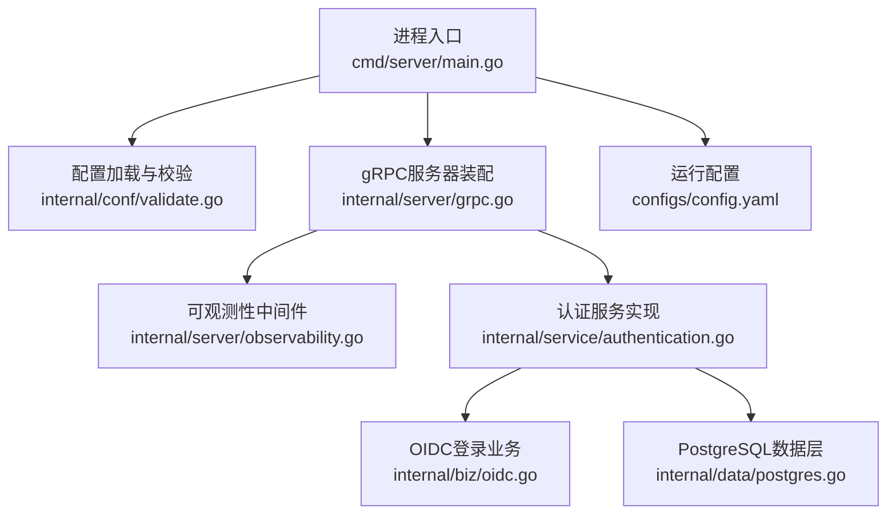
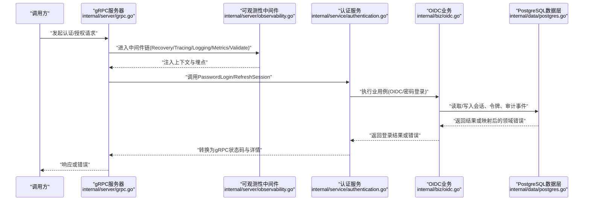
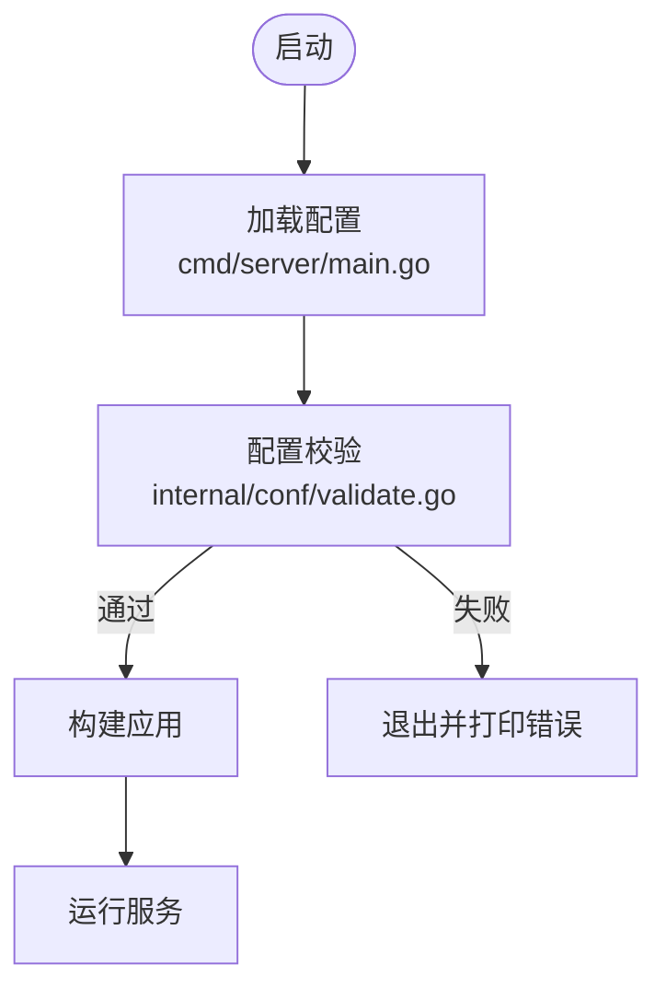
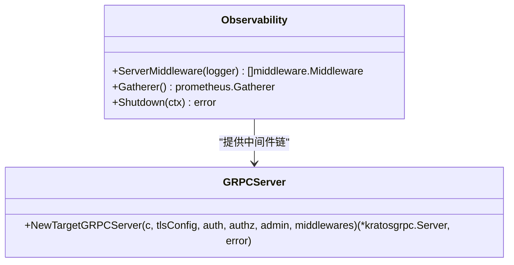
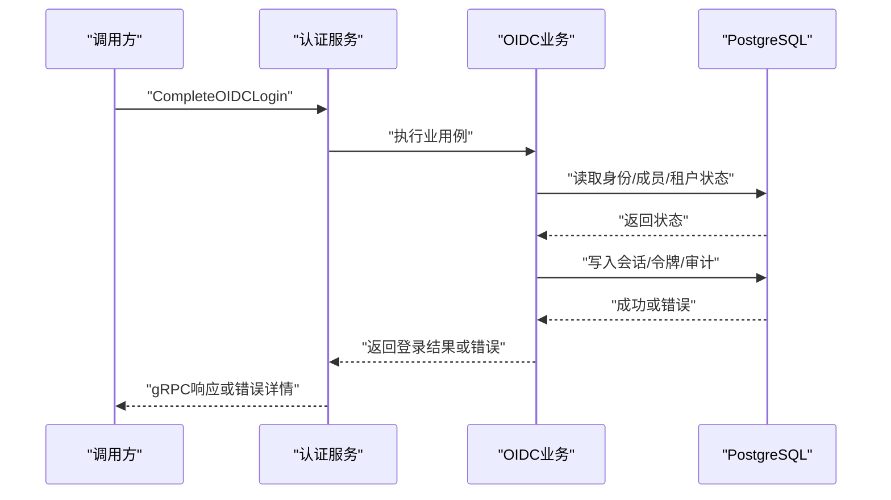
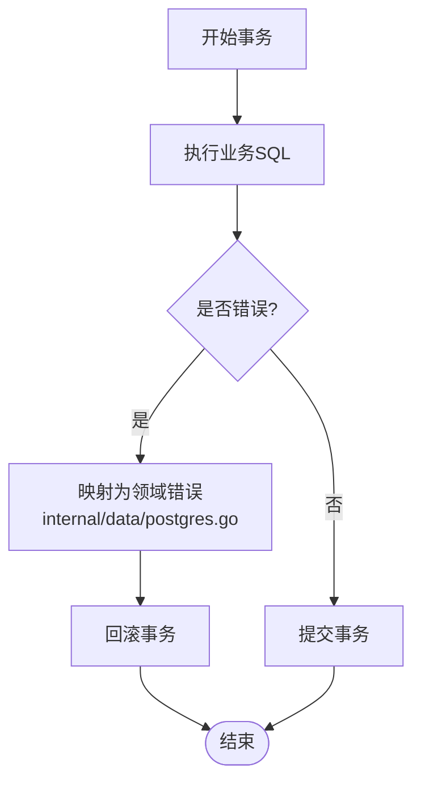
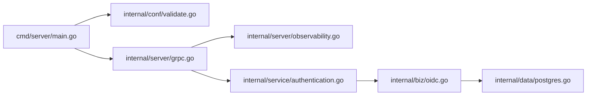

# 故障排查

<cite>
**本文引用的文件**
- [cmd/server/main.go](file://cmd/server/main.go)
- [internal/conf/validate.go](file://internal/conf/validate.go)
- [configs/config.yaml](file://configs/config.yaml)
- [internal/server/grpc.go](file://internal/server/grpc.go)
- [internal/server/observability.go](file://internal/server/observability.go)
- [internal/service/authentication.go](file://internal/service/authentication.go)
- [internal/biz/oidc.go](file://internal/biz/oidc.go)
- [internal/data/postgres.go](file://internal/data/postgres.go)
- [tests/integration/api_key_redis_control_test.go](file://tests/integration/api_key_redis_control_test.go)
</cite>

## 目录
1. [简介](#简介)
2. [项目结构](#项目结构)
3. [核心组件](#核心组件)
4. [架构总览](#架构总览)
5. [详细组件分析](#详细组件分析)
6. [依赖关系分析](#依赖关系分析)
7. [性能与可观测性](#性能与可观测性)
8. [故障排查指南](#故障排查指南)
9. [结论](#结论)
10. [附录：调试工具与命令](#附录：调试工具与命令)

## 简介
本指南面向ANI IAM系统的运维与研发人员，聚焦常见问题的诊断方法与解决步骤，覆盖认证失败、授权错误、数据库连接问题等典型场景；提供结构化日志查询、错误追踪与性能分析方法；并给出gRPC调试、数据库查询优化与内存泄漏检测的实操建议。文档基于代码库中的启动流程、配置校验、gRPC服务装配、可观测性中间件、认证与OIDC业务逻辑、PostgreSQL数据层以及集成测试中的异常路径进行系统化梳理。

## 项目结构
- 入口与运行时
  - 程序入口负责加载配置、初始化日志与运行时参数，并构建应用后启动服务。
  - 日志采用结构化JSON输出，内置敏感字段过滤，便于安全审计与问题定位。
- 配置与校验
  - 通过配置文件与环境变量加载，并在启动前执行严格的配置校验（网络、TLS、超时、DSN、Redis、OIDC等）。
- gRPC服务
  - 强制mTLS、禁用反射、设置超时，注册认证、授权与管理服务。
- 可观测性
  - 集成OpenTelemetry与Prometheus，暴露请求计数、延迟直方图、就绪探针等指标，并提供服务端中间件链。
- 业务与数据层
  - 认证与OIDC登录流程在业务层实现，数据访问通过PostgreSQL事务封装，统一映射底层错误为领域错误。
- 集成测试
  - 覆盖Redis限流、API Key使用聚合、通知外发、会话连续性等关键路径的异常与恢复行为。

**图示来源**
- [cmd/server/main.go:34-101](file://cmd/server/main.go#L34-L101)
- [internal/conf/validate.go:19-45](file://internal/conf/validate.go#L19-L45)
- [internal/server/grpc.go:14-50](file://internal/server/grpc.go#L14-L50)
- [internal/server/observability.go:41-171](file://internal/server/observability.go#L41-L171)
- [internal/service/authentication.go:150-193](file://internal/service/authentication.go#L150-L193)
- [internal/biz/oidc.go:663-742](file://internal/biz/oidc.go#L663-L742)
- [internal/data/postgres.go:27-59](file://internal/data/postgres.go#L27-L59)
- [configs/config.yaml:1-61](file://configs/config.yaml#L1-L61)

**章节来源**
- [cmd/server/main.go:34-101](file://cmd/server/main.go#L34-L101)
- [internal/conf/validate.go:19-45](file://internal/conf/validate.go#L19-L45)
- [configs/config.yaml:1-61](file://configs/config.yaml#L1-L61)

## 核心组件
- 启动与日志
  - 启动时创建结构化日志处理器，启用跟踪属性提取，并对敏感键进行过滤。
- 配置校验
  - 校验gRPC与Admin监听器地址、超时；强制mTLS证书与客户端CA；校验PostgreSQL DSN、Redis端点与命名空间；校验OIDC发行者与回调URL；校验策略修订哈希等。
- gRPC服务
  - 强制最小TLS版本与双向认证，禁用反射，设置超时，注册三大服务。
- 可观测性
  - 暴露Prometheus指标，注册Go与进程采集器，设置OTEL Tracer/Meter Provider，提供Recovery、Metadata、Tracing、Logging、Metrics、Validate中间件链。
- 认证与OIDC
  - 密码登录与刷新会话在Service层进行参数校验与错误映射；OIDC登录完成阶段进行身份、成员资格、租户状态检查，签发会话与令牌，记录审计事件。
- 数据层
  - 以Unit of Work模式管理事务，统一将PostgreSQL错误映射为领域错误（如冲突、权限不足、版本冲突等），确保上层错误语义清晰。

**章节来源**
- [cmd/server/main.go:104-131](file://cmd/server/main.go#L104-L131)
- [internal/conf/validate.go:19-168](file://internal/conf/validate.go#L19-L168)
- [internal/server/grpc.go:14-50](file://internal/server/grpc.go#L14-L50)
- [internal/server/observability.go:41-171](file://internal/server/observability.go#L41-L171)
- [internal/service/authentication.go:150-211](file://internal/service/authentication.go#L150-L211)
- [internal/biz/oidc.go:663-742](file://internal/biz/oidc.go#L663-L742)
- [internal/data/postgres.go:27-59](file://internal/data/postgres.go#L27-L59)
- [internal/data/postgres.go:195-231](file://internal/data/postgres.go#L195-L231)

## 架构总览
下图展示从请求进入gRPC到业务处理、数据访问与可观测性埋点的整体链路，突出错误与日志在各层的传播方式。

**图示来源**
- [internal/server/grpc.go:14-50](file://internal/server/grpc.go#L14-L50)
- [internal/server/observability.go:160-171](file://internal/server/observability.go#L160-L171)
- [internal/service/authentication.go:150-211](file://internal/service/authentication.go#L150-L211)
- [internal/biz/oidc.go:663-742](file://internal/biz/oidc.go#L663-L742)
- [internal/data/postgres.go:27-59](file://internal/data/postgres.go#L27-L59)

## 详细组件分析

### 启动与配置校验
- 启动流程
  - 解析命令行参数，加载配置文件与环境变量，扫描为Bootstrap配置，构建应用并运行。
  - 初始化结构化日志，设置服务标识与版本，开启最大CPU核数自动调整。
- 配置校验要点
  - gRPC与Admin监听器必须为TCP且端口明确，禁止重复绑定相同地址（除回环随机端口）。
  - gRPC mTLS要求证书、私钥、客户端CA均为绝对路径，并指定网关客户端DNS名称。
  - PostgreSQL DSN必须使用受限运行时角色与隔离数据库，非回环地址需verify-full与显式CA。
  - Redis必须为回环端点，包含命名空间与登录限制、窗口与读写超时。
  - OIDC发行者必须为规范HTTPS或隔离回环HTTP，回调URL必须规范HTTPS。
  - 策略修订必须以sha256前缀的完整哈希表示。

**图示来源**
- [cmd/server/main.go:34-101](file://cmd/server/main.go#L34-L101)
- [internal/conf/validate.go:19-168](file://internal/conf/validate.go#L19-L168)

**章节来源**
- [cmd/server/main.go:34-101](file://cmd/server/main.go#L34-L101)
- [internal/conf/validate.go:19-168](file://internal/conf/validate.go#L19-L168)
- [configs/config.yaml:1-61](file://configs/config.yaml#L1-L61)

### gRPC服务与中间件
- 服务装配
  - 强制mTLS与最小TLS版本，禁用反射，设置超时，注册认证、授权、管理服务。
- 中间件链
  - Recovery捕获异常；Metadata提取元信息；Tracing生成链路；Logging输出结构化日志；Metrics统计请求与耗时；Validate校验入参。
- 可观测性指标
  - 暴露ani_iam_runtime_ready、API Key相关指标、快照时间戳等，便于健康检查与容量规划。

**图示来源**
- [internal/server/observability.go:41-171](file://internal/server/observability.go#L41-L171)
- [internal/server/grpc.go:14-50](file://internal/server/grpc.go#L14-L50)

**章节来源**
- [internal/server/grpc.go:14-50](file://internal/server/grpc.go#L14-L50)
- [internal/server/observability.go:41-171](file://internal/server/observability.go#L41-L171)

### 认证与OIDC登录流程
- 密码登录
  - Service层校验请求参数（受众、边界、源IP），调用业务层执行登录，错误映射为带领域信息的gRPC状态。
- OIDC登录完成
  - 校验身份、主体状态、成员资格、租户访问与生命周期新鲜度；签发会话、授予、刷新令牌族与访问令牌；记录审计事件；提交事务。
- 错误映射
  - 业务层返回领域错误（如凭证无效、主体不活跃、成员资格不活跃、租户访问不活跃、生命周期阻塞/陈旧等），Service层将其转换为gRPC错误详情。

**图示来源**
- [internal/service/authentication.go:150-211](file://internal/service/authentication.go#L150-L211)
- [internal/biz/oidc.go:663-742](file://internal/biz/oidc.go#L663-L742)
- [internal/data/postgres.go:27-59](file://internal/data/postgres.go#L27-L59)

**章节来源**
- [internal/service/authentication.go:150-211](file://internal/service/authentication.go#L150-L211)
- [internal/biz/oidc.go:663-742](file://internal/biz/oidc.go#L663-L742)

### PostgreSQL数据层与错误映射
- Unit of Work
  - 以ReadCommitted隔离级别开启事务，失败时回滚，成功提交；封装成员与审计仓储。
- 错误映射
  - 将PostgreSQL错误码映射为领域错误：外键约束冲突、唯一约束冲突、空值/必填约束、并发版本冲突、权限拒绝等。
- 审计事件
  - 追加安全审计事件，携带调用者、主体、边界、动作、目标、结果、原因、请求/关联/决策ID、来源服务、发生与记录时间等。

**图示来源**
- [internal/data/postgres.go:27-59](file://internal/data/postgres.go#L27-L59)
- [internal/data/postgres.go:195-231](file://internal/data/postgres.go#L195-L231)

**章节来源**
- [internal/data/postgres.go:27-59](file://internal/data/postgres.go#L27-L59)
- [internal/data/postgres.go:195-231](file://internal/data/postgres.go#L195-L231)

## 依赖关系分析
- 组件耦合
  - 启动模块依赖配置校验；gRPC服务依赖可观测性中间件；认证服务依赖OIDC业务；业务层依赖数据层；数据层依赖PostgreSQL驱动与sqlcgen。
- 外部依赖
  - OpenTelemetry与Prometheus用于指标与链路追踪；Kratos框架提供gRPC传输与中间件；PostgreSQL与Redis作为持久化与缓存。
- 潜在循环依赖
  - 当前分层清晰，未发现直接循环依赖；业务与数据通过接口解耦。

**图示来源**
- [cmd/server/main.go:34-101](file://cmd/server/main.go#L34-L101)
- [internal/conf/validate.go:19-45](file://internal/conf/validate.go#L19-L45)
- [internal/server/grpc.go:14-50](file://internal/server/grpc.go#L14-L50)
- [internal/server/observability.go:41-171](file://internal/server/observability.go#L41-L171)
- [internal/service/authentication.go:150-211](file://internal/service/authentication.go#L150-L211)
- [internal/biz/oidc.go:663-742](file://internal/biz/oidc.go#L663-L742)
- [internal/data/postgres.go:27-59](file://internal/data/postgres.go#L27-L59)

**章节来源**
- [cmd/server/main.go:34-101](file://cmd/server/main.go#L34-L101)
- [internal/conf/validate.go:19-45](file://internal/conf/validate.go#L19-L45)
- [internal/server/grpc.go:14-50](file://internal/server/grpc.go#L14-L50)
- [internal/server/observability.go:41-171](file://internal/server/observability.go#L41-L171)
- [internal/service/authentication.go:150-211](file://internal/service/authentication.go#L150-L211)
- [internal/biz/oidc.go:663-742](file://internal/biz/oidc.go#L663-L742)
- [internal/data/postgres.go:27-59](file://internal/data/postgres.go#L27-L59)

## 性能与可观测性
- 指标与埋点
  - 请求计数与延迟直方图由Kratos OTEL中间件自动收集；就绪探针通过自定义指标暴露；API Key相关指标用于异常检测。
- 日志与追踪
  - 结构化日志包含服务标识、版本与跟踪属性；中间件链保证每请求的Trace ID与Span信息贯穿全链路。
- 监控建议
  - 关注ani_iam_runtime_ready为0时的告警；观察API Key未过期但长期未使用的数量；结合Prometheus与日志系统做根因分析。

**章节来源**
- [internal/server/observability.go:41-171](file://internal/server/observability.go#L41-L171)
- [cmd/server/main.go:104-131](file://cmd/server/main.go#L104-L131)

## 故障排查指南

### 常见问题与定位步骤

#### 1) 认证失败（密码登录/OIDC）
- 现象
  - 返回gRPC InvalidArgument或业务错误；OIDC回调后仍无法登录。
- 可能原因
  - 参数非法（受众、边界、源IP）；凭证无效；主体或成员资格不活跃；租户访问不活跃；生命周期陈旧或被阻止；OIDC发行者或回调URL配置不规范。
- 定位步骤
  - 查看gRPC错误详情中的reason与metadata字段，确认操作ID与凭据类型。
  - 检查日志中passwordLogin/refreshSession的错误上下文（租户ID、凭据种类、依赖）。
  - 核对配置中的OIDC发行者与回调URL是否为规范HTTPS；检查策略修订哈希是否正确。
  - 若为OIDC登录失败，检查身份、主体、成员资格、租户状态与生命周期新鲜度。
- 参考路径
  - [internal/service/authentication.go:150-211](file://internal/service/authentication.go#L150-L211)
  - [internal/biz/oidc.go:663-742](file://internal/biz/oidc.go#L663-L742)
  - [internal/conf/validate.go:275-329](file://internal/conf/validate.go#L275-L329)

#### 2) 授权错误
- 现象
  - 调用授权服务被拒绝；权限检查失败。
- 可能原因
  - 凭据无效或过期；策略修订不匹配；资源或操作未编目；租户边界不匹配。
- 定位步骤
  - 检查gRPC错误详情中的reason与domain；核对策略修订哈希是否与部署一致。
  - 查看审计事件是否记录了拒绝原因与目标资源。
  - 确认调用方的工作负载注册表与目标操作是否匹配。
- 参考路径
  - [internal/server/observability.go:160-171](file://internal/server/observability.go#L160-L171)
  - [internal/data/postgres.go:150-181](file://internal/data/postgres.go#L150-L181)

#### 3) 数据库连接问题（PostgreSQL）
- 现象
  - 启动时报错；请求超时；事务提交失败；出现并发冲突。
- 可能原因
  - DSN格式或角色不正确；非回环地址缺少verify-full与CA；连接池不可用；并发写导致版本冲突。
- 定位步骤
  - 检查配置中的PostgreSQL DSN、角色与数据库名；确认sslmode与CA文件。
  - 查看日志中的“begin/commit/rollback unit of work”错误上下文。
  - 根据错误码判断具体类型：外键冲突、唯一冲突、空值约束、版本冲突、权限拒绝。
- 参考路径
  - [internal/conf/validate.go:170-196](file://internal/conf/validate.go#L170-L196)
  - [internal/data/postgres.go:27-59](file://internal/data/postgres.go#L27-L59)
  - [internal/data/postgres.go:195-231](file://internal/data/postgres.go#L195-L231)

#### 4) Redis相关问题（限流/聚合）
- 现象
  - 登录限流失效或误报；API Key使用聚合堆积；Flush失败。
- 可能原因
  - Redis端点不可达；命名空间冲突；登录限制或窗口配置不当；后端PostgreSQL不可用导致队列积压。
- 定位步骤
  - 检查Redis地址、数据库编号、命名空间与超时配置。
  - 观察集成测试中的失败路径：当PostgreSQL不可用时，使用观察应排队；Flush应失败且待处理项不为零。
- 参考路径
  - [internal/conf/validate.go:198-222](file://internal/conf/validate.go#L198-L222)
  - [tests/integration/api_key_redis_control_test.go:139-187](file://tests/integration/api_key_redis_control_test.go#L139-L187)

### 日志分析方法
- 结构化日志查询
  - 使用服务标识、版本、请求ID、关联ID过滤；关注错误上下文中的operation_id、tenant_id、credential_kind、dependency。
  - 利用日志中的敏感字段过滤，避免泄露token、密码、DSN等。
- 错误追踪
  - 通过gRPC错误详情中的reason与metadata定位问题域；结合Trace ID在链路系统中检索完整调用链。
- 性能分析
  - 使用Prometheus指标观察请求计数与延迟直方图；结合Ready指标判断服务可用性；关注API Key相关指标异常。

**章节来源**
- [cmd/server/main.go:104-131](file://cmd/server/main.go#L104-L131)
- [internal/server/observability.go:41-171](file://internal/server/observability.go#L41-L171)
- [internal/service/authentication.go:720-761](file://internal/service/authentication.go#L720-L761)

### 调试工具与技巧
- gRPC调试
  - 使用支持mTLS的客户端（如grpcurl）连接gRPC端口；通过--cert/--key/--cacert指定证书；查看错误详情与元数据。
  - 借助OpenTelemetry导出器与链路系统（如Jaeger/Tempo）检索Trace ID，定位慢调用与失败节点。
- 数据库查询优化
  - 针对审计事件与查询热点，检查索引与分页参数；避免大事务与长事务；关注并发版本冲突导致的重试策略。
  - 使用EXPLAIN ANALYZE分析慢查询；结合PostgreSQL日志定位锁等待与死锁。
- 内存泄漏检测
  - 使用pprof对服务进行CPU/内存Profile采样；结合Prometheus指标观察内存增长趋势；定位长时间持有对象或连接未释放。
  - 关注goroutine泄漏与连接池未关闭的情况。

[本节为通用指导，不直接分析具体文件]

## 结论
ANI IAM系统在启动、配置、gRPC服务、可观测性、认证与数据层均具备完善的校验与错误映射机制。故障排查应优先从gRPC错误详情与结构化日志入手，结合OpenTelemetry链路追踪与Prometheus指标，逐步定位至业务与数据层的具体错误。对于数据库与Redis问题，依据配置校验规则与错误码快速缩小范围；对于认证与授权问题，重点检查凭据、策略修订与租户状态。通过标准化日志查询与调试工具，可高效定位并解决问题。

## 附录：调试工具与命令
- gRPC调试
  - 使用支持mTLS的客户端连接gRPC端口，查看错误详情与元数据。
  - 通过OpenTelemetry导出器与链路系统检索Trace ID，定位失败调用链。
- 数据库查询优化
  - 使用EXPLAIN ANALYZE分析慢查询；检查索引与分页；避免长事务与锁竞争。
- 内存泄漏检测
  - 使用pprof进行CPU/内存Profile；结合Prometheus指标观察内存趋势；定位goroutine与连接泄漏。

[本节为通用指导，不直接分析具体文件]