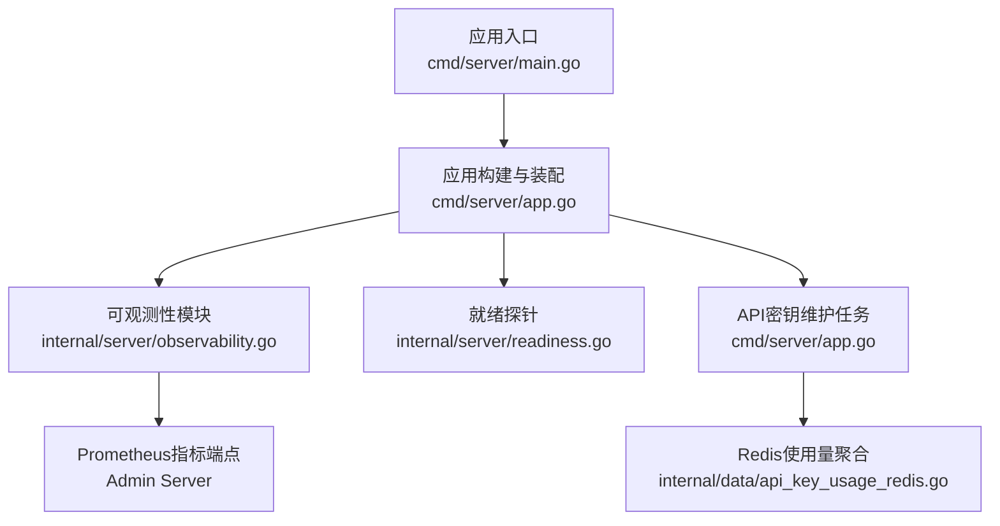
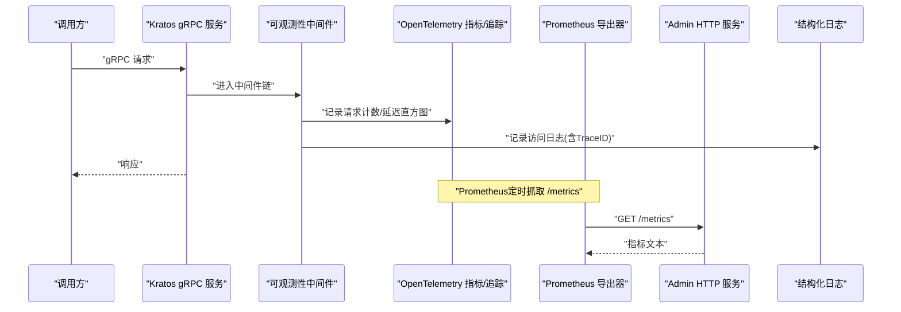
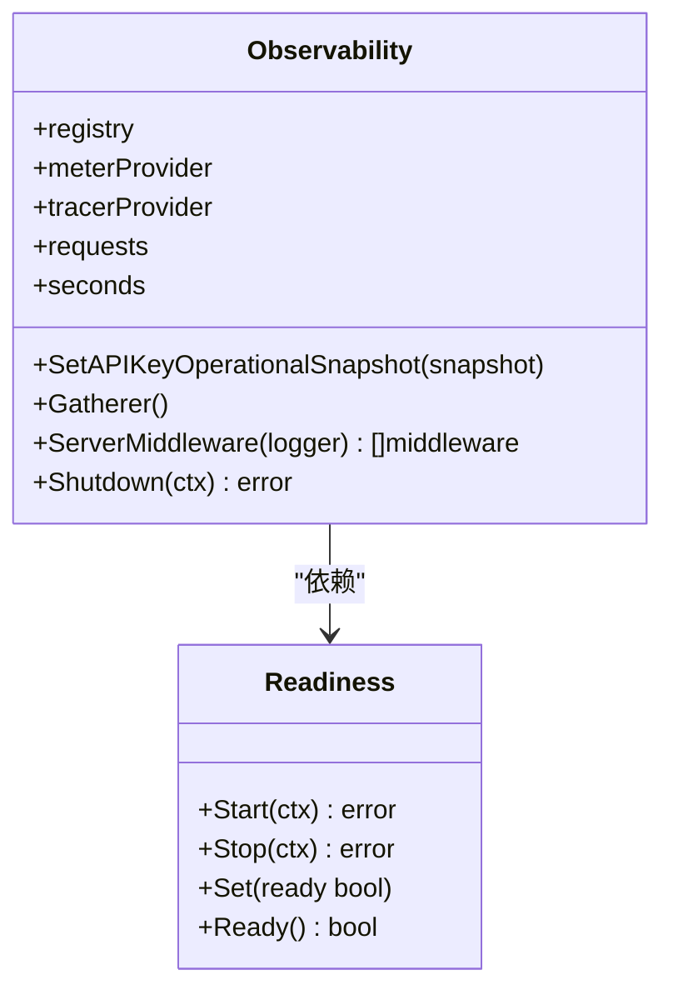
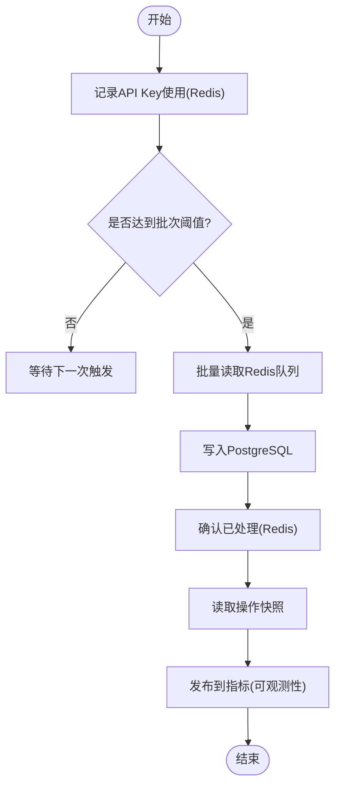
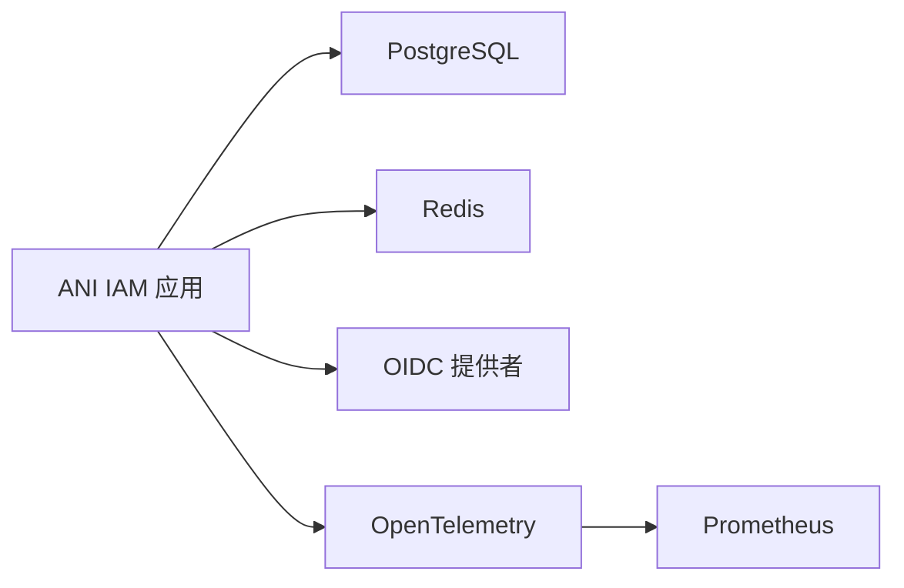

# 监控告警

<cite>
**本文引用的文件**
- [configs/config.yaml](file://configs/config.yaml)
- [cmd/server/main.go](file://cmd/server/main.go)
- [cmd/server/app.go](file://cmd/server/app.go)
- [internal/server/observability.go](file://internal/server/observability.go)
- [internal/server/readiness.go](file://internal/server/readiness.go)
- [internal/data/api_key_usage_redis.go](file://internal/data/api_key_usage_redis.go)
- [api/iam/v1/contract.pb.go](file://api/iam/v1/contract.pb.go)
</cite>

## 目录
1. [简介](#简介)
2. [项目结构](#项目结构)
3. [核心组件](#核心组件)
4. [架构总览](#架构总览)
5. [详细组件分析](#详细组件分析)
6. [依赖关系分析](#依赖关系分析)
7. [性能考虑](#性能考虑)
8. [故障排查指南](#故障排查指南)
9. [结论](#结论)
10. [附录](#附录)

## 简介
本指南面向ANI IAM系统的运维与SRE团队，聚焦于生产可用的监控与告警配置。内容覆盖：
- OpenTelemetry指标采集与Prometheus集成
- 日志收集与脱敏策略
- 关键指标定义与含义（请求计数、延迟直方图、服务就绪、API密钥状态等）
- Prometheus告警规则示例（服务就绪、API密钥异常、性能阈值）
- 监控面板建议与最佳实践

目标是帮助你在不侵入业务代码的前提下，快速搭建可观测性体系并实现稳定可靠的告警。

## 项目结构
ANI IAM的可观测性由应用启动链路统一装配：
- 应用入口负责加载配置、初始化日志、构建Kratos应用并挂载中间件
- 可观测性模块集中管理OpenTelemetry与Prometheus导出器、自定义指标与服务器中间件
- 就绪探针与后台维护任务为指标提供数据源

图表来源
- [cmd/server/main.go:34-102](file://cmd/server/main.go#L34-L102)
- [cmd/server/app.go:369-744](file://cmd/server/app.go#L369-L744)
- [internal/server/observability.go:41-143](file://internal/server/observability.go#L41-L143)
- [internal/server/readiness.go:17-74](file://internal/server/readiness.go#L17-L74)
- [internal/data/api_key_usage_redis.go:26-123](file://internal/data/api_key_usage_redis.go#L26-L123)

章节来源
- [cmd/server/main.go:34-102](file://cmd/server/main.go#L34-L102)
- [cmd/server/app.go:369-744](file://cmd/server/app.go#L369-L744)

## 核心组件
- 可观测性模块
  - 创建Prometheus Registry并注册Go与进程指标
  - 通过OpenTelemetry Prometheus导出器将OTel指标暴露给Prometheus
  - 注入Kratos gRPC中间件，自动采集请求计数与延迟直方图
  - 注册自定义指标：服务就绪、API密钥异常计数、快照时间戳
- 就绪探针
  - 周期性检查依赖（PostgreSQL、Redis、可选Core运行时）
  - 对外暴露ani_iam_runtime_ready指标用于健康探测与告警
- API密钥维护任务
  - 定期从Redis聚合API密钥使用记录并落库
  - 读取操作快照并写入到可观测性模块，供指标消费
- 日志系统
  - JSON格式结构化日志，默认Info级别
  - 内置敏感字段过滤（密码、令牌、DSN等）
  - 自动附加Trace上下文属性，便于链路追踪关联

章节来源
- [internal/server/observability.go:41-172](file://internal/server/observability.go#L41-L172)
- [internal/server/readiness.go:17-74](file://internal/server/readiness.go#L17-L74)
- [cmd/server/app.go:691-744](file://cmd/server/app.go#L691-L744)
- [cmd/server/main.go:104-131](file://cmd/server/main.go#L104-L131)

## 架构总览
下图展示了从请求进入gRPC服务到指标采集、日志输出与外部Prometheus拉取的完整链路。

图表来源
- [internal/server/observability.go:160-172](file://internal/server/observability.go#L160-L172)
- [cmd/server/app.go:730-744](file://cmd/server/app.go#L730-L744)
- [cmd/server/main.go:104-131](file://cmd/server/main.go#L104-L131)

## 详细组件分析

### 可观测性模块（OpenTelemetry + Prometheus）
- 指标采集
  - 请求计数：基于Kratos默认计数器，按服务端方法维度统计
  - 延迟直方图：基于Kratos默认直方图，记录gRPC处理耗时分布
  - 服务就绪：自定义Gauge，值为1表示服务已就绪且依赖正常
  - API密钥相关：
    - ani_iam_api_key_stale_non_expiring_count：长期未使用的非过期API Key数量
    - ani_iam_tenant_workload_unusual_active_api_keys_count：租户工作负载活跃API Key数异常的数量
    - ani_iam_api_key_operational_snapshot_timestamp_seconds：最近一次成功快照的Unix时间戳
- 追踪与日志
  - 启用TracerProvider与TextMapPropagator，支持跨进程追踪传播
  - 日志处理器开启JSON格式、敏感键过滤、Trace属性提取
- 生命周期
  - Shutdown时关闭MeterProvider与TracerProvider，确保指标与追踪数据完整落盘

图表来源
- [internal/server/observability.go:30-172](file://internal/server/observability.go#L30-L172)
- [internal/server/readiness.go:9-74](file://internal/server/readiness.go#L9-L74)

章节来源
- [internal/server/observability.go:41-172](file://internal/server/observability.go#L41-L172)
- [internal/server/readiness.go:17-74](file://internal/server/readiness.go#L17-L74)

### API密钥使用聚合与快照
- 使用聚合
  - 通过Redis有序集合暂存API Key使用事件，避免对数据库造成瞬时压力
  - 批量Flush至PostgreSQL，失败则保留在Redis等待重试
- 快照计算
  - 后台任务定期读取“操作快照”，包含：
    - 长期未使用的非过期API Key数量
    - 活跃API Key数异常的租户工作负载数量
    - 观察时间戳
  - 快照值写入Observability，作为自定义指标对外暴露

图表来源
- [internal/data/api_key_usage_redis.go:33-123](file://internal/data/api_key_usage_redis.go#L33-L123)
- [cmd/server/app.go:120-167](file://cmd/server/app.go#L120-L167)
- [internal/server/observability.go:146-153](file://internal/server/observability.go#L146-L153)

章节来源
- [internal/data/api_key_usage_redis.go:26-123](file://internal/data/api_key_usage_redis.go#L26-L123)
- [cmd/server/app.go:120-167](file://cmd/server/app.go#L120-L167)
- [internal/server/observability.go:146-153](file://internal/server/observability.go#L146-L153)

### 日志收集与脱敏
- 日志格式：JSON
- 默认级别：Info
- 敏感字段过滤：password、token、dsn、private_key_file、redis.password等
- Trace上下文：自动附加trace_id等属性，便于与追踪系统联动
- 建议：
  - 将stdout接入集中式日志平台（如ELK/Loki）
  - 结合Trace ID进行跨系统问题定位

章节来源
- [cmd/server/main.go:104-131](file://cmd/server/main.go#L104-L131)

## 依赖关系分析
- 运行时依赖
  - PostgreSQL：存储认证、授权、会话、审计等核心数据
  - Redis：登录限流、OIDC操作存储、API Key使用聚合、创建限流
  - OIDC提供者：Dex等外部身份提供方
- 可观测性依赖
  - OpenTelemetry SDK：指标与追踪
  - Kratos中间件：自动埋点
  - Prometheus：指标抓取

图表来源
- [cmd/server/app.go:412-443](file://cmd/server/app.go#L412-L443)
- [internal/server/observability.go:46-74](file://internal/server/observability.go#L46-L74)

章节来源
- [cmd/server/app.go:412-443](file://cmd/server/app.go#L412-L443)
- [internal/server/observability.go:46-74](file://internal/server/observability.go#L46-L74)

## 性能考虑
- 指标采集开销
  - 使用Kratos默认中间件，开销低且标准化
  - 直方图桶建议保持默认，避免过度细分导致内存压力
- 日志吞吐
  - JSON格式更利于解析，但会增加体积；建议在边缘层压缩或采样
- API Key使用聚合
  - Redis批处理降低DB写入峰值；合理设置BatchSize与Flush间隔
- 就绪探针
  - 周期检查避免频繁IO；超时与重试需与基础设施能力匹配

[本节为通用指导，无需特定文件引用]

## 故障排查指南
- 服务不可用
  - 检查ani_iam_runtime_ready是否为0；若为0，查看Readiness依赖检查错误（PG/Redis/Core）
- API Key异常
  - 关注ani_iam_api_key_stale_non_expiring_count与ani_iam_tenant_workload_unusual_active_api_keys_count突增
  - 检查ani_iam_api_key_operational_snapshot_timestamp_seconds是否长时间未更新
- 高延迟
  - 查看Kratos延迟直方图分位（p50/p90/p99），结合Trace定位慢调用
- 日志缺失或无Trace
  - 确认日志处理器已启用Trace属性提取；检查上游网关是否传递了TraceContext

章节来源
- [internal/server/readiness.go:27-74](file://internal/server/readiness.go#L27-L74)
- [internal/server/observability.go:92-135](file://internal/server/observability.go#L92-L135)
- [cmd/server/main.go:104-131](file://cmd/server/main.go#L104-L131)

## 结论
通过OpenTelemetry与Kratos中间件的组合，ANI IAM提供了标准化的请求计数与延迟直方图，并通过自定义指标暴露服务就绪与API密钥运行态。配合结构化日志与Prometheus告警，可实现端到端的可观测性与稳定性保障。建议在生产环境持续优化指标粒度、日志采样与告警阈值，确保在高并发场景下的可维护性。

[本节为总结性内容，无需特定文件引用]

## 附录

### 关键指标清单与含义
- 标准指标
  - 请求计数：gRPC服务端请求总数（按方法维度）
  - 延迟直方图：gRPC服务端处理耗时分布
- 自定义指标
  - ani_iam_runtime_ready：服务是否就绪（1=就绪，0=未就绪）
  - ani_iam_api_key_stale_non_expiring_count：长期未使用的非过期API Key数量
  - ani_iam_tenant_workload_unusual_active_api_keys_count：活跃API Key数异常的租户工作负载数量
  - ani_iam_api_key_operational_snapshot_timestamp_seconds：最近一次成功快照的时间戳（秒）

章节来源
- [internal/server/observability.go:92-135](file://internal/server/observability.go#L92-L135)

### Prometheus告警规则示例
- 服务就绪告警
  - 条件：ani_iam_runtime_ready == 0 持续5分钟
  - 严重级别：Critical
  - 说明：服务未就绪或依赖不可用
- API密钥异常告警
  - 条件：ani_iam_api_key_stale_non_expiring_count > 0 持续10分钟
  - 严重级别：Warning
  - 说明：存在长期未使用的非过期API Key，可能存在安全风险
- 快照停滞告警
  - 条件：当前时间 - ani_iam_api_key_operational_snapshot_timestamp_seconds > 15分钟
  - 严重级别：Critical
  - 说明：API Key操作快照未更新，可能影响风险检测
- 性能阈值告警
  - 条件：gRPC延迟直方图p99超过阈值（例如2s）持续5分钟
  - 严重级别：Warning/Critical
  - 说明：服务响应变慢，需排查瓶颈

[本节为概念性规则，无需特定文件引用]

### 监控面板建议
- 概览页
  - 服务就绪：ani_iam_runtime_ready
  - 流量：请求计数（按方法分组）
  - 延迟：直方图分位（p50/p90/p99）
- 安全页
  - API Key异常：stale/non-expiring计数、异常租户工作负载计数
  - 快照时间戳：最新快照时间
- 资源页
  - Go运行时：goroutines、内存、GC
  - 进程：CPU、内存、文件句柄
- 日志页
  - 结合Trace ID检索相关日志
  - 过滤敏感字段后的错误日志

[本节为概念性建议，无需特定文件引用]

### 配置要点与环境变量
- 配置文件路径
  - 通过命令行参数指定配置目录（默认configs）
- 环境变量前缀
  - KRATOS_* 覆盖配置项
- 关键运行时配置
  - PostgreSQL DSN、连接池
  - Redis地址、命名空间、超时
  - OIDC提供者URL、客户端ID与密钥文件
  - 通知服务地址与证书

章节来源
- [cmd/server/main.go:30-32](file://cmd/server/main.go#L30-L32)
- [cmd/server/main.go:82-95](file://cmd/server/main.go#L82-L95)
- [configs/config.yaml:1-61](file://configs/config.yaml#L1-L61)

### API密钥状态参考
- 状态枚举
  - 未指定、活跃、已撤销、已过期
- 建议
  - 结合告警与审计日志，及时清理长期未使用的活跃Key
  - 对非过期Key加强监控与轮换策略

章节来源
- [api/iam/v1/contract.pb.go:507-558](file://api/iam/v1/contract.pb.go#L507-L558)