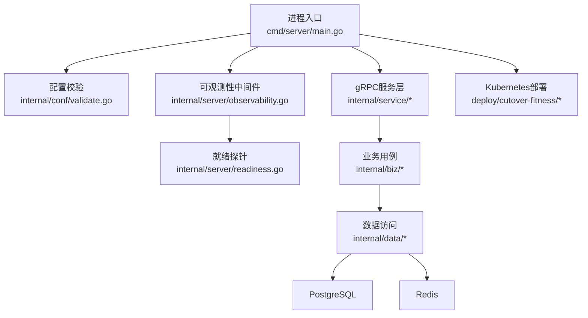
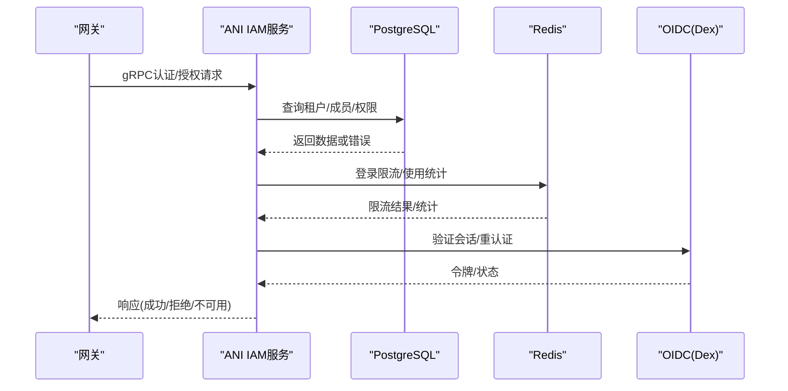
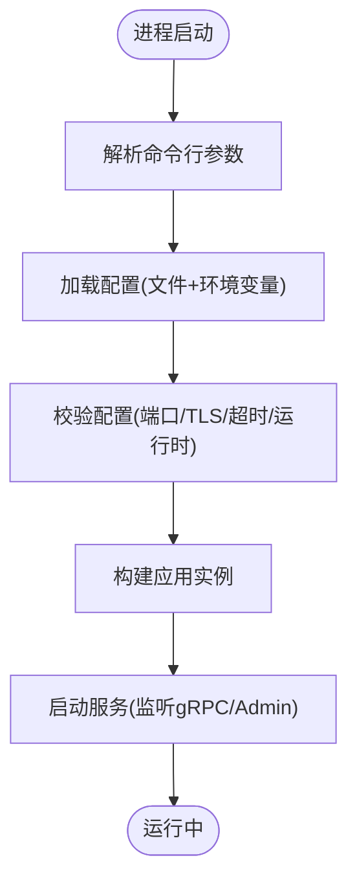
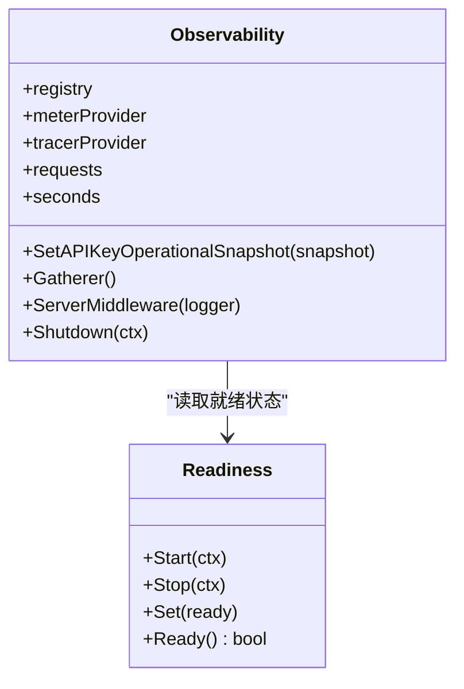
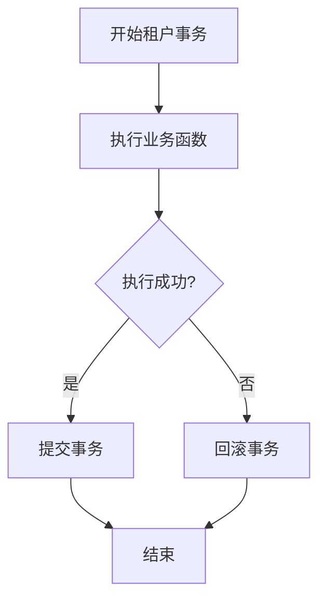
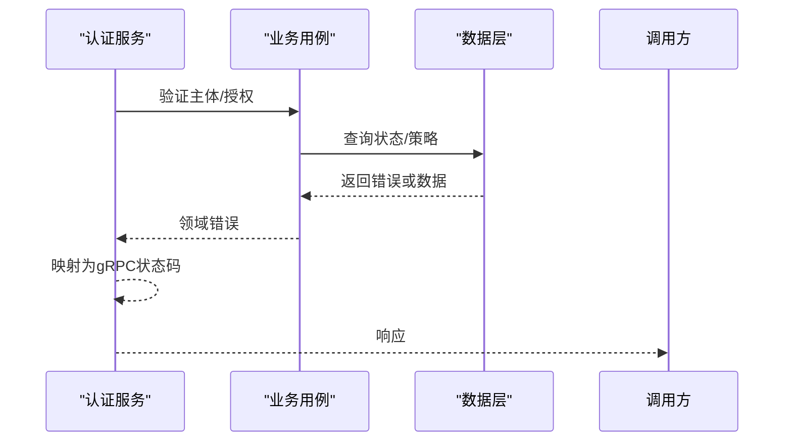
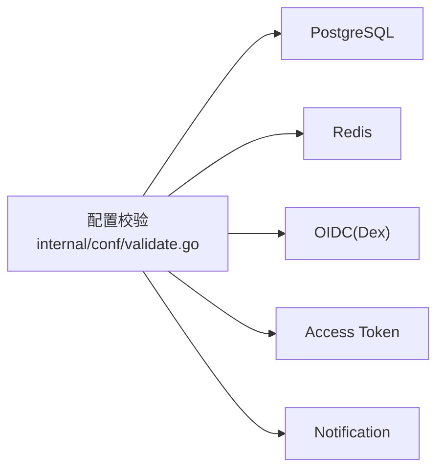

# 运维手册

<cite>
**本文引用的文件**
- [configs/config.yaml](file://configs/config.yaml)
- [cmd/server/main.go](file://cmd/server/main.go)
- [internal/conf/validate.go](file://internal/conf/validate.go)
- [internal/server/observability.go](file://internal/server/observability.go)
- [internal/server/readiness.go](file://internal/server/readiness.go)
- [internal/data/postgres.go](file://internal/data/postgres.go)
- [internal/service/authentication.go](file://internal/service/authentication.go)
- [atlas.hcl](file://atlas.hcl)
- [deploy/cutover-fitness/30-runtime.yaml](file://deploy/cutover-fitness/30-runtime.yaml)
- [deploy/cutover-fitness/10-storage.yaml.tmpl](file://deploy/cutover-fitness/10-storage.yaml.tmpl)
</cite>

## 目录
1. [简介](#简介)
2. [项目结构](#项目结构)
3. [核心组件](#核心组件)
4. [架构总览](#架构总览)
5. [详细组件分析](#详细组件分析)
6. [依赖关系分析](#依赖关系分析)
7. [性能与容量规划](#性能与容量规划)
8. [故障排查指南](#故障排查指南)
9. [备份、恢复与灾难恢复](#备份恢复与灾难恢复)
10. [安全加固与合规检查](#安全加固与合规检查)
11. [升级维护与版本管理](#升级维护与版本管理)
12. [结论](#结论)

## 简介
本手册面向ANI IAM系统的运维团队，提供系统监控指标、日志收集与告警配置、故障排查流程、备份恢复策略、数据迁移与灾难恢复计划、性能调优与容量规划、安全加固与合规检查、以及升级维护与回滚策略的完整指导。文档基于仓库中的实际代码与部署清单进行说明，确保可操作性与可追溯性。

## 项目结构
ANI IAM采用分层架构：入口进程负责启动、配置加载与运行时初始化；服务层暴露gRPC接口；业务逻辑位于biz层；数据访问通过data层封装PostgreSQL与Redis等依赖；可观测性由server层的Observability模块统一提供；部署以Kubernetes清单为主，包含运行态与目标环境的隔离部署。

**图示来源**
- [cmd/server/main.go:34-101](file://cmd/server/main.go#L34-L101)
- [internal/conf/validate.go:19-45](file://internal/conf/validate.go#L19-L45)
- [internal/server/observability.go:41-143](file://internal/server/observability.go#L41-L143)
- [internal/server/readiness.go:27-74](file://internal/server/readiness.go#L27-L74)
- [deploy/cutover-fitness/30-runtime.yaml:238-249](file://deploy/cutover-fitness/30-runtime.yaml#L238-L249)

**章节来源**
- [cmd/server/main.go:34-101](file://cmd/server/main.go#L34-L101)
- [internal/conf/validate.go:19-45](file://internal/conf/validate.go#L19-L45)
- [internal/server/observability.go:41-143](file://internal/server/observability.go#L41-L143)
- [internal/server/readiness.go:27-74](file://internal/server/readiness.go#L27-L74)
- [deploy/cutover-fitness/30-runtime.yaml:238-249](file://deploy/cutover-fitness/30-runtime.yaml#L238-L249)

## 核心组件
- 进程入口与配置加载：主进程解析命令行参数、加载配置文件与环境变量、设置日志处理器并构建应用。
- 配置校验：对gRPC/TLS、Admin监听器、关闭超时、运行时（PostgreSQL、Redis、Access Token、Notification、OIDC）进行严格校验。
- 可观测性：集成OpenTelemetry与Prometheus，注册Go与进程采集器，导出请求计数与时延直方图，提供就绪状态仪表。
- 就绪探针：周期性探测依赖健康状态，聚合为服务就绪信号。
- 数据访问：封装事务单元、成员关系与安全审计事件写入，映射PostgreSQL错误到领域错误。
- 认证授权服务：将领域错误映射为gRPC状态码，便于上层网关与调用方处理。

**章节来源**
- [cmd/server/main.go:34-101](file://cmd/server/main.go#L34-L101)
- [internal/conf/validate.go:19-167](file://internal/conf/validate.go#L19-L167)
- [internal/server/observability.go:41-143](file://internal/server/observability.go#L41-L143)
- [internal/server/readiness.go:27-74](file://internal/server/readiness.go#L27-L74)
- [internal/data/postgres.go:27-59](file://internal/data/postgres.go#L27-L59)
- [internal/service/authentication.go:645-683](file://internal/service/authentication.go#L645-L683)

## 架构总览
ANI IAM在Kubernetes中以双通道（current/target）方式部署，IAM服务通过gRPC对外提供服务，前置网关进行鉴权与路由。PostgreSQL用于持久化，Redis用于限流与缓存，OIDC（Dex）用于身份认证。

**图示来源**
- [deploy/cutover-fitness/30-runtime.yaml:238-286](file://deploy/cutover-fitness/30-runtime.yaml#L238-L286)
- [configs/config.yaml:22-60](file://configs/config.yaml#L22-L60)
- [internal/server/observability.go:160-171](file://internal/server/observability.go#L160-L171)

## 详细组件分析

### 配置与启动流程
- 启动阶段：解析conf路径，加载配置源（文件与环境），扫描为Bootstrap结构，构建应用并运行。
- 日志：JSON格式输出，过滤敏感字段，附加服务标识与追踪属性。
- 运行时CPU配额：自动设置maxprocs并记录日志。

**图示来源**
- [cmd/server/main.go:34-101](file://cmd/server/main.go#L34-L101)
- [internal/conf/validate.go:19-45](file://internal/conf/validate.go#L19-L45)

**章节来源**
- [cmd/server/main.go:34-101](file://cmd/server/main.go#L34-L101)
- [internal/conf/validate.go:19-45](file://internal/conf/validate.go#L19-L45)

### 可观测性与监控指标
- Prometheus指标：
  - ani_iam_runtime_ready：服务就绪状态（0/1）。
  - ani_iam_api_key_stale_non_expiring_count：长期未使用的非过期API Key数量。
  - ani_iam_tenant_workload_unusual_active_api_keys_count：异常活跃API Key数量的租户数。
  - ani_iam_api_key_operational_snapshot_timestamp_seconds：最近一次API Key快照时间戳。
- OpenTelemetry：
  - 请求计数与延迟直方图（Kratos默认名称）。
  - 文本传播（TraceContext + Baggage）。
- 中间件链：recovery、metadata、tracing、logging、metrics、validate。

**图示来源**
- [internal/server/observability.go:30-143](file://internal/server/observability.go#L30-L143)
- [internal/server/readiness.go:9-74](file://internal/server/readiness.go#L9-L74)

**章节来源**
- [internal/server/observability.go:41-171](file://internal/server/observability.go#L41-L171)
- [internal/server/readiness.go:27-74](file://internal/server/readiness.go#L27-L74)

### 数据库事务与错误映射
- 事务单元：WithinTenant开启ReadCommitted事务，失败时回滚，成功提交。
- 错误映射：将PostgreSQL错误码映射为领域错误（如版本冲突、权限不足、唯一约束冲突等）。
- 审计事件：Append安全审计事件，携带调用者、目标、决策ID等信息。

**图示来源**
- [internal/data/postgres.go:27-59](file://internal/data/postgres.go#L27-L59)
- [internal/data/postgres.go:195-231](file://internal/data/postgres.go#L195-L231)

**章节来源**
- [internal/data/postgres.go:27-59](file://internal/data/postgres.go#L27-L59)
- [internal/data/postgres.go:195-231](file://internal/data/postgres.go#L195-L231)

### 认证与授权错误处理
- 将领域错误映射为gRPC状态码：
  - 策略不匹配：Unavailable。
  - 租户生命周期陈旧：Unavailable。
  - 主体/成员/租户访问非活动：PermissionDenied。
  - 依赖不可用（认证/授权/OIDC/持久化）：Unavailable。

**图示来源**
- [internal/service/authentication.go:645-683](file://internal/service/authentication.go#L645-L683)

**章节来源**
- [internal/service/authentication.go:645-683](file://internal/service/authentication.go#L645-L683)

## 依赖关系分析
- 外部依赖：
  - PostgreSQL：必须使用受限运行时角色与隔离数据库，非环回地址需verify-full与CA证书。
  - Redis：环回地址、命名空间、登录限制与窗口、连接读写超时。
  - OIDC（Dex）：提供者固定为dex，客户端ID固定，重定向URI必须HTTPS且规范。
  - Access Token：签发者为ani-iam，必须指定活动密钥ID与私钥文件。
  - Notification：明确端点、证书、出站键文件、服务器DNS名、本地化与调度间隔。
- 配置校验覆盖所有关键依赖，防止不安全或不兼容配置进入生产。

**图示来源**
- [internal/conf/validate.go:106-167](file://internal/conf/validate.go#L106-L167)
- [configs/config.yaml:22-60](file://configs/config.yaml#L22-L60)

**章节来源**
- [internal/conf/validate.go:106-167](file://internal/conf/validate.go#L106-L167)
- [configs/config.yaml:22-60](file://configs/config.yaml#L22-L60)

## 性能与容量规划
- 指标采集：
  - 请求计数与延迟直方图用于评估吞吐与P95/P99延迟。
  - 就绪状态用于负载均衡与健康检查。
  - API Key相关指标用于识别闲置与异常活跃情况。
- 资源建议：
  - 根据CPU配额自动调整goroutine数量，避免过度竞争。
  - 合理设置gRPC与Admin超时，避免长尾阻塞。
  - Redis连接与读写超时控制在秒级，降低拥塞风险。
- 扩展策略：
  - 无状态服务水平扩展，配合网关与负载均衡。
  - 数据库与Redis按负载垂直扩容或引入集群模式。
  - 监控指标接入Prometheus/Grafana，建立容量阈值告警。

[本节为通用指导，无需特定文件引用]

## 故障排查指南
- 启动失败：
  - 检查配置校验错误（端口冲突、TLS文件路径、超时范围、运行时必需项）。
  - 确认环境变量与配置文件路径正确。
- 服务不可用：
  - 查看就绪探针与依赖健康状态。
  - 检查PostgreSQL/Redis/OIDC连通性与权限。
- 认证失败：
  - 关注gRPC状态码与错误详情（策略不匹配、依赖不可用、权限拒绝）。
  - 核对OIDC重定向URI与客户端密钥文件。
- 数据写入失败：
  - 检查事务回滚与错误映射（版本冲突、权限不足、唯一约束冲突）。
  - 查看审计事件是否成功追加。

**章节来源**
- [internal/conf/validate.go:19-167](file://internal/conf/validate.go#L19-L167)
- [internal/server/readiness.go:27-74](file://internal/server/readiness.go#L27-L74)
- [internal/service/authentication.go:645-683](file://internal/service/authentication.go#L645-L683)
- [internal/data/postgres.go:195-231](file://internal/data/postgres.go#L195-L231)

## 备份、恢复与灾难恢复
- 数据库备份：
  - 使用PostgreSQL原生工具（如pg_dump/pg_basebackup）定期备份隔离数据库。
  - 结合Kubernetes PVC快照实现一致性备份。
- 配置与密钥：
  - 将TLS证书、OIDC密钥、Access Token私钥等保存在Secret中，定期轮换。
  - 配置文件与迁移脚本纳入版本控制。
- 迁移管理：
  - 使用Atlas进行迁移管理，环境URL从环境变量注入，迁移目录指向migrations。
- 灾难恢复：
  - 制定RTO/RPO目标，演练恢复流程。
  - 双通道部署支持灰度切换与回滚。

**章节来源**
- [atlas.hcl:1-8](file://atlas.hcl#L1-L8)
- [deploy/cutover-fitness/30-runtime.yaml:238-249](file://deploy/cutover-fitness/30-runtime.yaml#L238-L249)
- [deploy/cutover-fitness/10-storage.yaml.tmpl:1-96](file://deploy/cutover-fitness/10-storage.yaml.tmpl#L1-L96)

## 安全加固与合规检查
- 传输安全：
  - gRPC启用双向TLS，强制绝对路径证书与客户端CA。
  - 非环回PostgreSQL要求verify-full与显式CA文件。
- 身份与访问：
  - OIDC提供者固定为dex，客户端ID固定，重定向URI必须HTTPS且规范。
  - Access Token签发者固定为ani-iam，活动密钥ID必填。
- 配置校验：
  - 严格校验网络、地址、超时、命名空间、本地化等，防止误配。
- 合规检查：
  - 定期扫描配置与镜像漏洞。
  - 审计日志与决策ID用于可追溯性。

**章节来源**
- [internal/conf/validate.go:47-65](file://internal/conf/validate.go#L47-L65)
- [internal/conf/validate.go:170-196](file://internal/conf/validate.go#L170-L196)
- [internal/conf/validate.go:275-329](file://internal/conf/validate.go#L275-L329)
- [internal/conf/validate.go:224-235](file://internal/conf/validate.go#L224-L235)

## 升级维护与版本管理
- 版本信息：
  - 二进制名称与版本在构建时注入，日志中附带服务标识与版本。
- 滚动更新：
  - Kubernetes Deployment使用Recreate策略，确保单副本逐步替换。
  - 就绪探针确保新Pod完全就绪后再切流量。
- 回滚策略：
  - 保留旧镜像标签与配置，快速回滚至稳定版本。
  - 数据库迁移前进行备份与预检。
- 版本管理：
  - 迁移脚本按时间戳命名，使用Atlas统一管理。
  - 策略修订以sha256摘要形式锁定，确保一致性。

**章节来源**
- [cmd/server/main.go:22-28](file://cmd/server/main.go#L22-L28)
- [deploy/cutover-fitness/30-runtime.yaml:11-15](file://deploy/cutover-fitness/30-runtime.yaml#L11-L15)
- [deploy/cutover-fitness/30-runtime.yaml:238-249](file://deploy/cutover-fitness/30-runtime.yaml#L238-L249)
- [atlas.hcl:1-8](file://atlas.hcl#L1-L8)
- [configs/config.yaml:60-60](file://configs/config.yaml#L60-L60)

## 结论
本手册基于ANI IAM的实际代码与部署清单，提供了从监控、日志、告警到故障排查、备份恢复、安全加固、升级回滚的全方位运维指导。建议结合Prometheus/Grafana与日志平台建立完善的可观测体系，并通过自动化测试与演练保障系统稳定性与安全性。