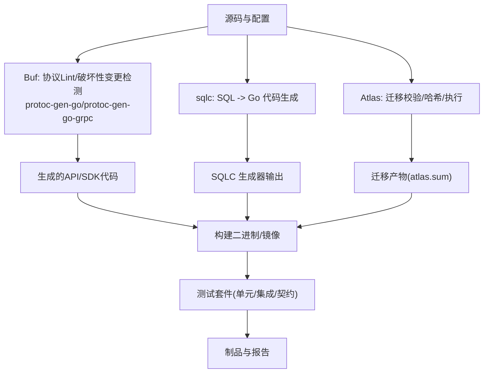
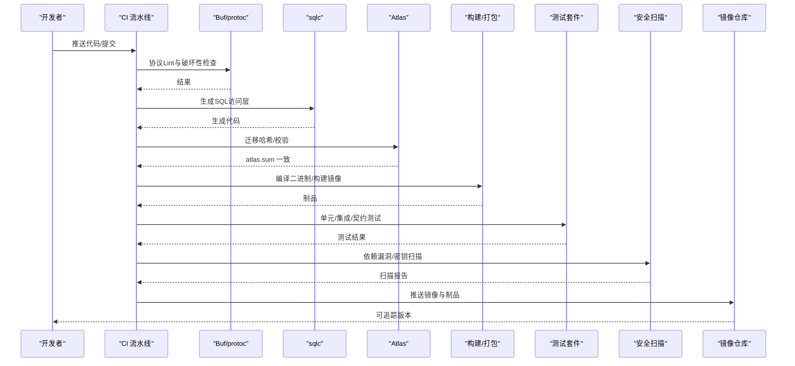

# CI/CD流水线

<cite>
**本文引用的文件**
- [go.mod](file://go.mod)
- [atlas.hcl](file://atlas.hcl)
- [sqlc.yaml](file://sqlc.yaml)
- [configs/config.yaml](file://configs/config.yaml)
- [api/iam/v1/buf.yaml](file://api/iam/v1/buf.yaml)
- [api/iam/v1/buf.gen.yaml](file://api/iam/v1/buf.gen.yaml)
- [tests/contracts/contract_pins.json](file://tests/contracts/contract_pins.json)
- [internal/conf/validate.go](file://internal/conf/validate.go)
- [internal/service/authentication.go](file://internal/service/authentication.go)
- [tools/wr22/generate-roles.sh](file://tools/wr22/generate-roles.sh)
- [tools/wr23-resume/generation.py](file://tools/wr23-resume/generation.py)
- [tools/cutover-fitness/cf01.py](file://tools/cutover-fitness/cf01.py)
- [tests/integration/workload_bootstrap_test.go](file://tests/integration/workload_bootstrap_test.go)
- [tests/integration/api_key_redis_control_test.go](file://tests/integration/api_key_redis_control_test.go)
- [tests/integration/wr22_platform_audit_test.go](file://tests/integration/wr22_platform_audit_test.go)
- [tests/integration/core_dlq_formal_test.go](file://tests/integration/core_dlq_formal_test.go)
</cite>

## 目录
1. [简介](#简介)
2. [项目结构](#项目结构)
3. [核心组件](#核心组件)
4. [架构总览](#架构总览)
5. [详细组件分析](#详细组件分析)
6. [依赖分析](#依赖分析)
7. [性能考虑](#性能考虑)
8. [故障排查指南](#故障排查指南)
9. [结论](#结论)
10. [附录](#附录)

## 简介
本指南面向 ANI IAM 的持续集成与持续交付（CI/CD）流水线，覆盖代码构建、测试、镜像发布、静态检查与安全扫描、数据库迁移自动化、API 契约测试与集成测试策略、多环境部署、蓝绿/灰度发布、版本标签管理、回滚策略与发布审批流程，以及构建缓存优化、并行测试执行与制品管理。文档基于仓库现有配置与脚本进行说明，确保可落地、可审计、可重复。

## 项目结构
ANI IAM 采用分层与领域驱动的组织方式：
- API 契约与代码生成：位于 api/iam/v1，使用 Buf 进行 lint、breaking 检测与 gRPC/Protobuf 代码生成。
- 数据层与 SQL 代码生成：使用 sqlc 将 internal/data/queries 下的 SQL 生成 Go 类型与接口，输出到 internal/data/sqlcgen。
- 迁移管理：migrations 目录存放按时间戳命名的 SQL 迁移文件，使用 Atlas 进行迁移校验、哈希与执行。
- 运行时配置：configs/config.yaml 提供隔离工作负载运行所需的服务器、PostgreSQL、Redis、OIDC、通知等配置。
- 测试：单元测试与集成测试分离，集成测试通过 build tag 控制；契约测试在 tests/contracts 下以固定 pin 的方式锁定外部依赖与产物摘要。
- 工具与演练：tools 目录下包含 wrXX 系列演练脚本、cutover-fitness 门禁验证等。

图表来源
- [api/iam/v1/buf.yaml:1-17](file://api/iam/v1/buf.yaml#L1-L17)
- [api/iam/v1/buf.gen.yaml:1-12](file://api/iam/v1/buf.gen.yaml#L1-L12)
- [sqlc.yaml:1-23](file://sqlc.yaml#L1-L23)
- [atlas.hcl:1-8](file://atlas.hcl#L1-L8)

章节来源
- [go.mod:1-119](file://go.mod#L1-L119)
- [api/iam/v1/buf.yaml:1-17](file://api/iam/v1/buf.yaml#L1-L17)
- [api/iam/v1/buf.gen.yaml:1-12](file://api/iam/v1/buf.gen.yaml#L1-L12)
- [sqlc.yaml:1-23](file://sqlc.yaml#L1-L23)
- [atlas.hcl:1-8](file://atlas.hcl#L1-L8)

## 核心组件
- 协议与代码生成
  - Buf 模块定义、lint 与 breaking 规则，保证 API 演进安全。
  - 通过 protoc-gen-go 与 protoc-gen-go-grpc 生成服务端/客户端代码。
- SQL 代码生成
  - sqlc 根据 queries 与 schema 生成强类型 Go 访问层，统一 pgx/v5 驱动与类型映射。
- 迁移管理
  - Atlas 环境配置指向 migrations 目录，支持迁移哈希校验与一致性保障。
- 运行时配置校验
  - 启动前对 profile、监听地址、TLS、超时等进行严格校验，避免错误配置进入生产。
- 契约与制品 Pin
  - contract_pins.json 锁定工具链版本、描述符摘要、fixtures 摘要，确保端到端可重现。

章节来源
- [api/iam/v1/buf.yaml:1-17](file://api/iam/v1/buf.yaml#L1-L17)
- [api/iam/v1/buf.gen.yaml:1-12](file://api/iam/v1/buf.gen.yaml#L1-L12)
- [sqlc.yaml:1-23](file://sqlc.yaml#L1-L23)
- [atlas.hcl:1-8](file://atlas.hcl#L1-L8)
- [internal/conf/validate.go:1-45](file://internal/conf/validate.go#L1-L45)
- [tests/contracts/contract_pins.json:1-83](file://tests/contracts/contract_pins.json#L1-L83)

## 架构总览
下图展示从源码到制品与测试的完整 CI/CD 链路，包括代码生成、迁移校验、构建、测试、安全扫描与发布阶段的关键节点。

图表来源
- [api/iam/v1/buf.yaml:1-17](file://api/iam/v1/buf.yaml#L1-L17)
- [api/iam/v1/buf.gen.yaml:1-12](file://api/iam/v1/buf.gen.yaml#L1-L12)
- [sqlc.yaml:1-23](file://sqlc.yaml#L1-L23)
- [atlas.hcl:1-8](file://atlas.hcl#L1-L8)
- [tests/contracts/contract_pins.json:1-83](file://tests/contracts/contract_pins.json#L1-L83)

## 详细组件分析

### 代码生成与协议治理（Buf + Protoc）
- Buf 模块与规则：启用 STANDARD lint 与 FILE 级别的 breaking 检测，限制不兼容变更。
- 代码生成：使用 protoc-gen-go 与 protoc-gen-go-grpc，要求未实现的服务器必须显式声明，增强服务契约约束。
- 建议流水线步骤：
  - 安装 Buf 并执行 lint 与 breaking 检查。
  - 执行 buf generate 生成 gRPC/Protobuf 代码。
  - 将生成产物纳入版本控制或作为工件归档。

章节来源
- [api/iam/v1/buf.yaml:1-17](file://api/iam/v1/buf.yaml#L1-L17)
- [api/iam/v1/buf.gen.yaml:1-12](file://api/iam/v1/buf.gen.yaml#L1-L12)

### SQL 代码生成（sqlc）
- 引擎与模式：PostgreSQL，schema 取自 migrations，查询目录为 internal/data/queries，输出包名为 sqlcgen。
- 类型映射：uuid 映射为 google/uuid.UUID，timestamptz 映射为 time.Time。
- 建议流水线步骤：
  - 固定 sqlc 版本与二进制校验和，确保可重现。
  - 执行 sqlc generate，比较生成产物差异，失败则阻断。
  - 将生成代码纳入构建与测试。

章节来源
- [sqlc.yaml:1-23](file://sqlc.yaml#L1-L23)
- [tools/wr22/generate-roles.sh:1-32](file://tools/wr22/generate-roles.sh#L1-L32)

### 数据库迁移自动化（Atlas）
- 环境配置：atlas.hcl 定义环境名与迁移目录，URL 来自环境变量 DATABASE_URL。
- 校验与哈希：在生成角色脚本中执行 migrate hash 与 validate，确保迁移一致性与幂等。
- 建议流水线步骤：
  - 准备临时 PostgreSQL 实例，设置 DATABASE_URL。
  - 执行 atlas migrate hash 生成 atlas.sum。
  - 执行 atlas migrate validate 校验迁移正确性。
  - 在预发/生产环境执行 atlas migrate apply 并记录执行日志。

章节来源
- [atlas.hcl:1-8](file://atlas.hcl#L1-L8)
- [tools/wr22/generate-roles.sh:1-32](file://tools/wr22/generate-roles.sh#L1-L32)

### 运行时配置与启动校验
- 配置文件：configs/config.yaml 定义了 gRPC/Admin 监听、TLS、PostgreSQL、Redis、OIDC、通知等关键参数。
- 启动前校验：internal/conf/validate.go 强制 profile 为隔离模式，校验监听地址、TLS、超时与端口冲突等。
- 建议流水线步骤：
  - 在构建后加载配置并执行 Validate，失败即阻断。
  - 在集成测试中使用 testcontainers 拉起真实 Postgres/Redis，模拟运行环境。

章节来源
- [configs/config.yaml:1-61](file://configs/config.yaml#L1-L61)
- [internal/conf/validate.go:1-45](file://internal/conf/validate.go#L1-L45)

### 静态代码分析与安全扫描
- 静态检查：建议使用 go vet、gofmt 与 git diff --check 进行格式与潜在问题检查。
- 依赖漏洞扫描：使用 govulncheck 对普通与 integration-tag 代码进行扫描，结合 contract_pins.json 中的工具链版本与摘要确保可重现。
- 密钥扫描：对当前树与历史提交进行敏感信息扫描，分类误报并保留证据。
- 建议流水线步骤：
  - 固定工具版本与二进制校验和。
  - 执行 go mod verify 与 go mod tidy -diff 确保模块一致性。
  - 执行 govulncheck 并输出报告，失败阻断。
  - 执行密钥扫描，仅允许已分类的已知项。

章节来源
- [tests/contracts/contract_pins.json:1-83](file://tests/contracts/contract_pins.json#L1-L83)
- [tools/wr23-resume/generation.py:13-36](file://tools/wr23-resume/generation.py#L13-L36)

### 测试策略（单元、集成、契约）
- 单元测试：针对 internal/biz、internal/service、internal/data 等包快速回归。
- 集成测试：通过 build tag 控制，使用 testcontainers 拉起真实依赖（Postgres、Redis），覆盖认证、会话、租户授权、通知 outbox、DLQ 等场景。
- 契约测试：tests/contracts 下 fixtures 与 descriptors 通过 contract_pins.json 锁定摘要，确保跨仓库协作稳定。
- 建议流水线步骤：
  - 并行执行单元与集成测试，使用 -race 检测竞态。
  - 集成测试使用独立网络与命名空间，避免资源污染。
  - 产出 JSON 测试报告与覆盖率，上传至制品库。

章节来源
- [tests/integration/api_key_redis_control_test.go:1-23](file://tests/integration/api_key_redis_control_test.go#L1-L23)
- [tests/integration/wr22_platform_audit_test.go:1-48](file://tests/integration/wr22_platform_audit_test.go#L1-L48)
- [tests/integration/core_dlq_formal_test.go:1-27](file://tests/integration/core_dlq_formal_test.go#L1-L27)
- [tests/integration/workload_bootstrap_test.go:1-35](file://tests/integration/workload_bootstrap_test.go#L1-L35)
- [tests/contracts/contract_pins.json:1-83](file://tests/contracts/contract_pins.json#L1-L83)

### 多环境部署流水线（开发/预发/生产）
- 环境隔离：configs/config.yaml 中 environment 字段标识运行环境；集成测试通过独立容器网络隔离。
- 部署门禁：cutover-fitness 脚本校验 Kubernetes 清单禁止 NodePort/LoadBalancer、强制 digest 镜像、命名空间白名单与 run-id 标签。
- 建议流水线步骤：
  - 开发：本地构建+单测+轻量集成。
  - 预发：全量集成+契约+安全扫描+迁移校验。
  - 生产：灰度/蓝绿发布，分阶段推进，回滚预案就绪。

章节来源
- [configs/config.yaml:1-61](file://configs/config.yaml#L1-L61)
- [tools/cutover-fitness/cf01.py:42-61](file://tools/cutover-fitness/cf01.py#L42-L61)

### 蓝绿发布与灰度发布
- 蓝绿发布：同时维护两套相同规格的环境，切换流量时通过网关或服务发现切换至新版本，快速回滚。
- 灰度发布：按租户/用户比例逐步放量，监控指标与错误率，达到阈值后全量。
- 建议流水线步骤：
  - 构建镜像并推送至镜像仓库，附带 commit SHA 与构建时间。
  - 预发环境先部署，执行冒烟测试通过后进入灰度。
  - 灰度期间采集业务指标与错误日志，自动触发回滚条件。

[本节为概念性说明，无需具体文件引用]

### 版本标签管理与发布审批
- 版本标签：镜像与制品使用语义化版本与 commit SHA 双重标记，便于追溯。
- 发布审批：预发通过后进入人工审批，生产发布需双人复核与变更记录。
- 建议流水线步骤：
  - 打 Tag 并推送镜像，生成 SBOM 与依赖清单。
  - 发布前执行最终门禁（契约、安全、迁移）。
  - 审批通过后自动或手动触发生产部署。

[本节为概念性说明，无需具体文件引用]

### 回滚策略
- 镜像回滚：直接切回上一稳定版本的镜像标签。
- 数据回滚：谨慎评估，优先通过新增迁移修复而非回退旧迁移。
- 建议流水线步骤：
  - 记录每次发布的镜像与迁移序列号。
  - 回滚时同步恢复配置与迁移状态，确保一致性。

[本节为概念性说明，无需具体文件引用]

### 构建缓存优化与并行测试
- 构建缓存：利用 Go 模块缓存与 Docker 层缓存，固定依赖版本减少重建。
- 并行测试：单元与集成测试并行执行，集成测试按包拆分，缩短整体时长。
- 建议流水线步骤：
  - 缓存 go/pkg/mod 与 .cache 目录。
  - 使用 -parallel 与 -race 提升稳定性与速度。
  - 失败重试与隔离网络，避免交叉影响。

[本节为概念性说明，无需具体文件引用]

### 制品管理
- 制品范围：生成的 API/SDK 代码、迁移产物、测试报告、SBOM、镜像。
- 存储策略：集中制品库，按版本与环境归档，保留审计证据。
- 建议流水线步骤：
  - 每个阶段产出明确工件，带哈希与元数据。
  - 发布阶段生成不可变镜像与 SBOM，供下游消费。

[本节为概念性说明，无需具体文件引用]

## 依赖分析
- 外部依赖：Go 模块依赖集中在 go.mod，包含 gRPC、PostgreSQL、Redis、OIDC、Prometheus、OpenTelemetry 等。
- 工具链依赖：Buf、sqlc、Atlas 的版本与摘要在 contract_pins.json 中锁定，确保可重现。
- 建议：
  - 在 CI 中固定工具版本并校验二进制哈希。
  - 定期更新依赖并进行安全扫描，及时修复漏洞。

章节来源
- [go.mod:1-119](file://go.mod#L1-L119)
- [tests/contracts/contract_pins.json:1-83](file://tests/contracts/contract_pins.json#L1-L83)

## 性能考虑
- 构建优化：启用 Go 模块缓存与增量构建，减少重复下载与编译。
- 测试优化：并行执行单元与集成测试，使用 testcontainers 按需拉起依赖，测试结束后清理。
- 迁移优化：Atlas 校验与哈希在独立环境中执行，避免阻塞主构建。
- 资源隔离：集成测试使用独立网络与命名空间，避免资源竞争。

[本节为通用指导，无需具体文件引用]

## 故障排查指南
- 配置错误：启动时 Validate 失败会返回详细错误，检查 configs/config.yaml 与运行时环境变量。
- 鉴权与限流：认证服务将业务错误映射为 gRPC 状态码，如超时、速率限制、依赖不可用等。
- 迁移问题：Atlas 校验失败时检查迁移顺序与内容，确保 atlas.sum 一致。
- 契约不一致：contract_pins.json 锁定摘要变化时会阻断，需更新 fixtures 与 descriptors。

章节来源
- [internal/conf/validate.go:1-45](file://internal/conf/validate.go#L1-L45)
- [internal/service/authentication.go:496-529](file://internal/service/authentication.go#L496-L529)
- [atlas.hcl:1-8](file://atlas.hcl#L1-L8)
- [tests/contracts/contract_pins.json:1-83](file://tests/contracts/contract_pins.json#L1-L83)

## 结论
本指南基于 ANI IAM 现有配置与脚本，提供了完整的 CI/CD 流水线设计：协议治理、SQL 代码生成、迁移自动化、构建与测试、安全扫描、制品管理、多环境部署与发布策略。通过严格的版本锁定与门禁校验，确保交付物的可重现性与安全性。建议在后续迭代中持续完善灰度与回滚机制，强化监控与告警，提升发布质量与效率。

[本节为总结性内容，无需具体文件引用]

## 附录
- 关键命令参考（路径指引）
  - 协议生成：buf generate（模板见 [api/iam/v1/buf.gen.yaml:1-12](file://api/iam/v1/buf.gen.yaml#L1-L12)）
  - SQL 生成：sqlc generate -f sqlc.yaml（配置见 [sqlc.yaml:1-23](file://sqlc.yaml#L1-L23)）
  - 迁移校验：atlas migrate hash/validate（环境见 [atlas.hcl:1-8](file://atlas.hcl#L1-L8)）
  - 配置校验：应用启动时调用 Validate（逻辑见 [internal/conf/validate.go:1-45](file://internal/conf/validate.go#L1-L45)）
  - 契约测试：fixtures 与 descriptors 摘要见 [tests/contracts/contract_pins.json:1-83](file://tests/contracts/contract_pins.json#L1-L83)
  - 集成测试示例：workload bootstrap、平台审计、DLQ 等（见 [tests/integration/workload_bootstrap_test.go:1-35](file://tests/integration/workload_bootstrap_test.go#L1-L35)、[tests/integration/wr22_platform_audit_test.go:1-48](file://tests/integration/wr22_platform_audit_test.go#L1-L48)、[tests/integration/core_dlq_formal_test.go:1-27](file://tests/integration/core_dlq_formal_test.go#L1-L27)）

[本节为补充信息，无需具体文件引用]