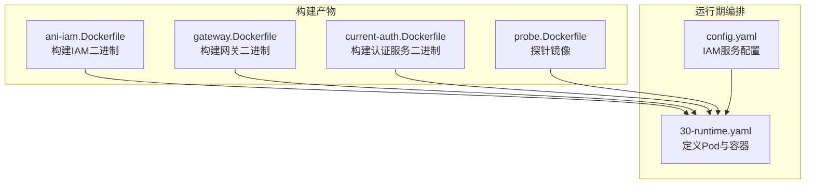
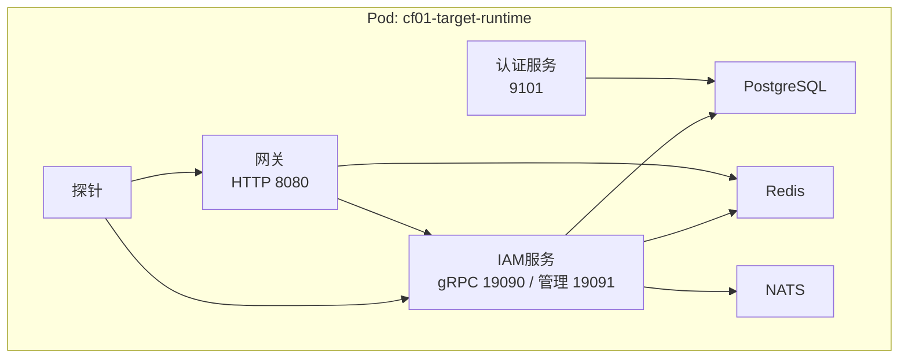
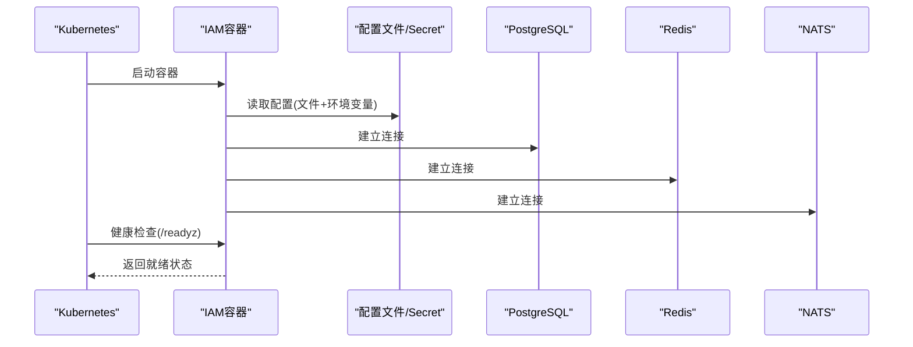
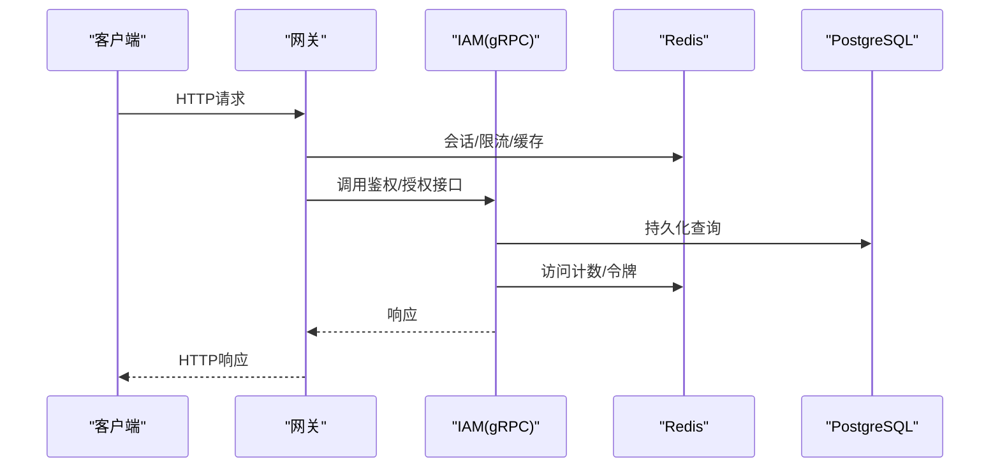
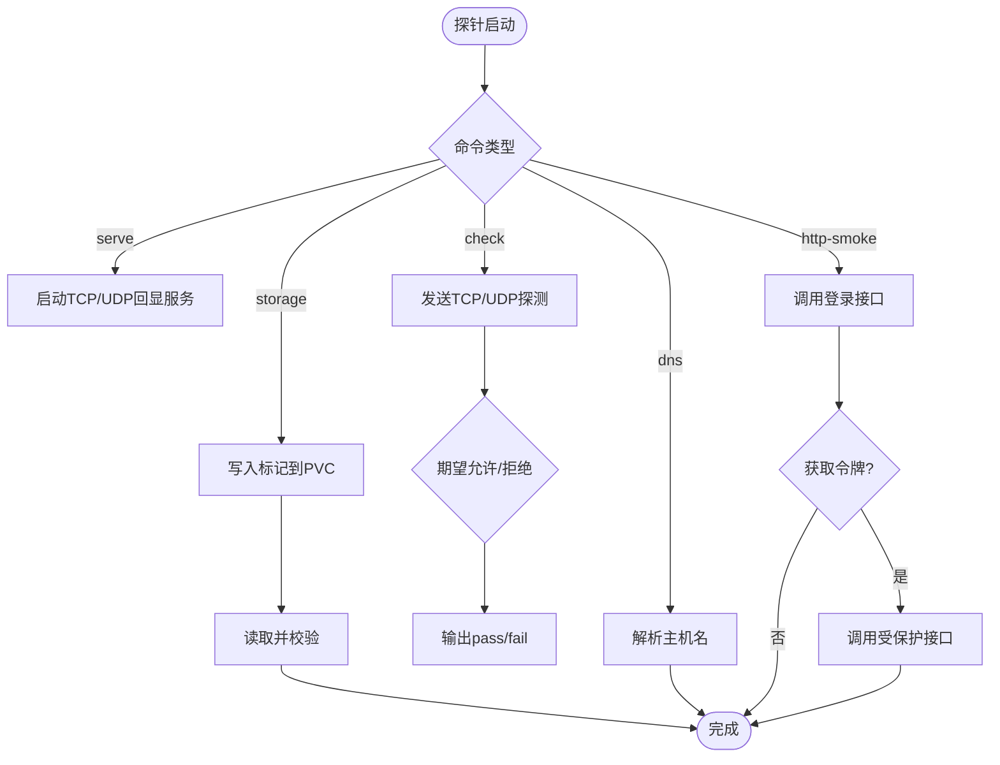
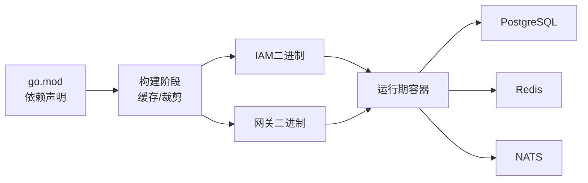

# Docker容器化部署

<cite>
**本文引用的文件**
- [ani-iam.Dockerfile](file://deploy/cutover-fitness/ani-iam.Dockerfile)
- [gateway.Dockerfile](file://deploy/cutover-fitness/gateway.Dockerfile)
- [current-auth.Dockerfile](file://deploy/cutover-fitness/current-auth.Dockerfile)
- [probe.Dockerfile](file://deploy/cutover-fitness/probe.Dockerfile)
- [30-runtime.yaml](file://deploy/cutover-fitness/30-runtime.yaml)
- [config.yaml](file://configs/config.yaml)
- [main.go](file://cmd/server/main.go)
- [conf.pb.go](file://internal/conf/conf.pb.go)
- [go.mod](file://go.mod)
- [probe.py](file://tools/cutover-fitness/probe.py)
</cite>

## 目录
1. [简介](#简介)
2. [项目结构](#项目结构)
3. [核心组件](#核心组件)
4. [架构总览](#架构总览)
5. [详细组件分析](#详细组件分析)
6. [依赖关系分析](#依赖关系分析)
7. [性能与构建优化](#性能与构建优化)
8. [故障排查指南](#故障排查指南)
9. [结论](#结论)
10. [附录：本地快速启动与编排建议](#附录本地快速启动与编排建议)

## 简介
本指南面向ANI IAM的Docker容器化部署，覆盖多阶段镜像构建、Go编译优化、镜像分层与安全加固；说明如何构建IAM服务、网关与探针容器；提供基于Kubernetes的编排示例与最佳实践（环境变量注入、配置文件挂载、健康检查、日志与监控）；并给出本地开发环境的快速启动思路。

## 项目结构
仓库包含三类与容器化直接相关的资产：
- 多阶段Dockerfile：分别用于构建IAM服务、网关、认证服务与探针
- Kubernetes部署清单：在同一Pod中编排Postgres、Redis、NATS、IAM、网关与探针等容器
- 应用配置与入口：IAM服务的配置文件与主程序入口，负责加载配置、初始化运行时与暴露端口

图表来源
- [ani-iam.Dockerfile:1-15](file://deploy/cutover-fitness/ani-iam.Dockerfile#L1-L15)
- [gateway.Dockerfile:1-24](file://deploy/cutover-fitness/gateway.Dockerfile#L1-L24)
- [current-auth.Dockerfile:1-24](file://deploy/cutover-fitness/current-auth.Dockerfile#L1-L24)
- [probe.Dockerfile:1-6](file://deploy/cutover-fitness/probe.Dockerfile#L1-L6)
- [30-runtime.yaml:1-332](file://deploy/cutover-fitness/30-runtime.yaml#L1-L332)
- [config.yaml:1-61](file://configs/config.yaml#L1-L61)

章节来源
- [ani-iam.Dockerfile:1-15](file://deploy/cutover-fitness/ani-iam.Dockerfile#L1-L15)
- [gateway.Dockerfile:1-24](file://deploy/cutover-fitness/gateway.Dockerfile#L1-L24)
- [current-auth.Dockerfile:1-24](file://deploy/cutover-fitness/current-auth.Dockerfile#L1-L24)
- [probe.Dockerfile:1-6](file://deploy/cutover-fitness/probe.Dockerfile#L1-L6)
- [30-runtime.yaml:1-332](file://deploy/cutover-fitness/30-runtime.yaml#L1-L332)
- [config.yaml:1-61](file://configs/config.yaml#L1-L61)

## 核心组件
- IAM服务容器：基于Alpine最小镜像，以非root用户运行，暴露gRPC与管理端口，通过配置文件加载TLS、数据库、Redis、OIDC等运行时参数
- 网关容器：将HTTP请求转发到IAM gRPC接口，具备自身健康检查端点
- 认证服务容器：为当前环境提供认证能力，配合网关工作
- 探针容器：用于连通性、存储往返、DNS解析与HTTP冒烟测试

章节来源
- [ani-iam.Dockerfile:1-15](file://deploy/cutover-fitness/ani-iam.Dockerfile#L1-L15)
- [gateway.Dockerfile:1-24](file://deploy/cutover-fitness/gateway.Dockerfile#L1-L24)
- [current-auth.Dockerfile:1-24](file://deploy/cutover-fitness/current-auth.Dockerfile#L1-L24)
- [probe.Dockerfile:1-6](file://deploy/cutover-fitness/probe.Dockerfile#L1-L6)

## 架构总览
下图展示了同一Pod内各容器的职责与交互：IAM作为核心鉴权与授权服务，网关对外提供HTTP入口，认证服务支撑登录流程，探针用于验证网络、存储与API可用性。

图表来源
- [30-runtime.yaml:238-290](file://deploy/cutover-fitness/30-runtime.yaml#L238-L290)
- [30-runtime.yaml:73-131](file://deploy/cutover-fitness/30-runtime.yaml#L73-L131)
- [30-runtime.yaml:26-72](file://deploy/cutover-fitness/30-runtime.yaml#L26-L72)

## 详细组件分析

### IAM服务容器
- 构建阶段
  - 使用固定版本的Golang基础镜像进行编译
  - 启用模块与构建缓存，关闭CGO，裁剪符号与调试信息，输出静态二进制
- 运行阶段
  - 基于Alpine，仅安装必要证书包
  - 创建非root用户并以该用户运行进程
  - 暴露gRPC与管理端口
  - 通过命令行参数指定配置文件路径，由主程序加载YAML与环境变量合并配置
- 配置与密钥
  - TLS证书、私钥、客户端CA、OIDC客户端密钥等均通过文件路径引用，通常由Secret挂载至只读目录
  - 数据库DSN、Redis地址、通知服务地址等通过配置文件或环境变量注入
- 健康检查
  - 管理端点提供就绪检查，可通过HTTP GET探测

图表来源
- [ani-iam.Dockerfile:1-15](file://deploy/cutover-fitness/ani-iam.Dockerfile#L1-L15)
- [main.go:34-101](file://cmd/server/main.go#L34-L101)
- [config.yaml:1-61](file://configs/config.yaml#L1-L61)
- [30-runtime.yaml:238-249](file://deploy/cutover-fitness/30-runtime.yaml#L238-L249)

章节来源
- [ani-iam.Dockerfile:1-15](file://deploy/cutover-fitness/ani-iam.Dockerfile#L1-L15)
- [main.go:34-101](file://cmd/server/main.go#L34-L101)
- [config.yaml:1-61](file://configs/config.yaml#L1-L61)
- [conf.pb.go:964-1065](file://internal/conf/conf.pb.go#L964-L1065)
- [30-runtime.yaml:238-249](file://deploy/cutover-fitness/30-runtime.yaml#L238-L249)

### 网关容器
- 构建阶段
  - 使用多阶段构建，复制必要的子模块与源码，初始化工作区后编译
  - 同样禁用CGO、裁剪符号与调试信息
- 运行阶段
  - 基于Alpine，安装证书包，以非root用户运行
  - 暴露HTTP端口，提供就绪检查端点
  - 通过环境变量注入数据库、Redis、IAM目标地址与TLS参数
- 与IAM交互
  - 将外部HTTP请求转换为对IAM gRPC接口的调用，必要时携带TLS证书与域名校验

图表来源
- [gateway.Dockerfile:1-24](file://deploy/cutover-fitness/gateway.Dockerfile#L1-L24)
- [30-runtime.yaml:250-290](file://deploy/cutover-fitness/30-runtime.yaml#L250-L290)

章节来源
- [gateway.Dockerfile:1-24](file://deploy/cutover-fitness/gateway.Dockerfile#L1-L24)
- [30-runtime.yaml:250-290](file://deploy/cutover-fitness/30-runtime.yaml#L250-L290)

### 认证服务容器
- 构建与运行模式与网关类似，提供认证相关能力
- 在编排中与IAM、网关协同，完成密码登录、令牌签发等流程

章节来源
- [current-auth.Dockerfile:1-24](file://deploy/cutover-fitness/current-auth.Dockerfile#L1-L24)
- [30-runtime.yaml:73-106](file://deploy/cutover-fitness/30-runtime.yaml#L73-L106)

### 探针容器
- 基于Python镜像，执行连通性、存储往返、DNS解析与HTTP冒烟测试
- 支持TCP/UDP回显、写入PVC并校验、调用IAM/GW的健康与登录接口
- 不打印敏感信息，适合安全地验证端到端链路

图表来源
- [probe.Dockerfile:1-6](file://deploy/cutover-fitness/probe.Dockerfile#L1-L6)
- [probe.py:171-242](file://tools/cutover-fitness/probe.py#L171-L242)

章节来源
- [probe.Dockerfile:1-6](file://deploy/cutover-fitness/probe.Dockerfile#L1-L6)
- [probe.py:171-242](file://tools/cutover-fitness/probe.py#L171-L242)

## 依赖关系分析
- 构建依赖
  - Go版本与第三方库由模块文件声明
  - 多阶段构建利用缓存层减少重复下载与编译时间
- 运行依赖
  - IAM依赖PostgreSQL、Redis、NATS以及可选的OIDC提供方
  - 网关依赖IAM的gRPC接口与Redis
  - 所有敏感信息通过Secret挂载或环境变量注入

图表来源
- [go.mod:1-119](file://go.mod#L1-L119)
- [ani-iam.Dockerfile:1-15](file://deploy/cutover-fitness/ani-iam.Dockerfile#L1-L15)
- [gateway.Dockerfile:1-24](file://deploy/cutover-fitness/gateway.Dockerfile#L1-L24)

章节来源
- [go.mod:1-119](file://go.mod#L1-L119)

## 性能与构建优化
- 多阶段构建
  - 构建阶段使用完整工具链，运行阶段仅包含二进制与必要系统库，显著减小镜像体积
- Go编译优化
  - 禁用CGO以获得静态链接二进制
  - 使用trimpath与ldflags裁剪符号与调试信息，提升启动速度与降低攻击面
- 缓存利用
  - 使用BuildKit缓存模块与构建结果，加速重复构建
- 镜像安全
  - 基于Alpine最小镜像
  - 以非root用户运行进程
  - 仅暴露必要端口
  - 证书与密钥通过只读卷挂载，避免写权限泄露

章节来源
- [ani-iam.Dockerfile:1-15](file://deploy/cutover-fitness/ani-iam.Dockerfile#L1-L15)
- [gateway.Dockerfile:1-24](file://deploy/cutover-fitness/gateway.Dockerfile#L1-L24)
- [current-auth.Dockerfile:1-24](file://deploy/cutover-fitness/current-auth.Dockerfile#L1-L24)
- [probe.Dockerfile:1-6](file://deploy/cutover-fitness/probe.Dockerfile#L1-L6)

## 故障排查指南
- 健康检查失败
  - IAM：检查管理端点是否可访问，确认配置文件路径与TLS文件存在且可读
  - 网关：检查HTTP就绪端点与IAM可达性
  - 依赖服务：Postgres/Redis/NATS就绪探针是否通过
- 配置与密钥
  - 确保Secret已正确挂载到只读目录，路径与配置项一致
  - 环境变量优先级高于配置文件，注意覆盖行为
- 网络与策略
  - 使用探针的TCP/UDP检查验证网络策略是否正确放行
  - DNS解析失败时检查CoreDNS与命名空间策略
- 日志与追踪
  - IAM默认输出结构化日志，便于集中收集
  - 可结合OpenTelemetry导出指标与追踪数据

章节来源
- [30-runtime.yaml:41-72](file://deploy/cutover-fitness/30-runtime.yaml#L41-L72)
- [30-runtime.yaml:99-131](file://deploy/cutover-fitness/30-runtime.yaml#L99-L131)
- [30-runtime.yaml:242-249](file://deploy/cutover-fitness/30-runtime.yaml#L242-L249)
- [30-runtime.yaml:282-290](file://deploy/cutover-fitness/30-runtime.yaml#L282-L290)
- [main.go:104-131](file://cmd/server/main.go#L104-L131)

## 结论
本项目采用清晰的多阶段Docker构建与最小化运行镜像策略，结合Kubernetes编排实现IAM、网关与探针的一体化部署。通过配置文件与Secret注入实现灵活的环境定制，配合就绪探针与健康检查保障服务稳定性。建议在本地与生产环境中统一遵循相同的构建与部署规范，以确保可重现性与安全性。

## 附录：本地快速启动与编排建议
- 构建镜像
  - 使用仓库中的Dockerfile分别构建IAM、网关、认证服务与探针镜像
  - 启用BuildKit缓存以加速构建
- 编排方式
  - 参考现有Kubernetes清单在同一Pod中启动Postgres、Redis、NATS、IAM、网关与探针
  - 通过Secret注入数据库凭据、TLS证书与OIDC密钥
  - 通过ConfigMap或Secret挂载配置文件与迁移脚本
- 环境变量与配置
  - IAM通过命令行参数指定配置文件路径，同时支持环境变量覆盖
  - 网关通过环境变量注入数据库、Redis与IAM目标地址及TLS参数
- 健康检查与监控
  - 为IAM设置管理端点的就绪探针
  - 为网关设置HTTP就绪探针
  - 为依赖服务设置各自就绪探针
  - 收集结构化日志与指标，接入集中式日志与监控系统
- 探针使用
  - 使用探针执行TCP/UDP连通性、存储往返、DNS解析与HTTP冒烟测试，验证端到端链路

章节来源
- [30-runtime.yaml:1-332](file://deploy/cutover-fitness/30-runtime.yaml#L1-L332)
- [config.yaml:1-61](file://configs/config.yaml#L1-L61)
- [main.go:34-101](file://cmd/server/main.go#L34-L101)
- [probe.py:171-242](file://tools/cutover-fitness/probe.py#L171-L242)