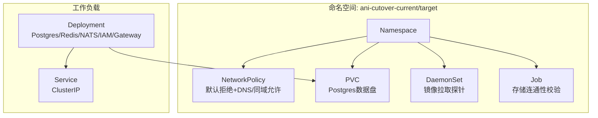
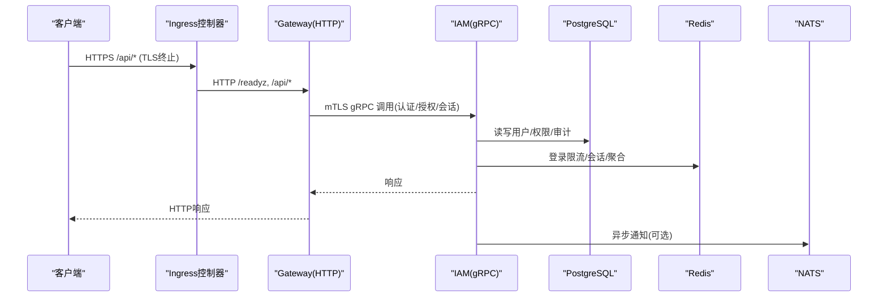
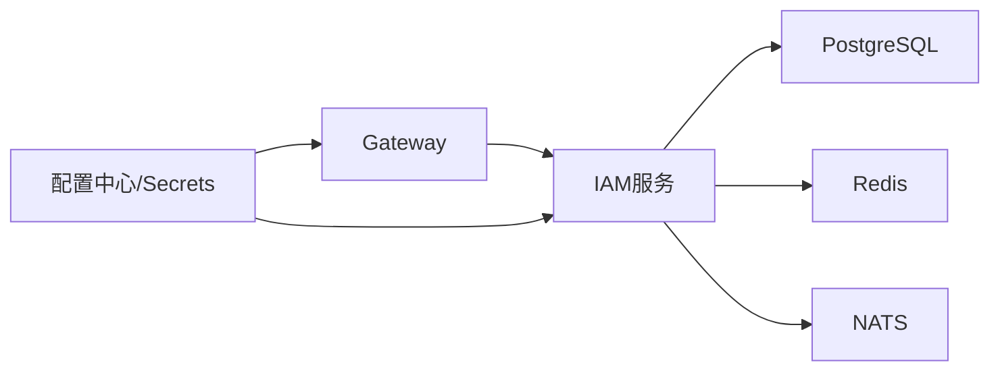

# Kubernetes部署

<cite>
**本文引用的文件**
- [30-runtime.yaml](file://deploy/cutover-fitness/30-runtime.yaml)
- [00-registry.yaml.tmpl](file://deploy/cutover-fitness/00-registry.yaml.tmpl)
- [10-storage.yaml.tmpl](file://deploy/cutover-fitness/10-storage.yaml.tmpl)
- [20-network.yaml.tmpl](file://deploy/cutover-fitness/20-network.yaml.tmpl)
- [config.yaml](file://configs/config.yaml)
- [main.go](file://cmd/server/main.go)
- [app.go](file://cmd/server/app.go)
- [ani-iam.Dockerfile](file://deploy/cutover-fitness/ani-iam.Dockerfile)
- [gateway.Dockerfile](file://deploy/cutover-fitness/gateway.Dockerfile)
</cite>

## 目录
1. [简介](#简介)
2. [项目结构](#项目结构)
3. [核心组件](#核心组件)
4. [架构总览](#架构总览)
5. [详细组件分析](#详细组件分析)
6. [依赖关系分析](#依赖关系分析)
7. [性能考虑](#性能考虑)
8. [故障排查指南](#故障排查指南)
9. [结论](#结论)
10. [附录](#附录)

## 简介
本指南面向生产环境，提供ANI IAM在Kubernetes上的完整部署说明。内容覆盖命名空间隔离、资源限制、服务发现、Ingress与TLS、HPA/PDB高可用、存储卷挂载与持久化、备份恢复策略，以及Helm Chart模板与Kustomize配置管理方案。文档同时结合仓库内现有部署清单与运行时配置，给出可落地的实践建议。

## 项目结构
仓库中与Kubernetes部署直接相关的资源位于deploy/cutover-fitness目录，包含：
- 命名空间与基础网络策略（00-registry.yaml.tmpl、20-network.yaml.tmpl）
- 存储PVC与校验Job（10-storage.yaml.tmpl）
- 运行时Deployment（30-runtime.yaml），内含Postgres、Redis、NATS、IAM、Gateway等容器
- 应用Docker镜像构建定义（ani-iam.Dockerfile、gateway.Dockerfile）
- 运行时配置（configs/config.yaml）

图表来源
- [00-registry.yaml.tmpl:1-51](file://deploy/cutover-fitness/00-registry.yaml.tmpl#L1-L51)
- [20-network.yaml.tmpl:1-210](file://deploy/cutover-fitness/20-network.yaml.tmpl#L1-L210)
- [10-storage.yaml.tmpl:1-96](file://deploy/cutover-fitness/10-storage.yaml.tmpl#L1-L96)
- [30-runtime.yaml:1-332](file://deploy/cutover-fitness/30-runtime.yaml#L1-L332)

章节来源
- [00-registry.yaml.tmpl:1-51](file://deploy/cutover-fitness/00-registry.yaml.tmpl#L1-L51)
- [10-storage.yaml.tmpl:1-96](file://deploy/cutover-fitness/10-storage.yaml.tmpl#L1-L96)
- [20-network.yaml.tmpl:1-210](file://deploy/cutover-fitness/20-network.yaml.tmpl#L1-L210)
- [30-runtime.yaml:1-332](file://deploy/cutover-fitness/30-runtime.yaml#L1-L332)

## 核心组件
- 运行时应用
  - IAM服务：gRPC监听端口19090，Admin HTTP端口19091，通过配置文件加载TLS、OIDC、Redis、PostgreSQL等依赖。
  - Gateway：HTTP入口，转发到IAM gRPC，暴露健康检查端点。
- 依赖服务
  - PostgreSQL：持久化业务数据，使用PVC挂载数据目录。
  - Redis：登录限流、会话、操作聚合等缓存与速率控制。
  - NATS：消息总线（示例中用于通知/事件）。
- 安全与网络
  - NetworkPolicy：默认拒绝入出，仅允许DNS与同命名空间通信。
  - Secret/ConfigMap：注入证书、密钥、初始化脚本与配置。
- 可观测性与就绪探测
  - 各容器均配置readinessProbe，确保流量仅在实例就绪后进入。

章节来源
- [config.yaml:1-61](file://configs/config.yaml#L1-L61)
- [30-runtime.yaml:26-160](file://deploy/cutover-fitness/30-runtime.yaml#L26-L160)
- [30-runtime.yaml:187-332](file://deploy/cutover-fitness/30-runtime.yaml#L187-L332)
- [20-network.yaml.tmpl:1-210](file://deploy/cutover-fitness/20-network.yaml.tmpl#L1-L210)

## 架构总览
下图展示生产环境中典型的数据流与控制面交互：外部请求经Ingress/TLS终止后进入Gateway，再由Gateway以mTLS调用IAM；IAM访问PostgreSQL与Redis完成认证、授权与会话管理；通知子系统通过NATS进行异步投递。

图表来源
- [30-runtime.yaml:107-160](file://deploy/cutover-fitness/30-runtime.yaml#L107-L160)
- [30-runtime.yaml:238-290](file://deploy/cutover-fitness/30-runtime.yaml#L238-L290)
- [config.yaml:1-61](file://configs/config.yaml#L1-L61)

## 详细组件分析

### 命名空间隔离与网络策略
- 双命名空间隔离：current与target两个命名空间分别承载不同阶段的工作负载，避免跨域误访。
- 默认拒绝策略：为每个命名空间创建默认拒绝的NetworkPolicy，再显式放行DNS与同命名空间通信，最小化攻击面。
- 标签与选择器：所有资源统一附加cutover-fitness-id与run-id标签，便于按运行批次治理。

章节来源
- [00-registry.yaml.tmpl:1-51](file://deploy/cutover-fitness/00-registry.yaml.tmpl#L1-L51)
- [20-network.yaml.tmpl:1-210](file://deploy/cutover-fitness/20-network.yaml.tmpl#L1-L210)

### 存储卷挂载与持久化
- PVC：为Postgres数据目录申请ReadWriteOnce卷，绑定StorageClass，确保单副本独占写入。
- 初始化脚本：通过Projected Volume将ConfigMap与Secret中的SQL脚本挂载至Postgres初始化目录，实现自动建库/迁移/种子数据。
- 校验Job：启动一次性Job对PVC进行读写探测并写入标记文件，验证存储可用性。

章节来源
- [10-storage.yaml.tmpl:1-96](file://deploy/cutover-fitness/10-storage.yaml.tmpl#L1-L96)
- [30-runtime.yaml:142-160](file://deploy/cutover-fitness/30-runtime.yaml#L142-L160)
- [30-runtime.yaml:301-332](file://deploy/cutover-fitness/30-runtime.yaml#L301-L332)

### 服务发现与内部通信
- Service：为测试Echo服务提供ClusterIP，演示同一命名空间内的TCP/UDP服务发现。
- 内部地址：IAM与Gateway在同一Pod内通过localhost通信，降低网络开销并简化拓扑。
- 外部接入：建议在集群Ingress层暴露Gateway的HTTP端口，并在Ingress中配置TLS终止与路径路由。

章节来源
- [20-network.yaml.tmpl:81-126](file://deploy/cutover-fitness/20-network.yaml.tmpl#L81-L126)
- [30-runtime.yaml:107-160](file://deploy/cutover-fitness/30-runtime.yaml#L107-L160)
- [30-runtime.yaml:238-290](file://deploy/cutover-fitness/30-runtime.yaml#L238-L290)

### TLS与证书管理
- IAM gRPC TLS：服务端证书、私钥与客户端CA通过Secret挂载到/run/secrets，由应用读取并启用双向TLS。
- OIDC集成：OIDC客户端密钥通过Secret文件注入，支持浏览器登录回调与身份链接回调。
- 通知通道：通知客户端证书、私钥与服务端CA同样通过Secret挂载，确保与通知服务的mTLS通信。

章节来源
- [config.yaml:7-11](file://configs/config.yaml#L7-L11)
- [config.yaml:33-47](file://configs/config.yaml#L33-L47)
- [30-runtime.yaml:103-106](file://deploy/cutover-fitness/30-runtime.yaml#L103-L106)
- [30-runtime.yaml:246-249](file://deploy/cutover-fitness/30-runtime.yaml#L246-L249)

### Ingress控制器、负载均衡与高可用
- Ingress：建议在集群Ingress中为Gateway暴露HTTPS域名，开启TLS证书管理（如cert-manager），并将后端指向Gateway Service。
- 负载均衡：利用Ingress的负载均衡能力将流量分发到多个Gateway Pod；IAM可通过多副本配合Pod反亲和提升可用性。
- HPA：基于CPU/内存或自定义指标对Gateway与IAM Deployment启用水平扩缩容，保障峰值吞吐。
- PDB：为关键服务设置PodDisruptionBudget，确保滚动升级或节点维护时至少保留一定数量的Pod。

章节来源
- [30-runtime.yaml:107-160](file://deploy/cutover-fitness/30-runtime.yaml#L107-L160)
- [30-runtime.yaml:238-290](file://deploy/cutover-fitness/30-runtime.yaml#L238-L290)

### 自动扩缩容与中断预算（HPA/PDB）
- HPA建议：
  - Gateway：基于CPU利用率与请求并发数进行扩缩容。
  - IAM：基于CPU与内存使用率，并结合gRPC QPS指标进行扩缩容。
- PDB建议：
  - 保持至少1个IAM与Gateway Pod在线，避免全量重启导致服务不可用。
  - 与滚动更新策略配合，确保平滑过渡。

[本节为通用实践建议，不直接引用具体代码文件]

### 配置管理与环境变量
- 配置文件：应用通过命令行参数指定配置文件路径，支持从文件与环境变量合并加载。
- 运行时配置项：包括gRPC监听地址、超时、TLS证书路径、PostgreSQL DSN、Redis连接信息、OIDC提供者、通知通道等。
- 敏感信息：所有密钥与证书通过Secret挂载到只读目录，避免明文泄露。

章节来源
- [main.go:22-32](file://cmd/server/main.go#L22-L32)
- [main.go:82-99](file://cmd/server/main.go#L82-L99)
- [config.yaml:1-61](file://configs/config.yaml#L1-L61)

### 应用启动与依赖就绪
- 启动流程：解析配置→加载工作负载注册表→建立数据库与Redis连接→初始化中间件→启动gRPC与Admin服务→注册就绪探针。
- 依赖检查：启动前对PostgreSQL与Redis执行Ping，失败则中止启动，避免“假活”实例接收流量。
- 后台任务：API Key使用聚合、密码动作通知派发等后台Worker随应用生命周期启停。

章节来源
- [app.go:369-448](file://cmd/server/app.go#L369-L448)
- [app.go:669-783](file://cmd/server/app.go#L669-L783)

### Docker镜像与安全上下文
- IAM镜像：基于Alpine，非root用户运行，暴露19090与19091端口。
- Gateway镜像：基于Alpine，非root用户运行，暴露8080与9200端口。
- 探针镜像：Python基础镜像，用于连通性与功能探测。

章节来源
- [ani-iam.Dockerfile:1-15](file://deploy/cutover-fitness/ani-iam.Dockerfile#L1-L15)
- [gateway.Dockerfile:1-24](file://deploy/cutover-fitness/gateway.Dockerfile#L1-L24)

## 依赖关系分析
- 应用依赖
  - IAM依赖PostgreSQL（持久化）、Redis（限流/会话/聚合）、NATS（通知）、OIDC Provider（外部身份源）。
  - Gateway依赖IAM的gRPC接口。
- 配置依赖
  - 配置文件集中声明各组件地址、超时、证书路径与命名空间等。
- 网络依赖
  - 通过NetworkPolicy限制跨命名空间访问，仅允许DNS与同命名空间通信。

图表来源
- [config.yaml:1-61](file://configs/config.yaml#L1-L61)
- [30-runtime.yaml:107-160](file://deploy/cutover-fitness/30-runtime.yaml#L107-L160)
- [30-runtime.yaml:238-290](file://deploy/cutover-fitness/30-runtime.yaml#L238-L290)

章节来源
- [config.yaml:1-61](file://configs/config.yaml#L1-L61)
- [30-runtime.yaml:107-160](file://deploy/cutover-fitness/30-runtime.yaml#L107-L160)
- [30-runtime.yaml:238-290](file://deploy/cutover-fitness/30-runtime.yaml#L238-L290)

## 性能考虑
- 资源限制：为各容器设置requests与limits，防止资源争抢；对Postgres与Redis单独规划容量与IOPS。
- 连接池：合理配置PostgreSQL与Redis连接池大小，避免连接耗尽。
- 超时与重试：为gRPC与HTTP调用设置合理的超时与重试策略，提升鲁棒性。
- 监控与告警：启用Prometheus指标抓取与日志采集，关注延迟、错误率与资源使用率。

[本节为通用实践建议，不直接引用具体代码文件]

## 故障排查指南
- 启动失败
  - 检查PostgreSQL与Redis连通性，确认DSN与凭据正确。
  - 查看readinessProbe失败原因，确认依赖服务已就绪。
- 证书问题
  - 确认Secret中证书与私钥匹配，且路径与IAM配置一致。
  - 检查mTLS客户端CA是否被网关正确信任。
- 网络问题
  - 确认NetworkPolicy未阻断必要端口（DNS 53/TCP&UDP，同命名空间通信）。
  - 验证Ingress规则与TLS证书是否生效。
- 存储问题
  - 检查PVC状态与StorageClass，确认卷已绑定且可写。
  - 通过校验Job输出判断存储连通性。

章节来源
- [30-runtime.yaml:41-64](file://deploy/cutover-fitness/30-runtime.yaml#L41-L64)
- [30-runtime.yaml:202-233](file://deploy/cutover-fitness/30-runtime.yaml#L202-L233)
- [20-network.yaml.tmpl:1-210](file://deploy/cutover-fitness/20-network.yaml.tmpl#L1-L210)
- [10-storage.yaml.tmpl:29-96](file://deploy/cutover-fitness/10-storage.yaml.tmpl#L29-L96)

## 结论
本指南基于仓库现有部署清单与运行时配置，提供了ANI IAM在生产环境的Kubernetes部署要点：通过命名空间隔离与NetworkPolicy确保安全边界；借助PVC与初始化脚本实现数据持久化与自动化初始化；通过Ingress与TLS实现外部访问与加密；结合HPA与PDB达成弹性与高可用；并以Secret/ConfigMap集中管理配置与密钥。建议在实际落地时补充完整的Ingress、HPA、PDB与备份策略，以满足生产SLA要求。

[本节为总结性内容，不直接引用具体代码文件]

## 附录

### Helm Chart模板建议
- 模板结构
  - templates/deployment.yaml：IAM与Gateway的Deployment，含副本数、资源限制、探针、卷挂载。
  - templates/service.yaml：Service定义（ClusterIP/NodePort/LoadBalancer）。
  - templates/configmap.yaml：非敏感配置（如工作负载注册表路径、环境标识）。
  - templates/secret.yaml：敏感信息（证书、密钥、DSN、密码）。
  - templates/hpa.yaml：HPA配置（CPU/内存/自定义指标）。
  - templates/pdb.yaml：PDB配置（最小可用副本）。
  - templates/networkpolicy.yaml：NetworkPolicy（默认拒绝+白名单）。
  - templates/storage.yaml：PVC与初始化Job。
  - templates/ingress.yaml：Ingress与TLS证书管理。
- 值文件（values.yaml）
  - 区分dev/staging/prod环境，集中管理镜像版本、资源配额、存储类、域名与证书。

[本节为概念性指导，不直接引用具体代码文件]

### Kustomize配置管理方案
- 目录组织
  - base：基础资源（Deployment、Service、ConfigMap、Secret、PVC、NetworkPolicy）。
  - overlays/dev|staging|prod：环境差异（副本数、资源限制、域名、证书、存储类）。
- 常用Patch
  - 使用kustomize patch替换镜像tag、调整resources.requests/limits、注入环境变量。
  - 使用namePrefix与namespaceSuffix实现多环境隔离。
- 生成与发布
  - 使用kustomize build生成最终清单，提交至CI/CD流水线进行部署与回滚。

[本节为概念性指导，不直接引用具体代码文件]

### 备份与恢复策略
- 数据库备份
  - 定期逻辑备份（pg_dump）与物理备份（WAL归档），保留多份历史快照。
  - 将备份对象存储于独立Bucket，并启用加密与版本控制。
- 恢复演练
  - 定期执行恢复演练，验证RTO/RPO目标。
  - 记录恢复步骤与回滚预案。
- 配置与密钥
  - 对Secret与ConfigMap进行版本化管理，变更需审批与审计。

[本节为通用实践建议，不直接引用具体代码文件]