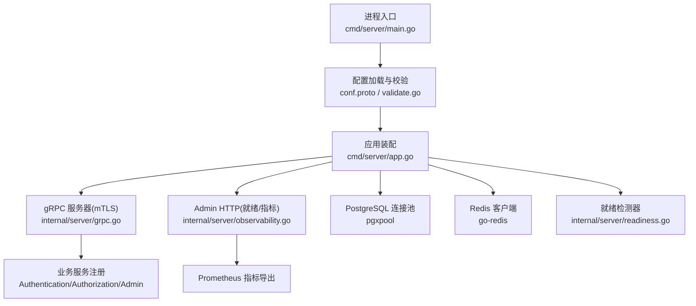
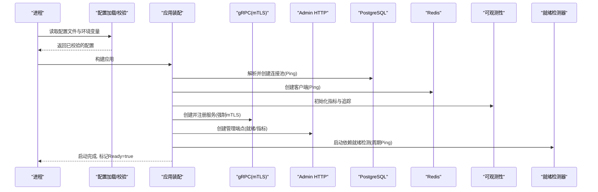
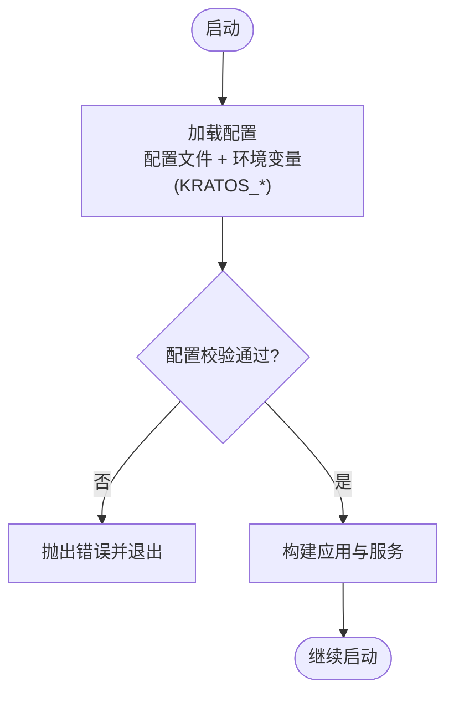
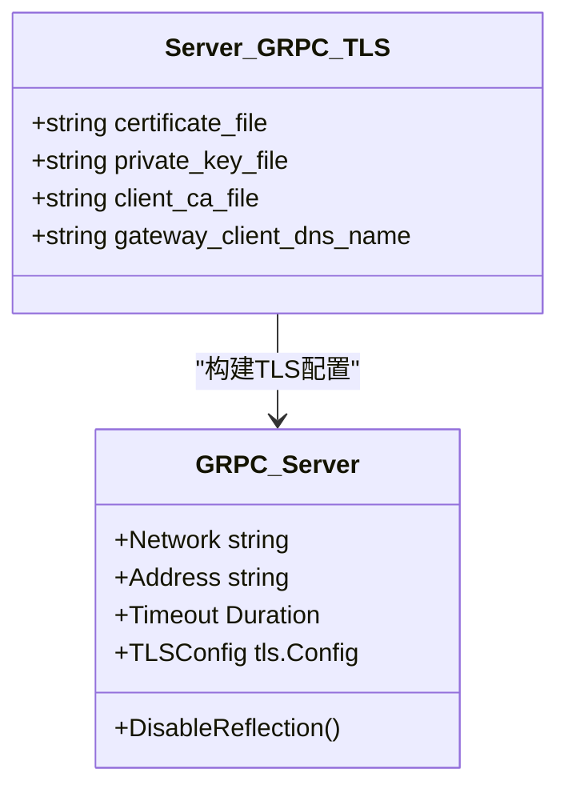
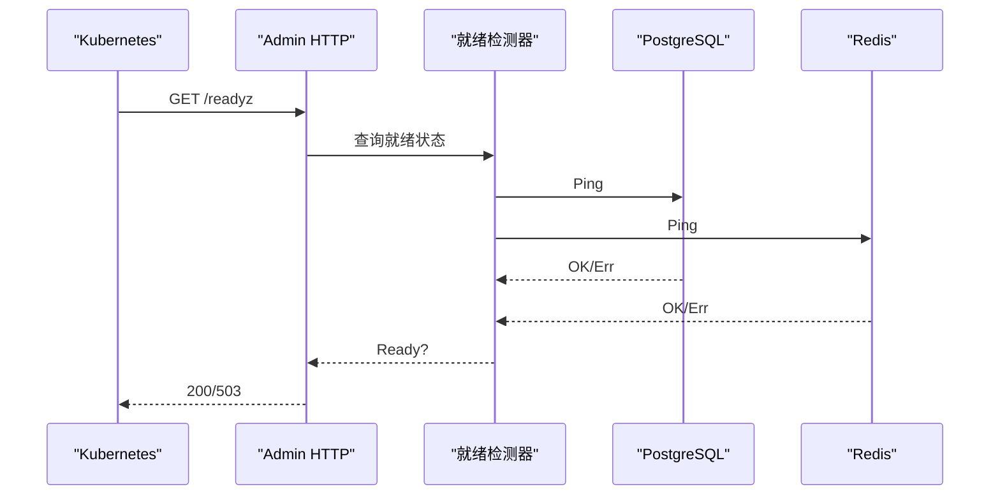
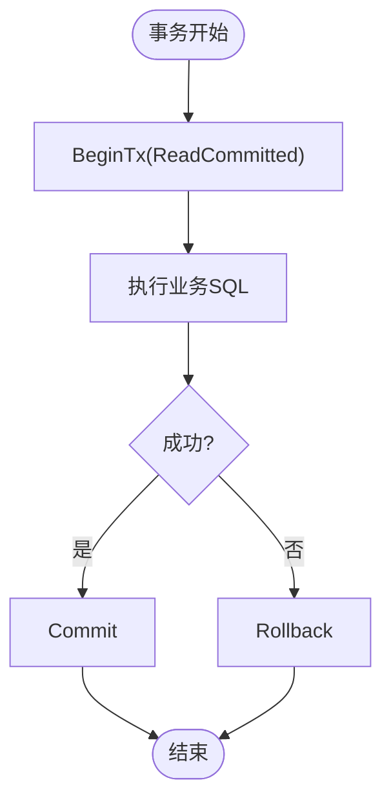
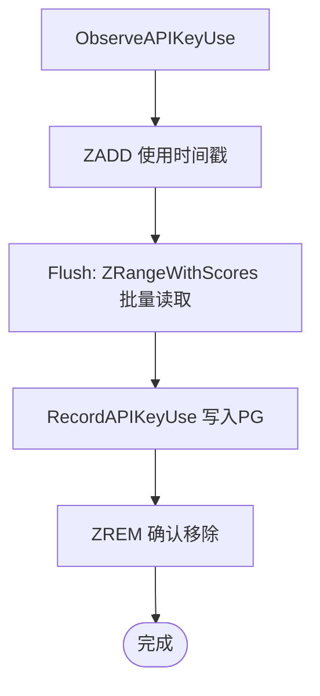
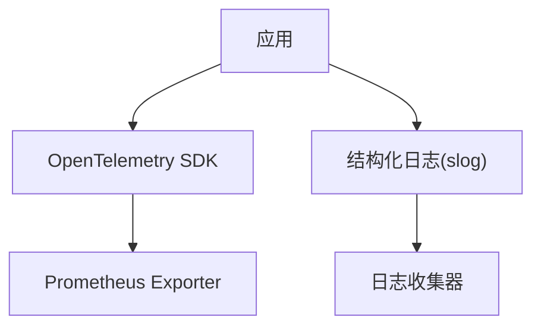
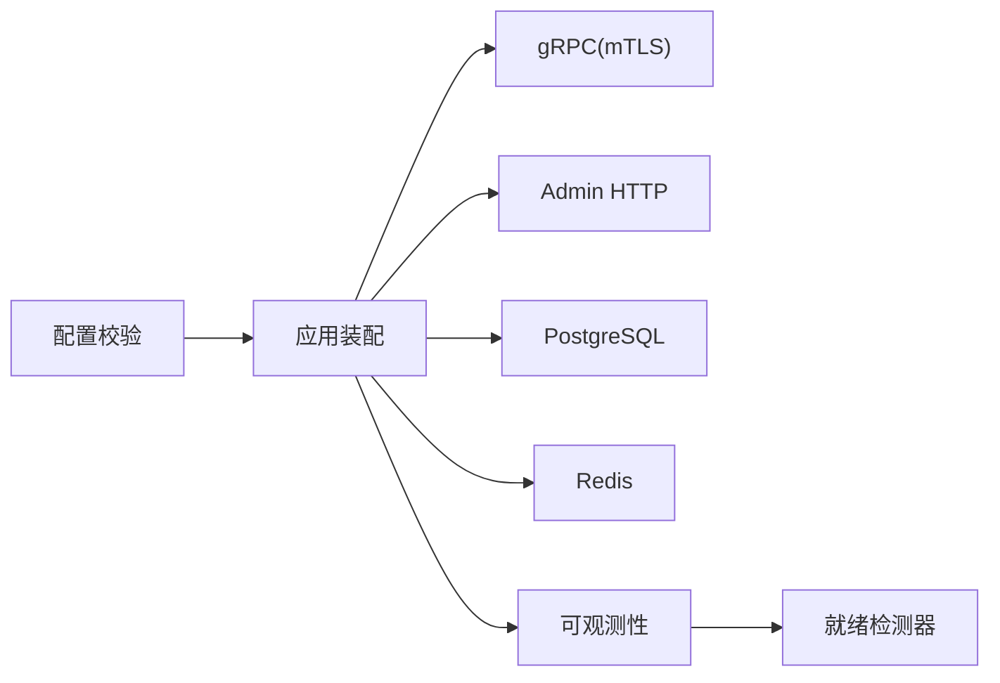

# 生产环境配置

<cite>
**本文引用的文件**
- [configs/config.yaml](file://configs/config.yaml)
- [internal/conf/conf.proto](file://internal/conf/conf.proto)
- [internal/conf/validate.go](file://internal/conf/validate.go)
- [cmd/server/main.go](file://cmd/server/main.go)
- [cmd/server/app.go](file://cmd/server/app.go)
- [internal/server/grpc.go](file://internal/server/grpc.go)
- [internal/server/tls.go](file://internal/server/tls.go)
- [internal/server/readiness.go](file://internal/server/readiness.go)
- [internal/server/observability.go](file://internal/server/observability.go)
- [internal/data/postgres.go](file://internal/data/postgres.go)
- [internal/data/api_key_usage_redis.go](file://internal/data/api_key_usage_redis.go)
- [internal/data/oidc_redis.go](file://internal/data/oidc_redis.go)
- [deploy/cutover-fitness/30-runtime.yaml](file://deploy/cutover-fitness/30-runtime.yaml)
</cite>

## 目录
1. [简介](#简介)
2. [项目结构](#项目结构)
3. [核心组件](#核心组件)
4. [架构总览](#架构总览)
5. [详细组件分析](#详细组件分析)
6. [依赖关系分析](#依赖关系分析)
7. [性能与容量调优](#性能与容量调优)
8. [故障排查指南](#故障排查指南)
9. [结论](#结论)
10. [附录：配置项速查](#附录配置项速查)

## 简介
本指南面向生产环境的 ANI IAM 服务，聚焦于配置参数调优与最佳实践，覆盖数据库连接、Redis 缓存、gRPC 服务器与安全（mTLS）、健康检查探针、可观测性指标、日志级别与调试开关、配置验证与热重载机制等。文档基于仓库中的配置定义、启动流程、服务端实现与部署清单进行系统化梳理，帮助在生产中稳定、安全地运行 IAM 服务。

## 项目结构
- 配置定义与校验
  - 配置结构体定义位于 protobuf 描述文件中，运行时通过 Kratos 配置加载并扫描到结构体。
  - 启动时执行严格的配置校验，确保网络、地址、超时、证书路径、OIDC、通知等关键项符合生产约束。
- 应用启动与装配
  - 入口负责解析命令行参数、加载配置文件与环境变量、初始化日志、自动设置 CPU 亲和、构建应用并启动 gRPC 与 Admin HTTP 服务。
- 服务器与安全
  - gRPC 服务强制启用 mTLS（TLS1.3 + 双向证书校验），禁用反射；Admin 服务暴露管理端点用于就绪与健康检查。
- 可观测性与健康检查
  - 内置 OpenTelemetry 指标导出至 Prometheus，暴露就绪状态与业务相关指标；提供依赖就绪检测器周期性探测后端依赖。
- 数据访问
  - PostgreSQL 使用 pgxpool 连接池；Redis 用于登录限流、API Key 使用聚合、OIDC 操作存储等。
- 部署与探针
  - 示例部署清单展示了容器化运行方式、Secret 挂载、以及就绪探针的调用方式。

**图示来源**
- [cmd/server/main.go:72-101](file://cmd/server/main.go#L72-L101)
- [internal/conf/conf.proto:9-58](file://internal/conf/conf.proto#L9-L58)
- [internal/conf/validate.go:19-45](file://internal/conf/validate.go#L19-L45)
- [cmd/server/app.go:369-744](file://cmd/server/app.go#L369-L744)
- [internal/server/grpc.go:14-50](file://internal/server/grpc.go#L14-L50)
- [internal/server/observability.go:41-143](file://internal/server/observability.go#L41-L143)
- [internal/server/readiness.go:17-74](file://internal/server/readiness.go#L17-L74)

**章节来源**
- [configs/config.yaml:1-61](file://configs/config.yaml#L1-L61)
- [internal/conf/conf.proto:9-58](file://internal/conf/conf.proto#L9-L58)
- [internal/conf/validate.go:19-45](file://internal/conf/validate.go#L19-L45)
- [cmd/server/main.go:72-101](file://cmd/server/main.go#L72-L101)
- [cmd/server/app.go:369-744](file://cmd/server/app.go#L369-L744)

## 核心组件
- 配置模型与校验
  - Bootstrap/Server/Runtime 等结构体定义了 gRPC、Admin、PostgreSQL、Redis、AccessToken、Notification、OIDC 等配置项。
  - 启动时执行严格校验：网络必须为 tcp、监听地址需显式绑定 IP 与端口、超时范围受限、证书路径必须为绝对路径、OIDC 必须为 dex 且重定向 URL 必须规范 HTTPS 等。
- gRPC 服务器与安全
  - 强制 TLS1.3、要求客户端证书（RequireAndVerifyClientCert）、禁用反射，确保仅受信任网关可达。
- 健康检查与就绪探针
  - 依赖就绪检测器周期性检查数据库与 Redis 连通性；应用启动完成后标记 ready=true，停止前标记 false。
- 可观测性
  - 集成 OpenTelemetry 与 Prometheus，暴露请求计数、延迟直方图、运行时就绪状态、API Key 运营快照时间戳等指标。
- 数据层
  - PostgreSQL 使用 pgxpool；Redis 用于限流、聚合、状态存储；错误映射将底层 PG 错误转换为领域错误。

**章节来源**
- [internal/conf/conf.proto:9-113](file://internal/conf/conf.proto#L9-L113)
- [internal/conf/validate.go:19-168](file://internal/conf/validate.go#L19-L168)
- [internal/server/grpc.go:14-50](file://internal/server/grpc.go#L14-L50)
- [internal/server/readiness.go:17-74](file://internal/server/readiness.go#L17-L74)
- [internal/server/observability.go:41-143](file://internal/server/observability.go#L41-L143)
- [internal/data/postgres.go:195-232](file://internal/data/postgres.go#L195-L232)

## 架构总览
下图展示生产环境下 IAM 服务的启动、配置、安全、健康检查与可观测性的交互关系。

**图示来源**
- [cmd/server/main.go:72-101](file://cmd/server/main.go#L72-L101)
- [cmd/server/app.go:369-744](file://cmd/server/app.go#L369-L744)
- [internal/server/grpc.go:14-50](file://internal/server/grpc.go#L14-L50)
- [internal/server/observability.go:41-143](file://internal/server/observability.go#L41-L143)
- [internal/server/readiness.go:17-74](file://internal/server/readiness.go#L17-L74)

## 详细组件分析

### 配置模型与校验（生产约束）
- 关键约束要点
  - 网络与监听：gRPC 与 Admin 必须使用 tcp，监听地址需显式绑定 IP 与端口，且二者不能相同（除非回环动态端口）。
  - 超时限制：所有超时必须在合理范围内，例如关闭超时上限为 30s，Redis 各项超时上限为 5s，登录窗口上限为 24h。
  - 证书与密钥：gRPC mTLS 的证书、私钥、客户端 CA 必须为绝对路径；OIDC 客户端密钥文件也必须为绝对路径。
  - OIDC 与通知：OIDC 提供商固定为 dex；重定向 URI 必须为规范 HTTPS；通知服务地址与证书同样要求严格。
  - 策略版本：policy_revision 必须以 sha256: 开头且为合法摘要。
- 环境变量优先级
  - 配置源顺序：配置文件优先，随后被 KRATOS_* 环境变量覆盖（Kratos env source）。
  - 建议：敏感信息（如密码、密钥）通过环境变量或 Secret 注入，避免写入配置文件。

**图示来源**
- [cmd/server/main.go:72-101](file://cmd/server/main.go#L72-L101)
- [internal/conf/validate.go:19-168](file://internal/conf/validate.go#L19-L168)

**章节来源**
- [internal/conf/conf.proto:9-113](file://internal/conf/conf.proto#L9-L113)
- [internal/conf/validate.go:19-168](file://internal/conf/validate.go#L19-L168)
- [cmd/server/main.go:72-101](file://cmd/server/main.go#L72-L101)

### gRPC 服务器与 mTLS 安全
- 强制安全基线
  - TLS 最低版本为 TLS1.3；客户端证书必须提供并校验；禁用反射以减少攻击面。
  - 仅允许受信任网关（通过 CA 与 DNS 名称白名单）访问。
- 配置项
  - network、addr、timeout、tls.certificate_file、tls.private_key_file、tls.client_ca_file、tls.gateway_client_dns_name。
- 生产建议
  - 证书与密钥通过 Secret 挂载到只读卷；网关侧配置对应 CA、客户端证书与 SNI 名称。
  - 监听地址建议使用内网 IP 与固定端口，避免 0.0.0.0 暴露。

**图示来源**
- [internal/conf/conf.proto:15-39](file://internal/conf/conf.proto#L15-L39)
- [internal/server/grpc.go:14-50](file://internal/server/grpc.go#L14-L50)
- [internal/server/tls.go:15-37](file://internal/server/tls.go#L15-L37)

**章节来源**
- [internal/server/grpc.go:14-50](file://internal/server/grpc.go#L14-L50)
- [internal/server/tls.go:15-37](file://internal/server/tls.go#L15-L37)
- [configs/config.yaml:3-16](file://configs/config.yaml#L3-L16)

### 健康检查、就绪探针与存活探针
- 就绪探针（Readiness）
  - 依赖就绪检测器周期性 Ping PostgreSQL 与 Redis，并在失败时置为不就绪；应用启动完成后标记 ready=true，停止前标记 false。
  - 部署示例中通过 Admin HTTP 的 /readyz 端点进行就绪检查。
- 存活探针（Liveness）
  - 代码未暴露独立 liveness 端点；可通过进程存活与依赖就绪组合判断。
- 生产建议
  - 在 Kubernetes 中同时配置 readinessProbe 与 livenessProbe；liveness 可使用 exec 命令检查进程或简单 TCP 端口。
  - 将就绪探针指向 Admin 服务的 /readyz，确保依赖可用后再接收流量。

**图示来源**
- [internal/server/readiness.go:17-74](file://internal/server/readiness.go#L17-L74)
- [cmd/server/app.go:673-684](file://cmd/server/app.go#L673-L684)
- [deploy/cutover-fitness/30-runtime.yaml:242-245](file://deploy/cutover-fitness/30-runtime.yaml#L242-L245)

**章节来源**
- [internal/server/readiness.go:17-74](file://internal/server/readiness.go#L17-L74)
- [cmd/server/app.go:673-684](file://cmd/server/app.go#L673-L684)
- [deploy/cutover-fitness/30-runtime.yaml:242-245](file://deploy/cutover-fitness/30-runtime.yaml#L242-L245)

### 数据库连接与事务处理
- 连接池
  - 使用 pgxpool 解析 DSN 并创建连接池；启动时执行 Ping 验证连通性。
  - 非回环地址要求 sslmode=verify-full 并指定 CA 根证书，确保传输加密与身份校验。
- 事务与错误映射
  - 租户工作单元以 ReadCommitted 隔离级别开启事务；错误映射将 PG 错误码转换为领域错误（如冲突、权限不足、版本冲突）。
- 生产建议
  - 根据负载调整连接池大小（max_conns/min_conns）与超时；使用只读副本分担查询压力。
  - 对非回环数据库务必启用 verify-full 并挂载 CA 证书。

**图示来源**
- [internal/data/postgres.go:27-59](file://internal/data/postgres.go#L27-L59)
- [internal/conf/validate.go:170-196](file://internal/conf/validate.go#L170-L196)

**章节来源**
- [internal/data/postgres.go:27-59](file://internal/data/postgres.go#L27-L59)
- [internal/conf/validate.go:170-196](file://internal/conf/validate.go#L170-L196)

### Redis 缓存与限流
- 用途
  - 登录限流：按命名空间与窗口限制登录尝试次数。
  - API Key 使用聚合：批量记录使用事件，异步刷盘至 PostgreSQL。
  - OIDC 操作存储：使用 Lua 脚本保证幂等与原子性。
- 配置项
  - addr、username、password、database、namespace、login_limit、login_window、dial_timeout、read_timeout、write_timeout。
- 生产建议
  - 使用独立数据库与命名空间隔离不同环境；合理设置批大小与超时；监控 Redis 延迟与错误率。

**图示来源**
- [internal/data/api_key_usage_redis.go:33-47](file://internal/data/api_key_usage_redis.go#L33-L47)
- [internal/data/api_key_usage_redis.go:63-123](file://internal/data/api_key_usage_redis.go#L63-L123)
- [internal/data/oidc_redis.go:25-54](file://internal/data/oidc_redis.go#L25-L54)

**章节来源**
- [internal/data/api_key_usage_redis.go:63-123](file://internal/data/api_key_usage_redis.go#L63-L123)
- [internal/data/oidc_redis.go:25-54](file://internal/data/oidc_redis.go#L25-L54)
- [configs/config.yaml:22-32](file://configs/config.yaml#L22-L32)

### 可观测性指标与日志
- 指标
  - 请求计数、延迟直方图、运行时就绪状态、API Key 运营快照时间戳等；通过 OpenTelemetry 导出到 Prometheus。
- 日志
  - 默认 JSON 格式，过滤敏感字段（如凭证、DSN、令牌等）；附带服务 ID、名称、版本。
- 生产建议
  - 采集 /metrics 端点并接入 Prometheus；根据负载调整采样与指标粒度；日志集中收集并设置保留策略。

**图示来源**
- [internal/server/observability.go:41-143](file://internal/server/observability.go#L41-L143)
- [cmd/server/main.go:104-131](file://cmd/server/main.go#L104-L131)

**章节来源**
- [internal/server/observability.go:41-143](file://internal/server/observability.go#L41-L143)
- [cmd/server/main.go:104-131](file://cmd/server/main.go#L104-L131)

### 部署与探针配置
- 容器化运行
  - 通过 Secret 挂载配置文件与证书；Admin 服务暴露 /readyz 供就绪探针调用。
- 探针
  - 就绪探针：HTTP GET /readyz；存活探针：exec 或 TCP 检查。
- 生产建议
  - 使用只读 Secret 卷；为每个环境准备独立 Secret；探针周期与超时匹配资源限制。

**章节来源**
- [deploy/cutover-fitness/30-runtime.yaml:238-245](file://deploy/cutover-fitness/30-runtime.yaml#L238-L245)

## 依赖关系分析
- 组件耦合
  - 应用装配依赖配置校验结果；gRPC 服务依赖 mTLS 配置；就绪检测器依赖数据库与 Redis；可观测性模块依赖就绪状态。
- 外部依赖
  - PostgreSQL、Redis、OIDC 提供商（dex）、通知服务（gRPC）。
- 潜在风险
  - 外部依赖不可用会导致就绪失败；证书路径错误或权限不足将导致启动失败；环境变量覆盖不当可能引入安全风险。

**图示来源**
- [cmd/server/app.go:369-744](file://cmd/server/app.go#L369-L744)
- [internal/server/observability.go:41-143](file://internal/server/observability.go#L41-L143)
- [internal/server/readiness.go:17-74](file://internal/server/readiness.go#L17-L74)

**章节来源**
- [cmd/server/app.go:369-744](file://cmd/server/app.go#L369-L744)
- [internal/server/observability.go:41-143](file://internal/server/observability.go#L41-L143)
- [internal/server/readiness.go:17-74](file://internal/server/readiness.go#L17-L74)

## 性能与容量调优
- 数据库连接池
  - 根据并发与查询复杂度调整 max_conns/min_conns；对只读查询使用只读副本；启用连接复用与语句缓存。
- Redis 缓存
  - 合理设置批大小（API Key 使用聚合）与超时；监控命中率与延迟；避免大键与热点键。
- gRPC 服务器
  - 设置合理的 timeout；启用压缩与连接复用；限制最大并发与队列长度。
- 内存与 CPU
  - 使用自动 CPU 亲和（maxprocs）；根据 Pod 资源限制调整 Go GC 参数；监控 RSS 与 GC 暂停。
- 指标与告警
  - 采集请求量、延迟、错误率、依赖健康；设置阈值告警与容量预警。

[本节为通用指导，无需特定文件引用]

## 故障排查指南
- 启动失败
  - 检查配置文件路径、环境变量覆盖、证书路径与权限；查看启动日志中的错误信息。
- 依赖不可用
  - 就绪探针失败通常由数据库或 Redis 不可用引起；检查网络策略与凭据。
- 认证与授权
  - 确认 OIDC 提供商可达、重定向 URI 正确；检查 API Key 是否过期或被撤销。
- 性能问题
  - 观察指标中的延迟与错误率；定位慢查询与热点键；调整连接池与批大小。

**章节来源**
- [internal/conf/validate.go:19-168](file://internal/conf/validate.go#L19-L168)
- [internal/server/readiness.go:17-74](file://internal/server/readiness.go#L17-L74)
- [internal/server/observability.go:41-143](file://internal/server/observability.go#L41-L143)

## 结论
生产环境的 ANI IAM 服务通过严格的配置校验、强制 mTLS、完善的健康检查与可观测性，提供了高可靠的安全基线。建议在部署中遵循最小权限原则、使用 Secret 管理敏感信息、合理调优连接池与缓存参数，并持续监控指标与日志，确保服务在高负载下稳定运行。

[本节为总结，无需特定文件引用]

## 附录：配置项速查
- 服务器
  - gRPC：network、addr、timeout、tls.*
  - Admin：network、addr、timeout
  - 关闭超时：shutdown_timeout
- 运行时
  - PostgreSQL：dsn（必须使用 postgres/postgresql 方案，限定用户与数据库，非回环需 verify-full）
  - Redis：addr、username、password、database、namespace、login_limit、login_window、dial/read/write_timeout
  - AccessToken：issuer、active_key_id、private_key_file
  - Notification：address、certificate/private key/server ca、server/client dns name、outbox key file、URL bases、locale、dispatch_interval、submission_timeout
  - OIDC：provider、issuer_url、client_id、client_secret_file、login_redirect_uri、identity_link_redirect_uri、recent_reauthentication、http_timeout
  - 其他：environment、trust_domain、workload_registry_file/sha256、policy_revision

**章节来源**
- [configs/config.yaml:1-61](file://configs/config.yaml#L1-L61)
- [internal/conf/conf.proto:9-113](file://internal/conf/conf.proto#L9-L113)
- [internal/conf/validate.go:170-351](file://internal/conf/validate.go#L170-L351)