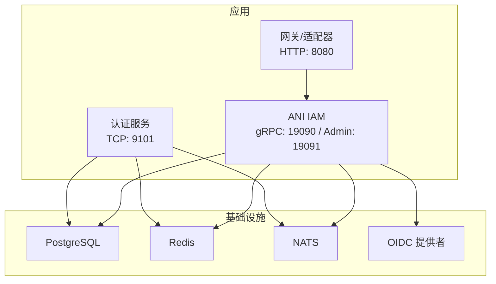
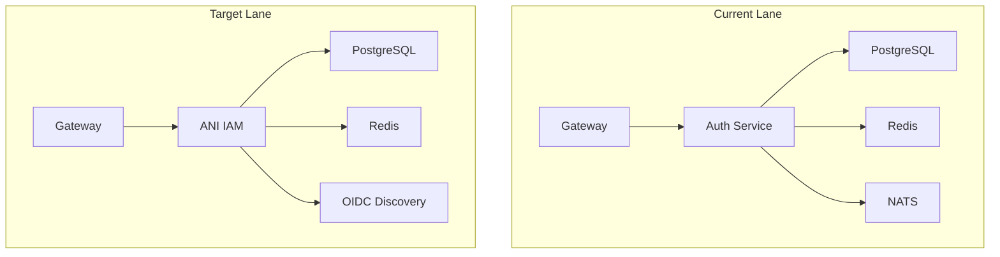
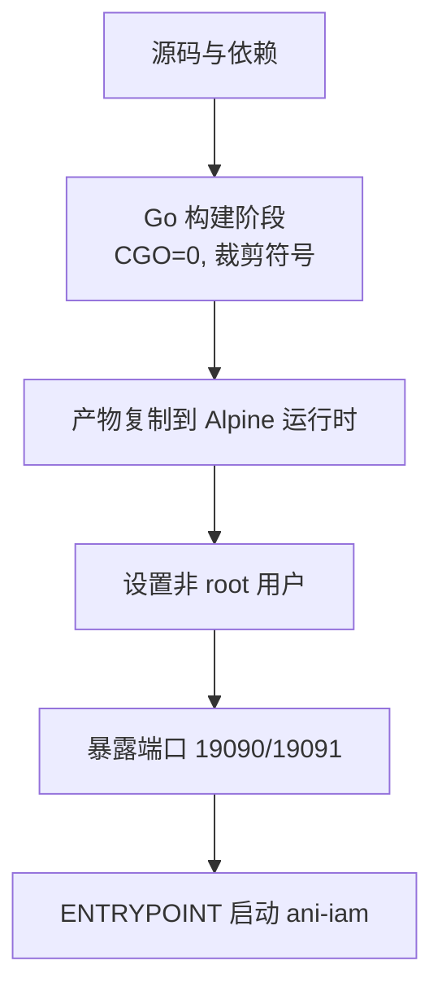
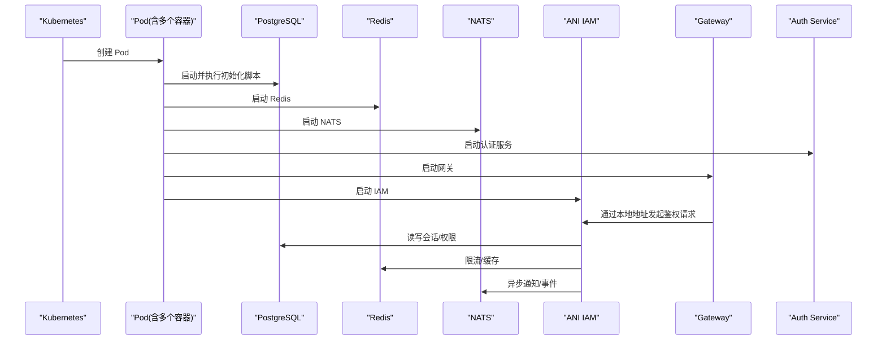
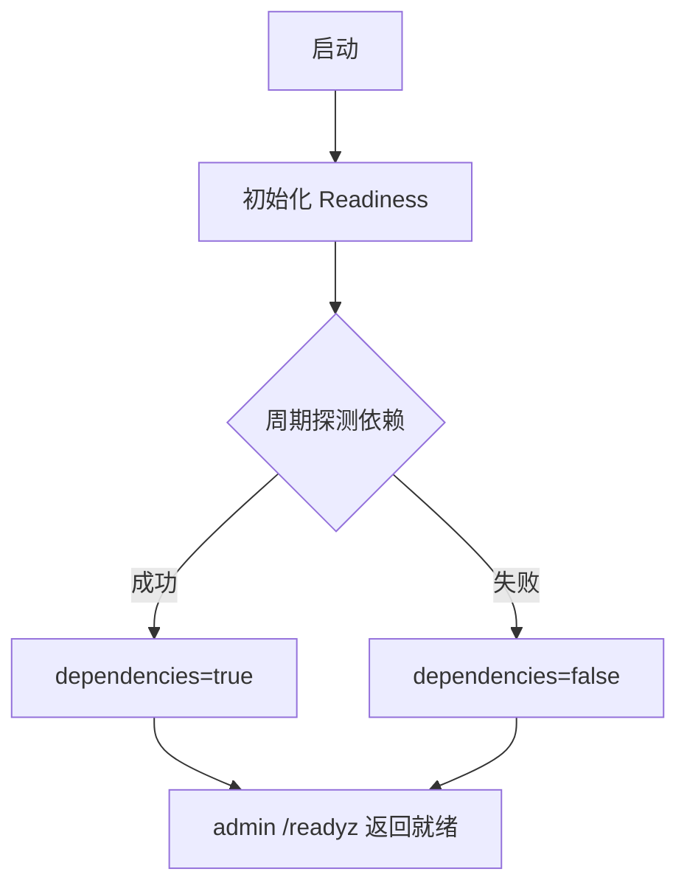
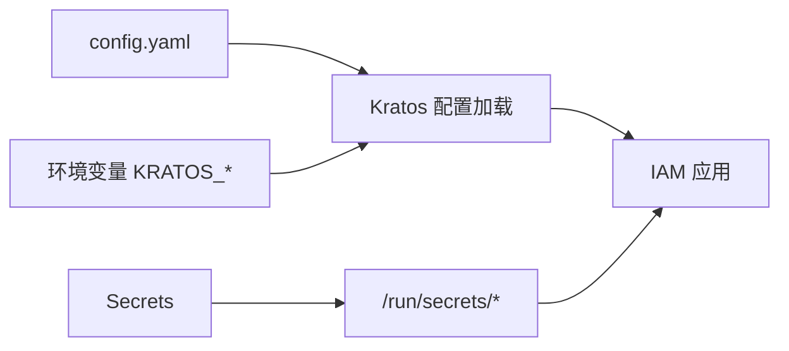
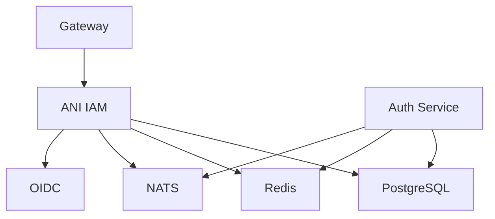

# 部署指南

<cite>
**本文引用的文件**
- [ani-iam.Dockerfile](file://deploy/cutover-fitness/ani-iam.Dockerfile)
- [current-auth.Dockerfile](file://deploy/cutover-fitness/current-auth.Dockerfile)
- [gateway.Dockerfile](file://deploy/cutover-fitness/gateway.Dockerfile)
- [probe.Dockerfile](file://deploy/cutover-fitness/probe.Dockerfile)
- [30-runtime.yaml](file://deploy/cutover-fitness/30-runtime.yaml)
- [config.yaml](file://configs/config.yaml)
- [main.go](file://cmd/server/main.go)
- [readiness.go](file://internal/server/readiness.go)
- [go.mod](file://go.mod)
</cite>

## 目录
1. [简介](#简介)
2. [项目结构](#项目结构)
3. [核心组件](#核心组件)
4. [架构总览](#架构总览)
5. [详细组件分析](#详细组件分析)
6. [依赖关系分析](#依赖关系分析)
7. [性能与高可用](#性能与高可用)
8. [CI/CD、蓝绿与灰度](#cicd蓝绿与灰度)
9. [监控告警与日志](#监控告警与日志)
10. [故障诊断](#故障诊断)
11. [结论](#结论)

## 简介
本指南面向生产环境，提供 ANI IAM 的完整容器化与 Kubernetes 部署方案。内容涵盖镜像构建、Kubernetes 编排（Deployment、Service、ConfigMap、Secret）、服务发现与健康检查、高可用与自动扩缩容、CI/CD 流水线、蓝绿与灰度发布策略，以及监控告警、日志收集和问题诊断方法。文档严格基于仓库内现有配置与代码进行分析说明。

## 项目结构
ANI IAM 采用 Go + Kratos 微服务架构，通过 gRPC 暴露认证、授权与管理接口；运行时依赖 PostgreSQL、Redis、NATS、OIDC 等外部系统；提供独立的 Admin 端口用于健康检查与运维。部署侧包含 Dockerfile 与 Kubernetes 清单，演示了当前/目标双通道运行时的编排方式。

图表来源
- [30-runtime.yaml:238-289](file://deploy/cutover-fitness/30-runtime.yaml#L238-L289)
- [30-runtime.yaml:26-106](file://deploy/cutover-fitness/30-runtime.yaml#L26-L106)
- [config.yaml:17-60](file://configs/config.yaml#L17-L60)

章节来源
- [go.mod:1-37](file://go.mod#L1-L37)
- [config.yaml:1-61](file://configs/config.yaml#L1-L61)

## 核心组件
- 入口与启动流程：命令行参数解析、配置加载、运行时初始化、最大进程数自适应、日志与追踪注入。
- 健康就绪：内置 Readiness 组件周期性探测依赖可用性，对外暴露 admin 端点用于就绪探针。
- 配置模型：通过配置文件与环境变量合并，定义 gRPC/Admin/TLS、运行时数据库/缓存/通知/OIDC 等。
- 容器镜像：多阶段构建，最小化运行时镜像并暴露必要端口。

章节来源
- [main.go:34-101](file://cmd/server/main.go#L34-L101)
- [readiness.go:9-74](file://internal/server/readiness.go#L9-L74)
- [config.yaml:1-61](file://configs/config.yaml#L1-L61)
- [ani-iam.Dockerfile:1-15](file://deploy/cutover-fitness/ani-iam.Dockerfile#L1-L15)

## 架构总览
下图展示了当前/目标双通道运行时的典型编排：每个通道包含数据库、缓存、消息总线、认证服务、网关与 IAM 实例，并通过 Secret/ConfigMap 注入凭据与配置。

图表来源
- [30-runtime.yaml:26-160](file://deploy/cutover-fitness/30-runtime.yaml#L26-L160)
- [30-runtime.yaml:187-332](file://deploy/cutover-fitness/30-runtime.yaml#L187-L332)

## 详细组件分析

### 容器镜像构建
- ANI IAM 镜像：使用 Go 基础镜像编译二进制，Alpine 作为运行时，以非 root 用户运行，暴露 gRPC 与 Admin 端口。
- 辅助镜像：认证服务、网关、探针镜像分别对应独立构建脚本，统一遵循安全与可重复构建原则。

图表来源
- [ani-iam.Dockerfile:1-15](file://deploy/cutover-fitness/ani-iam.Dockerfile#L1-L15)
- [current-auth.Dockerfile:1-24](file://deploy/cutover-fitness/current-auth.Dockerfile#L1-L24)
- [gateway.Dockerfile:1-24](file://deploy/cutover-fitness/gateway.Dockerfile#L1-L24)
- [probe.Dockerfile:1-6](file://deploy/cutover-fitness/probe.Dockerfile#L1-L6)

章节来源
- [ani-iam.Dockerfile:1-15](file://deploy/cutover-fitness/ani-iam.Dockerfile#L1-L15)
- [current-auth.Dockerfile:1-24](file://deploy/cutover-fitness/current-auth.Dockerfile#L1-L24)
- [gateway.Dockerfile:1-24](file://deploy/cutover-fitness/gateway.Dockerfile#L1-L24)
- [probe.Dockerfile:1-6](file://deploy/cutover-fitness/probe.Dockerfile#L1-L6)

### Kubernetes 编排与服务发现
- Deployment：为 Current/Target 两条通道分别定义 Pod 集合，包含数据库、缓存、消息总线、认证服务、网关与 IAM。
- 存储：使用 PVC 持久化 PostgreSQL 数据，并通过 Init 卷挂载迁移/种子脚本。
- 配置与密钥：通过 ConfigMap 与 Secret 注入数据库连接串、密码、TLS 证书、OIDC 客户端密钥等。
- 服务发现：同命名空间内通过 ClusterIP Service 或直连 127.0.0.1（Sidecar/单 Pod）进行通信；示例中网关与 IAM 在同一 Pod 内通过本地回环地址调用。

图表来源
- [30-runtime.yaml:26-160](file://deploy/cutover-fitness/30-runtime.yaml#L26-L160)
- [30-runtime.yaml:187-332](file://deploy/cutover-fitness/30-runtime.yaml#L187-L332)

章节来源
- [30-runtime.yaml:1-332](file://deploy/cutover-fitness/30-runtime.yaml#L1-L332)

### 健康检查与就绪状态
- IAM 就绪：Admin 端口提供 /readyz 端点，供 kubelet 或网关进行 HTTP 就绪探测。
- 依赖就绪：Readiness 组件周期性探测外部依赖（如数据库、缓存），只有当自身与依赖均就绪时，才标记为 Ready。
- 其他组件：PostgreSQL 使用 pg_isready，Redis 使用 redis-cli ping，NATS 使用 TCP 探测。

图表来源
- [readiness.go:9-74](file://internal/server/readiness.go#L9-L74)
- [30-runtime.yaml:241-245](file://deploy/cutover-fitness/30-runtime.yaml#L241-L245)

章节来源
- [readiness.go:9-74](file://internal/server/readiness.go#L9-L74)
- [30-runtime.yaml:41-72](file://deploy/cutover-fitness/30-runtime.yaml#L41-L72)
- [30-runtime.yaml:241-245](file://deploy/cutover-fitness/30-runtime.yaml#L241-L245)

### 配置与密钥管理
- 配置文件：集中定义网络、超时、TLS、工作负载注册表、PostgreSQL/Redis/NATS 连接、访问令牌、通知、OIDC 等。
- 密钥挂载：证书、私钥、客户端密钥、数据库连接串、密码等通过 Secret 挂载到只读卷。
- 环境变量：部分运行时参数通过环境变量注入，便于不同环境差异化。

图表来源
- [config.yaml:1-61](file://configs/config.yaml#L1-L61)
- [30-runtime.yaml:246-249](file://deploy/cutover-fitness/30-runtime.yaml#L246-L249)

章节来源
- [config.yaml:1-61](file://configs/config.yaml#L1-L61)
- [30-runtime.yaml:147-160](file://deploy/cutover-fitness/30-runtime.yaml#L147-L160)
- [30-runtime.yaml:305-328](file://deploy/cutover-fitness/30-runtime.yaml#L305-L328)

## 依赖关系分析
- 运行时依赖：PostgreSQL、Redis、NATS、OIDC 提供者。
- 内部依赖：IAM 与网关在同一 Pod 或通过 Service 通信；认证服务与网关协同完成鉴权流程。
- 外部依赖：OIDC 提供身份源；通知服务通过 gRPC 与 IAM 交互。

图表来源
- [config.yaml:17-60](file://configs/config.yaml#L17-L60)
- [30-runtime.yaml:26-160](file://deploy/cutover-fitness/30-runtime.yaml#L26-L160)
- [30-runtime.yaml:187-332](file://deploy/cutover-fitness/30-runtime.yaml#L187-L332)

章节来源
- [go.mod:1-37](file://go.mod#L1-L37)
- [config.yaml:17-60](file://configs/config.yaml#L17-L60)

## 性能与高可用
- 副本与扩缩容：建议将 IAM 与网关设置为多副本，结合 HorizontalPodAutoscaler 基于 CPU/内存或自定义指标自动扩缩容。
- 负载均衡：在集群入口或 Ingress/Gateway 层对网关进行负载均衡；IAM 通过 Service 暴露给网关。
- 健康检查：为所有关键组件配置 liveness 与 readiness 探针，确保快速故障隔离与自愈。
- 资源限制：为各容器设置 requests/limits，避免资源争用与 OOM。
- 存储与备份：PostgreSQL 使用有状态 PVC，配合备份策略与快照；Redis 根据业务选择持久化模式。
- 网络与安全：启用 TLS 加密 gRPC 与 HTTP 流量，使用 NetworkPolicy 限制跨命名空间访问。

[本节为通用实践指导，不直接引用具体文件]

## CI/CD、蓝绿与灰度
- 构建与推送：在 CI 中执行多阶段构建，生成 iam、gateway、auth、probe 镜像并推送到镜像仓库。
- 部署策略：
  - 蓝绿：同时维护 current/target 两套运行环境，通过切换流量或 Service 指向实现零停机切换。
  - 灰度：按租户/标识逐步放量，结合网关路由规则与标签选择器控制流量比例。
- 回滚：保留上一版本镜像与配置，出现问题时快速回滚至稳定版本。
- 验证：在预发环境执行冒烟测试与契约测试，确保 API 兼容性与功能正确性。

[本节为通用实践指导，不直接引用具体文件]

## 监控告警与日志
- 指标：启用 Prometheus 指标采集，暴露 gRPC/HTTP 指标与业务指标（如鉴权成功率、延迟）。
- 日志：结构化 JSON 日志输出，过滤敏感字段，集中收集到日志平台。
- 追踪：集成 OpenTelemetry，为关键链路添加 Span，便于问题定位。
- 告警：基于指标阈值与错误率设置告警规则，覆盖依赖不可用、鉴权失败率突增等场景。

[本节为通用实践指导，不直接引用具体文件]

## 故障诊断
- 启动失败：检查配置路径、环境变量、Secret 挂载是否正确；查看容器日志与退出码。
- 依赖不可用：确认 PostgreSQL/Redis/NATS 连通性；检查 Readiness 探测结果与依赖状态。
- 鉴权失败：核对 OIDC 客户端密钥、回调地址、域名与证书；检查网关与 IAM 的 TLS 配置。
- 性能问题：观察 CPU/内存使用、GC 情况、数据库慢查询与连接池；调整副本与资源限制。
- 网络问题：检查 NetworkPolicy、DNS 解析、Service 端点与证书域名匹配。

章节来源
- [main.go:104-131](file://cmd/server/main.go#L104-L131)
- [readiness.go:27-74](file://internal/server/readiness.go#L27-L74)
- [30-runtime.yaml:41-72](file://deploy/cutover-fitness/30-runtime.yaml#L41-L72)
- [30-runtime.yaml:241-245](file://deploy/cutover-fitness/30-runtime.yaml#L241-L245)

## 结论
本指南基于仓库内的 Dockerfile、Kubernetes 清单与源代码，提供了 ANI IAM 在生产环境的容器化与编排要点。通过合理的健康检查、配置与密钥管理、多副本与自动扩缩容、蓝绿/灰度发布策略，以及完善的监控告警与日志体系，可实现高可用、可观测、易运维的 IAM 服务。实际落地时请结合集群能力与企业规范进行细化与扩展。