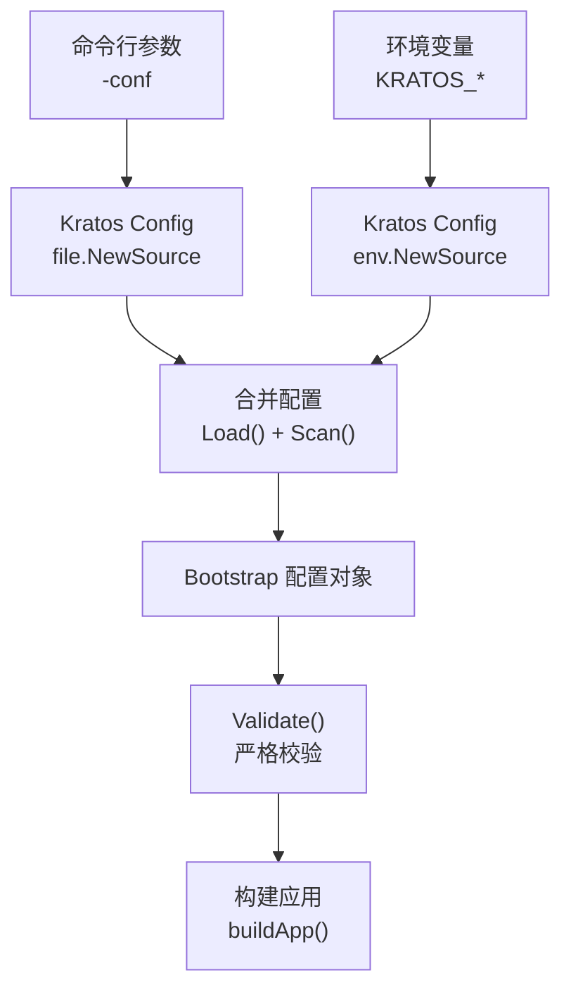
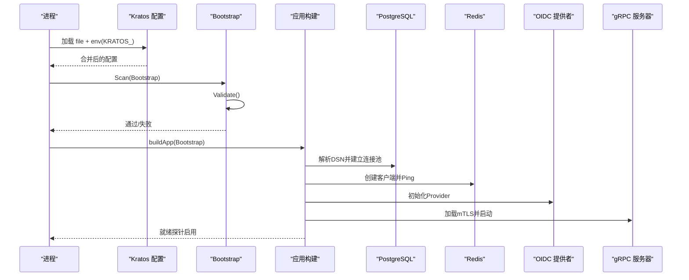
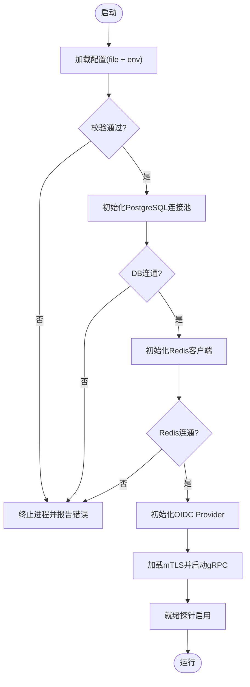
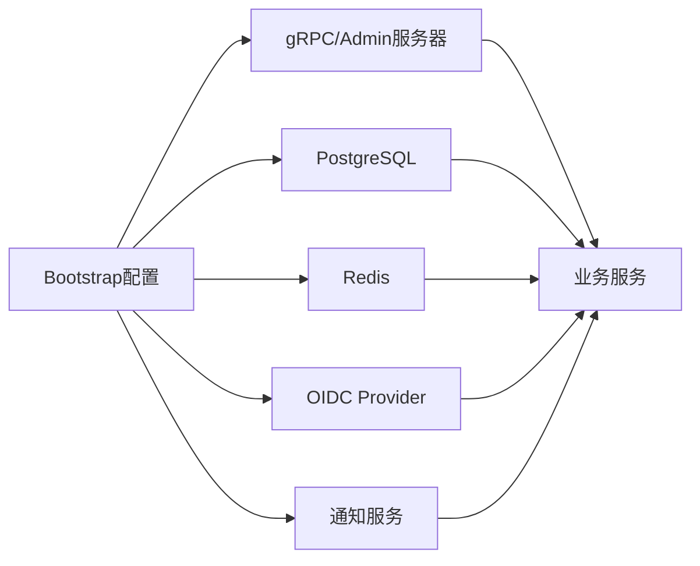

# 配置管理

<cite>
**本文引用的文件**
- [configs/config.yaml](file://configs/config.yaml)
- [internal/conf/conf.proto](file://internal/conf/conf.proto)
- [internal/conf/validate.go](file://internal/conf/validate.go)
- [cmd/server/main.go](file://cmd/server/main.go)
- [cmd/server/app.go](file://cmd/server/app.go)
- [deploy/cutover-fitness/30-runtime.yaml](file://deploy/cutover-fitness/30-runtime.yaml)
</cite>

## 目录
1. [简介](#简介)
2. [项目结构](#项目结构)
3. [核心组件](#核心组件)
4. [架构总览](#架构总览)
5. [详细组件分析](#详细组件分析)
6. [依赖关系分析](#依赖关系分析)
7. [性能考虑](#性能考虑)
8. [故障排查指南](#故障排查指南)
9. [结论](#结论)
10. [附录](#附录)

## 简介
本文件面向 ANI IAM 的配置管理，系统性说明配置文件结构、各配置项作用、环境变量覆盖机制、配置验证规则与默认值策略，并给出生产环境最佳实践（敏感信息保护、热更新、版本管理）、不同环境的配置示例与模板，以及配置故障排查与性能调优建议。目标是帮助读者在不深入代码的前提下，也能正确、安全地部署和运维 ANI IAM。

## 项目结构
ANI IAM 使用 Kratos 框架进行配置加载，启动时从文件系统读取 YAML 配置，并通过环境变量前缀 KRATOS_ 进行覆盖。配置模型由 Protobuf 定义，启动阶段会执行严格的校验，确保运行时依赖（PostgreSQL、Redis、OIDC、通知服务、gRPC TLS）可用且符合安全基线。

图表来源
- [cmd/server/main.go:82-95](file://cmd/server/main.go#L82-L95)
- [internal/conf/conf.proto:9-58](file://internal/conf/conf.proto#L9-L58)
- [internal/conf/validate.go:19-45](file://internal/conf/validate.go#L19-L45)

章节来源
- [cmd/server/main.go:22-32](file://cmd/server/main.go#L22-L32)
- [cmd/server/main.go:82-95](file://cmd/server/main.go#L82-L95)
- [internal/conf/conf.proto:9-58](file://internal/conf/conf.proto#L9-L58)

## 核心组件
- 配置模型：通过 Protobuf 定义 Bootstrap、Server、Runtime、PostgreSQL、Redis、AccessToken、Notification、OIDC 等结构体，作为配置的强类型契约。
- 配置加载：main 入口使用 Kratos 的 file 与 env 源组合加载，扫描为 Bootstrap 对象。
- 配置校验：启动前调用 Validate()，对网络、TLS、DSN、URL、超时、命名空间等进行严格检查，失败即退出。
- 运行时装配：根据配置初始化 gRPC/TLS、数据库连接池、Redis 客户端、OIDC Provider、通知客户端、工作负载注册表等，并在就绪探针中持续检查依赖健康。

章节来源
- [internal/conf/conf.proto:9-113](file://internal/conf/conf.proto#L9-L113)
- [cmd/server/main.go:82-95](file://cmd/server/main.go#L82-L95)
- [internal/conf/validate.go:19-168](file://internal/conf/validate.go#L19-L168)
- [cmd/server/app.go:369-744](file://cmd/server/app.go#L369-L744)

## 架构总览
下图展示了从配置到运行时的关键路径：配置加载 → 校验 → 资源初始化 → 服务暴露 → 健康检查。

图表来源
- [cmd/server/main.go:82-95](file://cmd/server/main.go#L82-L95)
- [cmd/server/app.go:369-744](file://cmd/server/app.go#L369-L744)
- [internal/conf/validate.go:19-168](file://internal/conf/validate.go#L19-L168)

## 详细组件分析

### 配置文件结构与字段说明
- profile：固定为 workload-isolated，用于隔离模式运行。
- server.grpc：gRPC 监听器配置，包括网络、地址、超时、mTLS（证书、私钥、客户端CA、网关客户端DNS名）。
- server.admin：管理接口监听器配置（网络、地址、超时）。
- server.shutdown_timeout：优雅关闭超时。
- runtime.postgresql：数据库连接字符串（DSN），要求受限角色、显式主机、非环回需 verify-full 及 CA。
- runtime.redis：缓存与会话限流等，包含地址、库号、命名空间、登录限制、窗口、连接/读写超时。
- runtime.access_token：访问令牌签发者、活跃密钥ID、私钥文件路径。
- runtime.notification：通知服务地址、TLS 证书链、动作URL基础地址、本地化、分发间隔、提交超时等。
- runtime.oidc：OIDC 提供者、发行者URL、客户端ID、客户端密钥文件、回调地址、重认证时间、HTTP 超时。
- runtime.environment / trust_domain：环境与信任域，必须小写且无空白字符。
- runtime.workload_registry_file / sha256：工作负载目标注册表文件及其精确哈希。
- runtime.policy_revision：策略修订的 SHA256 摘要。

章节来源
- [configs/config.yaml:1-61](file://configs/config.yaml#L1-L61)
- [internal/conf/conf.proto:9-113](file://internal/conf/conf.proto#L9-L113)

### 环境变量覆盖机制
- 配置源优先级：file 源与 env 源组合，env 以 KRATOS_ 为前缀覆盖对应配置项。
- 典型用法：将敏感或环境相关项（如 DSN、密钥文件路径、地址、超时）通过环境变量注入，避免硬编码在文件中。
- 日志过滤：内置日志处理器会过滤敏感键（如 dsn、password、token、private_key 等），降低泄露风险。

章节来源
- [cmd/server/main.go:82-95](file://cmd/server/main.go#L82-L95)
- [cmd/server/main.go:104-131](file://cmd/server/main.go#L104-L131)

### 配置验证规则与默认值策略
- 强制规则要点：
  - profile 必须为 workload-isolated。
  - gRPC 与 admin 监听器必须提供 tcp 网络、明确绑定 IP 与端口、超时；两者地址不可相同（除非特定回环动态端口）。
  - gRPC mTLS 必需，证书、私钥、客户端 CA 必须为绝对路径；网关客户端 DNS 名必须非空且合法。
  - PostgreSQL DSN 必须使用 postgres/postgresql 方案，用户名为受限角色 ani_iam_runtime，数据库名非根路径；非环回主机必须 sslmode=verify-full 并提供 CA 文件。
  - Redis 地址必须为环回端点；namespace 非空且不含空白；login_limit 正数；login_window/dial/read/write 超时有上限。
  - access_token issuer 固定为 ani-iam；active_key_id 必填；private_key_file 为绝对路径。
  - notification address 必须为显式部署端点；证书与密钥文件为绝对路径；server_dns_name 必须规范；console/boss action URL 必须为 HTTPS 且无多余片段；locale 仅支持 en-US 或 zh-CN；dispatch_interval/submission_timeout 有上限。
  - oidc provider 必须为 dex；issuer_url 必须为规范 HTTPS 或环回 HTTP；client_id 固定为 ani-console；client_secret_file 为绝对路径；两个 redirect URI 必须不同且为 HTTPS；recent_reauthentication/http_timeout 有上限。
  - policy_revision 必须以 sha256: 开头且为有效摘要。
- 默认值策略：
  - 多数关键项无“隐式默认”，缺失时会直接报错，确保配置显式且可审计。
  - 超时类字段若未设置会被拒绝，防止无限等待。

章节来源
- [internal/conf/validate.go:19-168](file://internal/conf/validate.go#L19-L168)
- [internal/conf/validate.go:170-351](file://internal/conf/validate.go#L170-L351)

### 生产环境最佳实践
- 敏感信息保护：
  - 所有密钥、密码、DSN、客户端密钥均通过文件路径引用，并由外部 Secret 挂载到只读卷（如 /run/secrets）。
  - 日志自动过滤敏感键，避免误输出。
  - 非环回数据库必须启用 verify-full 并指定 CA 文件，禁止禁用 SSL。
- 配置热更新：
  - 当前实现为启动时一次性加载并校验，未实现运行时热更新。如需变更，应滚动重启 Pod。
  - 可通过环境变量在部署层快速切换配置项，减少文件变更。
- 配置版本管理：
  - 工作负载注册表与策略修订均以精确哈希锁定，确保可追溯与一致性。
  - 建议在 CI/CD 中生成并校验这些哈希，纳入制品发布流程。

章节来源
- [cmd/server/main.go:104-131](file://cmd/server/main.go#L104-L131)
- [internal/conf/validate.go:117-123](file://internal/conf/validate.go#L117-L123)
- [internal/conf/validate.go:159-167](file://internal/conf/validate.go#L159-L167)
- [deploy/cutover-fitness/30-runtime.yaml:238-249](file://deploy/cutover-fitness/30-runtime.yaml#L238-L249)

### 不同环境配置示例与模板
- 开发环境（本地回环）：
  - PostgreSQL：DSN 指向 127.0.0.1，sslmode=disable。
  - Redis：addr=127.0.0.1:6379，database=0，namespace 唯一。
  - OIDC：issuer_url 可为环回 HTTP（如 http://127.0.0.1:5556/dex）。
  - gRPC/admin：监听 127.0.0.1 端口，mTLS 证书路径指向本地 Secret。
- 测试环境（容器内联）：
  - 同开发，但可使用独立 namespace 与数据库实例，保持隔离。
  - 通知服务地址可指向同一集群内的服务名。
- 生产环境（独立部署）：
  - PostgreSQL：非环回主机，sslmode=verify-full，sslrootcert 指定 CA。
  - Redis：建议使用专用实例或分库，namespace 按环境区分。
  - OIDC：issuer_url 为 HTTPS；回调地址为 HTTPS。
  - gRPC：对外暴露时需 mTLS，gateway_client_dns_name 与证书匹配。
  - 所有密钥通过 Secret 挂载，禁止明文写入配置。

模板要点（以 YAML 形式组织，具体值按环境替换）：
- profile: workload-isolated
- server.grpc.network: tcp
- server.grpc.addr: 显式IP:端口
- server.grpc.timeout: 合理超时（如 1s）
- server.grpc.tls.certificate_file/private_key_file/client_ca_file/gateway_client_dns_name: 绝对路径与合法DNS
- server.admin.addr: 显式IP:端口
- server.shutdown_timeout: 合理关闭超时（如 5s）
- runtime.postgresql.dsn: 受限角色、显式主机、必要SSL参数
- runtime.redis.*: 地址、库号、命名空间、限制、窗口、超时
- runtime.access_token.*: issuer、active_key_id、私钥文件
- runtime.notification.*: 地址、证书链、action URL、locale、间隔、超时
- runtime.oidc.*: provider=dex、issuer_url、client_id、secret_file、redirect URIs、超时
- runtime.environment/trust_domain: 小写、无空白
- runtime.workload_registry_file/sha256: 绝对路径与精确哈希
- runtime.policy_revision: sha256: 前缀+有效摘要

章节来源
- [configs/config.yaml:1-61](file://configs/config.yaml#L1-L61)
- [internal/conf/validate.go:170-351](file://internal/conf/validate.go#L170-L351)
- [deploy/cutover-fitness/30-runtime.yaml:238-249](file://deploy/cutover-fitness/30-runtime.yaml#L238-L249)

### 配置与运行时装配流程图

图表来源
- [cmd/server/app.go:369-744](file://cmd/server/app.go#L369-L744)
- [internal/conf/validate.go:19-168](file://internal/conf/validate.go#L19-L168)

## 依赖关系分析
- 配置到运行时依赖：
  - PostgreSQL：DSN 解析、连接池创建、Ping 检测、Schema/约束校验。
  - Redis：客户端创建、Ping 检测、限流与操作存储。
  - OIDC：Provider 初始化、回调地址校验、HTTP 超时控制。
  - gRPC：mTLS 加载、监听器启动、中间件注入。
  - 通知服务：TLS 客户端、动作 URL 校验、异步分发。
- 耦合与内聚：
  - 配置模型集中定义，校验逻辑集中处理，运行时装配集中在 buildApp，内聚性良好。
  - 外部依赖（DB、Redis、OIDC、通知）通过配置注入，便于替换与测试。

图表来源
- [cmd/server/app.go:369-744](file://cmd/server/app.go#L369-L744)
- [internal/conf/conf.proto:9-113](file://internal/conf/conf.proto#L9-L113)

章节来源
- [cmd/server/app.go:369-744](file://cmd/server/app.go#L369-L744)
- [internal/conf/conf.proto:9-113](file://internal/conf/conf.proto#L9-L113)

## 性能考虑
- 超时与限流：
  - gRPC/admin 超时、Redis 连接/读写超时、OIDC HTTP 超时、通知分发间隔与提交超时均需合理设置，避免雪崩与长尾。
  - Redis login_limit/login_window 控制登录频率，防止暴力破解与资源耗尽。
- 连接池与重试：
  - PostgreSQL 连接池大小应根据并发与资源调整；确保 Ping 成功后再提供服务。
  - 通知分发采用定时任务与超时控制，避免阻塞主流程。
- 日志与观测：
  - 日志级别默认 Info，敏感键被过滤；结合追踪属性输出，便于定位问题。
  - 就绪探针与健康检查应在依赖恢复后自动恢复服务。

章节来源
- [cmd/server/main.go:104-131](file://cmd/server/main.go#L104-L131)
- [internal/conf/validate.go:92-104](file://internal/conf/validate.go#L92-L104)
- [internal/conf/validate.go:198-222](file://internal/conf/validate.go#L198-L222)
- [cmd/server/app.go:669-744](file://cmd/server/app.go#L669-L744)

## 故障排查指南
- 启动失败常见原因：
  - profile 不为 workload-isolated：检查配置文件首行。
  - gRPC/admin 地址冲突或未显式绑定 IP：确保不同端口与明确 IP。
  - gRPC mTLS 缺失或路径非绝对：补齐证书与私钥，并确保绝对路径。
  - PostgreSQL DSN 不合规：确认用户名为 ani_iam_runtime、数据库名非根、非环回需 verify-full 与 CA。
  - Redis 地址非环回或 namespace 为空：调整为环回地址与唯一命名空间。
  - OIDC issuer_url 非 HTTPS 或非环回 HTTP：修正为规范地址。
  - policy_revision 格式错误：确保以 sha256: 开头且为有效摘要。
- 运行时健康：
  - 就绪探针失败：检查 DB/Redis/OIDC/通知服务连通性与证书有效性。
  - 通知分发失败：检查 action URL 是否为 HTTPS、locale 是否受支持、分发间隔与超时是否合理。
- 日志与调试：
  - 查看日志中的敏感键过滤情况，确认未泄露凭证。
  - 结合追踪属性与服务元数据（名称、版本、profile）定位问题。

章节来源
- [internal/conf/validate.go:19-168](file://internal/conf/validate.go#L19-L168)
- [internal/conf/validate.go:170-351](file://internal/conf/validate.go#L170-L351)
- [cmd/server/app.go:669-744](file://cmd/server/app.go#L669-L744)
- [cmd/server/main.go:104-131](file://cmd/server/main.go#L104-L131)

## 结论
ANI IAM 的配置管理以强类型模型与严格校验为核心，确保生产环境的安全性与稳定性。通过环境变量覆盖、Secret 挂载、精确哈希锁定与就绪探针，实现了可追溯、可回滚、可观测的部署体验。遵循本文的最佳实践与排查指南，可有效降低配置错误带来的风险，提升系统可靠性。

## 附录
- 环境变量前缀：KRATOS_
- 日志过滤键：args、authorization、cookie、credential、dsn、password、postgresql.dsn、private_key、private_key_file、redis.password、set-cookie、token
- 部署参考：Kubernetes Deployment 中将配置与密钥以 Secret 形式挂载至只读卷，并通过 -conf 参数指定配置文件路径。

章节来源
- [cmd/server/main.go:82-95](file://cmd/server/main.go#L82-L95)
- [cmd/server/main.go:104-131](file://cmd/server/main.go#L104-L131)
- [deploy/cutover-fitness/30-runtime.yaml:238-249](file://deploy/cutover-fitness/30-runtime.yaml#L238-L249)