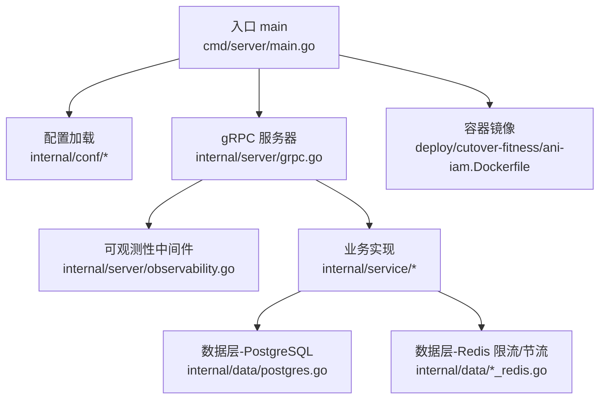
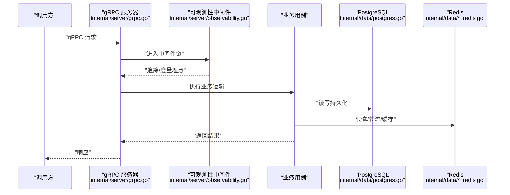
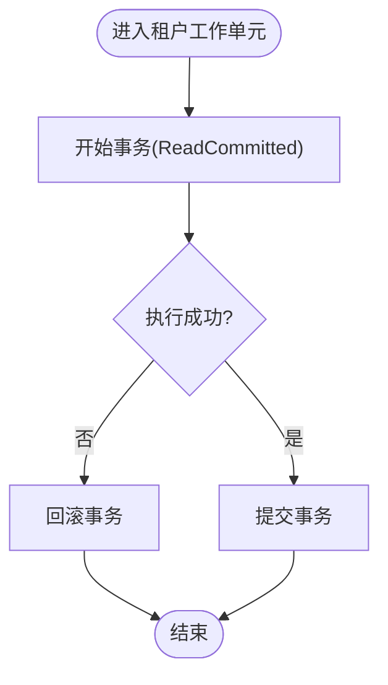
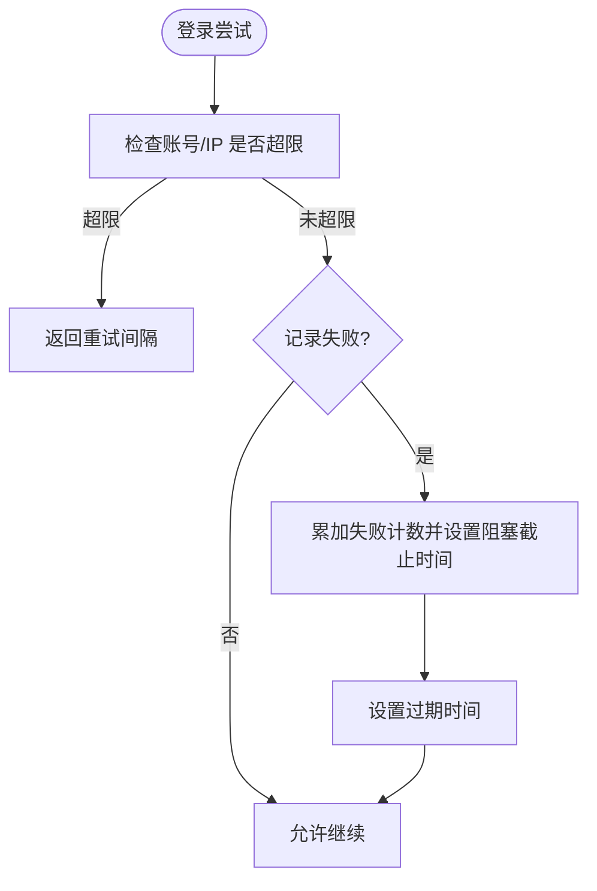
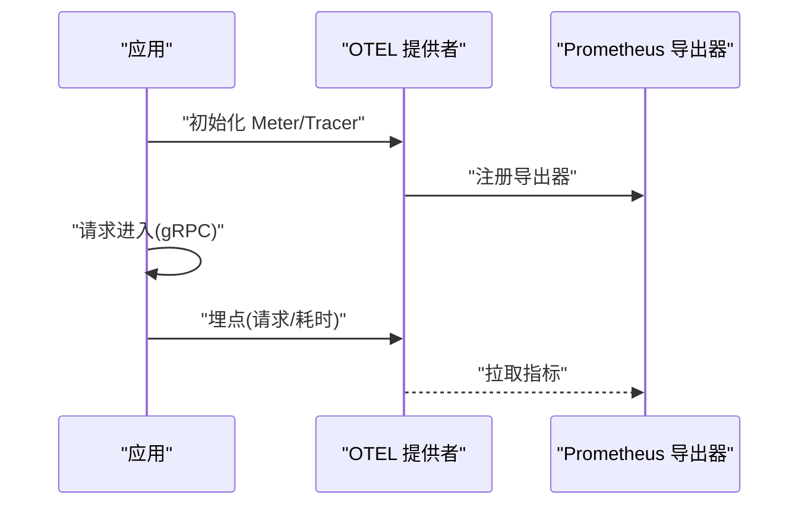
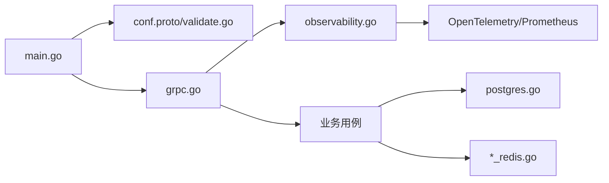

# 技术栈

<cite>
**本文引用的文件**
- [go.mod](file://go.mod)
- [configs/config.yaml](file://configs/config.yaml)
- [cmd/server/main.go](file://cmd/server/main.go)
- [internal/conf/conf.proto](file://internal/conf/conf.proto)
- [internal/conf/validate.go](file://internal/conf/validate.go)
- [internal/data/postgres.go](file://internal/data/postgres.go)
- [internal/data/login_throttle_redis.go](file://internal/data/login_throttle_redis.go)
- [internal/data/api_key_creation_limiter_redis.go](file://internal/data/api_key_creation_limiter_redis.go)
- [internal/server/grpc.go](file://internal/server/grpc.go)
- [internal/server/observability.go](file://internal/server/observability.go)
- [internal/data/access_token_jwx.go](file://internal/data/access_token_jwx.go)
- [deploy/cutover-fitness/ani-iam.Dockerfile](file://deploy/cutover-fitness/ani-iam.Dockerfile)
</cite>

## 目录
1. [简介](#简介)
2. [项目结构](#项目结构)
3. [核心组件](#核心组件)
4. [架构总览](#架构总览)
5. [详细组件分析](#详细组件分析)
6. [依赖关系分析](#依赖关系分析)
7. [性能考量](#性能考量)
8. [故障排查指南](#故障排查指南)
9. [结论](#结论)
10. [附录](#附录)

## 简介
本技术栈文档面向 ANI IAM 项目，系统性地说明 Go 语言、Kratos 微服务框架、PostgreSQL、Redis、gRPC、OpenTelemetry、JWX、Docker/Kubernetes 等关键技术的选型理由、集成方式与配置要点。内容基于仓库中的源码与配置文件进行梳理，帮助读者快速理解运行时如何构建、运行与观测。

## 项目结构
ANI IAM 采用分层组织：API 契约（Protobuf/gRPC）、业务用例（biz）、数据访问（data）、服务端（server）与入口（cmd），并通过配置中心（config.yaml + Kratos config）驱动运行时行为。可观测性通过 OpenTelemetry 与 Prometheus 暴露指标；部署使用多阶段 Docker 镜像。

图表来源
- [cmd/server/main.go:34-101](file://cmd/server/main.go#L34-L101)
- [internal/server/grpc.go:14-50](file://internal/server/grpc.go#L14-L50)
- [internal/server/observability.go:41-171](file://internal/server/observability.go#L41-L171)
- [internal/data/postgres.go:22-59](file://internal/data/postgres.go#L22-L59)
- [internal/data/login_throttle_redis.go:106-169](file://internal/data/login_throttle_redis.go#L106-L169)
- [deploy/cutover-fitness/ani-iam.Dockerfile:1-15](file://deploy/cutover-fitness/ani-iam.Dockerfile#L1-L15)

章节来源
- [cmd/server/main.go:34-101](file://cmd/server/main.go#L34-L101)
- [configs/config.yaml:1-61](file://configs/config.yaml#L1-L61)
- [internal/conf/conf.proto:9-113](file://internal/conf/conf.proto#L9-L113)

## 核心组件
- 运行时与配置
  - 启动流程：解析命令行参数、初始化日志与 CPU 配额、加载配置文件并扫描为 Bootstrap 结构体，随后构建并运行应用。
  - 配置模型：通过 conf.proto 定义 Server、Runtime、PostgreSQL、Redis、AccessToken、Notification、OIDC 等字段，并在 validate.go 中做严格校验（如 gRPC mTLS、Redis 地址回环、超时范围等）。
- gRPC 服务
  - 强制双向 TLS 与最小版本限制，注册认证、授权、管理三类服务，支持中间件链。
- 可观测性
  - 基于 OpenTelemetry 的 Tracing/Metrics，结合 Kratos 扩展导出到 Prometheus，提供请求计数、延迟直方图、就绪状态等指标。
- 数据持久化
  - PostgreSQL：使用 pgx/v5 连接池，封装 Unit of Work 与事务边界，错误映射为领域错误。
  - Redis：用于登录节流、刷新令牌限频、API Key 创建限速、用量聚合缓冲等。
- 安全与令牌
  - JWX：对访问令牌与工作负载令牌进行签发与校验，包含声明校验、密钥轮换、受众/边界约束等。

章节来源
- [cmd/server/main.go:34-101](file://cmd/server/main.go#L34-L101)
- [internal/conf/conf.proto:9-113](file://internal/conf/conf.proto#L9-L113)
- [internal/conf/validate.go:19-90](file://internal/conf/validate.go#L19-L90)
- [internal/server/grpc.go:14-50](file://internal/server/grpc.go#L14-L50)
- [internal/server/observability.go:41-171](file://internal/server/observability.go#L41-L171)
- [internal/data/postgres.go:22-59](file://internal/data/postgres.go#L22-L59)
- [internal/data/login_throttle_redis.go:106-169](file://internal/data/login_throttle_redis.go#L106-L169)
- [internal/data/api_key_creation_limiter_redis.go:46-93](file://internal/data/api_key_creation_limiter_redis.go#L46-L93)
- [internal/data/access_token_jwx.go:202-362](file://internal/data/access_token_jwx.go#L202-L362)

## 架构总览
下图展示从请求进入 gRPC 到数据访问与可观测性的整体链路。

图表来源
- [internal/server/grpc.go:14-50](file://internal/server/grpc.go#L14-L50)
- [internal/server/observability.go:160-171](file://internal/server/observability.go#L160-L171)
- [internal/data/postgres.go:22-59](file://internal/data/postgres.go#L22-L59)
- [internal/data/login_throttle_redis.go:106-169](file://internal/data/login_throttle_redis.go#L106-L169)

## 详细组件分析

### Go 语言与模块
- 版本要求：Go 1.26.7（由 go.mod 指定）。
- 主要依赖：Kratos v3、gRPC、pgx/v5、go-redis/v9、lestrrat-go/jwx/v3、OpenTelemetry SDK/Exporter、Prometheus 客户端等。
- 构建产物：二进制名称 ani-iam，暴露端口 19090（gRPC）与 19091（Admin）。

章节来源
- [go.mod:1-37](file://go.mod#L1-L37)
- [deploy/cutover-fitness/ani-iam.Dockerfile:1-15](file://deploy/cutover-fitness/ani-iam.Dockerfile#L1-L15)

### Kratos 微服务框架
- 优势
  - 内置配置、日志、中间件、传输抽象，便于快速搭建高可用服务。
  - 与 OpenTelemetry 深度集成，统一埋点与指标导出。
  - 支持 gRPC 双向 TLS、反射禁用、超时控制等生产特性。
- 集成方式
  - 通过 NewGRPCServer 构造 gRPC 服务器，注入中间件链（恢复、元数据、追踪、日志、度量、校验）。
  - 注册认证、授权、管理三类服务，未实现方法返回 Unimplemented。

章节来源
- [internal/server/grpc.go:14-50](file://internal/server/grpc.go#L14-L50)
- [internal/server/observability.go:160-171](file://internal/server/observability.go#L160-L171)

### PostgreSQL 数据库
- 选择原因
  - 强一致事务、丰富生态、pgx/v5 高性能驱动，适合 IAM 的复杂关系与审计写入。
- 连接与事务
  - 使用 pgxpool 建立连接池；Unit of Work 以 ReadCommitted 隔离级别开启事务，失败时回滚，成功提交。
  - 将底层 pg 错误码映射为领域错误（如版本冲突、权限拒绝、唯一约束冲突等）。
- 配置来源
  - Runtime.postgresql.dsn 在配置文件中提供，供数据层初始化连接。

图表来源
- [internal/data/postgres.go:22-59](file://internal/data/postgres.go#L22-L59)

章节来源
- [internal/data/postgres.go:22-59](file://internal/data/postgres.go#L22-L59)
- [configs/config.yaml:22-24](file://configs/config.yaml#L22-L24)

### Redis 缓存、会话与限流
- 作用
  - 登录节流：按账号/IP 维度统计失败次数，指数退避阻塞，防止暴力破解。
  - 刷新令牌限频：按令牌摘要限制刷新频率。
  - API Key 创建限速：按租户+主体限制单位时间内的创建次数。
  - 用量聚合缓冲：异步汇总 API Key 使用情况，失败时回退至 Redis 队列。
- 配置项
  - addr、database、namespace、login_limit、login_window、dial/read/write_timeout 等。
- 实现要点
  - 使用 Lua 脚本保证原子性与一致性。
  - 严格的配置校验（窗口、基数、超时范围等）。

图表来源
- [internal/data/login_throttle_redis.go:34-89](file://internal/data/login_throttle_redis.go#L34-L89)
- [internal/data/login_throttle_redis.go:122-169](file://internal/data/login_throttle_redis.go#L122-L169)

章节来源
- [configs/config.yaml:24-32](file://configs/config.yaml#L24-L32)
- [internal/conf/validate.go:198-222](file://internal/conf/validate.go#L198-L222)
- [internal/data/login_throttle_redis.go:106-169](file://internal/data/login_throttle_redis.go#L106-L169)
- [internal/data/api_key_creation_limiter_redis.go:46-93](file://internal/data/api_key_creation_limiter_redis.go#L46-L93)

### gRPC 通信协议与优化
- 安全与传输
  - 强制双向 TLS，最小 TLS 版本与客户端证书校验，禁用反射减少攻击面。
  - 网络类型 tcp，绑定明确地址与端口，支持超时控制。
- 服务注册
  - 统一注册认证、授权、管理三类服务，未实现方法返回标准 Unimplemented。
- 性能建议
  - 合理设置超时与连接池大小（由 pgxpool/go-redis 默认策略与配置决定）。
  - 利用中间件链进行统一的追踪与度量，避免重复开销。

章节来源
- [internal/server/grpc.go:14-50](file://internal/server/grpc.go#L14-L50)
- [configs/config.yaml:2-16](file://configs/config.yaml#L2-L16)

### OpenTelemetry 可观测性
- 能力
  - 启用 Exemplar，注册 Go/进程采集器，创建 Prometheus 导出器。
  - 设置 MeterProvider/TracerProvider，注入文本传播器（TraceContext/Baggage）。
  - 暴露就绪状态、API Key 异常计数、快照时间等自定义指标。
  - 通过 Kratos 中间件自动收集请求数与耗时直方图。
- 生命周期
  - Shutdown 时优雅关闭 Provider。

图表来源
- [internal/server/observability.go:41-143](file://internal/server/observability.go#L41-L143)
- [internal/server/observability.go:160-171](file://internal/server/observability.go#L160-L171)

章节来源
- [internal/server/observability.go:41-171](file://internal/server/observability.go#L41-L171)

### JWX 令牌处理
- 访问令牌
  - 签发与校验：强制必要声明（subject、audience、token_id、session_id、grant_id 等），校验受众与边界组合、有效期与签发时间。
  - 密钥管理：支持活跃密钥 ID 与私钥文件路径，校验器根据配置验证签名。
- 工作负载令牌
  - 支持密钥轮换：旧密钥仍可在有效期内验证新签发的令牌，移除旧密钥后不再接受。
- 安全约束
  - 严格的时间窗口与最大生命周期限制，防止令牌滥用。

章节来源
- [internal/data/access_token_jwx.go:202-362](file://internal/data/access_token_jwx.go#L202-L362)
- [configs/config.yaml:33-36](file://configs/config.yaml#L33-L36)

### Docker 容器化部署
- 多阶段构建
  - 构建阶段：固定 Go 镜像，启用缓存，CGO_ENABLED=0，编译裁剪符号与调试信息。
  - 运行阶段：Alpine 基础镜像，非 root 用户运行，仅暴露必要端口。
- 可移植性
  - 通过只读二进制与最小依赖镜像降低攻击面与体积。

章节来源
- [deploy/cutover-fitness/ani-iam.Dockerfile:1-15](file://deploy/cutover-fitness/ani-iam.Dockerfile#L1-L15)

## 依赖关系分析
- 运行时依赖
  - Kratos v3 作为微服务框架，gRPC 作为传输协议。
  - pgx/v5 作为 PostgreSQL 驱动，go-redis/v9 作为 Redis 客户端。
  - lestrrat-go/jwx/v3 负责 JWT/JWS/JWK 操作。
  - OpenTelemetry SDK/Exporter 与 Prometheus 客户端用于可观测性。
- 配置依赖
  - 通过 conf.proto 定义配置结构，validate.go 进行强校验，确保运行时安全与稳定性。

图表来源
- [cmd/server/main.go:34-101](file://cmd/server/main.go#L34-L101)
- [internal/conf/conf.proto:9-113](file://internal/conf/conf.proto#L9-L113)
- [internal/conf/validate.go:19-90](file://internal/conf/validate.go#L19-L90)
- [internal/server/grpc.go:14-50](file://internal/server/grpc.go#L14-L50)
- [internal/server/observability.go:41-171](file://internal/server/observability.go#L41-L171)
- [internal/data/postgres.go:22-59](file://internal/data/postgres.go#L22-L59)
- [internal/data/login_throttle_redis.go:106-169](file://internal/data/login_throttle_redis.go#L106-L169)

章节来源
- [go.mod:1-37](file://go.mod#L1-L37)
- [internal/conf/conf.proto:9-113](file://internal/conf/conf.proto#L9-L113)
- [internal/conf/validate.go:19-90](file://internal/conf/validate.go#L19-L90)

## 性能考量
- 数据库
  - 使用 pgx/v5 连接池与 ReadCommitted 隔离级别，平衡一致性与并发。
  - 错误映射减少上层判断成本，提升可维护性。
- 缓存与限流
  - Redis Lua 脚本保障原子性，降低竞争条件与额外往返。
  - 登录节流采用指数退避，抑制突发流量与暴力攻击。
- 可观测性
  - 通过 Kratos 中间件统一埋点，避免业务代码侵入；Exemplar 关联指标与追踪，便于定位热点。
- 网络与安全
  - gRPC 双向 TLS 与最小版本限制，减少握手开销同时提升安全性。
  - 禁用反射，缩小攻击面。

[本节为通用指导，不直接分析具体文件]

## 故障排查指南
- 启动与配置
  - 若 gRPC mTLS 配置缺失或路径非法，将在启动阶段报错；请确认证书、私钥、客户端 CA 与 DNS 名称均为绝对路径且有效。
  - Redis 地址必须为回环 IP，且 database、namespace、超时等需满足校验规则。
- 数据库问题
  - 事务失败会回滚，常见错误包括版本冲突、权限拒绝、唯一约束冲突等；可通过错误码与领域错误定位。
- Redis 限流
  - 登录节流与刷新令牌限频失败时会返回带 RetryAfter 的错误；检查 namespace、limit、window 配置与 Redis 连通性。
- 可观测性
  - 若指标未上报，检查 OTLP 导出器与 Prometheus 抓取端点；确认 MeterProvider/TracerProvider 已正确设置。

章节来源
- [internal/conf/validate.go:19-90](file://internal/conf/validate.go#L19-L90)
- [internal/conf/validate.go:198-222](file://internal/conf/validate.go#L198-L222)
- [internal/data/postgres.go:195-231](file://internal/data/postgres.go#L195-L231)
- [internal/data/login_throttle_redis.go:122-169](file://internal/data/login_throttle_redis.go#L122-L169)
- [internal/server/observability.go:41-143](file://internal/server/observability.go#L41-L143)

## 结论
ANI IAM 以 Go + Kratos 为核心，结合 PostgreSQL 与 Redis 提供可靠的数据与限流能力，通过 gRPC 与双向 TLS 保障通信安全，借助 OpenTelemetry 实现全链路可观测性，并使用 JWX 完成令牌的安全签发与校验。容器化镜像遵循最小化原则，便于在 Kubernetes 环境中编排与扩展。

## 附录
- 版本兼容性与升级建议
  - Go：锁定 1.26.7，升级前需评估依赖兼容性。
  - Kratos/gRPC：保持与当前 v3 及 gRPC 版本对齐，注意生成代码的版本约束。
  - pgx/v5：关注连接池与事务语义变更，升级后进行回归测试。
  - go-redis/v9：关注 Lua 脚本与命令行为变化，确保限流逻辑不受影响。
  - JWX：关注密钥算法与声明校验变更，确保令牌兼容。
  - OpenTelemetry：关注 SDK/Exporter 版本匹配，避免指标丢失或格式不兼容。
  - 容器镜像：固定基础镜像哈希，确保构建可重现。

[本节为通用指导，不直接分析具体文件]