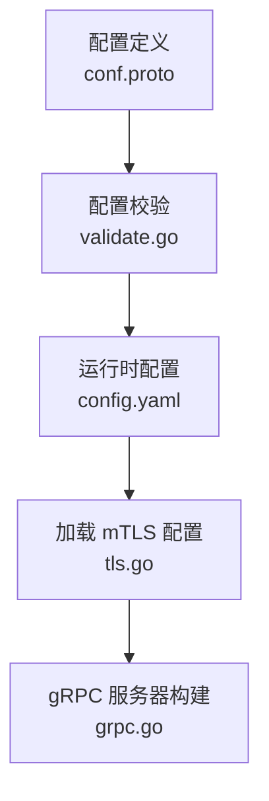
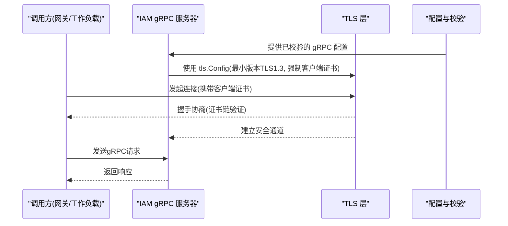
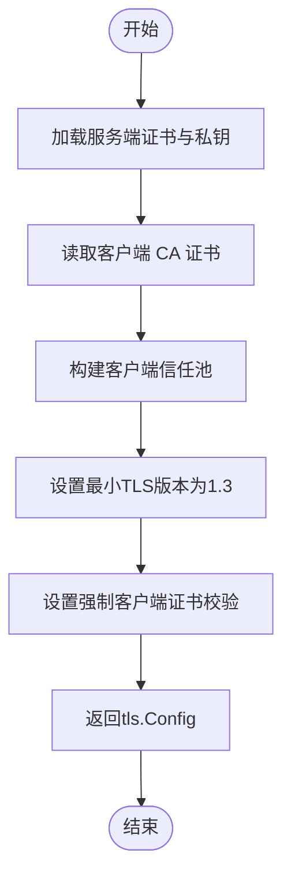
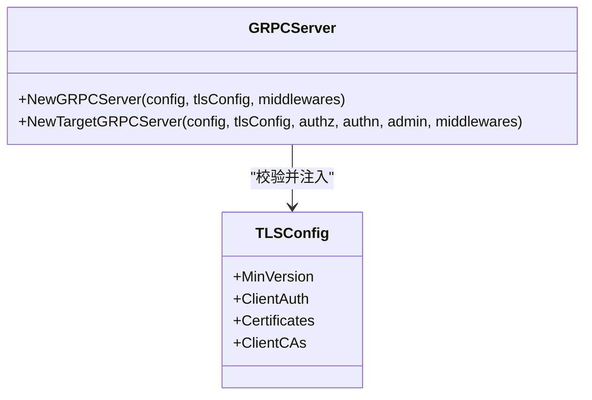
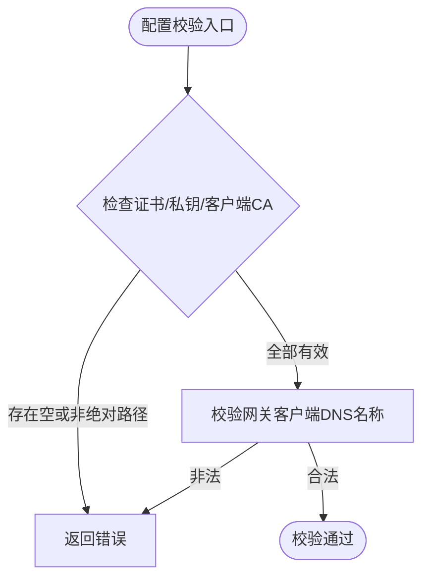
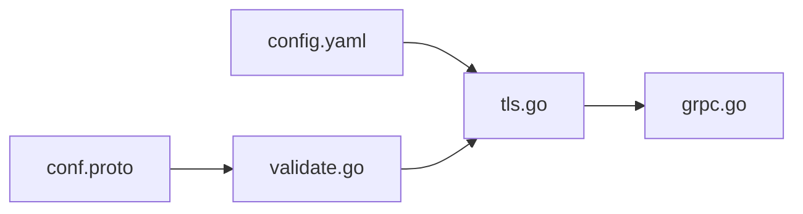

# TLS安全中间件

<cite>
**本文引用的文件**
- [internal/server/tls.go](file://internal/server/tls.go)
- [internal/server/grpc.go](file://internal/server/grpc.go)
- [internal/conf/conf.proto](file://internal/conf/conf.proto)
- [internal/conf/validate.go](file://internal/conf/validate.go)
- [configs/config.yaml](file://configs/config.yaml)
- [tests/integration/workload_invocation_test.go](file://tests/integration/workload_invocation_test.go)
- [sdk/grpcworkload/http.go](file://sdk/grpcworkload/http.go)
- [sdk/grpcworkload/transport_test.go](file://sdk/grpcworkload/transport_test.go)
- [deploy/cutover-fitness/20-network.yaml.tmpl](file://deploy/cutover-fitness/20-network.yaml.tmpl)
</cite>

## 目录
1. [简介](#简介)
2. [项目结构](#项目结构)
3. [核心组件](#核心组件)
4. [架构总览](#架构总览)
5. [详细组件分析](#详细组件分析)
6. [依赖关系分析](#依赖关系分析)
7. [性能考虑](#性能考虑)
8. [故障排查指南](#故障排查指南)
9. [结论](#结论)
10. [附录](#附录)

## 简介
本文件面向 ANI IAM 项目的“TLS安全中间件”，聚焦于 gRPC 双向 TLS（mTLS）的握手与证书验证、HTTPS 传输加密配置与安全协议版本选择、客户端证书校验与双向认证实现、会话复用与性能优化策略、安全配置最佳实践（密码套件与证书管理）、以及负载均衡器与反向代理集成建议。文档基于仓库中实际代码与配置进行说明，并提供可操作的排障指引。

## 项目结构
ANI IAM 在内部服务层通过独立的 TLS 配置加载与 gRPC 服务器构建完成 mTLS 能力：
- 配置定义位于 protobuf 描述文件中，明确 gRPC TLS 所需字段（证书、私钥、客户端 CA、网关客户端 DNS 名称）。
- 配置校验确保所有路径为绝对路径且必填项完整。
- 运行时配置文件提供示例密钥与 CA 路径。
- 服务器侧负责加载证书、构建 tls.Config，并强制最小协议版本与客户端证书要求。
- gRPC 服务器构造时再次校验 tls.Config 的完整性，避免不安全配置进入运行期。

**图示来源**
- [internal/conf/conf.proto:15-28](file://internal/conf/conf.proto#L15-L28)
- [internal/conf/validate.go:47-64](file://internal/conf/validate.go#L47-L64)
- [configs/config.yaml:7-11](file://configs/config.yaml#L7-L11)
- [internal/server/tls.go:15-36](file://internal/server/tls.go#L15-L36)
- [internal/server/grpc.go:14-26](file://internal/server/grpc.go#L14-L26)

**章节来源**
- [internal/conf/conf.proto:15-28](file://internal/conf/conf.proto#L15-L28)
- [internal/conf/validate.go:47-64](file://internal/conf/validate.go#L47-L64)
- [configs/config.yaml:7-11](file://configs/config.yaml#L7-L11)
- [internal/server/tls.go:15-36](file://internal/server/tls.go#L15-L36)
- [internal/server/grpc.go:14-26](file://internal/server/grpc.go#L14-L26)

## 核心组件
- 配置模型与校验：定义 gRPC TLS 所需字段并进行严格校验，确保生产环境使用绝对路径与合法标识。
- mTLS 服务器配置加载：加载服务端证书与私钥，读取客户端 CA 并构建信任池，设置最小 TLS 版本与客户端证书强制校验。
- gRPC 服务器构建：对传入的 tls.Config 进行二次校验，确保满足最低安全基线后注册服务。

关键要点：
- 强制最小 TLS 版本为 TLS 1.3。
- 强制客户端证书校验模式为“必须且验证”。
- 仅允许一个服务端证书实例，防止多证书混淆。
- 客户端 CA 必须包含至少一个证书。

**章节来源**
- [internal/conf/conf.proto:15-28](file://internal/conf/conf.proto#L15-L28)
- [internal/conf/validate.go:47-64](file://internal/conf/validate.go#L47-L64)
- [internal/server/tls.go:15-36](file://internal/server/tls.go#L15-L36)
- [internal/server/grpc.go:14-26](file://internal/server/grpc.go#L14-L26)

## 架构总览
下图展示了从配置到 gRPC 服务器的 mTLS 构建流程，以及调用方与服务端之间的握手与证书验证交互。

**图示来源**
- [internal/server/tls.go:15-36](file://internal/server/tls.go#L15-L36)
- [internal/server/grpc.go:14-26](file://internal/server/grpc.go#L14-L26)
- [internal/conf/validate.go:47-64](file://internal/conf/validate.go#L47-L64)

## 详细组件分析

### 组件A：mTLS 服务器配置加载
该组件负责将配置中的证书、私钥与客户端 CA 转换为运行时可用的 tls.Config，并设定安全基线。

**图示来源**
- [internal/server/tls.go:15-36](file://internal/server/tls.go#L15-L36)

**章节来源**
- [internal/server/tls.go:15-36](file://internal/server/tls.go#L15-L36)

### 组件B：gRPC 服务器构建与约束
该组件在创建 gRPC 服务器前对 tls.Config 进行二次校验，确保满足最低安全要求后再启用。

**图示来源**
- [internal/server/grpc.go:14-26](file://internal/server/grpc.go#L14-L26)

**章节来源**
- [internal/server/grpc.go:14-26](file://internal/server/grpc.go#L14-L26)

### 组件C：配置模型与校验
配置模型定义了 gRPC TLS 所需的四个关键字段；校验逻辑确保这些字段均为非空且为绝对路径，同时网关客户端 DNS 名称符合规范。

**图示来源**
- [internal/conf/conf.proto:15-28](file://internal/conf/conf.proto#L15-L28)
- [internal/conf/validate.go:47-64](file://internal/conf/validate.go#L47-L64)

**章节来源**
- [internal/conf/conf.proto:15-28](file://internal/conf/conf.proto#L15-L28)
- [internal/conf/validate.go:47-64](file://internal/conf/validate.go#L47-L64)

### 组件D：运行时配置示例
配置文件提供了 gRPC TLS 的证书、私钥与客户端 CA 的路径示例，便于部署时挂载密钥与证书。

**章节来源**
- [configs/config.yaml:7-11](file://configs/config.yaml#L7-L11)

### 组件E：测试与集成场景
集成测试展示了工作负载与网关之间通过 mTLS 通信的场景，包括证书链验证与身份匹配。

**章节来源**
- [tests/integration/workload_invocation_test.go:63-72](file://tests/integration/workload_invocation_test.go#L63-L72)

### 组件F：HTTP 工作负载传输与 TLS
HTTP 工作负载传输层强制使用 HTTPS，并在出站请求中清理敏感头，避免凭证泄露或重放风险。

**章节来源**
- [sdk/grpcworkload/http.go:181-208](file://sdk/grpcworkload/http.go#L181-L208)

### 组件G：网络策略与隔离
Kubernetes NetworkPolicy 用于限制 Pod 间入站与出站流量，配合 mTLS 形成纵深防御。

**章节来源**
- [deploy/cutover-fitness/20-network.yaml.tmpl:1-210](file://deploy/cutover-fitness/20-network.yaml.tmpl#L1-L210)

## 依赖关系分析
- 配置层（conf.proto）提供结构化字段，供校验器（validate.go）进行强约束。
- 运行时配置（config.yaml）提供具体路径，供加载器（tls.go）读取。
- 服务器构建（grpc.go）依赖已校验的 tls.Config，确保运行期安全基线。
- 测试与集成用例验证了握手与证书链验证的正确性。

**图示来源**
- [internal/conf/conf.proto:15-28](file://internal/conf/conf.proto#L15-L28)
- [internal/conf/validate.go:47-64](file://internal/conf/validate.go#L47-L64)
- [configs/config.yaml:7-11](file://configs/config.yaml#L7-L11)
- [internal/server/tls.go:15-36](file://internal/server/tls.go#L15-L36)
- [internal/server/grpc.go:14-26](file://internal/server/grpc.go#L14-L26)

**章节来源**
- [internal/conf/conf.proto:15-28](file://internal/conf/conf.proto#L15-L28)
- [internal/conf/validate.go:47-64](file://internal/conf/validate.go#L47-L64)
- [configs/config.yaml:7-11](file://configs/config.yaml#L7-L11)
- [internal/server/tls.go:15-36](file://internal/server/tls.go#L15-L36)
- [internal/server/grpc.go:14-26](file://internal/server/grpc.go#L14-L26)

## 性能考虑
- 会话复用：gRPC 底层基于 HTTP/2，天然支持连接复用与流式传输；合理设置超时与连接池可减少握手开销。
- 最小协议版本：强制 TLS 1.3 提升握手效率与安全性。
- 单证书策略：避免多证书导致的协商复杂度与潜在降级风险。
- 出站 HTTP 传输禁用 keep-alive：在特定工作负载场景中避免重试带来的副作用。

[本节为通用性能指导，不直接分析具体文件]

## 故障排查指南
常见问题与定位方法：
- 启动时报错“无效的双向 TLS 配置”：检查是否满足最小 TLS 版本、客户端证书校验模式、证书数量与客户端 CA 是否为空。
- 握手失败或客户端证书未通过验证：确认客户端 CA 是否正确加载，客户端证书是否在信任池中，DNS 名称是否与预期一致。
- 配置校验失败：确保所有证书与私钥路径为绝对路径，网关客户端 DNS 名称不含空白字符。
- 集成测试中出现“未认证的客户端链缺失”：检查上下文中的 TLS 信息是否包含完整的验证链与叶子证书。

参考定位：
- 服务器构建时的 TLS 配置校验
- 配置校验中对证书路径与 DNS 名称的检查
- 集成测试中对 TLSInfo 与证书链的断言

**章节来源**
- [internal/server/grpc.go:14-26](file://internal/server/grpc.go#L14-L26)
- [internal/conf/validate.go:47-64](file://internal/conf/validate.go#L47-L64)
- [tests/integration/workload_invocation_test.go:63-72](file://tests/integration/workload_invocation_test.go#L63-L72)

## 结论
ANI IAM 的 TLS 安全中间件通过严格的配置模型与校验、强制的最小协议版本与客户端证书校验、以及清晰的服务器构建约束，实现了高安全性的双向 TLS 通信。结合 Kubernetes 网络策略与 HTTP 工作负载的安全传输，形成了端到端的防护体系。建议在部署中遵循最小权限原则、定期轮换证书、监控握手失败率与证书过期事件，以确保长期稳定与安全。

[本节为总结性内容，不直接分析具体文件]

## 附录

### 安全配置最佳实践
- 密码套件选择：优先使用 TLS 1.3 默认套件，避免显式降级至旧套件。
- 证书管理：使用受信任的 CA 签发服务端与客户端证书；定期轮换并监控有效期；在生产环境中使用绝对路径与只读挂载。
- 客户端证书验证：仅在可信边界内启用 mTLS；确保客户端 CA 仅包含必要根证书。
- 监听地址与网络：使用明确的绑定 IP 与端口；在非回环地址上强制 verify-full 与显式 CA 文件。

**章节来源**
- [internal/conf/validate.go:170-195](file://internal/conf/validate.go#L170-L195)
- [configs/config.yaml:7-11](file://configs/config.yaml#L7-L11)

### 与负载均衡器和反向代理的集成建议
- 终止点选择：若由 LB/Ingress 终止 TLS，则后端服务可使用内部 mTLS 保护服务间通信；若由服务自身终止 TLS，请确保上游仅转发经鉴权的流量。
- 头部处理：避免透传敏感头（如 Authorization、Cookie），必要时在服务侧重新生成令牌。
- 健康检查：使用独立的健康检查端点，避免暴露业务证书与凭据。
- 网络策略：配合 NetworkPolicy 限制跨命名空间访问，减少攻击面。

**章节来源**
- [sdk/grpcworkload/http.go:181-208](file://sdk/grpcworkload/http.go#L181-L208)
- [deploy/cutover-fitness/20-network.yaml.tmpl:1-210](file://deploy/cutover-fitness/20-network.yaml.tmpl#L1-L210)