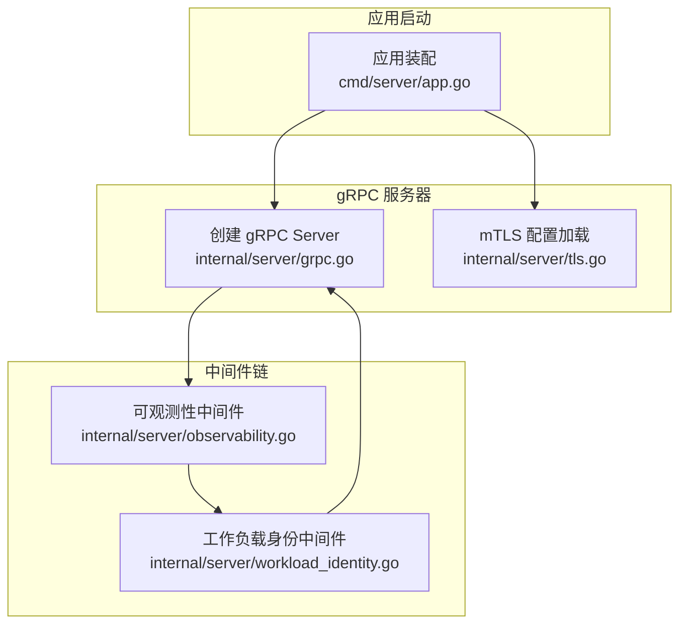
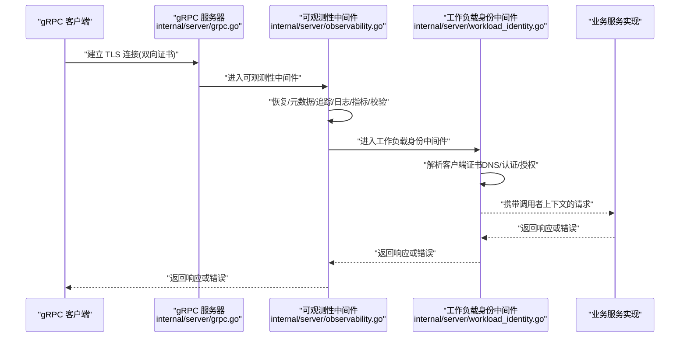
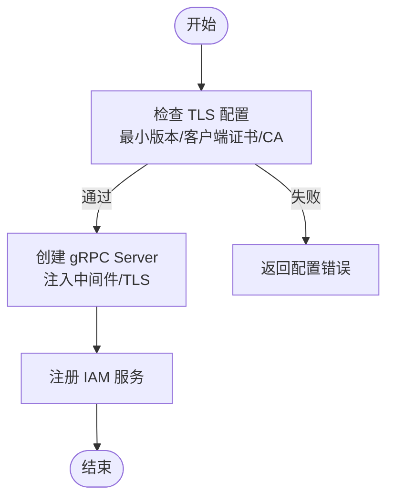
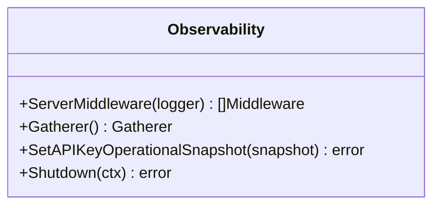
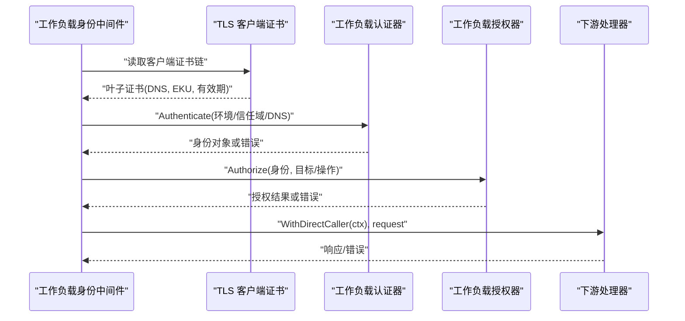
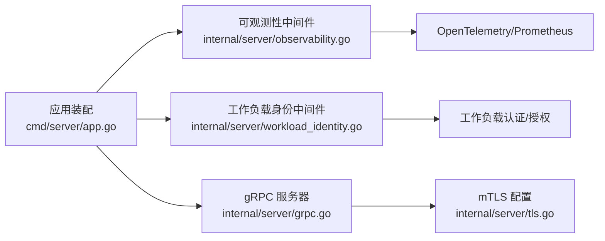

# 中间件系统

<cite>
**本文引用的文件**
- [grpc.go](file://internal/server/grpc.go)
- [workload_identity.go](file://internal/server/workload_identity.go)
- [observability.go](file://internal/server/observability.go)
- [tls.go](file://internal/server/tls.go)
- [app.go](file://cmd/server/app.go)
</cite>

## 目录
1. [简介](#简介)
2. [项目结构](#项目结构)
3. [核心组件](#核心组件)
4. [架构总览](#架构总览)
5. [详细组件分析](#详细组件分析)
6. [依赖关系分析](#依赖关系分析)
7. [性能考量](#性能考量)
8. [故障排查指南](#故障排查指南)
9. [结论](#结论)
10. [附录：自定义中间件开发指南](#附录自定义中间件开发指南)

## 简介
本文件为 ANI IAM 项目的 gRPC 中间件系统提供系统化文档，覆盖以下主题：
- gRPC 中间件的实现机制与执行顺序
- 工作负载身份验证中间件的工作原理与安全考虑
- 可观测性中间件如何收集指标、日志与追踪
- TLS 中间件的配置与安全传输保障
- 错误处理与重试机制（含建议）
- 中间件链式调用流程与上下文传递
- 自定义中间件的开发指南与最佳实践

## 项目结构
ANI IAM 的中间件体系围绕 Kratos gRPC Server 构建，关键位置如下：
- 服务器装配与中间件注册：在应用启动时组装可观测性中间件与工作负载身份中间件，并注入到 gRPC 服务中
- gRPC 服务器创建：强制要求 mTLS 配置，确保双向证书校验
- 工作负载身份中间件：基于客户端证书 DNS 名称进行身份认证与授权，并将调用者信息写入上下文
- 可观测性中间件：统一接入恢复、元数据、追踪、日志、指标与参数校验
- TLS 配置加载：强制 TLS 1.3 与客户端证书校验

图表来源
- [grpc.go:14-26](file://internal/server/grpc.go#L14-L26)
- [tls.go:15-37](file://internal/server/tls.go#L15-L37)
- [observability.go:160-172](file://internal/server/observability.go#L160-L172)
- [workload_identity.go:22-49](file://internal/server/workload_identity.go#L22-L49)
- [app.go:706-723](file://cmd/server/app.go#L706-L723)

章节来源
- [app.go:706-723](file://cmd/server/app.go#L706-L723)
- [grpc.go:14-26](file://internal/server/grpc.go#L14-L26)
- [tls.go:15-37](file://internal/server/tls.go#L15-L37)
- [observability.go:160-172](file://internal/server/observability.go#L160-L172)
- [workload_identity.go:22-49](file://internal/server/workload_identity.go#L22-L49)

## 核心组件
- gRPC 服务器与 mTLS 强制校验：确保仅接受满足最小版本、客户端证书校验等要求的连接
- 可观测性中间件：提供恢复、元数据提取、分布式追踪、结构化日志、请求计数与耗时直方图、参数校验
- 工作负载身份中间件：从 TLS 客户端证书中提取 DNS 名称，完成身份认证与授权，将调用者注入上下文
- 应用装配：将上述中间件按顺序组合并注册到 gRPC 服务

章节来源
- [grpc.go:14-26](file://internal/server/grpc.go#L14-L26)
- [observability.go:160-172](file://internal/server/observability.go#L160-L172)
- [workload_identity.go:22-49](file://internal/server/workload_identity.go#L22-L49)
- [app.go:706-723](file://cmd/server/app.go#L706-L723)

## 架构总览
下图展示了请求进入 gRPC 服务器后，依次经过的可观测性与工作负载身份中间件，最终到达业务服务的完整链路。

图表来源
- [grpc.go:14-26](file://internal/server/grpc.go#L14-L26)
- [observability.go:160-172](file://internal/server/observability.go#L160-L172)
- [workload_identity.go:22-49](file://internal/server/workload_identity.go#L22-L49)
- [app.go:706-723](file://cmd/server/app.go#L706-L723)

## 详细组件分析

### gRPC 服务器与 mTLS 强制校验
- 服务器构造：通过工厂函数创建 Kratos gRPC Server，支持网络、地址、超时、中间件、TLS 配置与禁用反射
- mTLS 强制策略：要求 TLS 最低版本为 1.3、启用并验证客户端证书、仅允许一个服务端证书、必须提供客户端 CA 池；不满足则直接拒绝
- 服务注册：将认证、授权与管理服务注册到同一 gRPC 实例

图表来源
- [grpc.go:14-26](file://internal/server/grpc.go#L14-L26)
- [tls.go:15-37](file://internal/server/tls.go#L15-L37)

章节来源
- [grpc.go:14-26](file://internal/server/grpc.go#L14-L26)
- [tls.go:15-37](file://internal/server/tls.go#L15-L37)

### 可观测性中间件（指标、日志、追踪）
- 初始化：创建 Prometheus 采集器、OpenTelemetry 指标与追踪提供者，设置全局 MeterProvider/TracerProvider 与传播器
- 中间件链顺序（由内到外）：
  - 恢复：捕获异常并记录日志
  - 元数据：提取 gRPC metadata
  - 追踪：生成 Span 并关联上下文
  - 日志：结构化日志输出
  - 指标：统计请求数与耗时
  - 校验：对入参进行校验
- 运行时指标：暴露就绪状态、API Key 运行快照等可观察指标

图表来源
- [observability.go:30-143](file://internal/server/observability.go#L30-L143)
- [observability.go:160-172](file://internal/server/observability.go#L160-L172)

章节来源
- [observability.go:30-143](file://internal/server/observability.go#L30-L143)
- [observability.go:160-172](file://internal/server/observability.go#L160-L172)

### 工作负载身份验证中间件
- 触发条件：仅在 gRPC 传输且操作名存在时生效
- 身份提取：从 TLS 客户端证书链中取叶子证书，严格限制仅包含一个 DNS 名称、无 IP/URI/Email，且具备客户端用途
- 认证与授权：
  - 使用工作负载认证器根据环境、信任域、证书 DNS 值进行认证
  - 使用工作负载授权器针对目标受众与操作进行授权
- 上下文传递：认证成功后，将“直接调用者”信息注入上下文，供后续业务层使用
- 错误映射：将业务错误映射为明确的 gRPC 状态码与详情（未认证、权限拒绝、超时、不可用），并附带操作 ID 与决策 ID

图表来源
- [workload_identity.go:22-49](file://internal/server/workload_identity.go#L22-L49)
- [workload_identity.go:52-91](file://internal/server/workload_identity.go#L52-L91)
- [workload_identity.go:93-145](file://internal/server/workload_identity.go#L93-L145)

章节来源
- [workload_identity.go:22-49](file://internal/server/workload_identity.go#L22-L49)
- [workload_identity.go:52-91](file://internal/server/workload_identity.go#L52-L91)
- [workload_identity.go:93-145](file://internal/server/workload_identity.go#L93-L145)

### TLS 中间件与传输安全
- 配置加载：从配置文件读取服务端证书、私钥与客户端 CA，构建 TLS 配置
- 安全基线：强制 TLS 1.3、启用客户端证书校验、仅允许一个服务端证书、必须提供有效的客户端 CA 集合
- 服务器集成：在创建 gRPC Server 时注入 TLS 配置，确保所有 gRPC 流量均受保护

章节来源
- [tls.go:15-37](file://internal/server/tls.go#L15-L37)
- [grpc.go:14-26](file://internal/server/grpc.go#L14-L26)

### 错误处理与重试机制
- 错误处理：
  - 工作负载身份中间件将业务错误映射为明确的 gRPC 状态码与详情，便于网关与客户端识别
  - 可观测性中间件提供恢复能力，避免单点异常导致进程崩溃
- 重试机制：
  - 当前代码未内置通用重试中间件
  - 建议在客户端侧实现幂等请求的重试策略（如指数退避、最大重试次数、仅对特定状态码重试）
  - 对于非幂等操作，应避免自动重试或使用协调器保证一致性

章节来源
- [workload_identity.go:93-145](file://internal/server/workload_identity.go#L93-L145)
- [observability.go:160-172](file://internal/server/observability.go#L160-L172)

### 中间件链式调用与上下文传递
- 执行顺序（从外到内）：
  1) 恢复
  2) 元数据
  3) 追踪
  4) 日志
  5) 指标
  6) 校验
  7) 工作负载身份认证与授权
  8) 业务服务
- 上下文传递：
  - 工作负载身份中间件在认证成功后，将“直接调用者”注入上下文
  - 后续业务逻辑可通过上下文获取调用者信息，用于审计、授权与限流等

章节来源
- [observability.go:160-172](file://internal/server/observability.go#L160-L172)
- [workload_identity.go:22-49](file://internal/server/workload_identity.go#L22-L49)
- [app.go:706-723](file://cmd/server/app.go#L706-L723)

## 依赖关系分析
- 应用装配依赖：
  - 可观测性中间件：提供恢复、元数据、追踪、日志、指标、校验
  - 工作负载身份中间件：依赖工作负载认证与授权能力
  - gRPC 服务器：依赖 mTLS 配置与服务实现
- 外部依赖：
  - OpenTelemetry：指标与追踪
  - Prometheus：指标导出
  - gRPC 传输与凭证：TLS 双向认证

图表来源
- [app.go:706-723](file://cmd/server/app.go#L706-L723)
- [observability.go:160-172](file://internal/server/observability.go#L160-L172)
- [workload_identity.go:22-49](file://internal/server/workload_identity.go#L22-L49)
- [grpc.go:14-26](file://internal/server/grpc.go#L14-L26)
- [tls.go:15-37](file://internal/server/tls.go#L15-L37)

章节来源
- [app.go:706-723](file://cmd/server/app.go#L706-L723)
- [observability.go:160-172](file://internal/server/observability.go#L160-L172)
- [workload_identity.go:22-49](file://internal/server/workload_identity.go#L22-L49)
- [grpc.go:14-26](file://internal/server/grpc.go#L14-L26)
- [tls.go:15-37](file://internal/server/tls.go#L15-L37)

## 性能考量
- 中间件开销：恢复、追踪、日志与指标会在每个请求上产生额外开销；建议在生产环境合理采样追踪与精简日志级别
- 证书校验：mTLS 握手与证书链校验会带来 CPU 与内存开销；应优化证书大小与缓存策略
- 指标导出：Prometheus 拉取频率过高会增加 I/O；建议调整抓取间隔与聚合粒度
- 工作负载授权：频繁查询授权策略可能成为瓶颈；建议结合缓存与批量策略评估

[本节为通用指导，无需引用具体文件]

## 故障排查指南
- mTLS 配置错误：
  - 症状：服务器启动失败或连接被拒绝
  - 排查：确认 TLS 版本、客户端证书、CA 与证书数量是否符合强制要求
- 工作负载身份无效：
  - 症状：返回未认证或权限拒绝
  - 排查：检查客户端证书是否仅包含一个 DNS 名称、是否具有客户端用途、是否在有效期内
- 指标不可用：
  - 症状：Prometheus 无法抓取指标
  - 排查：确认指标导出器初始化成功、端口暴露正确、资源标签设置无误
- 追踪缺失：
  - 症状：Span 未上报
  - 排查：检查 TracerProvider 初始化、传播器配置与采样策略

章节来源
- [tls.go:15-37](file://internal/server/tls.go#L15-L37)
- [workload_identity.go:93-145](file://internal/server/workload_identity.go#L93-L145)
- [observability.go:30-143](file://internal/server/observability.go#L30-L143)

## 结论
ANI IAM 的中间件系统以 Kratos 为基础，采用严格的 mTLS 与可观测性中间件，结合工作负载身份认证与授权，形成高安全、高可观测的 gRPC 服务入口。通过清晰的中间件链顺序与上下文传递机制，既保证了安全性，又提供了完善的监控与排障能力。建议在客户端侧补充幂等重试策略，并在生产环境中调优指标与追踪采样。

[本节为总结，无需引用具体文件]

## 附录：自定义中间件开发指南
- 设计原则
  - 单一职责：每个中间件只关注一个横切关注点（如鉴权、限流、审计）
  - 可组合：遵循函数式中间件模式，便于链式组合
  - 可观测：在关键路径记录必要日志与指标，避免过度噪声
  - 健壮性：做好错误处理与超时控制，避免影响主流程
- 开发步骤
  - 定义中间件签名：接收下一个处理器，返回新的处理器
  - 在应用装配中注册：将自定义中间件插入到合适位置（通常在可观测性之后、业务之前）
  - 测试：编写单元测试与集成测试，覆盖正常路径与异常路径
- 最佳实践
  - 避免阻塞：不要在中间件中执行长时间任务
  - 上下文安全：谨慎读写上下文，避免泄露敏感信息
  - 性能敏感：对热点路径进行基准测试，必要时引入缓存或批处理
  - 可配置：通过配置开关控制行为，便于灰度与回滚

[本节为通用指导，无需引用具体文件]