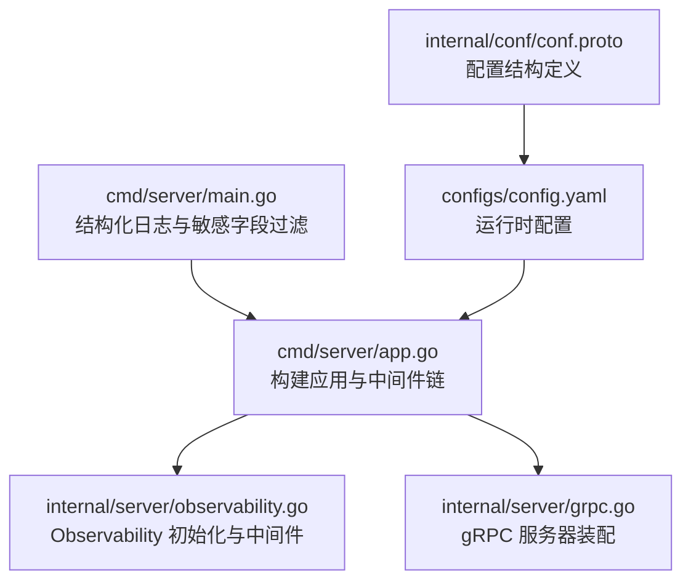
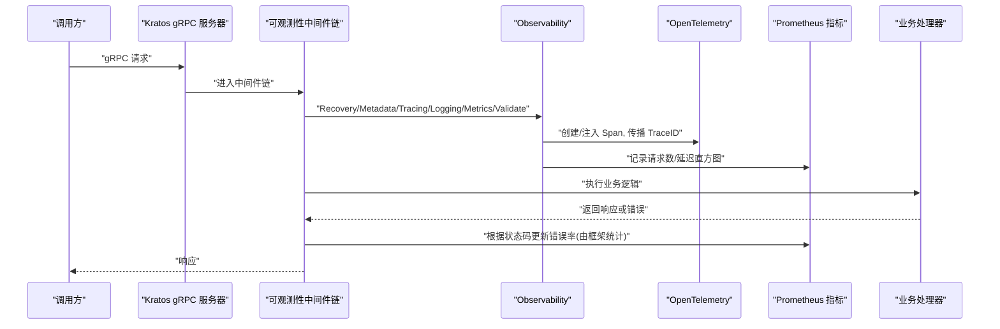
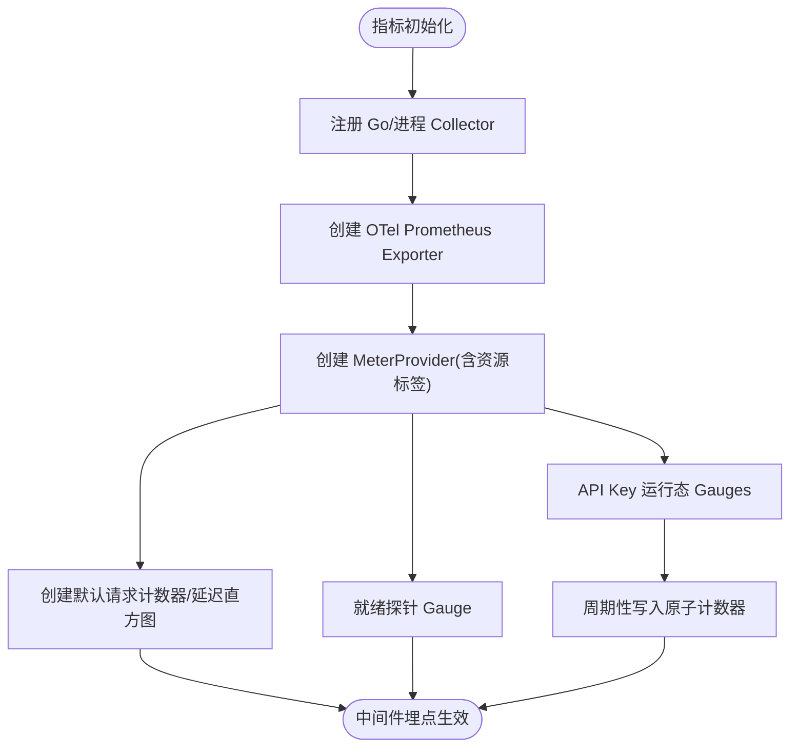
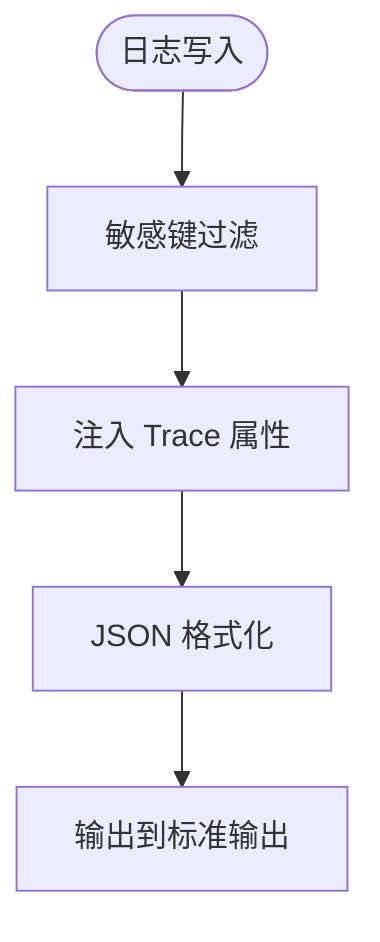
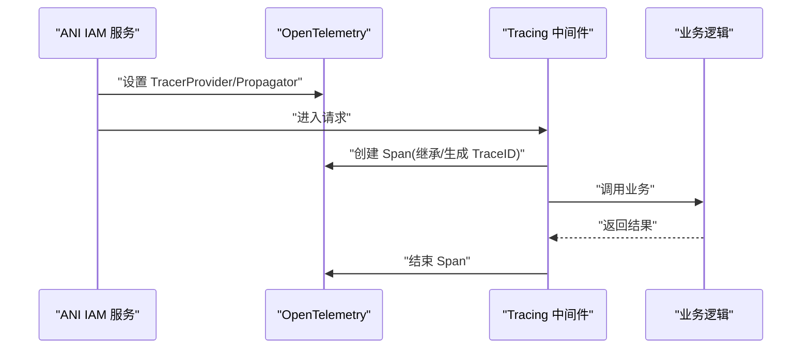
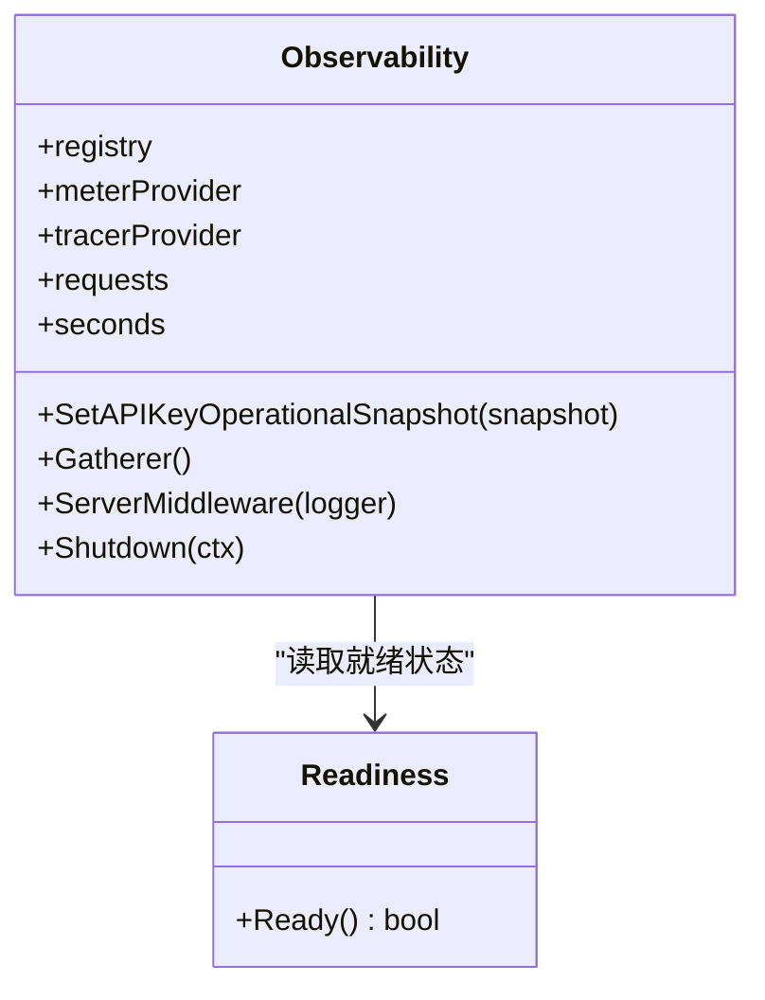
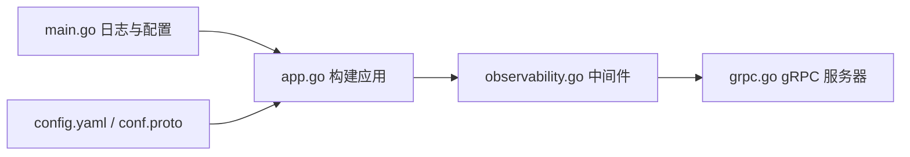

# 可观测性中间件

<cite>
**本文引用的文件**
- [internal/server/observability.go](file://internal/server/observability.go)
- [cmd/server/app.go](file://cmd/server/app.go)
- [cmd/server/main.go](file://cmd/server/main.go)
- [internal/server/grpc.go](file://internal/server/grpc.go)
- [configs/config.yaml](file://configs/config.yaml)
- [internal/conf/conf.proto](file://internal/conf/conf.proto)
</cite>

## 目录
1. [简介](#简介)
2. [项目结构](#项目结构)
3. [核心组件](#核心组件)
4. [架构总览](#架构总览)
5. [详细组件分析](#详细组件分析)
6. [依赖关系分析](#依赖关系分析)
7. [性能考量](#性能考量)
8. [故障诊断指南](#故障诊断指南)
9. [结论](#结论)
10. [附录](#附录)

## 简介
本文件面向 ANI IAM 项目的“可观测性中间件”，聚焦以下目标：
- 指标采集与上报：请求计数、响应时间直方图、错误率（通过框架中间件与自定义指标）
- 日志记录策略：结构化 JSON 日志、敏感字段过滤、Trace 属性注入
- 分布式追踪：基于 OpenTelemetry 的 Trace/Span 传播与 Kratos gRPC 集成
- 性能监控与分析：Prometheus 指标导出、OpenTelemetry 指标与链路数据
- 配置选项与自定义指标：服务名/版本资源标签、就绪探针指标、API Key 运行态指标
- 监控告警与故障诊断：如何基于指标与日志定位问题，以及关键异常路径

## 项目结构
可观测性能力集中在 server 层，作为 Kratos gRPC 服务的通用中间件链；应用启动时组装并挂载到传输层。

图表来源
- [cmd/server/app.go:669-744](file://cmd/server/app.go#L669-L744)
- [internal/server/observability.go:41-172](file://internal/server/observability.go#L41-L172)
- [internal/server/grpc.go:14-51](file://internal/server/grpc.go#L14-L51)
- [cmd/server/main.go:104-131](file://cmd/server/main.go#L104-L131)
- [configs/config.yaml:1-61](file://configs/config.yaml#L1-L61)
- [internal/conf/conf.proto:9-39](file://internal/conf/conf.proto#L9-L39)

章节来源
- [cmd/server/app.go:669-744](file://cmd/server/app.go#L669-L744)
- [internal/server/observability.go:41-172](file://internal/server/observability.go#L41-L172)
- [internal/server/grpc.go:14-51](file://internal/server/grpc.go#L14-L51)
- [cmd/server/main.go:104-131](file://cmd/server/main.go#L104-L131)
- [configs/config.yaml:1-61](file://configs/config.yaml#L1-L61)
- [internal/conf/conf.proto:9-39](file://internal/conf/conf.proto#L9-L39)

## 核心组件
- Observability 对象：封装 Prometheus Registry、OpenTelemetry MeterProvider/TracerProvider，提供指标收集器、追踪提供者与中间件链。
- 指标体系：
  - 请求计数：Kratos 默认请求计数器
  - 延迟直方图：Kratos 默认秒级直方图
  - 自定义指标：就绪探针、API Key 运行态快照等
- 日志系统：JSON 结构化输出，自动注入 Trace 上下文，内置敏感键过滤
- 追踪系统：OpenTelemetry 文本映射传播（TraceContext + Baggage），Kratos tracing 中间件创建 Span

章节来源
- [internal/server/observability.go:30-172](file://internal/server/observability.go#L30-L172)
- [cmd/server/main.go:104-131](file://cmd/server/main.go#L104-L131)

## 架构总览
下图展示一次 gRPC 请求从进入服务器到返回的全链路可观测性处理流程。

图表来源
- [internal/server/observability.go:160-172](file://internal/server/observability.go#L160-L172)
- [internal/server/grpc.go:14-51](file://internal/server/grpc.go#L14-L51)
- [cmd/server/app.go:715-723](file://cmd/server/app.go#L715-L723)

## 详细组件分析

### 指标采集与上报
- 请求计数与延迟直方图
  - 使用 Kratos 提供的默认请求计数器与秒级延迟直方图，自动按 RPC 方法、状态码等维度聚合。
  - 通过 Kratos metrics 中间件在每次请求前后埋点。
- 自定义指标
  - 就绪探针指标：以 Observable Gauge 形式暴露当前是否可接收流量。
  - API Key 运行态指标：过期未使用密钥数量、租户工作负载异常活跃密钥数量、最近一次成功快照的时间戳。
- 指标导出
  - 通过 OpenTelemetry Prometheus Exporter 将指标写入 Prometheus Registry，供外部抓取。

图表来源
- [internal/server/observability.go:41-143](file://internal/server/observability.go#L41-L143)
- [internal/server/observability.go:146-158](file://internal/server/observability.go#L146-L158)

章节来源
- [internal/server/observability.go:41-158](file://internal/server/observability.go#L41-L158)

### 日志记录策略
- 结构化日志
  - 使用 JSON 格式输出，便于集中采集与检索。
- 敏感信息脱敏
  - 通过日志过滤器屏蔽常见敏感键（如 token、password、private_key、dsn 等）。
- Trace 关联
  - 日志处理器自动提取 Trace 上下文属性，使日志与追踪链路关联。

图表来源
- [cmd/server/main.go:104-131](file://cmd/server/main.go#L104-L131)

章节来源
- [cmd/server/main.go:104-131](file://cmd/server/main.go#L104-L131)

### 分布式追踪实现
- 追踪提供者
  - 使用 OpenTelemetry TracerProvider，设置 AlwaysSample 采样策略，便于全量采样调试。
- 传播机制
  - 启用 TraceContext 与 Baggage 文本映射传播，跨进程/网络保持链路上下文。
- 中间件集成
  - Kratos tracing 中间件在服务端为每个请求创建 Span，并在返回时结束 Span。

图表来源
- [internal/server/observability.go:71-74](file://internal/server/observability.go#L71-L74)
- [internal/server/observability.go:136-141](file://internal/server/observability.go#L136-L141)
- [internal/server/observability.go:160-172](file://internal/server/observability.go#L160-L172)

章节来源
- [internal/server/observability.go:71-141](file://internal/server/observability.go#L71-L141)
- [internal/server/observability.go:160-172](file://internal/server/observability.go#L160-L172)

### 性能监控与分析工具
- Prometheus
  - 通过 OTel Prometheus Exporter 暴露指标，支持拉取与可视化。
- OpenTelemetry
  - 指标：MeterProvider 管理度量；追踪：TracerProvider 管理 Span。
- Kratos 中间件
  - 统一接入 Metrics/Tracing/Logging，减少业务侵入。

章节来源
- [internal/server/observability.go:41-143](file://internal/server/observability.go#L41-L143)
- [internal/server/observability.go:160-172](file://internal/server/observability.go#L160-L172)

### 配置选项与自定义指标
- 服务标识与资源标签
  - 服务名与版本作为资源标签，用于区分不同实例与环境。
- 就绪探针指标
  - 通过 Readiness 接口动态暴露服务是否可接收流量。
- API Key 运行态指标
  - 通过维护原子计数器并周期刷新，暴露过期未使用密钥数量、异常活跃密钥数量与最近快照时间戳。

图表来源
- [internal/server/observability.go:30-172](file://internal/server/observability.go#L30-L172)

章节来源
- [internal/server/observability.go:30-172](file://internal/server/observability.go#L30-L172)

## 依赖关系分析
- 应用组装
  - 应用启动时创建 Observability，并将其 ServerMiddleware 注入到 gRPC 服务器。
- 中间件顺序
  - Recovery -> Metadata -> Tracing -> Logging -> Metrics -> Validate
- 配置来源
  - 配置文件与环境变量合并加载，影响运行时行为（如 TLS、超时等）。

图表来源
- [cmd/server/app.go:669-744](file://cmd/server/app.go#L669-L744)
- [internal/server/observability.go:160-172](file://internal/server/observability.go#L160-L172)
- [internal/server/grpc.go:14-51](file://internal/server/grpc.go#L14-L51)
- [cmd/server/main.go:82-99](file://cmd/server/main.go#L82-L99)
- [configs/config.yaml:1-61](file://configs/config.yaml#L1-L61)
- [internal/conf/conf.proto:9-39](file://internal/conf/conf.proto#L9-L39)

章节来源
- [cmd/server/app.go:669-744](file://cmd/server/app.go#L669-L744)
- [internal/server/observability.go:160-172](file://internal/server/observability.go#L160-L172)
- [internal/server/grpc.go:14-51](file://internal/server/grpc.go#L14-L51)
- [cmd/server/main.go:82-99](file://cmd/server/main.go#L82-L99)
- [configs/config.yaml:1-61](file://configs/config.yaml#L1-L61)
- [internal/conf/conf.proto:9-39](file://internal/conf/conf.proto#L9-L39)

## 性能考量
- 采样策略
  - 追踪采用 AlwaysSample，适合调试与全量分析；生产可根据负载调整采样策略以降低开销。
- 指标粒度
  - 请求计数与延迟直方图由框架自动聚合，避免重复计算；自定义指标通过回调按需观察，降低写放大。
- 日志吞吐
  - JSON 结构化日志配合敏感键过滤，建议在生产环境合理设置日志级别，避免过度输出。
- 关闭与资源释放
  - 服务停止时显式关闭 MeterProvider 与 TracerProvider，确保指标与追踪数据完整落盘。

[本节为通用指导，不直接分析具体文件]

## 故障诊断指南
- 指标层面
  - 请求计数突降：检查中间件链是否被替换或禁用；确认 Prometheus 抓取是否正常。
  - 延迟直方图上移：结合状态码分布判断是否为后端依赖慢或错误增多。
  - 就绪探针为 0：检查 Readiness 依赖（数据库、缓存、核心运行时）是否健康。
  - API Key 运行态指标异常：关注过期未使用密钥数量与异常活跃密钥数量，排查密钥泄露或滥用。
- 日志层面
  - 搜索敏感键过滤后的关键字段，定位认证失败、授权拒绝、超时等场景。
  - 利用 Trace 属性关联日志与链路，快速定位问题节点。
- 追踪层面
  - 检查 Span 是否完整闭合，是否存在上游传播丢失（TraceContext/Baggage）。
  - 对高延迟请求，查看子 Span 耗时分布，识别瓶颈。

章节来源
- [internal/server/observability.go:41-172](file://internal/server/observability.go#L41-L172)
- [cmd/server/main.go:104-131](file://cmd/server/main.go#L104-L131)

## 结论
本项目通过 Kratos 与 OpenTelemetry 的组合，构建了统一的请求级可观测性能力：指标、日志、追踪三位一体，覆盖请求计数、延迟、错误率与自定义业务指标。通过结构化日志与敏感信息过滤保障安全合规，借助 Trace 传播提升跨服务排障效率。建议在稳定期评估追踪采样策略与日志级别，平衡可观测性与性能成本。

[本节为总结性内容，不直接分析具体文件]

## 附录
- 常用指标名称（示例）
  - 请求计数：Kratos 默认请求计数器
  - 延迟直方图：Kratos 默认秒级直方图
  - 就绪探针：ani_iam_runtime_ready
  - API Key 运行态：ani_iam_api_key_stale_non_expiring_count、ani_iam_tenant_workload_unusual_active_api_keys_count、ani_iam_api_key_operational_snapshot_timestamp_seconds
- 中间件顺序
  - Recovery -> Metadata -> Tracing -> Logging -> Metrics -> Validate

章节来源
- [internal/server/observability.go:41-172](file://internal/server/observability.go#L41-L172)