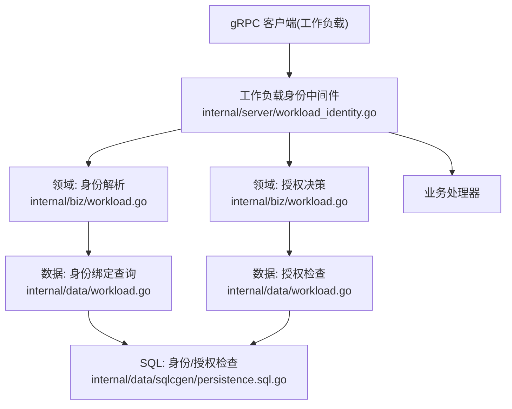
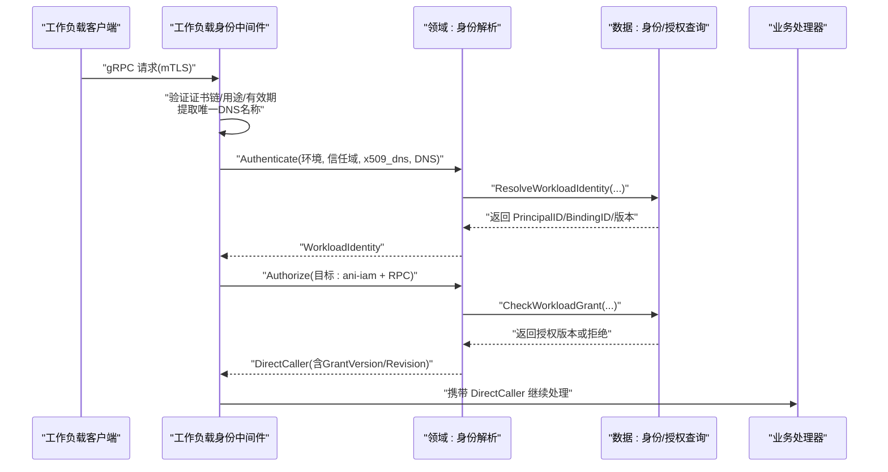
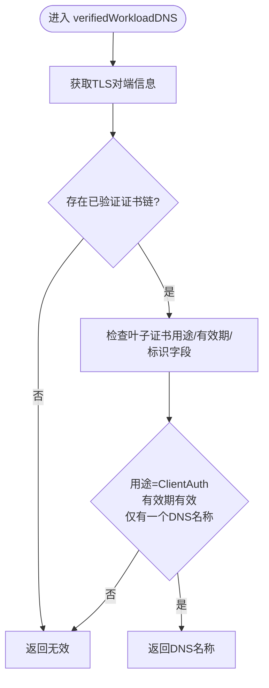
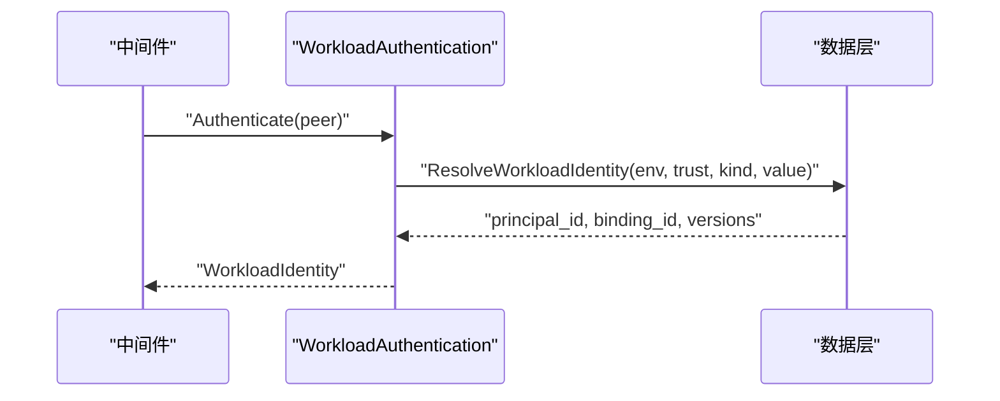
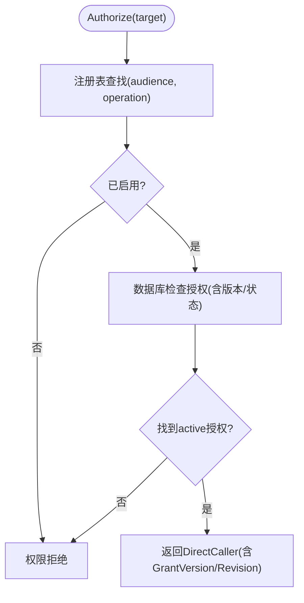
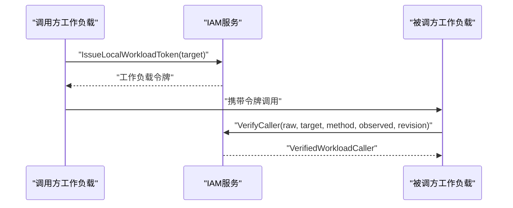
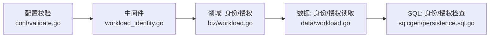

# 工作负载身份中间件

<cite>
**本文引用的文件**
- [internal/server/workload_identity.go](file://internal/server/workload_identity.go)
- [internal/biz/workload.go](file://internal/biz/workload.go)
- [internal/data/workload.go](file://internal/data/workload.go)
- [internal/data/sqlcgen/persistence.sql.go](file://internal/data/sqlcgen/persistence.sql.go)
- [configs/config.yaml](file://configs/config.yaml)
- [internal/conf/validate.go](file://internal/conf/validate.go)
- [internal/service/workload_invocation.go](file://internal/service/workload_invocation.go)
- [internal/biz/workload_caller.go](file://internal/biz/workload_caller.go)
- [tests/integration/workload_runtime_test.go](file://tests/integration/workload_runtime_test.go)
- [tests/integration/workload_invocation_test.go](file://tests/integration/workload_invocation_test.go)
- [cmd/server/main.go](file://cmd/server/main.go)
</cite>

## 目录
1. [简介](#简介)
2. [项目结构](#项目结构)
3. [核心组件](#核心组件)
4. [架构总览](#架构总览)
5. [详细组件分析](#详细组件分析)
6. [依赖关系分析](#依赖关系分析)
7. [性能考量](#性能考量)
8. [故障排查指南](#故障排查指南)
9. [结论](#结论)
10. [附录：配置与安全最佳实践](#附录配置与安全最佳实践)

## 简介
本文件面向 ANI IAM 的工作负载身份中间件，系统性说明基于 x509 证书的身份验证、DNS 名称提取、环境/信任域校验、授权与细粒度权限控制、错误处理策略、配置参数与安全最佳实践，并提供可操作的故障排查指南。该中间件用于在 gRPC 入站请求进入业务处理器之前，完成对调用方（工作负载）的强身份认证与最小权限授权，确保只有受信任且具备明确授权的工作负载才能访问特定操作。

## 项目结构
围绕工作负载身份中间件的关键代码分布在以下层次：
- 传输层中间件：负责从 TLS 连接中解析并验证工作负载证书，提取 DNS 身份，构造已验证的对端信息。
- 领域层：封装工作负载身份解析与授权决策，定义数据模型与错误语义。
- 数据层：通过 SQL 查询实现身份绑定与工作负载授权的持久化校验。
- 配置层：约束运行时的环境、信任域、TLS、工作负载注册表等安全相关参数。
- 服务层：提供工作负载令牌签发与验证能力，支撑跨进程调用链。

**图示来源**
- [internal/server/workload_identity.go:22-49](file://internal/server/workload_identity.go#L22-L49)
- [internal/biz/workload.go:56-106](file://internal/biz/workload.go#L56-L106)
- [internal/data/workload.go:32-65](file://internal/data/workload.go#L32-L65)
- [internal/data/sqlcgen/persistence.sql.go:453-500](file://internal/data/sqlcgen/persistence.sql.go#L453-L500)

**章节来源**
- [internal/server/workload_identity.go:22-49](file://internal/server/workload_identity.go#L22-L49)
- [internal/biz/workload.go:56-106](file://internal/biz/workload.go#L56-L106)
- [internal/data/workload.go:32-65](file://internal/data/workload.go#L32-L65)
- [internal/data/sqlcgen/persistence.sql.go:453-500](file://internal/data/sqlcgen/persistence.sql.go#L453-L500)

## 核心组件
- 工作负载身份中间件：从 TLS 握手结果中提取工作负载证书，严格校验证书用途、有效期与 DNS 名称唯一性，生成“已验证工作负载对端”；随后调用领域层的身份解析与授权决策，将直接调用者注入上下文供后续处理器使用。
- 领域层工作负载身份与授权：定义 VerifiedWorkloadPeer、WorkloadIdentity、DirectCaller、WorkloadTarget 等核心模型；Authenticate 负责环境与信任域、身份值规范化与存在性校验；Authorize 结合工作负载注册表与数据库中的授权记录进行细粒度授权。
- 数据层身份与授权读取：通过 SQL 查询匹配 environment/trust_domain/identity_kind/identity_value 的工作负载绑定，以及按 audience/operation/target_sha256/principal_version/binding_version 检查授权版本与状态。
- 配置与校验：强制要求 mTLS、受限角色、工作负载注册表及其 SHA256、环境/信任域规范、超时与网络限制等，保障运行时安全基线。

**章节来源**
- [internal/server/workload_identity.go:22-146](file://internal/server/workload_identity.go#L22-L146)
- [internal/biz/workload.go:12-118](file://internal/biz/workload.go#L12-L118)
- [internal/data/workload.go:15-65](file://internal/data/workload.go#L15-L65)
- [internal/conf/validate.go:19-168](file://internal/conf/validate.go#L19-L168)

## 架构总览
下图展示一次工作负载身份认证与授权的整体流程，包括证书验证、DNS 提取、身份解析、授权检查与上下文传递。

**图示来源**
- [internal/server/workload_identity.go:22-49](file://internal/server/workload_identity.go#L22-L49)
- [internal/biz/workload.go:62-106](file://internal/biz/workload.go#L62-L106)
- [internal/data/workload.go:32-65](file://internal/data/workload.go#L32-L65)
- [internal/data/sqlcgen/persistence.sql.go:453-500](file://internal/data/sqlcgen/persistence.sql.go#L453-L500)

## 详细组件分析

### 组件一：x509 证书验证与 DNS 名称提取
- 证书链与用途校验：仅接受包含 ExtKeyUsageClientAuth 的叶子证书，且必须为当前有效时间窗口内。
- DNS 名称唯一性：叶子证书必须恰好包含一个 DNS 名称，且不得包含 IP、URI、Email 等其他标识。
- 信任域与环境：中间件由外部传入 environment 与 trust_domain，用于后续身份解析与授权范围限定。
- 失败路径：任何不满足上述条件均视为无效凭证，返回未认证错误。

**图示来源**
- [internal/server/workload_identity.go:52-91](file://internal/server/workload_identity.go#L52-L91)

**章节来源**
- [internal/server/workload_identity.go:52-91](file://internal/server/workload_identity.go#L52-L91)

### 组件二：工作负载身份认证流程（环境验证、信任域检查、身份解析）
- 输入：environment、trust_domain、identity_kind="x509_dns"、identity_value（小写、去空白、无非法字符）。
- 解析：通过数据层查询 environment/trust_domain/identity_kind/identity_value 对应的 principal_id、binding_id 及版本号。
- 失败：若不存在或状态不符，返回“工作负载身份无效”。

**图示来源**
- [internal/biz/workload.go:62-72](file://internal/biz/workload.go#L62-L72)
- [internal/data/workload.go:32-44](file://internal/data/workload.go#L32-L44)
- [internal/data/sqlcgen/persistence.sql.go:4231-4272](file://internal/data/sqlcgen/persistence.sql.go#L4231-L4272)

**章节来源**
- [internal/biz/workload.go:62-72](file://internal/biz/workload.go#L62-L72)
- [internal/data/workload.go:32-44](file://internal/data/workload.go#L32-L44)
- [internal/data/sqlcgen/persistence.sql.go:4231-4272](file://internal/data/sqlcgen/persistence.sql.go#L4231-L4272)

### 组件三：授权机制与细粒度权限控制
- 目标声明：每个被调用的 RPC 需在工作负载注册表中登记（audience、operation、enabled、revision）。
- 授权检查：根据 identity 的 principal_id、binding_id 与版本，结合 target 的 audience、operation、target_sha256 检查是否存在 active 的授权记录。
- 版本一致性：返回 grant version 与 target revision，供上层进行幂等与一致性控制。
- 失败：未注册、禁用、无授权或版本不一致均返回“权限拒绝”。

**图示来源**
- [internal/biz/workload.go:87-106](file://internal/biz/workload.go#L87-L106)
- [internal/data/workload.go:46-65](file://internal/data/workload.go#L46-L65)
- [internal/data/sqlcgen/persistence.sql.go:453-500](file://internal/data/sqlcgen/persistence.sql.go#L453-L500)

**章节来源**
- [internal/biz/workload.go:87-106](file://internal/biz/workload.go#L87-L106)
- [internal/data/workload.go:46-65](file://internal/data/workload.go#L46-L65)
- [internal/data/sqlcgen/persistence.sql.go:453-500](file://internal/data/sqlcgen/persistence.sql.go#L453-L500)

### 组件四：工作负载令牌与跨进程调用（可选扩展）
- 本地令牌签发：在受控入口下，基于当前已验证的工作负载身份为目标签发短期工作负载令牌。
- 调用方验证：接收方通过 VerifyCaller/VerifyHTTPCaller 校验令牌、目标与方法/路径、观察到的对端信息与期望修订一致。
- 作用：支持工作负载间的安全委托与审计追踪。

**图示来源**
- [internal/biz/workload_caller.go:24-41](file://internal/biz/workload_caller.go#L24-L41)
- [internal/biz/workload_caller.go:43-113](file://internal/biz/workload_caller.go#L43-L113)
- [internal/service/workload_invocation.go:14-30](file://internal/service/workload_invocation.go#L14-L30)

**章节来源**
- [internal/biz/workload_caller.go:24-41](file://internal/biz/workload_caller.go#L24-L41)
- [internal/biz/workload_caller.go:43-113](file://internal/biz/workload_caller.go#L43-L113)
- [internal/service/workload_invocation.go:14-30](file://internal/service/workload_invocation.go#L14-L30)

## 依赖关系分析
- 中间件依赖领域层的 WorkloadAuthentication 与 WorkloadAuthorization。
- 领域层依赖数据层的身份解析与授权检查接口。
- 数据层依赖 sqlc 生成的 SQL 查询，执行严格的版本与状态匹配。
- 配置层对运行时进行强约束，确保 mTLS、受限角色、工作负载注册表完整性与网络隔离。

**图示来源**
- [internal/server/workload_identity.go:22-49](file://internal/server/workload_identity.go#L22-L49)
- [internal/biz/workload.go:56-106](file://internal/biz/workload.go#L56-L106)
- [internal/data/workload.go:32-65](file://internal/data/workload.go#L32-L65)
- [internal/data/sqlcgen/persistence.sql.go:453-500](file://internal/data/sqlcgen/persistence.sql.go#L453-L500)
- [internal/conf/validate.go:19-168](file://internal/conf/validate.go#L19-L168)

**章节来源**
- [internal/server/workload_identity.go:22-49](file://internal/server/workload_identity.go#L22-L49)
- [internal/biz/workload.go:56-106](file://internal/biz/workload.go#L56-L106)
- [internal/data/workload.go:32-65](file://internal/data/workload.go#L32-L65)
- [internal/data/sqlcgen/persistence.sql.go:453-500](file://internal/data/sqlcgen/persistence.sql.go#L453-L500)
- [internal/conf/validate.go:19-168](file://internal/conf/validate.go#L19-L168)

## 性能考量
- 证书验证在传输层完成，避免重复计算；中间件仅在 gRPC 路径生效，减少不必要开销。
- 授权检查采用精确的版本与状态匹配，降低误判与回退成本。
- 建议合理设置 gRPC 超时与关闭超时，避免长连接阻塞资源。
- 工作负载注册表应保持稳定，频繁变更会增加解析与校验成本。

[本节为通用指导，无需具体文件引用]

## 故障排查指南
- 无效凭证（CREDENTIAL_INVALID）
  - 现象：返回未认证错误，常见于证书缺失、非 ClientAuth、过期、DNS 名称不唯一或非法。
  - 排查：确认客户端证书链完整、用途正确、有效期覆盖当前时间、仅包含单一 DNS 名称；检查 environment 与 trust_domain 是否与服务配置一致。
  - 参考：中间件错误映射与证书校验逻辑。

- 权限拒绝（PERMISSION_DENIED）
  - 现象：身份解析成功但无法访问目标 RPC。
  - 排查：检查工作负载注册表是否启用目标 operation；数据库中 workload_grants 是否 active；principal/binding 版本是否匹配；target_sha256 是否与注册表一致。
  - 参考：授权检查与 SQL 查询。

- 超时错误（IAM_TIMEOUT）
  - 现象：上下文 DeadlineExceeded 被转换为超时错误。
  - 排查：检查下游依赖（数据库、Redis、OIDC）响应时间与连接池；调整 gRPC timeout 与关闭超时。
  - 参考：中间件超时错误映射。

- 服务不可用（IAM_UNAVAILABLE）
  - 现象：其他异常被归并为不可用。
  - 排查：检查数据层连接、权限与锁竞争；查看日志与监控指标定位瓶颈。

- 集成测试用例参考
  - 验证不同环境/信任域/身份值会被拒绝；撤销授权或绑定后应拒绝旧解析结果。
  - 参考：工作负载运行时与调用链集成测试。

**章节来源**
- [internal/server/workload_identity.go:93-146](file://internal/server/workload_identity.go#L93-L146)
- [internal/biz/workload.go:12-15](file://internal/biz/workload.go#L12-L15)
- [internal/data/sqlcgen/persistence.sql.go:453-500](file://internal/data/sqlcgen/persistence.sql.go#L453-L500)
- [tests/integration/workload_runtime_test.go:103-141](file://tests/integration/workload_runtime_test.go#L103-L141)
- [tests/integration/workload_invocation_test.go:63-88](file://tests/integration/workload_invocation_test.go#L63-L88)

## 结论
ANI IAM 的工作负载身份中间件以 mTLS 为基础，通过严格的证书与 DNS 校验、环境/信任域限定、注册表驱动的目标声明与数据库驱动的细粒度授权，实现了高安全性的工作负载身份认证与授权。配合配置强校验与清晰的错误分类，可有效支撑生产环境的稳定运行与问题快速定位。

[本节为总结，无需具体文件引用]

## 附录：配置与安全最佳实践
- 关键配置项
  - gRPC TLS：必须配置证书、私钥与客户端 CA；gateway_client_dns_name 需为非空且规范。
  - 运行时：workload_registry_file 与 workload_registry_sha256 必须指定且匹配；environment 与 trust_domain 必须小写、规范、无空白。
  - 网络与超时：监听地址必须显式绑定；超时需在允许范围内；关闭超时合理设置。
  - 数据库与缓存：PostgreSQL 使用受限角色与明确库名；Redis 使用命名空间与合理限流窗口。
  - OIDC/通知：遵循协议与重定向 URL 规范；保持独立来源与密钥文件。

- 安全最佳实践
  - 强制 mTLS：所有工作负载到 IAM 的通信必须启用双向 TLS。
  - 最小权限：仅授予必要 audience/operation 的授权，并使用精确版本控制。
  - 证书管理：确保证书仅包含单一 DNS 名称，定期轮换，避免泄露私钥。
  - 配置锁定：使用只读挂载与哈希校验保护配置文件与注册表。
  - 监控与审计：关注认证失败、权限拒绝与超时事件，建立告警与回溯机制。

**章节来源**
- [configs/config.yaml:1-61](file://configs/config.yaml#L1-L61)
- [internal/conf/validate.go:19-168](file://internal/conf/validate.go#L19-L168)
- [cmd/server/main.go:34-102](file://cmd/server/main.go#L34-L102)