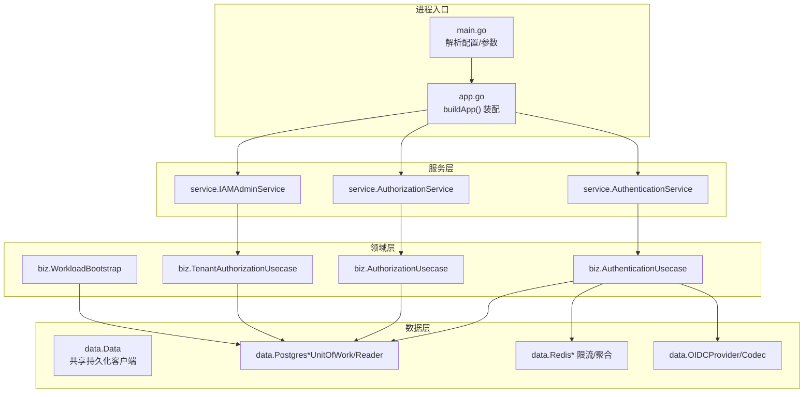
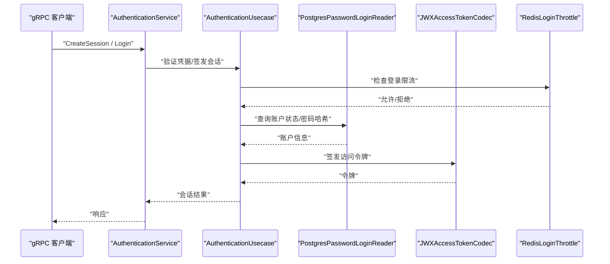
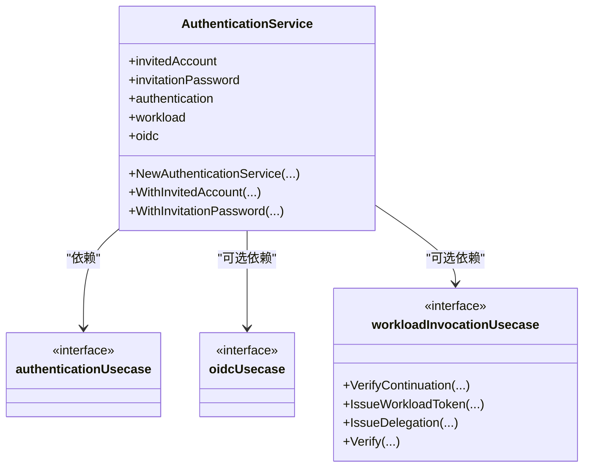
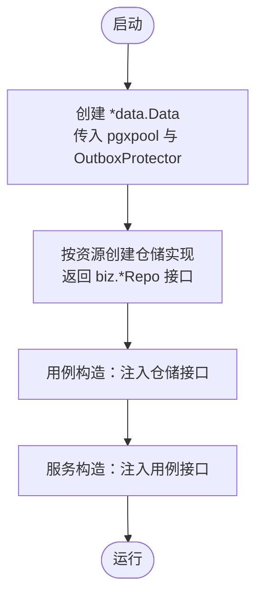
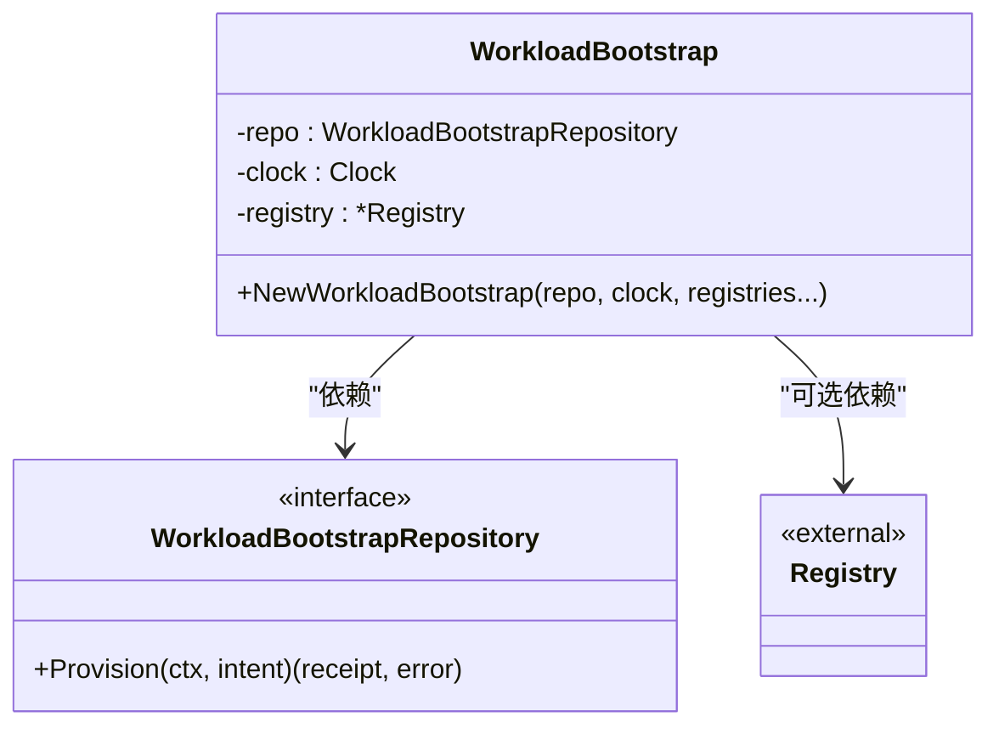
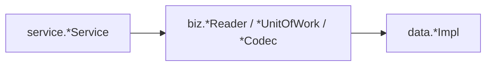
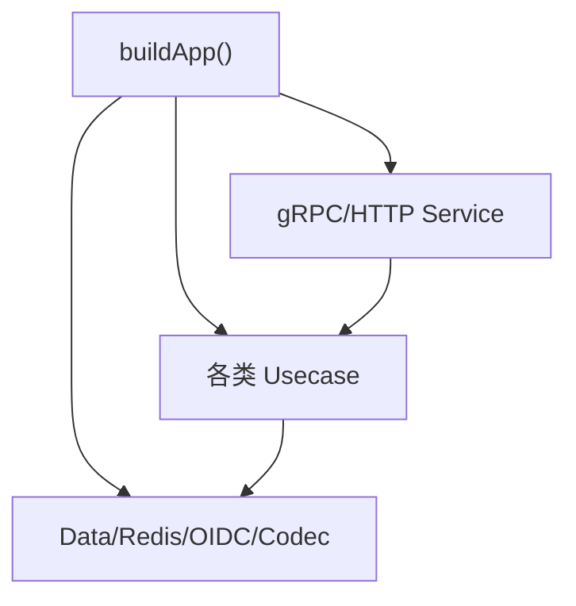

# 依赖注入与工厂模式

<cite>
**本文引用的文件**
- [cmd/server/main.go](file://cmd/server/main.go)
- [cmd/server/app.go](file://cmd/server/app.go)
- [internal/data/data.go](file://internal/data/data.go)
- [internal/biz/authentication.go](file://internal/biz/authentication.go)
- [internal/biz/authorization.go](file://internal/biz/authorization.go)
- [internal/biz/workload_bootstrap.go](file://internal/biz/workload_bootstrap.go)
- [internal/service/authentication.go](file://internal/service/authentication.go)
- [internal/service/workload_invocation.go](file://internal/service/workload_invocation.go)
- [CLAUDE.md](file://CLAUDE.md)
</cite>

## 目录
1. [简介](#简介)
2. [项目结构](#项目结构)
3. [核心组件](#核心组件)
4. [架构总览](#架构总览)
5. [详细组件分析](#详细组件分析)
6. [依赖关系分析](#依赖关系分析)
7. [性能考量](#性能考量)
8. [故障排查指南](#故障排查指南)
9. [结论](#结论)
10. [附录](#附录)

## 简介
本文件聚焦 ANI IAM 项目的依赖注入（DI）与工厂模式实践，围绕 Go 语言在分层架构中的装配方式、接口抽象与依赖倒置原则（DIP）、服务/数据源/用例工厂的构建策略，以及测试中的 Mock 与依赖替换进行系统说明。文档通过代码级图示与路径引用，帮助读者快速理解并复用该项目的 DI 与工厂设计。

## 项目结构
项目采用清晰的分层：service（传输适配）→ biz（领域用例与接口）→ data（仓储实现与基础设施）。依赖方向严格单向，所有外部依赖以接口形式暴露于 biz 层，由 cmd/server 在启动时完成装配。配置来源包括配置文件与环境变量，运行时创建数据库连接池、Redis 客户端、OIDC 提供者、令牌编解码器等基础设施对象，再组装为用例与服务。

图表来源
- [cmd/server/main.go:34-101](file://cmd/server/main.go#L34-L101)
- [cmd/server/app.go:369-744](file://cmd/server/app.go#L369-L744)
- [internal/data/data.go:6-20](file://internal/data/data.go#L6-L20)

章节来源
- [cmd/server/main.go:34-101](file://cmd/server/main.go#L34-L101)
- [cmd/server/app.go:369-744](file://cmd/server/app.go#L369-L744)
- [internal/data/data.go:6-20](file://internal/data/data.go#L6-L20)
- [CLAUDE.md:66-173](file://CLAUDE.md#L66-L173)

## 核心组件
- 应用装配器：位于 cmd/server/app.go，集中负责从配置到具体实现的装配，构造 Data、OIDC、令牌编解码、限流器、工作负载注册表等，并组装各用例与服务。
- 领域用例：biz 层定义用例与对外接口（如认证、授权、租户授权、工作负载引导），并通过构造函数接收仓储与协作者。
- 服务适配器：service 层将 gRPC/HTTP 请求转换为用例调用，仅做边界转换与校验。
- 数据共享容器：data.Data 持有长生命周期基础设施客户端，仓储实现通过它访问存储，避免重复创建连接。

章节来源
- [cmd/server/app.go:369-744](file://cmd/server/app.go#L369-L744)
- [internal/biz/authentication.go:1-200](file://internal/biz/authentication.go#L1-L200)
- [internal/service/authentication.go:91-106](file://internal/service/authentication.go#L91-L106)
- [internal/data/data.go:6-20](file://internal/data/data.go#L6-L20)

## 架构总览
下图展示一次“用户密码登录”的关键调用链，体现依赖注入如何贯穿 service → biz → data，并在启动期完成装配。

图表来源
- [cmd/server/app.go:529-539](file://cmd/server/app.go#L529-L539)
- [internal/service/authentication.go:91-106](file://internal/service/authentication.go#L91-L106)
- [internal/biz/authentication.go:1-200](file://internal/biz/authentication.go#L1-L200)

## 详细组件分析

### 服务工厂：认证服务与可选能力注入
- 认证服务通过构造函数注入业务用例，并提供可选 OIDC 用例与工作负载调用能力的扩展点。
- 使用“可选参数切片 + 条件赋值”的模式，在不破坏默认行为的前提下支持测试或特殊运行环境注入。

图表来源
- [internal/service/authentication.go:91-106](file://internal/service/authentication.go#L91-L106)
- [internal/service/workload_invocation.go:14-29](file://internal/service/workload_invocation.go#L14-L29)

章节来源
- [internal/service/authentication.go:91-106](file://internal/service/authentication.go#L91-L106)
- [internal/service/workload_invocation.go:14-29](file://internal/service/workload_invocation.go#L14-L29)

### 数据源工厂：Data 与仓储装配
- data.Data 作为共享的基础设施容器，封装数据库连接池、出站保护器等，仓储实现统一通过它获取连接，避免重复初始化。
- 仓储构造函数返回 biz 层接口类型，确保上层只依赖接口，符合 DIP。

图表来源
- [cmd/server/app.go:465-474](file://cmd/server/app.go#L465-L474)
- [internal/data/data.go:6-20](file://internal/data/data.go#L6-L20)
- [CLAUDE.md:138-153](file://CLAUDE.md#L138-L153)

章节来源
- [internal/data/data.go:6-20](file://internal/data/data.go#L6-L20)
- [CLAUDE.md:138-153](file://CLAUDE.md#L138-L153)

### 业务用例工厂：工作负载引导用例
- WorkloadBootstrap 通过构造函数注入仓库、时钟与可选的工作负载注册表，体现“最小必要依赖 + 可选增强”的工厂风格。
- 该用例封装了工作负载引导的核心流程，对上层屏蔽底层细节。

图表来源
- [internal/biz/workload_bootstrap.go:72-88](file://internal/biz/workload_bootstrap.go#L72-L88)

章节来源
- [internal/biz/workload_bootstrap.go:72-88](file://internal/biz/workload_bootstrap.go#L72-L88)

### 接口抽象与依赖倒置（DIP）
- 认证与授权相关读取器、工作单元、令牌编解码器等均以接口形式声明在 biz 层，data 层提供实现，service 层仅依赖接口。
- 这种设计使业务规则不感知存储与传输细节，便于替换实现与编写测试。

图表来源
- [internal/biz/authentication.go:1-200](file://internal/biz/authentication.go#L1-L200)
- [internal/biz/authorization.go:108-145](file://internal/biz/authorization.go#L108-L145)

章节来源
- [internal/biz/authentication.go:1-200](file://internal/biz/authentication.go#L1-L200)
- [internal/biz/authorization.go:108-145](file://internal/biz/authorization.go#L108-L145)

### 测试中的 Mock 与依赖替换
- 通过向用例或服务构造函数注入接口，测试中可传入轻量 Mock 或内存实现，隔离外部依赖（数据库、Redis、OIDC 等）。
- 示例场景：
  - 使用自定义 ID 生成器与时钟，保证确定性。
  - 注入允许的 API Key 创建限速器，绕过真实限流。
  - 使用内存或简化实现替代 Redis/OIDC 以加速单测。

章节来源
- [tests/integration/tenant_authorization_test.go:291-326](file://tests/integration/tenant_authorization_test.go#L291-L326)
- [tests/integration/workload_runtime_test.go:160-174](file://tests/integration/workload_runtime_test.go#L160-L174)

### 组件注册表与服务定位器的使用场景
- 项目未采用全局服务定位器；所有依赖在启动阶段显式装配，降低隐式耦合。
- 工作负载目标注册表（workloadregistry.Registry）作为配置驱动的“目标清单”，在服务与中间件间共享，用于鉴权与路由决策，属于“配置型注册表”而非“运行时服务发现”。

章节来源
- [cmd/server/app.go:378-406](file://cmd/server/app.go#L378-L406)
- [cmd/server/app.go:614-627](file://cmd/server/app.go#L614-L627)

## 依赖关系分析
- 装配中心：cmd/server/app.go 的 buildApp 是唯一的装配入口，集中创建基础设施、用例与服务，并挂载到 gRPC/HTTP 服务器。
- 依赖方向：service → biz → data，禁止反向依赖，违反即视为分层错误。
- 关键装配点：
  - 数据库连接池与 Redis 客户端在启动时建立并 Ping 检测。
  - 令牌编解码器、OIDC 提供者、操作注册表、权限目录等按需创建。
  - 用例与服务通过构造函数注入依赖，必要时通过 WithXxx 方法注入可选能力。

图表来源
- [cmd/server/app.go:369-744](file://cmd/server/app.go#L369-L744)

章节来源
- [cmd/server/app.go:369-744](file://cmd/server/app.go#L369-L744)
- [CLAUDE.md:79-109](file://CLAUDE.md#L79-L109)

## 性能考量
- 连接复用：data.Data 持有长生命周期连接，仓储实现复用连接，减少握手开销。
- 限流与批处理：登录限流、API Key 使用聚合等通过 Redis 实现，避免数据库压力。
- 启动时健康检查：数据库与 Redis 在启动阶段 Ping，失败快速失败，缩短冷启动问题发现时间。
- 可选依赖最小化：通过可选参数注入，避免不必要的初始化成本。

章节来源
- [cmd/server/app.go:412-443](file://cmd/server/app.go#L412-L443)
- [cmd/server/app.go:450-491](file://cmd/server/app.go#L450-L491)

## 故障排查指南
- 启动失败常见原因：
  - 数据库/Redis 不可达：检查 DSN、网络与凭据，关注启动阶段的 Ping 错误。
  - 证书/密钥文件缺失：访问令牌私钥、OIDC 客户端密钥、通知出站保护密钥需正确加载。
  - 工作负载注册表校验失败：确认注册表文件与预期摘要一致。
- 运行时告警：
  - 通知派发失败、快照刷新失败会记录警告日志，不影响主流程但需关注。
  - 限流触发会导致登录或 API Key 创建被拒，检查阈值与窗口配置。

章节来源
- [cmd/server/app.go:412-443](file://cmd/server/app.go#L412-L443)
- [cmd/server/app.go:460-474](file://cmd/server/app.go#L460-L474)
- [cmd/server/app.go:628-644](file://cmd/server/app.go#L628-L644)

## 结论
ANI IAM 通过“显式装配 + 接口抽象 + 工厂构造”的方式实现了高内聚、低耦合的依赖管理。service 层专注协议适配，biz 层专注业务规则与用例编排，data 层专注持久化与外部系统交互。测试借助接口注入轻松替换依赖，提升可测性与稳定性。对于新增能力，建议遵循现有分层与装配约定，优先在 biz 层定义接口，在 data 层实现，最后在 cmd/server 中装配。

## 附录
- 参考规范与约定
  - 分层职责与导入约束、新增资源清单见 CLAUDE.md。
  - 数据层仓储构造返回接口类型，PO/DO 转换函数命名约定。

章节来源
- [CLAUDE.md:66-173](file://CLAUDE.md#L66-L173)