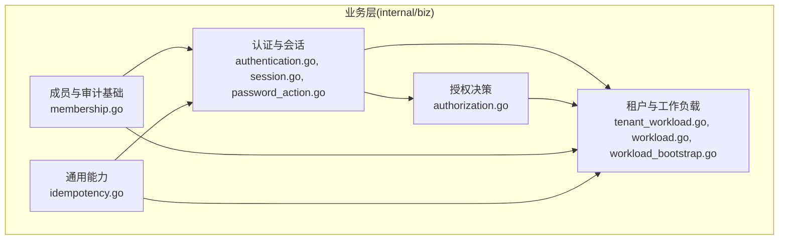
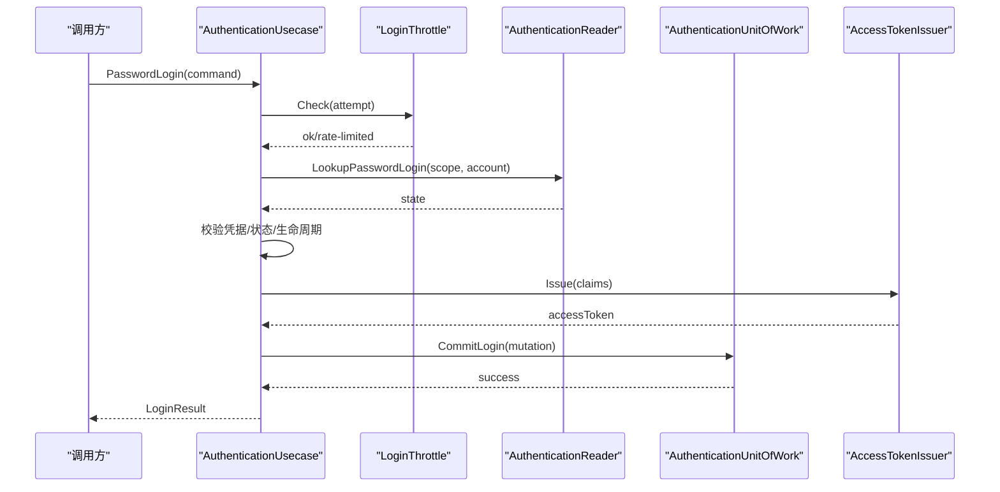
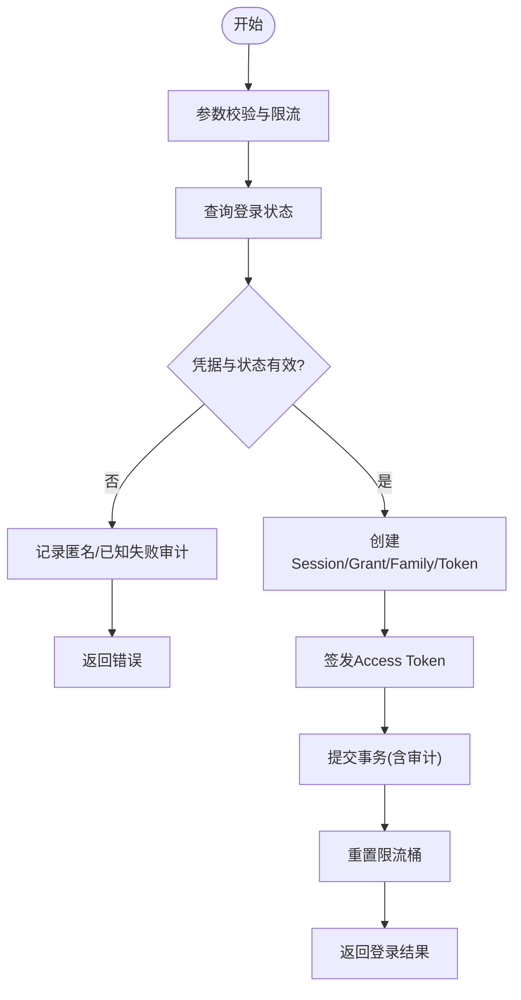
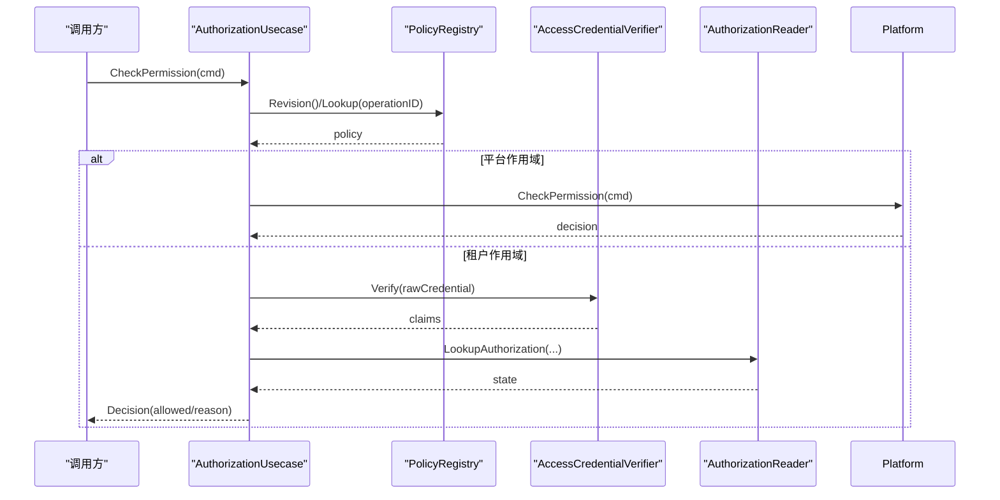
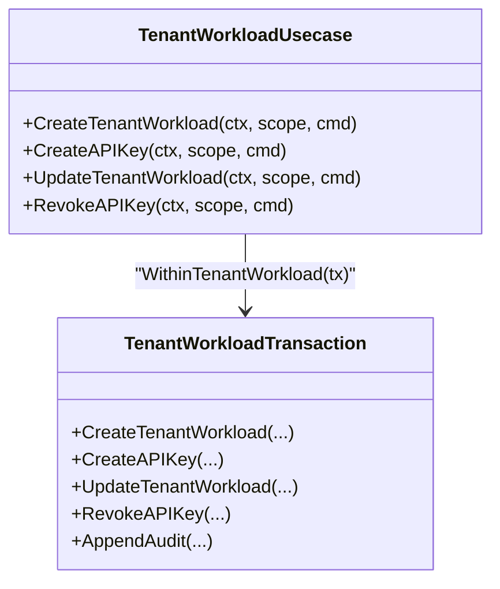
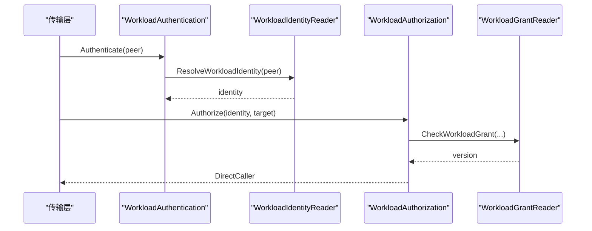
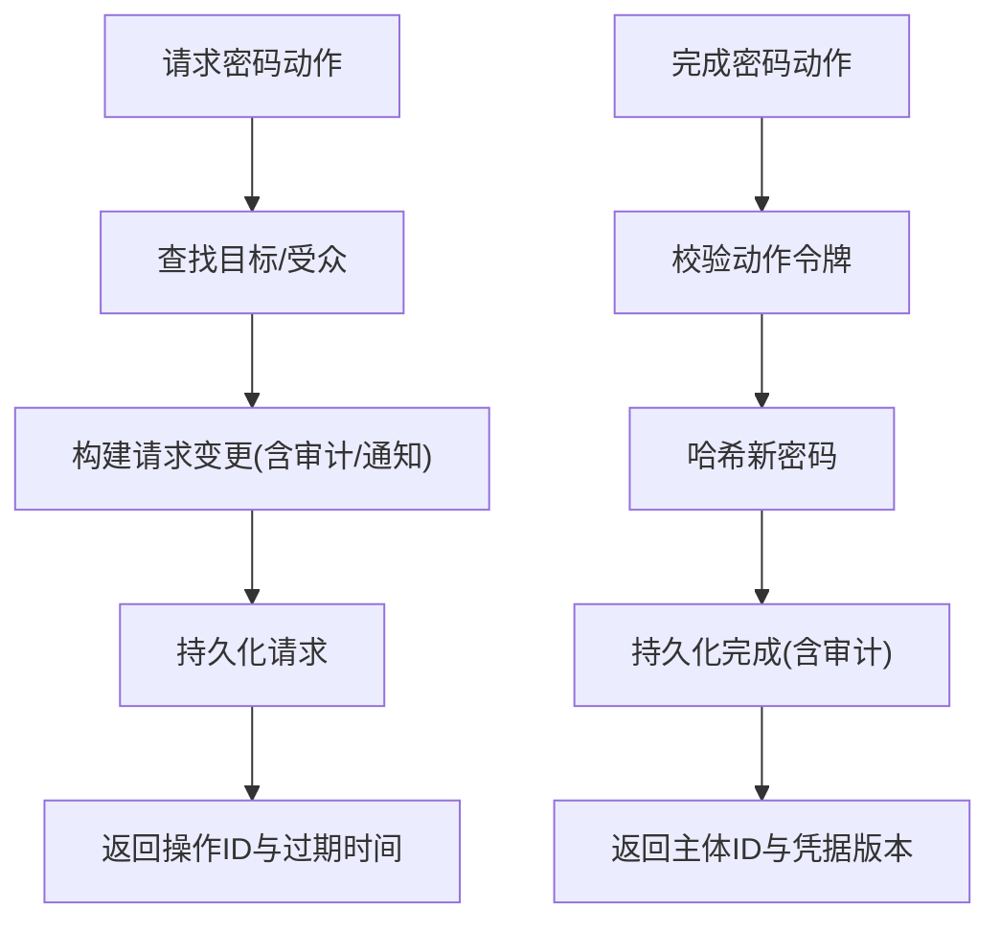
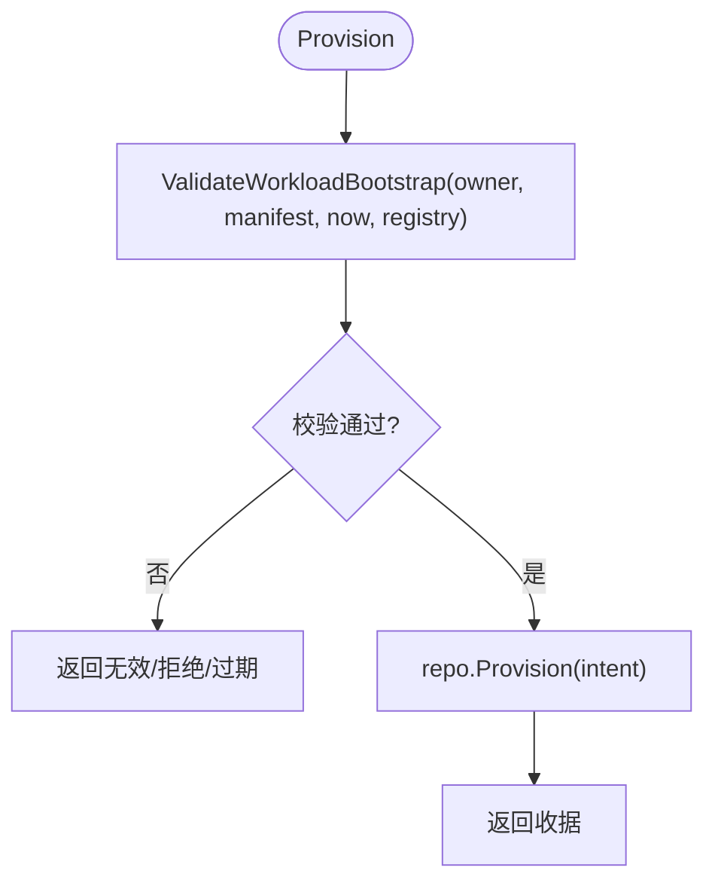
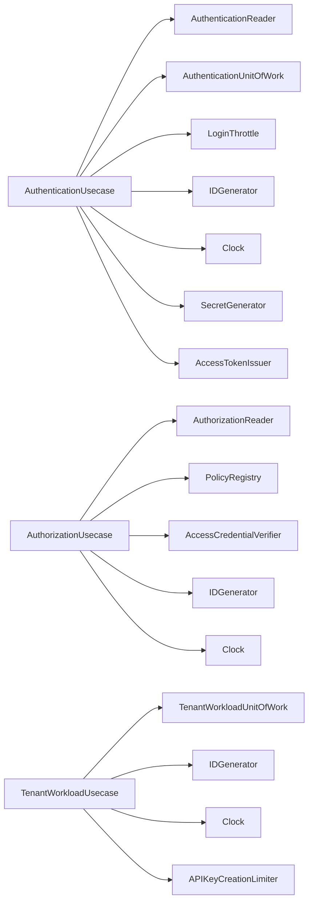

# 业务层(Business Layer)

<cite>
**本文引用的文件**
- [internal/biz/biz.go](file://internal/biz/biz.go)
- [internal/biz/authentication.go](file://internal/biz/authentication.go)
- [internal/biz/authorization.go](file://internal/biz/authorization.go)
- [internal/biz/workload.go](file://internal/biz/workload.go)
- [internal/biz/idempotency.go](file://internal/biz/idempotency.go)
- [internal/biz/tenant_workload.go](file://internal/biz/tenant_workload.go)
- [internal/biz/session.go](file://internal/biz/session.go)
- [internal/biz/membership.go](file://internal/biz/membership.go)
- [internal/biz/password_action.go](file://internal/biz/password_action.go)
- [internal/biz/workload_bootstrap.go](file://internal/biz/workload_bootstrap.go)
- [internal/biz/authentication_test.go](file://internal/biz/authentication_test.go)
- [internal/biz/authorization_test.go](file://internal/biz/authorization_test.go)
</cite>

## 目录
1. [简介](#简介)
2. [项目结构](#项目结构)
3. [核心组件](#核心组件)
4. [架构总览](#架构总览)
5. [详细组件分析](#详细组件分析)
6. [依赖关系分析](#依赖关系分析)
7. [性能考量](#性能考量)
8. [故障排查指南](#故障排查指南)
9. [结论](#结论)
10. [附录](#附录)

## 简介
本文件面向ANI IAM项目的业务层，聚焦认证、授权、租户与工作负载管理等核心用例的实现与编排。业务层以“用例+领域对象+事务单元”的方式封装复杂业务规则，协调多个数据访问操作，保证一致性、可审计性与幂等性。文档同时说明事务管理、领域事件处理、状态机设计、重试与幂等策略，以及单元测试与集成测试方法。

## 项目结构
业务层位于 internal/biz，按能力域划分：
- 认证与会话：authentication.go、session.go、password_action.go
- 授权决策：authorization.go
- 租户与工作负载：tenant_workload.go、workload.go、workload_bootstrap.go
- 成员关系与审计基础：membership.go
- 通用能力：idempotency.go（幂等）、biz.go（包级注释）

图表来源
- [internal/biz/authentication.go:286-339](file://internal/biz/authentication.go#L286-L339)
- [internal/biz/authorization.go:199-223](file://internal/biz/authorization.go#L199-L223)
- [internal/biz/tenant_workload.go:233-247](file://internal/biz/tenant_workload.go#L233-L247)
- [internal/biz/membership.go:155-163](file://internal/biz/membership.go#L155-L163)
- [internal/biz/idempotency.go:62-99](file://internal/biz/idempotency.go#L62-L99)

章节来源
- [internal/biz/biz.go:1-4](file://internal/biz/biz.go#L1-L4)

## 核心组件
- 认证用例 AuthenticationUsecase：密码登录、会话刷新、登出、租户切换、密码重置动作请求与完成；负责限流、令牌签发、审计记录与事务提交。
- 授权用例 AuthorizationUsecase：基于策略注册表与凭据校验进行权限判定，支持Access Token与API Key两条路径，并输出可审计的决策。
- 工作负载身份与授权 WorkloadAuthentication/WorkloadAuthorization：对mTLS/证书链验证后的工作负载身份进行解析与授权检查，产出DirectCaller供下游使用。
- 租户工作负载 TenantWorkloadUsecase：创建工作负载、创建/吊销API Key、更新状态；通过事务单元与幂等机制保证一致性。
- 成员关系 MembershipUsecase：在租户边界内创建成员关系并持久化审计事件。
- 幂等执行 executeMutation：基于锁、意图指纹与结果缓存实现跨重试的幂等。

章节来源
- [internal/biz/authentication.go:286-339](file://internal/biz/authentication.go#L286-L339)
- [internal/biz/authorization.go:199-223](file://internal/biz/authorization.go#L199-L223)
- [internal/biz/workload.go:56-106](file://internal/biz/workload.go#L56-L106)
- [internal/biz/tenant_workload.go:233-247](file://internal/biz/tenant_workload.go#L233-L247)
- [internal/biz/membership.go:155-163](file://internal/biz/membership.go#L155-L163)
- [internal/biz/idempotency.go:62-99](file://internal/biz/idempotency.go#L62-L99)

## 架构总览
业务层采用“用例驱动”的编排模式：每个用例接收命令对象，执行业务规则，调用事务单元或仓储接口，最终返回结果或错误。外部依赖通过接口注入，便于测试与替换。

图表来源
- [internal/biz/authentication.go:341-529](file://internal/biz/authentication.go#L341-L529)

章节来源
- [internal/biz/authentication.go:341-529](file://internal/biz/authentication.go#L341-L529)

## 详细组件分析

### 认证流程（密码登录与会话生命周期）
- 输入校验与限流：账户归一化、来源IP必填、防重键必填；先限流后查库，失败统一匿名审计。
- 状态机约束：主体、成员、租户访问、租户生命周期均须为有效态；会话具备空闲/绝对过期时间。
- 令牌与审计：签发短期Access Token与长期Refresh Token族；成功/失败均产生安全审计事件。
- 会话刷新/登出/租户切换：刷新时旋转Refresh Token并延长空闲时间；登出撤销当前会话；租户切换生成新Grant与Token族。

图表来源
- [internal/biz/authentication.go:341-529](file://internal/biz/authentication.go#L341-L529)
- [internal/biz/session.go:154-286](file://internal/biz/session.go#L154-L286)
- [internal/biz/session.go:288-348](file://internal/biz/session.go#L288-L348)
- [internal/biz/session.go:350-478](file://internal/biz/session.go#L350-L478)

章节来源
- [internal/biz/authentication.go:341-529](file://internal/biz/authentication.go#L341-L529)
- [internal/biz/session.go:154-478](file://internal/biz/session.go#L154-L478)

### 授权决策（Access Token与API Key）
- 策略注册表：操作ID映射到资源、动作、作用域、凭据类型与主体类型限制；策略版本必须匹配。
- Access Token路径：校验签名、有效期、主体/会话/授权版本；读取租户上下文与权限状态；拒绝原因明确可审计。
- API Key路径：解析Key ID与边界，校验活跃与过期；统计用量；跨租户拒绝前仍会记录未绑定审计。
- 平台范围：当策略作用域为平台时，交由平台授权用例处理。

图表来源
- [internal/biz/authorization.go:225-329](file://internal/biz/authorization.go#L225-L329)
- [internal/biz/authorization.go:331-420](file://internal/biz/authorization.go#L331-L420)

章节来源
- [internal/biz/authorization.go:225-420](file://internal/biz/authorization.go#L225-L420)

### 租户管理与工作负载管理
- 创建工作负载：校验名称、角色列表、审计Actor；通过事务单元创建Principal/Membership/Bindings并写入审计。
- 创建API Key：限流器控制创建频率；生成一次性凭证与摘要；写入密钥元数据与审计。
- 更新工作负载：乐观版本控制；激活时自动补全成员关系；禁用时回收相关密钥并记录审计。
- 吊销API Key：幂等处理已吊销状态；记录审计。

图表来源
- [internal/biz/tenant_workload.go:249-333](file://internal/biz/tenant_workload.go#L249-L333)
- [internal/biz/tenant_workload.go:335-411](file://internal/biz/tenant_workload.go#L335-L411)
- [internal/biz/tenant_workload.go:413-486](file://internal/biz/tenant_workload.go#L413-L486)
- [internal/biz/tenant_workload.go:488-536](file://internal/biz/tenant_workload.go#L488-L536)

章节来源
- [internal/biz/tenant_workload.go:249-536](file://internal/biz/tenant_workload.go#L249-L536)

### 工作负载身份与授权
- 身份解析：校验环境、信任域、x509_dns标识值；解析为内部WorkloadIdentity。
- 授权检查：校验目标操作是否注册且启用；查询授予版本；产出DirectCaller供后续鉴权。

图表来源
- [internal/biz/workload.go:62-72](file://internal/biz/workload.go#L62-L72)
- [internal/biz/workload.go:87-106](file://internal/biz/workload.go#L87-L106)

章节来源
- [internal/biz/workload.go:62-106](file://internal/biz/workload.go#L62-L106)

### 密码重置动作（请求与完成）
- 请求：根据账号与受众查找目标，生成带过期时间的操作令牌；若目标存在则构造通知；写入审计。
- 完成：校验令牌与目的；哈希新密码；生成指纹；原子更新凭据并记录审计。

图表来源
- [internal/biz/password_action.go:141-222](file://internal/biz/password_action.go#L141-L222)
- [internal/biz/password_action.go:224-298](file://internal/biz/password_action.go#L224-L298)

章节来源
- [internal/biz/password_action.go:141-298](file://internal/biz/password_action.go#L141-L298)

### 工作负载引导（Bootstrap）
- 清单校验：版本、标识符格式、信任域、CA指纹、数量限制、唯一性、授权目标白名单。
- 所有权校验：环境、信任域、CA指纹与提供者一致。
- 交付：将意图下推至仓储进行实际供给，返回收据。

图表来源
- [internal/biz/workload_bootstrap.go:93-102](file://internal/biz/workload_bootstrap.go#L93-L102)
- [internal/biz/workload_bootstrap.go:106-167](file://internal/biz/workload_bootstrap.go#L106-L167)

章节来源
- [internal/biz/workload_bootstrap.go:93-167](file://internal/biz/workload_bootstrap.go#L93-L167)

## 依赖关系分析
- 用例对外暴露接口：AuthenticationUsecase、AuthorizationUsecase、TenantWorkloadUsecase、MembershipUsecase、WorkloadAuthentication/Authorization、WorkloadBootstrap。
- 关键外部依赖通过接口注入：
  - 读侧：AuthenticationReader、AuthorizationReader、WorkloadIdentityReader、WorkloadGrantReader、PasswordActionReader
  - 写侧：AuthenticationUnitOfWork、TenantWorkloadUnitOfWork、TenantUnitOfWork、MutationResultTransaction
  - 辅助：LoginThrottle、SecretGenerator、IDGenerator、Clock、APIKeyUsageObserver、PolicyRegistry、AccessTokenIssuer、PasswordHasher、PasswordActionTokenCodec
- 耦合与内聚：用例仅依赖抽象接口，内聚业务规则；数据访问细节下沉至data层与sqlcgen。

图表来源
- [internal/biz/authentication.go:286-339](file://internal/biz/authentication.go#L286-L339)
- [internal/biz/authorization.go:199-223](file://internal/biz/authorization.go#L199-L223)
- [internal/biz/tenant_workload.go:233-247](file://internal/biz/tenant_workload.go#L233-L247)

章节来源
- [internal/biz/authentication.go:286-339](file://internal/biz/authentication.go#L286-L339)
- [internal/biz/authorization.go:199-223](file://internal/biz/authorization.go#L199-L223)
- [internal/biz/tenant_workload.go:233-247](file://internal/biz/tenant_workload.go#L233-L247)

## 性能考量
- 限流前置：登录与刷新均先做限流检查，避免无谓数据库访问。
- 短会话与长刷新：Access Token短期有效，Refresh Token家族轮换，降低高频鉴权压力。
- 幂等与去重：executeMutation通过锁与意图指纹避免重复执行；结果缓存减少二次计算。
- 审计与观测：API Key使用观察与操作审计异步或批量化落地，避免阻塞主路径。
- 策略注册表：本地缓存策略版本，快速拒绝不匹配请求。

[本节提供一般性指导，无需特定文件引用]

## 故障排查指南
- 常见错误分类
  - 认证：凭据无效、主体/成员/租户访问非活跃、租户生命周期阻塞或陈旧、限流触发、依赖不可用。
  - 授权：策略版本不匹配、操作未注册、凭据类型不被允许、跨租户拒绝、依赖不可用。
  - 工作负载：名称/角色缺失、冲突、已禁用、API Key不存在或冲突、过期配置非法。
  - 幂等：意图冲突、窗口过期、持久化状态非法。
- 定位建议
  - 查看审计事件中的DecisionID、RequestID、CorrelationID，串联一次请求的全链路。
  - 区分“未绑定”与“租户边界内”的拒绝审计，前者多为凭据无效或缺失。
  - 关注限流错误与依赖错误，优先恢复基础设施后再重试。
- 重试策略
  - 幂等写：携带稳定IdempotencyKey，服务端返回相同结果或冲突错误，客户端据此决定重试或放弃。
  - 读/鉴权：对依赖不可用错误可指数退避重试；对业务拒绝错误不应重试。

章节来源
- [internal/biz/authentication.go:15-29](file://internal/biz/authentication.go#L15-L29)
- [internal/biz/authorization.go:13-23](file://internal/biz/authorization.go#L13-L23)
- [internal/biz/tenant_workload.go:15-24](file://internal/biz/tenant_workload.go#L15-L24)
- [internal/biz/idempotency.go:16-18](file://internal/biz/idempotency.go#L16-L18)

## 结论
业务层通过清晰的用例边界、严格的领域状态机、可审计的事务单元与幂等机制，实现了高可靠、可追踪的认证、授权与租户/工作负载管理能力。依赖抽象使系统易于测试与演进，统一的审计与决策ID贯穿全流程，便于问题定位与合规审计。

[本节总结性内容，无需特定文件引用]

## 附录

### 事务管理与领域事件
- 事务单元：WithinTenant/WithinTenantWorkload/AuthenticationUnitOfWork 将多步写操作纳入同一事务，确保一致性。
- 领域事件：SecurityAuditEvent 作为不可变审计记录，随业务变更原子持久化，包含Actor、Boundary、Action、Target、Result、Reason、RequestID/CorrelationID/DecisionID等。
- 状态机：Principal/Membership/TenantAccess/Lifecycle/Session/Grant/RefreshToken 均有明确状态与转换约束，所有转换由用例集中维护。

章节来源
- [internal/biz/membership.go:87-119](file://internal/biz/membership.go#L87-L119)
- [internal/biz/tenant_workload.go:161-178](file://internal/biz/tenant_workload.go#L161-L178)
- [internal/biz/authentication.go:240-255](file://internal/biz/authentication.go#L240-L255)

### 幂等性与重试机制
- 幂等键：mutationIdentity 基于Actor、Operation、Key与字段序列化生成意图指纹，防止不同请求被误判为幂等。
- 锁与结果：LockMutation 串行化并发；FindMutation 命中则直接返回历史结果；SaveMutation 持久化结果与过期时间。
- 重试建议：客户端对幂等写使用稳定Key；对依赖错误可重试；对业务拒绝错误不重试。

章节来源
- [internal/biz/idempotency.go:43-99](file://internal/biz/idempotency.go#L43-L99)

### 单元测试策略
- 用例隔离：通过静态实现/记录器模拟依赖（如staticPasswordLoginReader、recordingLoginUnitOfWork、allowingAPIKeyUsageObserver）。
- 断言重点：返回值、状态转换、审计事件、限流调用次数与参数、错误类型。
- 示例参考：
  - 密码登录成功路径与失败路径覆盖
  - 授权决策中Access Token与API Key分支、跨租户拒绝、策略版本不匹配
  - 幂等冲突与过期场景

章节来源
- [internal/biz/authentication_test.go:19-86](file://internal/biz/authentication_test.go#L19-L86)
- [internal/biz/authentication_test.go:115-167](file://internal/biz/authentication_test.go#L115-L167)
- [internal/biz/authorization_test.go:15-66](file://internal/biz/authorization_test.go#L15-L66)
- [internal/biz/authorization_test.go:68-97](file://internal/biz/authorization_test.go#L68-L97)
- [internal/biz/authorization_test.go:130-178](file://internal/biz/authorization_test.go#L130-L178)

### 集成测试方法
- 端到端：结合真实PostgreSQL与Redis，覆盖登录、刷新、鉴权、工作负载引导、通知外发等完整链路。
- 契约测试：通过tests/contracts下的JSON契约校验API行为与错误模型一致性。
- 运行时测试：tests/integration 中针对具体特性（会话连续性、OIDC、通知恢复、垂直切片等）编写集成用例。

[本节为方法论概述，无需特定文件引用]