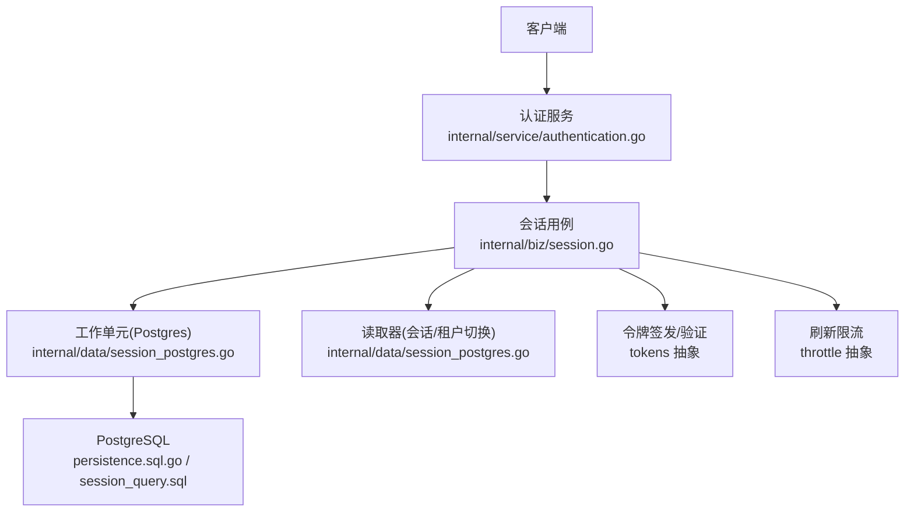
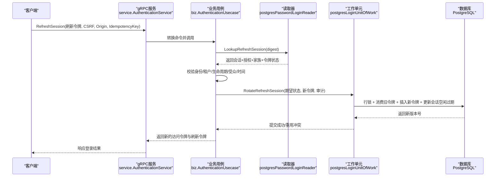
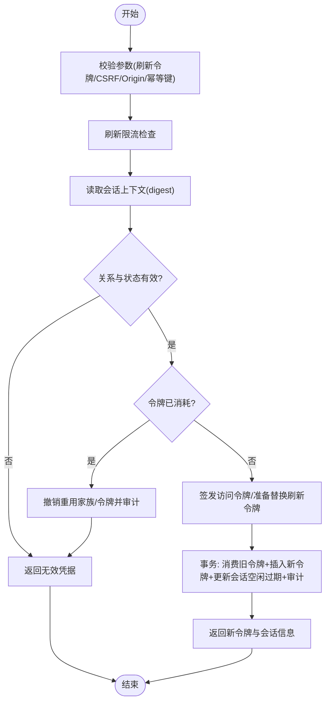
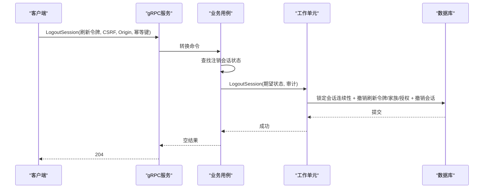
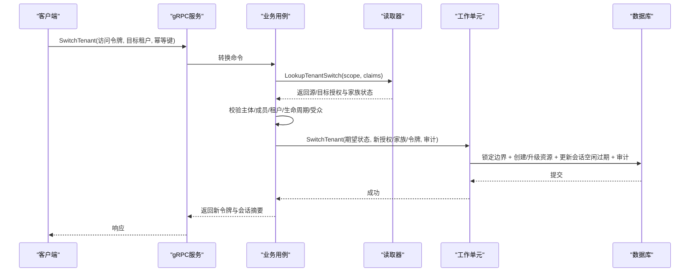
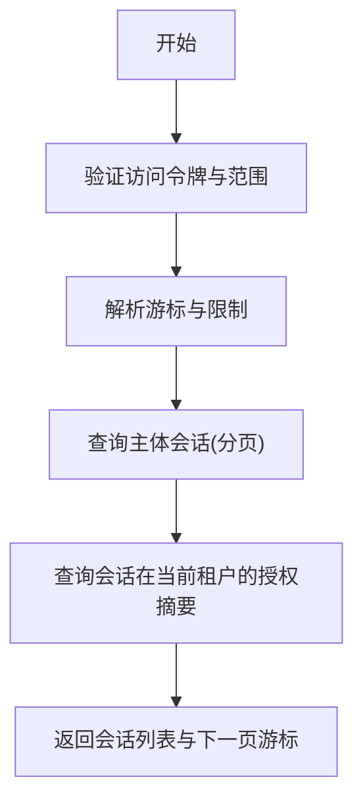
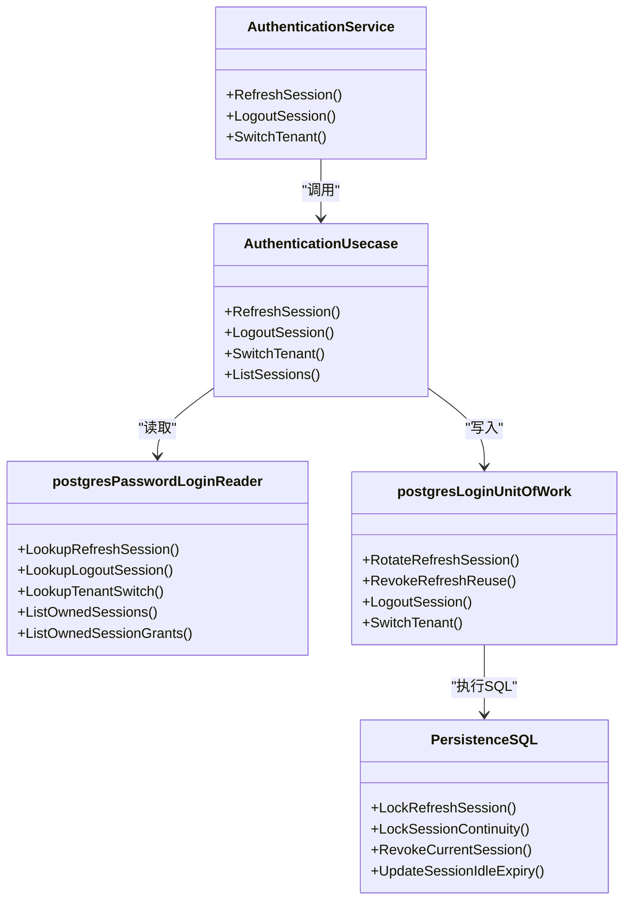
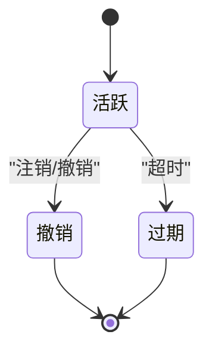

# 会话用例

<cite>
**本文引用的文件**
- [internal/biz/session.go](file://internal/biz/session.go)
- [internal/biz/session_query.go](file://internal/biz/session_query.go)
- [internal/data/session_postgres.go](file://internal/data/session_postgres.go)
- [internal/data/session_query.go](file://internal/data/session_query.go)
- [internal/service/authentication.go](file://internal/service/authentication.go)
- [internal/data/queries/session_query.sql](file://internal/data/queries/session_query.sql)
- [migrations/202609070002_session_continuity.sql](file://migrations/202609070002_session_continuity.sql)
- [internal/data/sqlcgen/persistence.sql.go](file://internal/data/sqlcgen/persistence.sql.go)
- [tests/integration/session_continuity_test.go](file://tests/integration/session_continuity_test.go)
</cite>

## 目录
1. [简介](#简介)
2. [项目结构](#项目结构)
3. [核心组件](#核心组件)
4. [架构总览](#架构总览)
5. [详细组件分析](#详细组件分析)
6. [依赖关系分析](#依赖关系分析)
7. [性能考量](#性能考量)
8. [故障排查指南](#故障排查指南)
9. [结论](#结论)
10. [附录](#附录)

## 简介
本文件面向 ANI IAM 项目的“会话用例”，系统化阐述会话创建、刷新、撤销与查询的核心业务逻辑，覆盖会话状态机设计、并发控制与数据一致性保证、安全机制（防重放与会话固定攻击防护）、持久化策略、缓存同步与分布式共享，以及高性能实现与查询优化。文档同时给出单元测试与并发场景测试方法，帮助读者在理解代码的同时掌握工程实践。

## 项目结构
会话能力贯穿服务层、业务层与数据访问层：
- 服务层：gRPC 接口将外部请求转换为领域命令并调用业务用例。
- 业务层：定义会话用例的领域模型、校验规则、审计事件与事务边界。
- 数据层：通过 SQLC 生成的查询与 PostgreSQL 行锁、版本控制、外键约束实现强一致性与并发安全。
- 迁移：数据库变更确保刷新令牌家族内仅有一个活跃令牌，并记录替换边。

图表来源
- [internal/service/authentication.go:196-254](file://internal/service/authentication.go#L196-L254)
- [internal/biz/session.go:154-478](file://internal/biz/session.go#L154-L478)
- [internal/data/session_postgres.go:75-498](file://internal/data/session_postgres.go#L75-L498)
- [internal/data/sqlcgen/persistence.sql.go:2739-2898](file://internal/data/sqlcgen/persistence.sql.go#L2739-L2898)

章节来源
- [internal/service/authentication.go:196-254](file://internal/service/authentication.go#L196-L254)
- [internal/biz/session.go:154-478](file://internal/biz/session.go#L154-L478)
- [internal/data/session_postgres.go:75-498](file://internal/data/session_postgres.go#L75-L498)

## 核心组件
- 会话用例（Refresh/Logout/SwitchTenant/List）：封装会话生命周期关键操作，包含参数校验、权限与生命周期检查、审计事件构造与持久化。
- 工作单元（UnitOfWork）：以事务为单位执行刷新轮换、注销、租户切换等写操作，使用行级锁与版本号保证并发安全。
- 读取器（Reader）：提供刷新会话、注销会话、租户切换所需的状态读取，用于前置校验与决策。
- 令牌与限流：签发短期访问令牌；对刷新操作进行速率限制，防止暴力破解与重放。
- 查询与分页：按主体列出会话与其授权摘要，支持游标分页。

章节来源
- [internal/biz/session.go:154-478](file://internal/biz/session.go#L154-L478)
- [internal/data/session_postgres.go:75-498](file://internal/data/session_postgres.go#L75-L498)
- [internal/data/session_query.go:11-57](file://internal/data/session_query.go#L11-L57)
- [internal/biz/session_query.go:39-107](file://internal/biz/session_query.go#L39-L107)

## 架构总览
会话用例采用“服务层 -> 业务层 -> 数据层”的分层架构。服务层负责协议适配与错误映射；业务层专注领域规则与审计；数据层通过事务、行锁、版本控制与约束保障一致性。

图表来源
- [internal/service/authentication.go:196-211](file://internal/service/authentication.go#L196-L211)
- [internal/biz/session.go:154-286](file://internal/biz/session.go#L154-L286)
- [internal/data/session_postgres.go:75-165](file://internal/data/session_postgres.go#L75-L165)
- [internal/data/sqlcgen/persistence.sql.go:2739-2898](file://internal/data/sqlcgen/persistence.sql.go#L2739-L2898)

## 详细组件分析

### 会话刷新（Refresh Session）
- 输入校验：必须提供刷新令牌、CSRF Token、Origin、幂等键；未满足则直接拒绝。
- 限流与查找：对刷新令牌摘要进行限流检查；根据摘要读取完整会话上下文（主体、租户、授权、家族、令牌）。
- 关系与状态校验：校验刷新令牌与家族、授权、会话的关系一致性；仅允许控制台受众；若令牌已消耗则走“重用处理”流程。
- 生成新令牌：计算新的空闲过期与访问过期时间；签发新的访问令牌；准备替换刷新令牌与审计事件。
- 原子旋转：在工作单元中加锁、消费旧令牌、插入新令牌、更新会话空闲过期、写入审计；若检测到重用则回滚并发冲突并返回通用无效凭据。
- 结果：返回新的访问令牌、刷新令牌、会话与授权摘要。

图表来源
- [internal/biz/session.go:154-286](file://internal/biz/session.go#L154-L286)
- [internal/data/session_postgres.go:75-165](file://internal/data/session_postgres.go#L75-L165)
- [internal/data/sqlcgen/persistence.sql.go:4368-4567](file://internal/data/sqlcgen/persistence.sql.go#L4368-L4567)

章节来源
- [internal/biz/session.go:154-286](file://internal/biz/session.go#L154-L286)
- [internal/data/session_postgres.go:75-165](file://internal/data/session_postgres.go#L75-L165)

### 会话注销（Logout Session）
- 输入校验：必须提供刷新令牌、CSRF、Origin、幂等键。
- 查找与幂等：根据刷新令牌摘要查找当前会话；若不存在或会话非活跃则幂等返回成功。
- 注销流程：在工作单元中锁定会话连续性，撤销当前会话的所有刷新令牌、家族与授权，并将会话标记为撤销，写入审计。
- 结果：返回空结果（对外统一 204 语义）。

图表来源
- [internal/service/authentication.go:213-230](file://internal/service/authentication.go#L213-L230)
- [internal/biz/session.go:288-348](file://internal/biz/session.go#L288-L348)
- [internal/data/session_postgres.go:268-350](file://internal/data/session_postgres.go#L268-L350)

章节来源
- [internal/service/authentication.go:213-230](file://internal/service/authentication.go#L213-L230)
- [internal/biz/session.go:288-348](file://internal/biz/session.go#L288-L348)
- [internal/data/session_postgres.go:268-350](file://internal/data/session_postgres.go#L268-L350)

### 租户切换（Switch Tenant）
- 输入校验：必须提供访问令牌、目标租户ID、幂等键。
- 读取与校验：基于访问令牌解析声明，读取源租户到目标租户的切换上下文；校验主体、成员资格、租户访问、生命周期与受众。
- 资源准备：为目标租户创建或升级授权与刷新令牌家族；必要时消费目标侧活跃刷新令牌并递增版本。
- 原子提交：在同一事务中完成会话空闲过期滑动、审计写入；返回新的访问令牌与刷新令牌。

图表来源
- [internal/service/authentication.go:232-254](file://internal/service/authentication.go#L232-L254)
- [internal/biz/session.go:350-478](file://internal/biz/session.go#L350-L478)
- [internal/data/session_postgres.go:352-498](file://internal/data/session_postgres.go#L352-L498)

章节来源
- [internal/service/authentication.go:232-254](file://internal/service/authentication.go#L232-L254)
- [internal/biz/session.go:350-478](file://internal/biz/session.go#L350-L478)
- [internal/data/session_postgres.go:352-498](file://internal/data/session_postgres.go#L352-L498)

### 会话查询（List Sessions）
- 鉴权与范围：基于访问令牌解析主体与租户范围；平台边界走平台会话列表路径。
- 游标分页：支持 base64 编码的游标，限制每页条数，避免全表扫描。
- 聚合展示：列出主体拥有的会话，并在当前租户范围内聚合授权摘要。

图表来源
- [internal/biz/session_query.go:39-107](file://internal/biz/session_query.go#L39-L107)
- [internal/data/session_query.go:11-57](file://internal/data/session_query.go#L11-L57)
- [internal/data/queries/session_query.sql:1-14](file://internal/data/queries/session_query.sql#L1-L14)

章节来源
- [internal/biz/session_query.go:39-107](file://internal/biz/session_query.go#L39-L107)
- [internal/data/session_query.go:11-57](file://internal/data/session_query.go#L11-L57)
- [internal/data/queries/session_query.sql:1-14](file://internal/data/queries/session_query.sql#L1-L14)

## 依赖关系分析
- 服务层依赖业务用例接口，屏蔽协议细节与错误映射。
- 业务用例依赖读取器与工作单元，解耦读路径与写路径。
- 数据层通过 SQLC 生成查询，结合 PostgreSQL 的行锁、版本列与约束实现强一致。
- 外部依赖：令牌签发/验证、刷新限流、时钟抽象、ID 生成器。

图表来源
- [internal/service/authentication.go:22-30](file://internal/service/authentication.go#L22-L30)
- [internal/biz/session.go:141-152](file://internal/biz/session.go#L141-L152)
- [internal/data/session_postgres.go:17-73](file://internal/data/session_postgres.go#L17-L73)
- [internal/data/sqlcgen/persistence.sql.go:2739-2898](file://internal/data/sqlcgen/persistence.sql.go#L2739-L2898)

章节来源
- [internal/service/authentication.go:22-30](file://internal/service/authentication.go#L22-L30)
- [internal/biz/session.go:141-152](file://internal/biz/session.go#L141-L152)
- [internal/data/session_postgres.go:17-73](file://internal/data/session_postgres.go#L17-L73)
- [internal/data/sqlcgen/persistence.sql.go:2739-2898](file://internal/data/sqlcgen/persistence.sql.go#L2739-L2898)

## 性能考量
- 刷新令牌家族内仅一个活跃令牌：通过唯一索引与约束减少并发竞争面，提升旋转效率。
- 行级锁与事务隔离：使用 ReadCommitted 与显式行锁，避免幻读与脏写，降低锁粒度。
- 游标分页：会话列表使用 ID 游标与 LIMIT，避免深翻页开销。
- 审计追加：审计事件作为追加型写入，避免热点更新。
- 建议优化：
  - 合理设置刷新令牌空闲过期与绝对过期，平衡用户体验与安全性。
  - 在高并发刷新场景下，关注数据库连接池与慢查询日志。
  - 对频繁查询的会话列表可考虑只读副本或物化视图（需评估一致性要求）。

[本节为通用指导，不直接分析具体文件]

## 故障排查指南
- 常见错误与定位：
  - 无效凭据：刷新令牌已消耗、关系不一致、受众不符、时间过期、主体/成员/租户状态异常。
  - 版本冲突：并发修改导致预期版本不匹配，需重试或重新获取最新状态。
  - 审计冲突：审计事件 ID 重复或不可用，需检查 ID 生成与存储。
  - 依赖不可用：令牌服务、限流服务、数据库不可用时，服务层会返回明确的不可用状态。
- 排查步骤：
  - 检查请求参数是否齐全（刷新令牌、CSRF、Origin、幂等键）。
  - 查看数据库中的会话、授权、家族与令牌状态，确认是否被撤销或过期。
  - 核对审计事件是否成功写入，是否存在重复 ID。
  - 检查限流配置与阈值，避免误判为攻击。

章节来源
- [internal/service/authentication.go:476-683](file://internal/service/authentication.go#L476-L683)
- [internal/data/session_postgres.go:75-498](file://internal/data/session_postgres.go#L75-L498)

## 结论
ANI IAM 的会话用例通过清晰的分层设计与严格的并发控制，实现了高安全、高可用的会话管理。刷新令牌家族内单活跃令牌、行级锁与版本控制确保了数据一致性；CSRF、Origin、限流与审计机制提供了完善的防重放与会话固定攻击防护；游标分页与追加审计提升了查询与写入性能。建议在部署时关注数据库性能与连接池配置，并结合监控与告警持续优化。

[本节为总结性内容，不直接分析具体文件]

## 附录

### 会话状态机设计
- 会话状态：活跃、撤销、过期。
- 授权状态：活跃、撤销、过期。
- 刷新令牌家族状态：活跃、撤销、过期。
- 刷新令牌状态：活跃、消耗、撤销。
- 状态转换由业务用例驱动，并通过数据库约束与版本控制保证一致性。

[此图为概念性状态机示意，不对应具体源码结构]

### 并发控制与数据一致性
- 刷新旋转：先锁定会话连续性，再锁定刷新令牌行，消费旧令牌并插入新令牌，最后更新会话空闲过期与审计。
- 重用处理：若检测到令牌已消耗，撤销家族与所有活跃令牌，递增授权版本，并写入重用审计。
- 注销：锁定会话连续性，批量撤销刷新令牌、家族与授权，再将会话标记为撤销。
- 租户切换：锁定边界，创建或升级授权与家族，必要时消费目标侧活跃令牌并递增版本。

章节来源
- [internal/data/session_postgres.go:75-498](file://internal/data/session_postgres.go#L75-L498)
- [internal/data/sqlcgen/persistence.sql.go:4368-4567](file://internal/data/sqlcgen/persistence.sql.go#L4368-L4567)

### 安全机制
- 防重放攻击：刷新令牌摘要限流、CSRF Token、Origin 校验、幂等键。
- 会话固定攻击防护：每次刷新均签发新的刷新令牌与访问令牌，旧令牌立即失效；家族内仅一个活跃令牌。
- 审计追踪：所有关键操作（刷新、重用、注销、租户切换）均写入审计事件，便于追溯与取证。

章节来源
- [internal/biz/session.go:154-286](file://internal/biz/session.go#L154-L286)
- [internal/biz/session.go:288-478](file://internal/biz/session.go#L288-L478)
- [migrations/202609070002_session_continuity.sql:1-19](file://migrations/202609070002_session_continuity.sql#L1-L19)

### 持久化策略与分布式共享
- 持久化：会话、授权、家族、令牌均持久化于 PostgreSQL，使用版本列与约束保证一致性。
- 缓存同步：当前实现未引入应用层缓存；如需缓存，应在读取路径增加一致性策略（如失效模式或版本号校验）。
- 分布式共享：通过数据库行锁与事务隔离实现跨实例共享；无额外分布式锁需求。

章节来源
- [internal/data/session_postgres.go:75-498](file://internal/data/session_postgres.go#L75-L498)
- [internal/data/sqlcgen/persistence.sql.go:2739-2898](file://internal/data/sqlcgen/persistence.sql.go#L2739-L2898)

### 单元测试与并发测试
- 单元测试：覆盖刷新旋转、重用撤销、注销幂等、租户切换等核心路径，验证审计事件与状态变化。
- 并发测试：模拟并发刷新，验证仅一次成功旋转，其余触发重用撤销；验证会话版本与家族状态正确演进。
- 回滚测试：注入审计冲突，验证事务回滚与状态不变。

章节来源
- [tests/integration/session_continuity_test.go:108-289](file://tests/integration/session_continuity_test.go#L108-L289)
- [internal/biz/session_test.go:13-200](file://internal/biz/session_test.go#L13-L200)