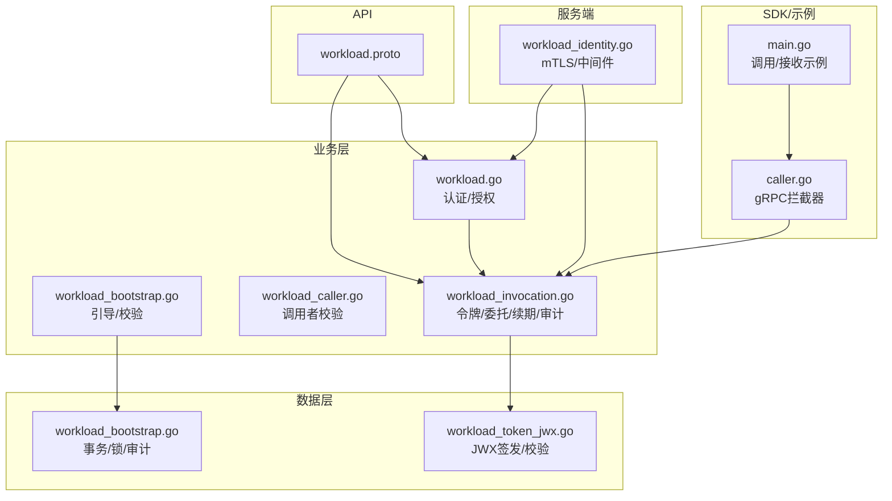
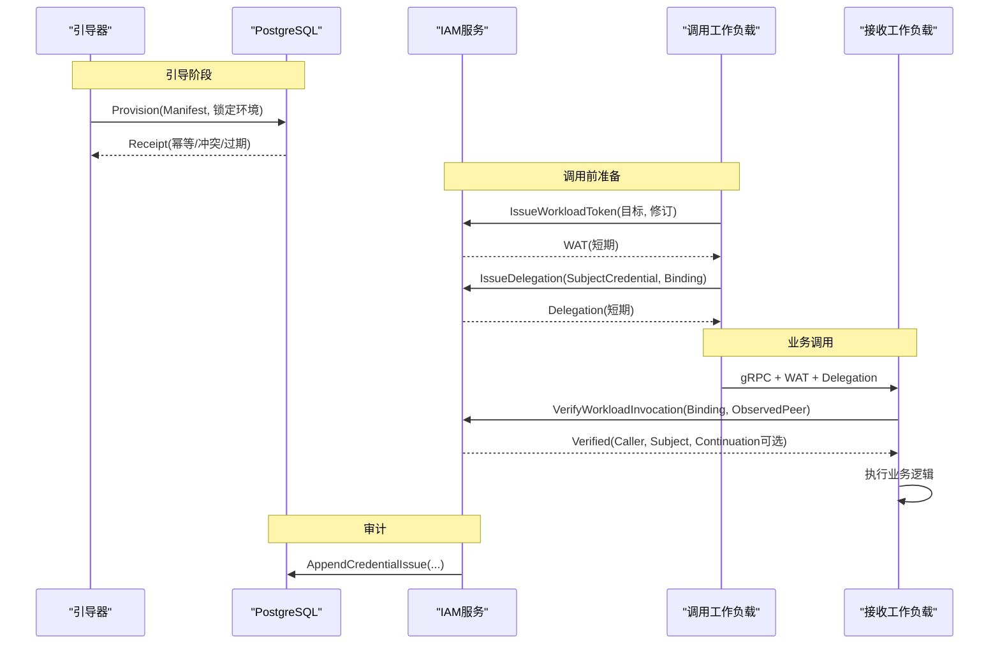
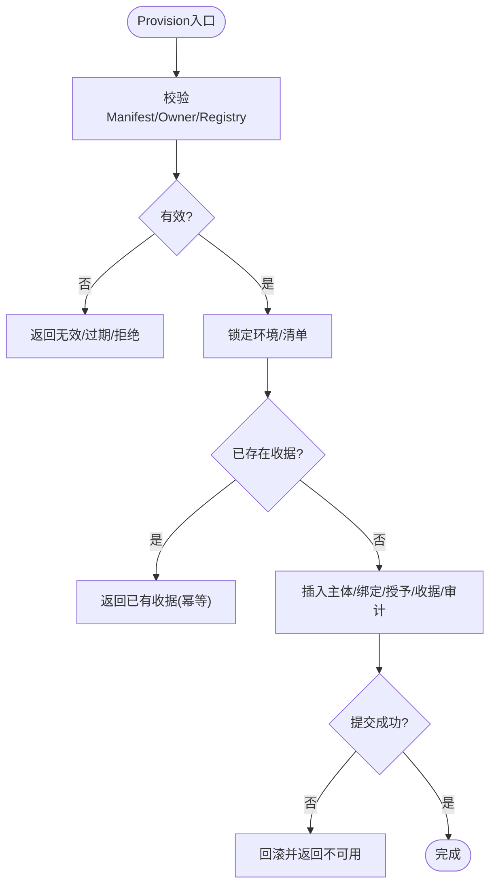
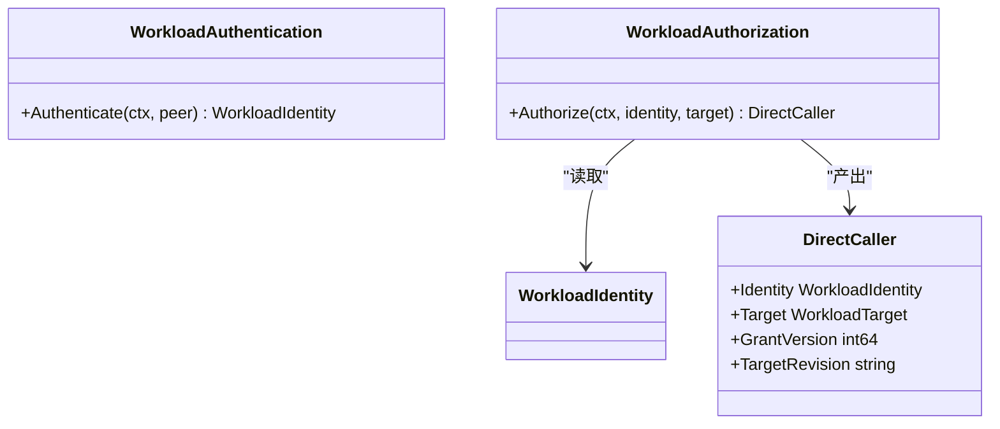
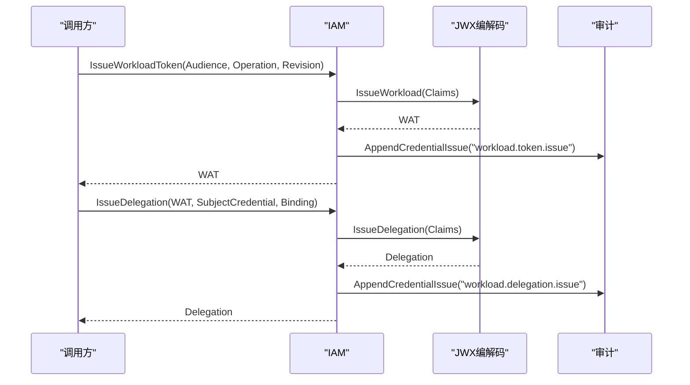
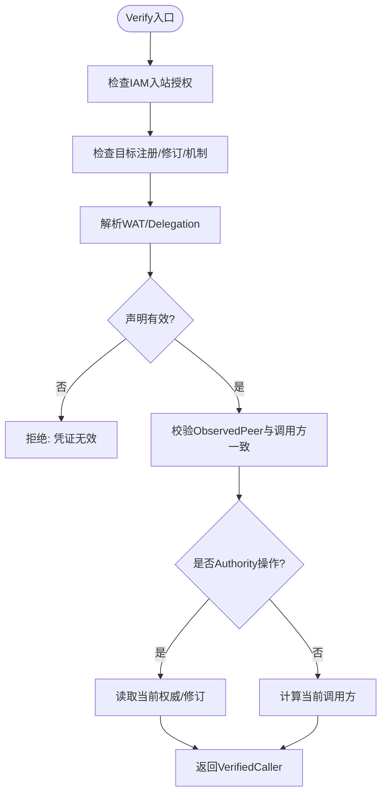
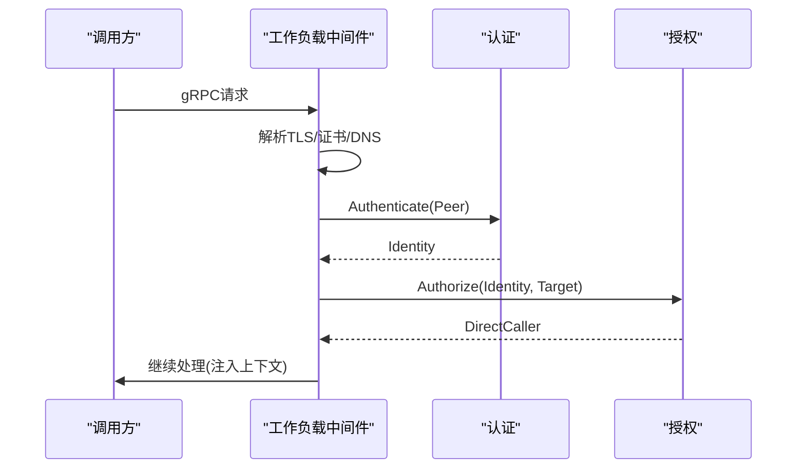
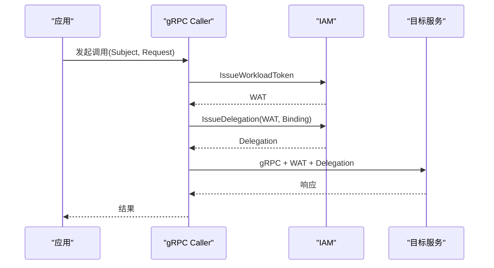
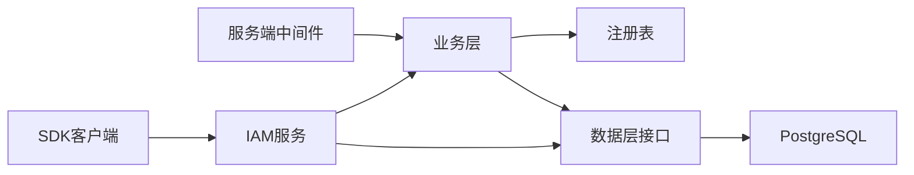

# 工作负载用例

<cite>
**本文引用的文件**
- [workload.go](file://internal/biz/workload.go)
- [workload_bootstrap.go](file://internal/biz/workload_bootstrap.go)
- [workload_caller.go](file://internal/biz/workload_caller.go)
- [workload_invocation.go](file://internal/biz/workload_invocation.go)
- [workload.proto](file://api/iam/v1/workload.proto)
- [workload_bootstrap.go](file://internal/data/workload_bootstrap.go)
- [workload_token_jwx.go](file://internal/data/workload_token_jwx.go)
- [workload_identity.go](file://internal/server/workload_identity.go)
- [caller.go](file://sdk/grpcworkload/caller.go)
- [main.go](file://examples/workload-grpc/main.go)
- [workload_test.go](file://internal/biz/workload_test.go)
- [workload_bootstrap_test.go](file://tests/integration/workload_bootstrap_test.go)
- [workload_invocation_test.go](file://tests/integration/workload_invocation_test.go)
</cite>

## 目录
1. [简介](#简介)
2. [项目结构](#项目结构)
3. [核心组件](#核心组件)
4. [架构总览](#架构总览)
5. [详细组件分析](#详细组件分析)
6. [依赖关系分析](#依赖关系分析)
7. [性能与可靠性](#性能与可靠性)
8. [故障排查指南](#故障排查指南)
9. [结论](#结论)
10. [附录：测试策略与示例](#附录测试策略与示例)

## 简介
本文件面向ANI IAM项目中“工作负载（Workload）”用例的完整文档，聚焦以下目标：
- 工作负载注册（引导/Bootstrap）流程、输入校验与幂等性
- 短期令牌生成（工作负载令牌WAT）、委托令牌（Delegation）与续期凭证（Continuation）
- 调用者身份验证与权限委托机制（工作负载到服务、服务到业务主体）
- 调用审计记录与可追溯性
- 生命周期管理、状态转换与故障恢复策略
- 工作负载间通信的安全机制、令牌轮换与权限边界控制
- 单元测试与集成测试策略，以及可靠消息传递与事务一致性实践

## 项目结构
围绕工作负载用例的关键代码分布在以下层次：
- API契约层：定义工作负载相关的请求/响应与绑定模型
- 业务逻辑层：认证、授权、令牌签发、委托、续期、审计
- 数据持久化层：PostgreSQL事务、锁、审计事件写入、JWX编解码
- 服务端中间件：mTLS证书校验、工作负载身份解析、上下文注入
- SDK客户端：自动为每次调用申请短期凭证并附加到元数据
- 示例程序：演示调用方与接收方的端到端交互

图表来源
- [workload.proto:10-121](file://api/iam/v1/workload.proto#L10-L121)
- [workload.go:17-117](file://internal/biz/workload.go#L17-L117)
- [workload_bootstrap.go:25-173](file://internal/biz/workload_bootstrap.go#L25-L173)
- [workload_caller.go:18-114](file://internal/biz/workload_caller.go#L18-L114)
- [workload_invocation.go:65-452](file://internal/biz/workload_invocation.go#L65-L452)
- [workload_bootstrap.go:20-165](file://internal/data/workload_bootstrap.go#L20-L165)
- [workload_token_jwx.go:18-250](file://internal/data/workload_token_jwx.go#L18-L250)
- [workload_identity.go:22-146](file://internal/server/workload_identity.go#L22-L146)
- [caller.go:19-110](file://sdk/grpcworkload/caller.go#L19-L110)
- [main.go:29-222](file://examples/workload-grpc/main.go#L29-L222)

章节来源
- [workload.proto:10-121](file://api/iam/v1/workload.proto#L10-L121)
- [workload.go:17-117](file://internal/biz/workload.go#L17-L117)
- [workload_bootstrap.go:25-173](file://internal/biz/workload_bootstrap.go#L25-L173)
- [workload_caller.go:18-114](file://internal/biz/workload_caller.go#L18-L114)
- [workload_invocation.go:65-452](file://internal/biz/workload_invocation.go#L65-L452)
- [workload_bootstrap.go:20-165](file://internal/data/workload_bootstrap.go#L20-L165)
- [workload_token_jwx.go:18-250](file://internal/data/workload_token_jwx.go#L18-L250)
- [workload_identity.go:22-146](file://internal/server/workload_identity.go#L22-L146)
- [caller.go:19-110](file://sdk/grpcworkload/caller.go#L19-L110)
- [main.go:29-222](file://examples/workload-grpc/main.go#L29-L222)

## 核心组件
- 工作负载身份与授权
  - 通过mTLS证书链校验提取DNS身份，结合环境、信任域与身份类型进行认证
  - 基于注册表与授予版本检查目标操作是否启用且匹配当前修订
  - 将已认证的调用者以DirectCaller形式注入上下文，供后续处理使用
- 工作负载引导（Bootstrap）
  - 校验清单（Manifest）格式、唯一性、过期时间、名称/DNS合法性、授予目标是否在注册表中
  - 在数据库中以事务+行级锁方式创建主体、绑定、授予并写入收据与审计事件
  - 保证同一环境仅一次初始化，重复意图幂等返回收据
- 工作负载令牌与委托
  - 签发短期工作负载令牌（WAT），绑定调用方目标与修订版本
  - 签发委托令牌（Delegation），将业务主体（人类或工作负载）与本次请求绑定
  - 支持会话续期凭证（Continuation），用于跨跳安全重检
- 调用者校验
  - 在线校验工作负载令牌与委托，确保目标、修订、时效、主体范围一致
  - 对受控能力（Authority）路径进行额外权威校验与修订比对
- 审计记录
  - 所有令牌签发均追加审计事件，包含行为、边界、目标、结果与时间戳

章节来源
- [workload.go:17-117](file://internal/biz/workload.go#L17-L117)
- [workload_bootstrap.go:25-173](file://internal/biz/workload_bootstrap.go#L25-L173)
- [workload_invocation.go:146-452](file://internal/biz/workload_invocation.go#L146-L452)
- [workload_caller.go:18-114](file://internal/biz/workload_caller.go#L18-L114)
- [workload_bootstrap.go:20-165](file://internal/data/workload_bootstrap.go#L20-L165)
- [workload_token_jwx.go:18-250](file://internal/data/workload_token_jwx.go#L18-L250)

## 架构总览
下图展示了工作负载从引导、认证、授权到调用与审计的整体流程。

图表来源
- [workload_bootstrap.go:93-126](file://internal/biz/workload_bootstrap.go#L93-L126)
- [workload_bootstrap.go:33-126](file://internal/data/workload_bootstrap.go#L33-L126)
- [workload_invocation.go:146-236](file://internal/biz/workload_invocation.go#L146-L236)
- [workload_invocation.go:238-292](file://internal/biz/workload_invocation.go#L238-L292)
- [workload_token_jwx.go:36-66](file://internal/data/workload_token_jwx.go#L36-L66)

## 详细组件分析

### 工作负载引导（Bootstrap）
- 输入校验
  - Manifest版本、ID格式、环境名、信任域名、CA指纹、过期时间、工作负载数量限制
  - 每个工作负载的主键、绑定ID、名称、DNS身份、授予列表唯一性与上限
  - 授予目标必须在注册表中存在且启用
- 幂等与并发
  - 使用数据库锁保护环境与清单，避免重复消费
  - 相同ManifestID重复提交返回已有收据；不同ManifestID在同一环境中被拒绝
- 事务与审计
  - 在一个事务中插入主体、绑定、授予、收据与审计事件
  - 审计失败回滚，保证一致性
- 角色与权限
  - 仅允许受限provisioner角色执行，运行时角色禁止修改敏感表

图表来源
- [workload_bootstrap.go:93-167](file://internal/biz/workload_bootstrap.go#L93-L167)
- [workload_bootstrap.go:33-126](file://internal/data/workload_bootstrap.go#L33-L126)

章节来源
- [workload_bootstrap.go:93-167](file://internal/biz/workload_bootstrap.go#L93-L167)
- [workload_bootstrap.go:33-126](file://internal/data/workload_bootstrap.go#L33-L126)

### 工作负载身份认证与授权
- 认证
  - 从mTLS证书链提取DNS名称，校验环境、信任域、身份类型与值
  - 查询工作负载身份映射，返回WorkloadIdentity
- 授权
  - 校验目标在注册表中存在且启用，且传入的修订版本匹配
  - 检查授予版本，返回DirectCaller（含Principal/Binding/Grant/TargetRevision）
- 上下文传播
  - 将DirectCaller注入context，后续步骤无需重复鉴权

图表来源
- [workload.go:56-117](file://internal/biz/workload.go#L56-L117)

章节来源
- [workload.go:56-117](file://internal/biz/workload.go#L56-L117)

### 工作负载令牌与委托（WAT/Delegation/Continuation）
- 工作负载令牌（WAT）
  - 由IAM签发，绑定调用方目标与修订，TTL短（分钟级）
  - 使用JWS签名，携带audience、subject、issued_at、exp、自定义上下文
- 委托令牌（Delegation）
  - 将业务主体（人类访问令牌或工作负载API Key）与本次请求绑定
  - 校验主体范围、租户、资源、策略修订与源操作
  - TTL更短（分钟级），不可刷新
- 会话续期凭证（Continuation）
  - 针对支持continuation的目标，IAM返回一次性续期引用
  - 接收方可在线重检，不扩展权限，不重新颁发新凭证

图表来源
- [workload_invocation.go:146-236](file://internal/biz/workload_invocation.go#L146-L236)
- [workload_token_jwx.go:36-66](file://internal/data/workload_token_jwx.go#L36-L66)

章节来源
- [workload_invocation.go:146-236](file://internal/biz/workload_invocation.go#L146-L236)
- [workload_token_jwx.go:36-66](file://internal/data/workload_token_jwx.go#L36-L66)

### 调用者校验与权限边界
- 在线校验
  - 校验WAT与Delegation的有效性、时效、目标与修订
  - 校验ObservedPeer与当前调用方身份一致
  - 对Authority操作进行额外权威校验与修订比对
- 权限边界
  - 调用方只能访问其被授予的目标与操作
  - 委托令牌严格绑定租户、资源、策略修订与源操作
  - 人类与工作负载主体在委托时有不同的校验规则

图表来源
- [workload_caller.go:43-114](file://internal/biz/workload_caller.go#L43-L114)
- [workload_invocation.go:238-292](file://internal/biz/workload_invocation.go#L238-L292)

章节来源
- [workload_caller.go:43-114](file://internal/biz/workload_caller.go#L43-L114)
- [workload_invocation.go:238-292](file://internal/biz/workload_invocation.go#L238-L292)

### 服务端中间件与mTLS
- 中间件职责
  - 从gRPC上下文中获取传输信息，校验是否为GRPC
  - 从TLS握手信息中提取证书链与叶子证书，校验用途、有效期与DNS
  - 调用认证与授权，将DirectCaller注入上下文
- 错误处理
  - 将认证失败、权限拒绝、超时与不可用转换为标准gRPC状态码与详情

图表来源
- [workload_identity.go:22-117](file://internal/server/workload_identity.go#L22-L117)

章节来源
- [workload_identity.go:22-117](file://internal/server/workload_identity.go#L22-L117)

### SDK客户端与调用模式
- 客户端职责
  - 维护目标索引与注册表，禁用重试
  - 每次调用前申请WAT与Delegation，附加到gRPC元数据
  - 清理敏感头，防止泄露
- 示例程序
  - 展示如何配置注册表、TLS、目标描述、资源边界检查与调用/接收流程

图表来源
- [caller.go:25-110](file://sdk/grpcworkload/caller.go#L25-L110)
- [main.go:120-210](file://examples/workload-grpc/main.go#L120-L210)

章节来源
- [caller.go:25-110](file://sdk/grpcworkload/caller.go#L25-L110)
- [main.go:120-210](file://examples/workload-grpc/main.go#L120-L210)

## 依赖关系分析
- 组件耦合
  - 业务层依赖注册表（workloadregistry）与数据接口（身份、授予、审计、ID生成、时钟）
  - 数据层实现JWX编解码、PostgreSQL事务与审计写入
  - 服务端中间件依赖业务认证/授权，负责传输层安全
  - SDK客户端依赖IAM服务与注册表，封装凭证申请与元数据注入
- 外部依赖
  - PostgreSQL（事务、锁、审计）
  - Redis（限流、登录节流等，非本用例核心）
  - gRPC/mTLS（传输安全）
- 循环依赖
  - 通过接口抽象避免直接循环依赖（如WorkloadIdentityReader、WorkloadGrantReader等）

图表来源
- [workload.go:48-117](file://internal/biz/workload.go#L48-L117)
- [workload_bootstrap.go:20-165](file://internal/data/workload_bootstrap.go#L20-L165)
- [workload_token_jwx.go:18-250](file://internal/data/workload_token_jwx.go#L18-L250)
- [workload_identity.go:22-146](file://internal/server/workload_identity.go#L22-L146)
- [caller.go:19-110](file://sdk/grpcworkload/caller.go#L19-L110)

章节来源
- [workload.go:48-117](file://internal/biz/workload.go#L48-L117)
- [workload_bootstrap.go:20-165](file://internal/data/workload_bootstrap.go#L20-L165)
- [workload_token_jwx.go:18-250](file://internal/data/workload_token_jwx.go#L18-L250)
- [workload_identity.go:22-146](file://internal/server/workload_identity.go#L22-L146)
- [caller.go:19-110](file://sdk/grpcworkload/caller.go#L19-L110)

## 性能与可靠性
- 短期令牌与最小权限
  - WAT与Delegation均为短期有效，降低泄露风险
  - 每次调用在线校验，确保权限实时生效
- 幂等与并发安全
  - 引导阶段使用数据库锁与唯一约束，避免重复消费与冲突
  - 审计失败回滚，保证数据一致性
- 可扩展性
  - 注册表驱动的目标与机制，便于新增服务与操作
  - 接口抽象使替换存储或加密实现成为可能
- 建议优化
  - 在高并发场景下，关注数据库锁竞争与网络往返次数
  - 合理设置TTL与重试策略，避免雪崩

[本节为通用指导，不直接分析具体文件]

## 故障排查指南
- 常见错误
  - 凭证无效：检查WAT/Delegation的签名、时效、目标与修订
  - 权限拒绝：检查授予状态、目标注册、策略修订与主体范围
  - 身份无效：检查mTLS证书链、DNS、环境、信任域
  - 持久化不可用：检查数据库连接、锁、审计写入
- 定位方法
  - 查看审计事件中的Action、TargetType、Result与Reason
  - 核对注册表Revision与请求中的TargetRevision
  - 检查ObservedPeer与当前调用方身份是否一致
- 恢复策略
  - 重新申请短期凭证
  - 修正Binding或SubjectCredential
  - 修复授予或策略后重试

章节来源
- [workload_identity.go:93-146](file://internal/server/workload_identity.go#L93-L146)
- [workload_invocation.go:396-409](file://internal/biz/workload_invocation.go#L396-L409)
- [workload_bootstrap.go:128-165](file://internal/data/workload_bootstrap.go#L128-L165)

## 结论
ANI IAM的工作负载用例通过严格的mTLS认证、注册表驱动的授权、短期令牌与委托机制，实现了高安全性的工作负载间通信与权限边界控制。引导流程提供幂等、并发安全的初始化能力；调用链路具备在线校验与审计追踪；SDK简化了客户端集成。整体设计兼顾安全性、可观测性与可维护性，适合在生产环境中部署。

[本节为总结，不直接分析具体文件]

## 附录：测试策略与示例
- 单元测试
  - 覆盖身份认证、授权、令牌签发与校验的核心路径
  - 模拟依赖（身份解析、授予检查、审计写入）以隔离外部影响
- 集成测试
  - 端到端验证引导、令牌签发、委托、在线校验与续期
  - 验证并发幂等、冲突、过期、审计回滚与角色守卫
- 示例程序
  - 展示调用方与接收方的配置、TLS、目标描述与资源边界检查
  - 演示完整的三进程链：调用方→IAM→接收方

章节来源
- [workload_test.go:1-110](file://internal/biz/workload_test.go#L1-L110)
- [workload_bootstrap_test.go:37-192](file://tests/integration/workload_bootstrap_test.go#L37-L192)
- [workload_invocation_test.go:38-200](file://tests/integration/workload_invocation_test.go#L38-L200)
- [main.go:29-222](file://examples/workload-grpc/main.go#L29-L222)