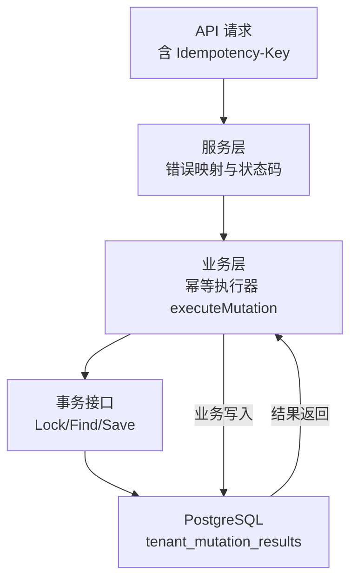
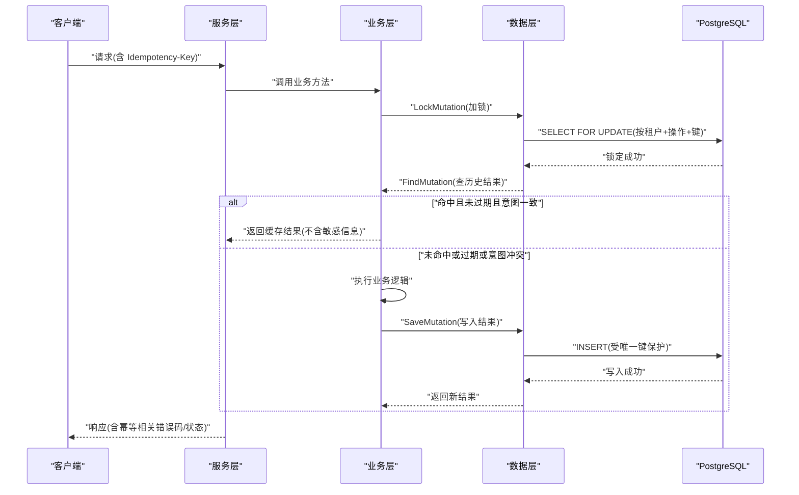
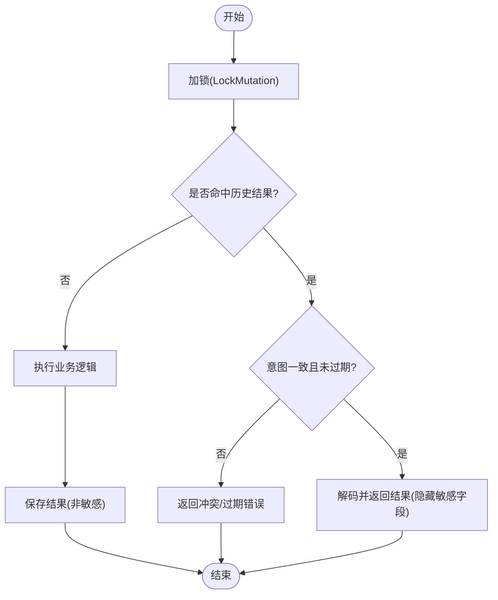
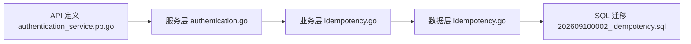

# 幂等性模式

<cite>
**本文引用的文件**
- [internal/biz/idempotency.go](file://internal/biz/idempotency.go)
- [internal/data/idempotency.go](file://internal/data/idempotency.go)
- [migrations/202609100002_idempotency.sql](file://migrations/202609100002_idempotency.sql)
- [internal/service/authentication.go](file://internal/service/authentication.go)
- [api/iam/v1/authentication_service.pb.go](file://api/iam/v1/authentication_service.pb.go)
- [tests/integration/idempotency_test.go](file://tests/integration/idempotency_test.go)
- [internal/biz/idempotency_test.go](file://internal/biz/idempotency_test.go)
- [tests/integration/wr21_recovery_test.go](file://tests/integration/wr21_recovery_test.go)
- [internal/biz/workload.go](file://internal/biz/workload.go)
</cite>

## 目录
1. [简介](#简介)
2. [项目结构](#项目结构)
3. [核心组件](#核心组件)
4. [架构总览](#架构总览)
5. [详细组件分析](#详细组件分析)
6. [依赖关系分析](#依赖关系分析)
7. [性能与存储考量](#性能与存储考量)
8. [故障排查指南](#故障排查指南)
9. [结论](#结论)
10. [附录：接口与测试要点](#附录接口与测试要点)

## 简介
本文件系统性阐述 ANI IAM 在微服务架构中的幂等性模式，覆盖幂等键生成策略、去重存储机制、冲突解决算法、不同业务场景（认证、授权决策、工作负载调用）的幂等保证方案，以及性能影响、存储开销、清理策略、异常处理、测试方法与故障恢复。目标是帮助读者在不深入源码的情况下理解并正确使用幂等性能力，并在需要时定位到具体实现位置。

## 项目结构
幂等性能力贯穿“业务层”和“数据访问层”，并通过数据库迁移定义持久化表结构；API 层暴露带幂等键的请求字段；集成测试验证并发、过期、失败回滚等行为。

图表来源
- [internal/biz/idempotency.go:43-99](file://internal/biz/idempotency.go#L43-L99)
- [internal/data/idempotency.go:15-58](file://internal/data/idempotency.go#L15-L58)
- [migrations/202609100002_idempotency.sql:1-21](file://migrations/202609100002_idempotency.sql#L1-L21)

章节来源
- [internal/biz/idempotency.go:1-100](file://internal/biz/idempotency.go#L1-L100)
- [internal/data/idempotency.go:1-59](file://internal/data/idempotency.go#L1-L59)
- [migrations/202609100002_idempotency.sql:1-21](file://migrations/202609100002_idempotency.sql#L1-L21)

## 核心组件
- 幂等标识与意图摘要
  - 通过操作类型、租户范围、调用者身份、用户提供的幂等键与业务参数共同计算意图摘要，确保相同语义的请求可被识别为同一幂等单元。
- 幂等执行器
  - 在事务内先加锁、再查询是否存在已记录的结果；若存在且未过期且意图一致则直接返回缓存结果；否则执行业务逻辑并持久化结果。
- 数据访问实现
  - 使用 PostgreSQL 行级锁与唯一约束保障并发安全；结果仅保存非敏感字段，避免泄露密钥。
- 错误与状态映射
  - 将幂等冲突、过期等错误映射为明确的 gRPC/HTTP 状态码与错误码，便于客户端重试或提示。

章节来源
- [internal/biz/idempotency.go:20-99](file://internal/biz/idempotency.go#L20-L99)
- [internal/data/idempotency.go:15-58](file://internal/data/idempotency.go#L15-L58)
- [internal/service/authentication.go:527-552](file://internal/service/authentication.go#L527-L552)

## 架构总览
幂等性在请求进入后，由服务层统一进行错误映射；业务层通过统一的 executeMutation 封装幂等流程；数据层通过数据库锁与唯一键保证一致性。

图表来源
- [internal/biz/idempotency.go:62-99](file://internal/biz/idempotency.go#L62-L99)
- [internal/data/idempotency.go:15-58](file://internal/data/idempotency.go#L15-L58)
- [migrations/202609100002_idempotency.sql:1-21](file://migrations/202609100002_idempotency.sql#L1-L21)

## 详细组件分析

### 幂等键生成与意图摘要
- 输入要素
  - 租户范围、调用者身份、操作名、用户提供的幂等键、业务参数（如目标资源标识）。
- 生成策略
  - 对调用者与业务参数进行序列化后计算哈希作为意图摘要；同时保留原始幂等键用于去重索引。
  - 幂等键需非空且长度受限，防止滥用。
- 设计要点
  - 意图摘要用于检测“同名键但不同语义”的冲突，避免误判为幂等。
  - 调用者身份变化会改变意图，从而阻止跨主体复用。

章节来源
- [internal/biz/idempotency.go:43-60](file://internal/biz/idempotency.go#L43-L60)
- [internal/biz/idempotency_test.go:83-100](file://internal/biz/idempotency_test.go#L83-L100)

### 去重存储机制
- 存储表
  - 以租户、调用者、操作、幂等键为主键，附带意图摘要、调用者主体ID、结果、创建时间与过期时间。
  - 结果仅包含非敏感字段，禁止存储密钥等机密。
- 并发控制
  - 通过数据库层面的行级锁与唯一约束，确保同一幂等键在同一租户+调用者+操作维度下只允许一次成功写入。
- 生命周期
  - 结果默认保留24小时，过期后不再视为有效幂等窗口。

章节来源
- [migrations/202609100002_idempotency.sql:1-21](file://migrations/202609100002_idempotency.sql#L1-L21)
- [internal/data/idempotency.go:26-58](file://internal/data/idempotency.go#L26-L58)
- [internal/biz/idempotency.go:62-99](file://internal/biz/idempotency.go#L62-L99)

### 冲突解决算法
- 冲突判定
  - 若发现已有记录但意图摘要不一致或调用者不同，则判定为冲突，拒绝重复提交。
- 过期处理
  - 若当前时间超过记录的过期时间，则视为幂等窗口过期，拒绝继续使用该键。
- 结果回放
  - 命中且有效的记录会被解码并返回给调用方；对于特定结果类型（如创建 API Key），会隐藏敏感字段并标记为重放。

章节来源
- [internal/biz/idempotency.go:70-89](file://internal/biz/idempotency.go#L70-L89)
- [internal/biz/idempotency_test.go:44-81](file://internal/biz/idempotency_test.go#L44-L81)

### 业务场景与幂等保证

#### 认证操作
- 支持在认证相关请求中携带幂等键，服务端会将幂等相关错误映射为明确的状态码与错误码，便于客户端区分重试与冲突。
- 典型错误
  - 幂等冲突：返回“已存在”类状态码，附带操作ID与幂等键。
  - 幂等键过期：返回“前置条件失败”类状态码，提示重新发起。

章节来源
- [internal/service/authentication.go:527-552](file://internal/service/authentication.go#L527-L552)
- [api/iam/v1/authentication_service.pb.go:276-281](file://api/iam/v1/authentication_service.pb.go#L276-L281)
- [api/iam/v1/authentication_service.pb.go:792-806](file://api/iam/v1/authentication_service.pb.go#L792-L806)

#### 授权决策与工作负载调用
- 工作负载身份与授权链路不直接参与幂等键计算，但通过上下文传递的直接调用者信息参与意图摘要，确保跨证书轮换等场景下的幂等稳定性。
- 工作负载调用通常配合幂等键，避免网络重试导致的多写。

章节来源
- [internal/biz/workload.go:39-106](file://internal/biz/workload.go#L39-L106)
- [internal/biz/idempotency.go:51-60](file://internal/biz/idempotency.go#L51-L60)

### 幂等执行流程（代码级流程图）

图表来源
- [internal/biz/idempotency.go:62-99](file://internal/biz/idempotency.go#L62-L99)
- [internal/data/idempotency.go:15-58](file://internal/data/idempotency.go#L15-L58)

## 依赖关系分析
- 业务层依赖数据层的幂等事务接口，屏蔽底层锁与查询细节。
- 数据层依赖 PostgreSQL 的唯一约束与行级锁，确保强一致的去重。
- 服务层负责错误映射，将内部错误转换为对外一致的协议错误。

图表来源
- [internal/biz/idempotency.go:1-100](file://internal/biz/idempotency.go#L1-L100)
- [internal/data/idempotency.go:1-59](file://internal/data/idempotency.go#L1-L59)
- [migrations/202609100002_idempotency.sql:1-21](file://migrations/202609100002_idempotency.sql#L1-L21)
- [internal/service/authentication.go:527-552](file://internal/service/authentication.go#L527-L552)
- [api/iam/v1/authentication_service.pb.go:276-281](file://api/iam/v1/authentication_service.pb.go#L276-L281)

章节来源
- [internal/biz/idempotency.go:1-100](file://internal/biz/idempotency.go#L1-L100)
- [internal/data/idempotency.go:1-59](file://internal/data/idempotency.go#L1-L59)
- [migrations/202609100002_idempotency.sql:1-21](file://migrations/202609100002_idempotency.sql#L1-L21)
- [internal/service/authentication.go:527-552](file://internal/service/authentication.go#L527-L552)
- [api/iam/v1/authentication_service.pb.go:276-281](file://api/iam/v1/authentication_service.pb.go#L276-L281)

## 性能与存储考量
- 性能影响
  - 每次幂等请求都会进行一次加锁与一次读取；在高并发下，数据库行级锁成为瓶颈。建议合理拆分操作粒度，避免超大事务。
  - 结果序列化与反序列化带来少量 CPU 开销，但相比重复执行的副作用成本更低。
- 存储开销
  - 每条幂等结果占用一行，包含意图摘要、结果字节数组与时间戳；结果大小限制在合理范围内，避免大对象。
  - 结果保留24小时，后续可通过后台任务清理过期记录（当前迁移注释指出无 TTL 清理逻辑，可在运维侧补充）。
- 清理策略
  - 建议在数据库层增加定时任务，定期删除过期的 tenant_mutation_results 记录，释放空间。
  - 结合监控指标观察表增长趋势，评估是否需要分库分表或归档策略。

[本节提供通用指导，不直接分析具体文件]

## 故障排查指南
- 常见错误与定位
  - 幂等冲突：检查幂等键是否被重复使用于不同语义的请求；查看意图摘要是否一致。
  - 幂等键过期：确认请求是否在24小时内；必要时更换新的幂等键。
  - 权限不足导致的写入失败：检查数据库权限与事务完整性，确保审计与结果写入均成功。
- 并发与回滚
  - 并发同键请求只会有一条成功写入，其余将被阻塞或返回冲突；失败的事务不会留下任何结果。
- 外部依赖故障
  - 当 Redis 等外部依赖不可用时，幂等仍由数据库保证；测试覆盖了依赖故障时的关闭行为与恢复路径。

章节来源
- [internal/biz/idempotency.go:62-99](file://internal/biz/idempotency.go#L62-L99)
- [tests/integration/idempotency_test.go:17-121](file://tests/integration/idempotency_test.go#L17-L121)
- [tests/integration/wr21_recovery_test.go:300-323](file://tests/integration/wr21_recovery_test.go#L300-L323)

## 结论
ANI IAM 的幂等性模式通过“意图摘要 + 数据库唯一约束 + 行级锁”的组合，提供了强一致的去重与回放能力。它适用于认证、授权与工作负载调用等多种场景，既能抵御网络重试带来的副作用，也能在并发环境下保证原子性与一致性。通过合理的幂等键设计与结果存储策略，系统在可用性与安全性之间取得平衡。建议在生产环境中补充过期结果的清理任务，并结合监控与告警持续优化。

[本节总结性内容，不直接分析具体文件]

## 附录：接口与测试要点
- API 字段
  - 多个认证相关请求支持 IdempotencyKey 字段，用于幂等控制。
- 测试用例
  - 单元测试验证了意图摘要在不同调用者身份下的稳定性与冲突检测。
  - 集成测试验证了并发创建、结果回放、失败回滚、过期拒绝等关键行为。
  - 恢复测试覆盖了外部依赖故障时的关闭与恢复路径。

章节来源
- [api/iam/v1/authentication_service.pb.go:276-281](file://api/iam/v1/authentication_service.pb.go#L276-L281)
- [api/iam/v1/authentication_service.pb.go:792-806](file://api/iam/v1/authentication_service.pb.go#L792-L806)
- [internal/biz/idempotency_test.go:44-112](file://internal/biz/idempotency_test.go#L44-L112)
- [tests/integration/idempotency_test.go:17-121](file://tests/integration/idempotency_test.go#L17-L121)
- [tests/integration/wr21_recovery_test.go:300-323](file://tests/integration/wr21_recovery_test.go#L300-L323)