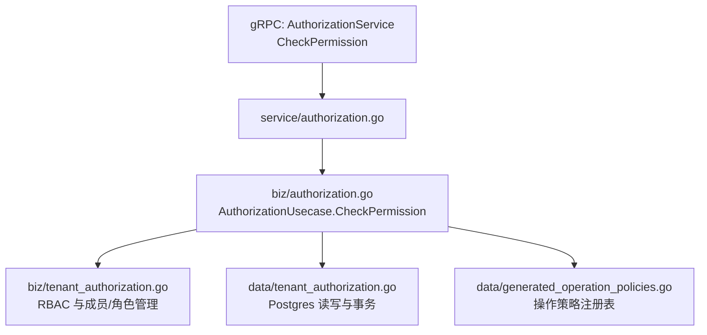
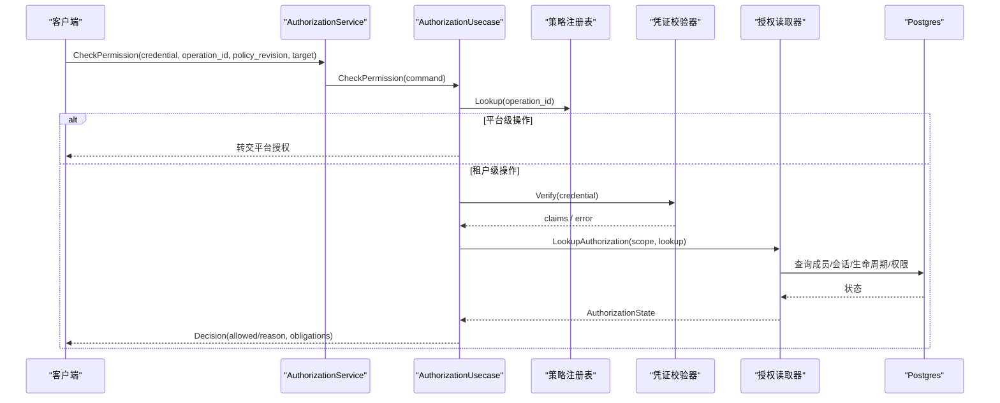
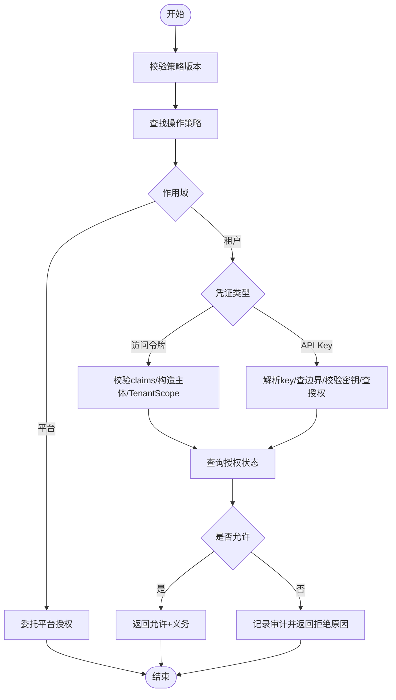
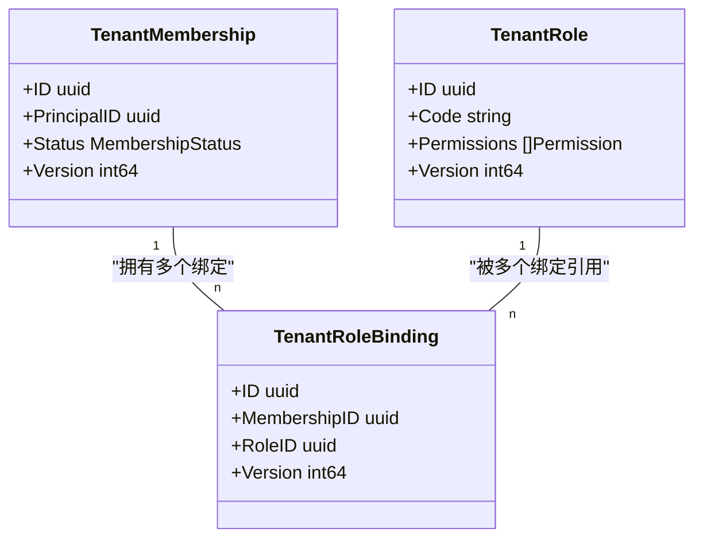
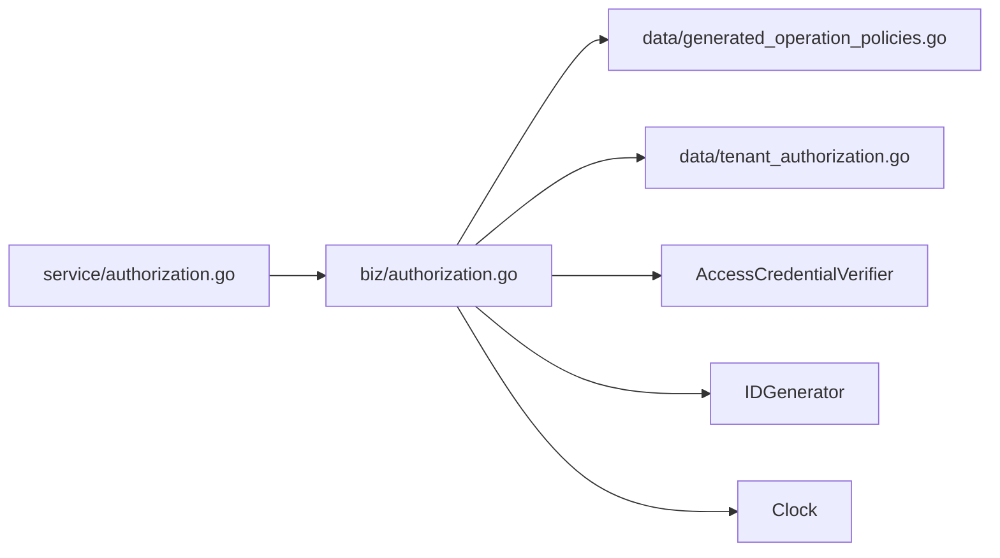

# 授权用例

<cite>
**本文引用的文件**
- [internal/biz/authorization.go](file://internal/biz/authorization.go)
- [internal/biz/tenant_authorization.go](file://internal/biz/tenant_authorization.go)
- [internal/biz/membership.go](file://internal/biz/membership.go)
- [internal/biz/tenant_scope.go](file://internal/biz/tenant_scope.go)
- [internal/service/authorization.go](file://internal/service/authorization.go)
- [api/iam/v1/authorization_service.proto](file://api/iam/v1/authorization_service.proto)
- [internal/data/tenant_authorization.go](file://internal/data/tenant_authorization.go)
- [internal/data/generated_operation_policies.go](file://internal/data/generated_operation_policies.go)
- [tests/integration/tenant_authorization_test.go](file://tests/integration/tenant_authorization_test.go)
- [internal/biz/authorization_test.go](file://internal/biz/authorization_test.go)
</cite>

## 目录
1. [简介](#简介)
2. [项目结构](#项目结构)
3. [核心组件](#核心组件)
4. [架构总览](#架构总览)
5. [详细组件分析](#详细组件分析)
6. [依赖关系分析](#依赖关系分析)
7. [性能与一致性](#性能与一致性)
8. [故障排查指南](#故障排查指南)
9. [结论](#结论)
10. [附录：单元测试策略与边界条件](#附录单元测试策略与边界条件)

## 简介
本文件面向 ANI IAM 项目的“授权用例”，聚焦权限评估的核心业务逻辑，包括 RBAC 模型、资源级权限、上下文感知授权、租户级授权决策、成员关系管理与角色绑定机制。同时说明权限继承、合并与冲突解决规则，并给出性能优化、缓存与一致性保证建议，以及单元测试策略和常见边界条件测试方法。

## 项目结构
授权链路从 API 层进入服务层，再调用领域用例（biz），最终通过数据访问层（data）读取或写入租户授权相关实体（成员、角色、绑定、审计事件等）。

**图表来源**
- [internal/service/authorization.go:27-67](file://internal/service/authorization.go#L27-L67)
- [internal/biz/authorization.go:225-329](file://internal/biz/authorization.go#L225-L329)
- [internal/biz/tenant_authorization.go:383-492](file://internal/biz/tenant_authorization.go#L383-L492)
- [internal/data/tenant_authorization.go:141-172](file://internal/data/tenant_authorization.go#L141-L172)
- [internal/data/generated_operation_policies.go:17-200](file://internal/data/generated_operation_policies.go#L17-L200)

**章节来源**
- [api/iam/v1/authorization_service.proto:10-39](file://api/iam/v1/authorization_service.proto#L10-L39)
- [internal/service/authorization.go:27-67](file://internal/service/authorization.go#L27-L67)
- [internal/biz/authorization.go:225-329](file://internal/biz/authorization.go#L225-L329)

## 核心组件
- 授权用例（AuthorizationUsecase）：统一入口，负责凭证校验、策略匹配、上下文构建、拒绝原因判定与审计记录。
- 租户授权用例（TenantAuthorizationUsecase）：实现 RBAC 的租户侧能力，包括成员状态、角色定义、角色绑定、管理员保护与审计。
- 数据访问（postgresTenantAuthorizationUnitOfWork/Reader）：封装 Postgres 事务、锁、分页查询、版本控制与审计追加。
- 策略注册表（generated_operation_policies.go）：由工具生成，声明每个 operation_id 的资源、动作、作用域、允许的凭证类型与主体类型，以及义务约束。
- 服务适配层（service/authorization.go）：将 gRPC 请求转换为领域命令，并将领域决策映射为协议响应。

**章节来源**
- [internal/biz/authorization.go:199-223](file://internal/biz/authorization.go#L199-L223)
- [internal/biz/tenant_authorization.go:194-215](file://internal/biz/tenant_authorization.go#L194-L215)
- [internal/data/tenant_authorization.go:15-25](file://internal/data/tenant_authorization.go#L15-L25)
- [internal/data/generated_operation_policies.go:8-15](file://internal/data/generated_operation_policies.go#L8-L15)
- [internal/service/authorization.go:17-25](file://internal/service/authorization.go#L17-L25)

## 架构总览
下图展示了 CheckPermission 的端到端流程：服务层解析请求并委派给领域用例；领域用例根据策略注册表确定资源与动作，验证凭证（访问令牌或 API Key），查询租户上下文与权限状态，输出允许/拒绝决定并记录审计。

**图表来源**
- [internal/service/authorization.go:27-67](file://internal/service/authorization.go#L27-L67)
- [internal/biz/authorization.go:225-329](file://internal/biz/authorization.go#L225-L329)
- [internal/data/tenant_authorization.go:141-172](file://internal/data/tenant_authorization.go#L141-L172)

## 详细组件分析

### 权限评估主流程（AuthorizationUsecase）
- 策略校验：要求 policy_revision 与注册表一致，否则返回不匹配错误。
- 操作注册检查：operation_id 必须已注册且包含 resource 与 actions。
- 作用域分流：platform 作用域交由平台授权；非 tenant 作用域直接拒绝。
- 凭证分支：
  - 访问令牌：校验 claims 字段完整性与过期时间，构造可信主体上下文，建立 TenantScope，校验目标租户一致。
  - API Key：解析 keyID，获取密钥边界租户，校验密钥有效性、状态与过期，查询 API Key 授权状态，必要时观测使用量。
- 权限判定：基于 AuthorizationState 综合判断主体状态、成员状态、租户访问、生命周期新鲜度、会话与授权版本、最终 PermissionAllowed。
- 审计记录：所有拒绝路径均记录审计事件，区分未绑定与租户边界内拒绝。

**图表来源**
- [internal/biz/authorization.go:225-329](file://internal/biz/authorization.go#L225-L329)
- [internal/biz/authorization.go:331-420](file://internal/biz/authorization.go#L331-L420)
- [internal/biz/authorization.go:458-514](file://internal/biz/authorization.go#L458-L514)

**章节来源**
- [internal/biz/authorization.go:225-329](file://internal/biz/authorization.go#L225-L329)
- [internal/biz/authorization.go:331-420](file://internal/biz/authorization.go#L331-L420)
- [internal/biz/authorization.go:458-514](file://internal/biz/authorization.go#L458-L514)
- [internal/biz/authorization.go:516-576](file://internal/biz/authorization.go#L516-L576)

### RBAC 模型与角色绑定（TenantAuthorizationUsecase）
- 角色与权限：
  - 角色属于租户，包含一组权限（scope=tenant）。
  - 权限必须在“可接受目录”中，禁止跨边界（如平台权限放入租户角色）。
- 成员与绑定：
  - 成员有状态（active/suspended/removed），绑定记录关联成员与角色。
  - 绑定/解绑需管理员权限，且受“最后一名管理员保护”限制。
- 事务与并发：
  - 使用 WithinTenantAuthorization 包裹事务，内部加管理员守卫锁与成员行锁，确保并发安全。
  - 变更伴随审计事件追加，保持不可变审计轨迹。

**图表来源**
- [internal/biz/tenant_authorization.go:49-99](file://internal/biz/tenant_authorization.go#L49-L99)
- [internal/data/tenant_authorization.go:277-305](file://internal/data/tenant_authorization.go#L277-L305)
- [internal/data/tenant_authorization.go:338-389](file://internal/data/tenant_authorization.go#L338-L389)

**章节来源**
- [internal/biz/tenant_authorization.go:383-492](file://internal/biz/tenant_authorization.go#L383-L492)
- [internal/biz/tenant_authorization.go:501-527](file://internal/biz/tenant_authorization.go#L501-L527)
- [internal/data/tenant_authorization.go:141-172](file://internal/data/tenant_authorization.go#L141-L172)
- [internal/data/tenant_authorization.go:338-389](file://internal/data/tenant_authorization.go#L338-L389)

### 资源级权限与上下文感知
- 资源级权限：通过策略中的 resource 与 action 组合限定操作范围。
- 上下文感知：
  - 目标租户一致性校验（claims.tenant_id 与 target.tenant_id）。
  - 义务（obligations）：例如资源租户匹配，强制后续处理器校验资源归属。
  - API Key 场景下，先校验密钥边界租户，再比较目标租户，防止跨租户越权。

**章节来源**
- [internal/biz/authorization.go:251-300](file://internal/biz/authorization.go#L251-L300)
- [internal/biz/authorization.go:395-404](file://internal/biz/authorization.go#L395-L404)
- [internal/data/generated_operation_policies.go:17-200](file://internal/data/generated_operation_policies.go#L17-L200)

### 租户级授权决策过程
- 决策输入：原始凭证、operation_id、policy_revision、目标租户与资源。
- 决策输出：是否允许、拒绝原因、决策 ID、主体上下文、义务列表、策略版本。
- 拒绝原因枚举：涵盖主体/成员/租户访问/生命周期/会话/授权版本/权限不足/凭证类型拒绝/租户不匹配等。

**章节来源**
- [internal/biz/authorization.go:30-45](file://internal/biz/authorization.go#L30-L45)
- [internal/biz/authorization.go:491-514](file://internal/biz/authorization.go#L491-L514)
- [internal/service/authorization.go:69-96](file://internal/service/authorization.go#L69-L96)

### 成员关系管理与角色绑定机制
- 成员创建/更新/移除：在事务内完成，状态变更需版本控制，移除工作负载成员时自动禁用其工作负载。
- 角色绑定/解绑：需要租户管理员身份，系统内置管理员角色受保护，避免误删导致无管理员可用。
- 审计：每次变更追加审计事件，记录操作者、认证方式、目标对象与版本。

**章节来源**
- [internal/biz/tenant_authorization.go:250-381](file://internal/biz/tenant_authorization.go#L250-L381)
- [internal/biz/tenant_authorization.go:383-492](file://internal/biz/tenant_authorization.go#L383-L492)
- [internal/data/tenant_authorization.go:391-419](file://internal/data/tenant_authorization.go#L391-L419)

## 依赖关系分析
- 服务层依赖领域用例接口，屏蔽协议细节。
- 领域用例依赖策略注册表、凭证校验器、授权读取器、ID 生成器与时钟。
- 数据层提供事务、锁、分页与审计追加能力，并通过 sqlc 生成的查询访问 Postgres。
- 策略注册表由工具生成，确保操作与权限目录的一致性。

**图表来源**
- [internal/service/authorization.go:27-67](file://internal/service/authorization.go#L27-L67)
- [internal/biz/authorization.go:199-223](file://internal/biz/authorization.go#L199-L223)
- [internal/data/generated_operation_policies.go:8-15](file://internal/data/generated_operation_policies.go#L8-L15)
- [internal/data/tenant_authorization.go:141-172](file://internal/data/tenant_authorization.go#L141-L172)

**章节来源**
- [internal/biz/authorization.go:199-223](file://internal/biz/authorization.go#L199-L223)
- [internal/data/tenant_authorization.go:141-172](file://internal/data/tenant_authorization.go#L141-L172)
- [internal/data/generated_operation_policies.go:8-15](file://internal/data/generated_operation_policies.go#L8-L15)

## 性能与一致性
- 性能优化建议
  - 策略注册表为内存映射，Lookup 为 O(1)，减少重复解析。
  - 授权读取器应结合缓存（如按 principal/session/grant 维度）以减少数据库压力，但需考虑失效策略与一致性。
  - API Key 使用观测可异步化，避免阻塞关键路径。
  - 分页查询限制 page size，避免大结果集。
- 一致性保证
  - 使用 ReadCommitted 事务与行级锁（管理员守卫锁、成员锁）保障并发安全。
  - 版本号控制（ExpectedVersion）防止覆盖写。
  - 审计事件与业务变更在同一事务中追加，保证可追溯性。
  - 策略版本校验确保策略与运行时一致。

[本节为通用指导，不直接分析具体文件]

## 故障排查指南
- 常见问题定位
  - 策略版本不匹配：检查传入 policy_revision 与注册表是否一致。
  - 凭证无效：检查访问令牌 claims 完整性与过期时间；API Key 状态与密钥是否正确。
  - 租户不匹配：确认 claims.tenant_id 与 target.tenant_id 一致。
  - 权限不足：检查角色绑定与权限目录，确认资源与动作是否在允许范围内。
  - 管理员保护：尝试移除最后一名管理员会失败，需先新增管理员。
- 审计与日志
  - 拒绝路径均记录审计事件，可通过审计事件定位失败原因与上下文。

**章节来源**
- [internal/biz/authorization.go:225-329](file://internal/biz/authorization.go#L225-L329)
- [internal/biz/authorization.go:516-576](file://internal/biz/authorization.go#L516-L576)
- [internal/biz/tenant_authorization.go:501-527](file://internal/biz/tenant_authorization.go#L501-L527)

## 结论
ANI IAM 的授权体系以“策略驱动 + RBAC + 上下文感知”为核心，通过严格的凭证校验、作用域隔离、版本控制与审计追踪，实现了高安全性的租户级授权决策。角色绑定与成员管理在事务与锁的保护下具备强一致性与并发安全性。建议在高频路径引入合理的缓存与异步观测，进一步提升性能。

[本节为总结，不直接分析具体文件]

## 附录：单元测试策略与边界条件
- 单元测试要点
  - 策略版本与操作注册：验证未注册操作与策略版本不匹配的拒绝路径。
  - 凭证分支：分别覆盖访问令牌与 API Key 的成功与失败场景，包括跨租户拒绝。
  - 权限判定：模拟不同 AuthorizationState，验证拒绝原因枚举的正确性。
  - 管理员保护：验证最后一名管理员无法被移除或解绑。
  - 并发与版本冲突：模拟并发更新成员状态与角色绑定，验证版本冲突与锁行为。
- 集成测试要点
  - 权限目录外键约束：验证租户角色不能包含平台权限。
  - 恢复与重建：验证角色权限在恢复过程中的正确性。
  - 审计一致性：验证绑定/解绑操作的审计目标与版本。

**章节来源**
- [internal/biz/authorization_test.go:15-200](file://internal/biz/authorization_test.go#L15-L200)
- [tests/integration/tenant_authorization_test.go:97-120](file://tests/integration/tenant_authorization_test.go#L97-L120)
- [tests/integration/tenant_authorization_test.go:160-345](file://tests/integration/tenant_authorization_test.go#L160-L345)