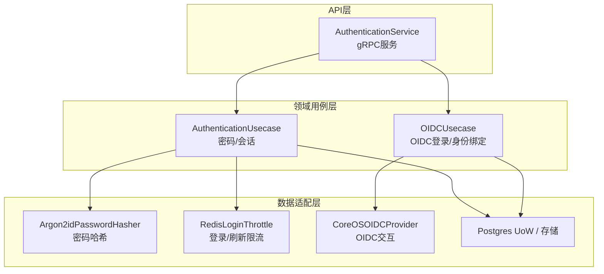
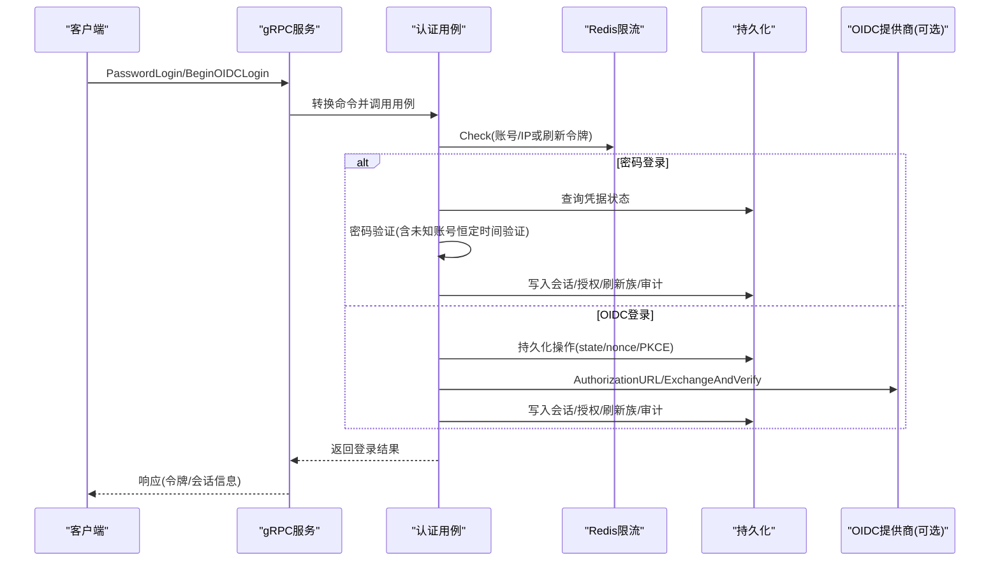
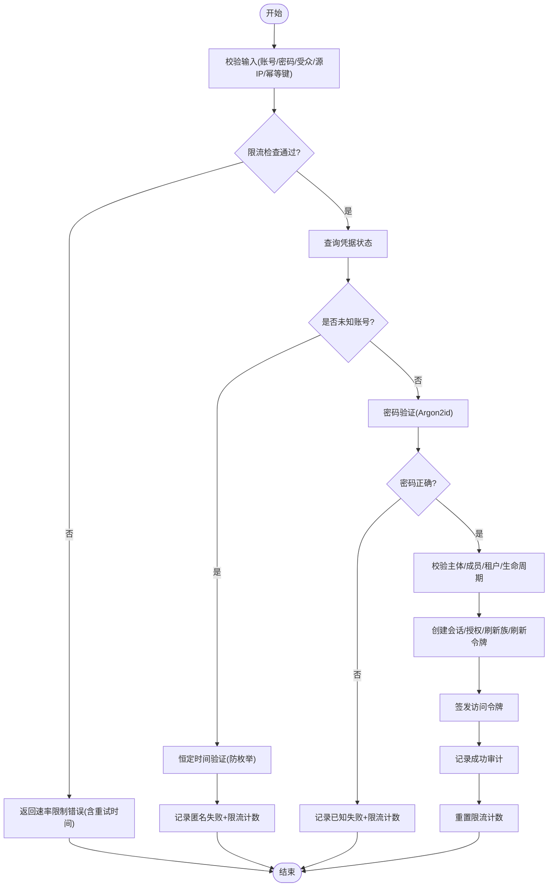
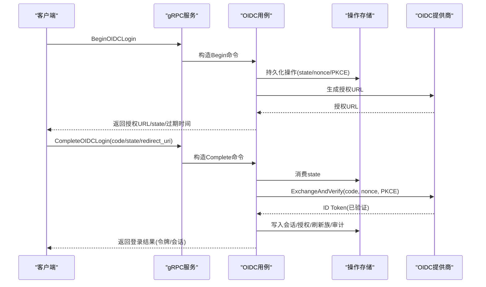
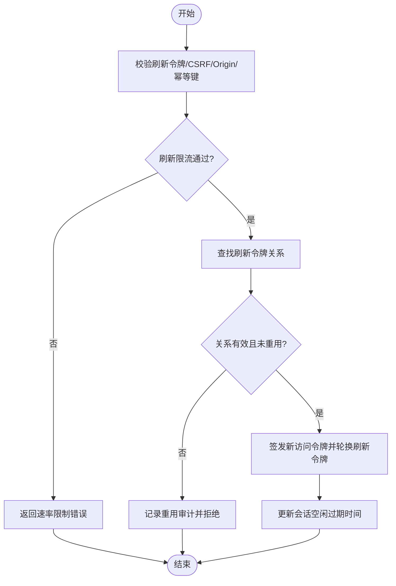
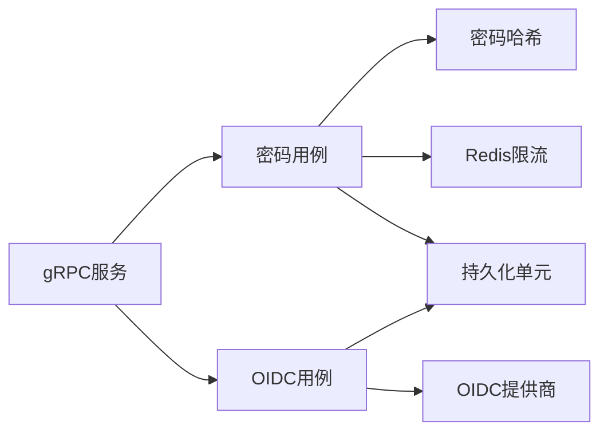

# 认证用例

<cite>
**本文引用的文件**
- [authentication_service.proto](file://api/iam/v1/authentication_service.proto)
- [authentication.go](file://internal/service/authentication.go)
- [authentication.go](file://internal/biz/authentication.go)
- [oidc.go](file://internal/biz/oidc.go)
- [session.go](file://internal/biz/session.go)
- [password_argon2id.go](file://internal/data/password_argon2id.go)
- [login_throttle_redis.go](file://internal/data/login_throttle_redis.go)
- [oidc_provider.go](file://internal/data/oidc_provider.go)
- [idempotency.go](file://internal/biz/idempotency.go)
- [password_login_lock_test.go](file://tests/integration/password_login_lock_test.go)
</cite>

## 目录
1. [简介](#简介)
2. [项目结构](#项目结构)
3. [核心组件](#核心组件)
4. [架构总览](#架构总览)
5. [详细组件分析](#详细组件分析)
6. [依赖关系分析](#依赖关系分析)
7. [性能考虑](#性能考虑)
8. [故障排查指南](#故障排查指南)
9. [结论](#结论)
10. [附录](#附录)

## 简介
本文件面向ANI IAM项目的“认证用例”，系统性说明用户认证的核心业务逻辑，覆盖密码认证、OIDC集成与会话管理。文档聚焦以下要点：
- 密码认证流程：参数校验、限流、哈希验证、失败计数与账户锁定、审计记录、幂等键与重试策略。
- OIDC集成模式：授权码+PKCE、状态/Nonce持久化、令牌交换与身份核验、重认证窗口控制。
- 会话管理：访问令牌签发、刷新令牌轮换、登出、租户切换与会话生命周期策略。
- 错误处理与安全：统一错误映射、依赖不可用降级、防枚举与时间侧信道防护。
- 测试策略：单元测试与集成测试的设计与覆盖点。

## 项目结构
认证能力由三层构成：
- API层（gRPC）：定义认证相关接口与消息契约，负责入参解析、上下文提取与错误映射。
- 领域用例层（biz）：实现密码登录、OIDC登录、会话刷新/登出/切换等核心业务规则。
- 数据适配层（data）：提供密码哈希、Redis限流、OIDC提供商对接、持久化单元等基础设施。

图表来源
- [authentication.go:150-316](file://internal/service/authentication.go#L150-L316)
- [authentication.go:341-530](file://internal/biz/authentication.go#L341-L530)
- [oidc.go:547-742](file://internal/biz/oidc.go#L547-L742)
- [password_argon2id.go:30-55](file://internal/data/password_argon2id.go#L30-L55)
- [login_throttle_redis.go:122-204](file://internal/data/login_throttle_redis.go#L122-L204)
- [oidc_provider.go:101-154](file://internal/data/oidc_provider.go#L101-L154)

章节来源
- [authentication_service.proto:11-33](file://api/iam/v1/authentication_service.proto#L11-L33)
- [authentication.go:150-316](file://internal/service/authentication.go#L150-L316)

## 核心组件
- 密码认证用例：完成账号密码校验、限流检查、安全审计、会话与刷新令牌创建、幂等键保护。
- OIDC认证用例：发起授权请求、持久化操作状态、回调后交换令牌并核验身份、建立会话。
- 会话管理用例：刷新会话（令牌轮换）、登出（撤销当前会话）、租户切换（按边界颁发新授权）。
- 密码哈希：采用Argon2id固定参数配置，支持未知账号的恒定时间验证以防御枚举。
- 限流器：基于Redis脚本实现账号/IP维度的登录限流与刷新令牌并发限制。
- OIDC提供商：封装授权码流程、PKCE校验、ID Token签名与声明校验。
- 幂等性：通过唯一键与意图摘要保证重复请求不产生副作用。

章节来源
- [authentication.go:341-530](file://internal/biz/authentication.go#L341-L530)
- [oidc.go:547-742](file://internal/biz/oidc.go#L547-L742)
- [session.go:154-478](file://internal/biz/session.go#L154-L478)
- [password_argon2id.go:30-55](file://internal/data/password_argon2id.go#L30-L55)
- [login_throttle_redis.go:122-204](file://internal/data/login_throttle_redis.go#L122-L204)
- [oidc_provider.go:101-154](file://internal/data/oidc_provider.go#L101-L154)
- [idempotency.go:62-99](file://internal/biz/idempotency.go#L62-L99)

## 架构总览
认证主流程分为两类：
- 密码登录：客户端提交账号、密码、目标受众、租户边界、源IP与幂等键；系统执行限流、读取凭据状态、验证密码、校验主体/成员/租户状态、签发会话与令牌、记录审计、重置限流计数。
- OIDC登录：先发起授权请求（生成state/nonce/PKCE），回调后换取ID Token并核验，再建立会话与令牌。

图表来源
- [authentication.go:341-530](file://internal/biz/authentication.go#L341-L530)
- [oidc.go:547-742](file://internal/biz/oidc.go#L547-L742)
- [login_throttle_redis.go:122-204](file://internal/data/login_throttle_redis.go#L122-L204)
- [oidc_provider.go:101-154](file://internal/data/oidc_provider.go#L101-L154)

## 详细组件分析

### 密码认证用例
- 输入校验：账号、密码、受众、租户边界、源IP、幂等键均做严格校验。
- 限流：按账号与IP维度进行滑动窗口计数与阻塞期控制，超限返回可重试时间。
- 凭据读取与验证：
  - 未知账号：使用预设哈希进行恒定时间比较，避免枚举攻击。
  - 已知账号：比对存储的Argon2id哈希。
- 状态检查：主体活跃、成员有效、租户访问有效、生命周期投影新鲜且未阻断。
- 会话与令牌：
  - 创建Session、Grant、RefreshTokenFamily与RefreshToken（仅存摘要）。
  - 签发AccessToken（包含边界、受众、会话/授权版本、租户ID等）。
  - 计算访问令牌空闲/绝对过期时间。
- 审计与幂等：
  - 成功/失败均记录审计事件。
  - 幂等键用于防止重复提交导致重复会话。
- 失败路径：
  - 记录失败次数与锁定截止时间（如15分钟）。
  - 限流器在失败时递增计数并可能进入阻塞期。

图表来源
- [authentication.go:341-530](file://internal/biz/authentication.go#L341-L530)
- [password_argon2id.go:30-55](file://internal/data/password_argon2id.go#L30-L55)
- [login_throttle_redis.go:122-204](file://internal/data/login_throttle_redis.go#L122-L204)

章节来源
- [authentication.go:341-530](file://internal/biz/authentication.go#L341-L530)
- [password_argon2id.go:30-55](file://internal/data/password_argon2id.go#L30-L55)
- [login_throttle_redis.go:122-204](file://internal/data/login_throttle_redis.go#L122-L204)

### OIDC集成用例
- 开始登录：
  - 校验受众与租户边界，生成state/nonce/PKCE，持久化操作记录（带过期时间）。
  - 构建授权URL并返回给客户端。
- 完成登录：
  - 消费一次性的state，校验provider、audience、tenant、redirect_uri、nonce、code_verifier与过期时间。
  - 与OIDC提供商交换授权码，获取并验证ID Token（签名、issuer、nonce）。
  - 校验邮箱已验证并规范化。
  - 查询本地OIDC身份映射，校验主体/成员/租户/生命周期状态。
  - 创建会话、授权、刷新族与刷新令牌，签发访问令牌，记录审计。
- 身份绑定（Identity Link）：
  - 需要近期重认证凭证或浏览器证明，确保敏感操作的安全级别。
  - 绑定成功后更新身份关联，记录审计。

图表来源
- [oidc.go:547-742](file://internal/biz/oidc.go#L547-L742)
- [oidc_provider.go:101-154](file://internal/data/oidc_provider.go#L101-L154)

章节来源
- [oidc.go:547-742](file://internal/biz/oidc.go#L547-L742)
- [oidc_provider.go:101-154](file://internal/data/oidc_provider.go#L101-L154)

### 会话管理用例
- 刷新会话：
  - 校验刷新令牌、CSRF、Origin与幂等键。
  - 限流检查（按刷新令牌摘要）。
  - 查找并校验刷新令牌关系（家族/授权/会话状态与过期）。
  - 若发现重用，记录滥用审计并拒绝。
  - 签发新访问令牌并轮换刷新令牌，更新会话空闲过期时间。
- 登出：
  - 校验刷新令牌、CSRF、Origin与幂等键。
  - 查找当前会话并撤销，记录审计。
- 租户切换：
  - 校验当前凭证与目标租户边界。
  - 为新的租户边界创建或升级授权与刷新族，签发新访问令牌，记录审计。

图表来源
- [session.go:154-286](file://internal/biz/session.go#L154-L286)
- [login_throttle_redis.go:182-204](file://internal/data/login_throttle_redis.go#L182-L204)

章节来源
- [session.go:154-286](file://internal/biz/session.go#L154-L286)
- [session.go:288-478](file://internal/biz/session.go#L288-L478)

### 密码哈希算法选择与安全
- 算法：Argon2id，固定内存、迭代次数、并行度、盐长度与密钥长度，确保跨环境一致性与抗暴力破解。
- 未知账号防护：对不存在账号的请求也进行恒定时间比较，避免通过响应时间差异推断账号存在性。
- 参数校验：验证存储哈希的参数是否与目标配置一致，防止回退到弱参数。

章节来源
- [password_argon2id.go:14-55](file://internal/data/password_argon2id.go#L14-L55)

### 登录尝试限制与账户锁定机制
- 登录限流：
  - 按账号与IP两个维度维护计数与阻塞期，使用Redis原子脚本实现。
  - 超过阈值进入阻塞期，返回重试等待时间。
- 失败计数与锁定：
  - 每次失败记录一次并累加失败次数，达到阈值后设置锁定截止时间（如15分钟）。
  - 锁定期间即使密码正确也会拒绝并记录审计。
- 刷新令牌限流：
  - 按刷新令牌摘要计数，防止并发重用攻击。

章节来源
- [login_throttle_redis.go:34-104](file://internal/data/login_throttle_redis.go#L34-L104)
- [login_throttle_redis.go:122-204](file://internal/data/login_throttle_redis.go#L122-L204)
- [authentication.go:539-617](file://internal/biz/authentication.go#L539-L617)

### 幂等性与重试机制
- 幂等键：
  - 所有写操作（登录、刷新、登出、切换）要求幂等键，服务端基于键与意图摘要去重。
  - 重复请求直接返回之前结果，避免重复会话或重复审计。
- 重试策略：
  - 限流错误携带重试时间，客户端应遵循指数退避与上限控制。
  - 依赖不可用时返回明确错误码，便于上层重试或降级。

章节来源
- [idempotency.go:62-99](file://internal/biz/idempotency.go#L62-L99)
- [authentication.go:517-544](file://internal/service/authentication.go#L517-L544)

### 错误处理与安全考虑
- 统一错误映射：
  - 将领域错误映射为gRPC状态码与原因码，附带元数据（操作ID、租户ID、依赖信息等）。
  - 区分凭据无效、权限拒绝、依赖不可用、速率限制等场景。
- 安全要点：
  - 源IP由可信网关注入，IAM内部不信任任意来源。
  - OIDC回调严格校验state/nonce/redirect_uri与PKCE。
  - 刷新令牌仅存摘要，避免泄露原始值。
  - 审计事件记录完整决策链，支持事后追溯。

章节来源
- [authentication.go:476-683](file://internal/service/authentication.go#L476-L683)
- [oidc.go:607-742](file://internal/biz/oidc.go#L607-L742)

## 依赖关系分析
- 服务层依赖用例层：gRPC服务将请求转换为领域命令并调用用例。
- 用例层依赖数据适配层：密码哈希、限流、OIDC提供商、持久化单元。
- 用例间耦合：
  - 密码认证与会话管理共享限流器、令牌签发器与审计模型。
  - OIDC认证与会话管理共享令牌签发器与审计模型。
- 外部依赖：
  - Redis用于限流与刷新令牌并发控制。
  - PostgreSQL用于会话、授权、刷新族、审计与凭据状态持久化。
  - OIDC提供商用于授权码交换与ID Token验证。

图表来源
- [authentication.go:150-316](file://internal/service/authentication.go#L150-L316)
- [authentication.go:341-530](file://internal/biz/authentication.go#L341-L530)
- [oidc.go:547-742](file://internal/biz/oidc.go#L547-L742)

章节来源
- [authentication.go:150-316](file://internal/service/authentication.go#L150-L316)
- [authentication.go:341-530](file://internal/biz/authentication.go#L341-L530)
- [oidc.go:547-742](file://internal/biz/oidc.go#L547-L742)

## 性能考虑
- 限流脚本原子性：Redis Lua脚本保证计数与TTL设置的原子性，降低竞争条件。
- 恒定时间验证：未知账号路径使用恒定时间比较，避免时序攻击但带来一定CPU开销。
- 令牌轮换：刷新令牌轮换减少长会话风险，同时增加一次数据库写操作。
- 审计写入：成功与失败均记录审计，需评估写入吞吐与存储成本。

[本节为通用指导，无需特定文件引用]

## 故障排查指南
- 速率限制错误：
  - 现象：收到资源耗尽错误并附带重试秒数。
  - 排查：检查账号/IP是否触发登录限流或刷新令牌并发限制。
- 依赖不可用：
  - 现象：OIDC或认证依赖不可用。
  - 排查：确认OIDC提供商可达、网络超时与JWKS获取正常。
- 凭据无效：
  - 现象：凭据无效或OIDC状态无效。
  - 排查：核对state/nonce/redirect_uri/PKCE与提供商配置一致性。
- 会话问题：
  - 现象：刷新失败或登出无效果。
  - 排查：检查刷新令牌是否被重用、会话是否已过期或被撤销。

章节来源
- [authentication.go:517-683](file://internal/service/authentication.go#L517-L683)
- [oidc.go:607-742](file://internal/biz/oidc.go#L607-L742)
- [session.go:154-478](file://internal/biz/session.go#L154-L478)

## 结论
ANI IAM的认证用例通过严格的输入校验、多维限流、恒定时间验证、完整的审计与幂等保护，实现了高安全性的密码与OIDC认证流程。会话管理提供安全的令牌轮换、登出与租户切换能力。整体设计兼顾安全性、可观测性与可扩展性，适合在生产环境中部署与运维。

[本节为总结性内容，无需特定文件引用]

## 附录

### 代码示例路径（不展示具体代码）
- 密码登录用例入口与主流程：[authentication.go:341-530](file://internal/biz/authentication.go#L341-L530)
- OIDC登录开始与完成：[oidc.go:547-742](file://internal/biz/oidc.go#L547-L742)
- 会话刷新与登出：[session.go:154-478](file://internal/biz/session.go#L154-L478)
- Argon2id密码哈希实现：[password_argon2id.go:30-55](file://internal/data/password_argon2id.go#L30-L55)
- Redis登录限流脚本与调用：[login_throttle_redis.go:34-204](file://internal/data/login_throttle_redis.go#L34-L204)
- OIDC提供商授权与交换：[oidc_provider.go:101-154](file://internal/data/oidc_provider.go#L101-L154)
- 幂等性执行框架：[idempotency.go:62-99](file://internal/biz/idempotency.go#L62-L99)

### 单元测试策略
- 行为断言：验证成功登录创建活跃会话与授权、审计动作与字段、令牌过期时间。
- 错误路径：未知账号、已知账号错误密码、缺失源IP、限流触发等。
- 模拟依赖：使用静态读者、接受/拒绝验证器、允许/记录限流器、固定ID生成器与时钟。

章节来源
- [authentication_test.go:19-200](file://internal/biz/authentication_test.go#L19-L200)

### 集成测试方法
- 并发失败与锁定：多并发失败请求应产生单一持久锁定与对应审计数量。
- 审计冲突回滚：当审计事件ID冲突时，事务回滚，不留下脏状态。
- 未知账号路径：使用预设哈希进行恒定时间验证，并记录脱敏审计。

章节来源
- [password_login_lock_test.go:21-166](file://tests/integration/password_login_lock_test.go#L21-L166)
- [password_login_lock_test.go:168-200](file://tests/integration/password_login_lock_test.go#L168-L200)