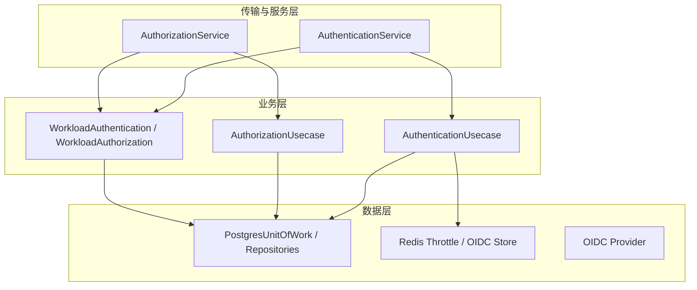
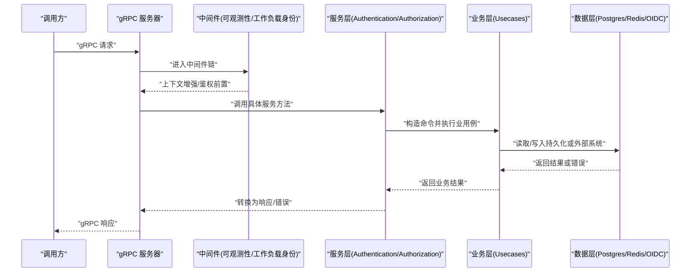
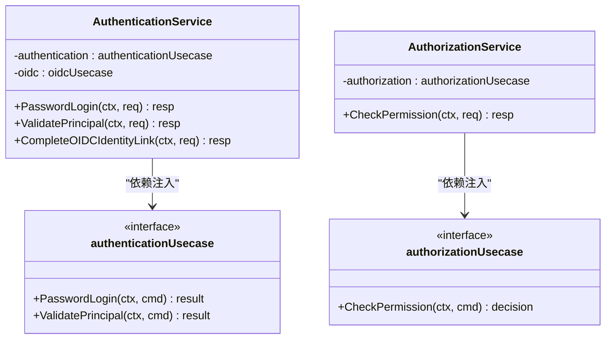
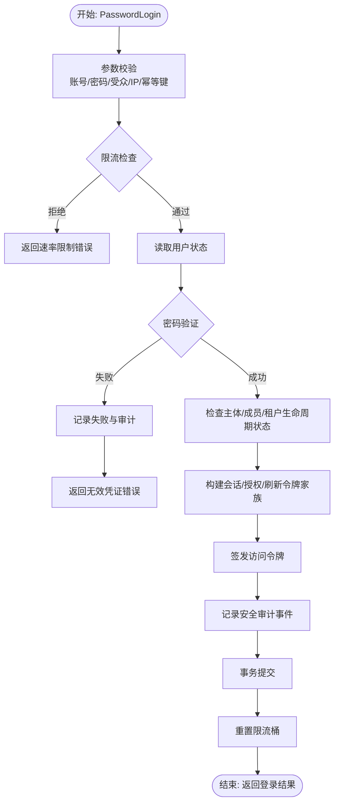
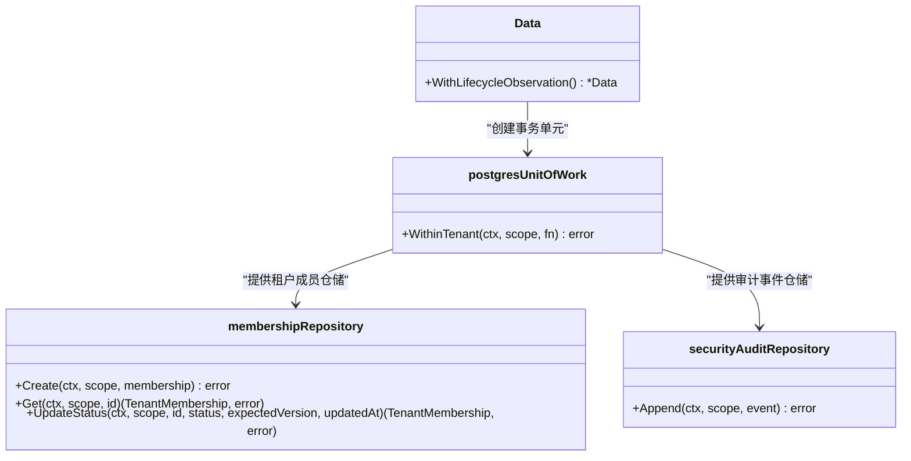
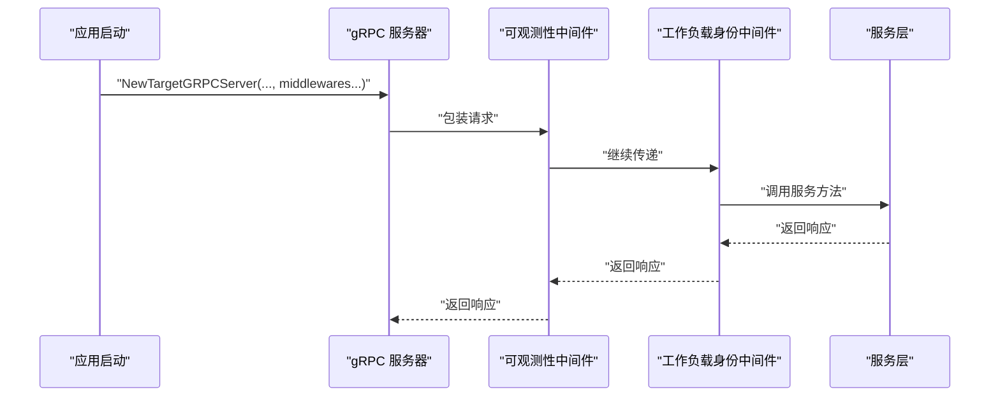
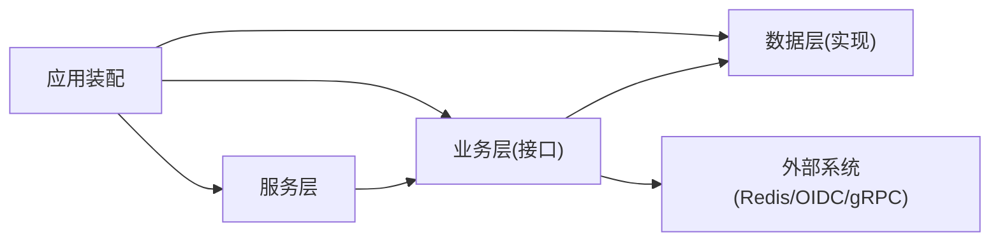

# 分层架构设计

<cite>
**本文引用的文件**
- [cmd/server/main.go](file://cmd/server/main.go)
- [cmd/server/app.go](file://cmd/server/app.go)
- [internal/server/grpc.go](file://internal/server/grpc.go)
- [internal/service/authentication.go](file://internal/service/authentication.go)
- [internal/service/authorization.go](file://internal/service/authorization.go)
- [internal/biz/authentication.go](file://internal/biz/authentication.go)
- [internal/biz/workload.go](file://internal/biz/workload.go)
- [internal/data/data.go](file://internal/data/data.go)
- [internal/data/postgres.go](file://internal/data/postgres.go)
</cite>

## 目录
1. [简介](#简介)
2. [项目结构](#项目结构)
3. [核心组件](#核心组件)
4. [架构总览](#架构总览)
5. [详细组件分析](#详细组件分析)
6. [依赖关系分析](#依赖关系分析)
7. [性能考量](#性能考量)
8. [故障排查指南](#故障排查指南)
9. [结论](#结论)

## 简介
本文件面向 ANI IAM 项目的分层架构，聚焦服务层（Service）、业务层（Biz）与数据层（Data）的职责划分、接口抽象与依赖注入模式，并完整描述从 gRPC 网关到数据访问的请求处理链路。文档同时给出中间件如何横切各层的机制说明，以及架构图和数据流图帮助理解系统全貌。

## 项目结构
ANI IAM 采用清晰的三层架构：
- 传输与服务层（Service）：实现 gRPC 接口，负责请求校验、协议转换、错误映射与调用业务用例。
- 业务层（Biz）：封装领域用例与规则，定义端口（接口），通过依赖注入组合基础设施适配器。
- 数据层（Data）：提供持久化与外部系统适配（PostgreSQL、Redis、OIDC、gRPC 客户端等），暴露给 Biz 的接口实现。

图表来源
- [internal/service/authentication.go:91-106](file://internal/service/authentication.go#L91-L106)
- [internal/service/authorization.go:17-25](file://internal/service/authorization.go#L17-L25)
- [internal/biz/authentication.go:286-339](file://internal/biz/authentication.go#L286-L339)
- [internal/biz/workload.go:56-106](file://internal/biz/workload.go#L56-L106)
- [internal/data/postgres.go:18-59](file://internal/data/postgres.go#L18-L59)

章节来源
- [cmd/server/main.go:34-101](file://cmd/server/main.go#L34-L101)
- [cmd/server/app.go:369-744](file://cmd/server/app.go#L369-L744)

## 核心组件
- gRPC 服务器与中间件：构建受 mTLS 保护的 gRPC 服务器，注册认证、授权与管理服务，并挂载可观测性与工作负载身份中间件。
- 服务层用例映射：将 gRPC 请求转换为 Biz 命令对象，进行参数校验、上下文提取、错误映射与响应组装。
- 业务用例：实现登录、刷新会话、权限检查、工作负载身份与授权等核心流程，并通过接口（端口）解耦数据与外部依赖。
- 数据适配器：基于 sqlc 生成的查询与事务单元，封装 PostgreSQL 操作；通过 Redis 实现限流、OIDC 状态存储等；提供 OIDC 提供者与通知客户端。

章节来源
- [internal/server/grpc.go:14-50](file://internal/server/grpc.go#L14-L50)
- [internal/service/authentication.go:108-366](file://internal/service/authentication.go#L108-L366)
- [internal/service/authorization.go:27-67](file://internal/service/authorization.go#L27-L67)
- [internal/biz/authentication.go:341-530](file://internal/biz/authentication.go#L341-L530)
- [internal/data/postgres.go:27-59](file://internal/data/postgres.go#L27-L59)

## 架构总览
下图展示从 gRPC 入口到数据访问的端到端调用链，包括中间件横切点与关键依赖。

图表来源
- [internal/server/grpc.go:14-50](file://internal/server/grpc.go#L14-L50)
- [internal/service/authentication.go:108-366](file://internal/service/authentication.go#L108-L366)
- [internal/biz/authentication.go:341-530](file://internal/biz/authentication.go#L341-L530)
- [internal/data/postgres.go:27-59](file://internal/data/postgres.go#L27-L59)

## 详细组件分析

### 服务层（Service）职责与实现模式
- 职责
  - 解析与校验 gRPC 请求参数，提取上下文（如请求 ID、关联 ID）。
  - 将请求转换为 Biz 命令对象，调用业务用例。
  - 统一错误映射为带元数据的 gRPC 状态码与详情。
  - 将业务结果转换为 Protobuf 响应。
- 依赖注入
  - 通过构造函数注入 Biz 用例接口（如 authenticationUsecase、oidcUsecase），便于测试与替换实现。
- 典型流程
  - 密码登录：参数校验 -> 调用 AuthenticationUsecase.PasswordLogin -> 错误映射 -> 响应组装。
  - 权限检查：参数校验 -> 调用 AuthorizationUsecase.CheckPermission -> 决策转换 -> 响应组装。

图表来源
- [internal/service/authentication.go:91-106](file://internal/service/authentication.go#L91-L106)
- [internal/service/authorization.go:17-25](file://internal/service/authorization.go#L17-L25)

章节来源
- [internal/service/authentication.go:108-366](file://internal/service/authentication.go#L108-L366)
- [internal/service/authorization.go:27-67](file://internal/service/authorization.go#L27-L67)

### 业务层（Biz）职责与接口抽象
- 职责
  - 实现领域用例（登录、会话管理、权限判定、工作负载身份与授权）。
  - 定义“端口”接口（如 PasswordVerifier、LoginThrottle、AccessTokenIssuer、WorkloadIdentityReader 等），以解耦数据与外部依赖。
  - 编排跨组件流程（限流、令牌签发、审计事件记录、事务提交）。
- 依赖注入
  - 通过构造函数注入所有端口实现，支持运行时配置与测试替换。
- 典型流程（密码登录）
  - 参数校验 -> 限流检查 -> 读取用户状态 -> 密码验证 -> 生成会话/授权/刷新令牌 -> 审计记录 -> 事务提交 -> 返回结果。

图表来源
- [internal/biz/authentication.go:341-530](file://internal/biz/authentication.go#L341-L530)

章节来源
- [internal/biz/authentication.go:341-530](file://internal/biz/authentication.go#L341-L530)
- [internal/biz/workload.go:56-106](file://internal/biz/workload.go#L56-L106)

### 数据层（Data）职责与实现模式
- 职责
  - 提供数据库连接池与事务单元（WithinTenant），封装 SQL 查询与错误映射。
  - 实现 Biz 定义的端口（如 TenantUnitOfWork、SecurityAuditRepository、MembershipRepository）。
  - 集成 Redis（限流、OIDC 状态）、OIDC 提供者、gRPC 通知客户端等外部系统。
- 事务与隔离
  - 使用 ReadCommitted 隔离级别，确保租户级事务边界，并在失败时回滚。
- 错误映射
  - 将底层 PostgreSQL 错误码映射为 Biz 语义错误（版本冲突、权限不足、唯一约束冲突等）。

图表来源
- [internal/data/data.go:8-29](file://internal/data/data.go#L8-L29)
- [internal/data/postgres.go:18-59](file://internal/data/postgres.go#L18-L59)

章节来源
- [internal/data/data.go:8-29](file://internal/data/data.go#L8-L29)
- [internal/data/postgres.go:27-59](file://internal/data/postgres.go#L27-L59)
- [internal/data/postgres.go:195-232](file://internal/data/postgres.go#L195-L232)

### 中间件机制与横切关注点
- 可观测性中间件：注入日志、追踪属性，过滤敏感字段，统一输出结构化日志。
- 工作负载身份中间件：在请求进入服务前解析工作负载证书与身份，注入上下文供后续服务与业务使用。
- 中间件装配：在应用启动时组装中间件链，并传递给 gRPC 服务器，确保每个请求都经过横切逻辑。

图表来源
- [cmd/server/app.go:691-723](file://cmd/server/app.go#L691-L723)
- [internal/server/grpc.go:14-50](file://internal/server/grpc.go#L14-L50)

章节来源
- [cmd/server/app.go:691-723](file://cmd/server/app.go#L691-L723)
- [internal/server/grpc.go:14-50](file://internal/server/grpc.go#L14-L50)

## 依赖关系分析
- 服务层依赖业务层接口，不直接感知数据实现细节。
- 业务层通过接口（端口）依赖数据层与外部系统，保持领域逻辑稳定。
- 数据层实现 Biz 接口，屏蔽底层存储与网络细节。
- 应用启动时集中装配依赖，形成完整的依赖图。

图表来源
- [cmd/server/app.go:529-573](file://cmd/server/app.go#L529-L573)
- [internal/biz/authentication.go:286-339](file://internal/biz/authentication.go#L286-L339)
- [internal/data/postgres.go:18-59](file://internal/data/postgres.go#L18-L59)

章节来源
- [cmd/server/app.go:529-573](file://cmd/server/app.go#L529-L573)

## 性能考量
- 连接池与超时：PostgreSQL 连接池与 Redis 客户端均设置合理的超时与重试策略，避免资源耗尽。
- 限流与退避：登录限流基于 Redis，防止暴力破解与雪崩；错误路径快速失败，减少无效计算。
- 批量与异步：API Key 使用量聚合与快照发布采用批处理与后台任务，降低主路径开销。
- 事务边界：WithinTenant 保证租户级一致性，减少锁竞争与长事务风险。

[本节为通用指导，不直接分析具体文件]

## 故障排查指南
- 常见错误映射
  - 凭证无效、速率限制、幂等键冲突、版本冲突、权限不足、依赖不可用等均有明确的 gRPC 状态码与元数据。
- 定位步骤
  - 查看 gRPC 响应的 ErrorInfo 中的 reason 与 metadata（operation_id、tenant_id、dependency 等）。
  - 结合可观测性日志中的 trace 与 correlation ID 追踪请求链路。
  - 检查数据层错误映射是否将底层异常正确转为 Biz 语义错误。
- 常见问题
  - 依赖不可用：确认 PostgreSQL/Redis/OIDC 连通性与配置。
  - 权限被拒：核对目标操作是否在注册表中启用，且工作负载授予有效。
  - 幂等冲突：检查幂等键是否重复使用或窗口过期。

章节来源
- [internal/service/authentication.go:476-683](file://internal/service/authentication.go#L476-L683)
- [internal/data/postgres.go:195-232](file://internal/data/postgres.go#L195-L232)

## 结论
ANI IAM 的分层架构通过清晰的服务层、业务层与数据层划分，结合接口抽象与依赖注入，实现了高内聚、低耦合的可维护系统。gRPC 网关到数据访问的完整链路在中间件的横切下具备可观测性与安全性。该设计便于扩展新能力、替换实现与进行测试，同时保证了性能与可靠性。