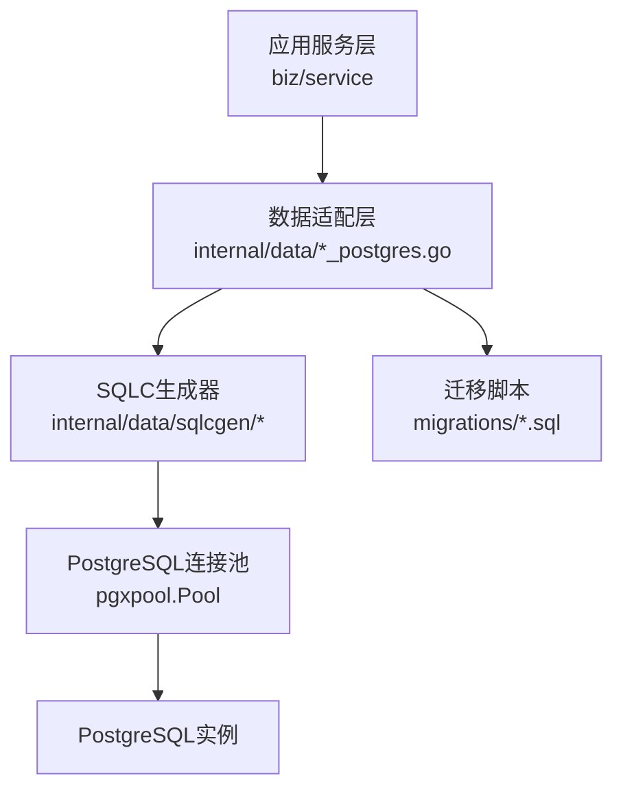
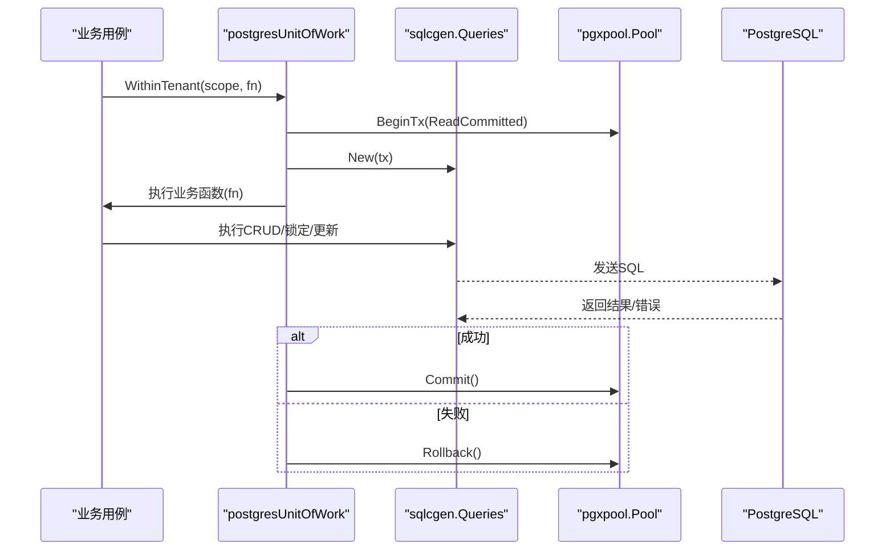
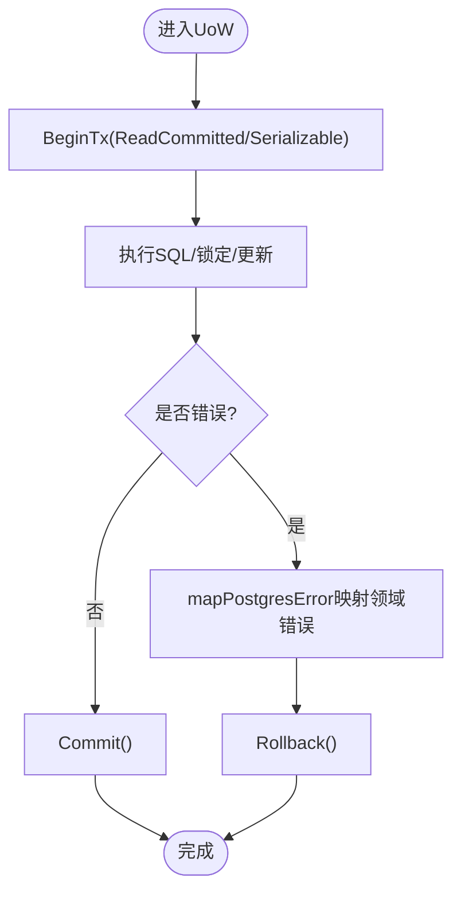
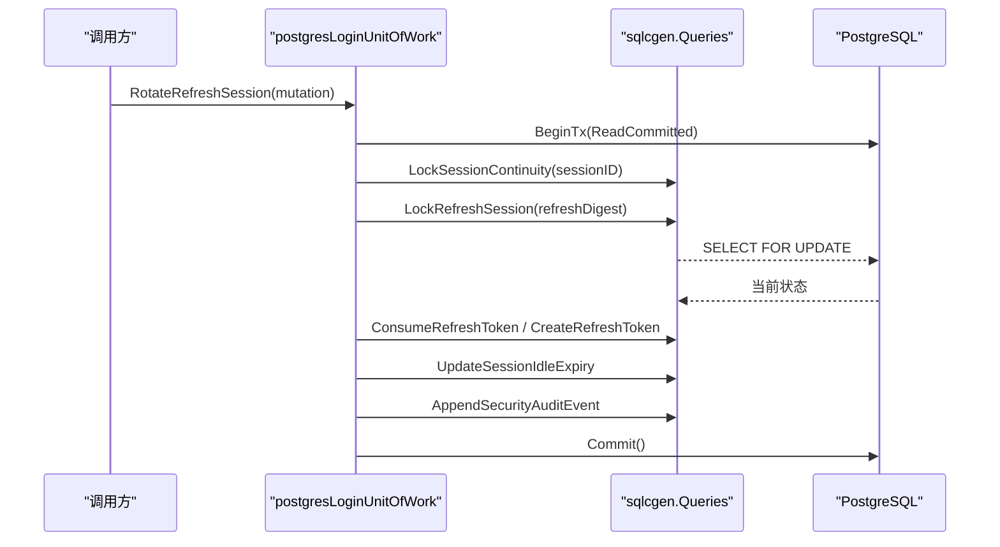
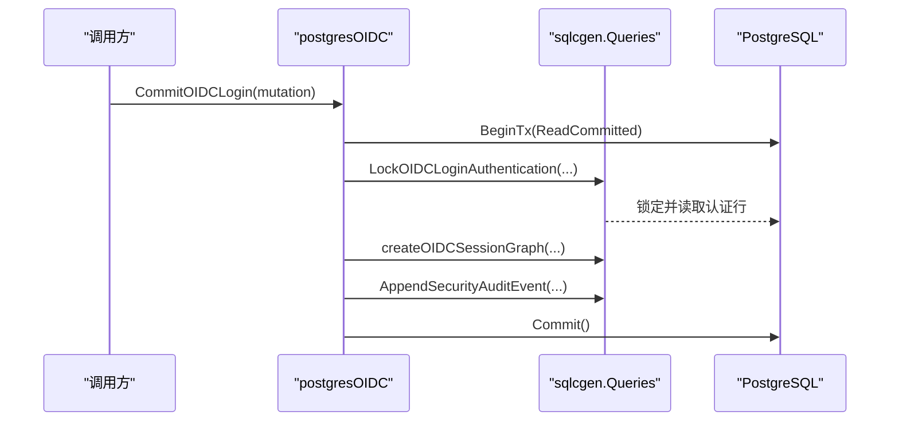
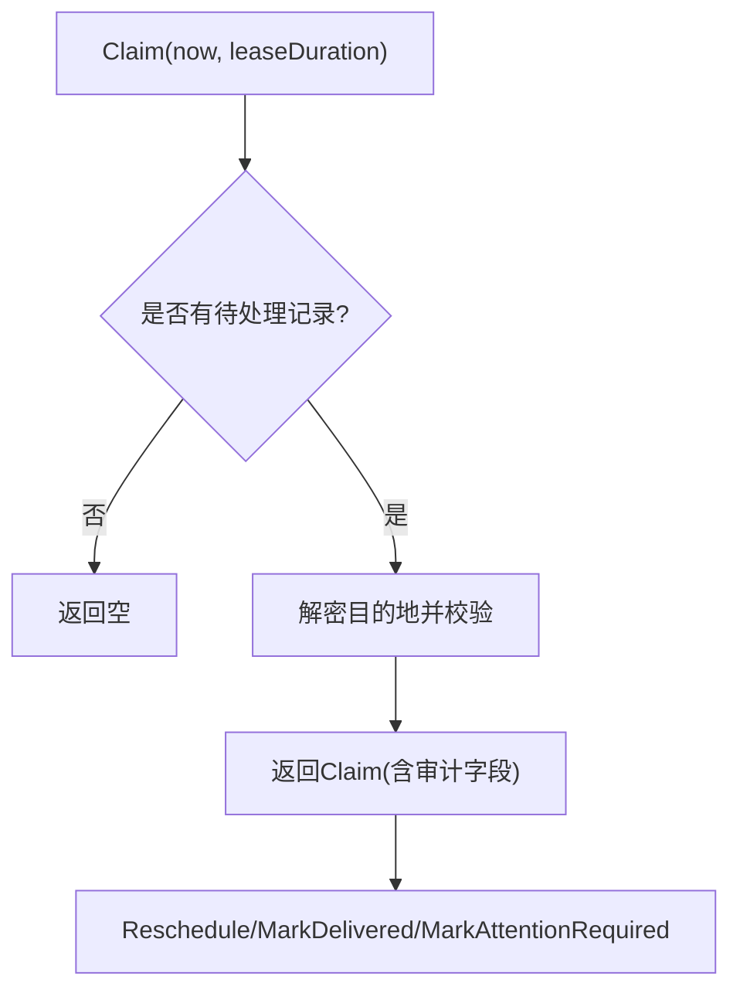
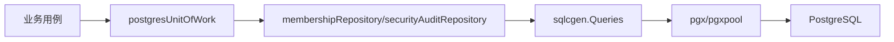

# PostgreSQL集成

<cite>
**本文引用的文件**
- [internal/data/postgres.go](file://internal/data/postgres.go)
- [internal/data/session_postgres.go](file://internal/data/session_postgres.go)
- [internal/data/oidc_postgres.go](file://internal/data/oidc_postgres.go)
- [internal/data/password_action_notification_outbox.go](file://internal/data/password_action_notification_outbox.go)
- [internal/data/data.go](file://internal/data/data.go)
- [configs/config.yaml](file://configs/config.yaml)
- [migrations/202609040001_persistence_foundation.sql](file://migrations/202609040001_persistence_foundation.sql)
- [migrations/202609070001_oidc_identity.sql](file://migrations/202609070001_oidc_identity.sql)
- [migrations/202609070002_session_continuity.sql](file://migrations/202609070002_session_continuity.sql)
- [internal/data/sqlcgen/db.go](file://internal/data/sqlcgen/db.go)
</cite>

## 目录
1. [简介](#简介)
2. [项目结构](#项目结构)
3. [核心组件](#核心组件)
4. [架构总览](#架构总览)
5. [详细组件分析](#详细组件分析)
6. [依赖关系分析](#依赖关系分析)
7. [性能与连接池调优](#性能与连接池调优)
8. [故障恢复与错误处理](#故障恢复与错误处理)
9. [结论](#结论)
10. [附录：迁移与版本兼容](#附录：迁移与版本兼容)

## 简介
本文件面向ANI IAM项目的PostgreSQL集成，聚焦以下目标：
- 数据库连接池配置、连接管理与生命周期管理
- 使用pgx/v5进行高性能数据库操作（事务、查询优化、错误处理）
- 会话存储、OIDC状态持久化、密码操作通知等核心功能的PostgreSQL实现
- CRUD操作模式示例路径与最佳实践
- 数据库迁移与版本兼容性策略
- 连接池参数调优、查询性能监控与故障恢复策略

## 项目结构
本项目将数据访问层集中在internal/data包中，通过sqlc生成类型安全的SQL查询封装，配合pgx/v5的pgxpool进行连接池管理。业务用例通过Unit of Work模式组织跨表事务，确保一致性。

图表来源
- [internal/data/postgres.go:18-59](file://internal/data/postgres.go#L18-L59)
- [internal/data/sqlcgen/db.go:14-32](file://internal/data/sqlcgen/db.go#L14-L32)

章节来源
- [internal/data/data.go:1-29](file://internal/data/data.go#L1-L29)
- [configs/config.yaml:22-24](file://configs/config.yaml#L22-L24)

## 核心组件
- 连接池与上下文对象
  - Data持有pgxpool.Pool，作为长生命周期基础设施客户端，无事务状态。
  - 通过NewData构造，可注入OutboxProtector用于加密外发通知。
- Unit of Work与Repository
  - postgresUnitOfWork提供WithinTenant作用域的事务边界，隔离租户并保证一致性。
  - membershipRepository与securityAuditRepository封装成员关系与安全审计事件写入。
- 会话与OIDC持久化
  - session_postgres.go实现刷新令牌轮换、登出、租户切换等复杂事务流程。
  - oidc_postgres.go实现OIDC登录、重认证、身份绑定与失败记录。
- 密码操作通知Outbox
  - password_action_notification_outbox.go实现声明式领取、重调度、投递标记与关注标记。

章节来源
- [internal/data/data.go:6-20](file://internal/data/data.go#L6-L20)
- [internal/data/postgres.go:18-72](file://internal/data/postgres.go#L18-L72)
- [internal/data/session_postgres.go:17-165](file://internal/data/session_postgres.go#L17-L165)
- [internal/data/oidc_postgres.go:15-145](file://internal/data/oidc_postgres.go#L15-L145)
- [internal/data/password_action_notification_outbox.go:17-82](file://internal/data/password_action_notification_outbox.go#L17-L82)

## 架构总览
下图展示从业务用例到数据库的关键调用链与事务边界。

图表来源
- [internal/data/postgres.go:27-59](file://internal/data/postgres.go#L27-L59)
- [internal/data/sqlcgen/db.go:20-32](file://internal/data/sqlcgen/db.go#L20-L32)

## 详细组件分析

### 连接池与生命周期管理
- 连接池来源
  - 配置项runtime.postgresql.dsn在配置文件中定义，运行时由上层装配为pgxpool.Pool并传入data.NewData。
- 生命周期
  - Data仅持有池引用，不持有事务状态；所有事务通过BeginTx显式创建并在UoW内提交或回滚。
  - 建议在生产环境设置合理的连接数、空闲超时、最大空闲时间等池参数（见“性能与连接池调优”）。

章节来源
- [configs/config.yaml:22-24](file://configs/config.yaml#L22-L24)
- [internal/data/data.go:6-20](file://internal/data/data.go#L6-L20)

### 事务模型与错误映射
- 事务隔离级别
  - 大多数写操作使用ReadCommitted，关键链路如OIDC身份绑定使用Serializable以避免竞态。
- 错误映射
  - mapPostgresError将底层pgconn.PgError转换为领域错误（如唯一冲突、版本冲突、权限拒绝、不可用等），便于上层统一处理。

图表来源
- [internal/data/postgres.go:27-59](file://internal/data/postgres.go#L27-L59)
- [internal/data/postgres.go:195-232](file://internal/data/postgres.go#L195-L232)

章节来源
- [internal/data/postgres.go:27-59](file://internal/data/postgres.go#L27-L59)
- [internal/data/postgres.go:195-232](file://internal/data/postgres.go#L195-L232)

### 会话存储与刷新令牌轮换
- 关键流程
  - 查找刷新会话、锁定会话连续性、锁定刷新令牌、校验状态、消费旧令牌、创建新令牌、滑动会话空闲过期时间、追加审计事件、提交事务。
- 并发控制
  - 通过LockSessionContinuity与LockRefreshSession串行化同一会话的并发刷新，避免重复轮换。
- 复用与撤销
  - 支持已消费令牌的复用场景，必要时撤销整个家族并提升授权版本。

图表来源
- [internal/data/session_postgres.go:75-165](file://internal/data/session_postgres.go#L75-L165)
- [internal/data/session_postgres.go:217-266](file://internal/data/session_postgres.go#L217-L266)

章节来源
- [internal/data/session_postgres.go:17-165](file://internal/data/session_postgres.go#L17-L165)
- [internal/data/session_postgres.go:217-266](file://internal/data/session_postgres.go#L217-L266)

### OIDC状态持久化
- 登录流程
  - 查找OIDC身份、锁定认证信息、校验主体/成员/租户状态与生命周期新鲜度，创建会话图（会话、授权、刷新家族、刷新令牌），追加审计事件并提交。
- 重认证与身份绑定
  - 重认证检查最近重认证时间；身份绑定使用Serializable事务，防止邮箱冲突与身份冲突。

图表来源
- [internal/data/oidc_postgres.go:82-145](file://internal/data/oidc_postgres.go#L82-L145)
- [internal/data/oidc_postgres.go:246-276](file://internal/data/oidc_postgres.go#L246-L276)

章节来源
- [internal/data/oidc_postgres.go:15-145](file://internal/data/oidc_postgres.go#L15-L145)
- [internal/data/oidc_postgres.go:246-276](file://internal/data/oidc_postgres.go#L246-L276)

### 密码操作通知Outbox
- 能力
  - ClaimPasswordActionNotification：按可用时间与租约领取待处理通知，解密目的地并校验有效期与版本。
  - Reschedule/MarkDelivered/MarkAttentionRequired：原子更新状态，基于ExpectedVersion实现乐观锁。
- 可靠性
  - 通过版本号与时间戳约束保证幂等与顺序性，结合重试与退避策略实现最终一致。

图表来源
- [internal/data/password_action_notification_outbox.go:25-82](file://internal/data/password_action_notification_outbox.go#L25-L82)
- [internal/data/password_action_notification_outbox.go:84-155](file://internal/data/password_action_notification_outbox.go#L84-L155)

章节来源
- [internal/data/password_action_notification_outbox.go:17-155](file://internal/data/password_action_notification_outbox.go#L17-L155)

### CRUD操作模式示例路径
- 创建成员关系
  - 参考路径：[internal/data/postgres.go:79-97](file://internal/data/postgres.go#L79-L97)
- 查询成员关系
  - 参考路径：[internal/data/postgres.go:99-115](file://internal/data/postgres.go#L99-L115)
- 更新成员状态（乐观锁）
  - 参考路径：[internal/data/postgres.go:117-143](file://internal/data/postgres.go#L117-L143)
- 追加安全审计事件
  - 参考路径：[internal/data/postgres.go:150-182](file://internal/data/postgres.go#L150-L182)
- 刷新令牌轮换
  - 参考路径：[internal/data/session_postgres.go:75-165](file://internal/data/session_postgres.go#L75-L165)
- OIDC登录
  - 参考路径：[internal/data/oidc_postgres.go:82-145](file://internal/data/oidc_postgres.go#L82-L145)
- 通知Outbox领取与投递
  - 参考路径：[internal/data/password_action_notification_outbox.go:25-155](file://internal/data/password_action_notification_outbox.go#L25-L155)

章节来源
- [internal/data/postgres.go:79-182](file://internal/data/postgres.go#L79-L182)
- [internal/data/session_postgres.go:75-165](file://internal/data/session_postgres.go#L75-L165)
- [internal/data/oidc_postgres.go:82-145](file://internal/data/oidc_postgres.go#L82-L145)
- [internal/data/password_action_notification_outbox.go:25-155](file://internal/data/password_action_notification_outbox.go#L25-L155)

## 依赖关系分析
- 组件耦合
  - data包通过sqlcgen.Queries与PostgreSQL交互，业务用例通过Unit of Work抽象事务边界，降低对具体实现的耦合。
- 外部依赖
  - pgx/v5与pgxpool提供连接与事务能力；pgtype用于时间戳等类型的序列化。
- 潜在循环依赖
  - 未发现直接循环依赖；sqlcgen仅依赖pgx接口，被data层单向使用。

图表来源
- [internal/data/postgres.go:18-72](file://internal/data/postgres.go#L18-L72)
- [internal/data/sqlcgen/db.go:14-32](file://internal/data/sqlcgen/db.go#L14-L32)

章节来源
- [internal/data/postgres.go:18-72](file://internal/data/postgres.go#L18-L72)
- [internal/data/sqlcgen/db.go:14-32](file://internal/data/sqlcgen/db.go#L14-L32)

## 性能与连接池调优
- 连接池参数建议
  - 根据并发请求量与数据库承载能力设置MaxConns、MinConns、ConnMaxLifetime、ConnMaxIdleTime、HealthCheckPeriod等。
  - 在高并发场景下，适当提高MaxConns并缩短健康检查周期，以降低连接抖动带来的延迟。
- 查询优化
  - 使用索引：如tenant_memberships_one_live_principal_idx、iam_audit_events_recorded_id_idx等，减少全表扫描。
  - 批量操作：尽量合并写入，减少往返次数。
  - 只读路径优先使用ReadCommitted，写路径仅在必要时使用Serializable。
- 监控指标
  - 连接池：活跃连接数、等待获取连接数、连接回收率。
  - 查询：慢查询日志、执行计划、锁等待时长。
  - 事务：平均事务时长、回滚率、死锁检测。

[本节为通用指导，无需特定文件来源]

## 故障恢复与错误处理
- 错误分类与映射
  - 唯一冲突（23505）、外键冲突（23503）、NOT NULL/CHECK约束（23514）、并发冲突（40001/40P01）、权限拒绝（42501）均映射为领域错误，便于上层重试或降级。
- 事务回滚保护
  - 所有UoW使用defer确保未提交时回滚，避免资源泄漏。
- 幂等与重试
  - 通过ExpectedVersion与唯一约束保证幂等；对网络抖动导致的短暂失败采用指数退避重试。
- Outbox与消息可靠性
  - 通知Outbox通过版本与时间戳保证最终一致；投递失败可重调度并标记需人工关注。

章节来源
- [internal/data/postgres.go:195-232](file://internal/data/postgres.go#L195-L232)
- [internal/data/password_action_notification_outbox.go:84-155](file://internal/data/password_action_notification_outbox.go#L84-L155)

## 结论
本项目以Unit of Work为核心组织事务，结合sqlc生成的类型安全查询与pgx/v5的高性能驱动，实现了会话、OIDC与通知Outbox等关键能力的可靠持久化。通过严格的错误映射、乐观锁与索引设计，系统在并发与一致性方面具备良好表现。生产部署时应结合负载特征调优连接池与查询计划，并建立完善的监控与告警体系。

[本节为总结，无需特定文件来源]

## 附录：迁移与版本兼容
- 基础表结构与约束
  - principals、tenant_access、tenant_memberships、tenant_roles、tenant_role_bindings、iam_audit_events等核心表及约束定义。
- OIDC增强
  - identities.provider扩展至dex；sessions增加reauthenticated_at与authn_methods，并施加约束以保证语义正确。
- 会话连续性
  - refresh_tokens增加replaced_by与唯一活性约束，确保每个Family仅一个Active令牌，并保留消费边。

章节来源
- [migrations/202609040001_persistence_foundation.sql:17-148](file://migrations/202609040001_persistence_foundation.sql#L17-L148)
- [migrations/202609070001_oidc_identity.sql:1-30](file://migrations/202609070001_oidc_identity.sql#L1-L30)
- [migrations/202609070002_session_continuity.sql:1-19](file://migrations/202609070002_session_continuity.sql#L1-L19)