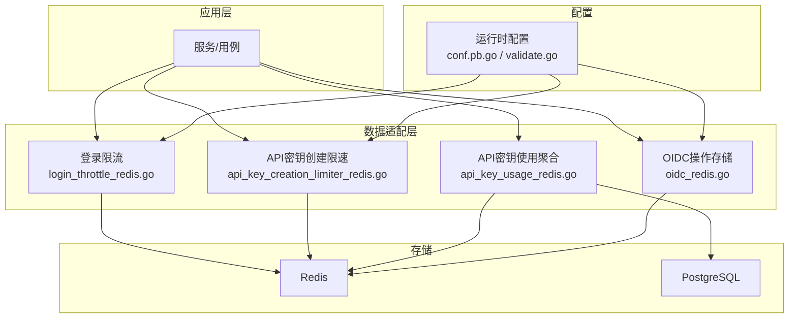
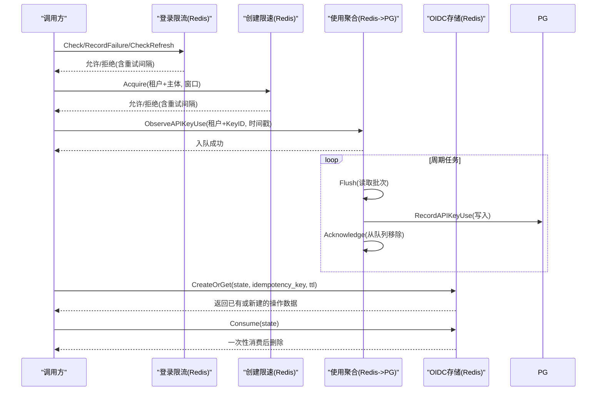
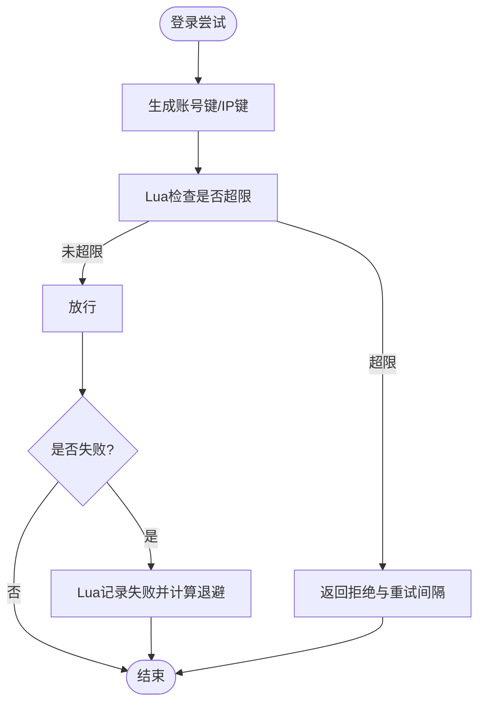
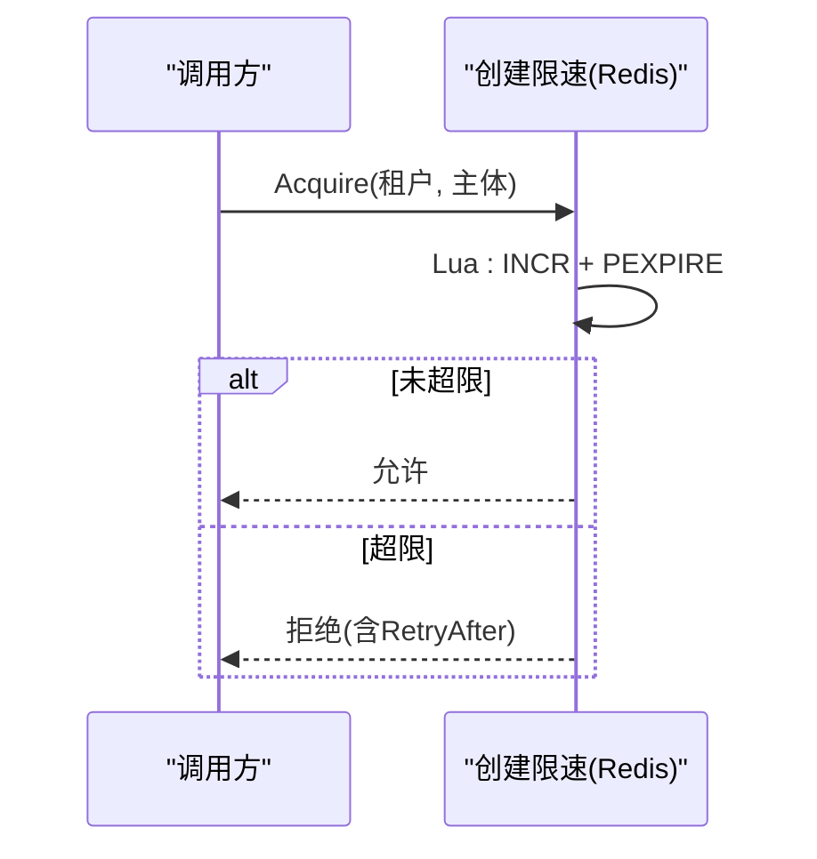
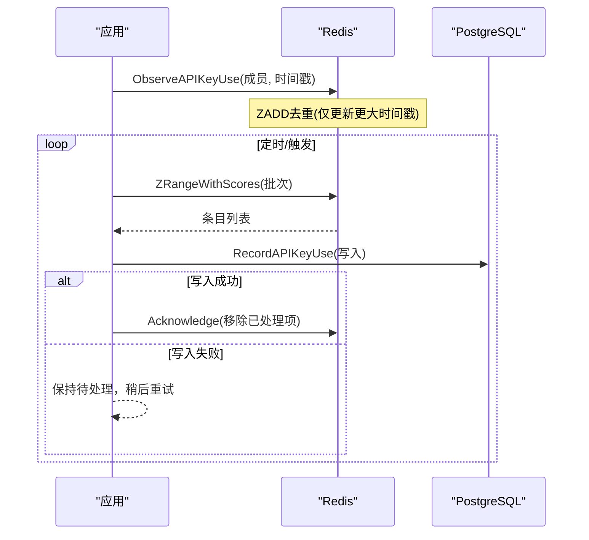
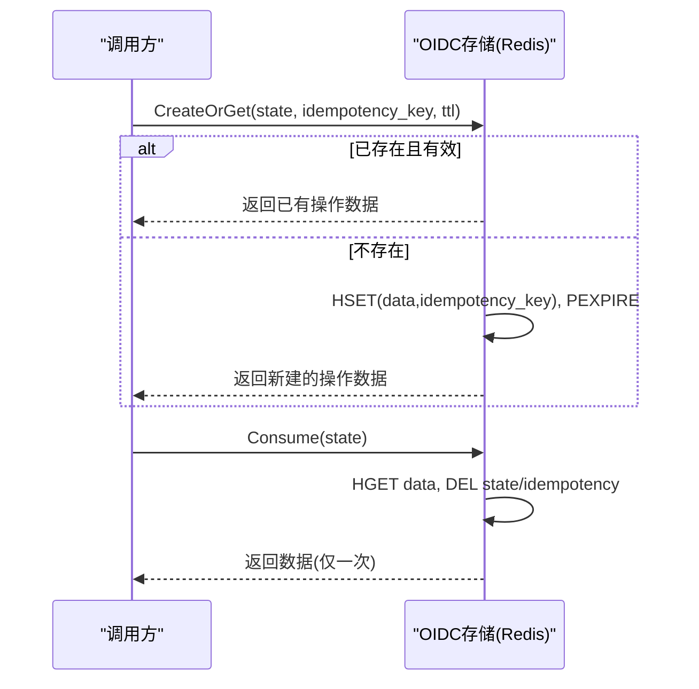
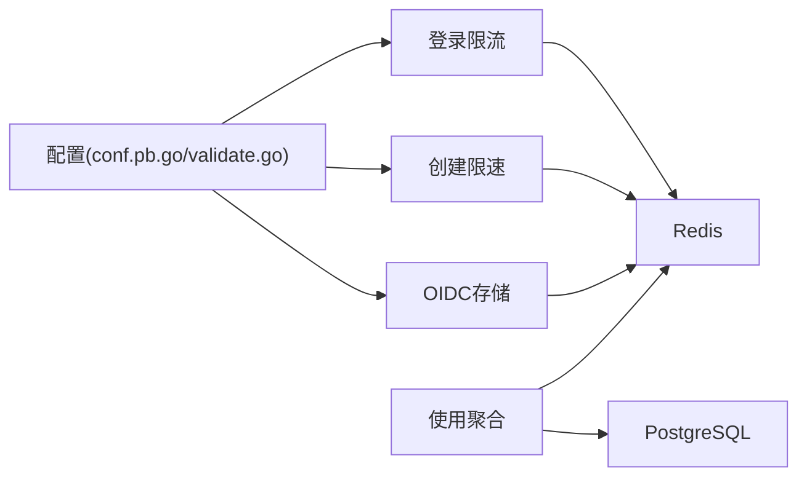

# Redis集成

<cite>
**本文引用的文件**
- [internal/data/login_throttle_redis.go](file://internal/data/login_throttle_redis.go)
- [internal/data/api_key_creation_limiter_redis.go](file://internal/data/api_key_creation_limiter_redis.go)
- [internal/data/api_key_usage_redis.go](file://internal/data/api_key_usage_redis.go)
- [internal/data/oidc_redis.go](file://internal/data/oidc_redis.go)
- [internal/conf/conf.pb.go](file://internal/conf/conf.pb.go)
- [internal/conf/validate.go](file://internal/conf/validate.go)
- [tests/integration/api_key_redis_control_test.go](file://tests/integration/api_key_redis_control_test.go)
- [tests/integration/session_continuity_test.go](file://tests/integration/session_continuity_test.go)
- [internal/data/sqlcgen/persistence.sql.go](file://internal/data/sqlcgen/persistence.sql.go)
</cite>

## 目录
1. [简介](#简介)
2. [项目结构](#项目结构)
3. [核心组件](#核心组件)
4. [架构总览](#架构总览)
5. [详细组件分析](#详细组件分析)
6. [依赖关系分析](#依赖关系分析)
7. [性能与调优](#性能与调优)
8. [故障排查指南](#故障排查指南)
9. [结论](#结论)
10. [附录：键空间与过期策略](#附录键空间与过期策略)

## 简介
本文件面向ANI IAM项目中与Redis的集成，聚焦以下目标：
- Redis连接配置、命名空间隔离与数据过期策略
- API密钥使用统计、登录频率限制、OIDC状态缓存的Redis实现
- 分布式锁、会话缓存、实时数据统计的使用方式与最佳实践
- 连接失败处理、数据一致性与幂等性保障
- 集群部署建议、性能调优与监控指标收集

## 项目结构
本项目将Redis能力集中在internal/data层，通过多个专用适配器实现不同业务场景：
- 登录限流：login_throttle_redis.go
- API密钥创建限速：api_key_creation_limiter_redis.go
- API密钥使用统计聚合：api_key_usage_redis.go
- OIDC操作状态存储：oidc_redis.go
- 配置定义与校验：conf.pb.go、validate.go
- 集成测试验证行为：tests/integration/*_test.go

图表来源
- [internal/data/login_throttle_redis.go:1-223](file://internal/data/login_throttle_redis.go#L1-L223)
- [internal/data/api_key_creation_limiter_redis.go:1-93](file://internal/data/api_key_creation_limiter_redis.go#L1-L93)
- [internal/data/api_key_usage_redis.go:1-143](file://internal/data/api_key_usage_redis.go#L1-L143)
- [internal/data/oidc_redis.go:1-146](file://internal/data/oidc_redis.go#L1-L146)
- [internal/conf/conf.pb.go:986-1035](file://internal/conf/conf.pb.go#L986-L1035)
- [internal/conf/validate.go:198-222](file://internal/conf/validate.go#L198-L222)

章节来源
- [internal/data/login_throttle_redis.go:1-223](file://internal/data/login_throttle_redis.go#L1-L223)
- [internal/data/api_key_creation_limiter_redis.go:1-93](file://internal/data/api_key_creation_limiter_redis.go#L1-L93)
- [internal/data/api_key_usage_redis.go:1-143](file://internal/data/api_key_usage_redis.go#L1-L143)
- [internal/data/oidc_redis.go:1-146](file://internal/data/oidc_redis.go#L1-L146)
- [internal/conf/conf.pb.go:986-1035](file://internal/conf/conf.pb.go#L986-L1035)
- [internal/conf/validate.go:198-222](file://internal/conf/validate.go#L198-L222)

## 核心组件
- 登录限流器（Redis）：基于Lua脚本对账号维度与IP维度进行窗口计数与指数退避阻塞，支持刷新令牌限流。
- API密钥创建限速器（Redis）：按租户+主体维度在时间窗口内限制创建次数。
- API密钥使用聚合器（Redis + PostgreSQL）：高吞吐记录使用事件到Redis有序集合，周期性批量落库并原子确认。
- OIDC操作存储（Redis）：以哈希存储操作数据，配合幂等键映射，提供“创建或获取”和“消费一次”的原子语义。

章节来源
- [internal/data/login_throttle_redis.go:1-223](file://internal/data/login_throttle_redis.go#L1-L223)
- [internal/data/api_key_creation_limiter_redis.go:1-93](file://internal/data/api_key_creation_limiter_redis.go#L1-L93)
- [internal/data/api_key_usage_redis.go:1-143](file://internal/data/api_key_usage_redis.go#L1-L143)
- [internal/data/oidc_redis.go:1-146](file://internal/data/oidc_redis.go#L1-L146)

## 架构总览
Redis在本项目承担三类职责：
- 高频控制面：登录限流、创建限速、刷新令牌限流
- 缓冲与聚合：API密钥使用统计的高吞吐写入与批处理持久化
- 临时状态：OIDC流程的状态与幂等键映射

所有功能均通过Lua脚本保证原子性，避免竞态条件；并通过命名空间前缀隔离多环境或多租户数据。

图表来源
- [internal/data/login_throttle_redis.go:34-104](file://internal/data/login_throttle_redis.go#L34-L104)
- [internal/data/api_key_creation_limiter_redis.go:31-44](file://internal/data/api_key_creation_limiter_redis.go#L31-L44)
- [internal/data/api_key_usage_redis.go:33-47](file://internal/data/api_key_usage_redis.go#L33-L47)
- [internal/data/api_key_usage_redis.go:86-123](file://internal/data/api_key_usage_redis.go#L86-L123)
- [internal/data/oidc_redis.go:25-54](file://internal/data/oidc_redis.go#L25-L54)

## 详细组件分析

### 登录频率限制（Redis）
- 设计要点
  - 双维度限流：账号维度与IP维度分别维护计数或阻塞状态
  - 指数退避：失败次数越多，阻塞时间越长，上限为窗口时长
  - 刷新令牌限流：基于令牌摘要的计数器，设置TTL
- 关键实现
  - Lua脚本checkLoginThrottle、recordLoginThrottleFailure、checkRefreshThrottle
  - 键名包含命名空间与摘要，避免冲突
  - 错误类型AuthenticationRateLimitError携带LimitScope与RetryAfter

图表来源
- [internal/data/login_throttle_redis.go:34-104](file://internal/data/login_throttle_redis.go#L34-L104)
- [internal/data/login_throttle_redis.go:122-169](file://internal/data/login_throttle_redis.go#L122-L169)
- [internal/data/login_throttle_redis.go:182-204](file://internal/data/login_throttle_redis.go#L182-L204)

章节来源
- [internal/data/login_throttle_redis.go:1-223](file://internal/data/login_throttle_redis.go#L1-L223)
- [tests/integration/session_continuity_test.go:44-66](file://tests/integration/session_continuity_test.go#L44-L66)

### API密钥创建限速（Redis）
- 设计要点
  - 按租户+主体维度在时间窗口内限制创建次数
  - INCR+PEXPIRE模式，首次创建时设置过期
- 关键实现
  - Lua脚本acquireAPIKeyCreation保证原子计数与TTL设置
  - 超出限制返回AuthenticationRateLimitError，包含RetryAfter

图表来源
- [internal/data/api_key_creation_limiter_redis.go:31-44](file://internal/data/api_key_creation_limiter_redis.go#L31-L44)
- [internal/data/api_key_creation_limiter_redis.go:59-90](file://internal/data/api_key_creation_limiter_redis.go#L59-L90)

章节来源
- [internal/data/api_key_creation_limiter_redis.go:1-93](file://internal/data/api_key_creation_limiter_redis.go#L1-L93)
- [tests/integration/api_key_redis_control_test.go:20-53](file://tests/integration/api_key_redis_control_test.go#L20-L53)

### API密钥使用统计（Redis + PostgreSQL）
- 设计要点
  - 高吞吐观察：ObserveAPIKeyUse将使用事件追加到Redis有序集合（分数=毫秒时间戳），去重保留最新
  - 批处理持久化：Flush读取固定批次，逐条写入PostgreSQL，成功后原子确认并从队列移除
  - 失败安全：PostgreSQL失败不改变Redis状态，下次继续重试
- 关键实现
  - Lua脚本observeAPIKeyUse、acknowledgeAPIKeyUse
  - 成员格式：tenantID/keyID，便于解析与索引
  - 持久化SQL：RecordAPIKeyUse

图表来源
- [internal/data/api_key_usage_redis.go:33-47](file://internal/data/api_key_usage_redis.go#L33-L47)
- [internal/data/api_key_usage_redis.go:63-123](file://internal/data/api_key_usage_redis.go#L63-L123)
- [internal/data/sqlcgen/persistence.sql.go:4083-4094](file://internal/data/sqlcgen/persistence.sql.go#L4083-L4094)

章节来源
- [internal/data/api_key_usage_redis.go:1-143](file://internal/data/api_key_usage_redis.go#L1-L143)
- [internal/data/sqlcgen/persistence.sql.go:4083-4094](file://internal/data/sqlcgen/persistence.sql.go#L4083-L4094)
- [tests/integration/api_key_redis_control_test.go:89-152](file://tests/integration/api_key_redis_control_test.go#L89-L152)

### OIDC状态缓存（Redis）
- 设计要点
  - 操作状态存储在哈希中，附带idempotency_key映射，确保幂等
  - createOrGet：若存在则返回已有数据；否则创建新状态并设置过期
  - consume：一次性读取并删除，同时清理idempotency映射
- 关键实现
  - Lua脚本createOrGetOIDCOperation、consumeOIDCOperation
  - 键名：state哈希键与idempotency映射键均带命名空间前缀

图表来源
- [internal/data/oidc_redis.go:25-54](file://internal/data/oidc_redis.go#L25-L54)
- [internal/data/oidc_redis.go:111-146](file://internal/data/oidc_redis.go#L111-L146)

章节来源
- [internal/data/oidc_redis.go:1-146](file://internal/data/oidc_redis.go#L1-L146)

## 依赖关系分析
- 配置驱动
  - Redis地址、用户名、密码、数据库编号、命名空间、登录限制参数、读写超时等由配置定义并在启动时校验
  - 校验规则包括非空、范围、时长上限等
- 运行时依赖
  - 登录限流、创建限速、OIDC状态存储仅依赖Redis
  - API密钥使用聚合依赖Redis与PostgreSQL，具备异步落库与重试能力
- 外部库
  - 使用redis/go-redis/v9客户端，统一通过UniversalClient抽象

图表来源
- [internal/conf/conf.pb.go:986-1035](file://internal/conf/conf.pb.go#L986-L1035)
- [internal/conf/validate.go:198-222](file://internal/conf/validate.go#L198-L222)
- [internal/data/login_throttle_redis.go:1-223](file://internal/data/login_throttle_redis.go#L1-L223)
- [internal/data/api_key_creation_limiter_redis.go:1-93](file://internal/data/api_key_creation_limiter_redis.go#L1-L93)
- [internal/data/api_key_usage_redis.go:1-143](file://internal/data/api_key_usage_redis.go#L1-L143)
- [internal/data/oidc_redis.go:1-146](file://internal/data/oidc_redis.go#L1-L146)

章节来源
- [internal/conf/conf.pb.go:986-1035](file://internal/conf/conf.pb.go#L986-L1035)
- [internal/conf/validate.go:198-222](file://internal/conf/validate.go#L198-L222)

## 性能与调优
- 使用Lua脚本
  - 所有关键路径（限流、聚合、OIDC状态）均通过Lua脚本保证原子性，减少网络往返与竞争
- 批量与批大小
  - API密钥使用聚合采用ZRangeWithScores分批读取，BatchSize可调节以平衡延迟与吞吐
- 键空间与过期
  - 所有键均带命名空间前缀，避免冲突；使用PEXPIRE精确控制过期时间
- 超时与重试
  - 配置dial/read/write超时，结合上层重试与退避策略提升鲁棒性
- 监控指标建议
  - 限流拒绝率、重试间隔分布
  - 使用聚合队列长度、批处理耗时、持久化失败率
  - OIDC状态命中率、过期清理情况
  - Redis连接池利用率、命令延迟分位

[本节为通用指导，无需特定文件引用]

## 故障排查指南
- 连接失败
  - 现象：限流/聚合/OIDC操作报错
  - 排查：检查Redis地址、认证信息、网络连通性与超时配置
  - 参考：配置校验与错误返回
- 数据一致性
  - 使用聚合：PostgreSQL写入失败不会误删Redis条目，下次重试继续处理
  - OIDC状态：幂等键映射确保重复请求返回相同结果
- 限流异常
  - 检查账号/IP维度键是否存在异常类型
  - 核对窗口时长、基础延迟与上限配置
- 日志与断点
  - 在Lua脚本执行前后增加日志，定位具体步骤失败原因

章节来源
- [internal/conf/validate.go:198-222](file://internal/conf/validate.go#L198-L222)
- [internal/data/api_key_usage_redis.go:86-123](file://internal/data/api_key_usage_redis.go#L86-L123)
- [internal/data/oidc_redis.go:111-146](file://internal/data/oidc_redis.go#L111-L146)
- [tests/integration/api_key_redis_control_test.go:154-185](file://tests/integration/api_key_redis_control_test.go#L154-L185)

## 结论
本项目通过Redis实现了高并发下的登录限流、API密钥创建限速、使用统计聚合与OIDC状态缓存。所有关键路径使用Lua脚本保证原子性，结合命名空间与过期策略实现数据隔离与自动清理。API密钥使用聚合通过Redis缓冲与PostgreSQL持久化的组合，兼顾吞吐与可靠性。建议在部署时关注连接超时、批大小与监控指标，以获得稳定高效的运行效果。

[本节为总结，无需特定文件引用]

## 附录：键空间与过期策略
- 命名空间
  - 所有键均以配置的namespace为前缀，示例：
    - 登录限流：{namespace}:login:account:{账号摘要}、{namespace}:login:ip:{IP摘要}
    - 刷新令牌：{namespace}:refresh:token:{令牌摘要}
    - API密钥创建：{namespace}:api-key:create:{tenantId}:{principalId}
    - API密钥使用：{namespace}:api-key:usage（有序集合）
    - OIDC操作：{namespace}:oidc:operation:{state摘要}、{namespace}:oidc:idempotency:{idempotency摘要}
- 数据结构
  - 字符串：用于简单计数与TTL（如创建限速）
  - 哈希：用于登录限流的计数与阻塞截止时间、OIDC操作的数据与幂等键映射
  - 有序集合：用于API密钥使用事件的排序与批处理
- 过期策略
  - 使用PEXPIRE精确设置毫秒级过期
  - 登录限流窗口、OIDC操作状态均有明确过期时间
  - 刷新令牌计数器在首次使用时设置TTL

章节来源
- [internal/data/login_throttle_redis.go:206-220](file://internal/data/login_throttle_redis.go#L206-L220)
- [internal/data/api_key_creation_limiter_redis.go:59-90](file://internal/data/api_key_creation_limiter_redis.go#L59-L90)
- [internal/data/api_key_usage_redis.go:125-140](file://internal/data/api_key_usage_redis.go#L125-L140)
- [internal/data/oidc_redis.go:138-146](file://internal/data/oidc_redis.go#L138-L146)