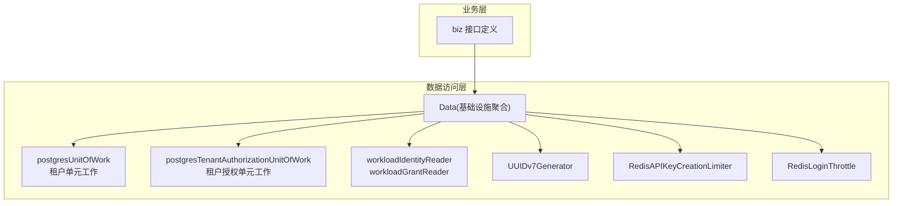
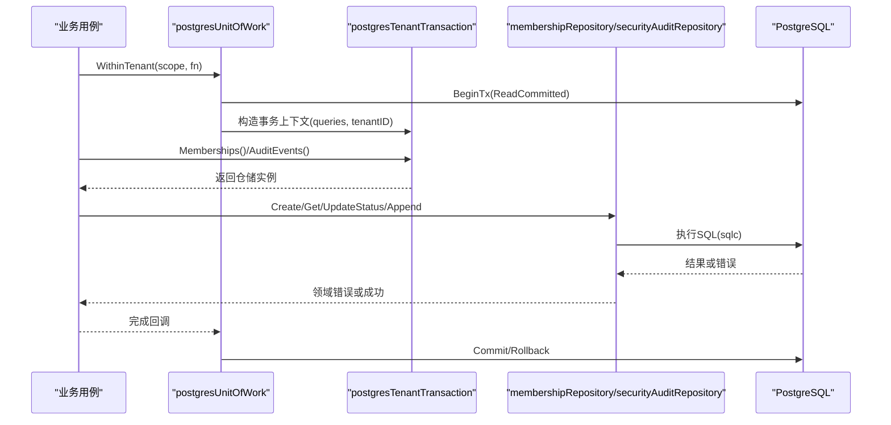
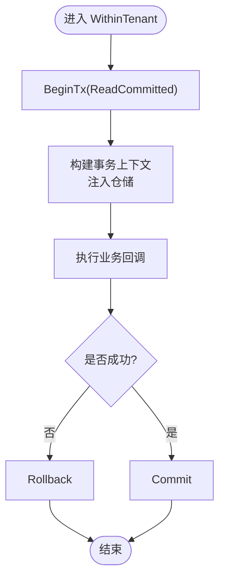
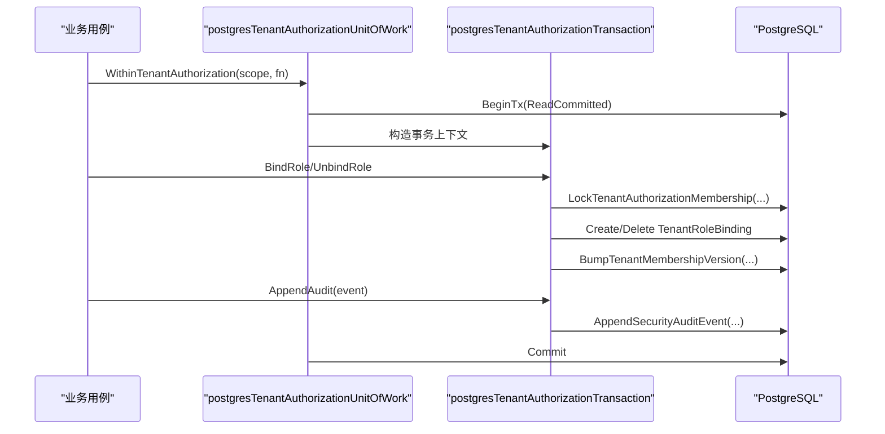
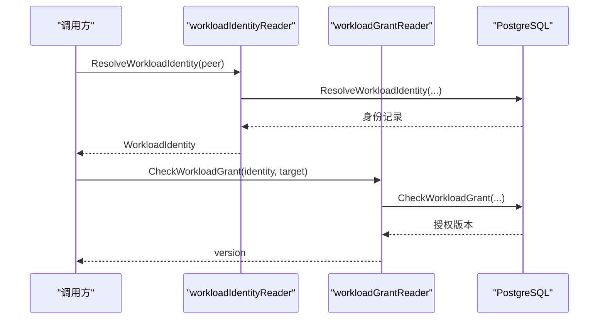
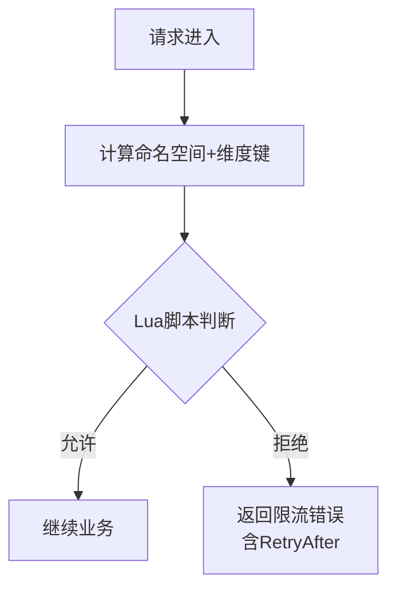
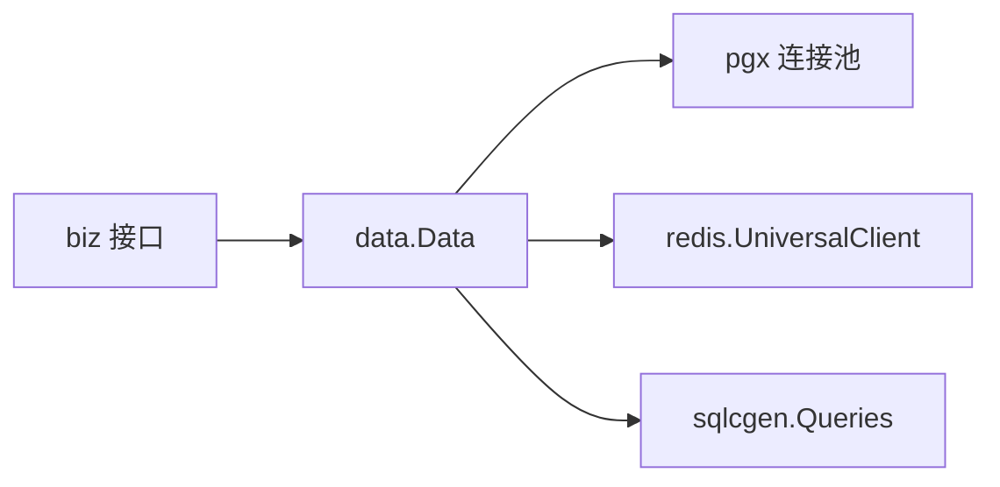

# Repository模式实现

<cite>
**本文引用的文件**
- [internal/data/data.go](file://internal/data/data.go)
- [internal/data/postgres.go](file://internal/data/postgres.go)
- [internal/data/tenant_authorization.go](file://internal/data/tenant_authorization.go)
- [internal/data/workload.go](file://internal/data/workload.go)
- [internal/data/id_generator.go](file://internal/data/id_generator.go)
- [internal/data/api_key_creation_limiter_redis.go](file://internal/data/api_key_creation_limiter_redis.go)
- [internal/data/login_throttle_redis.go](file://internal/data/login_throttle_redis.go)
- [internal/biz/biz.go](file://internal/biz/biz.go)
</cite>

## 目录
1. [简介](#简介)
2. [项目结构](#项目结构)
3. [核心组件](#核心组件)
4. [架构总览](#架构总览)
5. [详细组件分析](#详细组件分析)
6. [依赖关系分析](#依赖关系分析)
7. [性能考虑](#性能考虑)
8. [故障排查指南](#故障排查指南)
9. [结论](#结论)
10. [附录](#附录)

## 简介
本文件围绕 ANI IAM 项目的 Repository 模式实现，系统性说明如何通过接口抽象不同的数据存储后端，将业务逻辑与数据访问解耦。重点覆盖工作负载、租户授权、ID 生成器等核心实体的仓储实现；阐述统一的 CRUD 接口设计，支持 PostgreSQL 与 Redis 等存储后端的切换；给出扩展新存储后端的实践方法；并总结事务管理、数据一致性与错误处理策略。

## 项目结构
数据访问层位于 internal/data，通过 Data 聚合基础设施客户端（如数据库连接池），并以仓库适配器形式实现 biz 层定义的端口接口。PostgreSQL 相关实现集中在 postgres.go、tenant_authorization.go、workload.go 等文件中；Redis 限流与速率限制能力以独立适配器提供；ID 生成器作为轻量基础设施组件存在。

图表来源
- [internal/data/data.go:6-29](file://internal/data/data.go#L6-L29)
- [internal/data/postgres.go:18-72](file://internal/data/postgres.go#L18-L72)
- [internal/data/tenant_authorization.go:15-172](file://internal/data/tenant_authorization.go#L15-L172)
- [internal/data/workload.go:15-65](file://internal/data/workload.go#L15-L65)
- [internal/data/id_generator.go:5-13](file://internal/data/id_generator.go#L5-L13)
- [internal/data/api_key_creation_limiter_redis.go:18-93](file://internal/data/api_key_creation_limiter_redis.go#L18-L93)
- [internal/data/login_throttle_redis.go:19-223](file://internal/data/login_throttle_redis.go#L19-L223)

章节来源
- [internal/data/data.go:6-29](file://internal/data/data.go#L6-L29)

## 核心组件
- Data：聚合长期生命周期的基础设施客户端（如 pgxpool），不包含事务状态，提供 WithLifecycleObservation 配置副本能力。
- 租户单元工作（postgresUnitOfWork）：封装 ReadCommitted 隔离级别的事务边界，暴露成员与审计的仓储入口。
- 租户授权单元工作（postgresTenantAuthorizationUnitOfWork）：提供带锁与版本控制的租户授权操作事务边界。
- 工作负载读取器（workloadIdentityReader、workloadGrantReader）：解析工作负载身份与检查授权。
- ID 生成器（UUIDv7Generator）：基于 UUID v7 的 ID 生成。
- Redis 限流器（RedisAPIKeyCreationLimiter、RedisLoginThrottle）：实现登录、刷新令牌、API Key 创建等速率限制。

章节来源
- [internal/data/data.go:6-29](file://internal/data/data.go#L6-L29)
- [internal/data/postgres.go:18-72](file://internal/data/postgres.go#L18-L72)
- [internal/data/tenant_authorization.go:15-172](file://internal/data/tenant_authorization.go#L15-L172)
- [internal/data/workload.go:15-65](file://internal/data/workload.go#L15-L65)
- [internal/data/id_generator.go:5-13](file://internal/data/id_generator.go#L5-L13)
- [internal/data/api_key_creation_limiter_redis.go:18-93](file://internal/data/api_key_creation_limiter_redis.go#L18-L93)
- [internal/data/login_throttle_redis.go:19-223](file://internal/data/login_throttle_redis.go#L19-L223)

## 架构总览
Repository 模式在本项目中体现为“biz 接口 + data 实现”的清晰分层。biz 层仅声明端口（如 TenantUnitOfWork、TenantAuthorizationUnitOfWork、WorkloadIdentityReader 等），data 层提供具体存储适配。Data 作为基础设施容器，持有连接池与可选保护器；各仓储在事务内通过 sqlc 生成的查询对象执行 SQL，并通过统一错误映射函数将底层异常转换为领域错误。

图表来源
- [internal/data/postgres.go:27-72](file://internal/data/postgres.go#L27-L72)
- [internal/data/postgres.go:74-182](file://internal/data/postgres.go#L74-L182)

## 详细组件分析

### 租户单元工作与会话式仓储
- 事务边界：WithinTenant 开启 ReadCommitted 事务，失败时回滚，成功提交。
- 仓储装配：在事务中注入 membershipRepository 与 securityAuditRepository，限定 tenantID 作用域。
- 一致性保障：所有写操作使用 expectedVersion 与时间戳，结合数据库约束与错误映射保证并发安全。
- 错误处理：mapPostgresError 将 Postgres 错误码映射为领域错误（冲突、权限不足、版本冲突等）。

图表来源
- [internal/data/postgres.go:27-59](file://internal/data/postgres.go#L27-L59)
- [internal/data/postgres.go:195-232](file://internal/data/postgres.go#L195-L232)

章节来源
- [internal/data/postgres.go:27-72](file://internal/data/postgres.go#L27-L72)
- [internal/data/postgres.go:74-182](file://internal/data/postgres.go#L74-L182)
- [internal/data/postgres.go:184-232](file://internal/data/postgres.go#L184-L232)

### 租户授权仓储与强一致性更新
- 事务边界：WithinTenantAuthorization 提供带管理守卫锁与成员锁的强一致事务。
- 版本控制：通过 LockTenantAuthorizationMembership 与 BumpTenantMembershipVersion 实现乐观锁升级。
- 角色绑定：BindRole/UnbindRole 在锁定成员后进行增删，并提升成员版本号。
- 审计追加：复用 securityAuditRepository.Append 在同一事务中追加审计事件。

图表来源
- [internal/data/tenant_authorization.go:141-172](file://internal/data/tenant_authorization.go#L141-L172)
- [internal/data/tenant_authorization.go:338-393](file://internal/data/tenant_authorization.go#L338-L393)
- [internal/data/tenant_authorization.go:395-419](file://internal/data/tenant_authorization.go#L395-L419)

章节来源
- [internal/data/tenant_authorization.go:15-172](file://internal/data/tenant_authorization.go#L15-L172)
- [internal/data/tenant_authorization.go:174-432](file://internal/data/tenant_authorization.go#L174-L432)

### 工作负载身份与授权
- 身份解析：ResolveWorkloadIdentity 根据环境、信任域、身份类型与值解析出主体与绑定信息。
- 授权检查：CheckWorkloadGrant 先校验目标注册，再查询授权表，返回授权版本供调用方校验。
- 运行时基础校验：ValidateRuntimeFoundation 检查 schema revision、角色权限与触发器完整性，确保运行环境符合预期。

图表来源
- [internal/data/workload.go:32-65](file://internal/data/workload.go#L32-L65)

章节来源
- [internal/data/workload.go:15-65](file://internal/data/workload.go#L15-L65)
- [internal/data/workload.go:67-176](file://internal/data/workload.go#L67-L176)

### ID 生成器
- 采用 UUID v7 生成器，具备时间有序性，便于索引与排序。
- 简单可替换，便于未来扩展其他 ID 策略。

章节来源
- [internal/data/id_generator.go:5-13](file://internal/data/id_generator.go#L5-L13)

### Redis 限流与速率限制
- API Key 创建限流：基于 Lua 脚本原子计数与 TTL，超过阈值返回重试间隔。
- 登录节流：多键联合检查与指数退避，支持账号/IP 维度限流与刷新令牌限流。
- 配置校验：构造函数对参数进行严格校验，避免非法配置导致的不稳定行为。

图表来源
- [internal/data/api_key_creation_limiter_redis.go:31-93](file://internal/data/api_key_creation_limiter_redis.go#L31-L93)
- [internal/data/login_throttle_redis.go:34-223](file://internal/data/login_throttle_redis.go#L34-L223)

章节来源
- [internal/data/api_key_creation_limiter_redis.go:18-93](file://internal/data/api_key_creation_limiter_redis.go#L18-L93)
- [internal/data/login_throttle_redis.go:19-223](file://internal/data/login_throttle_redis.go#L19-L223)

## 依赖关系分析
- biz 层仅依赖接口，不感知存储细节；data 层实现这些接口，依赖 pgx 与 redis 客户端。
- Data 作为基础设施聚合点，降低耦合度，便于测试与替换。
- 事务内通过 sqlc 生成的查询对象访问数据库，减少手写 SQL 风险。
- 错误映射集中化，保证上层业务获得一致的领域错误语义。

图表来源
- [internal/data/data.go:6-29](file://internal/data/data.go#L6-L29)
- [internal/data/postgres.go:18-72](file://internal/data/postgres.go#L18-L72)
- [internal/data/tenant_authorization.go:15-172](file://internal/data/tenant_authorization.go#L15-L172)
- [internal/data/api_key_creation_limiter_redis.go:18-93](file://internal/data/api_key_creation_limiter_redis.go#L18-L93)
- [internal/data/login_throttle_redis.go:19-223](file://internal/data/login_throttle_redis.go#L19-L223)

章节来源
- [internal/biz/biz.go:1-4](file://internal/biz/biz.go#L1-L4)

## 性能考虑
- 事务隔离级别：统一使用 ReadCommitted，兼顾一致性与吞吐。
- 并发控制：通过数据库行级锁（LockTenantAuthorizationMembership）与乐观版本控制避免竞态。
- 缓存与限流：Redis 侧使用 Lua 脚本保证原子性，降低网络往返与竞争开销。
- 查询优化：sqlc 生成高效查询，分页与游标避免全表扫描。
- 资源校验：ValidateRuntimeFoundation 在启动阶段快速发现权限与 schema 问题，避免运行时退化。

[本节为通用指导，不直接分析具体文件]

## 故障排查指南
- 常见错误映射：
  - 唯一冲突：23505 -> 对应领域冲突错误（如成员、角色绑定冲突）。
  - 外键冲突：23503 -> 关系冲突或无效持久化状态。
  - 版本冲突：40001/40P01 -> 版本冲突错误。
  - 权限不足：42501 -> 持久化权限被拒绝。
- 事务回滚：WithinTenant/WithinTenantAuthorization 在回调失败时自动回滚，需关注 mapPostgresError 包装后的错误链。
- Redis 限流：检查 Lua 脚本返回值与 TTL，确认命名空间与键生成逻辑正确。
- 运行时基础校验：ValidateRuntimeFoundation 失败通常意味着 schema 版本、角色权限或触发器不一致。

章节来源
- [internal/data/postgres.go:195-232](file://internal/data/postgres.go#L195-L232)
- [internal/data/tenant_authorization.go:190-220](file://internal/data/tenant_authorization.go#L190-L220)
- [internal/data/api_key_creation_limiter_redis.go:59-93](file://internal/data/api_key_creation_limiter_redis.go#L59-L93)
- [internal/data/login_throttle_redis.go:122-204](file://internal/data/login_throttle_redis.go#L122-L204)
- [internal/data/workload.go:67-176](file://internal/data/workload.go#L67-L176)

## 结论
本项目通过清晰的 Repository 模式实现了业务与存储的解耦：biz 层专注领域规则，data 层负责具体存储实现。PostgreSQL 提供强一致的事务与版本控制，Redis 提供高性能限流与速率控制。统一的错误映射与事务边界提升了系统的可维护性与可靠性。扩展新存储后端时，只需实现 biz 接口并在 Data 中装配即可，保持上层调用不变。

[本节为总结性内容，不直接分析具体文件]

## 附录
- 如何扩展新的存储后端
  - 在 biz 层定义所需端口（若尚未定义）。
  - 在 data 层实现对应仓储与单元工作（参考 postgresUnitOfWork、postgresTenantAuthorizationUnitOfWork）。
  - 在 Data 中装配新实现，并提供工厂方法供服务层注入。
  - 编写单元测试与集成测试，覆盖错误映射与事务边界。
- 关键实现路径参考
  - 租户单元工作与成员/审计仓储：[internal/data/postgres.go:27-182](file://internal/data/postgres.go#L27-L182)
  - 租户授权事务与版本控制：[internal/data/tenant_authorization.go:141-419](file://internal/data/tenant_authorization.go#L141-L419)
  - 工作负载身份与授权：[internal/data/workload.go:32-65](file://internal/data/workload.go#L32-L65)
  - Redis 限流实现：[internal/data/api_key_creation_limiter_redis.go:31-93](file://internal/data/api_key_creation_limiter_redis.go#L31-L93), [internal/data/login_throttle_redis.go:34-223](file://internal/data/login_throttle_redis.go#L34-L223)
  - ID 生成器：[internal/data/id_generator.go:5-13](file://internal/data/id_generator.go#L5-L13)