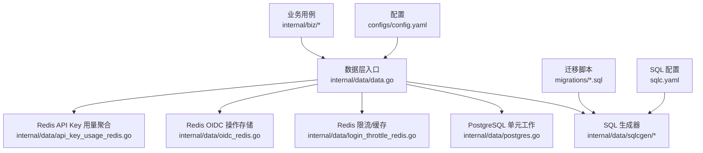
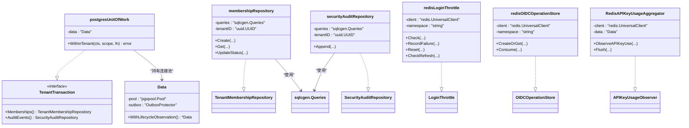
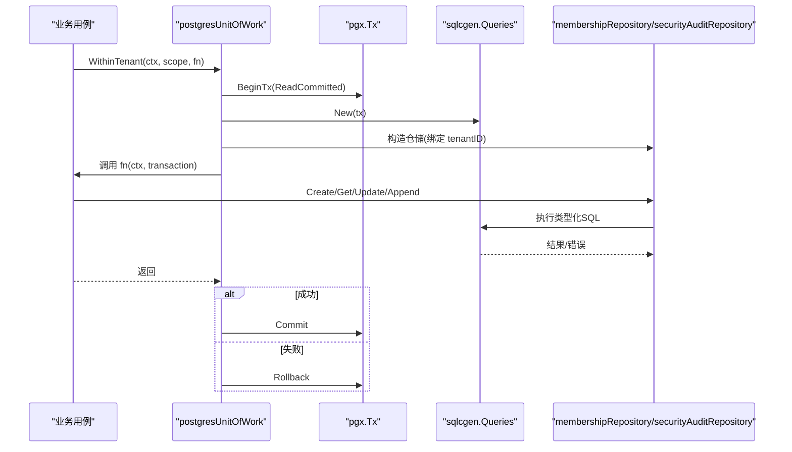
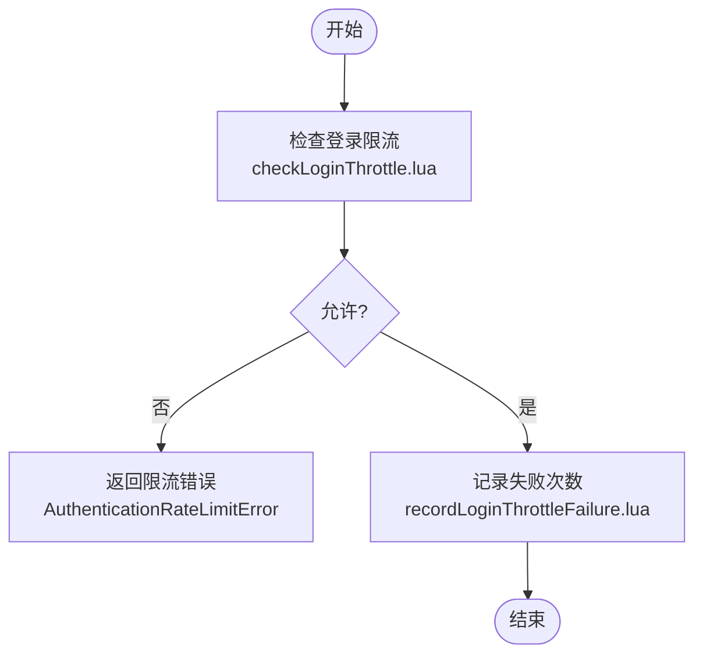
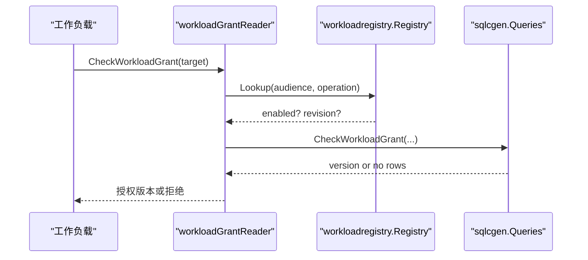
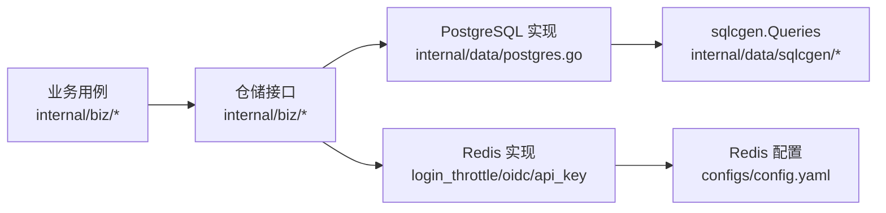

# 数据层(Data Layer)

<cite>
**本文引用的文件**
- [internal/data/data.go](file://internal/data/data.go)
- [internal/data/postgres.go](file://internal/data/postgres.go)
- [internal/data/sqlcgen/db.go](file://internal/data/sqlcgen/db.go)
- [internal/data/sqlcgen/querier.go](file://internal/data/sqlcgen/querier.go)
- [internal/data/login_throttle_redis.go](file://internal/data/login_throttle_redis.go)
- [internal/data/oidc_redis.go](file://internal/data/oidc_redis.go)
- [internal/data/api_key_usage_redis.go](file://internal/data/api_key_usage_redis.go)
- [internal/data/workload.go](file://internal/data/workload.go)
- [configs/config.yaml](file://configs/config.yaml)
- [migrations/202609040001_persistence_foundation.sql](file://migrations/202609040001_persistence_foundation.sql)
- [sqlc.yaml](file://sqlc.yaml)
- [internal/biz/membership.go](file://internal/biz/membership.go)
- [internal/biz/authentication.go](file://internal/biz/authentication.go)
- [internal/biz/oidc.go](file://internal/biz/oidc.go)
</cite>

## 目录
1. [简介](#简介)
2. [项目结构](#项目结构)
3. [核心组件](#核心组件)
4. [架构总览](#架构总览)
5. [详细组件分析](#详细组件分析)
6. [依赖关系分析](#依赖关系分析)
7. [性能考虑](#性能考虑)
8. [故障排查指南](#故障排查指南)
9. [结论](#结论)
10. [附录](#附录)

## 简介
本文件面向 ANI IAM 项目的数据层，系统性说明其数据访问抽象设计、Repository 模式实现、PostgreSQL 与 Redis 的集成方式、连接池管理、查询优化、缓存策略、CRUD 操作范式、数据库迁移与版本兼容性，以及性能优化技巧与监控指标收集建议。文档以代码级事实为依据，辅以可视化图示，帮助读者快速理解并正确使用该数据层。

## 项目结构
数据层位于 internal/data，围绕以下关键组织原则构建：
- 基础设施适配：Data 聚合长期存在的客户端（如 pgxpool），不持有事务状态；具体业务仓储通过接口暴露给上层用例。
- SQL 生成：使用 sqlc 将 SQL 查询与模型类型化生成到 internal/data/sqlcgen，统一 DBTX 接口以便在连接或事务上复用。
- 领域边界：biz 层定义 Repository 接口与领域对象，data 层提供 PostgreSQL/Redis 的具体实现，确保业务逻辑与存储解耦。
- 配置：运行时通过 configs/config.yaml 注入 PostgreSQL DSN、Redis 地址与命名空间等参数。

图表来源
- [internal/data/data.go:6-29](file://internal/data/data.go#L6-L29)
- [internal/data/postgres.go:18-72](file://internal/data/postgres.go#L18-L72)
- [internal/data/sqlcgen/db.go:14-33](file://internal/data/sqlcgen/db.go#L14-L33)
- [internal/data/sqlcgen/querier.go:14-425](file://internal/data/sqlcgen/querier.go#L14-L425)
- [internal/data/login_throttle_redis.go:19-120](file://internal/data/login_throttle_redis.go#L19-L120)
- [internal/data/oidc_redis.go:20-62](file://internal/data/oidc_redis.go#L20-L62)
- [internal/data/api_key_usage_redis.go:21-61](file://internal/data/api_key_usage_redis.go#L21-L61)
- [configs/config.yaml:22-32](file://configs/config.yaml#L22-L32)
- [sqlc.yaml:1-23](file://sqlc.yaml#L1-L23)

章节来源
- [internal/data/data.go:6-29](file://internal/data/data.go#L6-L29)
- [configs/config.yaml:22-32](file://configs/config.yaml#L22-L32)
- [sqlc.yaml:1-23](file://sqlc.yaml#L1-L23)

## 核心组件
- Data 聚合体：持有 pgxpool 连接池与可选 Outbox 保护器，提供 WithLifecycleObservation 用于生命周期观察副本。
- PostgreSQL 单元工作：postgresUnitOfWork 封装租户级事务边界，WithinTenant 负责开启 ReadCommitted 事务、构造 sqlc.Queries、组装 TenantTransaction 并执行回调，最终提交或回滚。
- SQL 生成器：DBTX 接口统一 Exec/Query/QueryRow，Queries 可在连接或事务上创建，Querier 暴露大量类型化方法。
- Redis 适配器：登录限流、OIDC 操作存储、API Key 用量聚合分别实现 biz 层对应接口，使用 Lua 脚本保证原子性与一致性。
- 工作负载身份与授权：workloadIdentityReader/GrantReader 基于 sqlc 查询校验工作负载身份与目标授权。

章节来源
- [internal/data/data.go:6-29](file://internal/data/data.go#L6-L29)
- [internal/data/postgres.go:18-72](file://internal/data/postgres.go#L18-L72)
- [internal/data/sqlcgen/db.go:14-33](file://internal/data/sqlcgen/db.go#L14-L33)
- [internal/data/sqlcgen/querier.go:14-425](file://internal/data/sqlcgen/querier.go#L14-L425)
- [internal/data/login_throttle_redis.go:19-120](file://internal/data/login_throttle_redis.go#L19-L120)
- [internal/data/oidc_redis.go:20-62](file://internal/data/oidc_redis.go#L20-L62)
- [internal/data/api_key_usage_redis.go:21-61](file://internal/data/api_key_usage_redis.go#L21-L61)
- [internal/data/workload.go:15-65](file://internal/data/workload.go#L15-L65)

## 架构总览
数据层采用“领域驱动 + Repository 模式”的分层设计：
- 业务层（biz）定义仓储接口与领域模型，不包含任何存储细节。
- 数据层（data）实现这些接口，分别对接 PostgreSQL（通过 sqlc 生成的 Queries）和 Redis（Lua 脚本）。
- 事务由 Unit of Work 管理，确保同一租户上下文内的多表操作原子性。
- 配置集中管理连接参数，便于环境隔离与运维。

图表来源
- [internal/data/data.go:6-29](file://internal/data/data.go#L6-L29)
- [internal/data/postgres.go:18-72](file://internal/data/postgres.go#L18-L72)
- [internal/data/sqlcgen/db.go:14-33](file://internal/data/sqlcgen/db.go#L14-L33)
- [internal/data/sqlcgen/querier.go:14-425](file://internal/data/sqlcgen/querier.go#L14-L425)
- [internal/data/login_throttle_redis.go:19-120](file://internal/data/login_throttle_redis.go#L19-L120)
- [internal/data/oidc_redis.go:20-62](file://internal/data/oidc_redis.go#L20-L62)
- [internal/data/api_key_usage_redis.go:21-61](file://internal/data/api_key_usage_redis.go#L21-L61)

## 详细组件分析

### PostgreSQL 集成与 Repository 模式
- 单元工作：postgresUnitOfWork.WithinTenant 以 ReadCommitted 隔离级别开启事务，构造 sqlc.Queries，并将成员关系与安全审计仓储注入 TenantTransaction，调用完成后提交或回滚。错误映射将底层 PG 错误码转换为领域错误（如唯一冲突、版本冲突、权限拒绝等）。
- 仓储实现：membershipRepository 与 securityAuditRepository 通过 sqlcgen.Queries 执行类型化 SQL，完成 CRUD 与追加审计事件。
- 查询生成：sqlc.yaml 指定引擎为 PostgreSQL，schema 来自 migrations，查询来自 internal/data/queries，输出包为 sqlcgen，启用 emit_interface 与空切片等特性。

图表来源
- [internal/data/postgres.go:27-59](file://internal/data/postgres.go#L27-L59)
- [internal/data/postgres.go:74-182](file://internal/data/postgres.go#L74-L182)
- [internal/data/sqlcgen/db.go:20-33](file://internal/data/sqlcgen/db.go#L20-L33)
- [internal/data/sqlcgen/querier.go:14-425](file://internal/data/sqlcgen/querier.go#L14-L425)

章节来源
- [internal/data/postgres.go:18-232](file://internal/data/postgres.go#L18-L232)
- [sqlc.yaml:1-23](file://sqlc.yaml#L1-L23)
- [internal/data/sqlcgen/db.go:14-33](file://internal/data/sqlcgen/db.go#L14-L33)
- [internal/data/sqlcgen/querier.go:14-425](file://internal/data/sqlcgen/querier.go#L14-L425)

### Redis 集成：登录限流、OIDC 操作存储、API Key 用量聚合
- 登录限流：redisLoginThrottle 使用 Lua 脚本在 Redis 中按账号与 IP 维度进行限流检查与失败记录，支持指数退避与窗口控制，返回 AuthenticationRateLimitError。
- OIDC 操作存储：redisOIDCOperationStore 使用 Hash+TTL 与幂等键映射，确保状态机操作的原子创建/消费，避免并发冲突。
- API Key 用量聚合：RedisAPIKeyUsageAggregator 使用有序集合记录观测时间戳，批量 Flush 至 PostgreSQL，并通过 Lua 确认已持久化的条目，保证至少一次语义。

图表来源
- [internal/data/login_throttle_redis.go:34-89](file://internal/data/login_throttle_redis.go#L34-L89)
- [internal/data/login_throttle_redis.go:122-169](file://internal/data/login_throttle_redis.go#L122-L169)

章节来源
- [internal/data/login_throttle_redis.go:19-223](file://internal/data/login_throttle_redis.go#L19-L223)
- [internal/data/oidc_redis.go:20-183](file://internal/data/oidc_redis.go#L20-L183)
- [internal/data/api_key_usage_redis.go:21-143](file://internal/data/api_key_usage_redis.go#L21-L143)

### 工作负载身份与授权
- 身份解析：workloadIdentityReader.ResolveWorkloadIdentity 根据环境、信任域、身份类型与值解析出主体与绑定信息。
- 授权检查：workloadGrantReader.CheckWorkloadGrant 先查注册表是否启用并匹配修订，再调用 sqlc 查询授予版本，未命中则拒绝。

图表来源
- [internal/data/workload.go:46-65](file://internal/data/workload.go#L46-L65)
- [internal/data/sqlcgen/querier.go:72-72](file://internal/data/sqlcgen/querier.go#L72-L72)

章节来源
- [internal/data/workload.go:15-65](file://internal/data/workload.go#L15-L65)

### 连接池管理与配置
- 连接池：Data 持有 pgxpool.Pool，所有查询通过 sqlc.New(pool) 或 sqlc.New(tx) 获取 Queries。
- 配置项：configs/config.yaml 中的 runtime.postgresql.dsn 与 runtime.redis.* 定义了连接地址、命名空间、超时与限流参数。

章节来源
- [internal/data/data.go:6-29](file://internal/data/data.go#L6-L29)
- [configs/config.yaml:22-32](file://configs/config.yaml#L22-L32)

### 查询优化与缓存策略
- 查询优化：
  - 使用 sqlc 生成强类型查询，减少手写 SQL 错误风险。
  - 通过索引与约束（见迁移脚本）提升查询与写入性能。
  - 使用 ReadCommitted 隔离级别平衡一致性与吞吐。
- 缓存策略：
  - Redis 限流与 OIDC 状态作为短期缓存/协调存储，使用 TTL 与 Lua 保证一致性。
  - API Key 用量先入 Redis 有序集合，再批量落库，降低写放大。

章节来源
- [internal/data/postgres.go:27-59](file://internal/data/postgres.go#L27-L59)
- [migrations/202609040001_persistence_foundation.sql:17-148](file://migrations/202609040001_persistence_foundation.sql#L17-L148)
- [internal/data/login_throttle_redis.go:34-104](file://internal/data/login_throttle_redis.go#L34-L104)
- [internal/data/oidc_redis.go:25-54](file://internal/data/oidc_redis.go#L25-L54)
- [internal/data/api_key_usage_redis.go:33-47](file://internal/data/api_key_usage_redis.go#L33-L47)

### CRUD 操作实现模式（示例路径）
- 创建成员关系：[internal/data/postgres.go:79-97](file://internal/data/postgres.go#L79-L97)
- 读取成员关系：[internal/data/postgres.go:99-115](file://internal/data/postgres.go#L99-L115)
- 更新成员状态（乐观锁）：[internal/data/postgres.go:117-143](file://internal/data/postgres.go#L117-L143)
- 追加安全审计事件：[internal/data/postgres.go:150-182](file://internal/data/postgres.go#L150-L182)
- 解析工作负载身份：[internal/data/workload.go:32-44](file://internal/data/workload.go#L32-L44)
- 检查工作负载授权：[internal/data/workload.go:46-65](file://internal/data/workload.go#L46-L65)

章节来源
- [internal/data/postgres.go:79-182](file://internal/data/postgres.go#L79-L182)
- [internal/data/workload.go:32-65](file://internal/data/workload.go#L32-L65)

### 数据库迁移与版本兼容性
- 迁移脚本：migrations/202609040001_persistence_foundation.sql 定义核心表结构与权限，包含主键、外键、唯一约束与索引。
- 运行时校验：workload.go 中的 ValidateRuntimeFoundation 检查 schema 版本、角色权限与触发器数量，确保运行环境与预期一致。
- 工具链：sqlc.yaml 指定 schema 目录与查询目录，保证代码与数据库结构同步。

章节来源
- [migrations/202609040001_persistence_foundation.sql:1-148](file://migrations/202609040001_persistence_foundation.sql#L1-L148)
- [internal/data/workload.go:67-176](file://internal/data/workload.go#L67-L176)
- [sqlc.yaml:1-23](file://sqlc.yaml#L1-L23)

## 依赖关系分析
- 业务层依赖仓储接口（TenantMembershipRepository、SecurityAuditRepository、OIDCOperationStore、LoginThrottle、APIKeyUsageObserver），不感知具体存储。
- 数据层实现这些接口，依赖 sqlc 生成的 Queries 与 Redis 客户端。
- 配置驱动连接参数，确保不同环境可替换后端。

图表来源
- [internal/biz/membership.go:109-130](file://internal/biz/membership.go#L109-L130)
- [internal/biz/authentication.go:15-42](file://internal/biz/authentication.go#L15-L42)
- [internal/biz/oidc.go:89-98](file://internal/biz/oidc.go#L89-L98)
- [internal/data/postgres.go:18-72](file://internal/data/postgres.go#L18-L72)
- [internal/data/login_throttle_redis.go:19-120](file://internal/data/login_throttle_redis.go#L19-L120)
- [internal/data/oidc_redis.go:20-62](file://internal/data/oidc_redis.go#L20-L62)
- [internal/data/api_key_usage_redis.go:21-61](file://internal/data/api_key_usage_redis.go#L21-L61)
- [configs/config.yaml:22-32](file://configs/config.yaml#L22-L32)

章节来源
- [internal/biz/membership.go:109-130](file://internal/biz/membership.go#L109-L130)
- [internal/biz/authentication.go:15-42](file://internal/biz/authentication.go#L15-L42)
- [internal/biz/oidc.go:89-98](file://internal/biz/oidc.go#L89-L98)

## 性能考虑
- 事务隔离：使用 ReadCommitted 降低锁竞争，适合高并发读场景。
- 批量写入：API Key 用量聚合使用 Redis 有序集合缓冲，批量 Flush 降低写放大。
- 原子性：Redis Lua 脚本保证限流与状态机操作的原子性，避免竞态条件。
- 索引与约束：迁移脚本中定义必要索引与约束，提升查询效率与数据一致性。
- 超时与重试：Redis 配置包含 dial/read/write 超时，结合业务重试与退避策略提高鲁棒性。

[本节为通用性能指导，无需特定文件引用]

## 故障排查指南
- 错误映射：mapPostgresError 将 PG 错误码映射为领域错误（如唯一冲突、版本冲突、权限拒绝），便于上层处理。
- 限流错误：登录与刷新令牌限流返回 AuthenticationRateLimitError，携带 LimitScope 与 RetryAfter，便于客户端退避。
- 状态校验：OIDC 操作存储对 state/idempotency key 进行严格校验，非法状态直接返回 ErrOIDCStateInvalid。
- 运行时校验：ValidateRuntimeFoundation 检查 schema 版本、角色权限与触发器数量，不匹配时阻止启动。

章节来源
- [internal/data/postgres.go:195-232](file://internal/data/postgres.go#L195-L232)
- [internal/biz/authentication.go:15-42](file://internal/biz/authentication.go#L15-L42)
- [internal/data/oidc_redis.go:111-136](file://internal/data/oidc_redis.go#L111-L136)
- [internal/data/workload.go:67-176](file://internal/data/workload.go#L67-L176)

## 结论
ANI IAM 的数据层通过清晰的 Repository 抽象、严格的单元工作边界、类型化 SQL 生成与 Redis 原子操作，实现了高性能、可扩展且易维护的数据访问能力。PostgreSQL 负责强一致的业务数据存储，Redis 承担限流、状态协调与用量聚合等场景。配合迁移脚本与运行时校验，确保了版本兼容性与部署安全性。建议在后续迭代中继续强化监控指标（如连接池利用率、Redis 命中率、慢查询日志）与容量规划，以支撑更大规模的使用。

[本节为总结性内容，无需特定文件引用]

## 附录
- 配置要点：
  - PostgreSQL DSN 与 Redis 地址、命名空间、超时与限流参数均在 configs/config.yaml 中集中管理。
- 迁移与生成：
  - 迁移脚本位于 migrations，sqlc 配置在 sqlc.yaml，查询 SQL 位于 internal/data/queries，生成代码位于 internal/data/sqlcgen。
- 关键接口与实现路径：
  - 业务接口：internal/biz/membership.go、internal/biz/authentication.go、internal/biz/oidc.go
  - 数据实现：internal/data/postgres.go、internal/data/login_throttle_redis.go、internal/data/oidc_redis.go、internal/data/api_key_usage_redis.go、internal/data/workload.go

[本节为补充信息，无需特定文件引用]