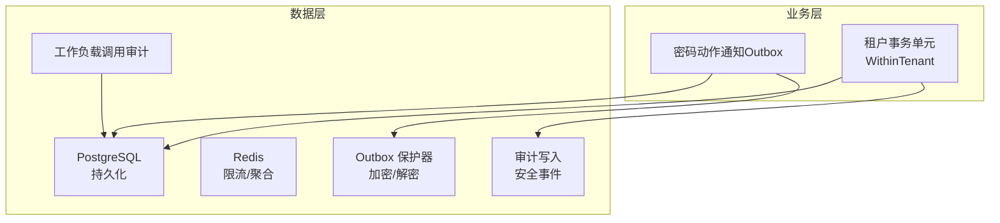
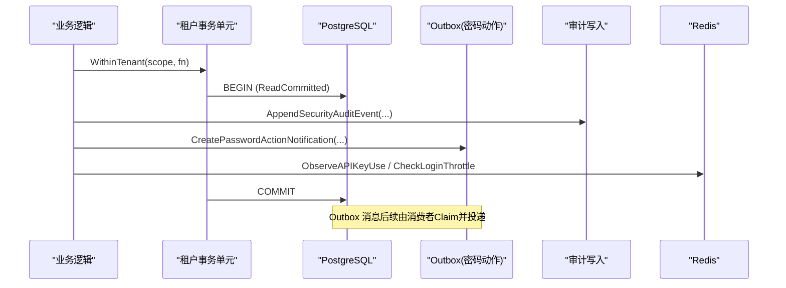
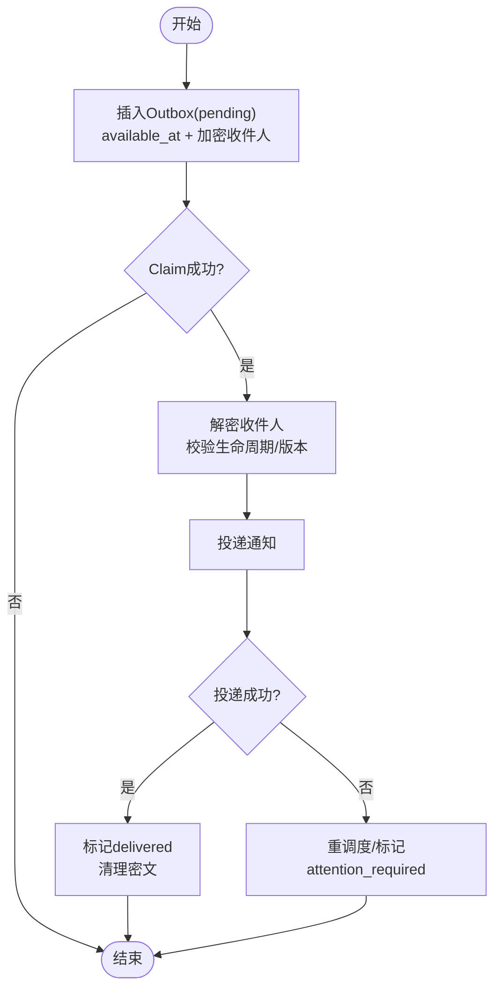
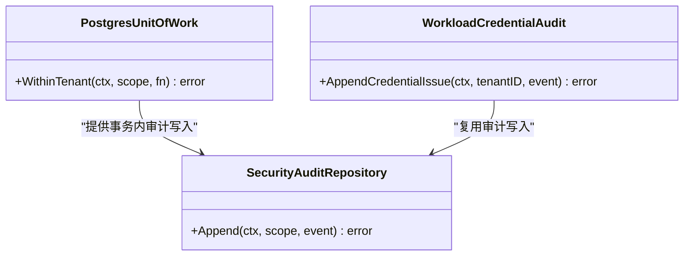
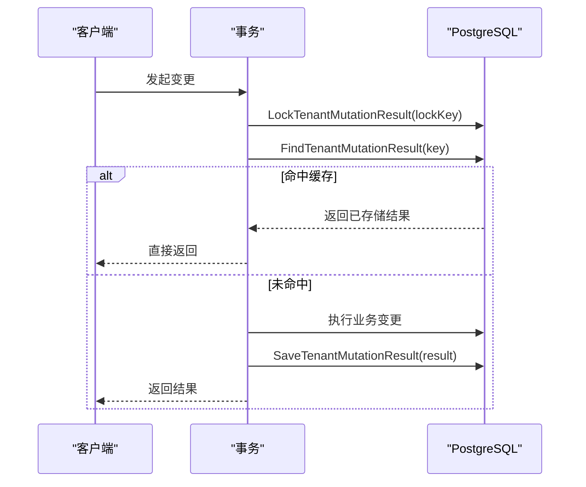
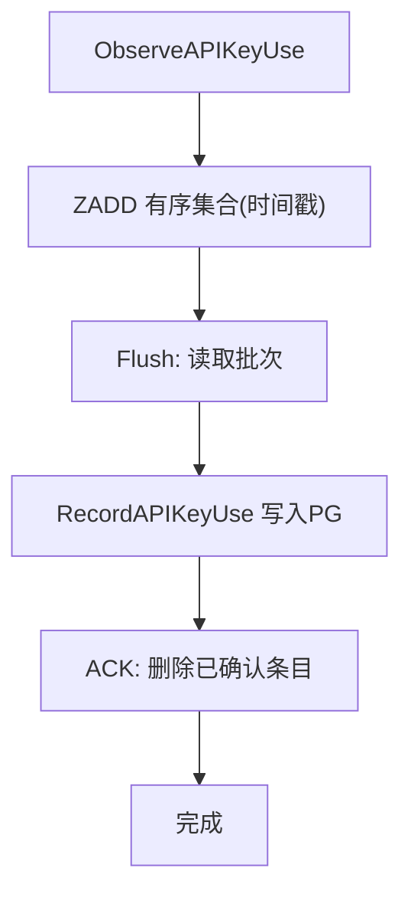
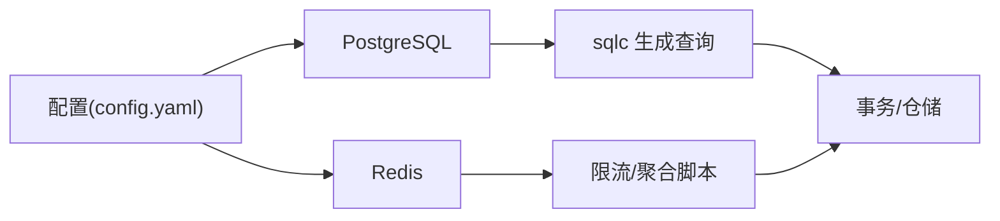

# 数据操作与优化

<cite>
**本文引用的文件**
- [outbox_protector.go](file://internal/data/outbox_protector.go)
- [password_action_notification_outbox.go](file://internal/data/password_action_notification_outbox.go)
- [system_clock.go](file://internal/data/system_clock.go)
- [workload_invocation_audit.go](file://internal/data/workload_invocation_audit.go)
- [postgres.go](file://internal/data/postgres.go)
- [operation_registry.go](file://internal/data/operation_registry.go)
- [idempotency.go](file://internal/data/idempotency.go)
- [api_key_usage_redis.go](file://internal/data/api_key_usage_redis.go)
- [login_throttle_redis.go](file://internal/data/login_throttle_redis.go)
- [persistence.sql](file://internal/data/queries/persistence.sql)
- [202609100005_encrypted_notification_outbox.sql](file://migrations/202609100005_encrypted_notification_outbox.sql)
- [202609040001_persistence_foundation.sql](file://migrations/202609040001_persistence_foundation.sql)
- [config.yaml](file://configs/config.yaml)
</cite>

## 目录
1. [简介](#简介)
2. [项目结构](#项目结构)
3. [核心组件](#核心组件)
4. [架构总览](#架构总览)
5. [详细组件分析](#详细组件分析)
6. [依赖关系分析](#依赖关系分析)
7. [性能考虑](#性能考虑)
8. [故障排查指南](#故障排查指南)
9. [结论](#结论)
10. [附录](#附录)

## 简介
本文件聚焦 ANI IAM 的数据操作与优化，覆盖以下关键主题：
- Outbox 模式实现（加密通知外发、重试与幂等）
- 操作审计日志（安全事件追加、调用方上下文绑定）
- 系统时间同步（统一 UTC 时钟）
- 高效查询策略（索引设计、查询计划分析与监控）
- 批量操作、事务处理与并发控制最佳实践
- 慢查询诊断与优化方法
- 数据备份、恢复与迁移策略
- 生产环境运维注意事项

## 项目结构
数据层位于 internal/data，包含数据库访问、Redis 缓存、Outbox、限流、审计、工作负载调用审计等。SQL 通过 sqlc 生成 Go 代码，迁移脚本位于 migrations，配置在 configs/config.yaml。

图表来源
- [postgres.go:27-59](file://internal/data/postgres.go#L27-L59)
- [password_action_notification_outbox.go:25-82](file://internal/data/password_action_notification_outbox.go#L25-L82)
- [outbox_protector.go:73-96](file://internal/data/outbox_protector.go#L73-L96)
- [workload_invocation_audit.go:17-31](file://internal/data/workload_invocation_audit.go#L17-L31)

章节来源
- [postgres.go:27-59](file://internal/data/postgres.go#L27-L59)
- [config.yaml:22-32](file://configs/config.yaml#L22-L32)

## 核心组件
- 租户事务单元：以 ReadCommitted 隔离级别开启事务，封装成员关系与安全审计的仓库访问，保证同一租户内操作的原子性与一致性。
- Outbox（密码动作通知）：将通知消息持久化为“待发送”状态，支持抢占式领取、重试、交付标记与关注标记；敏感字段使用 AEAD 加密存储。
- 审计日志：安全事件以追加方式写入审计表，支持匿名与会话上下文，确保不可变与可追溯。
- 系统时钟：统一返回 UTC 时间，避免时区不一致导致的时序问题。
- Redis 能力：登录限流、刷新令牌限流、API Key 使用量聚合与落库。
- 幂等性：基于唯一键与行级锁的变更结果缓存，防止重复提交。

章节来源
- [postgres.go:27-59](file://internal/data/postgres.go#L27-L59)
- [password_action_notification_outbox.go:25-155](file://internal/data/password_action_notification_outbox.go#L25-L155)
- [outbox_protector.go:17-96](file://internal/data/outbox_protector.go#L17-L96)
- [workload_invocation_audit.go:17-31](file://internal/data/workload_invocation_audit.go#L17-L31)
- [system_clock.go:9-17](file://internal/data/system_clock.go#L9-L17)
- [api_key_usage_redis.go:63-123](file://internal/data/api_key_usage_redis.go#L63-L123)
- [login_throttle_redis.go:122-204](file://internal/data/login_throttle_redis.go#L122-L204)
- [idempotency.go:15-58](file://internal/data/idempotency.go#L15-L58)

## 架构总览
下图展示从业务侧到数据层的典型流程：事务边界、Outbox 写入、审计追加、Redis 限流与聚合、以及加密保护。

图表来源
- [postgres.go:27-59](file://internal/data/postgres.go#L27-L59)
- [persistence.sql:571-613](file://internal/data/queries/persistence.sql#L571-L613)
- [persistence.sql:372-409](file://internal/data/queries/persistence.sql#L372-L409)
- [api_key_usage_redis.go:63-84](file://internal/data/api_key_usage_redis.go#L63-L84)
- [login_throttle_redis.go:122-147](file://internal/data/login_throttle_redis.go#L122-L147)

## 详细组件分析

### Outbox 模式（密码动作通知）
- 写入阶段：在事务中插入 notification_outbox 记录，状态为 pending，附带可用时间与加密后的收件人信息。
- 领取阶段：消费者按 available_at 与 lease 过期条件抢占一条记录，状态改为 claimed，增加尝试次数。
- 处理阶段：根据意图解析目的地址（解密），校验生命周期与版本，执行投递。
- 完成阶段：成功则标记 delivered 并清理密文；失败或需人工介入则 reschedule 或 attention_required。

图表来源
- [password_action_notification_outbox.go:25-82](file://internal/data/password_action_notification_outbox.go#L25-L82)
- [password_action_notification_outbox.go:84-155](file://internal/data/password_action_notification_outbox.go#L84-L155)
- [outbox_protector.go:73-96](file://internal/data/outbox_protector.go#L73-L96)
- [persistence.sql:571-649](file://internal/data/queries/persistence.sql#L571-L649)
- [202609100005_encrypted_notification_outbox.sql:1-19](file://migrations/202609100005_encrypted_notification_outbox.sql#L1-L19)

章节来源
- [password_action_notification_outbox.go:25-155](file://internal/data/password_action_notification_outbox.go#L25-L155)
- [outbox_protector.go:17-96](file://internal/data/outbox_protector.go#L17-L96)
- [persistence.sql:571-649](file://internal/data/queries/persistence.sql#L571-L649)
- [202609100005_encrypted_notification_outbox.sql:1-19](file://migrations/202609100005_encrypted_notification_outbox.sql#L1-L19)

### 操作审计日志
- 安全事件以追加方式写入 iam_audit_events，包含租户边界、动作、目标、结果、请求与决策追踪等。
- 工作负载调用审计会校验直接调用者身份与边界，仅允许特定 action 与 boundary 组合，确保可信来源。

图表来源
- [postgres.go:145-182](file://internal/data/postgres.go#L145-L182)
- [workload_invocation_audit.go:17-31](file://internal/data/workload_invocation_audit.go#L17-L31)
- [persistence.sql:372-409](file://internal/data/queries/persistence.sql#L372-L409)

章节来源
- [postgres.go:145-182](file://internal/data/postgres.go#L145-L182)
- [workload_invocation_audit.go:17-31](file://internal/data/workload_invocation_audit.go#L17-L31)
- [persistence.sql:372-409](file://internal/data/queries/persistence.sql#L372-L409)

### 系统时间同步
- 统一通过 systemClock.Now() 获取 UTC 时间，避免本地时区差异导致的时间不一致问题。
- 所有 timestamptz 写入均转换为 UTC，确保排序与比较一致。

章节来源
- [system_clock.go:9-17](file://internal/data/system_clock.go#L9-L17)
- [postgres.go:234-236](file://internal/data/postgres.go#L234-L236)

### 幂等性与并发控制
- 幂等：通过 LockMutationResult 与 Find/Save 接口，结合唯一键与意图摘要，确保相同请求只产生一次副作用。
- 并发：使用 FOR UPDATE SKIP LOCKED 与 advisory lock 避免争用与死锁；版本号乐观锁防止覆盖写。

图表来源
- [idempotency.go:15-58](file://internal/data/idempotency.go#L15-L58)
- [persistence.sql:503-517](file://internal/data/queries/persistence.sql#L503-L517)

章节来源
- [idempotency.go:15-58](file://internal/data/idempotency.go#L15-L58)
- [persistence.sql:503-517](file://internal/data/queries/persistence.sql#L503-L517)

### Redis 限流与用量聚合
- 登录限流：按账号与IP维度计数，超过阈值返回重试延迟；失败后指数退避直至窗口上限。
- 刷新令牌限流：按令牌摘要限制单位时间内刷新次数。
- API Key 用量：高频观察写入有序集合，周期性批量 flush 至 PostgreSQL，失败不丢数据。

图表来源
- [api_key_usage_redis.go:33-47](file://internal/data/api_key_usage_redis.go#L33-L47)
- [api_key_usage_redis.go:63-123](file://internal/data/api_key_usage_redis.go#L63-L123)

章节来源
- [login_throttle_redis.go:34-104](file://internal/data/login_throttle_redis.go#L34-L104)
- [login_throttle_redis.go:122-204](file://internal/data/login_throttle_redis.go#L122-L204)
- [api_key_usage_redis.go:63-123](file://internal/data/api_key_usage_redis.go#L63-L123)

### 权限与操作注册
- 目标操作策略由工作负载注册表与内置策略合并生成，支持版本校验与冲突检测。
- 权限目录用于快速判断某权限是否被声明。

章节来源
- [operation_registry.go:26-98](file://internal/data/operation_registry.go#L26-L98)
- [operation_registry.go:104-153](file://internal/data/operation_registry.go#L104-L153)

## 依赖关系分析
- 数据层对 PostgreSQL 与 Redis 的强依赖，通过连接池与脚本原子操作保障一致性。
- Outbox 与审计在事务内写入，确保业务与审计的一致性。
- 配置项集中管理数据库、Redis、OIDC、通知服务与密钥文件路径。

图表来源
- [config.yaml:22-32](file://configs/config.yaml#L22-L32)
- [postgres.go:27-59](file://internal/data/postgres.go#L27-L59)
- [api_key_usage_redis.go:33-47](file://internal/data/api_key_usage_redis.go#L33-L47)

章节来源
- [config.yaml:22-32](file://configs/config.yaml#L22-L32)
- [postgres.go:27-59](file://internal/data/postgres.go#L27-L59)

## 性能考虑
- 索引设计
  - 审计表：按 tenant_id、recorded_at DESC、event_id 建立复合索引，加速按租户与时间的范围查询与分页。
  - 成员关系：tenant_memberships 上针对活跃成员的过滤索引与按状态+ID 的扫描索引。
  - 角色绑定：按 membership_id 的索引提升关联查询效率。
- 查询优化
  - 使用 FOR UPDATE SKIP LOCKED 进行无锁竞争领取，减少热点阻塞。
  - 使用 advisory lock 串行化关键路径（如密码动作主键）。
  - 严格参数化与类型转换，避免隐式转换导致索引失效。
- 批处理与背压
  - API Key 用量采用 Redis 有序集合缓冲，批量落库，降低写放大。
  - Outbox 消费端按 lease 与 available_at 分批处理，避免风暴。
- 监控建议
  - 采集 PG 慢查询日志、锁等待、连接池使用率。
  - 监控 Redis 脚本执行耗时与命中率。
  - 跟踪 Outbox 队列长度、Claim 成功率、重试次数。

章节来源
- [202609040001_persistence_foundation.sql:100-148](file://migrations/202609040001_persistence_foundation.sql#L100-L148)
- [persistence.sql:581-613](file://internal/data/queries/persistence.sql#L581-L613)
- [persistence.sql:503-517](file://internal/data/queries/persistence.sql#L503-L517)
- [api_key_usage_redis.go:86-123](file://internal/data/api_key_usage_redis.go#L86-L123)

## 故障排查指南
- Outbox 解密失败
  - 现象：Claim 后无法解密收件人，抛出持久化不可用错误。
  - 排查：检查 outbox_keys.json 的 active 版本与 keys 列表，确认 key 长度为 32 字节且版本匹配；核对 AAD 构造参数（version、id、operation、principal）。
  - 参考路径：[outbox_protector.go:23-46](file://internal/data/outbox_protector.go#L23-L46)、[outbox_protector.go:73-96](file://internal/data/outbox_protector.go#L73-L96)
- Outbox 版本冲突
  - 现象：Reschedule/Delivered/AttentionRequired 更新返回版本冲突。
  - 排查：确认 expected_version 与当前版本一致；检查并发 Claim 与处理顺序。
  - 参考路径：[password_action_notification_outbox.go:84-155](file://internal/data/password_action_notification_outbox.go#L84-L155)
- 审计写入失败
  - 现象：AppendSecurityAuditEvent 报错。
  - 排查：检查 PG 权限、约束（如 authentication_method/boundary/result 枚举）、唯一键冲突。
  - 参考路径：[postgres.go:145-182](file://internal/data/postgres.go#L145-L182)、[persistence.sql:372-409](file://internal/data/queries/persistence.sql#L372-L409)
- 限流误判
  - 现象：登录或刷新令牌频繁被限流。
  - 排查：检查 Redis 命名空间、窗口与基数配置；验证脚本返回值与 TTL；确认 key 类型正确。
  - 参考路径：[login_throttle_redis.go:122-204](file://internal/data/login_throttle_redis.go#L122-L204)
- API Key 用量堆积
  - 现象：Flush 进度缓慢或失败。
  - 排查：检查 Redis 有序集合大小与 PG RecordAPIKeyUse 性能；确认 batch size 合理；失败不会回滚 Redis 条目，下次继续。
  - 参考路径：[api_key_usage_redis.go:86-123](file://internal/data/api_key_usage_redis.go#L86-L123)

章节来源
- [outbox_protector.go:23-96](file://internal/data/outbox_protector.go#L23-L96)
- [password_action_notification_outbox.go:84-155](file://internal/data/password_action_notification_outbox.go#L84-L155)
- [postgres.go:145-182](file://internal/data/postgres.go#L145-L182)
- [login_throttle_redis.go:122-204](file://internal/data/login_throttle_redis.go#L122-L204)
- [api_key_usage_redis.go:86-123](file://internal/data/api_key_usage_redis.go#L86-L123)

## 结论
ANI IAM 的数据层通过事务化的 Outbox、严格的审计追加、统一的系统时钟与 Redis 高吞吐辅助能力，实现了高可靠、可扩展且可观测的数据操作体系。配合合理的索引设计与批处理策略，可在生产环境下稳定支撑认证、授权与工作负载调用场景。建议在上线前完善监控告警与演练预案，持续优化慢查询与资源使用。

## 附录

### 高效查询策略与索引优化清单
- 审计事件：按 tenant_id、recorded_at DESC、event_id 复合索引，便于按租户与时间范围检索。
- 成员关系：
  - 唯一部分索引：(tenant_id, principal_id) WHERE status <> 'removed'，保证每个租户下同一主体仅一个活跃成员。
  - 扫描索引：(tenant_id, status, id)，支持按状态分页。
- 角色绑定：(tenant_id, membership_id, id) 提升按成员查找角色的效率。
- Outbox 领取：使用 available_at 与 claimed_at 条件，配合 SKIP LOCKED 提高并发领取效率。

章节来源
- [202609040001_persistence_foundation.sql:36-99](file://migrations/202609040001_persistence_foundation.sql#L36-L99)
- [persistence.sql:581-613](file://internal/data/queries/persistence.sql#L581-L613)

### 慢查询诊断与优化步骤
- 启用并收集 PG 慢查询日志，定位 top N 慢语句。
- 使用 EXPLAIN ANALYZE 分析执行计划，关注全表扫描、临时表与排序。
- 调整索引或改写 SQL（例如将函数包裹列改为直接列比较）。
- 对热点表引入分区或归档策略（如审计表按时间分片）。
- 对 Outbox 与审计写入进行批量化与异步化，降低主路径延迟。

[本节为通用指导，无需具体文件引用]

### 数据备份、恢复与迁移策略
- 备份
  - 定期全量与增量备份 PG 与 Redis（RDB/AOF 或云托管方案）。
  - 备份 OIDC 密钥、Outbox 密钥文件与证书。
- 恢复
  - 先恢复 PG，再恢复 Redis 快照；校验数据一致性后再启动服务。
  - 若 Outbox 密文版本升级，需按迁移要求准备空表或执行授权转换。
- 迁移
  - 遵循 migrations 顺序执行，确保 schema 与数据兼容。
  - 对涉及密文字段的迁移（如 notification_outbox）需严格遵守约束与前置条件。

章节来源
- [202609100005_encrypted_notification_outbox.sql:1-19](file://migrations/202609100005_encrypted_notification_outbox.sql#L1-L19)
- [202609040001_persistence_foundation.sql:1-148](file://migrations/202609040001_persistence_foundation.sql#L1-L148)

### 生产环境运维注意事项
- 连接与超时
  - 合理设置 PG 连接池大小与超时；Redis 读写超时与重试策略。
  - 参考配置：[config.yaml:22-32](file://configs/config.yaml#L22-L32)
- 密钥与证书
  - Outbox 密钥文件、OIDC 客户端密钥、TLS 证书与 CA 文件需安全存储与轮换。
  - 参考配置：[config.yaml:33-47](file://configs/config.yaml#L33-L47)
- 限流与背压
  - 登录限流窗口与基数需根据业务峰值调优；刷新令牌限流避免风暴。
  - 参考实现：[login_throttle_redis.go:106-120](file://internal/data/login_throttle_redis.go#L106-L120)
- 监控与告警
  - 监控 Outbox 队列长度、Claim 成功率、重试次数、审计写入延迟。
  - 监控 Redis 脚本耗时、命中率与内存使用。
  - 监控 PG 慢查询、锁等待与连接数。

章节来源
- [config.yaml:22-47](file://configs/config.yaml#L22-L47)
- [login_throttle_redis.go:106-120](file://internal/data/login_throttle_redis.go#L106-L120)