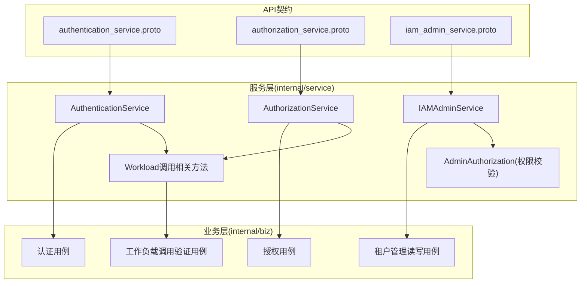
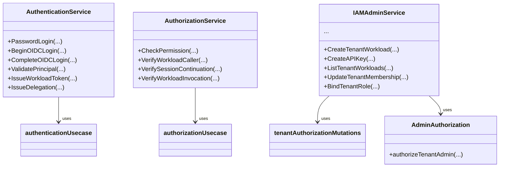
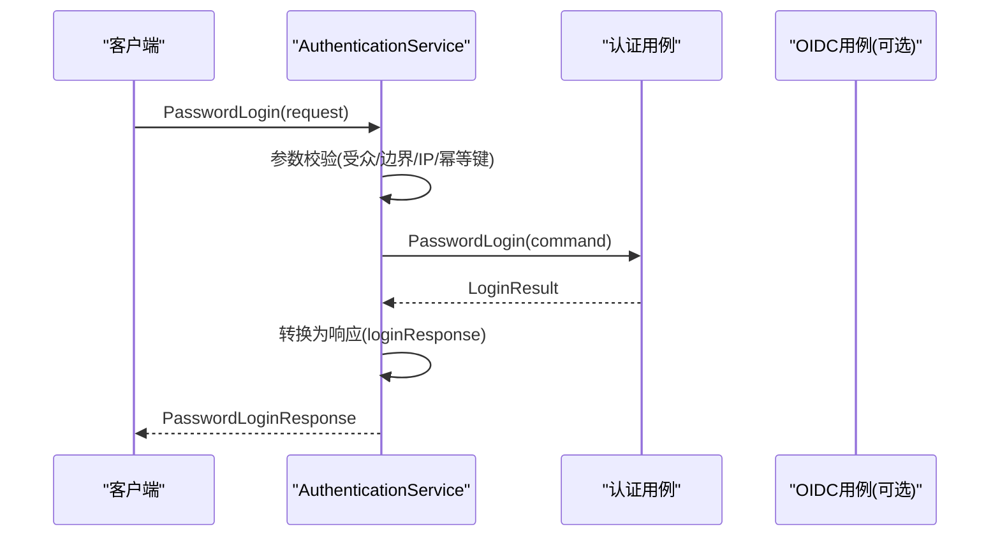
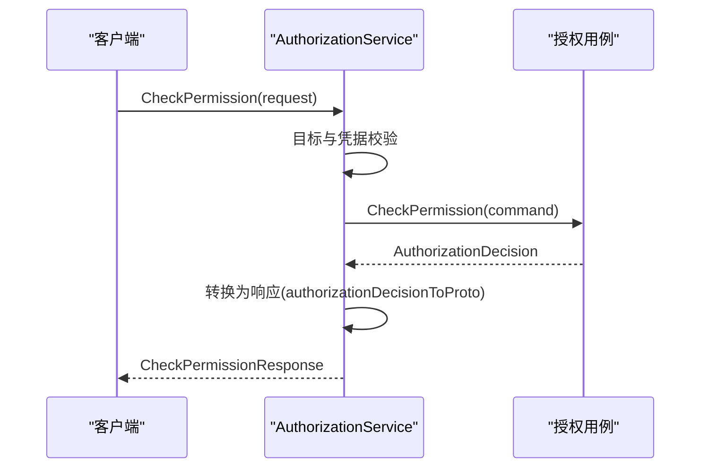
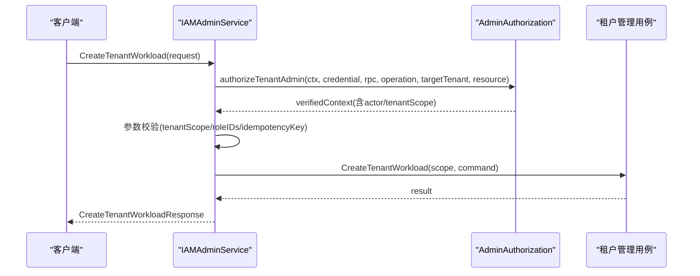
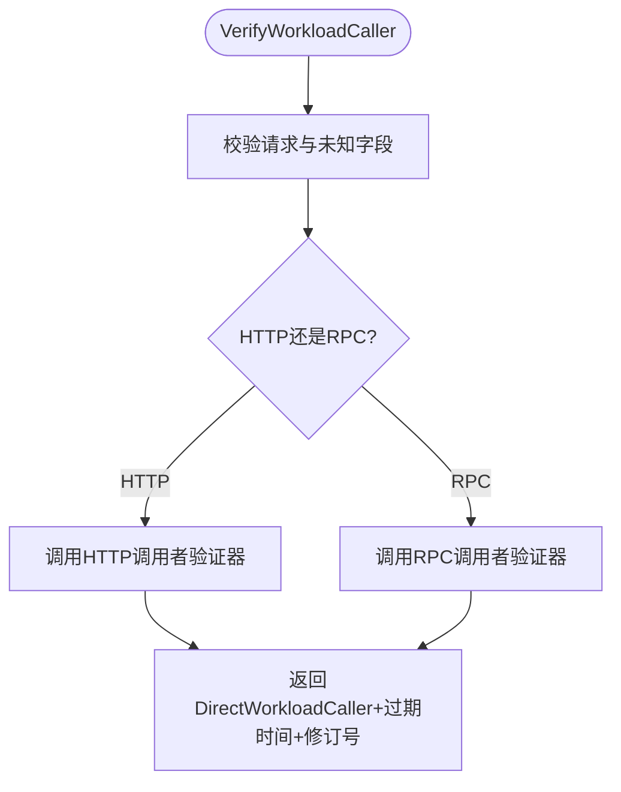
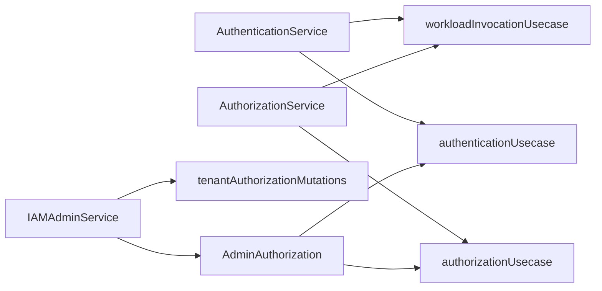

# 服务层(Service Layer)

<cite>
**本文引用的文件**
- [authentication.go](file://internal/service/authentication.go)
- [authorization.go](file://internal/service/authorization.go)
- [iam_admin.go](file://internal/service/iam_admin.go)
- [admin_authorization.go](file://internal/service/admin_authorization.go)
- [workload_caller.go](file://internal/service/workload_caller.go)
- [workload_invocation.go](file://internal/service/workload_invocation.go)
- [authentication_service.proto](file://api/iam/v1/authentication_service.proto)
- [authorization_service.proto](file://api/iam/v1/authorization_service.proto)
- [iam_admin_service.proto](file://api/iam/v1/iam_admin_service.proto)
- [authentication_test.go](file://internal/service/authentication_test.go)
- [authorization_test.go](file://internal/service/authorization_test.go)
- [iam_admin_test.go](file://internal/service/iam_admin_test.go)
</cite>

## 目录
1. [简介](#简介)
2. [项目结构](#项目结构)
3. [核心组件](#核心组件)
4. [架构总览](#架构总览)
5. [详细组件分析](#详细组件分析)
6. [依赖关系分析](#依赖关系分析)
7. [性能与并发](#性能与并发)
8. [故障排查指南](#故障排查指南)
9. [结论](#结论)
10. [附录：测试策略与Mock](#附录测试策略与mock)

## 简介
本文件面向ANI IAM项目的服务层，聚焦gRPC服务接口的实现模式与落地细节。围绕 AuthenticationService、AuthorizationService 和 IAMAdminService 三个服务，说明其如何接收客户端请求、进行参数校验、调用业务层用例（Use Case）并返回响应；阐述错误处理机制、中间件集成方式、上下文传递、并发与超时控制，以及测试策略与Mock对象的使用。

## 项目结构
服务层位于 internal/service，负责将 gRPC 传输协议映射到内部业务用例，完成参数校验、领域模型转换、错误映射与响应组装。对外契约定义在 api/iam/v1/*.proto。

图表来源
- [authentication_service.proto:11-33](file://api/iam/v1/authentication_service.proto#L11-L33)
- [authorization_service.proto:10-16](file://api/iam/v1/authorization_service.proto#L10-L16)
- [iam_admin_service.proto:10-73](file://api/iam/v1/iam_admin_service.proto#L10-L73)
- [authentication.go:91-106](file://internal/service/authentication.go#L91-L106)
- [authorization.go:17-25](file://internal/service/authorization.go#L17-L25)
- [iam_admin.go:39-64](file://internal/service/iam_admin.go#L39-L64)
- [admin_authorization.go:18-28](file://internal/service/admin_authorization.go#L18-L28)
- [workload_caller.go:18-49](file://internal/service/workload_caller.go#L18-L49)
- [workload_invocation.go:14-30](file://internal/service/workload_invocation.go#L14-L30)

章节来源
- [authentication_service.proto:11-33](file://api/iam/v1/authentication_service.proto#L11-L33)
- [authorization_service.proto:10-16](file://api/iam/v1/authorization_service.proto#L10-L16)
- [iam_admin_service.proto:10-73](file://api/iam/v1/iam_admin_service.proto#L10-L73)

## 核心组件
- AuthenticationService：负责人事会话、OIDC登录/绑定、密码操作、会话刷新/登出、租户切换、主体校验与工作负载令牌签发等。
- AuthorizationService：提供统一的鉴权决策入口，支持工作负载调用者校验、会话延续校验与通用权限检查。
- IAMAdminService：租户级管理员能力集合（成员、角色、工作负载、API Key、审计等），通过 AdminAuthorization 复用认证与授权用例进行强校验。

章节来源
- [authentication.go:91-106](file://internal/service/authentication.go#L91-L106)
- [authorization.go:17-25](file://internal/service/authorization.go#L17-L25)
- [iam_admin.go:39-64](file://internal/service/iam_admin.go#L39-L64)

## 架构总览
服务层采用“接口化用例”的依赖注入模式：每个服务持有对业务用例接口的引用，构造时注入具体实现。这样既便于单元测试Mock，也便于在不同部署环境替换实现。

图表来源
- [authentication.go:22-37](file://internal/service/authentication.go#L22-L37)
- [authorization.go:13-21](file://internal/service/authorization.go#L13-L21)
- [iam_admin.go:25-52](file://internal/service/iam_admin.go#L25-L52)
- [admin_authorization.go:14-28](file://internal/service/admin_authorization.go#L14-L28)

## 详细组件分析

### AuthenticationService
职责边界
- 认证与会话：密码登录、OIDC登录/身份绑定、会话刷新/登出、租户切换。
- 主体校验：ValidatePrincipal 用于外部系统快速校验凭据并获取可信主体上下文。
- 工作负载令牌：IssueWorkloadToken、IssueDelegation 用于工作负载间短生命周期凭证发放。

典型流程（以 PasswordLogin 为例）

图表来源
- [authentication.go:150-194](file://internal/service/authentication.go#L150-L194)
- [authentication.go:368-414](file://internal/service/authentication.go#L368-L414)

关键实现要点
- 参数校验：严格校验 audience、boundary、source_ip、idempotency_key 等字段，非法即返回 INVALID_ARGUMENT。
- 上下文透传：从入站元数据提取 x-request-id/x-correlation-id，作为审计标识传入用例。
- 错误映射：统一通过 mapIAMError 将领域错误映射为带 ErrorInfo 的 gRPC 状态码，包含 reason、domain、metadata。
- 依赖可用性：当 OIDC 未注入时直接返回 Unavailable。
- 工作负载令牌：通过 workload 用例签发短期不可续期令牌或委托令牌。

章节来源
- [authentication.go:108-148](file://internal/service/authentication.go#L108-L148)
- [authentication.go:150-194](file://internal/service/authentication.go#L150-L194)
- [authentication.go:256-316](file://internal/service/authentication.go#L256-L316)
- [authentication.go:318-366](file://internal/service/authentication.go#L318-L366)
- [authentication.go:463-759](file://internal/service/authentication.go#L463-L759)
- [workload_invocation.go:21-66](file://internal/service/workload_invocation.go#L21-L66)

### AuthorizationService
职责边界
- 单一失败关闭的鉴权决策点：CheckPermission。
- 工作负载调用链校验：VerifyWorkloadCaller、VerifyWorkloadInvocation、VerifySessionContinuation。

典型流程（以 CheckPermission 为例）

图表来源
- [authorization.go:27-67](file://internal/service/authorization.go#L27-L67)
- [authorization.go:69-96](file://internal/service/authorization.go#L69-L96)

关键实现要点
- 目标解析：target.tenant_id 必须合法；平台边界场景下不强制租户ID。
- 凭据类型识别：自动区分 bearer 与 API key（前缀 ani_）。
- 审计上下文：同样从元数据提取 request/correlation ID 并透传。
- 错误映射：将未注册操作、策略版本不匹配、依赖不可用、超时等映射为稳定错误信息。

章节来源
- [authorization.go:27-67](file://internal/service/authorization.go#L27-L67)
- [authorization.go:69-96](file://internal/service/authorization.go#L69-L96)

### IAMAdminService
职责边界
- 租户级管理员能力：成员、角色、工作负载、API Key、邀请、审计查询等。
- 安全前置：所有写操作均先经 authorizeTenantAdmin 完成认证与授权，再进入具体用例。

典型流程（以 CreateTenantWorkload 为例）

图表来源
- [iam_admin.go:66-106](file://internal/service/iam_admin.go#L66-L106)
- [admin_authorization.go:37-107](file://internal/service/admin_authorization.go#L37-L107)

关键实现要点
- 强校验：仅接受来自受信任直调者的请求，且必须携带有效凭据；校验通过后生成 actor 并写入 context。
- 范围隔离：通过 trustedTenantScope 确保后续读取/写入仅在已验证租户范围内。
- 分页与限流：统一使用 tenantAdminPage 限制 page_size 并解析 cursor。
- 幂等性：所有写操作要求 idempotency_key，并在错误中携带 operation_id。
- 未实现保护：未启用切片的方法返回 Unimplemented，避免误暴露。

章节来源
- [iam_admin.go:66-106](file://internal/service/iam_admin.go#L66-L106)
- [iam_admin.go:108-148](file://internal/service/iam_admin.go#L108-L148)
- [iam_admin.go:174-207](file://internal/service/iam_admin.go#L174-L207)
- [iam_admin.go:242-283](file://internal/service/iam_admin.go#L242-L283)
- [iam_admin.go:285-315](file://internal/service/iam_admin.go#L285-L315)
- [iam_admin.go:317-323](file://internal/service/iam_admin.go#L317-L323)
- [iam_admin.go:325-408](file://internal/service/iam_admin.go#L325-L408)
- [iam_admin.go:410-442](file://internal/service/iam_admin.go#L410-L442)
- [iam_admin.go:444-520](file://internal/service/iam_admin.go#L444-L520)
- [iam_admin.go:522-564](file://internal/service/iam_admin.go#L522-L564)
- [iam_admin.go:566-642](file://internal/service/iam_admin.go#L566-L642)
- [admin_authorization.go:37-107](file://internal/service/admin_authorization.go#L37-L107)

### 工作负载调用相关方法
- VerifyWorkloadCaller：校验工作负载调用者身份与目标，支持HTTP/RPC两种路径。
- VerifyWorkloadInvocation：基于工作负载令牌与绑定信息验证一次调用，返回调用者与主体上下文。
- VerifySessionContinuation：校验会话延续令牌，维持跨跳调用链的可追踪性。

图表来源
- [workload_caller.go:18-49](file://internal/service/workload_caller.go#L18-L49)
- [workload_invocation.go:68-98](file://internal/service/workload_invocation.go#L68-L98)
- [workload_invocation.go:142-160](file://internal/service/workload_invocation.go#L142-L160)

章节来源
- [workload_caller.go:18-49](file://internal/service/workload_caller.go#L18-L49)
- [workload_invocation.go:32-66](file://internal/service/workload_invocation.go#L32-L66)
- [workload_invocation.go:68-98](file://internal/service/workload_invocation.go#L68-L98)
- [workload_invocation.go:142-160](file://internal/service/workload_invocation.go#L142-L160)

## 依赖关系分析
- 服务层对业务层采用接口解耦：authenticationUsecase、authorizationUsecase、tenantAuthorizationMutations、workloadInvocationUsecase 等。
- AdminAuthorization 复用 AuthenticationService 的 ValidatePrincipal 与 AuthorizationService 的 CheckPermission，形成“认证-授权”闭环。
- 错误映射集中化：mapIAMError 与 invocationStatus 将领域错误统一转为稳定的 gRPC 错误信息，便于上游网关与客户端一致处理。

图表来源
- [authentication.go:22-37](file://internal/service/authentication.go#L22-L37)
- [authorization.go:13-21](file://internal/service/authorization.go#L13-L21)
- [iam_admin.go:25-52](file://internal/service/iam_admin.go#L25-L52)
- [admin_authorization.go:14-28](file://internal/service/admin_authorization.go#L14-L28)
- [workload_invocation.go:14-30](file://internal/service/workload_invocation.go#L14-L30)

章节来源
- [authentication.go:22-37](file://internal/service/authentication.go#L22-L37)
- [authorization.go:13-21](file://internal/service/authorization.go#L13-L21)
- [iam_admin.go:25-52](file://internal/service/iam_admin.go#L25-L52)
- [admin_authorization.go:14-28](file://internal/service/admin_authorization.go#L14-L28)
- [workload_invocation.go:14-30](file://internal/service/workload_invocation.go#L14-L30)

## 性能与并发
- 无锁服务实例：服务对象本身无共享可变状态，方法调用是纯函数式处理，天然支持高并发。
- 超时控制：通过 context.DeadlineExceeded 捕获超时，统一映射为 IAM_TIMEOUT；工作负载调用链路亦将取消/超时映射为稳定错误码。
- 幂等性：大量写操作要求 idempotency_key，由业务层保证重复提交的安全性。
- 分页限制：租户管理列表统一限制 page_size，防止大结果集导致资源耗尽。

章节来源
- [authentication.go:512-516](file://internal/service/authentication.go#L512-L516)
- [workload_invocation.go:121-140](file://internal/service/workload_invocation.go#L121-L140)
- [iam_admin.go:593-613](file://internal/service/iam_admin.go#L593-L613)

## 故障排查指南
常见错误与定位建议
- 参数无效（INVALID_ARGUMENT）：检查 audience、boundary、tenant_id、policy_revision、page.cursor 等字段是否合法。
- 凭据无效（CREDENTIAL_INVALID）：确认凭据类型（bearer/api_key/oidc/password_action）与格式，注意前端是否传递了空值。
- 权限不足（PERMISSION_DENIED）：检查 IAMAdminService 的 authorizeTenantAdmin 是否通过，确认请求来自受信任直调者且具备所需权限。
- 依赖不可用（IAM_UNAVAILABLE/TENANT_IAM_NOT_READY）：关注下游依赖（数据库、Redis、OIDC）健康状态与重试策略。
- 超时（IAM_TIMEOUT）：检查上下游调用链的超时配置与慢查询。
- 策略版本不匹配（AUTHZ_POLICY_MISMATCH）：客户端需同步最新 policy_revision 后再发起鉴权。

章节来源
- [authentication.go:476-759](file://internal/service/authentication.go#L476-L759)
- [workload_invocation.go:121-140](file://internal/service/workload_invocation.go#L121-L140)
- [iam_admin.go:615-642](file://internal/service/iam_admin.go#L615-L642)

## 结论
服务层以清晰的职责划分与接口化依赖，实现了可测试、可扩展、易维护的gRPC服务实现。通过统一的参数校验、错误映射与上下文传递，保证了跨域调用的一致性与可观测性。IAMAdminService 借助 AdminAuthorization 强化了管理员操作的认证与授权强度，确保敏感操作的安全边界。

## 附录：测试策略与Mock
- 单元测试覆盖：针对各服务方法，使用记录型Mock用例（如 recordingAuthenticationUsecase、recordingAuthorizationUsecase、recordingTenantAuthorizationMutations）验证请求映射、响应结构与错误映射。
- 错误契约测试：断言错误码、reason、domain 与 metadata 符合冻结契约，确保客户端稳定消费。
- 上下文与元数据：验证 x-request-id/x-correlation-id 的提取与透传，以及伪造头被拒绝的行为。
- 未实现保护：验证未启用切片的方法返回 Unimplemented，避免功能泄露。

章节来源
- [authentication_test.go:24-85](file://internal/service/authentication_test.go#L24-L85)
- [authentication_test.go:87-149](file://internal/service/authentication_test.go#L87-L149)
- [authorization_test.go:20-81](file://internal/service/authorization_test.go#L20-L81)
- [authorization_test.go:83-164](file://internal/service/authorization_test.go#L83-L164)
- [iam_admin_test.go:17-60](file://internal/service/iam_admin_test.go#L17-L60)
- [iam_admin_test.go:62-111](file://internal/service/iam_admin_test.go#L62-L111)
- [iam_admin_test.go:113-200](file://internal/service/iam_admin_test.go#L113-L200)