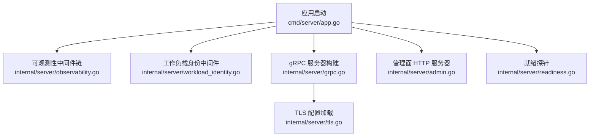
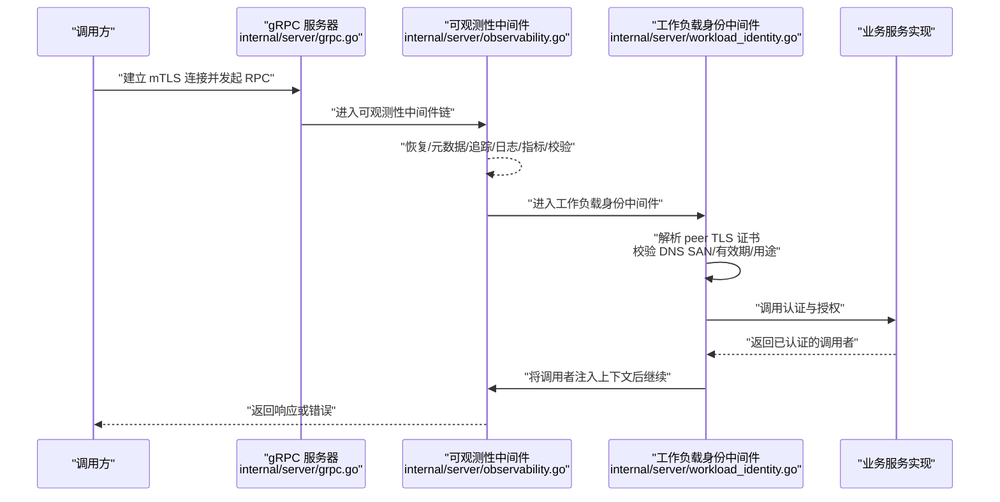
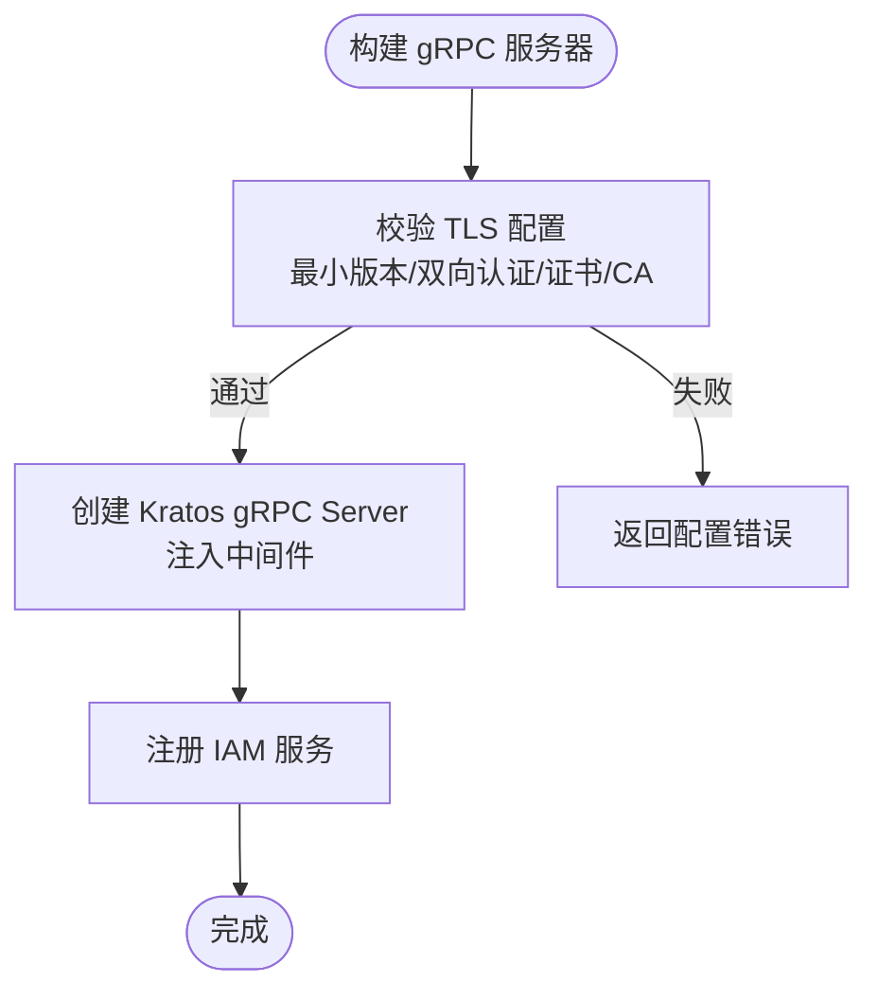
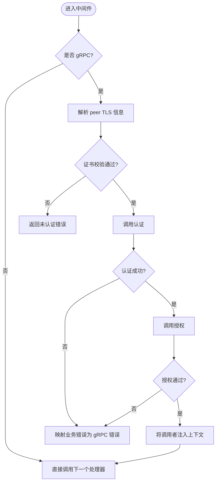
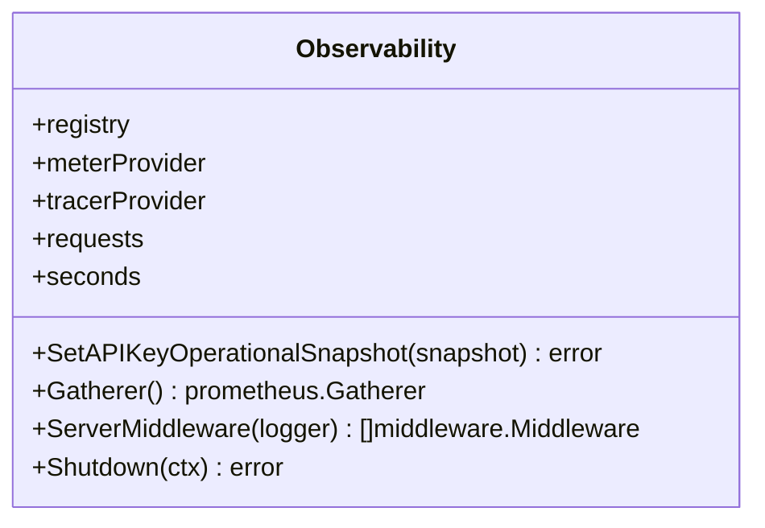
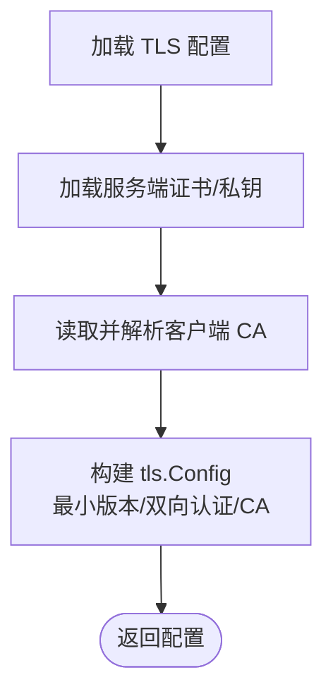
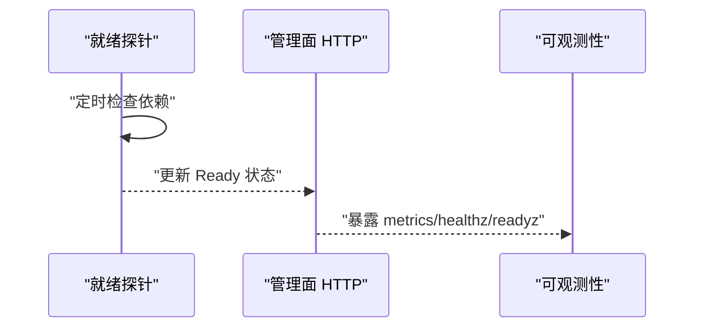
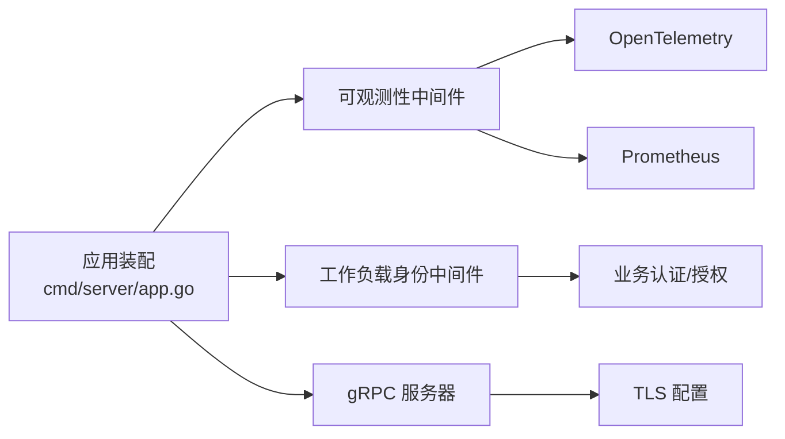

# 中间件系统

<cite>
**本文引用的文件**
- [grpc.go](file://internal/server/grpc.go)
- [workload_identity.go](file://internal/server/workload_identity.go)
- [observability.go](file://internal/server/observability.go)
- [tls.go](file://internal/server/tls.go)
- [server.go](file://internal/server/server.go)
- [admin.go](file://internal/server/admin.go)
- [readiness.go](file://internal/server/readiness.go)
- [main.go](file://cmd/server/main.go)
- [app.go](file://cmd/server/app.go)
</cite>

## 目录
1. [简介](#简介)
2. [项目结构](#项目结构)
3. [核心组件](#核心组件)
4. [架构总览](#架构总览)
5. [详细组件分析](#详细组件分析)
6. [依赖关系分析](#依赖关系分析)
7. [性能考虑](#性能考虑)
8. [故障排查指南](#故障排查指南)
9. [结论](#结论)
10. [附录](#附录)

## 简介
本文件面向 ANI IAM 项目的 gRPC 中间件系统，系统性说明其架构设计、执行链机制与关键中间件的实现要点。重点覆盖：
- gRPC 中间件链的装配与执行顺序
- 工作负载身份中间件：基于双向 TLS 的身份验证、权限检查与上下文注入
- 可观测性中间件：请求追踪、指标采集与结构化日志
- TLS 中间件：强制最小版本、双向认证、证书校验与连接复用
- 自定义中间件开发指南：接口约定、错误处理、性能考量
- 组合模式、调试技巧与优化建议
- 常见使用场景与最佳实践

## 项目结构
ANI IAM 将中间件能力集中在 internal/server 包中，并通过应用启动流程（cmd/server）进行装配。核心文件职责如下：
- grpc.go：gRPC 服务器构建与中间件注入
- tls.go：双向 TLS 配置加载与校验
- observability.go：可观测性中间件链与指标/追踪初始化
- workload_identity.go：工作负载身份中间件（mTLS 身份解析、鉴权、上下文注入）
- admin.go：管理面 HTTP 服务与中间件复用
- readiness.go：就绪探针与依赖健康检查
- app.go：组装中间件链、注册服务、启动运行

**图示来源**
- [app.go:669-730](file://cmd/server/app.go#L669-L730)
- [observability.go:160-172](file://internal/server/observability.go#L160-L172)
- [workload_identity.go:22-50](file://internal/server/workload_identity.go#L22-L50)
- [grpc.go:14-27](file://internal/server/grpc.go#L14-L27)
- [tls.go:15-37](file://internal/server/tls.go#L15-L37)
- [admin.go:16-55](file://internal/server/admin.go#L16-L55)
- [readiness.go:23-52](file://internal/server/readiness.go#L23-L52)

**章节来源**
- [app.go:669-730](file://cmd/server/app.go#L669-L730)
- [server.go:1-4](file://internal/server/server.go#L1-L4)

## 核心组件
- gRPC 服务器与中间件注入：通过 NewGRPCServer/NewTargetGRPCServer 创建并挂载中间件链，强制 mTLS 配置校验。
- 工作负载身份中间件：从 gRPC peer 提取客户端证书，校验 DNS SAN、有效期与用途，调用业务层认证与授权，最终将调用者信息注入上下文。
- 可观测性中间件：提供恢复、元数据、追踪、日志、指标与参数校验等通用横切能力，并暴露 Prometheus 指标端点。
- TLS 配置：强制 TLS 1.3、要求并校验客户端证书，加载服务端证书与客户端 CA。
- 管理面 HTTP：复用同一中间件链，暴露健康、就绪与指标端点。
- 就绪探针：周期性探测依赖可用性，结合进程级就绪状态对外暴露。

**章节来源**
- [grpc.go:14-50](file://internal/server/grpc.go#L14-L50)
- [workload_identity.go:22-146](file://internal/server/workload_identity.go#L22-L146)
- [observability.go:30-172](file://internal/server/observability.go#L30-L172)
- [tls.go:15-37](file://internal/server/tls.go#L15-L37)
- [admin.go:16-65](file://internal/server/admin.go#L16-L65)
- [readiness.go:9-75](file://internal/server/readiness.go#L9-L75)

## 架构总览
下图展示请求进入 gRPC 服务时的中间件执行链与关键交互：

**图示来源**
- [grpc.go:14-50](file://internal/server/grpc.go#L14-L50)
- [observability.go:160-172](file://internal/server/observability.go#L160-L172)
- [workload_identity.go:22-146](file://internal/server/workload_identity.go#L22-L146)

## 详细组件分析

### gRPC 服务器与中间件装配
- 强制 mTLS：NewGRPCServer 在构造时校验 TLS 配置必须满足最小版本、双向认证、单证书与客户端 CA 存在。
- 中间件注入：通过 kratosgrpc.Middleware 传入中间件切片，形成统一执行链。
- 服务注册：NewTargetGRPCServer 负责注册认证、授权与管理服务。

**图示来源**
- [grpc.go:14-50](file://internal/server/grpc.go#L14-L50)
- [tls.go:15-37](file://internal/server/tls.go#L15-L37)

**章节来源**
- [grpc.go:14-50](file://internal/server/grpc.go#L14-L50)
- [tls.go:15-37](file://internal/server/tls.go#L15-L37)

### 工作负载身份中间件
- 入口：NewWorkloadIdentityMiddleware(environment, trustDomain, authentication, authorization)。
- 执行逻辑：
  - 仅对 gRPC 传输生效；非 gRPC 直接放行。
  - 从 peer 提取 TLS 信息，严格校验：
    - 仅允许一个 DNS SAN，且无 IP/URI/Email
    - 必须包含客户端认证用途
    - 证书链有效且在有效期内
  - 调用业务认证：根据环境、信任域、身份类型与值进行身份核验。
  - 调用业务授权：针对目标受众与操作进行权限判定。
  - 成功时将“直接调用者”注入上下文，交由后续处理器使用。
- 错误映射：将业务错误映射为 gRPC 状态码与详细信息（含 operation_id、decision_id）。

**图示来源**
- [workload_identity.go:22-146](file://internal/server/workload_identity.go#L22-L146)

**章节来源**
- [workload_identity.go:22-146](file://internal/server/workload_identity.go#L22-L146)

### 可观测性中间件
- 能力集合：
  - 恢复：捕获 panic 并记录日志
  - 元数据：提取/传播元数据
  - 追踪：基于 OpenTelemetry 生成 span
  - 日志：结构化日志输出
  - 指标：请求计数与耗时直方图
  - 校验：参数校验
- 指标与就绪：
  - 暴露 ani_iam_runtime_ready 等指标
  - 集成 Readiness 探针，周期性检测依赖健康
- 关闭流程：优雅关闭 MeterProvider 与 TracerProvider

**图示来源**
- [observability.go:30-180](file://internal/server/observability.go#L30-L180)

**章节来源**
- [observability.go:30-180](file://internal/server/observability.go#L30-L180)

### TLS 中间件与安全传输
- 强制最小版本：TLS 1.3
- 双向认证：RequireAndVerifyClientCert
- 证书加载：服务端证书/私钥与客户端 CA
- 会话复用：由底层 TLS 库管理，启用默认会话缓存以提升握手性能

**图示来源**
- [tls.go:15-37](file://internal/server/tls.go#L15-L37)

**章节来源**
- [tls.go:15-37](file://internal/server/tls.go#L15-L37)

### 管理面与就绪探针
- 管理面 HTTP：复用相同中间件链，暴露 healthz、readyz、metrics
- 就绪探针：周期探测依赖（如数据库、Redis），结合进程就绪状态对外暴露

**图示来源**
- [admin.go:16-65](file://internal/server/admin.go#L16-L65)
- [readiness.go:23-75](file://internal/server/readiness.go#L23-L75)
- [observability.go:160-172](file://internal/server/observability.go#L160-L172)

**章节来源**
- [admin.go:16-65](file://internal/server/admin.go#L16-L65)
- [readiness.go:9-75](file://internal/server/readiness.go#L9-L75)

## 依赖关系分析
- 应用装配：cmd/server/app.go 负责组装各组件，按顺序注入中间件链并启动服务。
- 中间件顺序：可观测性中间件在前，工作负载身份在后，确保先有追踪/日志/指标，再进行身份与授权。
- 外部依赖：PostgreSQL、Redis、OpenTelemetry、Prometheus、Kratos 框架。

**图示来源**
- [app.go:669-730](file://cmd/server/app.go#L669-L730)
- [grpc.go:14-50](file://internal/server/grpc.go#L14-L50)
- [observability.go:160-172](file://internal/server/observability.go#L160-L172)
- [workload_identity.go:22-146](file://internal/server/workload_identity.go#L22-L146)
- [tls.go:15-37](file://internal/server/tls.go#L15-L37)

**章节来源**
- [app.go:669-730](file://cmd/server/app.go#L669-L730)

## 性能考虑
- 中间件顺序优化：将轻量级中间件（元数据、校验）置于前端，重开销（追踪采样、指标聚合）合理分布，避免阻塞关键路径。
- 追踪采样：采用父链决定采样策略，减少不必要开销。
- 指标导出：使用 Prometheus 导出器，避免高频写入瓶颈。
- TLS 握手：启用会话复用，降低握手成本；强制 TLS 1.3 提升安全与性能。
- 批量与限流：业务侧使用 Redis 做限流与用量聚合，减轻后端压力。
- 资源清理：在服务停止时优雅关闭追踪与指标提供者，避免资源泄漏。

[本节为通用指导，不直接分析具体文件]

## 故障排查指南
- 未认证错误：检查工作负载身份中间件是否正确解析 peer TLS，证书 SAN 是否为单一 DNS，是否具备客户端认证用途，证书链是否有效。
- 权限拒绝：确认授权阶段的目标受众与操作匹配策略，检查策略版本与注册表一致性。
- 超时与不可用：区分 DeadlineExceeded 与 Unavailable，定位上游依赖（数据库、Redis、OIDC）是否健康。
- 指标缺失：确认 OpenTelemetry 与 Prometheus 导出器初始化成功，Readiness 探针是否正常上报。
- 管理面不可达：检查 HTTP 中间件链是否被正确注入，健康/就绪端点是否可用。

**章节来源**
- [workload_identity.go:93-146](file://internal/server/workload_identity.go#L93-L146)
- [observability.go:160-180](file://internal/server/observability.go#L160-L180)
- [admin.go:33-55](file://internal/server/admin.go#L33-L55)

## 结论
ANI IAM 的中间件系统以 Kratos 为基础，围绕可观测性与工作负载身份两大核心能力，构建了高内聚、低耦合的横切层。通过强制 mTLS、严格的证书校验与细粒度授权，实现了安全的内部服务通信；通过统一的追踪、指标与日志，提供了完整的可观测性。建议在新增中间件时遵循现有顺序与错误映射规范，保持链路清晰与可维护性。

[本节为总结性内容，不直接分析具体文件]

## 附录

### 自定义中间件开发指南
- 接口定义：实现 middleware.Middleware 函数签名，接收 next handler，返回包装后的 handler。
- 错误处理：
  - 将业务错误映射为明确的 gRPC 状态码与详细信息（包含 operation_id、decision_id 等元数据）
  - 对 panic 进行恢复，避免影响其他中间件
- 性能考虑：
  - 避免在热路径中进行昂贵 I/O
  - 合理使用追踪采样与指标粒度
  - 注意上下文传递的成本，避免过度拷贝
- 组合模式：
  - 将通用能力（恢复、元数据、追踪、日志、指标、校验）作为基础链
  - 将领域相关能力（如身份、授权、审计）作为扩展链
- 调试技巧：
  - 开启结构化日志与追踪属性，便于问题定位
  - 利用 readyz/healthz 快速判断服务状态
  - 通过 metrics 观察请求量与延迟分布

[本节为通用指导，不直接分析具体文件]

### 常见使用场景与最佳实践
- 场景一：内部服务间调用
  - 使用工作负载身份中间件，基于 mTLS 与策略授权，确保最小权限访问
- 场景二：跨租户隔离
  - 在授权阶段绑定租户上下文，限制跨租户访问
- 场景三：可观测性接入
  - 使用可观测性中间件链，自动采集请求指标与追踪，配合告警规则
- 场景四：管理面运维
  - 通过管理面 HTTP 暴露健康与指标，结合就绪探针实现滚动升级

[本节为通用指导，不直接分析具体文件]