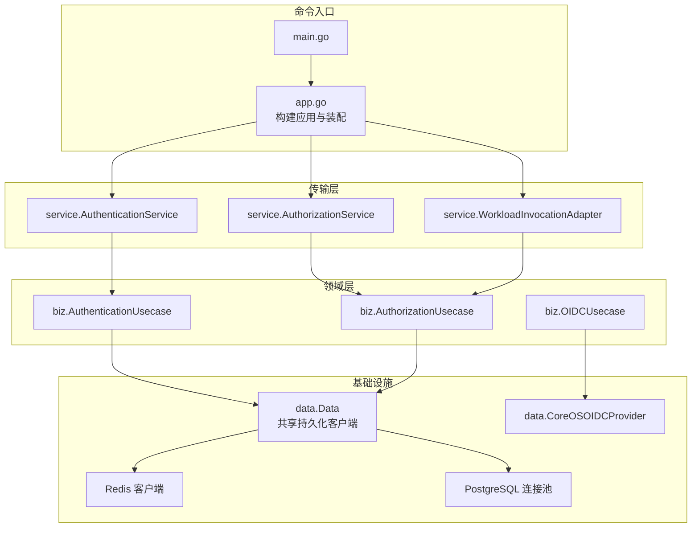
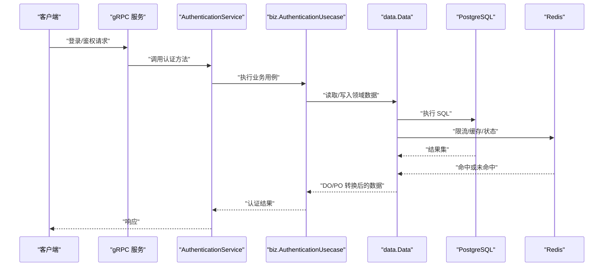
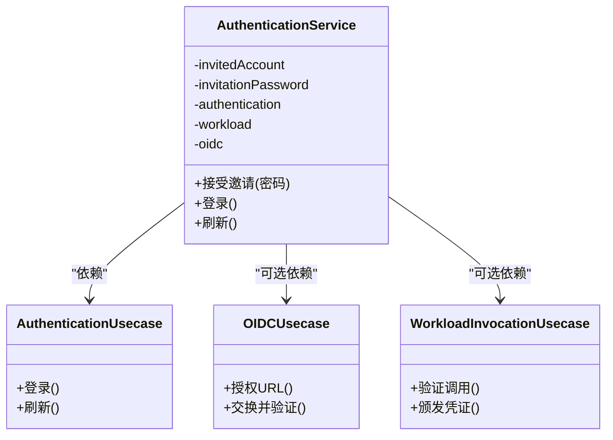
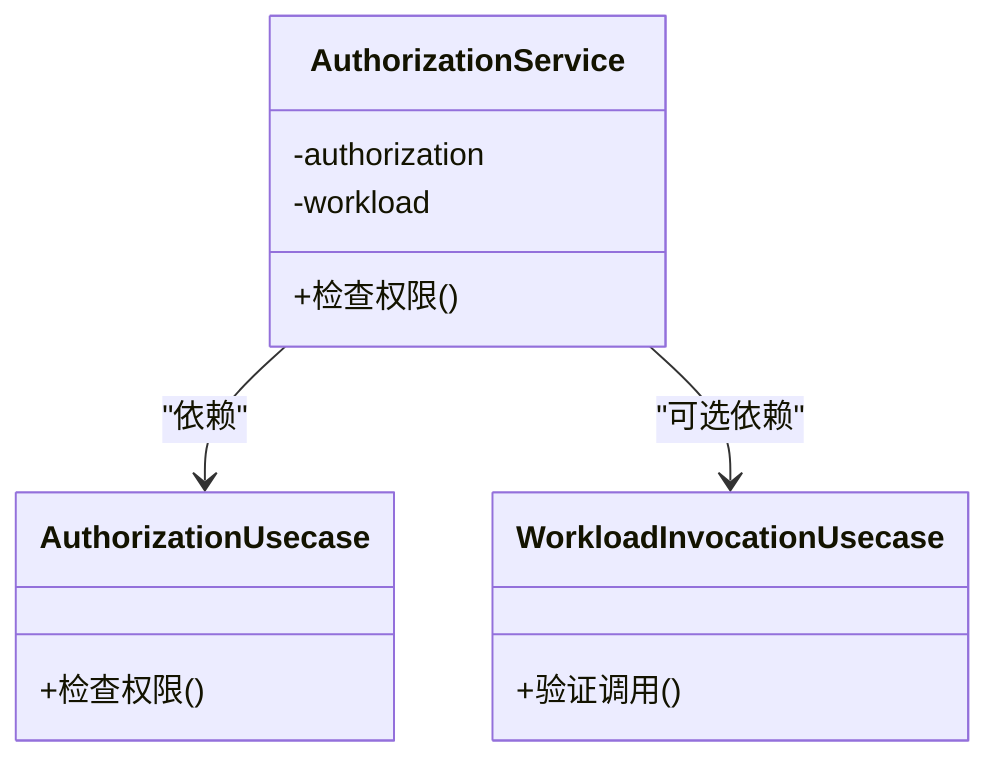
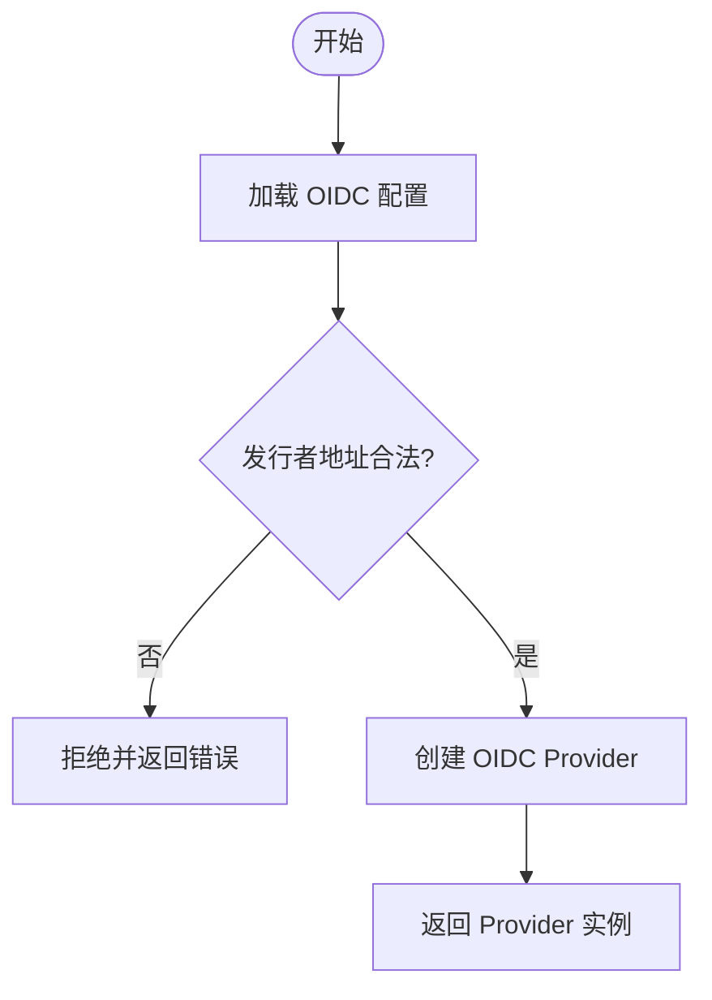
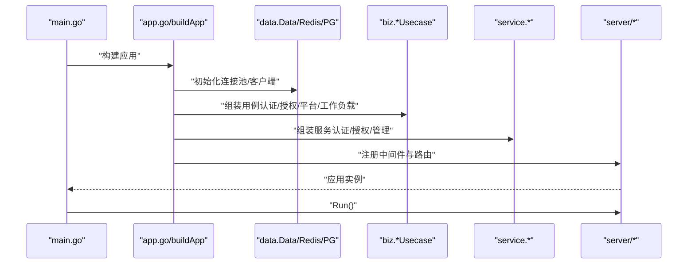
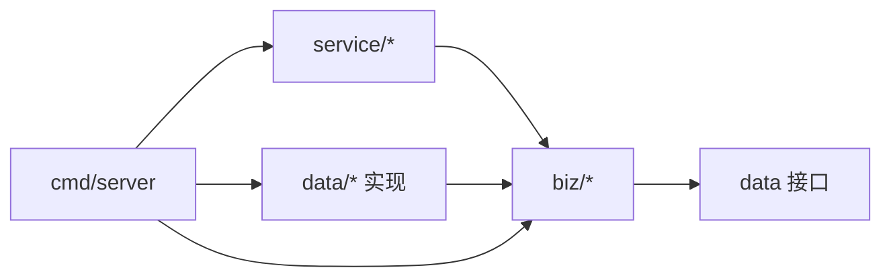

# 依赖注入容器

<cite>
**本文引用的文件**
- [cmd/server/main.go](file://cmd/server/main.go)
- [cmd/server/app.go](file://cmd/server/app.go)
- [internal/data/data.go](file://internal/data/data.go)
- [internal/service/authentication.go](file://internal/service/authentication.go)
- [internal/service/authorization.go](file://internal/service/authorization.go)
- [internal/service/workload_invocation.go](file://internal/service/workload_invocation.go)
- [internal/biz/oidc.go](file://internal/biz/oidc.go)
- [internal/data/oidc_provider.go](file://internal/data/oidc_provider.go)
- [internal/server/server.go](file://internal/server/server.go)
</cite>

## 目录
1. [简介](#简介)
2. [项目结构](#项目结构)
3. [核心组件](#核心组件)
4. [架构总览](#架构总览)
5. [详细组件分析](#详细组件分析)
6. [依赖关系分析](#依赖关系分析)
7. [性能与生命周期管理](#性能与生命周期管理)
8. [故障排查指南](#故障排查指南)
9. [结论](#结论)
10. [附录：最佳实践与常见问题](#附录最佳实践与常见问题)

## 简介
本文件面向 ANI IAM 项目的“依赖注入容器”主题，系统阐述其设计模式、实现原理与实践要点。该项目采用显式构造函数进行装配（Composition Root），在 cmd/server 中集中完成配置加载、基础设施初始化、业务用例组装与服务注册；通过接口抽象将服务层、业务层与数据层解耦，形成清晰的依赖方向与可测试的边界。文档覆盖服务注册、依赖解析、生命周期管理、条件/可选依赖、延迟初始化、循环依赖防护、单例管理与内存泄漏防护，并提供调试技巧与复杂场景解决方案。

## 项目结构
- 分层与依赖规则
  - service（传输适配层）：负责 DTO 与 DO 转换，调用 biz 用例，不直接访问存储。
  - biz（领域层）：拥有领域模型、用例与仓储接口，定义对外端口。
  - data（基础设施适配层）：实现仓储接口，持有长连接客户端（如数据库池、Redis）。
  - server（传输层）：构造 gRPC/HTTP 服务器并注册服务，不包含业务逻辑。
  - cmd（组合根）：唯一装配点，负责读取配置、创建基础设施、组装各层对象并启动应用。

图表来源
- [cmd/server/main.go:34-101](file://cmd/server/main.go#L34-L101)
- [cmd/server/app.go:369-744](file://cmd/server/app.go#L369-L744)
- [internal/data/data.go:1-29](file://internal/data/data.go#L1-L29)
- [internal/data/oidc_provider.go:62-90](file://internal/data/oidc_provider.go#L62-L90)

章节来源
- [cmd/server/main.go:34-101](file://cmd/server/main.go#L34-L101)
- [cmd/server/app.go:369-744](file://cmd/server/app.go#L369-L744)
- [internal/server/server.go:1-4](file://internal/server/server.go#L1-L4)

## 核心组件
- 组合根（Composition Root）
  - main.go：解析命令行参数、加载配置、创建日志、调用 buildApp。
  - app.go：buildApp 是核心装配函数，负责：
    - 加载运行时配置并校验
    - 初始化工作负载注册表、密钥、策略注册表
    - 建立 PostgreSQL 连接池与 Redis 客户端，并进行连通性探测
    - 创建共享的基础设施对象（Data、时钟、ID 生成器、密钥生成器）
    - 按依赖顺序构造 OIDC Provider、操作存储、令牌编解码器、限流器、审计等
    - 组装业务用例（认证、授权、平台管理、租户管理、工作负载调用等）
    - 组装服务层（gRPC 服务、管理员服务、可观测性、就绪探针）
    - 启动后台任务（通知派发、API Key 使用统计维护）
    - 注册 Kratos 应用生命周期钩子（AfterStart/BeforeStop/AfterStop）

- 共享基础设施
  - data.Data：持有 pgxpool.Pool、OutboxProtector 等长生命周期资源，提供 WithLifecycleObservation 的配置拷贝以支持预执行观察模式。

- 服务层
  - AuthenticationService：接收认证请求，依赖 biz 认证用例，可选注入 OIDC 用例与工作负载调用能力。
  - AuthorizationService：处理权限检查，依赖 biz 授权用例与工作负载调用能力。
  - WorkloadInvocation 适配器：为服务层暴露工作负载调用相关能力。

章节来源
- [cmd/server/main.go:34-101](file://cmd/server/main.go#L34-L101)
- [cmd/server/app.go:369-744](file://cmd/server/app.go#L369-L744)
- [internal/data/data.go:1-29](file://internal/data/data.go#L1-L29)
- [internal/service/authentication.go:91-106](file://internal/service/authentication.go#L91-L106)
- [internal/service/authorization.go:1-25](file://internal/service/authorization.go#L1-L25)
- [internal/service/workload_invocation.go:14-30](file://internal/service/workload_invocation.go#L14-L30)

## 架构总览
下图展示从请求进入 gRPC 到业务用例再到数据存储的完整调用链，以及关键依赖注入点。

图表来源
- [cmd/server/app.go:716-723](file://cmd/server/app.go#L716-L723)
- [internal/service/authentication.go:91-106](file://internal/service/authentication.go#L91-L106)
- [internal/data/data.go:1-29](file://internal/data/data.go#L1-L29)

## 详细组件分析

### 服务层：认证服务（AuthenticationService）
- 职责
  - 接收认证请求，转换为领域用例输入，返回协议响应。
  - 可选注入 OIDC 用例与工作负载调用能力，支持多身份源。
- 依赖注入模式
  - 构造函数注入必需依赖（认证用例）。
  - 可变参数注入可选依赖（OIDC 用例），当存在时启用额外能力。
  - 通过 WithXxx 方法在装配阶段按需注入更多能力（如邀请密码流程）。
- 错误处理
  - 将 biz 层错误映射为 gRPC 状态码，附带上下文信息便于追踪。

图表来源
- [internal/service/authentication.go:91-106](file://internal/service/authentication.go#L91-L106)
- [internal/service/workload_invocation.go:14-30](file://internal/service/workload_invocation.go#L14-L30)
- [internal/biz/oidc.go:89-98](file://internal/biz/oidc.go#L89-L98)

章节来源
- [internal/service/authentication.go:91-106](file://internal/service/authentication.go#L91-L106)
- [internal/service/workload_invocation.go:14-30](file://internal/service/workload_invocation.go#L14-L30)
- [internal/biz/oidc.go:89-98](file://internal/biz/oidc.go#L89-L98)

### 服务层：授权服务（AuthorizationService）
- 职责
  - 处理权限检查请求，委托给 biz 授权用例。
  - 可选注入工作负载调用能力，用于跨工作负载授权场景。
- 依赖注入模式
  - 构造函数注入必需依赖（授权用例）。
  - 通过 WithXxx 或工厂方法注入可选依赖（工作负载调用）。

图表来源
- [internal/service/authorization.go:1-25](file://internal/service/authorization.go#L1-L25)
- [internal/service/workload_invocation.go:14-30](file://internal/service/workload_invocation.go#L14-L30)

章节来源
- [internal/service/authorization.go:1-25](file://internal/service/authorization.go#L1-L25)
- [internal/service/workload_invocation.go:14-30](file://internal/service/workload_invocation.go#L14-L30)

### 基础设施：OIDC 提供者
- 职责
  - 封装外部 OIDC 提供商的发现与交互，提供授权 URL 与令牌交换验证。
- 依赖注入模式
  - 工厂函数 NewCoreOSOIDCProvider 根据配置创建 provider，包含 HTTP 客户端超时、重定向 URI 列表等。
- 错误处理
  - 对非规范发行者地址进行拒绝，确保安全性。

图表来源
- [internal/data/oidc_provider.go:62-90](file://internal/data/oidc_provider.go#L62-L90)

章节来源
- [internal/data/oidc_provider.go:62-90](file://internal/data/oidc_provider.go#L62-L90)

### 组合根：应用装配（buildApp）
- 职责
  - 统一装配所有依赖，保证正确的初始化顺序与资源清理。
- 关键点
  - 启动依赖超时控制，避免长时间阻塞。
  - 数据库与 Redis 连通性探测，失败快速失败。
  - 共享 Data 对象作为仓储实现的依赖基础。
  - 条件依赖：Boss OIDC、平台密码登录、核心生命周期运行时等根据配置启用。
  - 可选依赖：OIDC 用例、工作负载调用能力通过可变参数或 WithXxx 注入。
  - 延迟初始化：后台任务（通知派发、API Key 维护）在 AfterStart 后启动。
  - 生命周期管理：AfterStop 依次关闭通知客户端、运行时资源、可观测性。

图表来源
- [cmd/server/main.go:34-101](file://cmd/server/main.go#L34-L101)
- [cmd/server/app.go:369-744](file://cmd/server/app.go#L369-L744)

章节来源
- [cmd/server/app.go:369-744](file://cmd/server/app.go#L369-L744)

## 依赖关系分析
- 依赖方向
  - service → biz（仅依赖领域接口）
  - biz → data 接口（仓储/端口）
  - data → biz（实现领域接口）
  - cmd → 所有层（组合根）
- 耦合与内聚
  - 高内聚：每个用例聚焦单一职责，依赖最小集合。
  - 低耦合：通过接口隔离实现细节，便于替换与测试。
- 外部依赖
  - PostgreSQL、Redis、OIDC 提供商、工作负载注册表。
- 潜在循环依赖
  - 通过接口与单向依赖避免循环；若新增依赖需评估是否破坏分层。

图表来源
- [internal/service/authentication.go:91-106](file://internal/service/authentication.go#L91-L106)
- [internal/service/authorization.go:1-25](file://internal/service/authorization.go#L1-L25)
- [internal/data/data.go:1-29](file://internal/data/data.go#L1-L29)
- [cmd/server/app.go:369-744](file://cmd/server/app.go#L369-L744)

章节来源
- [cmd/server/app.go:369-744](file://cmd/server/app.go#L369-L744)
- [internal/data/data.go:1-29](file://internal/data/data.go#L1-L29)

## 性能与生命周期管理
- 启动阶段
  - 使用启动依赖超时，防止依赖不可用时阻塞启动。
  - 数据库与 Redis 连通性探测，失败快速失败，减少无效启动。
- 运行期
  - 后台任务（通知派发、API Key 使用统计）周期性执行，带超时与取消支持。
  - 可观测性与就绪探针在 AfterStart/BeforeStop 中切换状态。
- 关闭阶段
  - AfterStop 依次关闭通知客户端、运行时资源、可观测性，确保优雅退出。
- 单例管理
  - 共享 Data、Redis 客户端、PostgreSQL 连接池作为进程级单例，避免重复创建。
- 内存泄漏防护
  - 明确 closeRuntime/closeNotification 回调，确保资源释放。
  - 后台协程通过 context 取消与 done channel 安全退出。

章节来源
- [cmd/server/app.go:369-744](file://cmd/server/app.go#L369-L744)

## 故障排查指南
- 启动失败
  - 检查 PostgreSQL/Redis 连通性错误与超时设置。
  - 查看 OIDC 配置与证书路径是否正确。
- 认证/授权异常
  - 确认策略版本与注册表一致。
  - 检查令牌编解码器与密钥加载是否成功。
- 后台任务问题
  - 核对调度间隔与超时配置。
  - 关注上下文取消与错误日志中的重试标记。
- 依赖缺失
  - 可选依赖未注入时，对应功能应返回明确的依赖缺失错误。

章节来源
- [cmd/server/app.go:369-744](file://cmd/server/app.go#L369-L744)
- [internal/service/authentication.go:91-106](file://internal/service/authentication.go#L91-L106)

## 结论
ANI IAM 采用显式构造函数装配的依赖注入模式，在 cmd/server 中集中完成依赖解析与生命周期管理。通过接口抽象实现服务层、业务层与数据层的解耦，支持条件依赖、可选依赖与延迟初始化。共享基础设施对象作为单例，配合严格的资源关闭流程保障稳定性与可维护性。该设计便于测试替换、扩展新功能与演进架构。

## 附录：最佳实践与常见问题
- 最佳实践
  - 在组合根集中装配，保持其他层无全局状态。
  - 使用接口定义依赖，实现放在 data 层。
  - 可选依赖通过可变参数或 WithXxx 注入，避免空指针。
  - 后台任务支持取消与超时，确保优雅退出。
  - 启动阶段进行依赖健康检查，快速失败。
- 常见问题
  - 循环依赖：通过接口与单向依赖规避，必要时引入门面或事件总线。
  - 内存泄漏：确保所有长生命周期资源有对应的关闭回调。
  - 测试困难：通过接口与工厂函数注入模拟对象，隔离外部依赖。
- 调试技巧
  - 增加上下文键与日志字段，追踪依赖注入链。
  - 使用就绪探针与健康检查定位启动阶段问题。
  - 对后台任务添加指标与告警，监控执行成功率与时延。