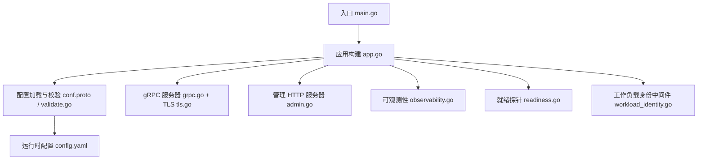
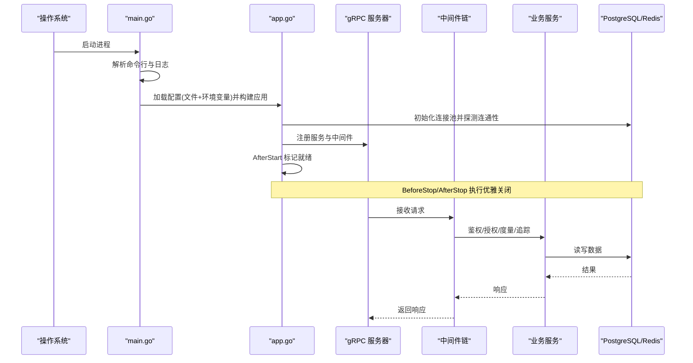
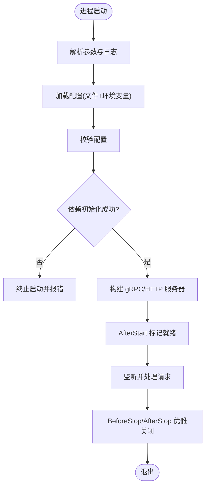
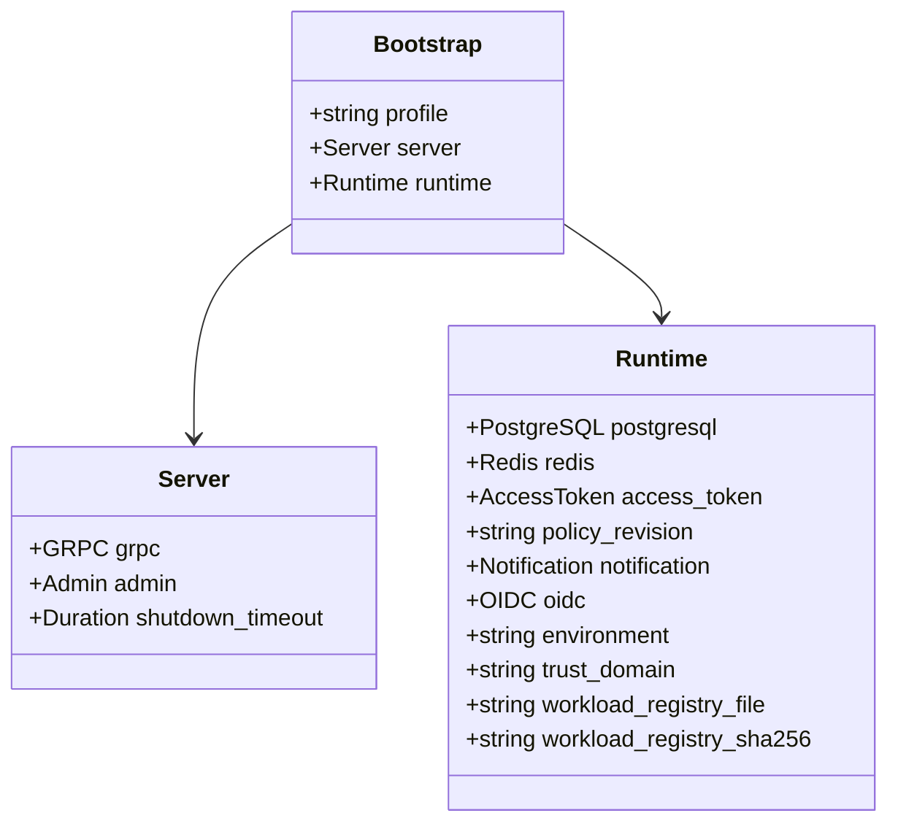
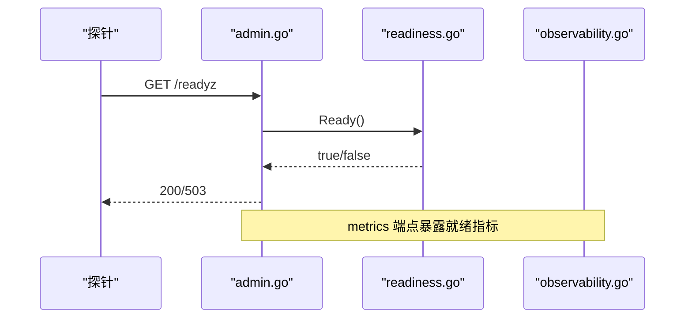
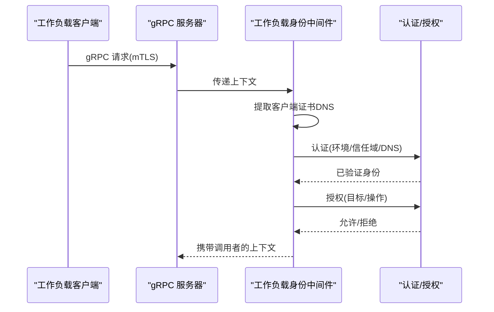
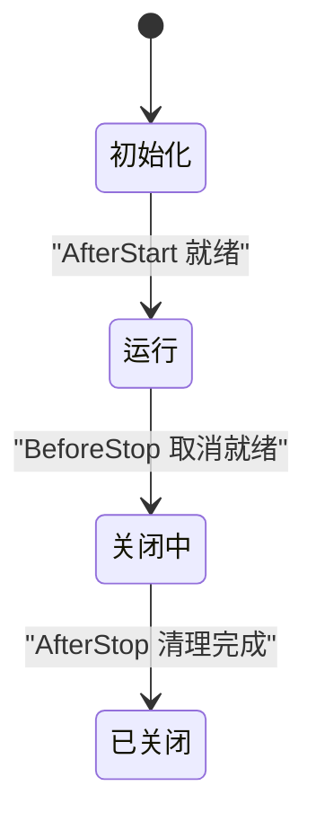
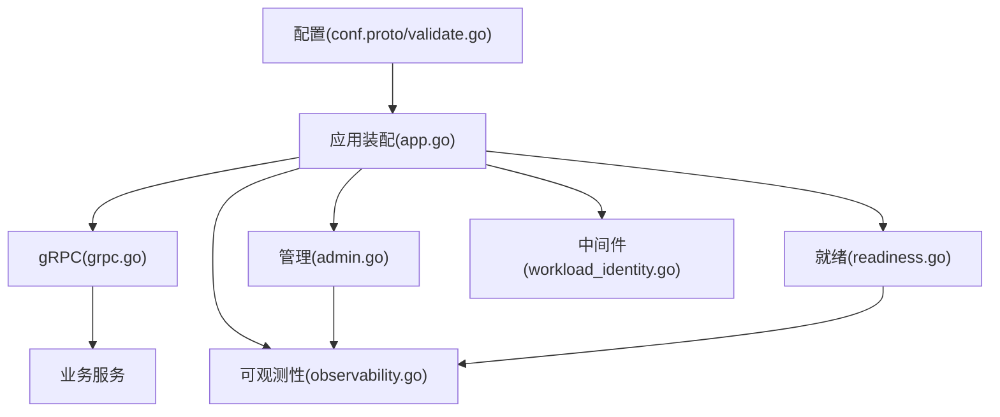

# 微服务核心组件

<cite>
**本文引用的文件**
- [cmd/server/main.go](file://cmd/server/main.go)
- [cmd/server/app.go](file://cmd/server/app.go)
- [configs/config.yaml](file://configs/config.yaml)
- [internal/conf/conf.proto](file://internal/conf/conf.proto)
- [internal/conf/validate.go](file://internal/conf/validate.go)
- [internal/server/grpc.go](file://internal/server/grpc.go)
- [internal/server/tls.go](file://internal/server/tls.go)
- [internal/server/admin.go](file://internal/server/admin.go)
- [internal/server/readiness.go](file://internal/server/readiness.go)
- [internal/server/observability.go](file://internal/server/observability.go)
- [internal/server/workload_identity.go](file://internal/server/workload_identity.go)
</cite>

## 目录
1. [简介](#简介)
2. [项目结构](#项目结构)
3. [核心组件](#核心组件)
4. [架构总览](#架构总览)
5. [详细组件分析](#详细组件分析)
6. [依赖关系分析](#依赖关系分析)
7. [性能考虑](#性能考虑)
8. [故障排查指南](#故障排查指南)
9. [结论](#结论)
10. [附录](#附录)

## 简介
本文件面向 ANI IAM 项目的微服务核心组件，聚焦 Kratos 框架的使用与服务启动流程、配置管理与验证、环境变量与运行时配置来源、服务发现与负载均衡（工作负载注册表）、健康检查机制、日志记录与监控指标、追踪系统、TLS 与安全传输、认证中间件、以及组件生命周期与优雅关闭。文档以代码级事实为依据，配合图示帮助不同技术背景的读者理解整体设计与实现要点。

## 项目结构
ANI IAM 采用分层组织：入口在 cmd/server，应用装配与生命周期在 app.go；配置模型与校验在 internal/conf；传输层（gRPC/HTTP）与可观测性在 internal/server；业务与数据访问位于 internal/biz 与 internal/data。配置文件通过 YAML 与环境变量组合加载，Kratos 负责组装服务器、中间件与生命周期钩子。

图表来源
- [cmd/server/main.go:34-101](file://cmd/server/main.go#L34-L101)
- [cmd/server/app.go:369-782](file://cmd/server/app.go#L369-L782)
- [internal/conf/conf.proto:9-58](file://internal/conf/conf.proto#L9-L58)
- [internal/conf/validate.go:19-45](file://internal/conf/validate.go#L19-L45)
- [internal/server/grpc.go:14-50](file://internal/server/grpc.go#L14-L50)
- [internal/server/tls.go:15-37](file://internal/server/tls.go#L15-L37)
- [internal/server/admin.go:16-54](file://internal/server/admin.go#L16-L54)
- [internal/server/readiness.go:9-75](file://internal/server/readiness.go#L9-L75)
- [internal/server/observability.go:30-180](file://internal/server/observability.go#L30-L180)
- [internal/server/workload_identity.go:22-49](file://internal/server/workload_identity.go#L22-L49)
- [configs/config.yaml:1-61](file://configs/config.yaml#L1-L61)

章节来源
- [cmd/server/main.go:34-101](file://cmd/server/main.go#L34-L101)
- [cmd/server/app.go:369-782](file://cmd/server/app.go#L369-L782)
- [internal/conf/conf.proto:9-58](file://internal/conf/conf.proto#L9-L58)
- [internal/conf/validate.go:19-45](file://internal/conf/validate.go#L19-L45)
- [configs/config.yaml:1-61](file://configs/config.yaml#L1-L61)

## 核心组件
- 配置系统与验证：Bootstrap/Server/Runtime 等配置项由 conf.proto 定义，validate.go 对网络、端口、超时、TLS、PostgreSQL、Redis、OIDC、通知、策略版本等进行严格校验，确保生产安全基线。
- gRPC 服务器与 mTLS：grpc.go 创建 Kratos gRPC 服务器并强制最小 TLS 版本与双向证书校验；tls.go 从文件加载证书、私钥与客户端 CA，构造受控的 tls.Config。
- 管理端点与健康检查：admin.go 暴露 healthz、readyz、metrics；readiness.go 提供依赖就绪状态轮询与聚合；observability.go 集成 OpenTelemetry 与 Prometheus。
- 工作负载身份中间件：workload_identity.go 基于 gRPC 双向 TLS 提取客户端 DNS 身份，调用内部鉴权能力完成工作负载身份认证与授权，并将已验证调用者注入上下文。
- 应用装配与生命周期：app.go 组装所有运行时依赖（数据库连接池、缓存、OIDC、令牌编解码器、操作注册表、通知工作器等），注册中间件与服务，并通过 Kratos 钩子管理启动后与停止后的清理。

章节来源
- [internal/conf/conf.proto:9-58](file://internal/conf/conf.proto#L9-L58)
- [internal/conf/validate.go:19-167](file://internal/conf/validate.go#L19-L167)
- [internal/server/grpc.go:14-50](file://internal/server/grpc.go#L14-L50)
- [internal/server/tls.go:15-37](file://internal/server/tls.go#L15-L37)
- [internal/server/admin.go:16-54](file://internal/server/admin.go#L16-L54)
- [internal/server/readiness.go:9-75](file://internal/server/readiness.go#L9-L75)
- [internal/server/observability.go:30-180](file://internal/server/observability.go#L30-L180)
- [internal/server/workload_identity.go:22-49](file://internal/server/workload_identity.go#L22-L49)
- [cmd/server/app.go:369-782](file://cmd/server/app.go#L369-L782)

## 架构总览
下图展示从进程启动到请求处理的端到端路径：main 解析参数并加载配置，构建应用；app 初始化依赖并注册 gRPC/HTTP 服务器与中间件；请求经可观测性与工作负载身份中间件进入业务服务；健康检查与指标通过管理端点暴露。

图表来源
- [cmd/server/main.go:34-101](file://cmd/server/main.go#L34-L101)
- [cmd/server/app.go:369-782](file://cmd/server/app.go#L369-L782)
- [internal/server/grpc.go:14-50](file://internal/server/grpc.go#L14-L50)
- [internal/server/observability.go:160-172](file://internal/server/observability.go#L160-L172)
- [internal/server/workload_identity.go:22-49](file://internal/server/workload_identity.go#L22-L49)

## 详细组件分析

### Kratos 框架使用与服务启动流程
- 入口 main.go 设置默认日志处理器，启用自动 CPU 配额，加载配置源（文件与 KRATOS_ 前缀环境变量），扫描为 Bootstrap 结构体，调用 buildApp 构建应用并运行。
- app.go 中 buildApp 完成：
  - 配置校验与读取核心生命周期配置
  - 加载工作负载注册表与密钥材料
  - 建立 PostgreSQL 连接池与 Redis 客户端并 Ping 探测
  - 初始化 OIDC、令牌编解码器、操作注册表、限流器、通知工作器等
  - 创建 gRPC 与管理 HTTP 服务器，挂载中间件与服务
  - 通过 Kratos 钩子设置 AfterStart/BeforeStop/AfterStop，控制就绪状态与资源释放
- 启动期间对关键依赖进行超时探测，失败则中止启动，避免部分可用导致的不一致状态。

图表来源
- [cmd/server/main.go:34-101](file://cmd/server/main.go#L34-L101)
- [cmd/server/app.go:369-782](file://cmd/server/app.go#L369-L782)

章节来源
- [cmd/server/main.go:34-101](file://cmd/server/main.go#L34-L101)
- [cmd/server/app.go:369-782](file://cmd/server/app.go#L369-L782)

### 配置管理系统：验证、环境变量与运行时配置
- 配置模型：conf.proto 定义了 Bootstrap、Server（含 gRPC TLS、Admin）、Runtime（PostgreSQL、Redis、AccessToken、Notification、OIDC、PolicyRevision 等）。
- 配置来源：main.go 同时使用文件源与 KRATOS_ 环境变量源，支持部署时覆盖。
- 校验规则：validate.go 强制：
  - 仅允许 isolated profile
  - gRPC/Admin 监听地址必须显式绑定 IP 与端口，且不能冲突
  - gRPC 必须启用 mTLS，证书与 CA 文件需绝对路径
  - PostgreSQL DSN 必须使用受限用户与隔离库，非环回需 verify-full 与 CA
  - Redis 必须环回地址，命名空间与登录限制等必填
  - OIDC provider 固定为 dex，重定向 URI 必须 HTTPS 且规范
  - PolicyRevision 必须为 sha256 摘要
- 运行时配置更新：当前实现为进程启动时一次性加载，未实现热更新；可通过外部编排重启或扩展配置源实现。

图表来源
- [internal/conf/conf.proto:9-58](file://internal/conf/conf.proto#L9-L58)

章节来源
- [internal/conf/conf.proto:9-58](file://internal/conf/conf.proto#L9-L58)
- [internal/conf/validate.go:19-167](file://internal/conf/validate.go#L19-L167)
- [cmd/server/main.go:82-94](file://cmd/server/main.go#L82-L94)
- [configs/config.yaml:1-61](file://configs/config.yaml#L1-L61)

### 服务发现、负载均衡与工作负载注册表
- 工作负载注册表：app.go 从配置的 JSON 文件加载并校验 SHA256，作为目标操作与权限策略的来源，用于工作负载身份授权与调用路由。
- 服务发现：本项目不依赖传统服务发现协议，而是通过静态注册表与策略版本（policy_revision）锁定目标集合，保证一致性。
- 负载均衡：未在 gRPC 层内置负载均衡；若需要横向扩展，可在网关或基础设施层实现。

章节来源
- [cmd/server/app.go:378-406](file://cmd/server/app.go#L378-L406)
- [internal/conf/validate.go:117-123](file://internal/conf/validate.go#L117-L123)

### 健康检查机制
- 就绪探针：readiness.go 提供 Readiness，支持依赖检查函数周期性探测（如数据库、Redis、核心运行时），聚合依赖与手动就绪标志。
- 管理端点：admin.go 暴露 healthz（简单存活）、readyz（结合 Readiness）、metrics（Prometheus 指标）。
- 指标：observability.go 将就绪状态导出为 ani_iam_runtime_ready 等指标。

图表来源
- [internal/server/admin.go:34-53](file://internal/server/admin.go#L34-L53)
- [internal/server/readiness.go:23-75](file://internal/server/readiness.go#L23-L75)
- [internal/server/observability.go:92-135](file://internal/server/observability.go#L92-L135)

章节来源
- [internal/server/admin.go:16-54](file://internal/server/admin.go#L16-L54)
- [internal/server/readiness.go:9-75](file://internal/server/readiness.go#L9-L75)
- [internal/server/observability.go:92-135](file://internal/server/observability.go#L92-L135)

### 日志记录、监控指标与追踪
- 日志：main.go 设置 slog 处理器，过滤敏感字段，附加 trace 属性；server 层使用 Kratos logging 中间件输出结构化日志。
- 指标：observability.go 集成 OpenTelemetry Metrics 与 Prometheus Exporter，注册 Go/进程收集器，暴露标准请求计数与时延直方图，以及自定义指标（如 API Key 快照时间戳）。
- 追踪：启用 OpenTelemetry TracerProvider 与 TextMapPropagator，Kratos tracing 中间件注入链路上下文。

图表来源
- [cmd/server/main.go:104-131](file://cmd/server/main.go#L104-L131)
- [internal/server/observability.go:41-180](file://internal/server/observability.go#L41-L180)

章节来源
- [cmd/server/main.go:104-131](file://cmd/server/main.go#L104-L131)
- [internal/server/observability.go:41-180](file://internal/server/observability.go#L41-L180)

### TLS 配置、安全传输与认证中间件
- mTLS 强制：grpc.go 要求 MinVersion=TLS1.3 且 RequireAndVerifyClientCert；tls.go 从文件加载服务端证书、私钥与客户端 CA，构造 tls.Config。
- 工作负载身份中间件：workload_identity.go 从 gRPC peer 的 TLS 信息中提取客户端 DNS 名称，调用内部 WorkloadAuthentication/WorkloadAuthorization 完成身份认证与授权，并将已验证调用者注入上下文。
- 安全边界：配置校验确保证书路径、DNS 标识、OIDC 重定向 URL 等符合安全基线。

图表来源
- [internal/server/grpc.go:14-26](file://internal/server/grpc.go#L14-L26)
- [internal/server/tls.go:15-37](file://internal/server/tls.go#L15-L37)
- [internal/server/workload_identity.go:22-49](file://internal/server/workload_identity.go#L22-L49)

章节来源
- [internal/server/grpc.go:14-50](file://internal/server/grpc.go#L14-L50)
- [internal/server/tls.go:15-37](file://internal/server/tls.go#L15-L37)
- [internal/server/workload_identity.go:22-49](file://internal/server/workload_identity.go#L22-L49)

### 组件生命周期管理与优雅关闭
- 启动阶段：buildApp 初始化依赖并创建服务器；AfterStart 设置就绪；BeforeStop 取消就绪。
- 后台任务：通知派发工作器、API Key 维护工作器等具备 Start/Stop 接口，遵循 context 取消与超时控制。
- 关闭阶段：AfterStop 依次关闭通知客户端、运行时资源（Redis/PG）、可观测性提供者，确保资源释放有序。

图表来源
- [cmd/server/app.go:769-781](file://cmd/server/app.go#L769-L781)
- [internal/server/readiness.go:27-66](file://internal/server/readiness.go#L27-L66)
- [internal/server/observability.go:174-179](file://internal/server/observability.go#L174-L179)

章节来源
- [cmd/server/app.go:769-781](file://cmd/server/app.go#L769-L781)
- [internal/server/readiness.go:27-66](file://internal/server/readiness.go#L27-L66)
- [internal/server/observability.go:174-179](file://internal/server/observability.go#L174-L179)

## 依赖关系分析
- 配置依赖：Bootstrap/Server/Runtime 强耦合于 validate.go 的规则；任何变更需同步校验逻辑。
- 传输依赖：gRPC 服务器依赖 mTLS 配置；中间件链顺序影响鉴权与可观测性生效时机。
- 运行时依赖：PostgreSQL/Redis/OIDC/工作负载注册表在启动时探测，任一失败将阻止服务上线。
- 可观测性依赖：OpenTelemetry 与 Prometheus 导出器需在启动时初始化并在关闭时释放。

图表来源
- [internal/conf/conf.proto:9-58](file://internal/conf/conf.proto#L9-L58)
- [internal/conf/validate.go:19-167](file://internal/conf/validate.go#L19-L167)
- [cmd/server/app.go:369-782](file://cmd/server/app.go#L369-L782)
- [internal/server/grpc.go:14-50](file://internal/server/grpc.go#L14-L50)
- [internal/server/admin.go:16-54](file://internal/server/admin.go#L16-L54)
- [internal/server/observability.go:30-180](file://internal/server/observability.go#L30-L180)
- [internal/server/readiness.go:9-75](file://internal/server/readiness.go#L9-L75)
- [internal/server/workload_identity.go:22-49](file://internal/server/workload_identity.go#L22-L49)

章节来源
- [cmd/server/app.go:369-782](file://cmd/server/app.go#L369-L782)
- [internal/conf/validate.go:19-167](file://internal/conf/validate.go#L19-L167)

## 性能考虑
- 连接与超时：PostgreSQL 连接池与 Redis 客户端均设置拨号/读/写超时，避免阻塞启动与请求处理。
- 批量与节流：API Key 使用聚合与刷新采用批处理与间隔调度，降低数据库压力；登录限流防止暴力破解。
- 指标采样：OpenTelemetry 默认采样策略与 Kratos 视图优化延迟直方图，减少开销。
- 建议：根据流量特征调整批大小与间隔；监控 ani_iam_api_key_operational_snapshot_timestamp_seconds 判断快照是否新鲜。

[本节为通用指导，不直接分析具体文件]

## 故障排查指南
- 启动失败
  - 配置校验错误：检查 profile、监听地址、mTLS 文件路径、PostgreSQL DSN、Redis 地址与命名空间、OIDC 重定向 URL、PolicyRevision 格式。
  - 依赖不可用：确认 PostgreSQL/Redis/OIDC 可达；查看启动日志中的连接错误。
- 健康检查异常
  - readyz 返回 503：检查 Readiness 依赖探测是否通过；关注数据库与缓存连通性。
  - metrics 缺失：确认 observability 初始化成功，Prometheus 抓取端点可达。
- 工作负载调用被拒
  - 证书问题：确认客户端证书包含单一 DNS 名称且有效；服务端 mTLS 配置正确。
  - 授权失败：检查工作负载注册表与策略版本是否匹配；确认目标操作与受众正确。

章节来源
- [internal/conf/validate.go:19-167](file://internal/conf/validate.go#L19-L167)
- [internal/server/admin.go:34-53](file://internal/server/admin.go#L34-L53)
- [internal/server/readiness.go:27-75](file://internal/server/readiness.go#L27-L75)
- [internal/server/workload_identity.go:22-49](file://internal/server/workload_identity.go#L22-L49)

## 结论
ANI IAM 的微服务核心以 Kratos 为基础，通过严格的配置校验与 mTLS 保障安全基线；以工作负载注册表与策略版本实现稳定的服务发现与授权边界；借助 OpenTelemetry 与 Prometheus 提供完整的可观测性；通过 Readiness 与优雅关闭机制提升运维可靠性。建议在部署中严格遵循配置约束，持续监控指标与日志，按需调优批处理与超时参数。

[本节为总结，不直接分析具体文件]

## 附录
- 配置示例参考：configs/config.yaml 展示了典型的服务监听、运行时依赖、OIDC、通知与工作负载注册表配置。
- 关键路径参考：
  - 启动与装配：cmd/server/main.go、cmd/server/app.go
  - 配置模型与校验：internal/conf/conf.proto、internal/conf/validate.go
  - 传输与安全：internal/server/grpc.go、internal/server/tls.go
  - 健康与指标：internal/server/admin.go、internal/server/readiness.go、internal/server/observability.go
  - 工作负载身份：internal/server/workload_identity.go

章节来源
- [configs/config.yaml:1-61](file://configs/config.yaml#L1-L61)
- [cmd/server/main.go:34-101](file://cmd/server/main.go#L34-L101)
- [cmd/server/app.go:369-782](file://cmd/server/app.go#L369-L782)
- [internal/conf/conf.proto:9-58](file://internal/conf/conf.proto#L9-L58)
- [internal/conf/validate.go:19-167](file://internal/conf/validate.go#L19-L167)
- [internal/server/grpc.go:14-50](file://internal/server/grpc.go#L14-L50)
- [internal/server/tls.go:15-37](file://internal/server/tls.go#L15-L37)
- [internal/server/admin.go:16-54](file://internal/server/admin.go#L16-L54)
- [internal/server/readiness.go:9-75](file://internal/server/readiness.go#L9-L75)
- [internal/server/observability.go:30-180](file://internal/server/observability.go#L30-L180)
- [internal/server/workload_identity.go:22-49](file://internal/server/workload_identity.go#L22-L49)