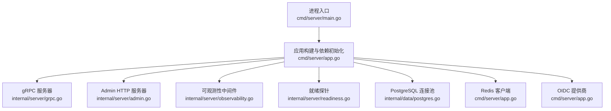
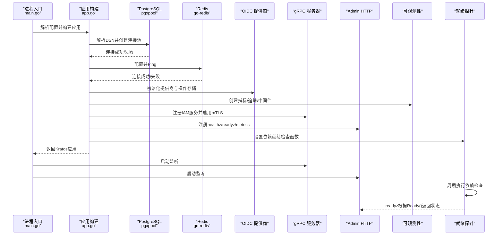
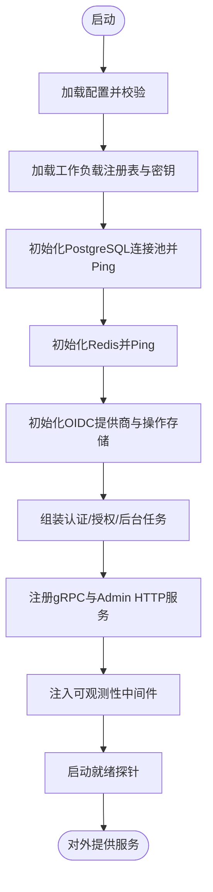
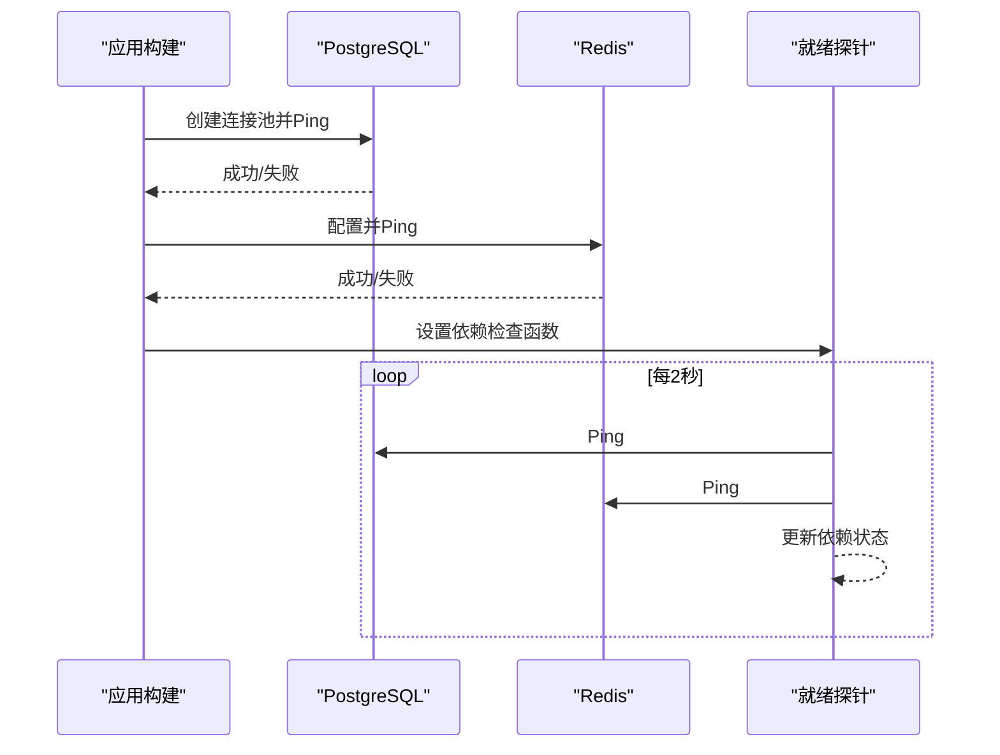
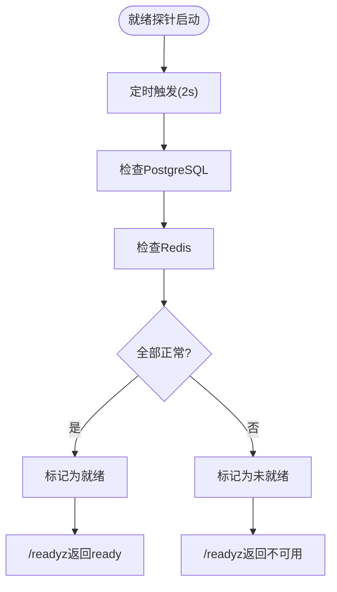
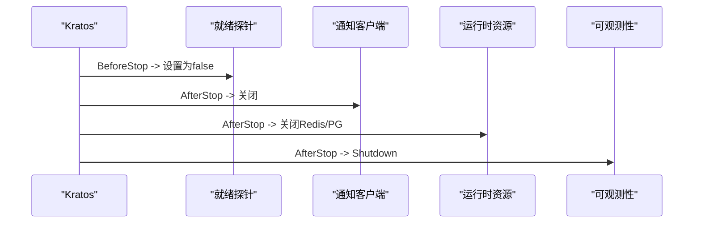
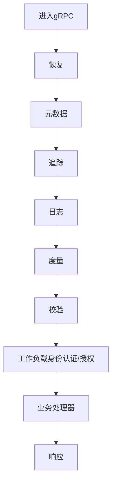
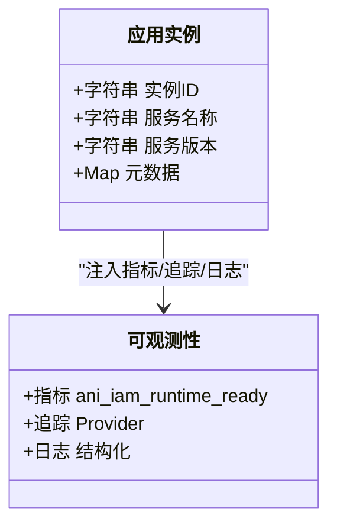
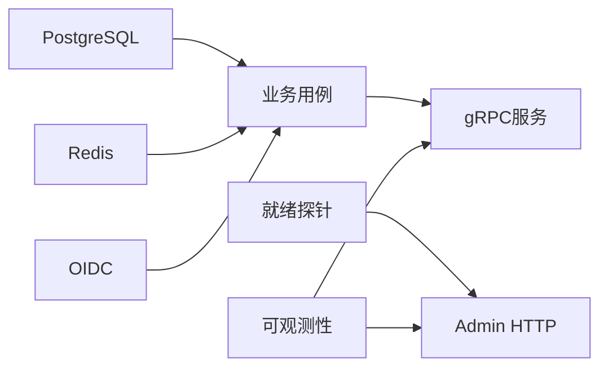

# 服务生命周期管理

<cite>
**本文引用的文件**
- [cmd/server/main.go](file://cmd/server/main.go)
- [cmd/server/app.go](file://cmd/server/app.go)
- [configs/config.yaml](file://configs/config.yaml)
- [internal/conf/conf.proto](file://internal/conf/conf.proto)
- [internal/server/readiness.go](file://internal/server/readiness.go)
- [internal/server/observability.go](file://internal/server/observability.go)
- [internal/server/grpc.go](file://internal/server/grpc.go)
- [internal/server/admin.go](file://internal/server/admin.go)
- [internal/server/workload_identity.go](file://internal/server/workload_identity.go)
- [internal/data/postgres.go](file://internal/data/postgres.go)
- [internal/data/data.go](file://internal/data/data.go)
</cite>

## 目录
1. [简介](#简介)
2. [项目结构](#项目结构)
3. [核心组件](#核心组件)
4. [架构总览](#架构总览)
5. [详细组件分析](#详细组件分析)
6. [依赖关系分析](#依赖关系分析)
7. [性能考量](#性能考量)
8. [故障排查指南](#故障排查指南)
9. [结论](#结论)
10. [附录](#附录)

## 简介
本文面向 ANI IAM 项目的服务生命周期管理，聚焦 Kratos 框架的启动流程、依赖初始化与配置加载、服务注册、健康检查（就绪/存活探针）、优雅关闭、中间件链与错误恢复策略，以及实例标识、元数据与版本信息的配置方法。文档以代码级实现为依据，提供可视化图示与可操作的排障建议。

## 项目结构
- 入口与启动：main.go 负责命令行参数解析、日志初始化、配置加载与构建应用；app.go 负责依赖初始化、服务装配、健康检查与生命周期钩子。
- 配置：config.yaml 提供运行时配置；conf.proto 定义配置结构体（Bootstrap、Server、Runtime 等）。
- 传输与服务：grpc.go 创建 gRPC 服务器并注册 IAM 服务；admin.go 暴露 admin HTTP 端点（healthz、readyz、metrics）。
- 可观测性：observability.go 集成 OpenTelemetry/Prometheus，提供指标、追踪与中间件。
- 健康检查：readiness.go 提供依赖就绪探测与状态切换。
- 数据层：postgres.go 封装事务与错误映射；data.go 持有连接池与可选观察模式。

**图表来源**
- [cmd/server/main.go:34-101](file://cmd/server/main.go#L34-L101)
- [cmd/server/app.go:369-782](file://cmd/server/app.go#L369-L782)
- [internal/server/grpc.go:14-51](file://internal/server/grpc.go#L14-L51)
- [internal/server/admin.go:16-54](file://internal/server/admin.go#L16-L54)
- [internal/server/observability.go:41-171](file://internal/server/observability.go#L41-L171)
- [internal/server/readiness.go:9-74](file://internal/server/readiness.go#L9-L74)

**章节来源**
- [cmd/server/main.go:34-101](file://cmd/server/main.go#L34-L101)
- [cmd/server/app.go:369-782](file://cmd/server/app.go#L369-L782)
- [configs/config.yaml:1-61](file://configs/config.yaml#L1-L61)
- [internal/conf/conf.proto:9-113](file://internal/conf/conf.proto#L9-L113)

## 核心组件
- 应用构建器：在启动阶段完成配置校验、工作负载注册表加载、密钥与 OIDC 配置、数据库与缓存连接、业务用例装配、后台任务与工作流、中间件与服务注册。
- 健康检查：依赖就绪探测周期性检查 PostgreSQL 与 Redis 连通性，并在所有依赖就绪后标记服务为“已就绪”。
- 可观测性：统一注入恢复、元数据、追踪、日志、度量中间件，并提供 Prometheus 指标采集。
- 传输层：gRPC 强制 mTLS；Admin HTTP 暴露 healthz/readyz/metrics。
- 数据层：PostgreSQL 连接池与事务封装，错误映射到领域错误；可选生命周期观察模式。

**章节来源**
- [cmd/server/app.go:369-782](file://cmd/server/app.go#L369-L782)
- [internal/server/readiness.go:9-74](file://internal/server/readiness.go#L9-L74)
- [internal/server/observability.go:41-171](file://internal/server/observability.go#L41-L171)
- [internal/server/grpc.go:14-51](file://internal/server/grpc.go#L14-L51)
- [internal/server/admin.go:16-54](file://internal/server/admin.go#L16-L54)
- [internal/data/postgres.go:27-59](file://internal/data/postgres.go#L27-L59)

## 架构总览
下图展示从进程启动到服务对外暴露的完整链路，包括依赖初始化顺序、服务注册与健康检查联动。

**图表来源**
- [cmd/server/main.go:34-101](file://cmd/server/main.go#L34-L101)
- [cmd/server/app.go:412-448](file://cmd/server/app.go#L412-L448)
- [cmd/server/app.go:492-528](file://cmd/server/app.go#L492-L528)
- [cmd/server/app.go:669-742](file://cmd/server/app.go#L669-L742)
- [internal/server/readiness.go:23-74](file://internal/server/readiness.go#L23-L74)
- [internal/server/admin.go:33-54](file://internal/server/admin.go#L33-L54)

## 详细组件分析

### Kratos 启动流程与依赖初始化
- 配置加载：通过 file + env 源加载 Bootstrap，扫描到 conf.Bootstrap，并进行校验。
- 工作负载注册表与密钥：加载目标工作负载注册表与访问令牌私钥，构造 JWT 编解码器。
- 数据库与缓存：
  - PostgreSQL：解析 DSN，必要时注入租户生产者参数，创建连接池并 Ping。
  - Redis：配置地址、认证、超时等，Ping 验证连通性。
- 业务组件：
  - OIDC：提供商、重定向 URI、HTTP 超时、操作存储。
  - 认证与授权：密码登录限流、令牌签发、平台会话、权限目录。
  - 后台任务：API Key 使用聚合与维护、通知分发。
- 服务注册：
  - gRPC：强制 mTLS，注册 Authentication、Authorization、IAMAdmin。
  - Admin HTTP：healthz、readyz、metrics。
- 可观测性：注入恢复、元数据、追踪、日志、度量中间件，并暴露 Prometheus 指标。

**图表来源**
- [cmd/server/main.go:71-101](file://cmd/server/main.go#L71-L101)
- [cmd/server/app.go:369-448](file://cmd/server/app.go#L369-L448)
- [cmd/server/app.go:492-528](file://cmd/server/app.go#L492-L528)
- [cmd/server/app.go:669-742](file://cmd/server/app.go#L669-L742)

**章节来源**
- [cmd/server/main.go:71-101](file://cmd/server/main.go#L71-L101)
- [cmd/server/app.go:369-742](file://cmd/server/app.go#L369-L742)
- [configs/config.yaml:17-61](file://configs/config.yaml#L17-L61)
- [internal/conf/conf.proto:41-113](file://internal/conf/conf.proto#L41-L113)

### 启动顺序与依赖检查机制
- 启动依赖超时：使用固定超时确保依赖初始化快速失败。
- 依赖检查顺序：
  1) PostgreSQL 连接池创建与 Ping
  2) Redis 客户端配置与 Ping
  3) OIDC 提供商与操作存储初始化
  4) 业务用例装配（认证、授权、后台任务）
  5) 服务注册（gRPC、Admin）
  6) 可观测性与中间件注入
  7) 就绪探针启动
- 就绪探针：周期性调用依赖检查函数，检测 PostgreSQL 与 Redis 连通性，并在全部通过后标记服务就绪。

**图表来源**
- [cmd/server/app.go:412-448](file://cmd/server/app.go#L412-L448)
- [internal/server/readiness.go:23-74](file://internal/server/readiness.go#L23-L74)

**章节来源**
- [cmd/server/app.go:412-448](file://cmd/server/app.go#L412-L448)
- [internal/server/readiness.go:23-74](file://internal/server/readiness.go#L23-L74)

### 健康检查实现（就绪探针与存活探针）
- 就绪探针（Readiness）：
  - 周期执行依赖检查函数，检测 PostgreSQL 与 Redis 连通性。
  - 当所有依赖正常时，将内部就绪标志置为 true。
  - Admin HTTP 的 /readyz 端点基于 Readiness.Ready() 返回状态。
- 存活探针（Liveness）：
  - Admin HTTP 的 /healthz 端点始终返回 ok，用于基础存活判断。
- 指标：
  - 可观测性模块暴露 ani_iam_runtime_ready 指标，反映服务是否就绪。

**图表来源**
- [internal/server/readiness.go:23-74](file://internal/server/readiness.go#L23-L74)
- [internal/server/admin.go:33-54](file://internal/server/admin.go#L33-L54)
- [internal/server/observability.go:92-105](file://internal/server/observability.go#L92-L105)

**章节来源**
- [internal/server/readiness.go:23-74](file://internal/server/readiness.go#L23-L74)
- [internal/server/admin.go:33-54](file://internal/server/admin.go#L33-L54)
- [internal/server/observability.go:92-105](file://internal/server/observability.go#L92-L105)

### 优雅关闭机制
- 关闭顺序：
  1) 停止接收新请求（由 Kratos StopTimeout 控制）
  2) 标记服务为未就绪（BeforeStop）
  3) 关闭通知客户端与后台任务（AfterStop）
  4) 关闭运行时资源：Redis 与 PostgreSQL 连接池（AfterStop）
  5) 关闭可观测性：MeterProvider 与 TracerProvider（AfterStop）
- 后台任务：
  - API Key 维护工作器：按间隔刷新使用量与快照，支持上下文取消与超时。
  - 密码动作通知工作器：按间隔分发通知，支持上下文取消与超时。

**图表来源**
- [cmd/server/app.go:769-781](file://cmd/server/app.go#L769-L781)
- [cmd/server/app.go:444-448](file://cmd/server/app.go#L444-L448)
- [cmd/server/app.go:645-647](file://cmd/server/app.go#L645-L647)
- [internal/server/observability.go:174-179](file://internal/server/observability.go#L174-L179)

**章节来源**
- [cmd/server/app.go:769-781](file://cmd/server/app.go#L769-L781)
- [cmd/server/app.go:444-448](file://cmd/server/app.go#L444-L448)
- [cmd/server/app.go:645-647](file://cmd/server/app.go#L645-L647)
- [internal/server/observability.go:174-179](file://internal/server/observability.go#L174-L179)

### 中间件注册与执行顺序、错误处理与恢复策略
- 中间件链（按注册顺序执行）：
  1) 恢复（Recovery）：捕获异常并记录日志
  2) 元数据（Metadata）：提取/传播元数据
  3) 追踪（Tracing）：生成 Span
  4) 日志（Logging）：结构化日志输出
  5) 度量（Metrics）：请求计数与时延直方图
  6) 校验（Validate）：请求参数校验
  7) 工作负载身份（Workload Identity）：仅对 gRPC 生效，进行证书校验、身份认证与授权
- 错误处理：
  - 恢复中间件兜底异常，避免进程崩溃。
  - 工作负载身份中间件将业务错误映射为明确的 gRPC 状态码与详情（如 Unauthenticated、PermissionDenied、DeadlineExceeded、Unavailable），便于上游网关识别与重试策略。
  - 数据层错误映射：PostgreSQL 错误被映射为领域错误（如冲突、权限拒绝、版本冲突等），便于上层统一处理。

**图表来源**
- [internal/server/observability.go:160-171](file://internal/server/observability.go#L160-L171)
- [internal/server/workload_identity.go:22-49](file://internal/server/workload_identity.go#L22-L49)
- [internal/data/postgres.go:195-231](file://internal/data/postgres.go#L195-L231)

**章节来源**
- [internal/server/observability.go:160-171](file://internal/server/observability.go#L160-L171)
- [internal/server/workload_identity.go:22-49](file://internal/server/workload_identity.go#L22-L49)
- [internal/data/postgres.go:195-231](file://internal/data/postgres.go#L195-L231)

### 服务实例标识、元数据管理与版本信息
- 实例标识：
  - Kratos 应用 ID 使用主机名作为实例标识。
- 元数据：
  - Kratos 应用元数据包含运行环境 profile（isolated profile）。
  - 日志附加 service.id、service.name、service.version。
- 版本信息：
  - Kratos 应用版本与可观测性资源属性中包含服务名称与版本。
  - 配置中 policy_revision 用于锁定策略版本。

**图表来源**
- [cmd/server/main.go:22-28](file://cmd/server/main.go#L22-L28)
- [cmd/server/main.go:104-130](file://cmd/server/main.go#L104-L130)
- [cmd/server/app.go:762-767](file://cmd/server/app.go#L762-L767)
- [internal/server/observability.go:61-74](file://internal/server/observability.go#L61-L74)
- [configs/config.yaml:1-61](file://configs/config.yaml#L1-L61)

**章节来源**
- [cmd/server/main.go:22-28](file://cmd/server/main.go#L22-L28)
- [cmd/server/main.go:104-130](file://cmd/server/main.go#L104-L130)
- [cmd/server/app.go:762-767](file://cmd/server/app.go#L762-L767)
- [internal/server/observability.go:61-74](file://internal/server/observability.go#L61-L74)
- [configs/config.yaml:1-61](file://configs/config.yaml#L1-L61)

## 依赖关系分析
- 启动期依赖：
  - PostgreSQL 连接池：用于持久化与审计。
  - Redis 客户端：用于限流、操作存储与聚合。
  - OIDC 提供商：用于外部身份认证与重定向。
- 服务间依赖：
  - gRPC 服务依赖认证与授权用例。
  - Admin HTTP 依赖就绪探针与可观测性指标收集器。
- 中间件依赖：
  - 可观测性中间件依赖 TracerProvider、MeterProvider。
  - 工作负载身份中间件依赖认证与授权用例。

**图表来源**
- [cmd/server/app.go:412-448](file://cmd/server/app.go#L412-L448)
- [cmd/server/app.go:492-528](file://cmd/server/app.go#L492-L528)
- [internal/server/admin.go:16-54](file://internal/server/admin.go#L16-L54)
- [internal/server/observability.go:160-171](file://internal/server/observability.go#L160-L171)

**章节来源**
- [cmd/server/app.go:412-448](file://cmd/server/app.go#L412-L448)
- [cmd/server/app.go:492-528](file://cmd/server/app.go#L492-L528)
- [internal/server/admin.go:16-54](file://internal/server/admin.go#L16-L54)
- [internal/server/observability.go:160-171](file://internal/server/observability.go#L160-L171)

## 性能考量
- 连接池与超时：
  - PostgreSQL 连接池在启动时创建并 Ping，确保可用；建议在生产环境合理设置最大连接数与空闲超时。
  - Redis 客户端配置了拨号、读、写超时，避免阻塞；建议根据网络与负载调整。
- 后台任务：
  - API Key 使用聚合采用批量写入，降低数据库压力；维护间隔与操作超时需平衡吞吐与延迟。
  - 通知分发按间隔调度，具备超时与上下文取消，避免长时间占用资源。
- 可观测性：
  - 指标采样与追踪采样策略影响开销；建议在生产环境按需调整。

[本节为通用指导，不直接分析具体文件]

## 故障排查指南
- 启动失败：
  - 检查 PostgreSQL DSN 与网络连通性；查看连接池创建与 Ping 错误。
  - 检查 Redis 地址、认证与超时配置；查看 Ping 错误。
  - 检查 OIDC 提供商配置与 HTTP 超时；查看初始化错误。
- 服务未就绪：
  - 查看 /readyz 返回；确认就绪探针依赖检查函数是否报错。
  - 检查 PostgreSQL 与 Redis 连通性；关注依赖状态变化。
- 请求失败：
  - 检查工作负载身份中间件返回的状态码与详情（如 Unauthenticated、PermissionDenied）。
  - 查看恢复中间件日志，定位异常堆栈。
- 优雅关闭问题：
  - 确认 AfterStop 回调是否正确关闭通知客户端与运行时资源。
  - 检查 StopTimeout 是否足够长，避免任务被中断。

**章节来源**
- [cmd/server/app.go:412-448](file://cmd/server/app.go#L412-L448)
- [internal/server/readiness.go:23-74](file://internal/server/readiness.go#L23-L74)
- [internal/server/workload_identity.go:93-145](file://internal/server/workload_identity.go#L93-L145)
- [internal/server/observability.go:160-171](file://internal/server/observability.go#L160-L171)
- [cmd/server/app.go:769-781](file://cmd/server/app.go#L769-L781)

## 结论
ANI IAM 的服务生命周期管理围绕 Kratos 框架展开，通过严格的依赖初始化顺序、健壮的健康检查机制、完善的优雅关闭流程与可观测性中间件，确保服务在高可用与可运维性方面达到生产要求。配置驱动与版本锁定进一步增强了部署的一致性与可追溯性。

[本节为总结，不直接分析具体文件]

## 附录
- 配置项参考：
  - server.grpc：网络、地址、超时、mTLS 证书与 CA。
  - server.admin：网络、地址、超时。
  - runtime.postgresql.dsn：数据库连接串。
  - runtime.redis：地址、认证、命名空间、限流窗口与超时。
  - runtime.access_token：颁发者、活动密钥 ID、私钥文件。
  - runtime.notification：通知客户端证书、服务端 CA、动作 URL、本地化与调度间隔。
  - runtime.oidc：提供商、发行者 URL、客户端 ID、重定向 URI、最近重新认证窗口与 HTTP 超时。
  - runtime.policy_revision：策略版本哈希。

**章节来源**
- [configs/config.yaml:1-61](file://configs/config.yaml#L1-L61)
- [internal/conf/conf.proto:15-113](file://internal/conf/conf.proto#L15-L113)